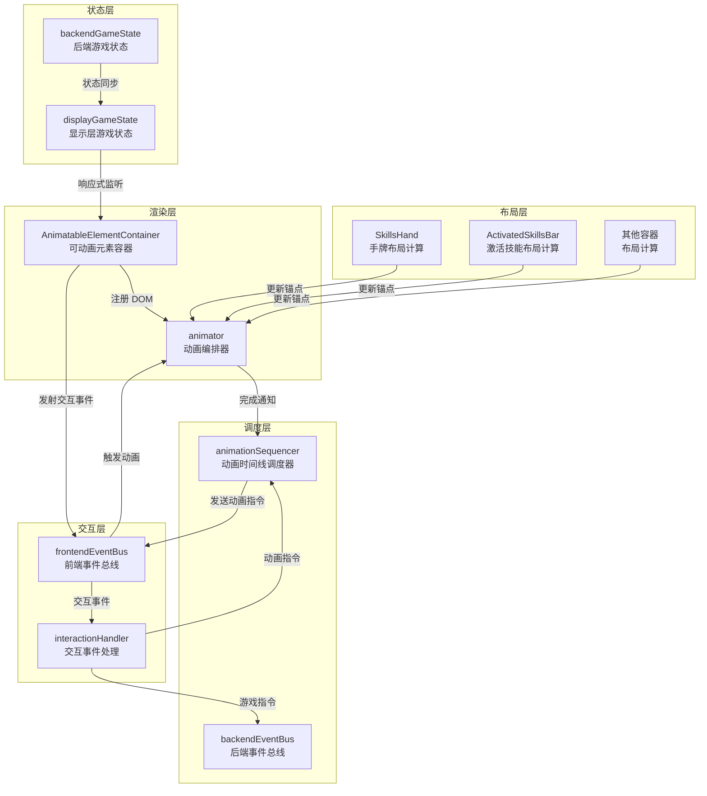
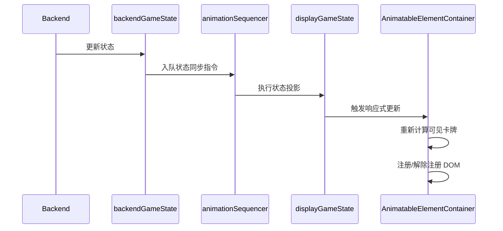
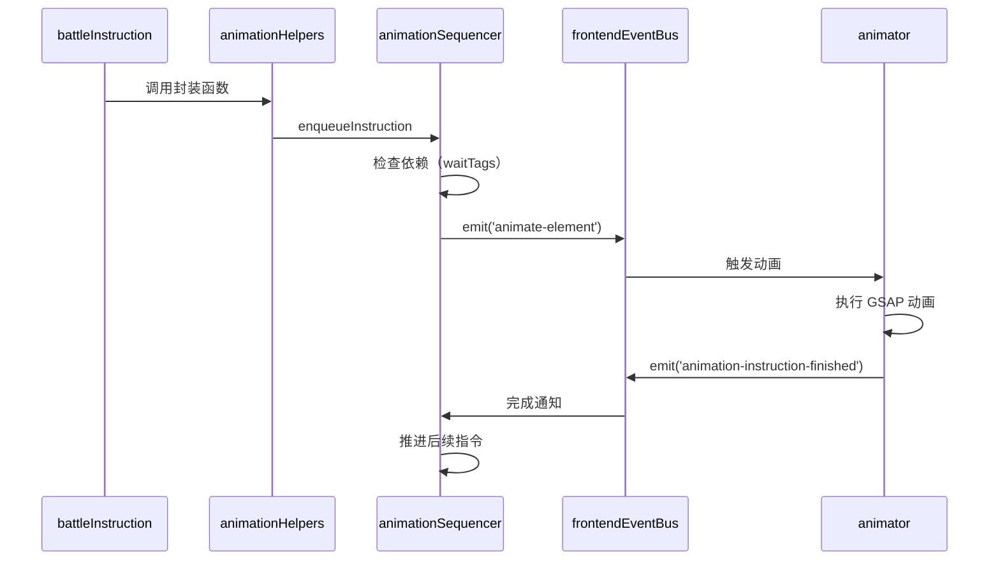
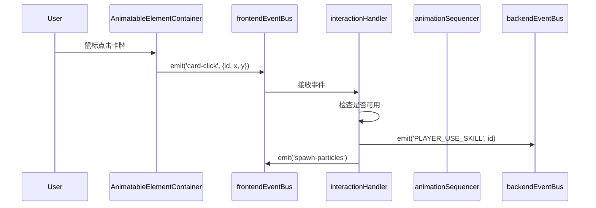
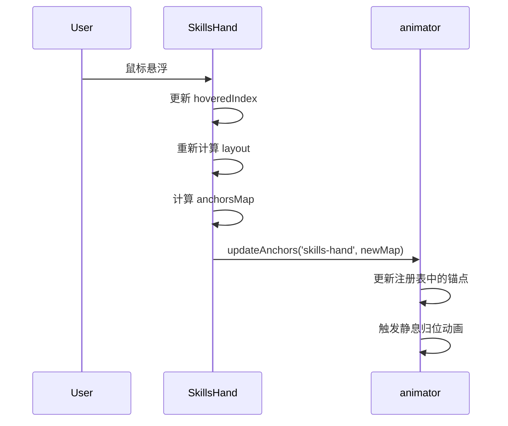
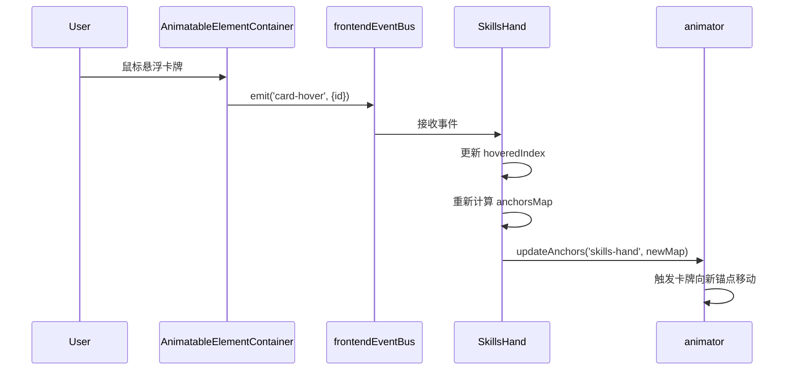

# 前端动画系统重构设计文档

## 概述

本设计文档定义了游戏前端动画系统的全面重构方案。当前系统由 `cardAnimationOrchestrator` 和卡牌容器组件配合完成动画，存在双轨制复杂性、职责混乱、扩展性不足等问题。重构目标是建立一个统一、清晰、高扩展性的动画架构，支持卡牌、面板等多种元素的动画编排。

### 重构动机

| 当前系统问题 | 影响 | 重构收益 |
|------------|------|---------|
| 卡牌分为容器卡牌和 ghost 卡牌双轨制 | 动画实现复杂度高，维护困难 | 统一管理所有可动画元素 |
| 容器职责过重（渲染 + 交互 + 动画协调） | 职责不清晰，代码耦合严重 | 明确容器、animator、渲染器边界 |
| 动画指令包含 legacy 兼容和特判代码 | 代码质量差，复杂度难以接受 | 抽象化指令格式，移除 legacy |
| 仅支持卡牌动画 | 无法支持面板等其他 UI 元素 | 扩展到多种元素类型 |
| 交互能力有限 | 难以实现拖拽、多卡协同等复杂交互 | 预留强交互控制能力 |

### 技术栈

- **动画引擎**：GSAP (GreenSock Animation Platform)
- **前端框架**：Vue 3
- **状态管理**：Reactive State (displayGameState, backendGameState)
- **事件通信**：frontendEventBus, backendEventBus

### 核心设计原则

1. **单一职责**：每个模块仅负责一项核心功能
2. **职责分离**：渲染、动画、交互、布局计算各自独立
3. **统一抽象**：所有可动画元素通过统一接口管理
4. **代码质量优先**：新框架的代码质量优先于与旧效果的完全一致性
5. **无需后向兼容**：移除旧代码仓库中糟糕的部分

## 架构设计

### 系统架构总览



### 核心组件职责

#### Animator（动画编排器）

**唯一职责**：管理所有可动画元素的 DOM 位置、缩放、旋转、透明度等 CSS 属性

**核心能力**：
- 维护 `id -> DOM` 注册表（取代 `cardDomRegistry`）
- 提供适配器机制（卡牌适配器、单位面板适配器）
- 接收来自 `animationSequencer` 的动画指令并执行
- 管理锚点信息，实现元素向锚点"静息归位"
- 动画完成后通知 `animationSequencer`

**特性**：
- 无状态执行器：不维护队列，所有排队逻辑由 sequencer 管理
- 适配器模式：支持不同类型元素的动画处理
- 锚点驱动：元素位置由锚点定义，实现声明式布局

#### AnimatableElementContainer（可动画元素容器）

**唯一职责**：渲染和维护所有可动画元素的 DOM 生命周期

**核心能力**：
- 监听 `displayGameState` 的变化，渲染所有在场可动画元素
- 将 DOM 元素注册到 `animator`
- 绑定基础交互事件（拖拽、悬浮、点击）
- 将交互事件发送到前端事件总线（携带元素 ID）
- 根据元素状态控制可见性（隐藏牌库中、已焚毁的卡牌）

**设计要点**：
- 所有卡牌都渲染：包括牌库、手牌、激活技能
- 通过 CSS 控制可见性：`visibility: hidden` 隐藏不在场卡牌
- 使用绝对定位：所有元素 `position: absolute`
- 指针事件管理：容器自身 `pointer-events: none`，元素 `pointer-events: auto`

#### 布局容器（SkillsHand、ActivatedSkillsBar 等）

**职责转变**：从"渲染器 + 交互处理器"变为"锚点计算器"

**核心能力**：
- **不再渲染** `SkillCard` 组件
- 计算所属卡牌的"锚点"位置（静息状态下应处的位置）
- 通过 API 将锚点信息告知 `animator`
- 处理布局相关的计算逻辑（悬浮展开、拖拽插槽位置等）

**锚点更新机制**：
```
computed: {
  anchorsMap() {
    const map = new Map();
    visibleSkills.forEach((skill, index) => {
      map.set(skill.uniqueID, {
        x: layout[index].x,
        y: layout[index].y,
        scale: layout[index].scale || 1,
        rotation: layout[index].rotation || 0
      });
    });
    return map;
  }
}

watch: {
  anchorsMap(newMap) {
    animator.updateAnchors('skills-hand', newMap);
  }
}
```

#### InteractionHandler（交互事件处理模块）

**唯一职责**：将基础交互事件转换为动画指令和后端指令

**核心能力**：
- 监听来自 `AnimatableElementContainer` 的交互事件
- 将拖拽操作转换为动画指令（使用低阻塞 `waitTags`）
- 将用户操作（如打出卡牌）转换为后端指令
- **不直接**操作 animator 或 DOM

**关键特性**：
- 拖拽使用低阻塞时间线：`waitTags: ['dragBlocker']`
- 结合游戏状态判断交互有效性
- 生成粒子效果等视觉反馈

## 数据流设计

### 状态同步流程



### 动画执行流程



### 交互处理流程



### 锚点更新流程



## Animator 详细设计

### 注册表结构

```
registry: Map<id, {
  element: HTMLElement,
  adapterType: string,
  adapter: Adapter,
  anchor: { x, y, scale?, rotation? } | null,
  currentAnimation: GSAP.Tween | null
}>
```

### 锚点管理

#### 容器锚点表

```
containerAnchors: Map<containerKey, Map<id, {
  x: number,
  y: number,
  scale?: number,
  rotation?: number
}>>
```

| 容器标识 | 说明 | 示例 |
|---------|------|------|
| `'skills-hand'` | 手牌区域 | 底部中央 |
| `'activated-skills'` | 激活技能区域 | 中部偏上 |
| `'overlay-skills'` | 悬浮技能面板 | 覆盖层 |

#### 全局锚点表

```
globalAnchors: Map<name, { x: number, y: number }>
```

| 锚点名称 | 说明 | 坐标来源 |
|---------|------|---------|
| `'center'` | 屏幕中心展示位置 | 中心锚点元素 |
| `'deck'` | 牌库位置 | 牌库图标元素 |
| `'discard'` | 弃牌堆位置 | 弃牌堆图标元素 |

### API 设计

#### 初始化

**方法签名**：
```
animator.init({
  overlayEl: HTMLElement,
  centerAnchorEl: HTMLElement,
  deckAnchorEl: HTMLElement,
  ...otherAnchorEls
})
```

**功能**：初始化 animator，设置全局锚点元素

#### DOM 注册管理

**注册元素**：
```
animator.register(id, element, adapterType)
```

**参数说明**：
| 参数 | 类型 | 说明 |
|-----|------|------|
| `id` | `string \| number` | 元素唯一标识（如卡牌的 `uniqueID`） |
| `element` | `HTMLElement` | DOM 元素 |
| `adapterType` | `'card' \| 'unit-panel'` | 适配器类型 |

**解除注册**：
```
animator.unregister(id)
```

**获取元素**：
```
animator.getElement(id): HTMLElement | null
```

#### 锚点管理

**更新容器锚点**：
```
animator.updateAnchors(containerKey, anchorsMap)
```

**参数说明**：
| 参数 | 类型 | 说明 |
|-----|------|------|
| `containerKey` | `string` | 容器标识 |
| `anchorsMap` | `Map<id, AnchorInfo>` | 元素 ID 到锚点的映射 |

**AnchorInfo 结构**：
```
{
  x: number,          // 锚点 X 坐标（绝对坐标）
  y: number,          // 锚点 Y 坐标（绝对坐标）
  scale?: number,     // 缩放（默认 1）
  rotation?: number   // 旋转角度（默认 0）
}
```

**设置全局锚点**：
```
animator.setGlobalAnchor(name, { x, y })
animator.setGlobalAnchorEl(name, element)
```

#### 动画执行

**执行动画**：
```
animator.animate({
  id: string | number,
  to: {
    x?: number,
    y?: number,
    scale?: number,
    rotate?: number,
    opacity?: number
  },
  duration: number,
  ease: string,
  anchor?: string,
  instructionId?: string
})
```

**参数说明**：
| 参数 | 类型 | 说明 |
|-----|------|------|
| `id` | `string \| number` | 元素 ID |
| `to` | `Object` | 目标属性 |
| `duration` | `number` | 持续时间（毫秒） |
| `ease` | `string` | 缓动函数（GSAP 格式） |
| `anchor` | `string` | 目标锚点名称（如果提供，x/y 从锚点计算） |
| `instructionId` | `string` | 完成回调标识 |

**动画到锚点（快捷方法）**：
```
animator.animateToAnchor(id, anchorName, {
  duration: number,
  ease: string,
  instructionId: string
})
```

**静息归位**：
```
animator.returnToRest(id, duration)
```

### 适配器机制

#### 适配器接口

所有适配器必须实现以下接口：

```
Adapter Interface:
- getDefaultProps(element): 获取元素的默认属性
- beforeAnimate(element, payload): 动画前的预处理
- afterAnimate(element, payload): 动画后的清理
- getRestPosition(id): 获取元素的静息位置
```

#### 卡牌适配器

**职责**：
- 处理卡牌特有的动画效果（如焚毁粒子效果）
- 管理卡牌的可见性（根据 `frontierSkills`、`activatedSkills` 状态）
- 提供卡牌的默认尺寸信息

**默认属性**：
```
{
  width: 198,
  height: 266
}
```

#### 单位面板适配器

**职责**：
- 处理面板的震动、击退动画
- 管理面板的受伤闪烁效果（与 `HurtAnimationWrapper` 协作）
- 提供面板的默认位置信息

**特殊效果**：
- `effect: 'shake'`：震动效果
- `effect: 'knockback'`：击退效果

### 静息归位机制

**设计原则**：
- 当元素没有正在播放的动画时，缓缓向其锚点位置靠拢
- 使用较慢的缓动（如 `power1.out`），避免与指令动画冲突
- 当元素接近锚点时停止归位动画

**触发条件**：
- 动画指令执行完毕
- 锚点位置发生变化（容器重新计算布局）

**实现方式**：
- 使用 `requestAnimationFrame` 循环（按需启用）
- 或者在锚点更新时主动触发一次归位动画

### 事件监听

Animator 监听前端事件总线上的以下事件：

| 事件名称 | 载荷 | 处理方式 |
|---------|------|---------|
| `animate-element` | `{ id, to, duration, ease, anchor, instructionId }` | 执行动画 |
| `animate-element-to-anchor` | `{ id, anchor, duration, ease, instructionId }` | 动画到锚点 |

**完成通知**：
```
frontendEventBus.emit('animation-instruction-finished', { 
  id: instructionId 
})
```

## AnimatableElementContainer 详细设计

### 组件模板结构

```
<div class="animatable-elements-container">
  <!-- 卡牌层 -->
  <div class="cards-layer">
    <SkillCard
      v-for="skill in allSkills"
      :key="skill.uniqueID"
      :skill="skill"
      :player="player"
      :class="{ hidden: !isCardVisible(skill) }"
      :ref="el => registerCard(el, skill.uniqueID)"
      :auto-register-in-registry="false"
      @mousedown="onCardMouseDown(skill.uniqueID, $event)"
      @mouseenter="onCardHover(skill.uniqueID, $event)"
      @mouseleave="onCardLeave(skill.uniqueID, $event)"
      @click="onCardClick(skill.uniqueID, $event)"
    />
  </div>
</div>
```

### 渲染策略

#### 卡牌数据源

**计算属性**：
```
allSkills: computed(() => {
  return displayGameState.player?.skills || []
})
```

**可见性判断**：
```
visibleCardIds: computed(() => {
  const ids = new Set()
  
  // 手牌
  displayGameState.player?.frontierSkills?.forEach(s => {
    ids.add(s.uniqueID)
  })
  
  // 激活技能
  displayGameState.player?.activatedSkills?.forEach(s => {
    ids.add(s.uniqueID)
  })
  
  return ids
})

isCardVisible(skill): boolean {
  return visibleCardIds.value.has(skill.uniqueID)
}
```

#### 渲染规则

| 卡牌状态 | 是否渲染 | 可见性 |
|---------|---------|-------|
| 在手牌中 | ✓ | 可见 |
| 在激活技能栏 | ✓ | 可见 |
| 在牌库中 | ✓ | 隐藏 |
| 已焚毁 | ✓ | 隐藏 |
| 在弃牌堆 | ✓ | 隐藏 |

**隐藏方式**：
```css
.cards-layer > .hidden {
  visibility: hidden;
}
```

### DOM 注册流程

**注册时机**：在 `nextTick` 后注册到 animator

```
registerCard(el, uniqueID) {
  if (!el || uniqueID == null) return
  
  cardRefs.value[uniqueID] = el
  
  nextTick(() => {
    const domEl = el.$el || el
    if (domEl) {
      animator.register(uniqueID, domEl, 'card')
    }
  })
}
```

**监听卡牌列表变化**：

```
watch(allSkills, (newSkills, oldSkills) => {
  const newIds = newSkills.map(s => s.uniqueID)
  
  // 找出移除的卡牌
  const removed = prevSkillIds.filter(id => !newIds.includes(id))
  removed.forEach(id => {
    animator.unregister(id)
    delete cardRefs.value[id]
  })
  
  prevSkillIds = newIds
})
```

### 交互事件绑定

**事件处理方法**：

```
onCardMouseDown(id, event) {
  frontendEventBus.emit('card-drag-start', { 
    id, 
    x: event.clientX, 
    y: event.clientY 
  })
}

onCardHover(id, event) {
  frontendEventBus.emit('card-hover', { id })
}

onCardLeave(id, event) {
  frontendEventBus.emit('card-leave', { id })
}

onCardClick(id, event) {
  frontendEventBus.emit('card-click', { 
    id, 
    x: event.clientX, 
    y: event.clientY 
  })
}
```

**事件载荷设计**：

| 事件名称 | 载荷字段 | 说明 |
|---------|---------|------|
| `card-drag-start` | `{ id, x, y }` | 卡牌拖拽开始 |
| `card-drag-move` | `{ id, x, y }` | 拖拽移动（由容器发送） |
| `card-hover` | `{ id }` | 卡牌悬浮 |
| `card-leave` | `{ id }` | 卡牌离开 |
| `card-click` | `{ id, x, y }` | 卡牌点击 |

### CSS 架构

**容器样式**：
```css
.animatable-elements-container {
  position: fixed;
  inset: 0;
  pointer-events: none;
  z-index: var(--z-animatable-elements);
}

.cards-layer {
  position: absolute;
  inset: 0;
}

.cards-layer > * {
  position: absolute;
  pointer-events: auto;
  transform-origin: center center;
  will-change: transform, opacity;
}

.cards-layer > .hidden {
  visibility: hidden;
}
```

**关键设计点**：
- 容器 `pointer-events: none`：容器自身不接收事件
- 卡牌 `pointer-events: auto`：卡牌本身接收事件
- `will-change`：提示浏览器优化动画性能
- `position: absolute`：所有卡牌使用绝对定位

## 布局容器重构设计

### 职责转变

| 原职责 | 新职责 |
|-------|-------|
| 渲染 `SkillCard` 组件 | **移除**：由 `AnimatableElementContainer` 渲染 |
| 处理交互事件 | **移除**：由 `interactionHandler` 处理 |
| 计算布局位置 | **保留**：计算锚点信息 |
| 绑定拖拽事件 | **保留**：仍监听拖拽进行布局调整 |

### SkillsHand 重构示例

#### 新模板结构

```
<template>
  <div class="skills-hand-root" ref="handRoot">
    <!-- 不再渲染卡牌 -->
    <!-- 可选：渲染占位符用于调试 -->
  </div>
</template>
```

#### 锚点计算

**计算属性**：

```
computed: {
  visibleSkillIds() {
    return displayGameState.player.frontierSkills.map(s => s.uniqueID)
  },
  
  anchorsMap() {
    const map = new Map()
    const layout = this.calculateLayout()
    
    this.visibleSkillIds.forEach((id, index) => {
      map.set(id, {
        x: layout[index].x,
        y: layout[index].y,
        scale: layout[index].scale || 1,
        rotation: layout[index].rotation || 0
      })
    })
    
    return map
  }
}
```

**监听锚点变化**：

```
watch: {
  anchorsMap: {
    deep: true,
    handler(newMap) {
      animator.updateAnchors('skills-hand', newMap)
    }
  }
}
```

#### 布局计算逻辑

**保留原有逻辑**：
- 基于容器宽度计算卡牌间距
- 悬浮时扩大间距
- 拖拽时计算插槽位置

**关键方法**：

```
calculateLayout() {
  const n = visibleSkills.length
  const containerWidth = this.containerWidth
  const cardWidth = this.cardWidth
  
  // 计算基础间距
  const gap = calculateGap(n, containerWidth, cardWidth)
  
  // 计算每张卡的位置
  const layout = []
  let x = startX
  
  for (let i = 0; i < n; i++) {
    layout.push({
      x: x,
      y: 0,
      scale: (i === hoveredIndex) ? 1.08 : 1.0,
      rotation: 0
    })
    x += cardWidth + gap
  }
  
  return layout
}
```

### 悬浮与拖拽的布局影响

#### 悬浮处理

**监听事件**：

```
frontendEventBus.on('card-hover', ({ id }) => {
  const index = visibleSkills.findIndex(s => s.uniqueID === id)
  hoveredIndex = index
  
  // anchorsMap 计算属性会自动重新计算
  // watch 会自动调用 animator.updateAnchors
})
```

**布局调整**：
- 悬浮卡周围的卡牌锚点向两侧偏移
- 悬浮卡本身放大（`scale: 1.08`）

#### 拖拽处理

**监听事件**：

```
frontendEventBus.on('card-drag-move', ({ id, x, y }) => {
  // 计算插槽位置
  const insertIndex = calculateInsertIndex(x, y)
  
  // 更新布局，其他卡牌让出空间
  // anchorsMap 会重新计算
})
```

**插槽计算**：
- 根据拖拽位置计算最近的插入点
- 其他卡牌的锚点向左/右移动

### 容器与 animator 的交互时序



### ActivatedSkillsBar 重构要点

**锚点计算**：
```
anchorsMap() {
  const map = new Map()
  const spacing = 210
  
  visibleSkills.forEach((skill, index) => {
    map.set(skill.uniqueID, {
      x: index * spacing,
      y: 0,
      scale: 1.0,
      rotation: 0
    })
  })
  
  return map
}
```

**特殊状态处理**：
- 咏唱状态：通过 CSS 添加发光效果
- 离开动画：监听 `card-transfer-start` 事件

## InteractionHandler 详细设计

### 模块结构

**初始化函数**：

```
function initInteractionHandler() {
  frontendEventBus.on('card-drag-start', handleCardDragStart)
  frontendEventBus.on('card-hover', handleCardHover)
  frontendEventBus.on('card-leave', handleCardLeave)
  frontendEventBus.on('card-click', handleCardClick)
}
```

**调用时机**：在应用启动时（`main.js` 或 `game.js`）调用

### 拖拽流程设计

#### 拖拽开始

**处理逻辑**：

```
function handleCardDragStart({ id, x, y }) {
  // 检查是否允许拖拽
  if (!isDraggable()) return
  
  // 记录拖拽状态
  draggingCardId = id
  dragStartPos = { x, y }
  
  // 发送动画指令：提升卡牌
  animationSequencer.enqueueInstruction({
    tags: ['drag', `drag-${id}`],
    waitTags: ['dragBlocker'], // 低阻塞
    durationMs: 0,
    start: ({ emit }) => {
      emit('animate-element', {
        id,
        to: { scale: 1.1, zIndex: 9999 },
        duration: 100,
        ease: 'power1.out'
      })
    }
  })
  
  // 绑定全局鼠标监听
  window.addEventListener('mousemove', handleDragMove)
  window.addEventListener('mouseup', handleDragEnd)
}
```

**关键设计**：
- 使用 `waitTags: ['dragBlocker']` 实现低阻塞
- 绑定全局鼠标事件，支持拖拽到任意位置

#### 拖拽移动

**处理逻辑**：

```
function handleDragMove(event) {
  const dx = event.clientX - dragStartPos.x
  const dy = event.clientY - dragStartPos.y
  
  // 发送动画指令：实时更新位置
  animationSequencer.enqueueInstruction({
    tags: ['drag-move', `drag-${draggingCardId}`],
    waitTags: ['dragBlocker'],
    durationMs: 0,
    start: ({ emit }) => {
      emit('animate-element', {
        id: draggingCardId,
        to: { 
          x: originalPos.x + dx, 
          y: originalPos.y + dy 
        },
        duration: 0
      })
    }
  })
  
  // 通知容器计算插槽位置
  frontendEventBus.emit('card-drag-move', { 
    id: draggingCardId, 
    x: event.clientX, 
    y: event.clientY 
  })
}
```

**节流优化**：
```
let lastDragUpdate = 0
const DRAG_THROTTLE_MS = 16 // ~60fps

function handleDragMove(event) {
  const now = Date.now()
  if (now - lastDragUpdate < DRAG_THROTTLE_MS) return
  lastDragUpdate = now
  
  // 处理拖拽...
}
```

#### 拖拽结束

**处理逻辑**：

```
function handleDragEnd(event) {
  window.removeEventListener('mousemove', handleDragMove)
  window.removeEventListener('mouseup', handleDragEnd)
  
  const target = determineDropTarget(event.clientX, event.clientY)
  
  if (target === 'play-area') {
    // 向后端发送打出卡牌指令
    backendEventBus.emit('PLAYER_USE_SKILL', draggingCardId)
    
  } else if (target === 'reorder') {
    // 重排序（由容器处理）
    
  } else {
    // 无效拖拽，飞回原位
    animationSequencer.enqueueInstruction({
      tags: ['drag-return'],
      waitTags: ['dragBlocker'],
      durationMs: 300,
      start: ({ emit }) => {
        emit('animate-element-to-anchor', {
          id: draggingCardId,
          duration: 300,
          ease: 'power2.out'
        })
      }
    })
  }
  
  draggingCardId = null
}
```

**目标判断**：

```
function determineDropTarget(x, y) {
  const screenHeight = window.innerHeight
  
  // 屏幕上半部分：打出卡牌
  if (y < screenHeight * 0.5) {
    return 'play-area'
  }
  
  // 屏幕下半部分：重排序
  return 'reorder'
}
```

### 悬浮处理

**处理逻辑**：

```
function handleCardHover({ id }) {
  // 通知容器更新布局
  // 容器的 watch 会自动调用 animator.updateAnchors
  
  // 显示提示框
  frontendEventBus.emit('show-card-tooltip', { id })
}

function handleCardLeave({ id }) {
  frontendEventBus.emit('hide-card-tooltip', { id })
}
```

### 点击处理

**处理逻辑**：

```
function handleCardClick({ id, x, y }) {
  // 检查游戏阶段
  if (displayGameState.gameStage !== 'battle') return
  if (displayGameState.isEnemyTurn) return
  
  // 查找卡牌
  const skill = displayGameState.player?.frontierSkills?.find(
    s => s.uniqueID === id
  )
  if (!skill || !canUseSkill(skill)) return
  
  // 发送后端指令
  backendEventBus.emit('PLAYER_USE_SKILL', id)
  
  // 生成粒子效果
  spawnParticlesAtPosition(x, y, skill.manaCost, skill.actionPointCost)
}
```

**粒子生成**：

```
function spawnParticlesAtPosition(x, y, manaCost, actionPointCost) {
  const particles = []
  
  // 魔法粒子（蓝色）
  if (manaCost > 0) {
    for (let i = 0; i < 2 + manaCost * 8; i++) {
      particles.push({
        x, y,
        vx: (Math.random() - 0.5) * 100,
        vy: (Math.random() - 0.5) * 100 - 50,
        color: '#2196f3',
        life: 2000,
        gravity: 400,
        size: 3 + Math.random() * 2
      })
    }
  }
  
  // 行动点粒子（金色）
  if (actionPointCost > 0) {
    for (let i = 0; i < 2 + actionPointCost * 8; i++) {
      particles.push({
        x, y,
        vx: (Math.random() - 0.5) * 100,
        vy: (Math.random() - 0.5) * 100 - 50,
        color: '#FFD700',
        life: 2000,
        gravity: 400,
        size: 3 + Math.random() * 2
      })
    }
  }
  
  if (particles.length > 0) {
    frontendEventBus.emit('spawn-particles', particles)
  }
}
```

### 低阻塞时间线机制

**设计原理**：
- 拖拽相关动画使用 `waitTags: ['dragBlocker']`
- 默认情况下，没有任何指令携带 `tags: ['dragBlocker']`
- 因此拖拽动画几乎不等待，保证实时响应

**阻塞场景**：
```
// 特殊场景：播放重要动画时阻塞拖拽
animationSequencer.enqueueInstruction({
  tags: ['dragBlocker', 'important-anim'],
  waitTags: ['all'],
  durationMs: 1000,
  start: ({ emit }) => {
    // 播放重要动画
  }
})
```

**阻塞效果表**：

| 场景 | 拖拽是否阻塞 | 说明 |
|-----|------------|------|
| 正常游戏 | 否 | 无 `dragBlocker` 标签的指令 |
| Boss 登场动画 | 是 | 携带 `dragBlocker` 标签 |
| 回合结束结算 | 是 | 携带 `dragBlocker` 标签 |

## 动画指令格式设计

### 移除 steps 机制

**旧格式（已废弃）**：

```
{
  id: 123,
  kind: 'centerThenDeck',
  steps: [
    { toAnchor: 'center', scale: 1.2, duration: 300, holdMs: 350 },
    { toAnchor: 'deck', scale: 0.5, duration: 400 }
  ]
}
```

**新格式（推荐）**：

```
// 第一步：飞到中心
enqueueInstruction({
  tags: ['card-anim', 'card-123-seq-1'],
  waitTags: ['all'],
  durationMs: 300,
  start: ({ emit }) => {
    emit('animate-element', {
      id: 123,
      anchor: 'center',
      to: { scale: 1.2 },
      duration: 300
    })
  }
})

// 停顿
enqueueDelay(350, { waitTags: ['card-123-seq-1'] })

// 第二步：飞回牌库
enqueueInstruction({
  tags: ['card-anim', 'card-123-seq-2'],
  waitTags: ['card-123-seq-1'],
  durationMs: 400,
  start: ({ emit }) => {
    emit('animate-element', {
      id: 123,
      anchor: 'deck',
      to: { scale: 0.5, rotate: 20 },
      duration: 400
    })
  }
})
```

### 封装辅助函数

#### 卡牌动画封装

**基础封装**：

```
function enqueueCardAnimation(id, animPayload, options = {}) {
  const autoTag = `card-${id}-${Date.now()}-${Math.random().toString(36).slice(2)}`
  
  return animationSequencer.enqueueInstruction({
    tags: ['card-anim', autoTag, ...(options.tags || [])],
    waitTags: options.waitTags || ['all'],
    durationMs: animPayload.duration || 0,
    start: ({ emit, id: instructionId }) => {
      emit('animate-element', {
        id,
        instructionId,
        ...animPayload
      })
    }
  })
}
```

**常用动画封装**：

| 函数名称 | 功能 | 参数 |
|---------|------|------|
| `enqueueCardAppear` | 卡牌从锚点飞入 | `(id, fromAnchor, toContainer, options)` |
| `enqueueCardBurn` | 卡牌焚毁动画 | `(id, options)` |
| `enqueueCardCenterThenDeck` | 飞到中心展示后回牌库 | `(id, options)` |
| `enqueueCardDropToDeck` | 飞到牌库并淡出 | `(id, options)` |
| `enqueueCardAppearInPlace` | 原地淡入 | `(id, options)` |

#### 面板动画封装

| 函数名称 | 功能 | 参数 |
|---------|------|------|
| `enqueuePanelHurt` | 面板受伤震动 | `(panelId, damage, options)` |
| `enqueuePanelKnockback` | 面板击退 | `(panelId, direction, distance, options)` |

#### 工具函数

| 函数名称 | 功能 | 参数 |
|---------|------|------|
| `enqueueDelay` | 延时指令 | `(durationMs, options)` |

### 使用示例

#### 卡牌焚毁序列

```
// 第一阶段：放大 + 粒子
const tag1 = enqueueCardAnimation(id, {
  to: { scale: 1.15 },
  duration: 350,
  particleEmit: {
    intervalMs: 70,
    burst: 10,
    particleConfig: {
      colors: ['#cf1818', '#ffd166', '#ff6f00'],
      size: [5, 10],
      speed: [40, 160],
      life: [800, 1400]
    }
  }
}, {
  tags: ['card-burn']
})

// 第二阶段：淡出 + 粒子
enqueueCardAnimation(id, {
  to: { opacity: 0, rotate: 0 },
  duration: 500,
  particleEmit: { /* 同上 */ }
}, {
  tags: ['card-burn'],
  waitTags: [tag1]
})
```

#### 面板受伤序列

```
// 震动
const tag1 = enqueuePanelHurt('player-panel', damage)

// 击退
enqueuePanelKnockback('player-panel', 'left', 50, {
  waitTags: [tag1]
})
```

## 迁移计划

### 阶段一：核心基础设施

**目标**：建立新动画系统的核心组件

#### 文件清单

| 操作 | 文件路径 | 说明 |
|-----|---------|------|
| ✓ 已存在 | `src/utils/animator.js` | 动画编排器 |
| ✓ 已存在 | `src/components/global/AnimatableElementContainer.vue` | 可动画元素容器 |
| ✓ 已存在 | `src/utils/interactionHandler.js` | 交互事件处理 |
| ✓ 已存在 | `src/utils/animationHelpers.js` | 动画辅助函数 |
| ✓ 已存在 | `src/data/animationSequencer.js` | 时间线调度器（无需修改） |

#### 检查清单

- [x] animator.js 实现注册表管理
- [x] animator.js 实现锚点管理
- [x] animator.js 实现动画执行
- [x] animator.js 实现适配器机制
- [x] AnimatableElementContainer.vue 渲染所有卡牌
- [x] AnimatableElementContainer.vue 注册 DOM 到 animator
- [x] AnimatableElementContainer.vue 绑定交互事件
- [x] interactionHandler.js 处理拖拽
- [x] interactionHandler.js 处理悬浮
- [x] interactionHandler.js 处理点击
- [x] animationHelpers.js 封装常用动画

### 阶段二：容器重构

**目标**：将布局容器转变为锚点计算器

#### 修改文件清单

| 文件路径 | 修改内容 | 状态 |
|---------|---------|------|
| `src/components/battle/SkillsHand.vue` | 移除渲染逻辑，保留锚点计算 | 部分完成 |
| `src/components/battle/ActivatedSkillsBar.vue` | 移除渲染逻辑，保留锚点计算 | 部分完成 |
| `src/components/battle/OverlaySkillsPanel.vue` | 移除渲染逻辑，保留锚点计算 | 待处理 |

#### 重构步骤

**SkillsHand.vue**：
1. 提取现有 `calculateLayout` 方法
2. 移除 `<SkillCard>` 渲染（模板中）
3. 添加 `anchorsMap` 计算属性
4. 添加 `watch(anchorsMap)` 调用 `animator.updateAnchors`
5. 保留悬浮/拖拽事件监听（用于布局调整）
6. 移除 `onSkillCardClicked` 等业务逻辑处理

**ActivatedSkillsBar.vue**：
1. 移除 `<SkillCard>` 渲染
2. 计算 `anchorsMap`（简单等距布局）
3. 保留 `card-transfer-start/end` 监听（用于状态管理）

### 阶段三：动画指令更新

**目标**：更新所有动画指令调用，移除 steps 机制

#### 修改文件清单

| 文件路径 | 修改内容 |
|---------|---------|
| `src/data/animationInstructionHelpers.js` | 更新封装函数，移除 steps 相关代码 |
| `src/data/battleInstructionHelpers.js` | 更新战斗指令中的动画调用 |
| `src/data/battleInstructions/*/*.js` | 更新各类战斗指令 |

#### 重构步骤

1. 将所有 `enqueueAnimateCardById({ steps: [...] })` 改为多次调用
2. 使用 `animationHelpers.js` 中的封装函数简化代码
3. 确保 `waitTags` 正确设置
4. 移除 `cardAnimationOrchestrator` 的调用

### 阶段四：面板集成

**目标**：将面板动画纳入 animator 管理

#### 修改文件清单

| 文件路径 | 修改内容 |
|---------|---------|
| `src/components/global/PlayerStatusPanel.vue` | 注册到 animator |
| `src/components/battle/EnemyStatusPanel.vue` | 注册到 animator |
| `src/components/global/HurtAnimationWrapper.vue` | 与 animator 协作 |

#### 重构步骤

1. 在 `mounted` 钩子中注册到 animator
2. 监听 `unit-hurt` 事件，调用 animator 动画
3. 保留内部视觉效果（闪烁、颜色变化）
4. 移除内部位置动画逻辑

### 阶段五：清理与优化

**目标**：移除旧代码，优化性能

#### 删除文件清单

| 文件路径 | 原因 |
|---------|------|
| `src/utils/cardAnimationOrchestrator.js` | 由 animator.js 取代 |
| `src/utils/cardDomRegistry.js` | 功能合并到 animator.js |

#### 优化清单

- [ ] 性能测试：大量卡牌动画
- [ ] 内存泄漏检查：DOM 注册/解除注册
- [ ] 事件监听清理：确保组件销毁时解绑
- [ ] CSS 优化：will-change 使用
- [ ] GSAP 配置优化：force3D, lazy 等参数

### 测试检查清单

| 测试项 | 说明 | 状态 |
|-------|------|------|
| 卡牌抽取动画 | 从牌库飞入手牌 | 待测试 |
| 手牌悬浮展开 | 悬浮时周围卡牌偏移 | 待测试 |
| 卡牌拖拽重排 | 休整阶段拖拽重排序 | 待测试 |
| 卡牌拖拽打出 | 战斗阶段拖拽打出 | 待测试 |
| 卡牌焚毁动画 | 放大 + 粒子 + 淡出 | 待测试 |
| 卡牌展示动画 | 飞到中心展示后回牌库 | 待测试 |
| 激活技能动画 | 飞入激活技能栏 | 待测试 |
| 玩家受伤震动 | 面板震动效果 | 待测试 |
| 敌人受伤震动 | 面板震动效果 | 待测试 |
| 多动画时间线 | 连续打出多张卡的依赖 | 待测试 |

## 技术细节补充

### CSS 架构规范

#### z-index 层级管理

| 层级 | z-index 范围 | 说明 |
|-----|-------------|------|
| 背景层 | 0-9 | 背景、静态装饰 |
| 游戏层 | 10-99 | 面板、卡牌容器 |
| 可动画元素层 | 100-999 | AnimatableElementContainer |
| 拖拽层 | 5000+ | 正在拖拽的元素 |
| 覆盖层 | 10000+ | 提示框、弹窗 |

#### CSS 变量定义

```css
:root {
  --z-background: 0;
  --z-game-panel: 50;
  --z-animatable-elements: 100;
  --z-dragging: 5000;
  --z-overlay: 10000;
}
```

### 性能优化策略

#### 注册表优化

**数据结构选择**：
- 使用 `Map` 而非普通对象（O(1) 查找）
- 使用 `WeakMap` 存储 DOM → ID 反向映射（自动垃圾回收）

**注册表结构**：
```
registry: Map<id, RegistryEntry>
domToId: WeakMap<HTMLElement, id>
```

**清理策略**：
- 及时清理已销毁元素的注册
- 在组件 `beforeUnmount` 时调用 `unregister`

#### GSAP 动画优化

**配置参数**：
```
gsap.to(element, {
  x, y, scale, rotation, opacity,
  duration,
  ease,
  force3D: true,        // 强制 GPU 加速
  lazy: false,          // 禁用延迟渲染（确保精确时序）
  overwrite: 'auto'     // 自动覆盖冲突动画
})
```

**优化要点**：
- `force3D: true`：利用 GPU 加速
- `lazy: false`：确保时序精确
- `overwrite: 'auto'`：避免动画冲突

#### 事件节流

**拖拽移动节流**：
```
let lastDragUpdate = 0
const DRAG_THROTTLE_MS = 16 // ~60fps

function handleDragMove(event) {
  const now = Date.now()
  if (now - lastDragUpdate < DRAG_THROTTLE_MS) return
  lastDragUpdate = now
  
  // 处理拖拽...
}
```

**悬浮事件防抖**：
```
let hoverTimeout = null

function handleCardHover({ id }) {
  clearTimeout(hoverTimeout)
  hoverTimeout = setTimeout(() => {
    // 更新布局
  }, 50)
}
```

### 边界情况处理

#### 动画冲突

**场景**：元素正在播放动画 A 时，收到动画 B 指令

**处理策略**：
- GSAP 的 `overwrite: 'auto'` 自动中断冲突属性
- Animator 在开始新动画前调用 `gsap.killTweensOf(element)`
- AnimationSequencer 通过 `waitTags` 避免指令级冲突

#### 元素未注册

**场景**：收到动画指令，但元素尚未注册（DOM 未渲染）

**处理策略**：
```
animate(payload) {
  const entry = this._registry.get(id)
  if (!entry) {
    console.warn('[animator] element not registered:', id)
    // 立即通知完成
    if (instructionId) {
      frontendEventBus.emit('animation-instruction-finished', { 
        id: instructionId 
      })
    }
    return
  }
  // 执行动画...
}
```

#### 锚点缺失

**场景**：元素已注册，但其锚点未设置

**处理策略**：
- 提供默认锚点（屏幕中心）
- 日志警告，提示容器未正确更新锚点

```
getAnchorPoint(anchorName) {
  // 从全局锚点获取
  const global = this._globalAnchors.get(anchorName)
  if (global) return global
  
  // 默认返回屏幕中心
  console.warn('[animator] anchor not found:', anchorName)
  return {
    x: window.innerWidth / 2,
    y: window.innerHeight / 2
  }
}
```

#### 快速状态切换

**场景**：用户快速切换场景（战斗 → 休整），大量卡牌需快速隐藏/显示

**处理策略**：
- `AnimatableElementContainer` 的 `watch` 使用 `flush: 'post'`
- 批量注册/解除注册，减少重绘
- 可选：使用 `requestIdleCallback` 延迟非关键动画

## 扩展性设计

### 未来扩展方向

#### 粒子系统集成

**当前方案**：粒子通过前端事件总线发送

**扩展方案**：内置到 Animator

```
animator.attachParticleEmitter(elementId, {
  trigger: 'burn',
  particles: {
    color: '#ff6600',
    count: 50,
    ...
  }
})
```

#### 轨迹动画

**功能**：支持沿贝塞尔曲线等复杂路径的动画

**接口设计**：
```
animator.animateAlongPath(elementId, pathPoints, duration)
```

**使用示例**：
```
animator.animateAlongPath('card-123', [
  { x: 100, y: 100 },
  { x: 200, y: 50, cp1x: 150, cp1y: 30 },
  { x: 300, y: 100 }
], 1000)
```

#### 动画预设库

**功能**：为常见动画提供预设，简化调用

**预设示例**：
```
animationPresets.cardShuffle(cardIds, duration)
animationPresets.explosionEffect(centerPos, intensity)
animationPresets.heroEntrance(panelId)
```

### 适配器扩展

**当前适配器**：
- `card`：卡牌适配器
- `unit-panel`：单位面板适配器

**未来可能的适配器**：

| 适配器类型 | 用途 | 特殊处理 |
|-----------|------|---------|
| `item` | 道具图标 | 获得时的飞入动画 |
| `particle-group` | 粒子组 | 批量粒子的统一控制 |
| `background` | 背景元素 | 视差滚动效果 |
| `dialog` | 对话框 | 打字机效果、淡入淡出 |

**扩展步骤**：
1. 实现适配器接口
2. 在 `adapters` 对象中注册
3. 在 `AnimatableElementContainer` 中渲染对应元素
4. 调用 `animator.register(id, element, adapterType)`

## 风险评估与缓解

### 主要风险

#### 风险一：时序复杂性

**风险描述**：复杂的动画依赖关系可能导致时序错误

**影响等级**：中

**缓解措施**：
- 充分利用 animationSequencer 的 `tags/waitTags` 机制
- 提供可视化调试工具，展示动画时间线
- 编写单元测试，验证关键动画序列
- 使用封装函数简化调用，减少手动管理依赖

#### 风险二：状态同步

**风险描述**：动画状态与游戏状态不一致（如卡牌已焚毁但仍显示）

**影响等级**：高

**缓解措施**：
- AnimatableElementContainer 严格监听 `displayGameState`
- 动画完成后确保调用适配器的 `afterAnimate` 清理
- 提供 `animator.reset()` 方法，紧急情况下强制同步状态
- 在状态变化时自动入队状态同步指令

## 开发规范

### 命名约定

| 类型 | 格式 | 示例 |
|-----|------|------|
| Animator 方法 | camelCase | `updateAnchors`, `animateToAnchor` |
| 事件名称 | kebab-case | `card-drag-start`, `animation-instruction-finished` |
| 适配器类型 | kebab-case | `'card'`, `'unit-panel'` |
| 标签（tags） | kebab-case | `'card-animation'`, `'drag-blocker'` |
| 容器标识 | kebab-case | `'skills-hand'`, `'activated-skills'` |

### 注释规范

**函数注释示例**：

```javascript
/**
 * 更新指定容器的锚点信息
 * @param {string} containerKey - 容器标识（如 'skills-hand'）
 * @param {Map<string|number, AnchorInfo>} anchorsMap - 元素ID到锚点的映射
 * @description
 * 当容器的布局发生变化时调用此方法。Animator 会触发元素向新锚点的缓动动画。
 * 如果元素正在播放其他动画，静息归位动画会在动画结束后自动触发。
 */
animator.updateAnchors(containerKey, anchorsMap)
```

**事件注释示例**：

```javascript
/**
 * 卡牌拖拽开始事件
 * @event card-drag-start
 * @type {Object}
 * @property {string|number} id - 卡牌 ID
 * @property {number} x - 鼠标 X 坐标
 * @property {number} y - 鼠标 Y 坐标
 */
frontendEventBus.emit('card-drag-start', { id, x, y })
```

### 代码组织规范

**文件结构**：
```
src/
├── utils/
│   ├── animator.js              # 动画编排器
│   ├── animationHelpers.js      # 动画辅助函数
│   └── interactionHandler.js    # 交互事件处理
├── components/
│   ├── global/
│   │   └── AnimatableElementContainer.vue
│   └── battle/
│       ├── SkillsHand.vue
│       └── ActivatedSkillsBar.vue
└── data/
    ├── animationSequencer.js
    └── animationInstructionHelpers.js
```

**模块依赖规则**：
- `animator` 不依赖任何游戏逻辑模块
- `AnimatableElementContainer` 依赖 `animator` 和 `displayGameState`
- `interactionHandler` 依赖 `animator`、`animationSequencer`、事件总线
- 布局容器仅依赖 `animator` 和 `displayGameState`
