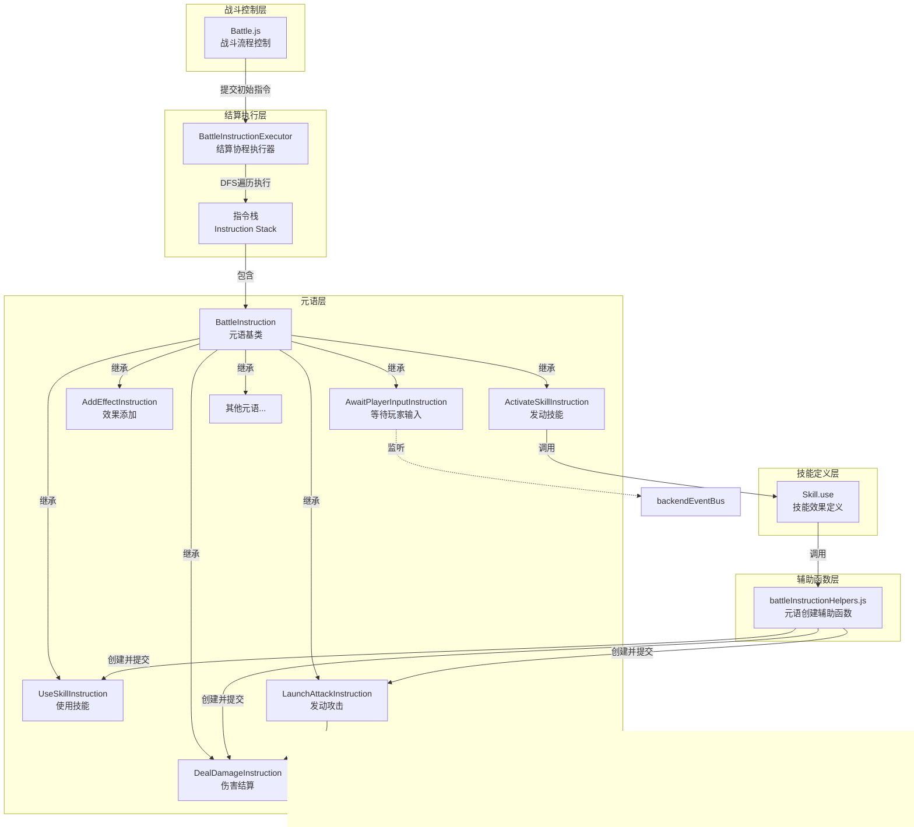

# 战斗结算系统重构设计文档

## 概述

### 重构目标
将当前基于技能多态和硬编码结算流程的战斗系统重构为基于**结算树遍历**和**元语（BattleInstruction）执行**的架构，以支持：
- 灵活的效果取消机制
- 结算过程中的异步用户输入等待
- 更清晰的结算逻辑组织
- 更好的可扩展性和可维护性

### 核心设计理念
结算过程抽象为**后端协程对结算树进行深度优先遍历**，结算树的节点为**元语（BattleInstruction）**。每个元语代表一个原子化的结算操作，元语可以动态生成子元语，形成树状结构。通过栈式执行和取消机制，实现灵活的结算控制流。

### 技术栈
- JavaScript ES6+ (async/await)
- 事件驱动架构（backendEventBus）
- 现有动画系统（animationSequencer）

---

## 架构设计

### 整体架构图



### 执行流程图


### 结算树遍历示例

以技能"重击"为例（造成伤害，若命中则赋予易伤）：


**执行序列**：
1. 迭代1：UseSkillInstruction.execute() → 创建ConsumeResourcesInstruction和ActivateSkillInstruction → 返回false
2. 迭代2：ConsumeResourcesInstruction.execute() → 消耗资源 → 返回true → 弹出栈
3. 迭代3：ActivateSkillInstruction.execute() → 创建LaunchAttackInstruction → 返回false
4. 迭代4：LaunchAttackInstruction.execute() → 创建DealDamageInstruction → 返回false
5. 迭代5：DealDamageInstruction.execute() → 修改状态、入队动画 → 返回true → 弹出栈
6. 迭代6：LaunchAttackInstruction.execute()（第2次）→ 检查结果 → 返回true → 弹出栈
7. 迭代7：ActivateSkillInstruction.execute()（第2次）→ 根据攻击结果创建AddEffectInstruction → 返回false
8. 迭代8：AddEffectInstruction.execute() → 修改效果 → 返回true → 弹出栈
9. 迭代9：ActivateSkillInstruction.execute()（第3次）→ 返回true → 弹出栈
10. 迭代10：UseSkillInstruction.execute()（第2次）→ 返回true → 弹出栈

---

## 核心组件设计

### BattleInstruction（元语基类）

**职责**：所有结算元语的抽象基类，提供通用状态管理和执行框架

**属性**：

| 属性名 | 类型 | 说明 |
|--------|------|------|
| uniqueID | String | 元语唯一标识符，用于调试和追踪 |
| parentInstruction | BattleInstruction \| null | 父元语引用，用于取消传播检查 |
| cancelled | Boolean | 取消标志，标记此元语是否被取消 |

**方法**：

| 方法签名 | 返回值 | 说明 |
|---------|--------|------|
| async execute() | Boolean | 执行元语逻辑，返回true表示执行完成，false表示需要继续执行 |
| canExecute() | Boolean | 检查元语是否可执行（自身及父链未被取消） |
| cancel() | void | 取消此元语 |

**设计细节**：

- **uniqueID生成**：使用时间戳+随机数确保唯一性
- **canExecute实现**：递归检查自身和父链的cancelled标志
- **execute抽象方法**：子类必须重写，实现具体结算逻辑
- **状态管理**：基类仅提供通用状态，具体元语通过多态维护自有状态

**取消传播机制**：


---

### BattleInstructionExecutor（结算执行器）

**职责**：管理元语栈，驱动结算树的深度优先遍历

**属性**：

| 属性名 | 类型 | 说明 |
|--------|------|------|
| instructionStack | Array&lt;BattleInstruction&gt; | 元语栈，用于DFS遍历 |
| isRunning | Boolean | 执行器运行状态标志 |

**方法**：

| 方法签名 | 返回值 | 说明 |
|---------|--------|------|
| submitInstruction(instruction) | void | 提交元语到栈顶（用于外部或元语内部提交新指令） |
| async runUntilComplete() | void | 运行结算协程直到栈为空 |
| getCurrentInstruction() | BattleInstruction \| null | 获取当前栈顶元语（用于子元语获取上下文） |

**执行逻辑伪代码**：

```
async runUntilComplete() {
  while (栈非空) {
    当前元语 = 栈顶元素
    
    if (!当前元语.canExecute()) {
      弹出栈顶  // 丢弃不可执行的元语
      continue
    }
    
    completed = await 当前元语.execute()
    
    if (completed) {
      弹出栈顶  // 此元语及其子树已完成
    }
    // 若completed=false，保留在栈顶，下次迭代继续执行
  }
}
```

**并发控制**：
- 同一时间只能有一个结算协程运行（通过isRunning标志保护）
- 使用async/await实现异步等待，不阻塞主线程
- 支持元语内部await用户输入或其他异步操作

---

### 核心元语类型定义

#### UseSkillInstruction（使用技能元语）

**职责**：表示玩家使用一张技能卡的完整流程（资源消耗 + 技能发动）

**特有属性**：

| 属性名 | 类型 | 说明 |
|--------|------|------|
| player | Player | 使用技能的玩家 |
| skill | Skill | 要使用的技能对象 |
| enemy | Enemy | 目标敌人 |
| executionStage | Number | 内部执行阶段（0=初始，1=资源消耗完成，2=发动完成） |

**执行逻辑**：

| 阶段 | 操作 | 返回值 |
|------|------|--------|
| 0 | 创建ConsumeSkillResourcesInstruction并提交，stage→1 | false |
| 1 | 创建ActivateSkillInstruction并提交，stage→2 | false |
| 2 | 触发技能使用后事件，调用handleSkillAfterUse | true |

---

#### ConsumeSkillResourcesInstruction（消耗技能资源元语）

**职责**：消耗技能的行动力、魏启、充能等资源

**特有属性**：

| 属性名 | 类型 | 说明 |
|--------|------|------|
| player | Player | 玩家对象 |
| skill | Skill | 技能对象 |

**执行逻辑**：
- 调用player.consumeActionPoints()
- 调用player.consumeMana()
- 调用skill.consumeUses()
- 返回true（一次性完成）

---

#### ActivateSkillInstruction（发动技能元语）

**职责**：执行技能的实际效果逻辑（调用skill.use方法）

**特有属性**：

| 属性名 | 类型 | 说明 |
|--------|------|------|
| player | Player | 玩家对象 |
| skill | Skill | 技能对象 |
| enemy | Enemy | 敌人对象 |
| stage | Number | 技能内部阶段（对应skill.use的stage参数） |

**执行逻辑**：
- 调用processSkillActivationEffects()处理技能发动时效果
- 检查战斗是否结束，若结束则取消自身并返回true
- 调用skill.use(player, enemy, stage)
- 若skill.use返回true，发送SKILL_USED事件并返回true
- 否则stage++并返回false（下次继续调用skill.use）

**与现有技能系统的兼容**：
- 保留skill.use方法作为技能效果定义入口
- skill.use内部可调用辅助函数创建并提交新元语
- 支持多阶段技能（通过stage参数）

---

#### LaunchAttackInstruction（发动攻击元语）

**职责**：处理完整的攻击流程（攻击前效果 → 伤害计算 → 伤害结算 → 攻击后效果）

**特有属性**：

| 属性名 | 类型 | 说明 |
|--------|------|------|
| attacker | Unit | 攻击者 |
| target | Unit | 目标 |
| baseDamage | Number | 基础伤害值 |
| executionStage | Number | 执行阶段（0=初始，1=伤害结算完成） |
| damageInstruction | DealDamageInstruction | 保存的伤害结算元语引用 |
| attackResult | Object | 攻击结果（包含passThoughDamage、hpDamage、dead等） |

**执行逻辑**：

| 阶段 | 操作 | 返回值 |
|------|------|--------|
| 0 | 计算最终伤害（攻击力+效果修正+防御减免），创建DealDamageInstruction并保存引用，stage→1 | false |
| 1 | 从damageInstruction读取结果保存到attackResult，若目标未死亡则调用processAttackFinishEffects，返回true | true |

**伤害计算流程**：
1. 基础伤害 + 攻击者攻击力
2. 调用processPostAttackEffects（力量、虚弱等）
3. 调用processAttackTakenEffects（格挡、闪避等）
4. 减去目标防御力

---

#### DealDamageInstruction（伤害结算元语）

**职责**：直接造成伤害（跳过攻击流程，用于技能直伤、持续伤害等）

**特有属性**：

| 属性名 | 类型 | 说明 |
|--------|------|------|
| source | Unit \| null | 伤害来源（可为null） |
| target | Unit | 目标 |
| damage | Number | 伤害值 |
| penetrateDefense | Boolean | 是否穿透防御 |
| result | Object | 结算结果（passThoughDamage、hpDamage、dead） |

**执行逻辑**：
- 若不穿透防御，减去目标防御力
- 计算护盾/生命损耗
- 更新target.shield和target.hp
- 入队受伤动画（enqueueHurtAnimation）
- 添加战斗日志
- 调用processDamageTakenEffects
- 若目标死亡，入队死亡动画
- 将结果保存到result属性
- 返回true（一次性完成）

---

#### AddEffectInstruction（添加效果元语）

**职责**：为目标添加状态效果（燃烧、格挡等）

**特有属性**：

| 属性名 | 类型 | 说明 |
|--------|------|------|
| target | Unit | 目标单位 |
| effectName | String | 效果名称 |
| stacks | Number | 层数 |

**执行逻辑**：
- 调用target.addEffect(effectName, stacks)
- 若目标是玩家，触发EFFECT_CHANGED事件
- 返回true

---

#### GainShieldInstruction（获得护盾元语）

**职责**：为目标提供护盾

**特有属性**：

| 属性名 | 类型 | 说明 |
|--------|------|------|
| caster | Unit | 施法者 |
| target | Unit | 目标 |
| shieldAmount | Number | 护盾值 |

**执行逻辑**：
- 修改target.shield
- 添加治疗日志
- 返回true

---

#### ApplyHealInstruction（治疗元语）

**职责**：为目标恢复生命值

**特有属性**：

| 属性名 | 类型 | 说明 |
|--------|------|------|
| target | Unit | 目标 |
| healAmount | Number | 治疗量 |

**执行逻辑**：
- 计算实际治疗量（不超过maxHp）
- 修改target.hp
- 入队治疗动画（hpDamage为负值）
- 返回true

---

#### DrawSkillCardInstruction（抽卡元语）

**职责**：从牌库抽取指定数量的卡牌

**特有属性**：

| 属性名 | 类型 | 说明 |
|--------|------|------|
| player | Player | 玩家对象 |
| count | Number | 抽卡数量 |
| drawnSkills | Array&lt;Skill&gt; | 已抽取的卡牌列表 |

**执行逻辑**：
- 检查手牌上限和牌库剩余
- 将卡牌从backupSkills移到frontierSkills
- 入队状态同步和卡牌动画
- 触发SKILL_DRAWN事件
- 将抽到的卡牌保存到drawnSkills属性
- 返回true

---

#### DropSkillCardInstruction（弃卡元语）

**职责**：将卡牌从手牌/咏唱位丢回牌库

**特有属性**：

| 属性名 | 类型 | 说明 |
|--------|------|------|
| player | Player | 玩家对象 |
| skillID | String | 卡牌唯一ID |
| deckPosition | Number | 插入牌库的位置（-1表示牌库底） |

**执行逻辑**：
- 从frontierSkills/activatedSkills/overlaySkills中查找并移除
- 插入到backupSkills指定位置
- 入队卡牌动画
- 触发SKILL_DROPPED事件
- 返回true

---

#### BurnSkillCardInstruction（焚毁卡牌元语）

**职责**：永久移除卡牌（移入焚毁区）

**特有属性**：

| 属性名 | 类型 | 说明 |
|--------|------|------|
| player | Player | 玩家对象 |
| skillID | String | 卡牌唯一ID |

**执行逻辑**：
- 调用skill.onLeaveBattle()
- 从所有列表中移除卡牌
- 添加到burntSkills
- 入队焚毁动画
- 触发SKILL_BURNT事件
- 返回true

---

#### DiscoverSkillCardInstruction（发现卡牌元语）

**职责**：创建新卡牌并添加到玩家牌组

**特有属性**：

| 属性名 | 类型 | 说明 |
|--------|------|------|
| player | Player | 玩家对象 |
| skill | Skill | 新卡牌对象 |
| destination | String | 目标位置（'skills-hand'或'deck'） |

**执行逻辑**：
- 将卡牌添加到overlaySkills
- 入队出现动画
- 触发SKILL_DISCOVERED事件
- 根据destination调用DrawSkillCardInstruction或DropSkillCardInstruction
- 若手牌已满，调用BurnSkillCardInstruction
- 返回true

---

#### AwaitPlayerInputInstruction（等待玩家输入元语）

**职责**：暂停结算流程，等待玩家做出选择（核心异步元语）

**特有属性**：

| 属性名 | 类型 | 说明 |
|--------|------|------|
| inputType | String | 输入类型（'selectCard'、'selectTarget'等） |
| options | Object | 输入选项配置（如可选卡牌列表、提示文本等） |
| result | Any | 玩家输入结果 |
| eventListener | Function | 事件监听器引用 |

**执行逻辑**：
1. 创建Promise，保存resolve函数
2. 在backendEventBus上监听对应的输入事件
3. 向前端发送输入请求事件（触发UI显示）
4. await Promise（阻塞结算流程）
5. 收到玩家输入后，resolve Promise，保存结果到result属性
6. 移除事件监听器
7. 返回true

**支持的输入类型**：

| 类型 | 说明 | options参数 | 返回结果 |
|------|------|------------|---------|
| selectCard | 从多张卡牌中选择 | {cards, minCount, maxCount, prompt} | Array&lt;Skill&gt; |
| selectTarget | 选择目标单位 | {targets, prompt} | Unit |
| confirm | 确认操作 | {prompt} | Boolean |

**使用示例场景**：
技能"神秘发现"：发现3张随机卡牌，选择1张获得

```
// 在ActivateSkillInstruction.execute中
const discoverInstruction = new AwaitPlayerInputInstruction({
  inputType: 'selectCard',
  options: {
    cards: [随机卡牌1, 随机卡牌2, 随机卡牌3],
    minCount: 1,
    maxCount: 1,
    prompt: '选择一张卡牌获得'
  }
})
submitInstruction(discoverInstruction)

// 等待此元语完成后，可通过discoverInstruction.result获取玩家选择
```

---

## 辅助函数设计

### battleInstructionHelpers.js

**职责**：提供便捷的元语创建和提交函数，简化技能设计者的使用

**核心函数**：

| 函数签名 | 说明 |
|---------|------|
| submitInstruction(instruction) | 提交元语到当前执行器 |
| createAndSubmitLaunchAttack(attacker, target, damage) | 创建并提交攻击元语 |
| createAndSubmitDealDamage(source, target, damage, penetrateDefense) | 创建并提交伤害元语 |
| createAndSubmitAddEffect(target, effectName, stacks) | 创建并提交效果元语 |
| createAndSubmitGainShield(caster, target, shieldAmount) | 创建并提交护盾元语 |
| createAndSubmitApplyHeal(target, healAmount) | 创建并提交治疗元语 |
| createAndSubmitDrawSkillCard(player, count) | 创建并提交抽卡元语 |
| createAndSubmitDropSkillCard(player, skillID, deckPosition) | 创建并提交弃卡元语 |
| createAndSubmitBurnSkillCard(player, skillID) | 创建并提交焚毁元语 |
| createAndSubmitDiscoverSkillCard(player, skill, destination) | 创建并提交发现元语 |
| createAndSubmitAwaitPlayerInput(inputType, options) | 创建并提交等待输入元语 |

**设计原则**：
- 函数命名清晰，`createAndSubmit`前缀表示创建并提交
- 参数顺序符合直觉（主体 → 目标 → 数值 → 配置）
- 返回创建的元语实例，方便调用者保存引用以读取结果
- 内部自动调用submitInstruction提交到执行器

**函数实现模式**：
```
function createAndSubmitXXX(参数列表) {
  const instruction = new XXXInstruction({
    ...参数映射
  })
  submitInstruction(instruction)
  return instruction
}
```

---

### 全局执行器管理

**全局单例**：
```
let globalBattleInstructionExecutor = null

function getGlobalExecutor() {
  if (!globalBattleInstructionExecutor) {
    globalBattleInstructionExecutor = new BattleInstructionExecutor()
  }
  return globalBattleInstructionExecutor
}

function submitInstruction(instruction) {
  getGlobalExecutor().submitInstruction(instruction)
}
```

**生命周期**：
- 战斗开始时初始化执行器
- 战斗结束时清理执行器
- 保证同一时间只有一个活跃的执行器

---

## 迁移策略

### 阶段划分

#### 第一阶段：框架搭建
1. 实现BattleInstruction基类
2. 实现BattleInstructionExecutor执行器
3. 搭建全局执行器管理机制
4. 实现基础元语类型（DealDamage、AddEffect等）

#### 第二阶段：核心逻辑迁移
1. 重构battleUtils.js中的核心函数为元语
2. 实现战斗流程元语（UseSkill、ActivateSkill、LaunchAttack）
3. 实现卡牌操作元语（DrawSkillCard、DropSkillCard等）
4. 实现异步输入元语（AwaitPlayerInputInstruction）
5. 创建battleInstructionHelpers.js辅助函数库

#### 第三阶段：技能系统适配（由内容创作者完成）
1. 修改技能skill.use方法，改为调用辅助函数创建元语
2. 测试并修复各技能的兼容性问题
3. 利用新机制实现复杂技能（多选项、异步输入等）

### 兼容性保障

**双轨运行策略**（过渡期）：
- 保留旧的battleUtils函数，标记为@deprecated
- 新函数与旧函数并存，逐步迁移调用点
- 通过feature flag控制是否启用新系统

**技能迁移模板**：

旧实现：
```
use(player, enemy, stage) {
  launchAttack(player, enemy, this.damage)
  return true
}
```

新实现：
```
use(player, enemy, stage) {
  createAndSubmitLaunchAttack(player, enemy, this.damage)
  return true
}
```

---

## 高级特性设计

### 异步输入与结算暂停

**场景**：技能"神秘商人" - 展示3张随机卡牌，选择1张加入手牌

**实现流程**：


**关键技术点**：
- 使用Promise + async/await实现协程式暂停
- 通过事件总线与前端通信
- 元语保存输入结果供后续元语读取

---

### 效果取消与条件执行

**场景**：技能"连续攻击" - 攻击3次，若敌人死亡则停止

**实现机制**：

```mermaid
graph TD
    A[ActivateSkillInstruction<br/>连续攻击] -->|第1次execute| B[LaunchAttackInstruction#1<br/>第1次攻击]
    A -->|创建但未执行| C[LaunchAttackInstruction#2<br/>第2次攻击]
    A -->|创建但未执行| D[LaunchAttackInstruction#3<br/>第3次攻击]
    
    B -->|execute| E{敌人死亡?}
    E -->|是| F[设置C.cancelled=true<br/>设置D.cancelled=true]
    E -->|否| G[正常返回true]
    
    F --> H[C.canExecute() = false]
    F --> I[D.canExecute() = false]
    
    H --> J[执行器跳过C]
    I --> K[执行器跳过D]
    
    style C fill:#ffcccc
    style D fill:#ffcccc
    style F fill:#ff9999
```

**实现要点**：
- 父元语预先创建所有子元语并提交
- 根据执行结果动态设置子元语的cancelled标志
- 执行器在execute前检查canExecute，自动跳过被取消的元语

---

### 多阶段技能展开

**场景**：技能"蓄力打击" - 第1阶段攻击，第2阶段根据伤害获得护盾

**元语内部状态管理**：

| 执行次数 | executionStage | 操作 | 返回值 |
|---------|---------------|------|--------|
| 1 | 0 | 创建LaunchAttackInstruction，stage→1 | false |
| 2 | 1 | 读取攻击结果，创建GainShieldInstruction，stage→2 | false |
| 3 | 2 | 完成 | true |

**代码示例**：
```
// ActivateSkillInstruction的execute方法
async execute() {
  if (this.executionStage === 0) {
    const attackInst = createAndSubmitLaunchAttack(...)
    this.attackInstruction = attackInst
    this.executionStage = 1
    return false
  }
  
  if (this.executionStage === 1) {
    const damage = this.attackInstruction.attackResult.hpDamage
    if (damage > 0) {
      createAndSubmitGainShield(this.player, this.player, damage)
    }
    this.executionStage = 2
    return false
  }
  
  return true
}
```

---

## 数据结构定义

### BattleInstruction基类结构

| 字段 | 类型 | 默认值 | 说明 |
|------|------|--------|------|
| uniqueID | String | 自动生成 | 唯一标识符 |
| parentInstruction | BattleInstruction \| null | null | 父元语引用 |
| cancelled | Boolean | false | 取消标志 |

### ExecuteResult（执行结果）

虽然execute直接返回Boolean，但元语内部可定义result属性保存详细结果：

| 元语类型 | result结构 |
|---------|-----------|
| DealDamageInstruction | {passThoughDamage, hpDamage, dead} |
| LaunchAttackInstruction | {passThoughDamage, hpDamage, dead} |
| DrawSkillCardInstruction | {drawnSkills: Skill[]} |
| AwaitPlayerInputInstruction | 根据inputType而定 |

---

## 事件总线交互

### 新增后端事件

| 事件名 | 触发时机 | 参数 |
|--------|---------|------|
| INSTRUCTION_EXECUTED | 元语执行完成 | {instruction, result} |
| BATTLE_SETTLEMENT_START | 结算协程开始 | {} |
| BATTLE_SETTLEMENT_COMPLETE | 结算协程完成 | {} |
| REQUEST_PLAYER_INPUT | 请求玩家输入 | {inputType, options, instructionID} |

### 监听前端事件

| 事件名 | 触发方 | 参数 | 用途 |
|--------|--------|------|------|
| PLAYER_INPUT_RESPONSE | 前端UI | {instructionID, result} | 响应玩家输入请求 |

---

## 测试策略

### 单元测试覆盖

**元语类测试**：
- BattleInstruction基类的canExecute逻辑
- 每个具体元语的execute正确性
- 取消机制的传播测试
- 异步元语的Promise正确性

**执行器测试**：
- 栈操作正确性（push/pop/peek）
- DFS遍历顺序验证
- 取消元语的跳过逻辑
- 异步等待的正确性

**集成测试场景**：
- 简单攻击流程（UseSkill → Activate → LaunchAttack → DealDamage）
- 多阶段技能（条件展开子元语）
- 异步输入流程（发现卡牌并等待选择）
- 取消机制（敌人死亡取消后续攻击）

---

## 性能考量

### 内存管理
- 元语对象在弹出栈后可被垃圾回收
- 避免循环引用（仅保存parentInstruction，不保存children）
- 大型结算树（如连续攻击50次）的栈深度可控

### 执行效率
- 元语execute应避免耗时操作（如大量计算）
- 动画入队是同步的，不阻塞结算
- 异步等待仅在必要时使用（用户输入）

### 调试支持
- uniqueID便于追踪元语执行轨迹
- 可添加日志记录每个元语的execute调用
- 支持导出结算树结构用于可视化调试

---

## 风险评估与缓解

### 风险1：栈溢出
**描述**：极端情况下结算树过深导致栈溢出  
**缓解**：
- 设置栈深度上限（如1000层）
- 检测递归深度，超限时终止并报错
- 优化元语设计，避免不必要的深层嵌套

### 风险2：无限循环
**描述**：元语逻辑错误导致execute永远返回false  
**缓解**：
- 为每个元语设置执行次数上限
- 执行器检测同一元语的execute调用次数
- 开发阶段严格测试元语的完成条件

### 风险3：异步死锁
**描述**：等待输入的元语未收到响应，结算永久阻塞  
**缓解**：
- 为异步等待设置超时机制
- 前端保证输入事件必定响应
- 提供手动恢复接口（开发模式）

### 风险4：状态不一致
**描述**：元语修改状态后被取消，导致状态不一致  
**缓解**：
- 明确取消只影响"未执行"的元语
- 已执行的元语不回滚状态
- 文档明确说明取消语义

### 风险5：迁移成本
**描述**：大量现有技能需要修改代码  
**缓解**：
- 提供详细的迁移文档和示例
- 辅助函数与旧API保持相似
- 分批次迁移，优先迁移简单技能

---

## 扩展性设计

### 新增元语类型
框架支持轻松扩展新元语：
1. 继承BattleInstruction基类
2. 实现execute方法
3. 定义特有属性和result结构
4. 在battleInstructionHelpers中添加辅助函数

### 支持新的异步输入类型
扩展AwaitPlayerInputInstruction的inputType：
- 添加新的事件监听逻辑
- 定义新的options和result结构
- 前端实现对应的UI组件

### 支持元语生命周期钩子（可选）
未来可扩展：
- onSubmit：元语被提交到栈时调用
- onCancel：元语被取消时调用
- onComplete：元语执行完成时调用

### 支持元语组合模式（可选）
未来可实现复合元语：
- SequentialInstruction：顺序执行多个子元语
- ParallelInstruction：并行执行多个子元语（需修改执行器）
- ConditionalInstruction：条件分支元语

---

## 关键决策记录

### 决策1：使用栈而非递归实现DFS
**理由**：
- 显式栈可控性更好，便于调试
- 避免JavaScript调用栈限制
- 支持暂停和恢复执行流

### 决策2：execute返回Boolean而非枚举
**理由**：
- 简化接口，只需关心"完成"或"未完成"
- 复杂结果通过元语的result属性传递
- 符合JavaScript惯例

### 决策3：不实现状态回滚机制
**理由**：
- 回滚逻辑复杂，容易引入bug
- 游戏设计上不需要撤销已发生的效果
- 取消只影响未执行的元语

### 决策4：保留skill.use作为效果入口
**理由**：
- 最小化现有技能代码的改动
- 技能设计者熟悉的API
- 内部调用辅助函数即可适配新架构

### 决策5：全局单例执行器
**理由**：
- 战斗结算是全局唯一的流程
- 简化元语提交逻辑（无需传递executor参数）
- 便于统一管理和调试

---

## 实现优先级

### P0（核心功能，必须实现）
- BattleInstruction基类及canExecute逻辑
- BattleInstructionExecutor及栈式执行
- DealDamageInstruction、AddEffectInstruction等基础元语
- LaunchAttackInstruction、UseSkillInstruction、ActivateSkillInstruction
- battleInstructionHelpers辅助函数库
- AwaitPlayerInputInstruction及异步输入机制

### P1（重要功能，优先实现）
- DrawSkillCardInstruction、DropSkillCardInstruction等卡牌操作元语
- GainShieldInstruction、ApplyHealInstruction
- BurnSkillCardInstruction、DiscoverSkillCardInstruction
- 全局执行器管理机制
- 取消机制的完整测试

### P2（可延后，按需实现）
- 执行次数上限保护
- 详细的执行日志和调试工具
- 元语生命周期钩子
- 性能监控和优化

---

## 接口规范

### BattleInstruction接口定义

```
接口名称：BattleInstruction

属性：
- uniqueID: String（必需，自动生成）
- parentInstruction: BattleInstruction | null（可选，默认null）
- cancelled: Boolean（必需，默认false）

方法：
- async execute(): Boolean
  功能：执行元语逻辑
  返回：true表示执行完成，false表示需要继续执行
  
- canExecute(): Boolean
  功能：检查元语是否可执行
  返回：true表示可执行，false表示已被取消
  
- cancel(): void
  功能：取消此元语
```

### BattleInstructionExecutor接口定义

```
接口名称：BattleInstructionExecutor

属性：
- instructionStack: Array<BattleInstruction>（私有）
- isRunning: Boolean（私有）

方法：
- submitInstruction(instruction: BattleInstruction): void
  功能：提交元语到栈顶
  
- async runUntilComplete(): void
  功能：运行结算协程直到栈为空
  
- getCurrentInstruction(): BattleInstruction | null
  功能：获取当前栈顶元语
```

### 辅助函数接口规范

```
所有辅助函数遵循命名规范：
- createAndSubmit{ElementType}(参数列表): {ElementType}Instruction

参数顺序约定：
1. 主体单位（player/attacker/caster）
2. 目标单位（target/enemy）
3. 数值参数（damage/amount/count）
4. 配置对象（options）

返回值：
- 返回创建的元语实例，供调用者保存引用
```

---

## 文件组织结构

```
src/data/
├── battleInstructions/
│   ├── BattleInstruction.js           # 元语基类
│   ├── BattleInstructionExecutor.js   # 执行器
│   ├── core/                          # 核心元语
│   │   ├── UseSkillInstruction.js
│   │   ├── ActivateSkillInstruction.js
│   │   ├── ConsumeSkillResourcesInstruction.js
│   │   └── ...
│   ├── combat/                        # 战斗相关元语
│   │   ├── LaunchAttackInstruction.js
│   │   ├── DealDamageInstruction.js
│   │   ├── GainShieldInstruction.js
│   │   ├── ApplyHealInstruction.js
│   │   └── ...
│   ├── effect/                        # 效果相关元语
│   │   ├── AddEffectInstruction.js
│   │   └── ...
│   ├── card/                          # 卡牌操作元语
│   │   ├── DrawSkillCardInstruction.js
│   │   ├── DropSkillCardInstruction.js
│   │   ├── BurnSkillCardInstruction.js
│   │   ├── DiscoverSkillCardInstruction.js
│   │   └── ...
│   ├── async/                         # 异步元语
│   │   ├── AwaitPlayerInputInstruction.js
│   │   └── ...
│   └── index.js                       # 导出所有元语
├── battleInstructionHelpers.js        # 辅助函数库
├── battleUtils.js                     # 旧系统（标记deprecated）
└── ...
```
