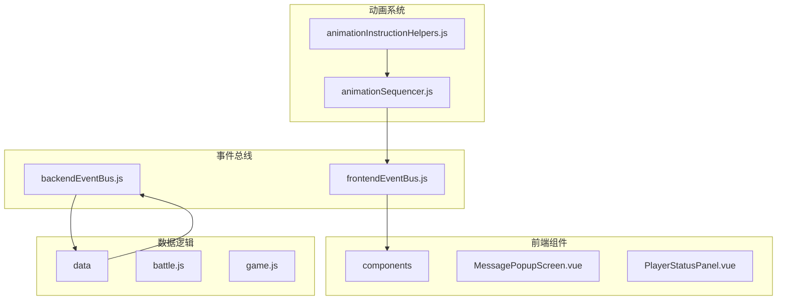
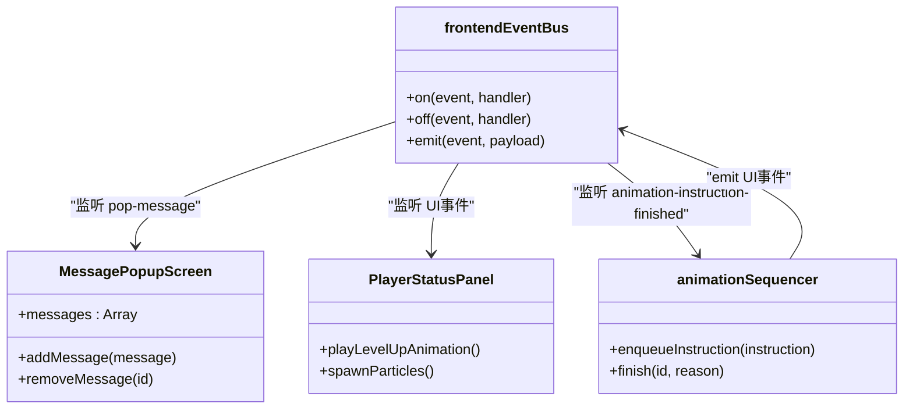
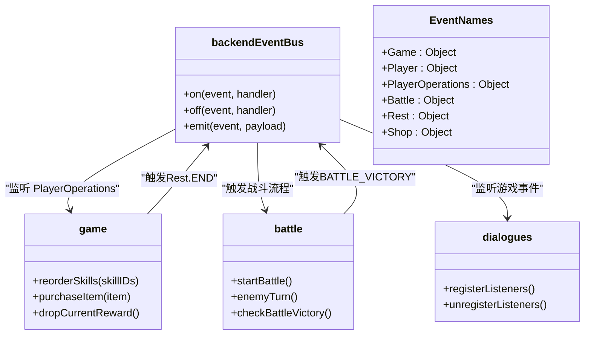
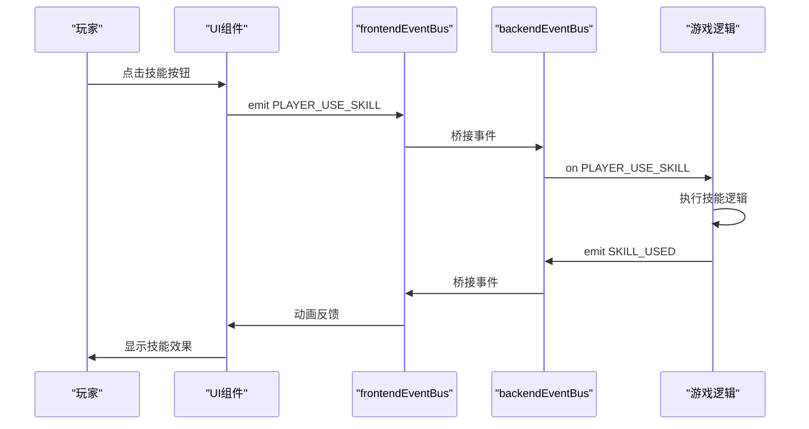
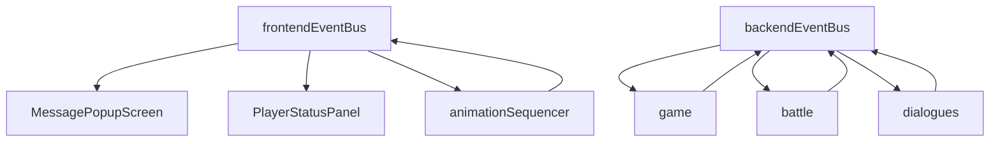

# 事件总线架构设计

<cite>
**本文档引用文件**   
- [frontendEventBus.js](file://src/frontendEventBus.js)
- [backendEventBus.js](file://src/backendEventBus.js)
- [MessagePopupScreen.vue](file://src/components/MessagePopupScreen.vue)
- [animationSequencer.js](file://src/data/animationSequencer.js)
- [animationInstructionHelpers.js](file://src/data/animationInstructionHelpers.js)
- [game.js](file://src/game.js)
- [battle.js](file://src/data/battle.js)
- [dialogues.js](file://src/data/dialogues.js)
- [PlayerStatusPanel.vue](file://src/components/PlayerStatusPanel.vue)
</cite>

## 目录
1. [引言](#引言)
2. [项目结构](#项目结构)
3. [核心组件](#核心组件)
4. [架构概述](#架构概述)
5. [详细组件分析](#详细组件分析)
6. [依赖分析](#依赖分析)
7. [性能考虑](#性能考虑)
8. [故障排除指南](#故障排除指南)
9. [结论](#结论)

## 引言
本文档深入阐述基于mitt库实现的双事件总线架构，详细说明前端事件总线(frontendEventBus)与后端事件总线(backendEventBus)的职责分离机制。前端总线处理UI交互事件（如按钮点击、动画完成），后端总线处理游戏逻辑事件（如战斗计算、状态变更）。这种分离带来了显著的解耦优势和清晰的数据流。

## 项目结构
本项目采用典型的Vue.js前端架构，结合基于mitt库的双事件总线模式。项目结构清晰地分离了前端组件、数据逻辑和工具函数。



**Diagram sources**
- [frontendEventBus.js](file://src/frontendEventBus.js)
- [backendEventBus.js](file://src/backendEventBus.js)
- [battle.js](file://src/data/battle.js)
- [game.js](file://src/game.js)

**Section sources**
- [frontendEventBus.js](file://src/frontendEventBus.js)
- [backendEventBus.js](file://src/backendEventBus.js)

## 核心组件
本系统的核心是双事件总线架构，由frontendEventBus和backendEventBus两个独立的mitt实例构成。这种设计实现了前端UI层与后端游戏逻辑层的完全解耦。

**Section sources**
- [frontendEventBus.js](file://src/frontendEventBus.js#L1-L8)
- [backendEventBus.js](file://src/backendEventBus.js#L1-L80)

## 架构概述
双事件总线架构将系统分为两个主要领域：前端UI领域和后端游戏逻辑领域。前端事件总线负责处理所有UI相关的事件，如动画播放、消息提示等；后端事件总线则负责处理游戏状态变更、战斗逻辑等核心业务。

```mermaid
graph LR
subgraph "前端UI领域"
A[Vue组件]
B[动画系统]
C[frontendEventBus]
end
subgraph "后端游戏逻辑领域"
D[游戏状态]
E[战斗逻辑]
F[backendEventBus]
end
A --> C
B --> C
C < --> |桥接| F
F --> D
F --> E
D --> F
E --> F
```

**Diagram sources**
- [frontendEventBus.js](file://src/frontendEventBus.js)
- [backendEventBus.js](file://src/backendEventBus.js)

## 详细组件分析

### 前端事件总线分析
前端事件总线是一个简单的mitt实例，专门用于在前端组件之间传递UI相关事件。它不涉及任何游戏逻辑结算，仅用于控制和播放动画。



**Diagram sources**
- [frontendEventBus.js](file://src/frontendEventBus.js#L1-L8)
- [MessagePopupScreen.vue](file://src/components/MessagePopupScreen.vue#L1-L61)
- [PlayerStatusPanel.vue](file://src/components/PlayerStatusPanel.vue#L1-L187)
- [animationSequencer.js](file://src/data/animationSequencer.js#L1-L133)

**Section sources**
- [frontendEventBus.js](file://src/frontendEventBus.js#L1-L8)
- [MessagePopupScreen.vue](file://src/components/MessagePopupScreen.vue#L1-L61)

### 后端事件总线分析
后端事件总线通过EventNames常量导出了一套完整的事件命名空间，涵盖了游戏、玩家、战斗、休整等多个领域。这种结构化的命名方式确保了事件系统的可维护性和可扩展性。



**Diagram sources**
- [backendEventBus.js](file://src/backendEventBus.js#L1-L80)
- [game.js](file://src/game.js#L97-L118)
- [battle.js](file://src/data/battle.js#L32-L353)
- [dialogues.js](file://src/data/dialogues.js#L316-L343)

**Section sources**
- [backendEventBus.js](file://src/backendEventBus.js#L1-L80)
- [game.js](file://src/game.js#L97-L118)

### 事件流分析
双事件总线之间的交互通过桥接模式实现。后端逻辑触发事件，前端监听并执行相应的UI反馈；前端用户操作通过特定的PlayerOperations事件通知后端进行结算。



**Diagram sources**
- [backendEventBus.js](file://src/backendEventBus.js)
- [game.js](file://src/game.js)
- [animationInstructionHelpers.js](file://src/data/animationInstructionHelpers.js)

**Section sources**
- [backendEventBus.js](file://src/backendEventBus.js)
- [game.js](file://src/game.js)

## 依赖分析
双事件总线架构的依赖关系清晰明了，前端组件依赖frontendEventBus进行UI通信，游戏逻辑模块依赖backendEventBus进行状态管理。



**Diagram sources**
- [frontendEventBus.js](file://src/frontendEventBus.js)
- [backendEventBus.js](file://src/backendEventBus.js)
- [MessagePopupScreen.vue](file://src/components/MessagePopupScreen.vue)
- [PlayerStatusPanel.vue](file://src/components/PlayerStatusPanel.vue)
- [animationSequencer.js](file://src/data/animationSequencer.js)
- [game.js](file://src/game.js)
- [battle.js](file://src/data/battle.js)
- [dialogues.js](file://src/data/dialogues.js)

**Section sources**
- [frontendEventBus.js](file://src/frontendEventBus.js)
- [backendEventBus.js](file://src/backendEventBus.js)

## 性能考虑
双事件总线架构在性能方面表现出色。通过职责分离，避免了不必要的事件传播和监听器调用。前端事件总线专注于UI更新，后端事件总线专注于游戏状态管理，两者通过明确的桥接点进行通信，减少了系统耦合度。

## 故障排除指南
当遇到事件总线相关问题时，应首先检查事件监听器的注册和注销是否正确配对。特别注意在组件销毁时移除事件监听，避免内存泄漏。

**Section sources**
- [MessagePopupScreen.vue](file://src/components/MessagePopupScreen.vue#L1-L61)
- [animationSequencer.js](file://src/data/animationSequencer.js#L1-L133)
- [dialogues.js](file://src/data/dialogues.js#L316-L343)

## 结论
双事件总线架构通过清晰的职责分离，实现了前端UI与后端游戏逻辑的完全解耦。这种设计不仅提高了代码的可维护性，还增强了系统的可扩展性。前端事件总线专注于用户体验，后端事件总线专注于游戏规则，两者通过桥接模式安全地交互，构成了一个健壮的游戏架构。