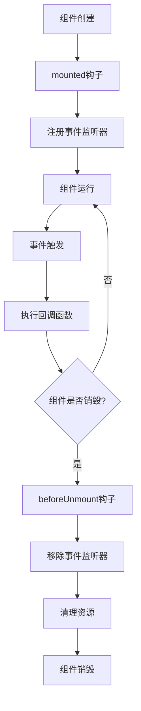

# 事件生命周期管理

<cite>
**本文档引用的文件**
- [SkillCard.vue](file://src/components/global/SkillCard.vue)
- [ParticleEffectManager.vue](file://src/components/global/ParticleEffectManager.vue)
- [CutsceneScreen.vue](file://src/components/end/CutsceneScreen.vue)
- [MessagePopupScreen.vue](file://src/components/end/MessagePopupScreen.vue)
- [frontendEventBus.js](file://src/frontendEventBus.js)
- [cardDomRegistry.js](file://src/utils/cardDomRegistry.js)
</cite>

## 目录
1. [简介](#简介)
2. [事件总线架构](#事件总线架构)
3. [Vue组件事件生命周期](#vue组件事件生命周期)
4. [事件监听器注册与销毁](#事件监听器注册与销毁)
5. [具体实现案例分析](#具体实现案例分析)
6. [异步事件处理与竞态条件](#异步事件处理与竞态条件)
7. [调试技巧与监控](#调试技巧与监控)
8. [最佳实践与代码检查清单](#最佳实践与代码检查清单)
9. [总结](#总结)

## 简介

事件生命周期管理是现代前端应用开发中的核心概念，特别是在使用Vue.js框架构建复杂用户界面时。本文档深入分析了Vue组件中事件监听器的完整生命周期管理机制，包括事件监听器的注册、触发、移除流程，并结合具体的SkillCard.vue组件实现进行详细说明。

事件生命周期管理的核心目标是：
- 确保事件监听器的正确注册和销毁
- 防止内存泄漏和重复监听
- 处理异步事件中的竞态条件
- 提供有效的调试和监控手段

## 事件总线架构

### 前端事件总线设计

项目采用基于mitt库的事件总线架构，这是一种轻量级的发布-订阅模式实现：

```javascript
// 前端事件总线
// 前端事件总线负责在前端组件之间传递事件和数据，一般用于控制和播放动画，不涉及具体结算逻辑
import mitt from 'mitt';

const frontendEventBus = mitt();

export default frontendEventBus;
```

这种设计具有以下特点：
- **解耦性**：组件间通过事件总线通信，降低直接依赖
- **灵活性**：支持任意数量的事件监听器
- **性能**：mitt库提供了高效的事件分发机制

### 事件总线的使用场景

在项目中，事件总线主要用于：
- 动画控制和播放
- 用户界面状态同步
- 组件间数据传递
- 异步操作通知

## Vue组件事件生命周期

### 生命周期钩子与事件管理

Vue组件的生命周期钩子为事件监听器的管理提供了天然的时机：



**图表来源**
- [SkillCard.vue](file://src/components/global/SkillCard.vue#L85-L95)
- [ParticleEffectManager.vue](file://src/components/global/ParticleEffectManager.vue#L25-L35)

### 关键生命周期方法

#### mounted钩子 - 事件监听器注册

```javascript
mounted() {
  // 监听spawn-particles事件
  frontendEventBus.on('spawn-particles', this.spawnParticles);
  
  // 开始动画循环
  this.animate();
}
```

#### beforeUnmount钩子 - 资源清理

```javascript
beforeUnmount() {
  // 清理事件监听
  frontendEventBus.off('spawn-particles', this.spawnParticles);
  
  // 取消动画循环
  if (this.animationFrameId) {
    cancelAnimationFrame(this.animationFrameId);
  }
}
```

**章节来源**
- [ParticleEffectManager.vue](file://src/components/global/ParticleEffectManager.vue#L25-L35)
- [CutsceneScreen.vue](file://src/components/end/CutsceneScreen.vue#L75-L85)

## 事件监听器注册与销毁

### 注册机制

事件监听器的注册遵循以下原则：

1. **时机选择**：在`mounted`钩子中注册事件监听器
2. **错误处理**：使用try-catch确保注册过程的健壮性
3. **条件注册**：根据组件状态决定是否注册

```javascript
mounted() {
  // 仅在需要时由组件自身注册到全局卡片DOM注册表
  if (this.autoRegisterInRegistry) {
    try { 
      registerCardEl(this.skill?.uniqueID, this.$refs.root, this.skill.uniqueID); 
      this._registeredSelf = true; 
    } catch (_) {}
  }
}
```

### 销毁机制

事件监听器的销毁必须确保：

1. **完整性**：移除所有注册的事件监听器
2. **及时性**：在组件销毁前完成清理工作
3. **幂等性**：多次调用不会产生副作用

```javascript
beforeUnmount() {
  if (this._registeredSelf) {
    try { 
      unregisterCardEl(this.skill?.uniqueID, this.skill.uniqueID); 
    } catch (_) {}
    this._registeredSelf = false;
  }
}
```

**章节来源**
- [SkillCard.vue](file://src/components/global/SkillCard.vue#L85-L95)
- [cardDomRegistry.js](file://src/utils/cardDomRegistry.js#L5-L15)

## 具体实现案例分析

### SkillCard组件的事件处理

SkillCard组件展示了完整的事件生命周期管理模式：

#### 点击事件处理

```javascript
methods: {
  onClick(event) {
    if (!this.disabled && this.canClick) {
      this.$emit('skill-card-clicked', this.skill, event);
    }
  }
}
```

#### 鼠标悬停事件

```javascript
methods: {
  onMouseEnter() {
    this.hovered = true;
    if (!this.previewMode) frontendEventBus.emit('skill-card-hover-start', this.skill);
  },
  onMouseLeave() {
    this.hovered = false;
    if (!this.previewMode) frontendEventBus.emit('skill-card-hover-end', this.skill);
  }
}
```

#### 事件监听器注册与清理

```javascript
mounted() {
  // 仅在需要时由组件自身注册到全局卡片DOM注册表
  if (this.autoRegisterInRegistry) {
    try { 
      registerCardEl(this.skill?.uniqueID, this.$refs.root, this.skill.uniqueID); 
      this._registeredSelf = true; 
    } catch (_) {}
  }
},
beforeUnmount() {
  if (this._registeredSelf) {
    try { 
      unregisterCardEl(this.skill?.uniqueID, this.skill.uniqueID); 
    } catch (_) {}
    this._registeredSelf = false;
  }
}
```

**图表来源**
- [SkillCard.vue](file://src/components/global/SkillCard.vue#L95-L130)

### ParticleEffectManager组件的复杂事件管理

ParticleEffectManager展示了更复杂的事件管理场景：

#### 事件监听器注册

```javascript
mounted() {
  // 监听spawn-particles事件
  frontendEventBus.on('spawn-particles', this.spawnParticles);
  
  // 开始动画循环
  this.animate();
}
```

#### 多层次资源清理

```javascript
beforeUnmount() {
  // 清理事件监听
  frontendEventBus.off('spawn-particles', this.spawnParticles);
  
  // 取消动画循环
  if (this.animationFrameId) {
    cancelAnimationFrame(this.animationFrameId);
  }
}
```

#### 定时器管理

```javascript
// 在事件处理函数中可能创建的定时器
setTimeout(() => {
  this.removeMessage(id);
}, newMessage.duration);
```

**图表来源**
- [ParticleEffectManager.vue](file://src/components/global/ParticleEffectManager.vue#L25-L35)

### MessagePopupScreen组件的简单事件管理

MessagePopupScreen展示了基础的事件监听器管理模式：

#### 事件监听器注册

```javascript
mounted() {
  // 监听pop-message事件
  frontendEventBus.on('pop-message', (message) => {
    this.addMessage(message);
  });
}
```

#### 事件监听器清理

```javascript
beforeUnmount() {
  // 移除事件监听
  frontendEventBus.off('pop-message');
}
```

**图表来源**
- [MessagePopupScreen.vue](file://src/components/end/MessagePopupScreen.vue#L20-L25)

## 异步事件处理与竞态条件

### 竞态条件防范

在异步事件处理中，竞态条件是一个常见问题。项目中的解决方案包括：

#### 事件状态检查

```javascript
// CutsceneScreen中的竞态条件防范
frontendEventBus.on('display-cutscene', (cutsceneEvent) => {
  if(this.cutsceneEvent) {
    console.error('CutsceneScreen: 尝试显示新的cutscene事件时，当前已存在一个cutscene事件');
    return ;
  }
  // 继续处理新事件...
});
```

#### 条件执行

```javascript
// SkillCard中的条件点击处理
onClick(event) {
  if (!this.disabled && this.canClick) {
    this.$emit('skill-card-clicked', this.skill, event);
  }
}
```

### 异步资源清理

对于异步操作创建的资源，需要特别注意清理时机：

```javascript
beforeUnmount() {
  // 移除事件监听
  frontendEventBus.off('display-cutscene', this.onCutsceneEnd);
  
  // 清除定时器
  if (this.fadeTimeout) {
    clearTimeout(this.fadeTimeout);
  }
}
```

**章节来源**
- [CutsceneScreen.vue](file://src/components/end/CutsceneScreen.vue#L40-L50)
- [SkillCard.vue](file://src/components/global/SkillCard.vue#L105-L110)

## 调试技巧与监控

### 事件日志中间件

为了有效监控事件流，可以实现事件日志中间件：

```javascript
// 事件日志中间件示例
const eventLogger = {
  on(eventName, handler) {
    const loggedHandler = (...args) => {
      console.log(`[EVENT] ${eventName}:`, args);
      handler(...args);
    };
    frontendEventBus.on(eventName, loggedHandler);
    return () => frontendEventBus.off(eventName, loggedHandler);
  },
  
  emit(eventName, ...args) {
    console.log(`[EMIT] ${eventName}:`, args);
    frontendEventBus.emit(eventName, ...args);
  }
};
```

### 调试工具集成

#### 组件状态监控

```javascript
// 在mounted钩子中添加调试信息
mounted() {
  console.log('[DEBUG] SkillCard mounted:', this.skill?.uniqueID);
  // ... 其他初始化代码
},

beforeUnmount() {
  console.log('[DEBUG] SkillCard unmounting:', this.skill?.uniqueID);
  // ... 清理代码
}
```

#### 事件流追踪

```javascript
// 包装事件处理器以添加调试信息
wrapEventHandler(handler, eventName) {
  return (...args) => {
    console.log(`[EVENT] ${eventName} triggered:`, args);
    handler.apply(this, args);
  };
}
```

### 性能监控

对于频繁触发的事件，建议添加性能监控：

```javascript
// 性能监控装饰器
function monitorEvent(name, threshold = 100) {
  let count = 0;
  let lastTime = performance.now();
  
  return function(...args) {
    count++;
    const now = performance.now();
    if (now - lastTime > threshold) {
      console.log(`[PERF] Event ${name} triggered ${count} times in ${now - lastTime}ms`);
      count = 0;
      lastTime = now;
    }
    return this[name].apply(this, args);
  };
}
```

## 最佳实践与代码检查清单

### 代码检查清单

#### 1. 事件监听器注册检查

- [ ] 在`mounted`钩子中注册事件监听器
- [ ] 使用try-catch包装注册代码
- [ ] 考虑条件注册的可能性
- [ ] 确保事件监听器名称唯一且有意义

#### 2. 资源清理检查

- [ ] 在`beforeUnmount`钩子中移除所有事件监听器
- [ ] 清理定时器和动画帧请求
- [ ] 检查是否有未处理的异步操作
- [ ] 确保清理函数幂等

#### 3. 内存泄漏防范

- [ ] 避免在事件处理函数中创建闭包
- [ ] 不要在事件处理函数中直接修改组件状态
- [ ] 使用弱引用避免循环引用
- [ ] 定期检查事件监听器数量

#### 4. 错误处理检查

- [ ] 为事件监听器添加错误边界
- [ ] 实现优雅降级机制
- [ ] 记录事件处理失败的情况
- [ ] 提供恢复机制

### 代码模板

#### 基础事件管理模板

```javascript
export default {
  name: 'ComponentName',
  data() {
    return {
      _eventListeners: {},
      _timers: [],
      _animationFrames: []
    };
  },
  mounted() {
    // 注册事件监听器
    this._eventListeners['eventName'] = this.eventHandler.bind(this);
    frontendEventBus.on('eventName', this._eventListeners['eventName']);
  },
  beforeUnmount() {
    // 移除事件监听器
    if (this._eventListeners['eventName']) {
      frontendEventBus.off('eventName', this._eventListeners['eventName']);
      delete this._eventListeners['eventName'];
    }
    
    // 清理定时器
    this._timers.forEach(timer => clearTimeout(timer));
    this._timers = [];
    
    // 取消动画帧
    this._animationFrames.forEach(frame => cancelAnimationFrame(frame));
    this._animationFrames = [];
  },
  methods: {
    eventHandler(data) {
      // 事件处理逻辑
    }
  }
};
```

#### 高级事件管理模板

```javascript
export default {
  name: 'AdvancedComponent',
  data() {
    return {
      _subscriptions: new Map(),
      _cleanupTasks: []
    };
  },
  mounted() {
    // 使用Map存储多个事件监听器
    const events = [
      { name: 'event1', handler: this.handleEvent1 },
      { name: 'event2', handler: this.handleEvent2 }
    ];
    
    events.forEach(({ name, handler }) => {
      const wrappedHandler = this.createErrorHandler(handler, name);
      this._subscriptions.set(name, wrappedHandler);
      frontendEventBus.on(name, wrappedHandler);
    });
  },
  beforeUnmount() {
    // 批量清理所有订阅
    this._subscriptions.forEach((handler, name) => {
      frontendEventBus.off(name, handler);
    });
    this._subscriptions.clear();
    
    // 执行清理任务
    this._cleanupTasks.forEach(task => task());
    this._cleanupTasks = [];
  },
  methods: {
    createErrorHandler(handler, eventName) {
      return (...args) => {
        try {
          return handler.apply(this, args);
        } catch (error) {
          console.error(`Error in ${eventName} handler:`, error);
          // 实现错误恢复逻辑
        }
      };
    }
  }
};
```

**章节来源**
- [SkillCard.vue](file://src/components/global/SkillCard.vue#L85-L95)
- [ParticleEffectManager.vue](file://src/components/global/ParticleEffectManager.vue#L25-L35)

## 总结

事件生命周期管理是构建稳定、高性能前端应用的关键技术。通过本文档的分析，我们可以得出以下结论：

### 核心要点

1. **生命周期管理的重要性**：正确的事件监听器注册和销毁是防止内存泄漏的基础
2. **错误处理的必要性**：使用try-catch包装事件相关代码，确保应用稳定性
3. **异步处理的复杂性**：需要特别注意异步操作的竞态条件和资源清理
4. **调试工具的价值**：事件日志和性能监控是维护大型应用的重要手段

### 最佳实践总结

- 始终在`mounted`钩子中注册事件监听器
- 在`beforeUnmount`钩子中彻底清理所有资源
- 使用条件注册避免不必要的监听器创建
- 实现错误边界和优雅降级机制
- 添加适当的调试信息和性能监控

### 未来发展方向

随着前端技术的发展，事件生命周期管理可能会朝着更加自动化和智能化的方向发展，例如：
- 更好的内存泄漏检测工具
- 自动化的事件监听器生命周期管理
- 更强大的调试和监控功能

通过遵循本文档提供的指导原则和最佳实践，开发者可以构建出更加稳定、可维护的事件驱动型前端应用。