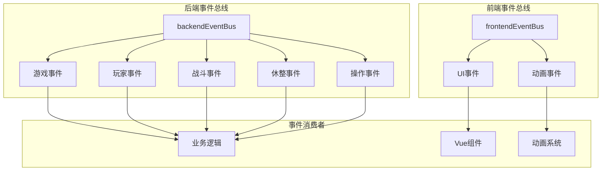
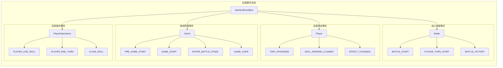
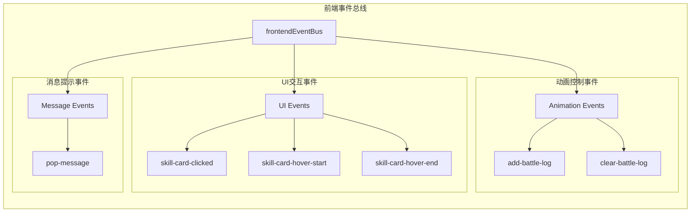
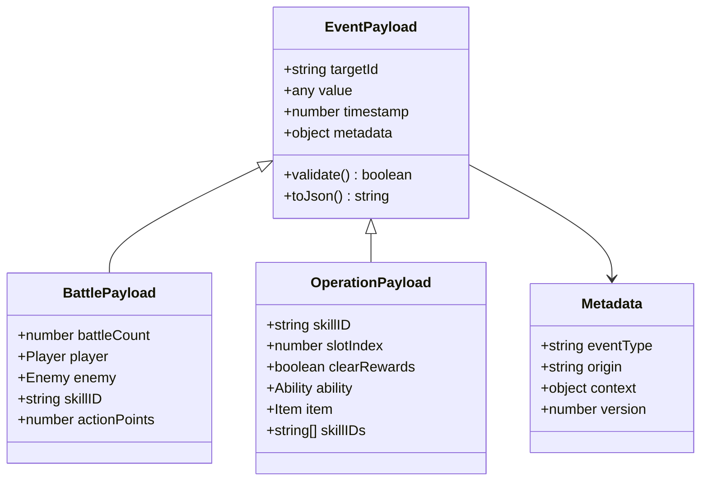

# 事件类型与命名规范

<cite>
**本文档引用的文件**
- [backendEventBus.js](file://src/backendEventBus.js)
- [frontendEventBus.js](file://src/frontendEventBus.js)
- [battle.js](file://src/data/battle.js)
- [BattleScreen.vue](file://src/components/battle/BattleScreen.vue)
- [RestScreen.vue](file://src/components/rest/RestScreen.vue)
- [SkillCard.vue](file://src/components/global/SkillCard.vue)
- [gameState.js](file://src/data/gameState.js)
</cite>

## 目录
1. [简介](#简介)
2. [事件系统架构](#事件系统架构)
3. [事件命名规范](#事件命名规范)
4. [事件分类体系](#事件分类体系)
5. [事件载荷数据结构](#事件载荷数据结构)
6. [典型事件触发示例](#典型事件触发示例)
7. [事件常量定义最佳实践](#事件常量定义最佳实践)
8. [总结](#总结)

## 简介

本项目采用基于mitt库的事件总线系统，实现了前后端分离的事件通信机制。事件系统分为两个主要部分：前端事件总线（frontendEventBus）和后端事件总线（backendEventBus），分别负责不同层面的事件传递和处理。

## 事件系统架构



**图表来源**
- [frontendEventBus.js](file://src/frontendEventBus.js#L1-L9)
- [backendEventBus.js](file://src/backendEventBus.js#L1-L80)

**章节来源**
- [frontendEventBus.js](file://src/frontendEventBus.js#L1-L9)
- [backendEventBus.js](file://src/backendEventBus.js#L1-L80)

## 事件命名规范

### kebab-case格式约定

项目严格采用kebab-case（短横线分隔的小写形式）作为事件名称的命名格式，这一约定体现在以下方面：

1. **基本格式要求**：
   - 所有事件名称使用小写字母
   - 单词间使用短横线（-）连接
   - 不包含大写字母或下划线

2. **命名层次结构**：
   - 一级分类：功能领域标识符
   - 二级分类：具体事件类型
   - 使用点号（.）分隔层级

3. **命名原则**：
   - 语义明确：事件名称应准确描述其含义
   - 动宾结构：通常采用动词+名词的形式
   - 时态统一：使用现在时描述当前状态或动作

### 命名示例

```javascript
// 游戏阶段事件
'pre-game-start'
'game-start'
'enter-battle-stage'

// 战斗相关事件
'battle-player-use-skill'
'battle-player-end-turn'
'battle-enemy-turn-start'

// 休整阶段事件
'rest-claim-money'
'rest-claim-skill'
'rest-finish'

// 玩家操作事件
'player-skill-used'
'player-effect-changed'
'player-tier-upgraded'
```

**章节来源**
- [backendEventBus.js](file://src/backendEventBus.js#L5-L78)

## 事件分类体系

### 后端事件总线分类



**图表来源**
- [backendEventBus.js](file://src/backendEventBus.js#L5-L78)

### 前端事件总线分类

前端事件总线主要负责UI交互和动画相关的事件传递：



**图表来源**
- [frontendEventBus.js](file://src/frontendEventBus.js#L1-L9)
- [BattleScreen.vue](file://src/components/battle/BattleScreen.vue#L60-L70)
- [SkillCard.vue](file://src/components/global/SkillCard.vue#L170-L180)

**章节来源**
- [backendEventBus.js](file://src/backendEventBus.js#L5-L78)
- [frontendEventBus.js](file://src/frontendEventBus.js#L1-L9)

## 事件载荷数据结构

### 必要字段规范

每个事件都遵循特定的数据结构规范，确保事件载荷的一致性和可预测性：

1. **基础载荷结构**：
   ```javascript
   {
     targetId?: string,      // 目标对象唯一标识符
     value?: any,           // 事件携带的核心数值
     timestamp?: number,    // 事件发生时间戳
     metadata?: object      // 可选的元数据信息
   }
   ```

2. **战斗事件载荷**：
   ```javascript
   {
     battleCount: number,   // 战斗场次数
     player: Player,        // 玩家状态对象
     enemy: Enemy,         // 敌人状态对象
     skillID?: string,     // 技能唯一标识符
     actionPoints?: number // 行动力消耗
   }
   ```

3. **玩家操作载荷**：
   ```javascript
   {
     skillID: string,       // 技能唯一ID
     slotIndex: number,     // 技能槽索引
     clearRewards: boolean, // 是否清除奖励
     ability?: Ability,     // 能力对象
     item?: Item,          // 物品对象
     skillIDs?: string[]   // 技能ID数组
   }
   ```

### 元数据字段说明



**图表来源**
- [backendEventBus.js](file://src/backendEventBus.js#L5-L78)
- [battle.js](file://src/data/battle.js#L20-L30)

**章节来源**
- [backendEventBus.js](file://src/backendEventBus.js#L5-L78)
- [battle.js](file://src/data/battle.js#L20-L30)

## 典型事件触发示例

### 战斗技能使用事件

在`battle.js`中触发`'enemy-defeated'`事件的典型实现：

```javascript
// 检查战斗胜利条件
function checkBattleVictory() {
  const isPlayerDead = gameState.player.hp <= 0;
  const isEnemyDead = gameState.enemy.hp <= 0;

  if (isPlayerDead) {
    // 玩家失败事件
    backendEventBus.emit(EventNames.Battle.BATTLE_VICTORY, false);
    return true;
  }

  if (isEnemyDead) {
    // 敌人被击败事件
    backendEventBus.emit(EventNames.Battle.BATTLE_VICTORY, true);
    return true;
  }

  return false;
}
```

### 技能使用事件触发

```javascript
// 在SkillsHand.vue中触发技能使用事件
function useSkill(skill) {
  // 触发技能使用事件
  backendEventBus.emit(EventNames.PlayerOperations.PLAYER_USE_SKILL, skill.uniqueID);
  
  // 添加玩家行动日志
  addPlayerActionLog(`你使用了 /blue{${skill.name}}！`);
  
  // 播放技能使用动画
  enqueueAnimateCardById({
    id: skill.uniqueID, 
    kind: 'flyToAnchor', 
    options: { anchor: 'center', scale: 1.2 }
  }, { tags: ['ui'], waitTags: [] });
}
```

### UI交互事件触发

```javascript
// 在SkillCard.vue中触发UI交互事件
methods: {
  onClick(event) {
    if (!this.disabled && this.canClick) {
      // 触发技能卡片点击事件
      this.$emit('skill-card-clicked', this.skill, event);
    }
  },
  onMouseEnter() {
    this.hovered = true;
    if (!this.previewMode) {
      // 触发技能卡片悬停开始事件
      frontendEventBus.emit('skill-card-hover-start', this.skill);
    }
  }
}
```

### 事件监听和处理

```javascript
// 在BattleScreen.vue中监听战斗日志事件
mounted() {
  frontendEventBus.on('add-battle-log', this.onAddBattleLog);
  frontendEventBus.on('clear-battle-log', this.onClearBattleLog);
},
methods: {
  onAddBattleLog(value) {
    // 兼容字符串与对象格式
    this.logs.push(value);
  },
  onClearBattleLog() {
    this.logs = [];
  }
}
```

**章节来源**
- [battle.js](file://src/data/battle.js#L140-L155)
- [SkillCard.vue](file://src/components/global/SkillCard.vue#L170-L180)
- [BattleScreen.vue](file://src/components/battle/BattleScreen.vue#L60-L70)

## 事件常量定义最佳实践

### 统一常量定义

项目采用集中式的事件常量定义，位于`backendEventBus.js`文件中：

```javascript
export const EventNames = {
  Game: {
    PRE_GAME_START: 'pre-game-start',
    GAME_START: 'game-start',
    ENTER_BATTLE_STAGE: 'enter-battle-stage',
    ENTER_REST_STAGE: 'enter-rest-stage',
    PRE_BATTLE: 'pre-battle',
    POST_BATTLE: 'post-battle',
    GAME_OVER: 'game-over',
  },
  Player: {
    // 休息/通用事件
    TIER_UPGRADED: 'player-tier-upgraded',
    ABILITY_CLAIMED: 'player-ability-claimed',
    MONEY_CLAIMED: 'player-money-claimed',
    SKILL_REWARD_CLAIMED: 'player-skill-claimed',
    // 战斗事件
    FRONTIER_UPDATED: 'player-frontier-skills-updated',
    ACTIVATED_SKILLS_UPDATED: 'player-activated-skills-updated',
    EFFECT_CHANGED: 'player-effect-changed',
    SKILL_BURNT: 'player-skill-burnt',
    SKILL_DISCOVERED: 'player-skill-discovered',
    SKILL_USED: 'player-skill-used',
    SKILL_DROPPED: 'player-skill-dropped',
    SKILL_DRAWN: 'player-skill-drawn'
  },
  PlayerOperations: {
    // 战斗内玩家操作
    PLAYER_USE_SKILL: 'battle-player-use-skill',
    PLAYER_SHIFT_SKILL: 'battle-player-shift-skill',
    PLAYER_END_TURN: 'player-end-turn',
    // 休整阶段操作
    CLAIM_MONEY: 'rest-claim-money',
    CLAIM_SKILL: 'rest-claim-skill',
    CLAIM_ABILITY: 'rest-claim-ability',
    FINISH: 'rest-finish'
  }
};
```

### 最佳实践建议

1. **模块化组织**：
   - 按功能领域分组定义事件常量
   - 使用嵌套对象结构提高可读性
   - 相关事件按时间顺序排列

2. **命名一致性**：
   - 保持事件名称格式统一
   - 使用描述性的动词开头
   - 避免歧义的缩写

3. **类型安全**：
   - 在TypeScript项目中定义事件类型的接口
   - 提供事件载荷的类型定义
   - 使用枚举类型限制事件名称范围

4. **文档化**：
   - 为每个事件添加注释说明
   - 描述事件的触发时机和预期行为
   - 说明载荷数据结构和字段含义

5. **版本兼容性**：
   - 保留旧事件名称支持向后兼容
   - 使用废弃标记标注即将移除的事件
   - 提供迁移指南和替代方案

**章节来源**
- [backendEventBus.js](file://src/backendEventBus.js#L5-L78)

## 总结

本项目建立了完善的事件类型与命名规范体系，通过以下特点确保了事件系统的高效性和可维护性：

1. **标准化命名**：采用kebab-case格式的事件命名，确保命名风格的一致性
2. **清晰的分类**：按照功能领域和事件性质进行合理分类
3. **规范的数据结构**：定义了标准的事件载荷格式和必需字段
4. **最佳实践指导**：提供了事件常量定义和使用的最佳实践建议
5. **实际应用示例**：展示了典型事件触发和处理的实际代码实现

这套事件系统为项目的前后端分离架构提供了坚实的基础，使得组件间的通信更加清晰和可控，同时为未来的功能扩展和维护提供了良好的框架支撑。