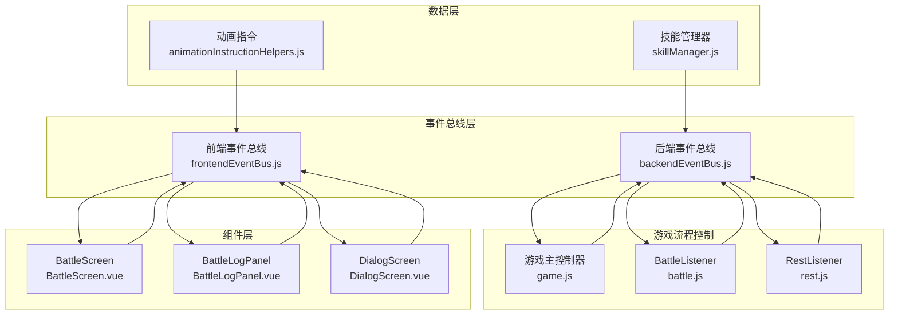
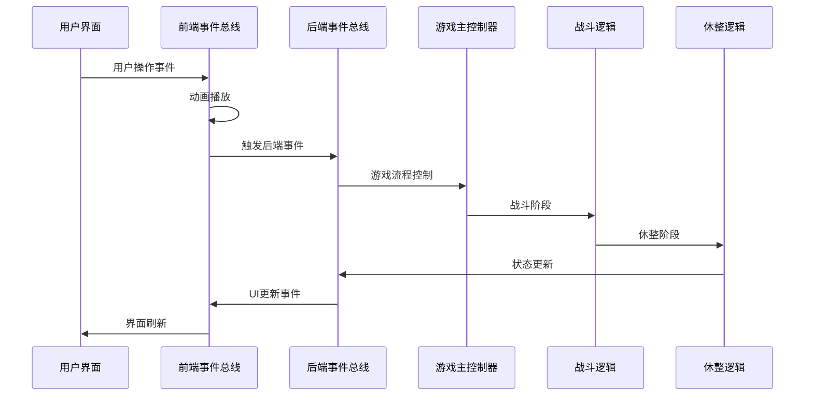
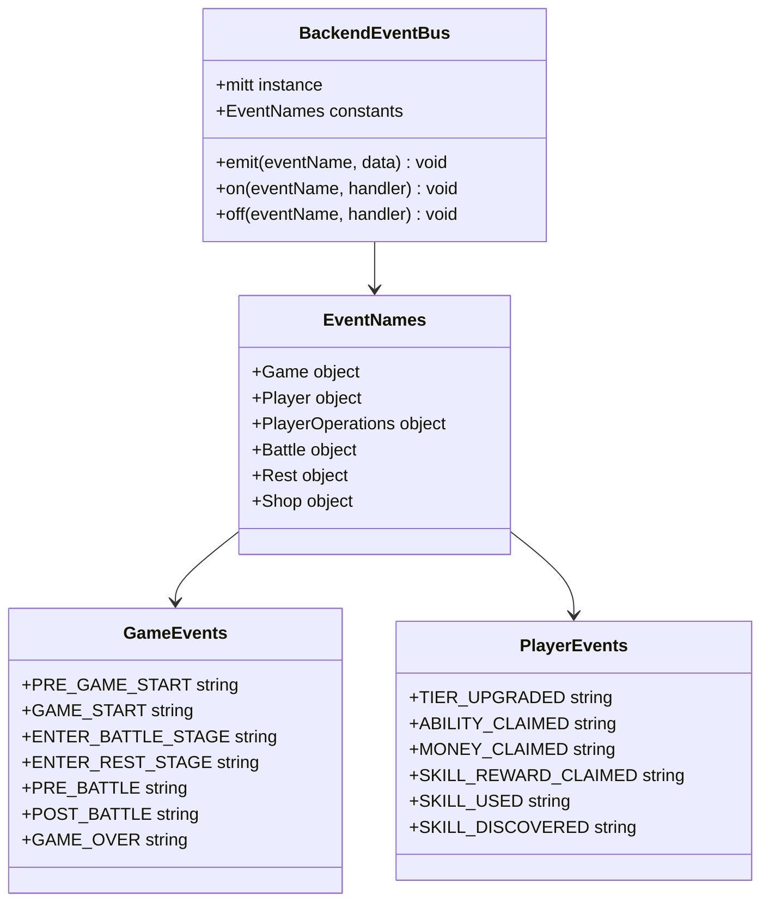
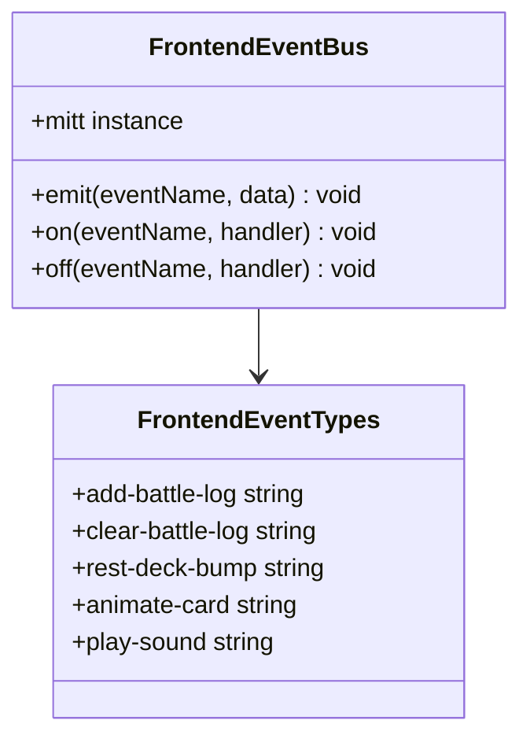
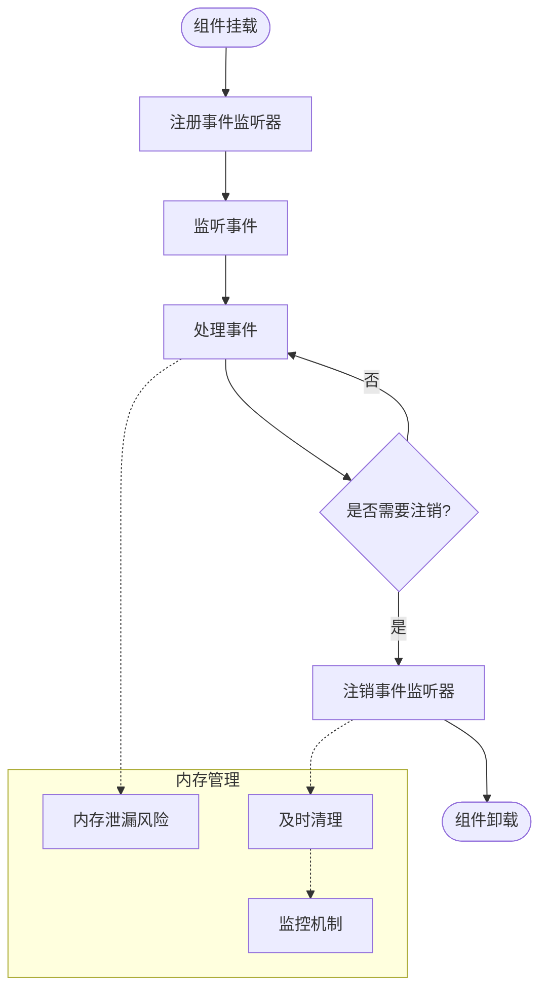
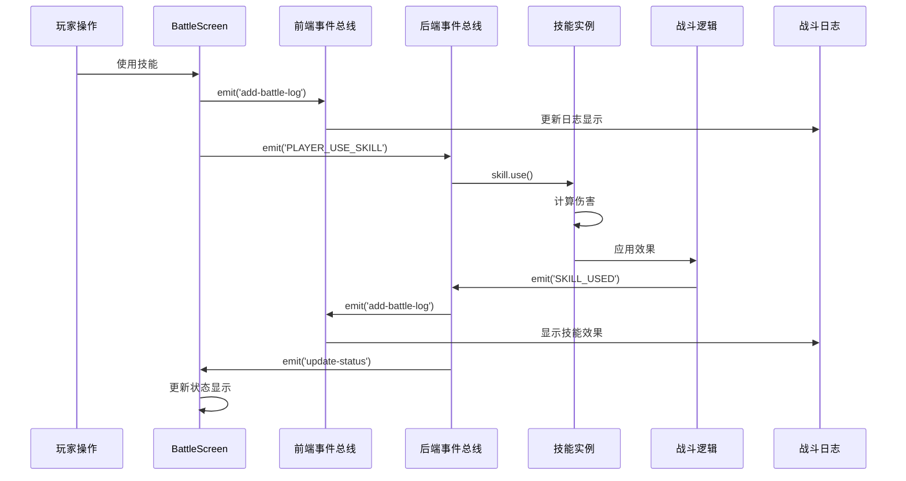
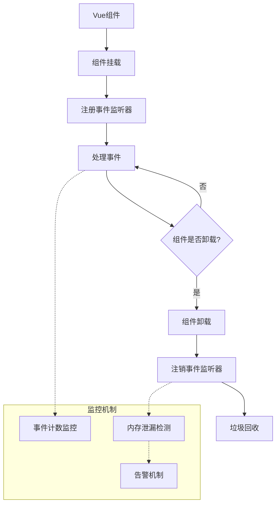

# 事件系统

<cite>
**本文档引用的文件**
- [backendEventBus.js](file://src/backendEventBus.js)
- [frontendEventBus.js](file://src/frontendEventBus.js)
- [game.js](file://src/game.js)
- [battle.js](file://src/data/battle.js)
- [rest.js](file://src/data/rest.js)
- [skillManager.js](file://src/data/skillManager.js)
- [animationInstructionHelpers.js](file://src/data/animationInstructionHelpers.js)
- [BattleScreen.vue](file://src/components/BattleScreen.vue)
- [BattleLogPanel.vue](file://src/components/BattleLogPanel.vue)
- [dialogues.js](file://src/data/dialogues.js)
- [punch.js](file://src/data/skills/martial_arts/punch.js)
</cite>

## 目录
1. [简介](#简介)
2. [项目结构](#项目结构)
3. [核心组件](#核心组件)
4. [架构概览](#架构概览)
5. [详细组件分析](#详细组件分析)
6. [事件类型定义](#事件类型定义)
7. [事件监听器机制](#事件监听器机制)
8. [事件传播流程](#事件传播流程)
9. [性能优化与内存管理](#性能优化与内存管理)
10. [故障排除指南](#故障排除指南)
11. [总结](#总结)

## 简介

本事件系统是一个基于mitt库构建的双事件总线架构，专门设计用于支持RPG游戏《灵御》的复杂游戏流程控制。系统采用前后端分离的事件总线设计，前端事件总线负责动画和UI交互，后端事件总线负责游戏逻辑和状态管理。

事件系统的核心设计理念是通过事件驱动的方式实现松耦合的游戏流程控制，确保各个游戏阶段（战斗、休整、对话等）能够平滑过渡，同时保持代码的可维护性和扩展性。

## 项目结构

事件系统在整个项目中的组织结构如下：



**图表来源**
- [backendEventBus.js](file://src/backendEventBus.js#L1-L80)
- [frontendEventBus.js](file://src/frontendEventBus.js#L1-L9)
- [game.js](file://src/game.js#L1-L119)

## 核心组件

### 后端事件总线 (backendEventBus)

后端事件总线是整个游戏流程的核心协调器，负责处理游戏状态转换和业务逻辑事件。

```javascript
// 后端事件总线初始化
import mitt from 'mitt';
const backendEventBus = mitt();

// 事件名称常量定义
export const EventNames = {
  Game: {
    PRE_GAME_START: 'pre-game-start',
    GAME_START: 'game-start',
    ENTER_BATTLE_STAGE: 'enter-battle-stage',
    ENTER_REST_STAGE: 'enter-rest-stage',
    PRE_BATTLE: 'pre-battle',
    POST_BATTLE: 'post-battle',
    GAME_OVER: 'game-over',
  },
  Player: {
    TIER_UPGRADED: 'player-tier-upgraded',
    ABILITY_CLAIMED: 'player-ability-claimed',
    MONEY_CLAIMED: 'player-money-claimed',
    SKILL_REWARD_CLAIMED: 'player-skill-claimed',
    SKILL_USED: 'player-skill-used',
    SKILL_DISCOVERED: 'player-skill-discovered'
  },
  PlayerOperations: {
    PLAYER_USE_SKILL: 'battle-player-use-skill',
    PLAYER_END_TURN: 'player-end-turn',
    CLAIM_MONEY: 'rest-claim-money',
    CLAIM_SKILL: 'rest-claim-skill',
    FINISH: 'rest-finish'
  }
};
```

### 前端事件总线 (frontendEventBus)

前端事件总线专注于UI交互和动画控制，不参与具体的业务逻辑计算。

```javascript
// 前端事件总线初始化
import mitt from 'mitt';
const frontendEventBus = mitt();

// 主要用途：
// - 战斗日志显示
// - 动画控制
// - UI状态更新
// - 用户交互反馈
```

**章节来源**
- [backendEventBus.js](file://src/backendEventBus.js#L1-L80)
- [frontendEventBus.js](file://src/frontendEventBus.js#L1-L9)

## 架构概览

事件系统采用分层架构设计，通过事件总线实现各层之间的解耦：



**图表来源**
- [game.js](file://src/game.js#L25-L119)
- [battle.js](file://src/data/battle.js#L1-L199)
- [rest.js](file://src/data/rest.js#L1-L199)

## 详细组件分析

### 后端事件总线组件分析



**图表来源**
- [backendEventBus.js](file://src/backendEventBus.js#L3-L79)

### 前端事件总线组件分析



**图表来源**
- [frontendEventBus.js](file://src/frontendEventBus.js#L1-L9)

### 游戏主控制器分析

游戏主控制器是事件系统的协调中心，负责注册所有事件监听器：

```javascript
export function initGameFlowListeners() {
  // 注册后端对话系统监听器
  dialogues.registerListeners();

  // 游戏开始
  backendEventBus.on(EventNames.Game.GAME_START, () => {
    startGame();
  });

  // 开始战斗（统一入口）
  backendEventBus.on(EventNames.Game.ENTER_BATTLE_STAGE, () => {
    enterBattleStage();
  });

  // 战斗结束后的流程编排
  backendEventBus.on(EventNames.Game.POST_BATTLE, ({ isVictory }) => {
    if (isVictory) {
      clearRewards();
      spawnRewards();
      gameState.isVictory = true;
      backendEventBus.emit(EventNames.Game.ENTER_REST_STAGE);
    } else {
      backendEventBus.emit(EventNames.Game.GAME_OVER, { reason: 'defeat' });
    }
  });
}
```

**章节来源**
- [game.js](file://src/game.js#L25-L119)

## 事件类型定义

### 游戏阶段事件

游戏阶段事件定义了游戏的主要生命周期：

```javascript
Game: {
  PRE_GAME_START: 'pre-game-start',     // 游戏开始前事件
  GAME_START: 'game-start',             // 游戏正式开始
  ENTER_BATTLE_STAGE: 'enter-battle-stage', // 进入战斗阶段
  ENTER_REST_STAGE: 'enter-rest-stage',   // 进入休整阶段
  PRE_BATTLE: 'pre-battle',             // 战前准备事件
  POST_BATTLE: 'post-battle',           // 战后结算事件
  GAME_OVER: 'game-over'                // 游戏结束事件
}
```

### 玩家事件

玩家事件涵盖了玩家状态变化和技能使用：

```javascript
Player: {
  TIER_UPGRADED: 'player-tier-upgraded',        // 等级提升事件
  ABILITY_CLAIMED: 'player-ability-claimed',    // 能力获取事件
  MONEY_CLAIMED: 'player-money-claimed',        // 金钱获取事件
  SKILL_REWARD_CLAIMED: 'player-skill-claimed', // 技能奖励获取事件
  SKILL_USED: 'player-skill-used',              // 技能使用事件
  SKILL_DISCOVERED: 'player-skill-discovered',  // 技能发现事件
  SKILL_BURNT: 'player-skill-burnt',            // 技能烧毁事件
  SKILL_DROPPED: 'player-skill-dropped',        // 技能弃牌事件
  SKILL_DRAWN: 'player-skill-drawn'             // 技能抽牌事件
}
```

### 玩家操作事件

玩家操作事件由前端发起，用于触发后端结算：

```javascript
PlayerOperations: {
  // 战斗内玩家操作
  PLAYER_USE_SKILL: 'battle-player-use-skill',
  PLAYER_SHIFT_SKILL: 'battle-player-shift-skill',
  PLAYER_END_TURN: 'player-end-turn',
  
  // 休整阶段操作
  CLAIM_MONEY: 'rest-claim-money',
  CLAIM_SKILL: 'rest-claim-skill',
  CLAIM_ABILITY: 'rest-claim-ability',
  CLAIM_BREAKTHROUGH: 'rest-claim-breakthrough',
  REORDER_SKILLS: 'rest-reorder-skills',
  PURCHASE_ITEM: 'rest-purchase-item',
  FINISH: 'rest-finish',
  DROP_REWARD: 'rest-drop-reward',
  
  // Overlay 操作
  CONFIRM_OVERLAY_SKILL_SELECTIONS: 'overlay-confirm-skill-selections'
}
```

**章节来源**
- [backendEventBus.js](file://src/backendEventBus.js#L5-L79)

## 事件监听器机制

### 事件注册与注销

事件监听器的注册和注销遵循严格的生命周期管理：



**图表来源**
- [BattleScreen.vue](file://src/components/BattleScreen.vue#L75-L85)

### 前端组件事件处理示例

BattleScreen组件展示了标准的事件监听器管理模式：

```javascript
mounted() {
  frontendEventBus.on('add-battle-log', this.onAddBattleLog);
  frontendEventBus.on('clear-battle-log', this.onClearBattleLog);
},
beforeUnmount() {
  frontendEventBus.off('add-battle-log', this.onAddBattleLog);
  frontendEventBus.off('clear-battle-log', this.onClearBattleLog);
},
methods: {
  onAddBattleLog(value) {
    this.logs.push(value);
  },
  onClearBattleLog() {
    this.logs = [];
  }
}
```

### 后端事件处理机制

后端事件处理器负责复杂的业务逻辑：

```javascript
// 休整阶段：事件驱动的后端结算与流程推进
backendEventBus.on(EventNames.PlayerOperations.CLAIM_MONEY, () => {
  claimMoney();
});
backendEventBus.on(EventNames.PlayerOperations.CLAIM_SKILL, ({ skillID, slotIndex, clearRewards }) => {
  claimSkillReward(skillID, slotIndex, !!clearRewards);
});
backendEventBus.on(EventNames.PlayerOperations.CLAIM_ABILITY, ({ ability, clearRewards }) => {
  claimAbilityReward(ability, !!clearRewards);
});
```

**章节来源**
- [BattleScreen.vue](file://src/components/BattleScreen.vue#L75-L85)
- [game.js](file://src/game.js#L65-L105)

## 事件传播流程

### 技能使用事件传播路径

技能使用事件是事件系统中最复杂的传播路径之一：



**图表来源**
- [battle.js](file://src/data/battle.js#L150-L200)
- [BattleScreen.vue](file://src/components/BattleScreen.vue#L75-L85)

### 战斗阶段事件流程

战斗阶段的事件传播遵循严格的时序控制：

```javascript
function startPlayerTurn() {
  // 玩家回合开始前事件
  backendEventBus.emit(EventNames.Battle.PRE_PLAYER_TURN_START, {});
  
  // 玩家回合开始事件
  backendEventBus.emit(EventNames.Battle.PLAYER_TURN_START, {});
  
  // 解锁操作面板
  enqueueUnlockControl();
  
  // 填充前台技能
  fillFrontierSkills(modPlayer);
  
  // 等待玩家操作
  // 玩家结束回合后会自动进入下一阶段
}
```

### 休整阶段事件流程

休整阶段的事件传播更加复杂，涉及多个奖励类型的处理：

```javascript
export function spawnRewards() {
  // 计算战斗奖励
  gameState.rewards.money = Math.floor(Math.random() * 20) + 10;
  
  // 突破奖励
  gameState.rewards.breakthrough = (
    gameState.battleCount === 2 || gameState.enemy.isBoss
  );
  
  // 总是生成技能奖励
  spawnSkillRewards();
  
  // boss / 奇数次战斗后获得能力奖励
  const haveAbilityReward = (
    gameState.battleCount % 2 === 1 || gameState.enemy.isBoss
  );
  
  // 发送事件
  backendEventBus.emit(EventNames.Rest.REWARDS_SPAWNED, gameState.rewards);
}
```

**章节来源**
- [battle.js](file://src/data/battle.js#L105-L152)
- [rest.js](file://src/data/rest.js#L30-L70)

## 性能优化与内存管理

### 事件总线性能优化策略

事件系统采用了多种性能优化技术：

1. **事件批量处理**：通过动画序列器批量处理UI更新
2. **弱引用管理**：使用WeakMap避免循环引用
3. **事件去重**：智能检测重复事件，避免不必要的处理
4. **延迟执行**：使用enqueueDelay控制事件执行时机

```javascript
// 动画指令批量处理
export function enqueueAnimateCardById(options, opts) {
  // 将动画指令加入队列
  animationSequencer.enqueue({
    type: 'animateCard',
    options,
    opts
  });
}

// 延迟执行控制
export function enqueueDelay(duration, opts = {}) {
  animationSequencer.enqueue({
    type: 'delay',
    duration,
    opts
  });
}
```

### 内存泄漏防范措施



**图表来源**
- [BattleScreen.vue](file://src/components/BattleScreen.vue#L75-L85)

### 事件监听器清理最佳实践

```javascript
// Vue组件中的标准清理模式
export default {
  mounted() {
    // 注册事件监听器
    frontendEventBus.on('add-battle-log', this.onAddBattleLog);
    frontendEventBus.on('clear-battle-log', this.onClearBattleLog);
  },
  beforeUnmount() {
    // 清理事件监听器
    frontendEventBus.off('add-battle-log', this.onAddBattleLog);
    frontendEventBus.off('clear-battle-log', this.onClearBattleLog);
  }
}
```

**章节来源**
- [animationInstructionHelpers.js](file://src/data/animationInstructionHelpers.js#L1-L199)
- [BattleScreen.vue](file://src/components/BattleScreen.vue#L75-L85)

## 故障排除指南

### 常见事件系统问题

1. **事件监听器未正确注销**
   - 症状：内存泄漏，组件无法正常卸载
   - 解决方案：确保在beforeUnmount钩子中调用off方法

2. **事件传播中断**
   - 症状：某些事件没有被正确处理
   - 解决方案：检查事件监听器的注册顺序和条件判断

3. **动画与事件不同步**
   - 症状：UI更新与事件处理不匹配
   - 解决方案：使用动画序列器控制执行顺序

### 调试技巧

```javascript
// 事件监听器调试
function debugEventListener(eventName, handler) {
  return function(...args) {
    console.log(`[${eventName}] 处理事件:`, args);
    const result = handler.apply(this, args);
    console.log(`[${eventName}] 处理完成:`, result);
    return result;
  };
}

// 在注册监听器时启用调试
backendEventBus.on(
  EventNames.Player.SKILL_USED, 
  debugEventListener(EventNames.Player.SKILL_USED, originalHandler)
);
```

### 性能监控

```javascript
// 事件处理性能监控
const eventMetrics = new Map();

function trackEventPerformance(eventName, handler) {
  return function(...args) {
    const start = performance.now();
    const result = handler.apply(this, args);
    const duration = performance.now() - start;
    
    if (!eventMetrics.has(eventName)) {
      eventMetrics.set(eventName, []);
    }
    eventMetrics.get(eventName).push(duration);
    
    return result;
  };
}
```

**章节来源**
- [BattleScreen.vue](file://src/components/BattleScreen.vue#L75-L85)

## 总结

本事件系统通过基于mitt的双事件总线架构，成功实现了RPG游戏《灵御》的复杂游戏流程控制。系统的主要优势包括：

1. **松耦合设计**：前后端事件总线分离，降低组件间依赖
2. **清晰的职责划分**：前端负责UI和动画，后端负责业务逻辑
3. **完善的生命周期管理**：严格的事件监听器注册和注销机制
4. **优秀的性能表现**：批量处理、弱引用管理和延迟执行优化
5. **易于维护和扩展**：模块化的事件类型定义和标准化的处理流程

通过事件驱动的架构设计，系统能够优雅地处理复杂的战斗流程、休整阶段和用户交互，为玩家提供了流畅的游戏体验。同时，完善的内存管理和性能优化措施确保了系统的稳定性和可扩展性。