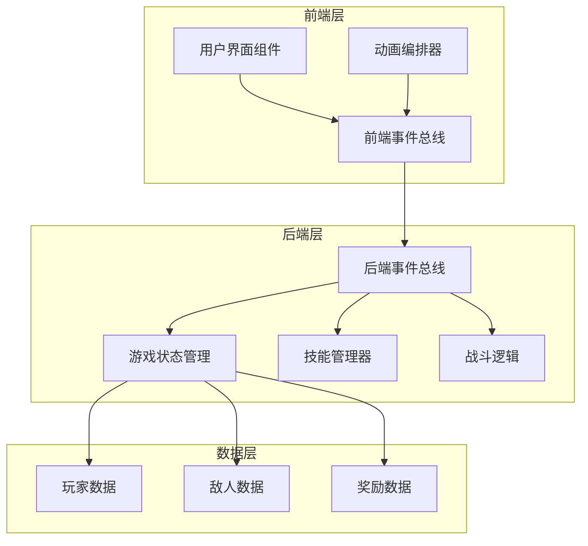
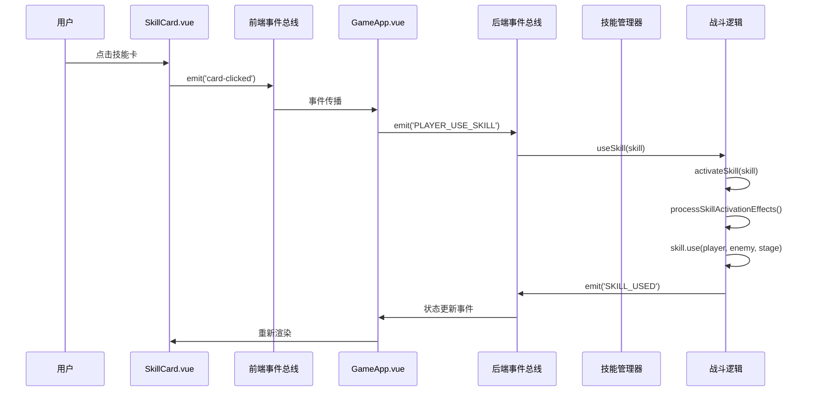
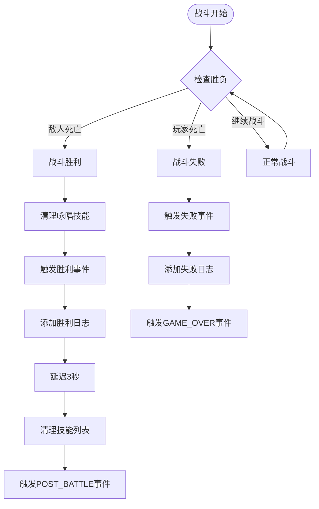
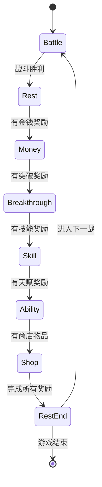
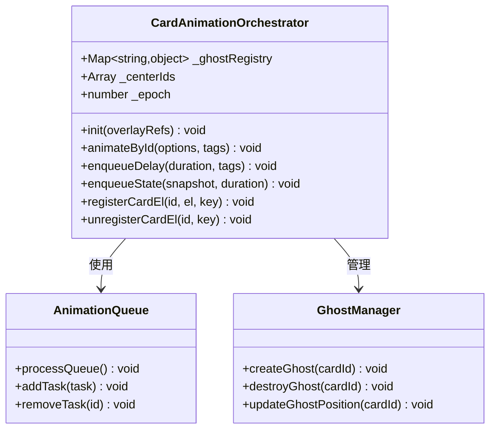

# 关键事件流示例

<cite>
**本文档中引用的文件**
- [GameApp.vue](file://src/GameApp.vue)
- [frontendEventBus.js](file://src/frontendEventBus.js)
- [backendEventBus.js](file://src/backendEventBus.js)
- [skillManager.js](file://src/data/skillManager.js)
- [battle.js](file://src/data/battle.js)
- [SkillCard.vue](file://src/components/global/SkillCard.vue)
- [gameState.js](file://src/data/gameState.js)
- [rest.js](file://src/data/rest.js)
- [cardAnimationOrchestrator.js](file://src/utils/cardAnimationOrchestrator.js)
- [game.js](file://src/game.js)
</cite>

## 目录
1. [简介](#简介)
2. [项目架构概览](#项目架构概览)
3. [技能使用事件流](#技能使用事件流)
4. [战斗结束事件流](#战斗结束事件流)
5. [休整开始事件流](#休整开始事件流)
6. [事件总线系统](#事件总线系统)
7. [动画编排机制](#动画编排机制)
8. [性能考虑](#性能考虑)
9. [故障排除指南](#故障排除指南)
10. [总结](#总结)

## 简介

本文档深入分析了RuneTales虚拟实验室游戏中的关键事件流传播机制。通过具体用例展示了前端和后端事件总线如何协调复杂的交互流程，包括技能使用、战斗结束和休整阶段等核心功能。

游戏采用事件驱动架构，通过前端事件总线(frontendEventBus)和后端事件总线(backendEventBus)实现组件间的松耦合通信。这种设计使得复杂的交互流程能够清晰地追踪和维护。

## 项目架构概览



**图表来源**
- [GameApp.vue](file://src/GameApp.vue#L1-L139)
- [frontendEventBus.js](file://src/frontendEventBus.js#L1-L9)
- [backendEventBus.js](file://src/backendEventBus.js#L1-L80)

**章节来源**
- [GameApp.vue](file://src/GameApp.vue#L1-L139)
- [gameState.js](file://src/data/gameState.js#L1-L75)

## 技能使用事件流

### 完整技能使用流程

技能使用是最复杂的事件流之一，涉及多个阶段的协调：



**图表来源**
- [SkillCard.vue](file://src/components/global/SkillCard.vue#L150-L160)
- [backendEventBus.js](file://src/backendEventBus.js#L40-L45)
- [battle.js](file://src/data/battle.js#L170-L200)

### 技能使用详细步骤

1. **用户交互阶段**
   - 用户点击技能卡触发`onClick`方法
   - 发送`skill-card-clicked`事件到父组件
   - 父组件通过事件总线转发到后端

2. **前端验证阶段**
   - 后端事件总线监听`PLAYER_USE_SKILL`事件
   - 验证技能是否可使用（canUse方法）
   - 检查玩家行动力是否充足

3. **技能激活阶段**
   - 调用`activateSkill`函数
   - 处理技能发动前的效果结算
   - 循环执行技能的各个阶段(use方法)

4. **效果处理阶段**
   - 应用技能造成的伤害或增益
   - 更新玩家和敌人的状态
   - 触发相应的事件通知UI更新

**章节来源**
- [SkillCard.vue](file://src/components/global/SkillCard.vue#L150-L160)
- [battle.js](file://src/data/battle.js#L170-L200)

## 战斗结束事件流

### 战斗胜利流程



**图表来源**
- [battle.js](file://src/data/battle.js#L140-L170)
- [backendEventBus.js](file://src/backendEventBus.js#L15-L25)

### 战斗结束处理逻辑

战斗结束事件流包含以下关键步骤：

1. **胜负判断**
   - 检查玩家生命值是否小于等于0
   - 检查敌人生命值是否小于等于0
   - 根据结果决定进入胜利或失败流程

2. **技能清理**
   - 清理所有咏唱中的技能
   - 触发onDisable生命周期方法
   - 发送技能禁用事件

3. **状态清理**
   - 清空前台、后备和坟地技能列表
   - 清理卡牌动画ghost
   - 重置玩家和敌人的效果状态

4. **事件通知**
   - 发送POST_BATTLE事件携带战斗结果
   - 触发相应的UI更新

**章节来源**
- [battle.js](file://src/data/battle.js#L140-L170)

## 休整开始事件流

### 休整阶段转换机制



**图表来源**
- [rest.js](file://src/data/rest.js#L181-L213)
- [backendEventBus.js](file://src/backendEventBus.js#L15-L25)

### 休整阶段自动推进

休整阶段采用事件驱动的自动推进机制：

1. **奖励计算**
   - 根据战斗结果计算可获得的奖励
   - 包括金钱、技能、天赋和突破

2. **阶段排序**
   - 按照优先级顺序排列可用的奖励阶段
   - 优先级：金钱 → 突破 → 技能 → 天赋 → 商店

3. **自动导航**
   - 自动计算下一个可用阶段
   - 在当前阶段完成后自动跳转到下一阶段

4. **事件通知**
   - 发送REWARDS_SPAWNED事件通知UI更新
   - 触发相应的组件渲染

**章节来源**
- [rest.js](file://src/data/rest.js#L181-L213)

## 事件总线系统

### 前端事件总线

前端事件总线专门负责组件间的数据传递和动画控制：

```javascript
// 前端事件总线定义
import mitt from 'mitt';
const frontendEventBus = mitt();
export default frontendEventBus;
```

主要用途：
- 组件间通信（如技能卡悬停效果）
- 动画控制和播放
- UI状态同步
- 用户交互反馈

### 后端事件总线

后端事件总线负责游戏逻辑和状态管理：

```javascript
// 后端事件总线事件定义
export const EventNames = {
  Game: {
    PRE_GAME_START: 'pre-game-start',
    GAME_START: 'game-start',
    ENTER_BATTLE_STAGE: 'enter-battle-stage',
    ENTER_REST_STAGE: 'enter-rest-stage',
    GAME_OVER: 'game-over',
  },
  Player: {
    SKILL_USED: 'player-skill-used',
    SKILL_REWARD_CLAIMED: 'player-skill-claimed',
    ACTIVATED_SKILLS_UPDATED: 'player-activated-skills-updated',
  },
  PlayerOperations: {
    PLAYER_USE_SKILL: 'battle-player-use-skill',
    PLAYER_END_TURN: 'player-end-turn',
    CLAIM_MONEY: 'rest-claim-money',
    CLAIM_SKILL: 'rest-claim-skill',
  }
};
```

**章节来源**
- [frontendEventBus.js](file://src/frontendEventBus.js#L1-L9)
- [backendEventBus.js](file://src/backendEventBus.js#L1-L80)

## 动画编排机制

### 卡牌动画编排器



**图表来源**
- [cardAnimationOrchestrator.js](file://src/utils/cardAnimationOrchestrator.js#L1-L50)

### 动画队列管理

动画编排器采用基于任务队列的异步动画管理系统：

1. **任务调度**
   - 按照uniqueID维护动画队列
   - 同一卡片的动画按顺序串行执行
   - 不同卡片的动画可并发播放

2. **状态管理**
   - 维护ghost状态缓存
   - 支持动画状态的恢复和重置
   - 提供epoch机制防止过期任务执行

3. **事件集成**
   - 监听card-transfer-start/end事件
   - 支持跨容器的卡牌转移动画
   - 自动处理容器间的动画过渡

**章节来源**
- [cardAnimationOrchestrator.js](file://src/utils/cardAnimationOrchestrator.js#L1-L50)

## 性能考虑

### 事件总线优化

1. **事件去重**
   - 避免重复发送相同事件
   - 使用幂等性检查减少不必要的处理

2. **内存管理**
   - 及时清理过期的事件监听器
   - 防止内存泄漏

3. **批量处理**
   - 合并相似的事件处理
   - 减少频繁的状态更新

### 动画性能优化

1. **GPU加速**
   - 使用CSS transform和opacity属性
   - 避免强制重排和重绘

2. **帧率控制**
   - 限制动画帧率避免过度消耗CPU
   - 使用requestAnimationFrame优化动画循环

3. **资源管理**
   - 及时释放动画资源
   - 避免同时播放过多动画

## 故障排除指南

### 常见问题诊断

1. **技能使用失败**
   - 检查技能的canUse方法返回值
   - 验证玩家行动力是否充足
   - 确认技能是否处于冷却状态

2. **事件未触发**
   - 检查事件监听器是否正确注册
   - 验证事件名称拼写是否正确
   - 确认事件发送时机是否恰当

3. **动画异常**
   - 检查DOM元素是否存在
   - 验证动画参数配置是否正确
   - 确认动画队列是否被正确管理

### 调试技巧

1. **事件追踪**
   - 在关键事件处添加console.log输出
   - 使用浏览器开发者工具监控事件流

2. **状态检查**
   - 定期打印游戏状态对象
   - 验证状态变化是否符合预期

3. **性能监控**
   - 使用性能分析工具检测瓶颈
   - 监控内存使用情况

**章节来源**
- [battle.js](file://src/data/battle.js#L170-L200)
- [cardAnimationOrchestrator.js](file://src/utils/cardAnimationOrchestrator.js#L1-L50)

## 总结

本文档详细分析了RuneTales虚拟实验室游戏中的关键事件流传播机制。通过技能使用、战斗结束和休整开始等具体用例，展示了前端和后端事件总线如何协调复杂的交互流程。

主要特点包括：

1. **事件驱动架构**：采用松耦合的事件系统，便于维护和扩展
2. **分层设计**：前端事件总线负责UI交互，后端事件总线负责业务逻辑
3. **动画编排**：专业的动画管理系统确保流畅的游戏体验
4. **状态管理**：清晰的游戏状态模型支持复杂的交互逻辑

这种设计模式为构建复杂的交互式应用程序提供了优秀的参考范例，特别是在需要协调多个组件和复杂状态流转的场景中。