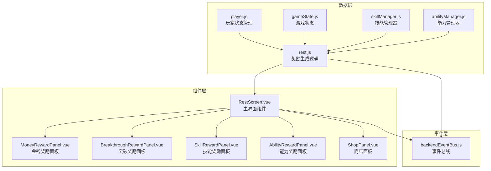
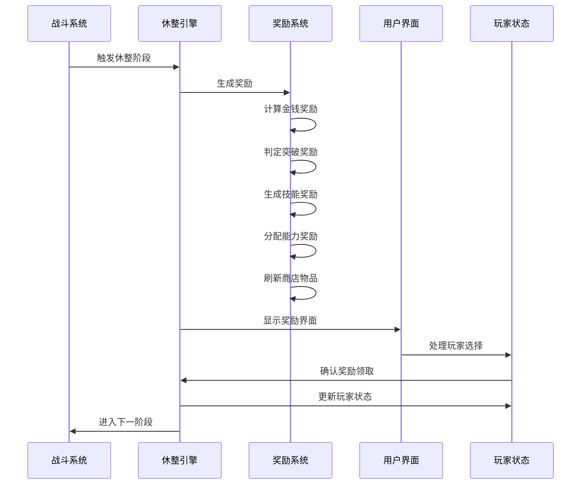
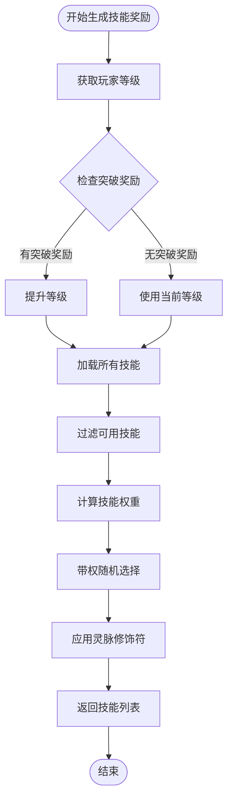
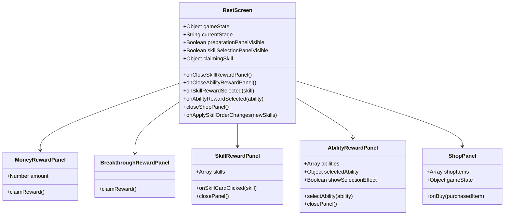
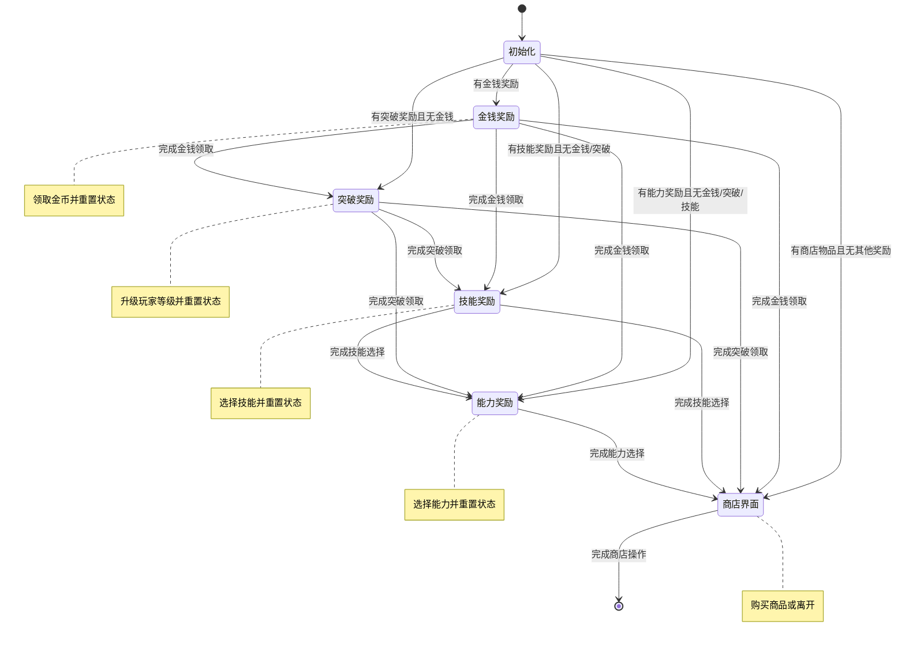
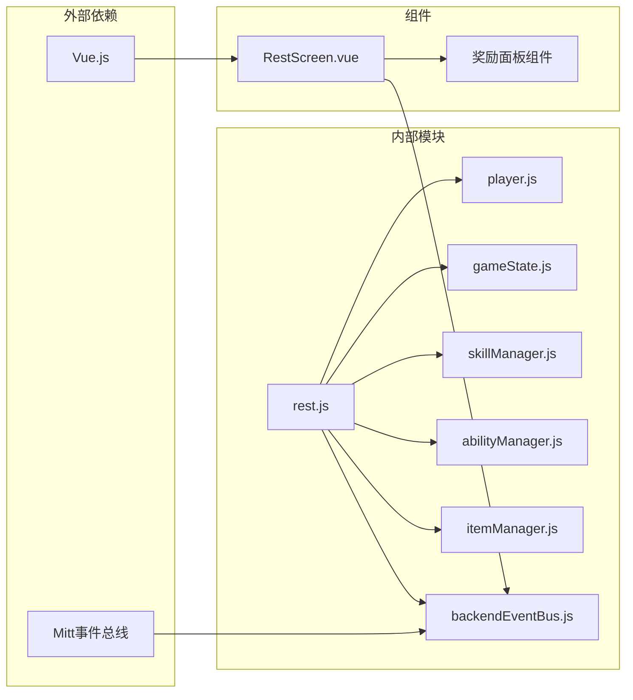

# 休整系统

<cite>
**本文档中引用的文件**
- [src/data/rest.js](file://src/data/rest.js)
- [src/data/player.js](file://src/data/player.js)
- [src/data/skillManager.js](file://src/data/skillManager.js)
- [src/data/abilityManager.js](file://src/data/abilityManager.js)
- [src/data/gameState.js](file://src/data/gameState.js)
- [src/components/RestScreen.vue](file://src/components/RestScreen.vue)
- [src/components/MoneyRewardPanel.vue](file://src/components/MoneyRewardPanel.vue)
- [src/components/BreakthroughRewardPanel.vue](file://src/components/BreakthroughRewardPanel.vue)
- [src/components/SkillRewardPanel.vue](file://src/components/SkillRewardPanel.vue)
- [src/components/AbilityRewardPanel.vue](file://src/components/AbilityRewardPanel.vue)
- [src/components/ShopPanel.vue](file://src/components/ShopPanel.vue)
- [src/backendEventBus.js](file://src/backendEventBus.js)
</cite>

## 目录
1. [简介](#简介)
2. [项目结构](#项目结构)
3. [核心组件](#核心组件)
4. [架构概览](#架构概览)
5. [详细组件分析](#详细组件分析)
6. [依赖关系分析](#依赖关系分析)
7. [性能考虑](#性能考虑)
8. [故障排除指南](#故障排除指南)
9. [结论](#结论)

## 简介

休整系统是《灵御》游戏的核心机制之一，负责管理战斗后的奖励分配、玩家成长和资源管理。该系统实现了复杂的奖励生成算法，包括金钱、技能和能力奖励的分配策略，并提供了直观的用户界面来处理各种奖励选项。

系统的主要功能包括：
- 自动计算战斗奖励金额
- 生成突破奖励和等级提升
- 随机生成技能奖励池
- 提供能力奖励选择机制
- 实现商店系统和商品刷新
- 管理奖励状态转换和玩家交互流程

## 项目结构



**图表来源**
- [src/data/rest.js](file://src/data/rest.js#L1-L215)
- [src/components/RestScreen.vue](file://src/components/RestScreen.vue#L1-L269)

## 核心组件

### 奖励生成引擎

奖励生成引擎位于 `rest.js` 文件中，负责整个休整阶段的核心逻辑。它实现了以下主要功能：

1. **金钱奖励计算**：基于随机算法生成战斗奖励金额
2. **突破奖励判定**：根据战斗次数和敌人类型决定是否触发突破
3. **技能奖励生成**：使用复杂权重算法生成高质量技能奖励
4. **能力奖励分配**：根据战斗条件随机生成能力奖励
5. **商店刷新**：生成新的商店商品列表

### 状态管理系统

游戏状态通过 `gameState.js` 进行统一管理，维护着当前的奖励状态、玩家状态和界面状态。

**章节来源**
- [src/data/rest.js](file://src/data/rest.js#L1-L215)
- [src/data/gameState.js](file://src/data/gameState.js#L1-L75)

## 架构概览



**图表来源**
- [src/data/rest.js](file://src/data/rest.js#L25-L50)
- [src/components/RestScreen.vue](file://src/components/RestScreen.vue#L1-L50)

## 详细组件分析

### 奖励生成算法

#### 金钱奖励算法

```javascript
// 金钱奖励计算逻辑
gameState.rewards.money = Math.floor(Math.random() * 20) + 10;
```

金钱奖励采用简单的随机算法，范围在10到29之间。这种设计确保了玩家每次都能获得稳定的收入，同时保持一定的随机性。

#### 突破奖励机制

```javascript
// 突破奖励判定
gameState.rewards.breakthrough = (
  gameState.battleCount === 2 || gameState.enemy.isBoss
);
```

突破奖励的触发条件包括：
- 第二次战斗胜利
- 击败Boss敌人

当玩家获得突破奖励时，系统会自动提升玩家等级，并重置相关状态。

#### 技能奖励生成算法

技能奖励生成是最复杂的部分，涉及多个权重计算因素：



**图表来源**
- [src/data/rest.js](file://src/data/rest.js#L12-L22)
- [src/data/skillManager.js](file://src/data/skillManager.js#L100-L200)

权重计算考虑了以下因素：

1. **等级差异调整**：高等级技能出现概率降低
2. **灵脉耦合度**：技能类型与玩家灵脉的匹配度
3. **前置技能要求**：支持升级候选技能
4. **品质提升**：高质量奖励中贴近玩家等级的技能概率大幅提升

#### 能力奖励分配

```javascript
// 能力奖励生成
const haveAbilityReward = (
  gameState.battleCount % 2 === 1 || gameState.enemy.isBoss
);
if(haveAbilityReward) {
  gameState.rewards.abilities = AbilityManager.getInstance().getRandomAbilities(
    0, gameState.player.tier
  );
}
```

能力奖励的分配遵循以下规则：
- 奇数次战斗后必定获得能力奖励
- 击败Boss敌人时必定获得能力奖励
- 能力的稀有度和等级通过权重系统控制

### 用户界面组件

#### 主界面组件 RestScreen



**图表来源**
- [src/components/RestScreen.vue](file://src/components/RestScreen.vue#L50-L150)
- [src/components/MoneyRewardPanel.vue](file://src/components/MoneyRewardPanel.vue#L1-L60)

#### 奖励面板组件

每个奖励面板都有特定的功能和交互逻辑：

1. **金钱奖励面板**：显示获得的金币数量，点击后领取
2. **突破奖励面板**：显示突破提示，点击后升级玩家等级
3. **技能奖励面板**：展示4个随机技能，玩家选择后放入技能库
4. **能力奖励面板**：展示能力列表，支持选择和动画效果
5. **商店面板**：展示可购买的商品，支持购买和离开操作

### 状态转换机制



**图表来源**
- [src/data/rest.js](file://src/data/rest.js#L180-L215)

**章节来源**
- [src/data/rest.js](file://src/data/rest.js#L1-L215)
- [src/components/RestScreen.vue](file://src/components/RestScreen.vue#L1-L269)
- [src/components/MoneyRewardPanel.vue](file://src/components/MoneyRewardPanel.vue#L1-L60)
- [src/components/BreakthroughRewardPanel.vue](file://src/components/BreakthroughRewardPanel.vue#L1-L66)
- [src/components/SkillRewardPanel.vue](file://src/components/SkillRewardPanel.vue#L1-L79)
- [src/components/AbilityRewardPanel.vue](file://src/components/AbilityRewardPanel.vue#L1-L228)
- [src/components/ShopPanel.vue](file://src/components/ShopPanel.vue#L1-L220)

## 依赖关系分析



**图表来源**
- [src/data/rest.js](file://src/data/rest.js#L1-L10)
- [src/components/RestScreen.vue](file://src/components/RestScreen.vue#L1-L50)

**章节来源**
- [src/data/rest.js](file://src/data/rest.js#L1-L10)
- [src/data/player.js](file://src/data/player.js#L1-L20)
- [src/data/gameState.js](file://src/data/gameState.js#L1-L20)

## 性能考虑

### 内存管理

1. **奖励状态清理**：每次领取奖励后立即清理相关状态，防止内存泄漏
2. **技能实例复用**：技能管理器使用单例模式，避免重复创建实例
3. **事件监听器清理**：及时移除不再需要的事件监听器

### 算法优化

1. **权重计算缓存**：技能权重计算结果可以适当缓存，减少重复计算
2. **随机数优化**：使用高效的随机数生成算法，确保公平性和性能
3. **批量操作**：对于多个奖励项目的处理，采用批量操作提高效率

### 渲染性能

1. **组件懒加载**：奖励面板组件采用条件渲染，减少不必要的DOM操作
2. **动画优化**：使用CSS3动画而非JavaScript动画，提高流畅度
3. **响应式设计**：界面组件适配不同屏幕尺寸，提升用户体验

## 故障排除指南

### 常见问题及解决方案

#### 奖励生成异常

**问题**：技能奖励为空或生成失败
**原因**：技能池中没有符合条件的技能
**解决方案**：
1. 检查玩家等级是否过高导致技能筛选条件过于严格
2. 验证技能管理器是否正确加载所有技能
3. 确认玩家灵脉配置是否合理

#### 界面显示问题

**问题**：奖励面板无法正常显示
**原因**：状态同步问题或组件初始化异常
**解决方案**：
1. 检查游戏状态是否正确初始化
2. 验证事件总线连接是否正常
3. 确认组件生命周期钩子是否正确执行

#### 性能问题

**问题**：界面响应缓慢
**原因**：大量DOM操作或复杂计算
**解决方案**：
1. 使用虚拟滚动技术处理大量奖励项目
2. 优化权重计算算法，减少循环嵌套
3. 实施防抖和节流机制处理频繁的用户操作

**章节来源**
- [src/data/rest.js](file://src/data/rest.js#L50-L100)
- [src/backendEventBus.js](file://src/backendEventBus.js#L1-L80)

## 结论

休整系统是一个设计精良的游戏机制，它成功地平衡了随机性和可预测性，为玩家提供了丰富的成长体验。系统的核心优势包括：

1. **灵活的奖励机制**：多层次的奖励系统满足不同玩家的需求
2. **智能的权重算法**：复杂的权重计算确保奖励的公平性和趣味性
3. **直观的用户界面**：清晰的界面设计和流畅的交互体验
4. **良好的扩展性**：模块化的架构便于添加新的奖励类型和功能

该系统为游戏的长期可玩性奠定了坚实基础，通过精心设计的奖励机制引导玩家逐步提升实力，同时保持游戏的新鲜感和挑战性。未来可以考虑进一步优化算法性能，增加更多类型的奖励选项，以及改进用户界面的个性化设置。