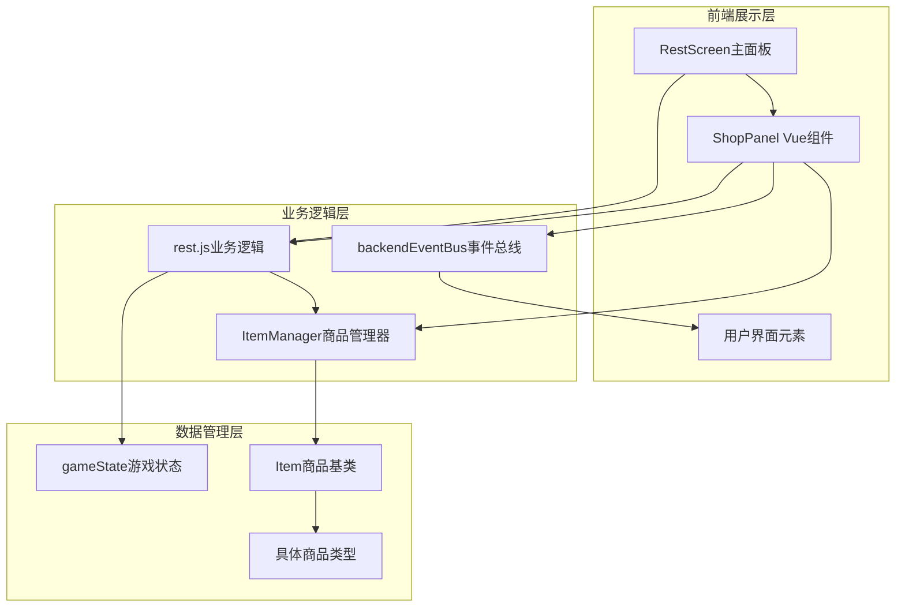
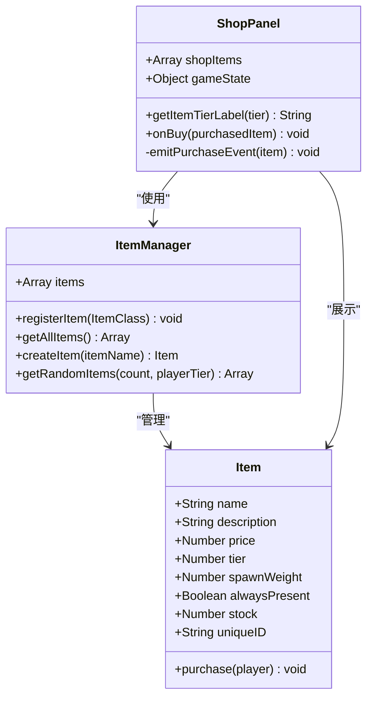
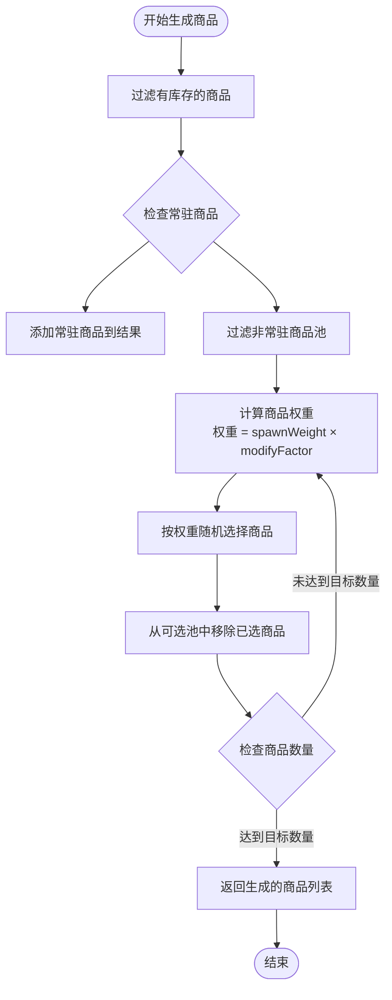
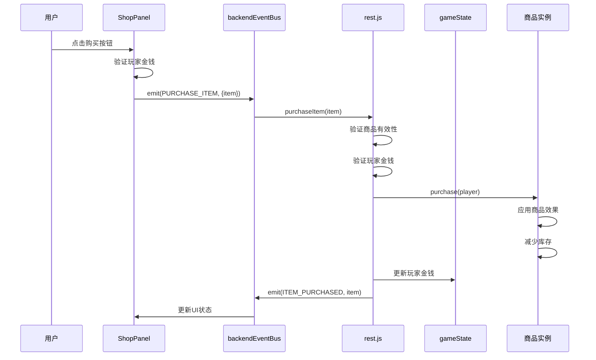
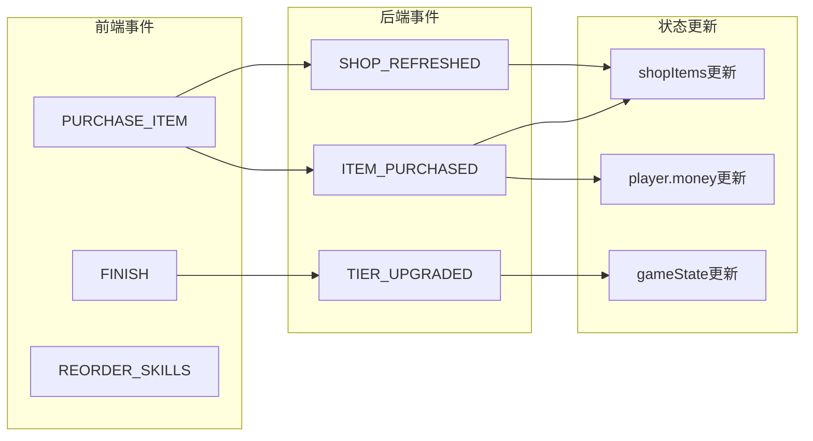
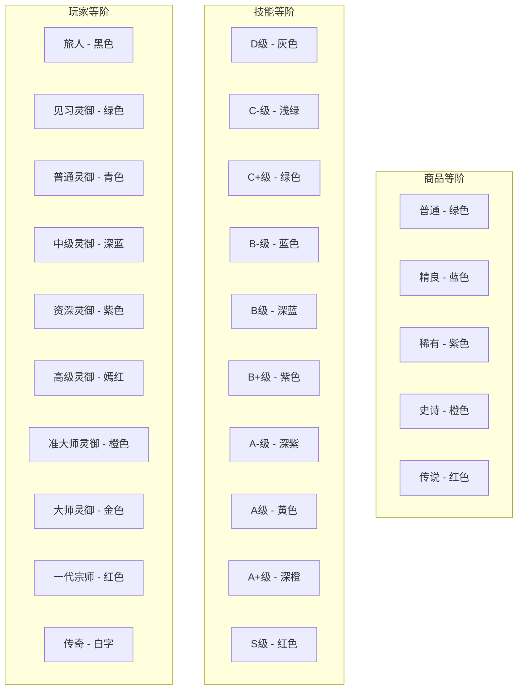
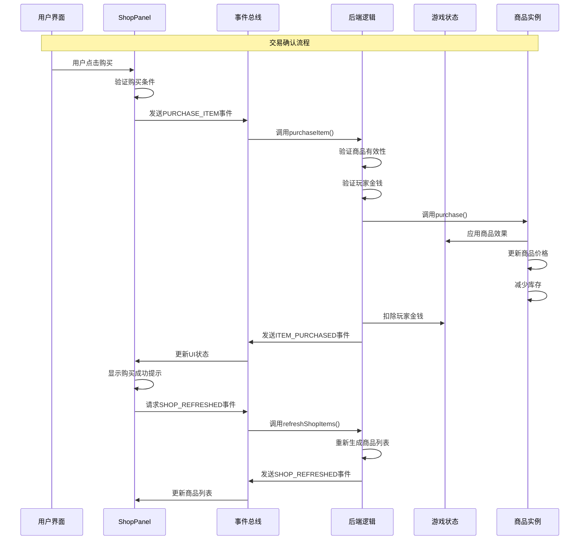
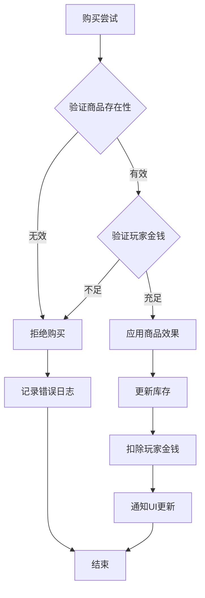

# 商店系统运作逻辑

<cite>
**本文档引用的文件**
- [src/data/rest.js](file://src/data/rest.js)
- [src/data/itemManager.js](file://src/data/itemManager.js)
- [src/data/item.js](file://src/data/item.js)
- [src/components/rest/ShopPanel.vue](file://src/components/rest/ShopPanel.vue)
- [src/components/rest/RestScreen.vue](file://src/components/rest/RestScreen.vue)
- [src/data/gameState.js](file://src/data/gameState.js)
- [src/backendEventBus.js](file://src/backendEventBus.js)
- [src/utils/tierUtils.js](file://src/utils/tierUtils.js)
</cite>

## 目录
1. [简介](#简介)
2. [系统架构概览](#系统架构概览)
3. [核心组件分析](#核心组件分析)
4. [商品生成机制](#商品生成机制)
5. [购买逻辑与库存管理](#购买逻辑与库存管理)
6. [事件驱动架构](#事件驱动架构)
7. [玩家进度与权重调整](#玩家进度与权重调整)
8. [特殊事件下的动态变更](#特殊事件下的动态变更)
9. [交易确认流程](#交易确认流程)
10. [自定义商品扩展](#自定义商品扩展)
11. [容错方案](#容错方案)
12. [性能考虑](#性能考虑)
13. [故障排除指南](#故障排除指南)
14. [总结](#总结)

## 简介

商店系统是游戏休整阶段的重要组成部分，负责管理商品列表生成、刷新规则、购买逻辑和库存管理。该系统采用事件驱动架构，通过ShopPanel与rest.js协同工作，确保可售物品类型及价格策略的动态确定。系统支持基于玩家进度的商品权重调整算法，并能在特殊事件下实现商店内容的动态变更。

## 系统架构概览

商店系统采用分层架构设计，包含前端展示层、业务逻辑层和数据管理层：



**图表来源**
- [src/components/rest/ShopPanel.vue](file://src/components/rest/ShopPanel.vue#L1-L220)
- [src/data/rest.js](file://src/data/rest.js#L1-L215)
- [src/data/itemManager.js](file://src/data/itemManager.js#L1-L125)

## 核心组件分析

### ShopPanel组件

ShopPanel是商店系统的主要前端组件，负责商品展示和用户交互：



**图表来源**
- [src/components/rest/ShopPanel.vue](file://src/components/rest/ShopPanel.vue#L25-L50)
- [src/data/item.js](file://src/data/item.js#L1-L64)
- [src/data/itemManager.js](file://src/data/itemManager.js#L3-L20)

### 商品管理系统

ItemManager负责商品的注册、管理和随机生成：

**章节来源**
- [src/data/itemManager.js](file://src/data/itemManager.js#L1-L125)

## 商品生成机制

### 商品权重算法

商店系统采用基于玩家等级的商品权重调整算法：



**图表来源**
- [src/data/itemManager.js](file://src/data/itemManager.js#L30-L120)

### 权重调整因子

权重调整因子根据玩家等级与商品等级的差异动态计算：

| 等级差 | 调整因子 |
|--------|----------|
| ≤ 1 | 1.0 |
| 2 | 1.2 |
| 3 | 1.5 |
| 4 | 2.0 |
| ≥ 5 | 2.5 |

**章节来源**
- [src/data/itemManager.js](file://src/data/itemManager.js#L55-L75)

## 购买逻辑与库存管理

### 购买流程



**图表来源**
- [src/components/rest/ShopPanel.vue](file://src/components/rest/ShopPanel.vue#L48-L52)
- [src/data/rest.js](file://src/data/rest.js#L155-L165)

### 库存管理机制

商品库存采用有限库存和无限库存两种模式：

**章节来源**
- [src/data/item.js](file://src/data/item.js#L1-L64)

## 事件驱动架构

### 事件流图



**图表来源**
- [src/backendEventBus.js](file://src/backendEventBus.js#L1-L80)

**章节来源**
- [src/backendEventBus.js](file://src/backendEventBus.js#L1-L80)

## 玩家进度与权重调整

### 等阶映射系统

系统维护完整的等阶映射体系，支持商品、技能和能力的等级分类：



**图表来源**
- [src/utils/tierUtils.js](file://src/utils/tierUtils.js#L1-L218)

**章节来源**
- [src/utils/tierUtils.js](file://src/utils/tierUtils.js#L1-L218)

## 特殊事件下的动态变更

### 商店刷新机制

商店系统支持多种特殊事件下的动态内容变更：

1. **战斗胜利后刷新**：每次战斗胜利后自动刷新商店商品
2. **突破奖励触发**：玩家达到突破条件时刷新更高品质商品
3. **玩家等级提升**：随着玩家等级提升，可选商品品质相应提高

**章节来源**
- [src/data/rest.js](file://src/data/rest.js#L167-L172)

## 交易确认流程

### 完整生命周期



**图表来源**
- [src/components/rest/ShopPanel.vue](file://src/components/rest/ShopPanel.vue#L48-L52)
- [src/data/rest.js](file://src/data/rest.js#L155-L172)

**章节来源**
- [src/data/rest.js](file://src/data/rest.js#L155-L172)

## 自定义商品扩展

### 商品扩展方法

系统提供了灵活的商品扩展机制：

```javascript
// 自定义商品示例
class CustomItem extends Item {
  constructor() {
    super(
      '自定义商品',           // 名称
      '自定义商品描述',       // 描述
      100,                   // 价格
      3,                     // 等级
      1.0,                   // 生成权重
      false,                 // 是否常驻
      Infinity               // 库存数量
    );
  }
  
  purchase(player) {
    // 实现自定义购买效果
    // 必须调用super.purchase()以减少库存
    super.purchase(player);
    
    // 添加自定义逻辑
    player.customStat += 10;
  }
}
```

**章节来源**
- [src/data/item.js](file://src/data/item.js#L1-L64)

## 容错方案

### 错误处理机制

系统实现了多层容错保护：

1. **无效商品检测**：购买前验证商品是否存在
2. **金钱不足保护**：阻止玩家购买超出预算的商品
3. **库存限制检查**：防止超卖和库存负数
4. **事件监听器异常处理**：确保事件传播的稳定性



**图表来源**
- [src/data/rest.js](file://src/data/rest.js#L155-L165)

**章节来源**
- [src/data/rest.js](file://src/data/rest.js#L155-L165)

## 性能考虑

### 优化策略

1. **延迟初始化**：商品管理器采用延迟初始化策略，只在需要时创建商品实例
2. **权重缓存**：计算好的商品权重会被缓存，避免重复计算
3. **事件去重**：使用事件总线避免重复的状态更新
4. **内存管理**：及时清理不再使用的商品实例

### 复杂度分析

- **商品生成复杂度**：O(n)，其中n为商品池大小
- **权重计算复杂度**：O(m)，其中m为商品数量
- **事件处理复杂度**：O(1)，基于事件总线的异步处理

## 故障排除指南

### 常见问题及解决方案

1. **商品无法购买**
   - 检查玩家金钱是否足够
   - 验证商品库存是否充足
   - 确认商品是否被正确注册

2. **商店不刷新**
   - 检查事件总线连接状态
   - 验证refreshShopItems函数调用
   - 确认商品池中有可用商品

3. **购买效果不生效**
   - 检查商品purchase方法实现
   - 验证事件监听器注册
   - 确认游戏状态更新逻辑

**章节来源**
- [src/data/rest.js](file://src/data/rest.js#L167-L172)

## 总结

商店系统是一个功能完善、架构清晰的游戏组件，具有以下特点：

1. **模块化设计**：采用分层架构，职责明确，易于维护和扩展
2. **事件驱动**：基于事件总线的松耦合设计，确保系统的可扩展性
3. **动态平衡**：通过权重算法和玩家进度调整，实现商品价值的动态平衡
4. **容错机制**：完善的错误处理和异常保护，确保系统稳定性
5. **用户体验**：直观的界面设计和流畅的操作体验

该系统为游戏提供了完整的商品交易解决方案，支持复杂的经济模型和动态内容生成，是游戏开发中商店系统设计的优秀范例。