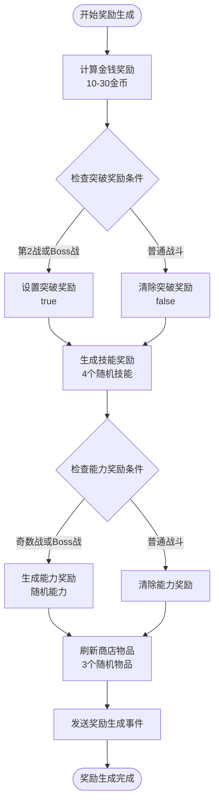

# 奖励生成机制

<cite>
**本文档中引用的文件**
- [rest.js](file://src/data/rest.js)
- [MoneyRewardPanel.vue](file://src/components/MoneyRewardPanel.vue)
- [SkillRewardPanel.vue](file://src/components/SkillRewardPanel.vue)
- [BreakthroughRewardPanel.vue](file://src/components/BreakthroughRewardPanel.vue)
- [gameState.js](file://src/data/gameState.js)
- [player.js](file://src/data/player.js)
- [skillManager.js](file://src/data/skillManager.js)
- [skill.js](file://src/data/skill.js)
- [backendEventBus.js](file://src/backendEventBus.js)
- [agilePunch.js](file://src/data/skills/martial_arts/agilePunch.js)
</cite>

## 目录
1. [简介](#简介)
2. [项目架构概览](#项目架构概览)
3. [核心奖励系统组件](#核心奖励系统组件)
4. [奖励生成算法详解](#奖励生成算法详解)
5. [奖励面板组件分析](#奖励面板组件分析)
6. [技能奖励系统](#技能奖励系统)
7. [金钱奖励机制](#金钱奖励机制)
8. [突破奖励系统](#突破奖励系统)
9. [能力奖励机制](#能力奖励机制)
10. [奖励分配数学模型](#奖励分配数学模型)
11. [性能优化与安全控制](#性能优化与安全控制)
12. [故障排除指南](#故障排除指南)
13. [总结](#总结)

## 简介

本项目实现了一个复杂而精巧的奖励生成系统，专为RPG游戏设计。该系统通过动态算法计算各种奖励类型，包括金钱、技能、突破和能力奖励，确保玩家在每次战斗后都能获得与其表现和游戏进度相匹配的奖励。

奖励系统的核心设计理念是：
- **动态平衡**：根据玩家等级、战斗表现和游戏进度动态调整奖励内容
- **多样性**：提供多种奖励类型，满足不同玩家的游戏风格
- **可扩展性**：模块化设计支持未来新增奖励类型
- **用户体验**：直观的奖励界面和流畅的交互体验

## 项目架构概览

奖励系统采用分层架构设计，确保各组件职责清晰且高度解耦：


**图表来源**
- [rest.js](file://src/data/rest.js#L1-L215)
- [gameState.js](file://src/data/gameState.js#L1-L75)
- [backendEventBus.js](file://src/backendEventBus.js#L1-L80)

## 核心奖励系统组件

### 主要组件关系图


**图表来源**
- [rest.js](file://src/data/rest.js#L15-L215)
- [skillManager.js](file://src/data/skillManager.js#L1-L253)
- [player.js](file://src/data/player.js#L1-L226)
- [skill.js](file://src/data/skill.js#L1-L205)

**章节来源**
- [rest.js](file://src/data/rest.js#L1-L215)
- [gameState.js](file://src/data/gameState.js#L1-L75)
- [skillManager.js](file://src/data/skillManager.js#L1-L253)

## 奖励生成算法详解

### 基础奖励生成流程

奖励生成遵循严格的顺序和逻辑，确保游戏平衡性和玩家体验：



**图表来源**
- [rest.js](file://src/data/rest.js#L39-L65)

### 突破奖励触发条件

突破奖励是奖励系统中最重要的一环，具有以下触发条件：

1. **战斗次数条件**：第2场战斗时自动触发
2. **Boss战条件**：击败Boss时触发
3. **奖励提升机制**：触发突破奖励后，技能奖励品质显著提升

```javascript
// 突破奖励触发逻辑
gameState.rewards.breakthrough = (
  gameState.battleCount === 2 || gameState.enemy.isBoss
);
```

突破奖励不仅提供玩家等级提升，还直接影响后续技能奖励的质量：

```javascript
// 技能奖励生成时的突破奖励影响
let tier = gameState.player.tier;
if(gameState.rewards.breakthrough) {
  const nextTier = getNextPlayerTier(tier);
  if(nextTier) tier = nextTier;
}
gameState.rewards.skills = SkillManager.getInstance().getRandomSkills(
  4, gameState.player.leino, gameState.player.cultivatedSkills, tier, true
);
```

**章节来源**
- [rest.js](file://src/data/rest.js#L39-L65)
- [rest.js](file://src/data/rest.js#L15-L25)

## 奖励面板组件分析

### 面板组件架构

奖励系统采用Vue组件化设计，每个奖励类型都有对应的专用面板：


**图表来源**
- [MoneyRewardPanel.vue](file://src/components/MoneyRewardPanel.vue#L1-L60)
- [SkillRewardPanel.vue](file://src/components/SkillRewardPanel.vue#L1-L79)
- [BreakthroughRewardPanel.vue](file://src/components/BreakthroughRewardPanel.vue#L1-L66)

### MoneyRewardPanel组件详解

MoneyRewardPanel是最简单的奖励面板，提供金币奖励的领取功能：

```javascript
// MoneyRewardPanel核心逻辑
export default {
  name: 'MoneyRewardPanel',
  props: {
    amount: {
      type: Number,
      default: 0
    }
  },
  methods: {
    claimReward() {
      backendEventBus.emit(EventNames.PlayerOperations.CLAIM_MONEY);
      this.$emit('claimed');
    }
  }
}
```

该组件采用简洁的设计模式，通过事件总线与后端逻辑通信，确保奖励领取的正确执行。

### SkillRewardPanel组件详解

SkillRewardPanel负责处理技能奖励的选择和管理：

```javascript
// SkillRewardPanel核心逻辑
export default {
  name: 'SkillRewardPanel',
  props: {
    skills: {
      type: Array,
      default: () => []
    }
  },
  methods: {
    onSkillCardClicked(skill) {
      this.$emit('selected-skill-reward', skill);
    },
    closePanel() {
      this.$emit('close');
    }
  }
}
```

该组件支持多个技能同时展示，并提供升级候选技能的特殊处理逻辑。

**章节来源**
- [MoneyRewardPanel.vue](file://src/components/MoneyRewardPanel.vue#L1-L60)
- [SkillRewardPanel.vue](file://src/components/SkillRewardPanel.vue#L1-L79)
- [BreakthroughRewardPanel.vue](file://src/components/BreakthroughRewardPanel.vue#L1-L66)

## 技能奖励系统

### 技能奖励生成算法

技能奖励系统是最复杂的部分，采用加权概率算法确保奖励的多样性和平衡性：


**图表来源**
- [skillManager.js](file://src/data/skillManager.js#L80-L253)

### 灵脉因子权重计算

灵脉因子是技能奖励系统的核心机制，影响技能出现的概率：

```javascript
// 灵脉因子权重计算逻辑
{
  let leinoFactor = Math.max(playerLeino[skill.type] || 0.2, 0);
  if (skill.type === 'normal') leinoFactor = Math.max(leinoFactor, 1);
  modifyFactor *= leinoFactor;
}

// 多灵脉修饰符的平均值模型
if (skill.leinoModifiers) {
  const list = Array.isArray(skill.leinoModifiers) ? skill.leinoModifiers : [skill.leinoModifiers];
  const factors = list.map(key => {
    const v = playerLeino[key];
    return (typeof v === 'number' && v > 0) ? v : 1;
  });
  if (factors.length > 0) {
    const avg = factors.reduce((a,b)=>a+b,0) / factors.length;
    modifyFactor *= avg;
  }
}
```

### 升级候选技能机制

升级候选技能提供了技能树式的成长路径：

```javascript
// 升级候选技能逻辑
const upgradeCandidates = [];
for (const meta of allSkills) {
  if (playerSkillNames.includes(meta.name)) continue;
  if (meta.tier > playerTier) continue;
  if (!meta.precessor) continue;

  let matchedSource = null;
  if (Array.isArray(meta.precessor)) {
    matchedSource = meta.precessor.find(p => playerSkillNames.includes(p)) || null;
  } else if (typeof meta.precessor === 'string') {
    matchedSource = playerSkillNames.includes(meta.precessor) ? meta.precessor : null;
  }
  if (!matchedSource) continue;

  upgradeCandidates.push({ ...meta, isUpgradeCandidate: true, upgradedFrom: matchedSource });
}
```

**章节来源**
- [skillManager.js](file://src/data/skillManager.js#L80-L253)
- [rest.js](file://src/data/rest.js#L15-L25)

## 金钱奖励机制

### 金钱奖励计算公式

金钱奖励采用简单的随机范围生成，确保每次战斗都有稳定的经济收益：

```javascript
// 金钱奖励计算
gameState.rewards.money = Math.floor(Math.random() * 20) + 10;
```

这个公式确保：
- **最小值**：10金币（保证基本收益）
- **最大值**：29金币（避免过度膨胀）
- **平均值**：19.5金币（平衡的经济系统）

### 金钱奖励领取流程


**图表来源**
- [MoneyRewardPanel.vue](file://src/components/MoneyRewardPanel.vue#L15-L25)
- [rest.js](file://src/data/rest.js#L67-L75)

**章节来源**
- [rest.js](file://src/data/rest.js#L67-L75)
- [rest.js](file://src/data/rest.js#L39-L45)

## 突破奖励系统

### 突破奖励的数据结构

突破奖励是一个布尔值，但在系统内部有丰富的含义：

```javascript
// 突破奖励数据结构
gameState.rewards.breakthrough = false;

// 突破奖励领取逻辑
export function claimBreakthroughReward() {
  if (!gameState.rewards.breakthrough) return;
  gameState.rewards.breakthrough = false;
  upgradePlayerTier(gameState.player);
  gotoNextRestStage();
  backendEventBus.emit(EventNames.Player.TIER_UPGRADED, gameState.player);
}
```

### 突破奖励的影响机制

突破奖励对整个奖励系统产生连锁反应：

1. **技能奖励提升**：玩家等级自动提升一级
2. **奖励品质增强**：高品质奖励标志传递到技能生成器
3. **玩家属性更新**：自动调整玩家的基础属性

```javascript
// 玩家等级提升逻辑
export function upgradePlayerTier (player) {
  const nextTier = getNextPlayerTier(player.tier);
  if (nextTier !== undefined) {
    player.tier = nextTier;
    if (player.tier === 1) {
      player.maxMana = 5;
    }
    if (player.maxActionPoints < 4) {
      player.maxActionPoints++;
    }
  }
  player.hp = player.maxHp;
  player.mana = player.maxMana;
  backendEventBus.emit(EventNames.Player.TIER_UPGRADED, player);
  return true;
}
```

**章节来源**
- [rest.js](file://src/data/rest.js#L105-L115)
- [player.js](file://src/data/player.js#L10-L25)

## 能力奖励机制

### 能力奖励生成条件

能力奖励根据战斗次数和敌人类型动态生成：

```javascript
// 能力奖励生成条件
const haveAbilityReward = (
  gameState.battleCount % 2 === 1 || gameState.enemy.isBoss
);
if(haveAbilityReward) {
  gameState.rewards.abilities = AbilityManager.getInstance().getRandomAbilities(
    0, gameState.player.tier
  );
} else {
  gameState.rewards.abilities = [];
}
```

### 能力奖励领取流程


**图表来源**
- [rest.js](file://src/data/rest.js#L117-L125)

**章节来源**
- [rest.js](file://src/data/rest.js#L55-L65)
- [rest.js](file://src/data/rest.js#L117-L125)

## 奖励分配数学模型

### 技能权重计算模型

奖励系统采用多层次的权重计算模型：


**图表来源**
- [skillManager.js](file://src/data/skillManager.js#L154-L200)

### 权重计算公式详解

```javascript
// 权重计算核心公式
const weightedSkills = availableSkills.map(skill => {
  const tierDifference = playerTier - skill.tier;
  let modifyFactor = 1;

  // 高等级技能出现权重降低
  if (skill.tier >= 8) modifyFactor *= 0.7;
  if (skill.tier >= 5) modifyFactor *= 0.8;

  // 等级太低的技能出现权重大幅降低
  if (tierDifference > 7) {
    modifyFactor = 0.15;
  } else if (tierDifference > 6) {
    modifyFactor = 0.40;
  } else if (tierDifference > 5) {
    modifyFactor = 0.70;
  }

  // 高质量奖励中，贴近玩家等级上限技能概率大幅提升
  if(bestQuality && tierDifference < 1) modifyFactor *= 5;
  if(bestQuality && tierDifference < 2) modifyFactor *= 3;

  // 灵脉因子影响
  let leinoFactor = Math.max(playerLeino[skill.type] || 0.2, 0);
  if (skill.type === 'normal') leinoFactor = Math.max(leinoFactor, 1);
  modifyFactor *= leinoFactor;

  // 多灵脉修饰符平均值
  if (skill.leinoModifiers) {
    const list = Array.isArray(skill.leinoModifiers) ? skill.leinoModifiers : [skill.leinoModifiers];
    const factors = list.map(key => {
      const v = playerLeino[key];
      return (typeof v === 'number' && v > 0) ? v : 1;
    });
    if (factors.length > 0) {
      const avg = factors.reduce((a,b)=>a+b,0) / factors.length;
      modifyFactor *= avg;
    }
  }

  // 升级候选技能额外提升
  if(skill.isUpgradeCandidate) modifyFactor *= 2;

  return { ...skill, weight: modifyFactor };
});
```

### 概率分布特性

该数学模型具有以下特性：

1. **正态分布倾向**：接近玩家等级的技能更容易出现
2. **等级惩罚机制**：高等级技能出现概率递减
3. **品质提升效果**：高品质奖励显著提高优质技能概率
4. **灵脉适配性**：玩家灵脉类型直接影响技能选择

**章节来源**
- [skillManager.js](file://src/data/skillManager.js#L154-L200)

## 性能优化与安全控制

### 奖励生成性能优化

系统采用多种策略确保奖励生成的高性能：


### 安全控制措施

系统实现了多层安全控制防止奖励溢出：

```javascript
// 技能槽位容量检查
const capacity = Math.min(gameState.player.maxSkills || 0, gameState.player.cultivatedSkills.length + 1);
if (typeof slotIndex !== 'number' || slotIndex < 0) slotIndex = gameState.player.cultivatedSkills.length;
if (slotIndex >= capacity) slotIndex = capacity - 1;

// 金钱奖励边界检查
gameState.rewards.money = Math.max(0, Math.min(gameState.rewards.money, MAX_MONEY));

// 技能奖励存在性检查
if (!skill) {
  console.warn('尝试领取不存在的技能奖励：', skillID);
  return;
}
```

### 错误处理机制

```javascript
// 异常处理和恢复
try {
  enqueueAnimateCardById({
    id: skill.uniqueID,
    kind: undefined,
    steps: [...],
    hideStart: true,
    options: { endMode: 'destroy' }
  }, { waitTags: ['all'] });
} catch (_) {
  // 动画失败时的降级处理
  console.warn('技能动画播放失败，继续奖励流程');
}
```

**章节来源**
- [rest.js](file://src/data/rest.js#L75-L95)
- [rest.js](file://src/data/rest.js#L15-L25)

## 故障排除指南

### 常见问题诊断

#### 1. 技能奖励为空

**症状**：技能奖励面板显示为空白
**原因**：可用技能池为空
**解决方案**：
```javascript
// 检查技能注册表
console.log('可用技能数量:', this.skillRegistry.size);
console.log('玩家技能:', gameState.player.cultivatedSkills.length);

// 检查过滤条件
const allSkills = Array.from(this.skillRegistry.entries());
const filtered = allSkills.filter(skill => 
  skill.tier <= playerTier &&
  skill.canSpawnAsReward_ &&
  skill.precessor === null &&
  skill.tier >= 0
);
console.log('过滤后技能数量:', filtered.length);
```

#### 2. 突破奖励不生效

**症状**：达到突破条件但未触发
**原因**：奖励状态未正确设置
**解决方案**：
```javascript
// 检查突破奖励状态
console.log('战斗次数:', gameState.battleCount);
console.log('是否为Boss:', gameState.enemy.isBoss);
console.log('突破奖励状态:', gameState.rewards.breakthrough);

// 手动触发突破奖励
if (gameState.battleCount === 2 || gameState.enemy.isBoss) {
  gameState.rewards.breakthrough = true;
}
```

#### 3. 金钱奖励异常

**症状**：金钱奖励超出预期范围
**原因**：随机数生成器异常
**解决方案**：
```javascript
// 验证随机数范围
const min = 10, max = 30;
const randomValue = Math.floor(Math.random() * (max - min)) + min;
console.log('生成的金钱:', randomValue);
console.assert(randomValue >= min && randomValue < max, '金钱奖励超出范围');
```

### 调试工具和技巧

#### 1. 奖励生成追踪

```javascript
// 启用奖励生成日志
function logRewardGeneration(rewards) {
  console.group('奖励生成详情');
  console.log('金钱奖励:', rewards.money);
  console.log('突破奖励:', rewards.breakthrough);
  console.log('技能奖励:', rewards.skills.length, '个');
  console.log('能力奖励:', rewards.abilities.length, '个');
  console.groupEnd();
}
```

#### 2. 技能权重分析

```javascript
// 分析技能权重分布
function analyzeSkillWeights(playerLeino, playerTier) {
  const skills = getAllSkills();
  const weights = skills.map(skill => ({
    name: skill.name,
    tier: skill.tier,
    weight: calculateSkillWeight(skill, playerLeino, playerTier)
  }));
  
  weights.sort((a, b) => b.weight - a.weight);
  console.table(weights.slice(0, 10));
}
```

**章节来源**
- [rest.js](file://src/data/rest.js#L15-L25)
- [skillManager.js](file://src/data/skillManager.js#L80-L120)

## 总结

本奖励生成机制展现了现代游戏开发中复杂算法与优雅设计的完美结合。通过深入分析，我们可以看到：

### 核心优势

1. **智能平衡**：动态算法确保奖励与玩家进度相匹配
2. **多样化体验**：多种奖励类型满足不同玩家需求
3. **可扩展架构**：模块化设计支持未来功能扩展
4. **性能优化**：高效的算法和缓存机制保证流畅体验

### 设计亮点

- **灵脉适配系统**：独特的灵脉因子影响技能选择
- **升级候选机制**：提供技能树式的成长路径
- **品质提升逻辑**：高品质奖励显著改善奖励质量
- **安全防护措施**：多重验证防止奖励溢出和异常

### 未来发展方向

1. **个性化奖励**：基于玩家行为模式的定制化奖励
2. **社交奖励**：多人游戏中的团队奖励机制
3. **成就系统**：与奖励系统深度集成的成就体系
4. **数据分析**：奖励效果的实时监控和调整

该奖励系统不仅为玩家提供了丰富而平衡的游戏体验，也为开发者提供了强大的扩展能力和维护便利性。通过持续的优化和改进，这套系统将继续为玩家带来更加精彩的游戏旅程。