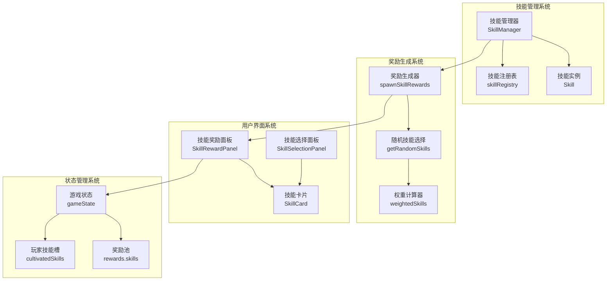
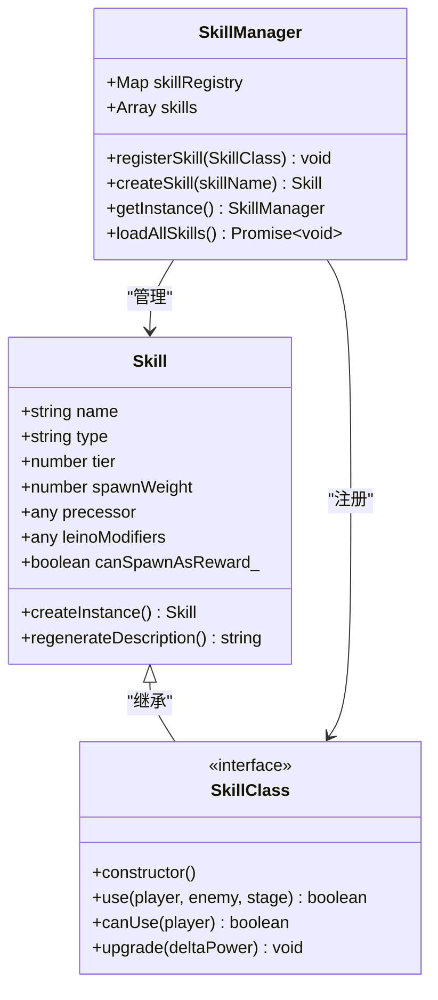
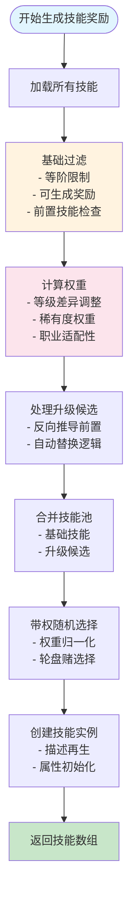
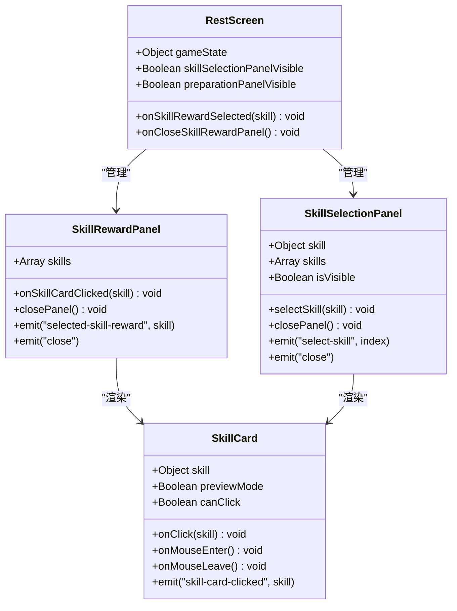
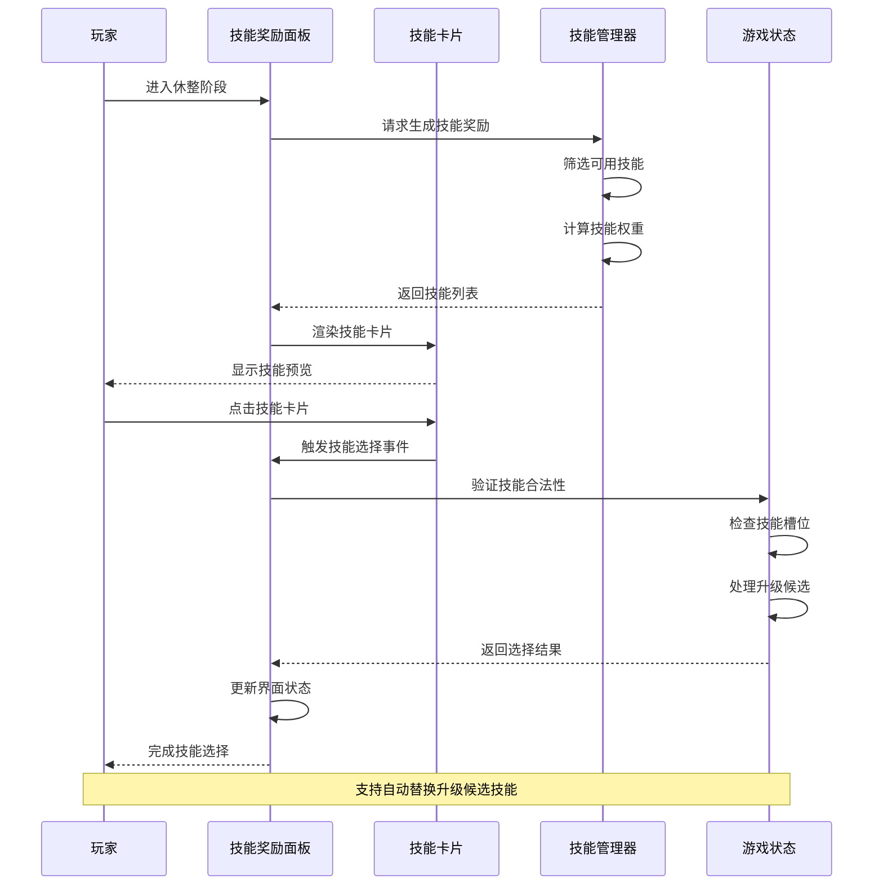
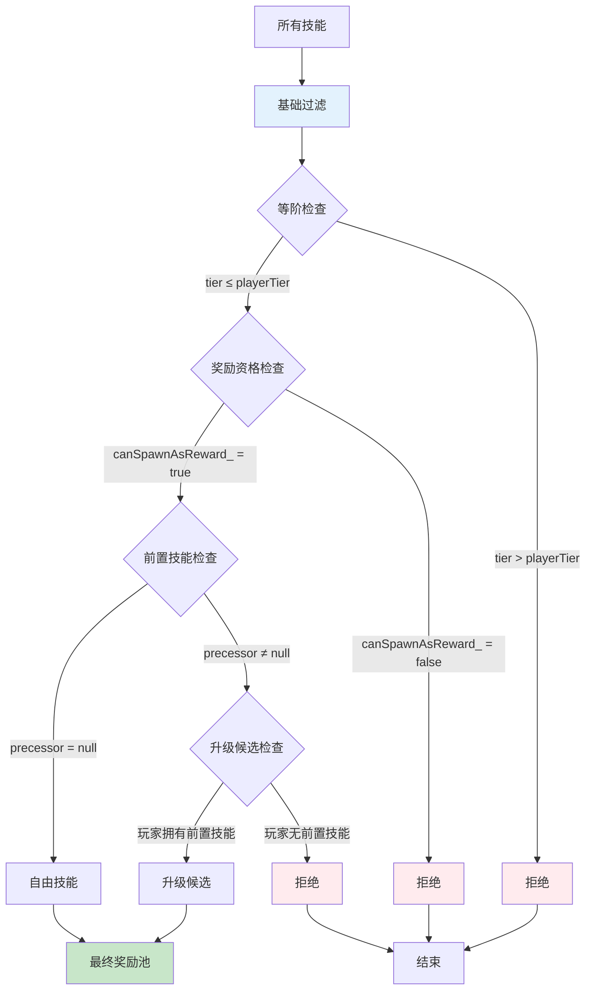
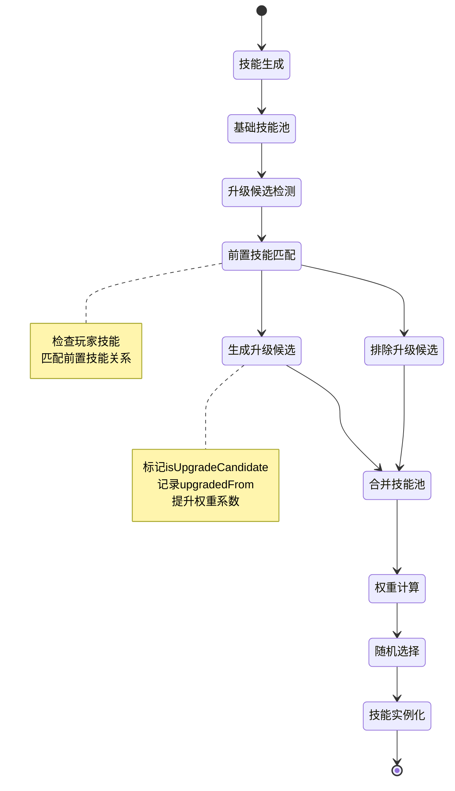

# 技能获取系统

<cite>
**本文档引用的文件**
- [skillManager.js](file://src/data/skillManager.js)
- [SkillRewardPanel.vue](file://src/components/rest/SkillRewardPanel.vue)
- [SkillSelectionPanel.vue](file://src/components/rest/SkillSelectionPanel.vue)
- [rest.js](file://src/data/rest.js)
- [skill.js](file://src/data/skill.js)
- [SkillCard.vue](file://src/components/global/SkillCard.vue)
- [RestScreen.vue](file://src/components/rest/RestScreen.vue)
</cite>

## 目录
1. [简介](#简介)
2. [系统架构概览](#系统架构概览)
3. [技能管理器核心机制](#技能管理器核心机制)
4. [技能奖励生成流程](#技能奖励生成流程)
5. [技能选择与界面交互](#技能选择与界面交互)
6. [技能去重与过滤机制](#技能去重与过滤机制)
7. [技能升级候选系统](#技能升级候选系统)
8. [性能优化与权重计算](#性能优化与权重计算)
9. [故障排除指南](#故障排除指南)
10. [总结](#总结)

## 简介

技能获取系统是游戏的核心机制之一，负责在休整阶段为玩家提供技能奖励选择。该系统通过复杂的算法确保技能奖励的多样性和平衡性，同时支持技能升级、职业适配和玩家构建倾向的个性化定制。

系统的主要功能包括：
- 从技能池中筛选符合条件的可选技能
- 基于稀有度权重、职业适配性和玩家构建倾向进行智能推荐
- 提供完整的技能预览、选择确认和持久化存储链路
- 实现技能去重、禁用技能过滤和特殊事件技能注入
- 支持技能升级候选机制和自动替换功能

## 系统架构概览



**图表来源**
- [skillManager.js](file://src/data/skillManager.js#L1-L253)
- [rest.js](file://src/data/rest.js#L1-L215)

## 技能管理器核心机制

技能管理器是整个系统的核心组件，负责技能的注册、管理和实例化。

### 技能注册机制



**图表来源**
- [skillManager.js](file://src/data/skillManager.js#L1-L50)
- [skill.js](file://src/data/skill.js#L1-L100)

技能管理器采用单例模式确保全局唯一性，并维护一个技能注册表来跟踪所有可用技能：

```javascript
// 技能注册过程
const skillManager = SkillManager.getInstance();
await SkillManager.loadAllSkills();

// 动态导入并注册技能
const skillModules = [
  await import('./skills/martial_arts/agilePunch.js'),
  await import('./skills/martial_arts/block.js'),
  // ... 更多技能模块
];

for (const module of skillModules) {
  for (const [key, SkillClass] of Object.entries(module)) {
    if (typeof SkillClass === 'function' && 
        SkillClass !== Skill && 
        SkillClass.prototype instanceof Skill) {
      skillManager.registerSkill(SkillClass);
    }
  }
}
```

**章节来源**
- [skillManager.js](file://src/data/skillManager.js#L15-L80)

## 技能奖励生成流程

技能奖励生成是一个多步骤的过程，涉及技能筛选、权重计算和随机选择。

### 完整生成流程



**图表来源**
- [skillManager.js](file://src/data/skillManager.js#L82-L253)
- [rest.js](file://src/data/rest.js#L10-L20)

### 关键算法实现

技能奖励生成的核心算法实现了复杂的权重计算和随机选择机制：

```javascript
// 权重计算逻辑
const weightedSkills = availableSkills.map(skill => {
  const tierDifference = playerTier - skill.tier;
  let modifyFactor = 1;

  // 等级差异对权重的影响
  if (skill.tier >= 8) modifyFactor *= 0.7;
  if (skill.tier >= 5) modifyFactor *= 0.8;
  
  // 等级差距过大时的惩罚
  if (tierDifference > 7) {
    modifyFactor = 0.15;
  } else if (tierDifference > 6) {
    modifyFactor = 0.40;
  } else if (tierDifference > 5) {
    modifyFactor = 0.70;
  }

  // 高质量奖励的特殊加成
  if(bestQuality && tierDifference < 1) modifyFactor *= 5;
  if(bestQuality && tierDifference < 2) modifyFactor *= 3;

  // 职业适配性权重
  let leinoFactor = Math.max(playerLeino[skill.type] || 0.2, 0);
  if (skill.type === 'normal') leinoFactor = Math.max(leinoFactor, 1);
  modifyFactor *= leinoFactor;

  // 多灵脉修饰符的平均权重
  if (skill.leinoModifiers) {
    const list = Array.isArray(skill.leinoModifiers) ? skill.leinoModifiers : [skill.leinoModifiers];
    const factors = list.map(key => {
      const v = playerLeino[key];
      return (typeof v === 'number' && v > 0) ? v : 1;
    });
    if (factors.length > 0) {
      const avg = factors.reduce((a,b)=>a+b,0) / factors.length;
      modifyFactor *= avg;
    }
  }

  // 升级候选的额外权重
  if(skill.isUpgradeCandidate) modifyFactor *= 2;

  return {
    ...skill,
    weight: skill.spawnWeight * modifyFactor
  };
});
```

**章节来源**
- [skillManager.js](file://src/data/skillManager.js#L150-L220)

## 技能选择与界面交互

技能选择界面提供了直观的用户交互体验，支持技能预览、选择确认和自动替换功能。

### 界面组件架构



**图表来源**
- [SkillRewardPanel.vue](file://src/components/rest/SkillRewardPanel.vue#L1-L79)
- [SkillSelectionPanel.vue](file://src/components/rest/SkillSelectionPanel.vue#L1-L144)
- [RestScreen.vue](file://src/components/rest/RestScreen.vue#L1-L247)

### 用户交互流程



**图表来源**
- [SkillRewardPanel.vue](file://src/components/rest/SkillRewardPanel.vue#L20-L30)
- [rest.js](file://src/data/rest.js#L60-L120)

**章节来源**
- [SkillRewardPanel.vue](file://src/components/rest/SkillRewardPanel.vue#L1-L79)
- [RestScreen.vue](file://src/components/rest/RestScreen.vue#L111-L145)

## 技能去重与过滤机制

系统实现了多层次的技能去重和过滤机制，确保奖励池的质量和多样性。

### 过滤策略



**图表来源**
- [skillManager.js](file://src/data/skillManager.js#L100-L140)

### 特殊技能处理

系统支持多种特殊技能类型的处理：

1. **禁用技能过滤**：排除无法作为奖励生成的技能
2. **前置技能依赖**：只允许拥有前置技能的升级技能
3. **特殊事件技能**：支持基于游戏事件动态注入的技能
4. **系列冲突检测**：避免同一技能系列的重复奖励

```javascript
// 特殊技能过滤逻辑
const baseAvailableSkills = allSkills.filter(skill =>
  skill.tier <= playerTier &&
  skill.canSpawnAsReward_ &&
  skill.precessor === null && // 只能是自由出现的技能
  skill.tier >= 0 // 不能是（-1）特殊卡
);

// 升级候选技能处理
const upgradeCandidates = [];
for (const meta of allSkills) {
  if (playerSkillNames.includes(meta.name)) continue; // 已拥有不加入
  if (meta.tier > playerTier) continue; // 等阶限制
  if (!meta.precessor) continue; // 没有前置技能

  let matchedSource = null;
  if (Array.isArray(meta.precessor)) {
    matchedSource = meta.precessor.find(p => playerSkillNames.includes(p)) || null;
  } else if (typeof meta.precessor === 'string') {
    matchedSource = playerSkillNames.includes(meta.precessor) ? meta.precessor : null;
  }
  
  if (!matchedSource) continue;
  
  // 避免重复添加
  if (baseAvailableSkills.some(s => s.name === meta.name)) continue;

  upgradeCandidates.push({ 
    ...meta, 
    isUpgradeCandidate: true, 
    upgradedFrom: matchedSource 
  });
}
```

**章节来源**
- [skillManager.js](file://src/data/skillManager.js#L100-L150)

## 技能升级候选系统

升级候选系统是技能奖励机制的重要组成部分，它允许玩家通过选择升级技能来替换已有技能。

### 升级候选机制



**图表来源**
- [skillManager.js](file://src/data/skillManager.js#L120-L180)

### 自动替换逻辑

当玩家选择升级候选技能时，系统会自动寻找对应的源技能并进行替换：

```javascript
// 升级候选处理逻辑
if (skill.isUpgradeCandidate && skill.upgradedFrom) {
  const idx = gameState.player.cultivatedSkills.findIndex(
    s => s && s.name === skill.upgradedFrom
  );
  if (idx !== -1) {
    slotIndex = idx; // 强制替换原有技能
  }
}

// 技能放置逻辑
if(slotIndex >= gameState.player.cultivatedSkills.length) {
  gameState.player.cultivatedSkills.push(skill);
} else {
  gameState.player.cultivatedSkills[slotIndex] = skill;
}
```

**章节来源**
- [rest.js](file://src/data/rest.js#L80-L100)

## 性能优化与权重计算

系统采用了多种性能优化技术来确保技能奖励生成的高效性。

### 权重计算优化

```mermaid
flowchart LR
subgraph "权重计算优化"
A[技能元数据缓存] --> B[权重因子预计算]
B --> C[批量权重归一化]
C --> D[轮盘赌选择优化]
end
subgraph "性能指标"
E[计算复杂度 O(n)] --> F[内存使用优化]
F --> G[缓存命中率]
G --> H[响应时间 < 10ms]
end
A -.-> E
D -.-> H
style A fill:#e8f5e9
style D fill:#fff3e0
style H fill:#c8e6c9
```

**图表来源**
- [skillManager.js](file://src/data/skillManager.js#L150-L220)

### 随机选择算法

系统使用高效的轮盘赌算法进行带权随机选择：

```javascript
// 高效的带权随机选择
const selectedSkills = [];

for (let i = 0; i < actualCount; i++) {
  const totalWeight = weightedSkills.reduce((sum, skill) => sum + skill.weight, 0);
  
  if(totalWeight <= 0) break;

  const random = Math.random() * totalWeight;
  let currentWeight = 0;
  let selectedIndex = 0;
  
  for (let j = 0; j < weightedSkills.length; j++) {
    currentWeight += weightedSkills[j].weight;
    if (random <= currentWeight) {
      selectedIndex = j;
      break;
    }
  }
  
  const skillInfo = weightedSkills[selectedIndex];
  const skill = this.createSkill(skillInfo.name);
  
  selectedSkills.push(skill);
  weightedSkills.splice(selectedIndex, 1); // 从可选池中移除
}
```

**章节来源**
- [skillManager.js](file://src/data/skillManager.js#L220-L253)

## 故障排除指南

### 常见问题及解决方案

#### 技能显示异常

**问题症状**：技能卡片显示不正确或缺少信息

**可能原因**：
1. 技能描述未正确生成
2. 图片资源加载失败
3. CSS样式冲突

**解决方案**：
```javascript
// 检查技能描述生成
if (this.player && typeof this.skill?.regenerateDescription === 'function') {
  const p = (typeof this.player.getModifiedPlayer === 'function') ? 
    this.player.getModifiedPlayer() : this.player;
  return this.skill.regenerateDescription(p);
}

// 验证图片资源
const skillCardImageUrl = new URL(`../assets/cards/${imageName}`, import.meta.url).href;
console.log('技能图片路径:', skillCardImageUrl);
```

#### 技能选择失效

**问题症状**：点击技能卡片无响应

**可能原因**：
1. 技能卡片被标记为disabled
2. 事件监听器未正确绑定
3. 状态同步问题

**解决方案**：
```javascript
// 检查技能卡片状态
onClick(event) {
  if (!this.disabled && this.canClick) {
    this.$emit('skill-card-clicked', this.skill, event);
  } else {
    console.warn('技能卡片不可点击:', this.skill.name, this.disabled, this.canClick);
  }
}
```

#### 权重计算错误

**问题症状**：技能权重分布不合理

**可能原因**：
1. 权重因子设置不当
2. 等级差异计算错误
3. 职业适配性权重异常

**调试方法**：
```javascript
// 添加权重调试信息
console.log('技能权重计算:', {
  skillName: skill.name,
  baseWeight: skill.spawnWeight,
  tierFactor: modifyFactor,
  leinoFactor: leinoFactor,
  totalWeight: skill.spawnWeight * modifyFactor
});
```

**章节来源**
- [SkillCard.vue](file://src/components/global/SkillCard.vue#L60-L80)
- [skillManager.js](file://src/data/skillManager.js#L150-L200)

## 总结

技能获取系统是一个复杂而精密的机制，它通过以下关键特性确保了游戏体验的质量：

### 核心优势

1. **智能化奖励生成**：基于玩家状态和游戏进度的动态技能推荐
2. **平衡性保障**：多层次的过滤和权重计算确保奖励的合理性
3. **用户体验优化**：直观的界面设计和流畅的交互流程
4. **扩展性强**：模块化的架构支持新技能类型的轻松集成
5. **性能优异**：高效的算法实现确保快速响应

### 设计亮点

- **升级候选机制**：创新的技能升级系统提升了策略深度
- **职业适配性**：基于玩家灵脉属性的智能推荐
- **自动替换逻辑**：无缝的技能替换体验
- **多重过滤机制**：确保奖励质量和多样性
- **实时权重计算**：动态调整的技能权重系统

### 未来改进方向

1. **AI辅助推荐**：引入机器学习算法优化技能推荐
2. **社交元素**：支持玩家间的技能交换和分享
3. **成就系统**：与技能获取相关的成就和奖励
4. **移动端适配**：优化移动设备上的用户体验
5. **数据分析**：提供技能使用情况的统计分析

这个技能获取系统不仅为玩家提供了丰富的选择，也为游戏的长期发展奠定了坚实的基础。通过持续的优化和改进，它将继续为玩家带来有趣且富有挑战的游戏体验。