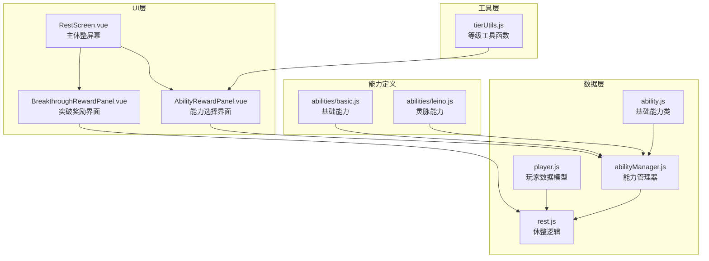
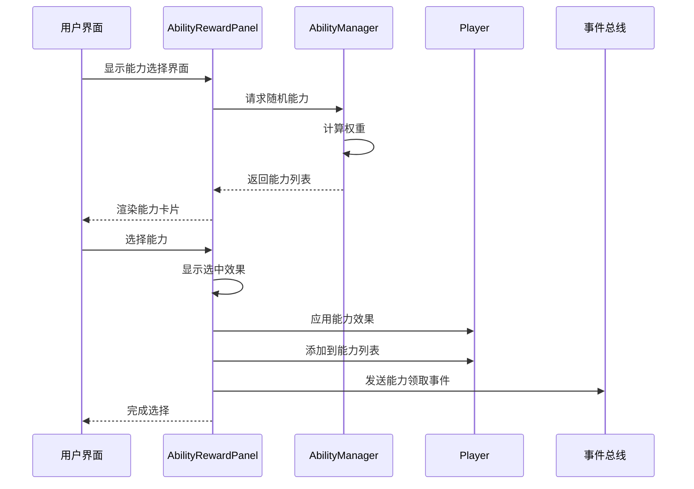
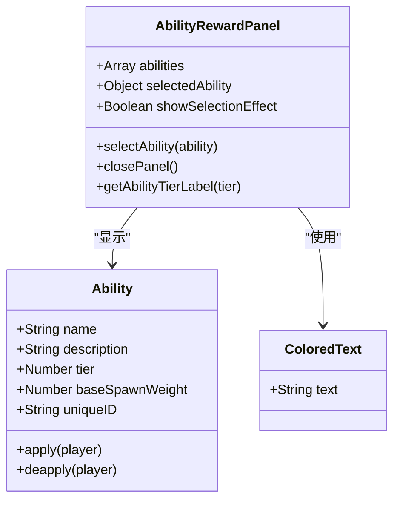
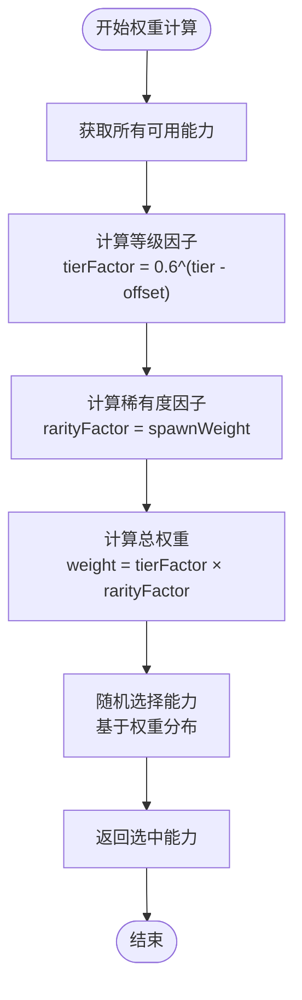
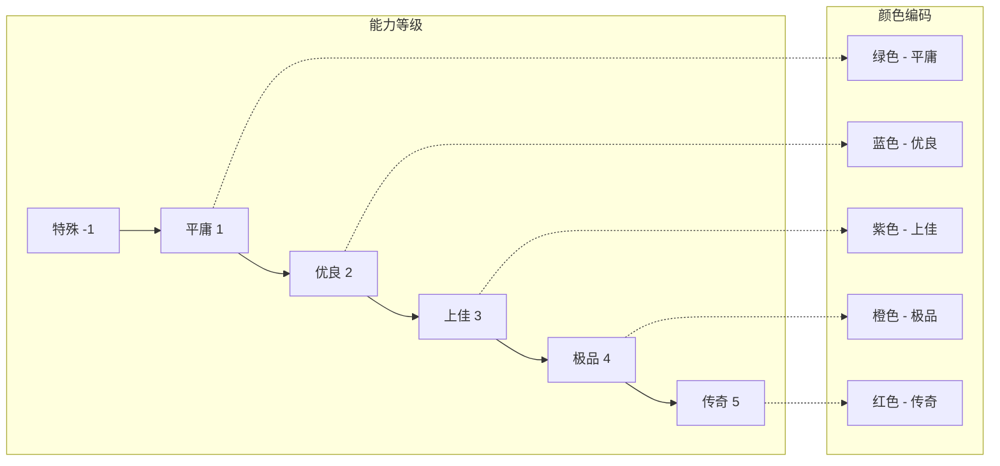
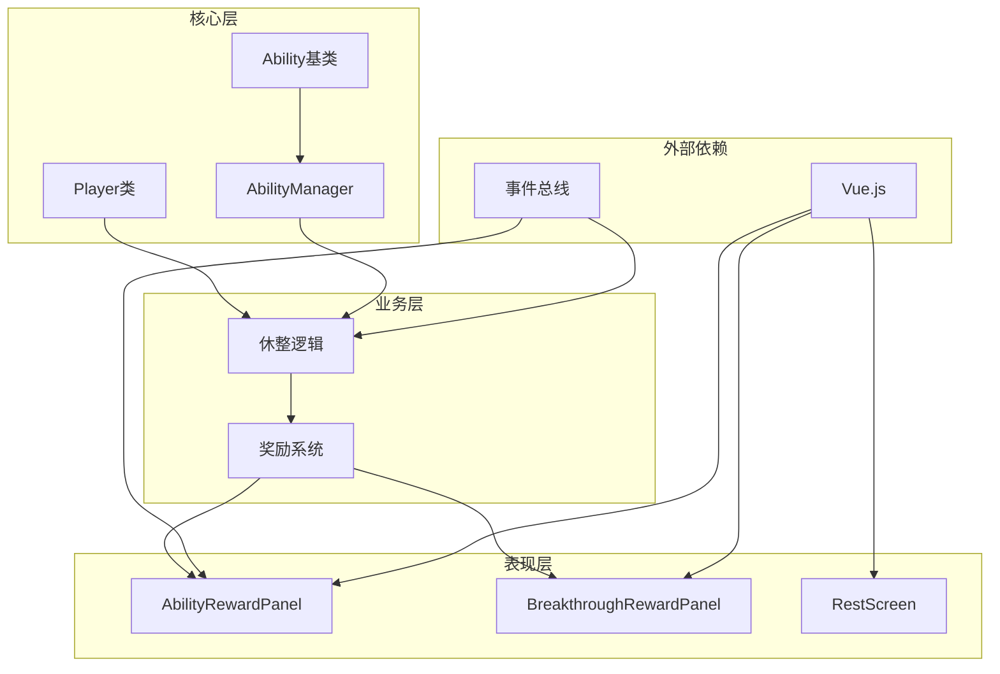

# 能力系统集成

<cite>
**本文档中引用的文件**
- [ability.js](file://src/data/ability.js)
- [abilityManager.js](file://src/data/abilityManager.js)
- [player.js](file://src/data/player.js)
- [tierUtils.js](file://src/utils/tierUtils.js)
- [basic.js](file://src/data/abilities/basic.js)
- [leino.js](file://src/data/abilities/leino.js)
- [AbilityRewardPanel.vue](file://src/components/rest/AbilityRewardPanel.vue)
- [BreakthroughRewardPanel.vue](file://src/components/rest/BreakthroughRewardPanel.vue)
- [rest.js](file://src/data/rest.js)
- [rest/RestScreen.vue](file://src/components/rest/RestScreen.vue)
</cite>

## 目录
1. [简介](#简介)
2. [项目结构概览](#项目结构概览)
3. [核心组件分析](#核心组件分析)
4. [架构概览](#架构概览)
5. [详细组件分析](#详细组件分析)
6. [依赖关系分析](#依赖关系分析)
7. [性能考虑](#性能考虑)
8. [故障排除指南](#故障排除指南)
9. [结论](#结论)

## 简介

能力系统是《灵御》游戏中的核心机制之一，它为玩家提供了在休整阶段选择永久性能力提升的机会。该系统通过BreakthroughRewardPanel和AbilityRewardPanel组件实现了完整的奖励流程，包括能力生成、选择界面展示、玩家属性调整以及长期效果持久化。

能力系统的设计遵循了以下核心原则：
- **永久性提升**：所选能力的效果会永久影响玩家属性
- **多样性选择**：提供多种不同类型的技能增强选项
- **平衡性设计**：通过权重系统控制能力出现频率
- **视觉反馈**：丰富的动画效果和视觉提示
- **事件驱动**：基于事件总线的松耦合架构

## 项目结构概览

能力系统的核心文件分布在以下几个关键目录中：



**图表来源**
- [ability.js](file://src/data/ability.js#L1-L27)
- [abilityManager.js](file://src/data/abilityManager.js#L1-L118)
- [player.js](file://src/data/player.js#L1-L226)

**章节来源**
- [ability.js](file://src/data/ability.js#L1-L27)
- [abilityManager.js](file://src/data/abilityManager.js#L1-L118)
- [rest.js](file://src/data/rest.js#L1-L215)

## 核心组件分析

### 基础能力类 (Ability)

Ability类是整个能力系统的基础抽象，定义了所有能力必须遵循的接口规范：

```javascript
export class Ability {
  constructor(name, description, tier, baseSpawnWeight = 1) {
    this.name = name;
    this.description = description;
    this.tier = tier || 1;
    this.baseSpawnWeight = baseSpawnWeight;
    this.uniqueID = Math.random().toString(36).substring(2, 10);
  }
  
  apply(player) {
    // 子类需要实现具体逻辑
  }

  deapply(player) {
    // 子类需要实现具体逻辑
  }
}
```

该类提供了以下核心功能：
- **唯一标识**：每个能力实例都有唯一的ID用于动画同步
- **等级系统**：支持1-5级的能力分类
- **权重控制**：通过spawnWeight控制生成概率
- **生命周期方法**：提供apply和deapply抽象方法

### 能力管理器 (AbilityManager)

AbilityManager负责管理所有可用能力的注册、加载和随机选择：

```javascript
class AbilityManager {
  constructor() {
    this.abilities = [];
  }
  
  async loadAllAbilities() {
    const abilityModules = [
      await import('./abilities/basic.js'),
      await import('./abilities/leino.js'),
    ];
    
    for (const module of abilityModules) {
      for (const [key, AbilityClass] of Object.entries(module)) {
        if (typeof AbilityClass === 'function' && 
            AbilityClass !== Ability && 
            AbilityClass.prototype instanceof Ability) {
          this.registerAbility(AbilityClass);
        }
      }
    }
    
    return this;
  }
}
```

**章节来源**
- [ability.js](file://src/data/ability.js#L1-L27)
- [abilityManager.js](file://src/data/abilityManager.js#L1-L118)

## 架构概览

能力系统采用分层架构设计，确保了良好的模块化和可扩展性：



**图表来源**
- [AbilityRewardPanel.vue](file://src/components/rest/AbilityRewardPanel.vue#L43-L65)
- [abilityManager.js](file://src/data/abilityManager.js#L40-L85)
- [rest.js](file://src/data/rest.js#L130-L145)

## 详细组件分析

### 能力选择界面 (AbilityRewardPanel)

AbilityRewardPanel是玩家在休整阶段选择能力的主要界面组件：



**图表来源**
- [AbilityRewardPanel.vue](file://src/components/rest/AbilityRewardPanel.vue#L20-L45)
- [ability.js](file://src/data/ability.js#L3-L20)

界面特性包括：
- **视觉层次**：根据能力等级使用不同的颜色主题
- **交互反馈**：选中时的发光效果和动画过渡
- **响应式布局**：适应不同屏幕尺寸的能力卡片网格
- **无障碍设计**：清晰的视觉指示和键盘导航支持

### 突破奖励界面 (BreakthroughRewardPanel)

BreakthroughRewardPanel处理玩家达到特定里程碑时的突破奖励：

```javascript
export default {
  name: 'BreakthroughRewardPanel',
  methods: {
    claimReward() {
      backendEventBus.emit(EventNames.PlayerOperations.CLAIM_BREAKTHROUGH);
      this.$emit('claimed');
    }
  }
}
```

该组件的特点：
- **简洁设计**：专注于突破奖励的视觉呈现
- **即时反馈**：点击后立即触发奖励领取流程
- **事件驱动**：通过事件总线与后端逻辑通信

### 能力权重计算机制

AbilityManager实现了复杂的权重计算算法来控制能力生成：



**图表来源**
- [abilityManager.js](file://src/data/abilityManager.js#L50-L85)

权重计算公式：
```
weight = tierFactor × rarityFactor
tierFactor = 0.6^(Math.max(ability.tier - offset, 0))
offset = Math.max(1, abundance × 2)
```

这种设计确保了：
- **等级平衡**：高等级能力更难获得但更有价值
- **稀有度控制**：通过spawnWeight参数调节出现频率
- **动态调整**：abundance参数影响整体稀有度水平

**章节来源**
- [AbilityRewardPanel.vue](file://src/components/rest/AbilityRewardPanel.vue#L1-L228)
- [BreakthroughRewardPanel.vue](file://src/components/rest/BreakthroughRewardPanel.vue#L1-L66)
- [abilityManager.js](file://src/data/abilityManager.js#L50-L85)

### 玩家能力管理系统

Player类集成了完整的能力管理系统，支持能力的添加、检查和效果应用：

```javascript
export class Player extends Unit {
  constructor() {
    super();
    this.abilities = []; // 玩家能力列表
  }
  
  hasAbility(abilityName) {
    return this.abilities.some(ability => ability.name === abilityName);
  }
  
  // 属性修正系统
  addModifier(modifierFn) {
    if (typeof modifierFn === 'function') this.modifiers.push(modifierFn);
  }
  
  getModifiedPlayer() {
    if(this.modified) return this;
    let current = this;
    for (const mod of this.modifiers) {
      try {
        const next = mod(current);
        if (next) current = next;
      } catch (e) {
        console.warn('应用属性修正器时发生错误，已跳过：', e);
      }
    }
    return current;
  }
}
```

**章节来源**
- [player.js](file://src/data/player.js#L1-L226)

### 能力类型和效果

系统支持多种类型的能力，每种都有独特的效果：

#### 基础能力示例

```javascript
// 生命值增强
class Growth extends Ability {
  constructor() {
    super('成长', '/named{生命}上限增15。', 4, 1.0);
  }
  
  apply(player) {
    player.maxHp += 15;
    player.hp += 15;
  }
}

// 灵脉能力
class FireLeino extends Ability {
  constructor() {
    super('火灵脉', '能使用火系灵御技能，获得4层/effect{火焰抗性}', 5, 10);
  }
  
  apply(player) {
    player.addLeino('fire');
    backendEventBus.on(EventNames.Game.PRE_BATTLE, hook);
  }
}
```

#### 等级系统设计



**图表来源**
- [tierUtils.js](file://src/utils/tierUtils.js#L15-L25)

**章节来源**
- [basic.js](file://src/data/abilities/basic.js#L1-L171)
- [leino.js](file://src/data/abilities/leino.js#L1-L64)
- [tierUtils.js](file://src/utils/tierUtils.js#L15-L25)

## 依赖关系分析

能力系统的依赖关系展现了清晰的分层架构：



**图表来源**
- [ability.js](file://src/data/ability.js#L1-L5)
- [abilityManager.js](file://src/data/abilityManager.js#L1-L5)
- [rest.js](file://src/data/rest.js#L1-L10)

**章节来源**
- [ability.js](file://src/data/ability.js#L1-L27)
- [abilityManager.js](file://src/data/abilityManager.js#L1-L118)
- [rest.js](file://src/data/rest.js#L1-L215)

## 性能考虑

### 能力加载优化

AbilityManager使用异步动态导入来优化启动性能：

```javascript
async loadAllAbilities() {
  const abilityModules = [
    await import('./abilities/basic.js'),
    await import('./abilities/leino.js'),
  ];
  // 按需加载，减少初始包体积
}
```

### 内存管理

- **单例模式**：AbilityManager使用单例确保内存效率
- **事件清理**：灵脉能力会在deapply时清理事件监听器
- **唯一ID生成**：使用高效的随机字符串生成算法

### 渲染性能

- **虚拟滚动**：能力卡片使用CSS变换而非DOM操作
- **条件渲染**：只渲染当前可见的能力卡片
- **动画优化**：使用CSS3过渡和变换而非JavaScript动画

## 故障排除指南

### 常见问题和解决方案

#### 能力无法加载

**症状**：能力列表为空或显示错误
**原因**：模块导入失败或能力类定义错误
**解决方案**：
1. 检查abilityManager.js中的模块导入路径
2. 验证能力类是否正确继承自Ability基类
3. 查看浏览器控制台的错误信息

#### 权重计算异常

**症状**：某些能力过于频繁或罕见出现
**原因**：权重计算参数设置不当
**解决方案**：
1. 检查baseSpawnWeight参数值
2. 验证tierFactor计算逻辑
3. 调整abundance参数影响范围

#### 界面显示问题

**症状**：能力卡片显示异常或动画不流畅
**原因**：CSS样式冲突或JavaScript错误
**解决方案**：
1. 检查scoped样式作用域
2. 验证Vue组件生命周期钩子
3. 使用浏览器开发者工具调试

**章节来源**
- [abilityManager.js](file://src/data/abilityManager.js#L10-L30)
- [AbilityRewardPanel.vue](file://src/components/rest/AbilityRewardPanel.vue#L43-L65)

## 结论

能力系统集成展现了现代游戏开发中的优秀实践，通过模块化设计、事件驱动架构和清晰的职责分离，实现了高度可维护和可扩展的系统。该系统不仅提供了丰富的游戏体验，还为未来的功能扩展奠定了坚实基础。

主要优势包括：
- **模块化设计**：清晰的职责分离和低耦合架构
- **事件驱动**：基于事件总线的松耦合通信机制
- **性能优化**：异步加载和内存管理策略
- **用户体验**：丰富的视觉反馈和交互设计
- **可扩展性**：易于添加新能力和平衡性调整

未来改进方向：
- 增强能力间的相互作用检测
- 实现更复杂的能力组合系统
- 添加能力效果的可视化展示
- 优化移动端适配和触摸交互