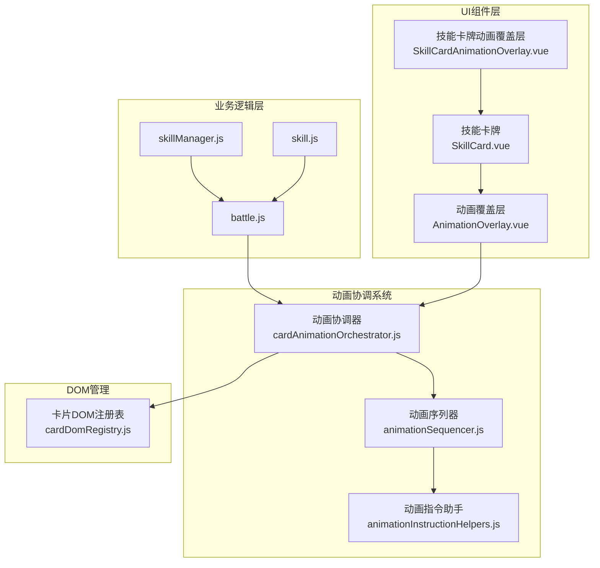
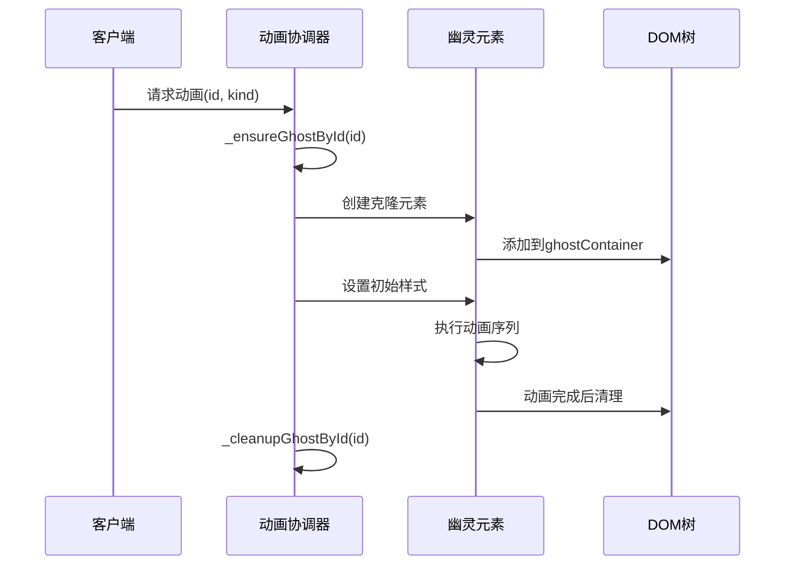
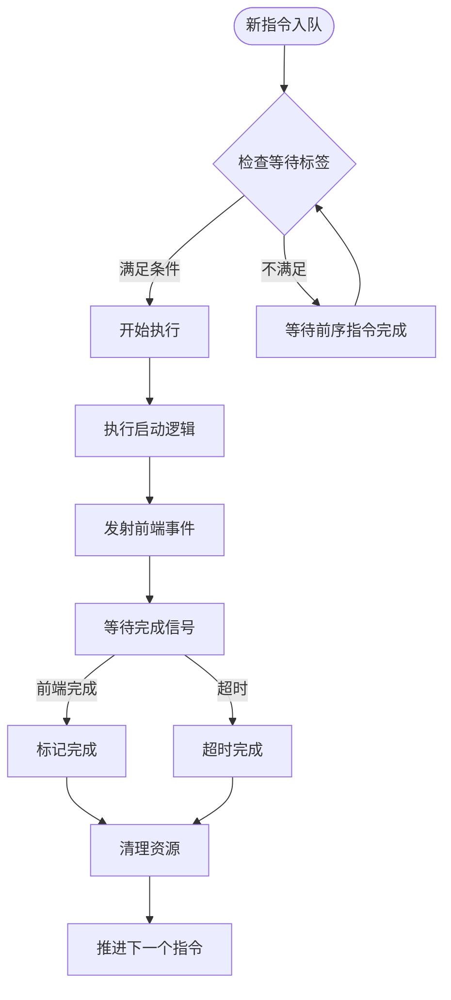
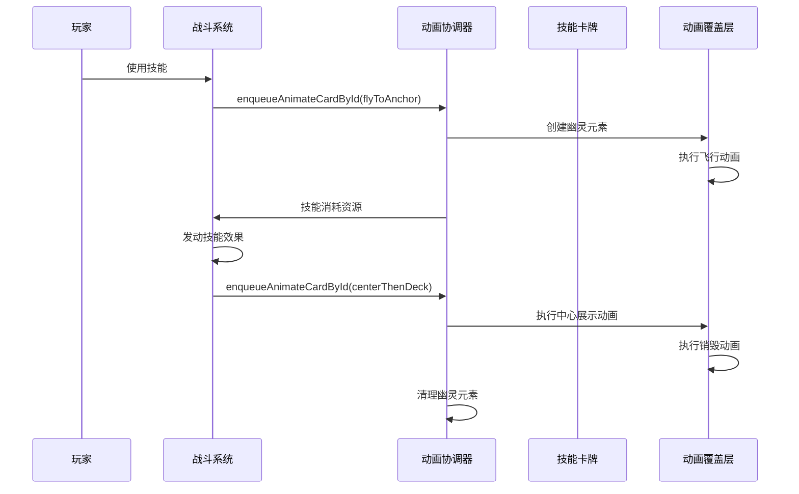

# 动画协调机制

<cite>
**本文档引用的文件**
- [cardAnimationOrchestrator.js](file://src/utils/cardAnimationOrchestrator.js)
- [AnimationOverlay.vue](file://src/components/global/AnimationOverlay.vue)
- [animationSequencer.js](file://src/data/animationSequencer.js)
- [animationInstructionHelpers.js](file://src/data/animationInstructionHelpers.js)
- [SkillCard.vue](file://src/components/global/SkillCard.vue)
- [SkillCardAnimationOverlay.vue](file://src/components/global/SkillCardAnimationOverlay.vue)
- [battle.js](file://src/data/battle.js)
- [skill.js](file://src/data/skill.js)
- [cardDomRegistry.js](file://src/utils/cardDomRegistry.js)
</cite>

## 目录
1. [简介](#简介)
2. [核心架构概览](#核心架构概览)
3. [动画协调器详解](#动画协调器详解)
4. [动画覆盖层组件](#动画覆盖层组件)
5. [动画序列器](#动画序列器)
6. [技能卡牌动画流程](#技能卡牌动画流程)
7. [性能优化机制](#性能优化机制)
8. [故障排除指南](#故障排除指南)
9. [总结](#总结)

## 简介

cardAnimationOrchestrator.js 是一个复杂的动画协调系统，专门设计用于管理游戏中的卡牌动画。该系统通过精心设计的架构解决了动画资源竞争、Z轴层级冲突和性能瓶颈等问题，为技能卡牌的抽卡、使用和销毁提供了流畅的视觉体验。

该系统的核心特点包括：
- 基于唯一ID的异步动画队列管理
- 多个并发动画的智能调度
- Z轴层级自动管理
- 资源回收和内存优化
- 事件驱动的动画生命周期管理

## 核心架构概览



**图表来源**
- [cardAnimationOrchestrator.js](file://src/utils/cardAnimationOrchestrator.js#L1-L50)
- [AnimationOverlay.vue](file://src/components/global/AnimationOverlay.vue#L1-L30)
- [animationSequencer.js](file://src/data/animationSequencer.js#L1-L50)

## 动画协调器详解

### 核心数据结构

动画协调器维护了多个关键的数据结构来管理动画状态：

```javascript
const orchestrator = {
  // DOM元素引用
  overlayEl: null,
  centerAnchorEl: null,
  deckAnchorEl: null,
  ghostContainerEl: null,
  
  // 幽灵元素注册表
  _ghostRegistry: new Map(),
  
  // 中心展示卡片ID列表
  _centerIds: [],
  
  // 全局时代戳
  _epoch: 0,
  
  // 排空模式标志
  _draining: false,
  _drainEpoch: null
};
```

### 幽灵元素管理系统

幽灵元素（Ghost Elements）是动画协调器的核心概念，它们是原始卡牌的克隆副本，用于在动画过程中保持视觉连续性：



**图表来源**
- [cardAnimationOrchestrator.js](file://src/utils/cardAnimationOrchestrator.js#L281-L313)
- [cardAnimationOrchestrator.js](file://src/utils/cardAnimationOrchestrator.js#L311-L345)

### 动画队列管理

每个卡牌都有独立的动画队列，确保同一张卡牌的动画按顺序执行：

```javascript
// 动画队列管理
const _idChains = new Map();

async function animateById({ id, kind, options = {}, steps, hideStart, completionToken, transfer }) {
  const prev = _idChains.get(id) || Promise.resolve();
  const safePrev = prev.catch(() => {});
  const next = safePrev.then(() => run());
  _idChains.set(id, next);
  next.finally(() => { if (_idChains.get(id) === next) _idChains.delete(id); });
  return next;
}
```

### 动画步骤构建器

协调器提供了多种预定义的动画步骤构建器：

```javascript
buildSteps: {
  // 飞向中心
  flyToCenter({ scale = 1.2, durationMs = 350, holdMs = 0 } = {}) {
    return [
      { toAnchor: 'center', scale, duration: durationMs, ease: defaultEase, holdMs }
    ];
  },
  
  // 中心展示后返回牌库
  centerThenDeck({ centerHoldMs = 350, totalMs = 900 } = {}) {
    const first = 350;
    const rest = Math.max(300, totalMs - first - centerHoldMs);
    return [
      { toAnchor: 'center', scale: 1.2, duration: first, ease: defaultEase, holdMs: centerHoldMs },
      { toAnchor: 'deck', scale: 0.5, rotate: 20, duration: rest, ease: 'power2.in' }
    ];
  },
  
  // 焚毁效果
  exhaustBurn({ durationMs = 500, scaleUp = 1.15, particle = {} } = {}) {
    const t1 = Math.max(80, Math.floor(durationMs * 0.35));
    const t2 = Math.max(120, durationMs - t1);
    return [
      { scale: scaleUp, duration: t1, ease: defaultEase, emitParticles: emitCfg },
      { rotate: 0, opacity: 0, duration: t2, ease: 'power1.in', emitParticles: emitCfg }
    ];
  }
}
```

**章节来源**
- [cardAnimationOrchestrator.js](file://src/utils/cardAnimationOrchestrator.js#L54-L140)
- [cardAnimationOrchestrator.js](file://src/utils/cardAnimationOrchestrator.js#L281-L313)

## 动画覆盖层组件

AnimationOverlay.vue 是动画系统的根容器组件，负责管理所有动画元素的渲染层次和位置：

```vue
<template>
  <div ref="overlay" class="animation-overlay" aria-hidden="true">
    <!-- 中心舞台锚点 -->
    <div ref="centerAnchor" class="overlay-anchor center-anchor"></div>
    <!-- 牌库入口锚点 -->
    <div ref="deckAnchor" class="overlay-anchor deck-anchor"></div>
    <!-- 幽灵元素容器 -->
    <div ref="ghostContainer" class="ghost-container"></div>
  </div>
</template>
```

### Z轴层级管理

覆盖层通过CSS变量和动态计算来管理Z轴层级：

```css
.animation-overlay {
  position: fixed;
  inset: 0;
  pointer-events: none;
  z-index: var(--z-animation);
}

.ghost-container {
  position: absolute;
  inset: 0;
  overflow: visible;
  z-index: var(--z-animation);
}
```

### 锚点系统

覆盖层定义了多个锚点用于动画定位：

```javascript
// 中心舞台锚点：屏幕正中（略上移以对齐 center-cards 展示区）
.center-anchor {
  left: 50%;
  top: 50%;
  transform: translate(-50%, -40%);
}

// 牌库锚点：屏幕右下，适当留边距
.deck-anchor {
  right: 24px;
  bottom: 24px;
}
```

**章节来源**
- [AnimationOverlay.vue](file://src/components/global/AnimationOverlay.vue#L1-L65)

## 动画序列器

animationSequencer.js 提供了一个高级的动画队列管理系统，支持标签化的依赖关系和超时控制：



**图表来源**
- [animationSequencer.js](file://src/data/animationSequencer.js#L60-L134)

### 指令结构

```javascript
class Instruction {
  constructor({ tags, waitTags, durationMs, start, meta }) {
    this.id = genId();
    this.status = 'pending';
    this.tags = new Set([...(tags || []), 'all']);
    this.waitTags = new Set(waitTags === undefined ? ['all'] : (waitTags || []));
    this.durationMs = durationMs;
    this.start = typeof start === 'function' ? start : () => {};
    this.meta = meta;
  }
}
```

### 标签化依赖系统

动画序列器使用标签系统来管理指令间的依赖关系：

```javascript
// 可执行判定：所有位于 index 之前、且与 waitTags 有交集的，都必须 finished
_canExecute(index) {
  const current = this._instructions[index];
  if (!current) return false;
  for (let j = 0; j < index; j++) {
    const prev = this._instructions[j];
    if (!prev) continue;
    if (prev.status === 'finished') continue;
    if (hasIntersection(prev.tags, current.waitTags)) {
      return false;
    }
  }
  return true;
}
```

**章节来源**
- [animationSequencer.js](file://src/data/animationSequencer.js#L1-L134)

## 技能卡牌动画流程

### 技能使用动画序列

当玩家使用技能时，系统会执行一系列协调的动画：



**图表来源**
- [battle.js](file://src/data/battle.js#L193-L210)
- [cardAnimationOrchestrator.js](file://src/utils/cardAnimationOrchestrator.js#L497-L588)

### 动画指令集成

动画指令通过animationInstructionHelpers.js与业务逻辑紧密集成：

```javascript
// 技能使用动画指令
export function enqueueAnimateCardById(payload = {}, { tags = ['ui'], waitTags, durationMs = Infinity, ...rest } = {}) {
  return enqueueInstruction({
    tags,
    waitTags: waitTags ?? computeWaitTags(rest),
    durationMs,
    start: ({ id, emit }) => {
      const token = id;
      const onFinished = (msg = {}) => {
        const t = msg?.token;
        if (t === token) {
          frontendEventBus.off('animation-card-by-id-finished', onFinished);
          frontendEventBus.emit('animation-instruction-finished', { id });
        }
      };
      frontendEventBus.on('animation-card-by-id-finished', onFinished);
      try { emit('animate-card-by-id', Object.assign({}, payload || {}, { completionToken: token })); }
      catch (_) { frontendEventBus.off('animation-card-by-id-finished', onFinished); }
    },
  });
}
```

### 事件驱动的动画生命周期

动画协调器实现了完整的事件驱动生命周期：

```javascript
// 转移动画事件机制
{
  id: <number|string>,            // 卡牌唯一ID
  kind: <string>,                 // 动画种类
  type: <string>,                 // 语义化转移类型
  from: <string|undefined>,       // 来源容器标识
  to: <string|undefined>,         // 目标容器标识
  token: <string>,                // 唯一标记
  phase: 'start' | 'end'          // 事件阶段
}
```

**章节来源**
- [animationInstructionHelpers.js](file://src/data/animationInstructionHelpers.js#L320-L350)
- [battle.js](file://src/data/battle.js#L193-L210)

## 性能优化机制

### 内存管理策略

动画协调器实现了多层次的内存管理策略：

```javascript
// 幽灵元素注册表管理
_ensureGhostById(id, startEl, options = {}) {
  if (id !== null && id !== undefined && this._ghostRegistry.has(id)) {
    const entry = this._ghostRegistry.get(id);
    if (killOnReuse) { try { gsap.killTweensOf(entry.ghost); } catch (_) {} }
    return entry;
  }
  // ... 创建新幽灵元素
}

// 资源清理
_cleanupGhostById(id, { restoreStart = false } = {}) {
  if (id === null || id === undefined) return;
  const entry = this._ghostRegistry.get(id);
  if (!entry) return;
  const { ghost, startEl } = entry;
  try { gsap.killTweensOf(ghost); } catch (_) {}
  try { ghost.remove(); } catch (_) {}
  // 优先还原注册表内的 card DOM
  const originalEl = getCardEl(id) || startEl;
  if (restoreStart) {
    try { originalEl.style.visibility = ''; } catch (_) {}
  }
  this._ghostRegistry.delete(id);
}
```

### 批量动画优化

系统支持批量动画操作以提高性能：

```javascript
// 批量重置所有幽灵元素
async resetAllGhosts({ restoreStart = true } = {}) {
  // 建立“排空屏障”：记录此刻的epoch，并立即推进到下一代
  const drainEpoch = this._epoch;
  this._draining = true;
  this._drainEpoch = drainEpoch;
  this._bumpEpoch();

  // 截取当前各ID队列的末尾promise，等待它们结算
  const tails = Array.from(_idChains.values()).map(p => p.catch(() => {}));
  try { await Promise.all(tails); } catch (_) {}

  // 执行清理：注册表 + DOM 兜底
  for (const id of Array.from(this._ghostRegistry.keys())) {
    this._cleanupGhostById(id, { restoreStart });
  }
  // ... DOM清理
}
```

### 动态粒子系统

系统集成了高效的粒子发射系统：

```javascript
_emitParticles(ghost, { burst = 10, particleConfig = {} } = {}) {
  if (!ghost) return;
  try {
    const r = ghost.getBoundingClientRect();
    const cx = r.left + r.width / 2;
    const cy = r.top + r.height / 2;
    const cfg = particleConfig || {};
    const colors = cfg.colors || ['#cf1818', '#ffd166', '#ff6f00'];
    const sizeRange = cfg.size || [5, 10];
    const speedRange = cfg.speed || [40, 160];
    const particles = [];
    for (let i = 0; i < burst; i++) {
      const angle = (Math.random() * Math.PI * 2);
      const speed = speedRange[0] + Math.random() * (speedRange[1] - speedRange[0]);
      const vx = Math.cos(angle) * speed;
      const vy = Math.sin(angle) * speed;
      // ... 创建粒子对象
    }
    frontendEventBus.emit('spawn-particles', particles);
  } catch (_) {}
}
```

**章节来源**
- [cardAnimationOrchestrator.js](file://src/utils/cardAnimationOrchestrator.js#L281-L313)
- [cardAnimationOrchestrator.js](file://src/utils/cardAnimationOrchestrator.js#L432-L468)
- [cardAnimationOrchestrator.js](file://src/utils/cardAnimationOrchestrator.js#L345-L390)

## 故障排除指南

### 常见问题诊断

1. **动画不执行**
   - 检查 `_draining` 状态
   - 验证 `scheduledEpoch` 匹配
   - 确认幽灵元素存在

2. **Z轴层级错误**
   - 检查 CSS 变量 `--z-animation`
   - 验证 `zIndex` 动态设置
   - 确认覆盖层容器层级

3. **内存泄漏**
   - 监控 `_ghostRegistry` 大小
   - 检查幽灵元素清理
   - 验证事件监听器移除

### 调试工具

```javascript
// 启用调试模式
window.DEBUG_ANIMATION = true;

// 检查幽灵元素状态
console.log('Ghost Registry:', orchestrator._ghostRegistry);
console.log('Center IDs:', orchestrator._centerIds);
console.log('Epoch:', orchestrator._epoch);
console.log('Draining:', orchestrator._draining);
```

### 性能监控

```javascript
// 监控动画性能
const performanceMonitor = {
  startTime: Date.now(),
  animationsStarted: 0,
  animationsCompleted: 0,
  
  trackStart() { this.animationsStarted++; },
  trackComplete() { 
    this.animationsCompleted++;
    if (this.animationsCompleted % 10 === 0) {
      console.log(`Animations: ${this.animationsCompleted}/${this.animationsStarted}`);
    }
  }
};
```

## 总结

cardAnimationOrchestrator.js 实现了一个功能强大且高度优化的动画协调系统。该系统通过以下关键特性确保了流畅的用户体验：

### 核心优势

1. **智能队列管理**：基于唯一ID的异步队列确保动画顺序性和并发性平衡
2. **资源高效利用**：动态幽灵元素管理和自动清理机制
3. **灵活的动画组合**：预定义动画步骤和自定义动画序列支持
4. **强大的事件系统**：完整的生命周期事件和状态反馈
5. **优秀的性能表现**：批量操作和内存优化策略

### 最佳实践建议

1. **合理使用动画标签**：通过标签系统精确控制动画依赖关系
2. **及时清理资源**：确保动画完成后正确清理幽灵元素
3. **监控性能指标**：定期检查内存使用和动画执行效率
4. **渐进式增强**：为不同设备和网络环境提供适当的动画质量

该系统为游戏开发中的复杂动画需求提供了坚实的基础，能够处理大量并发动画的同时保持良好的性能表现。通过合理的架构设计和优化策略，它成功解决了动画资源竞争、Z轴层级冲突和性能瓶颈等关键问题。