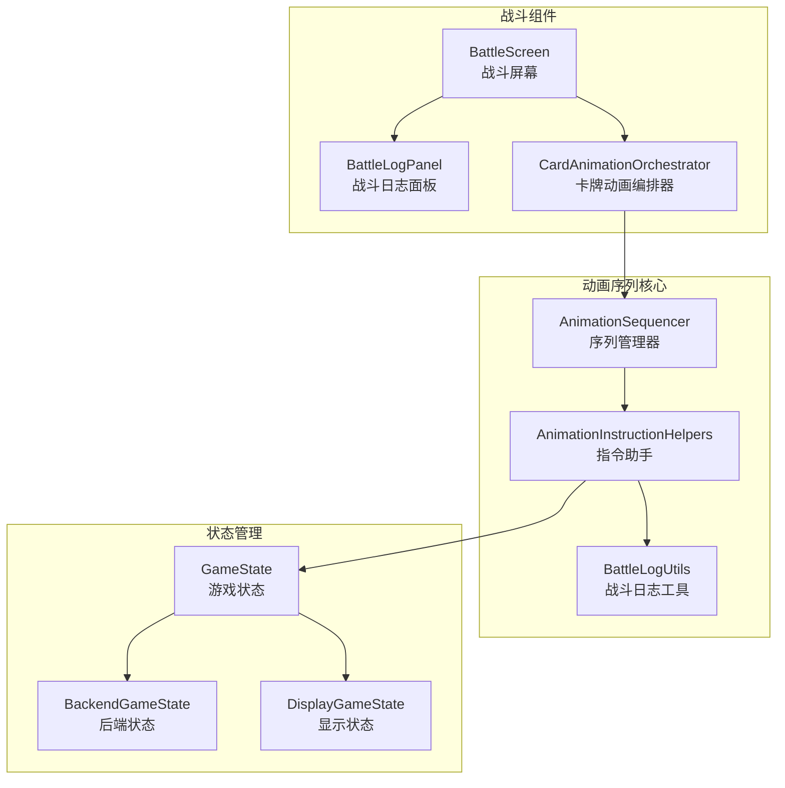
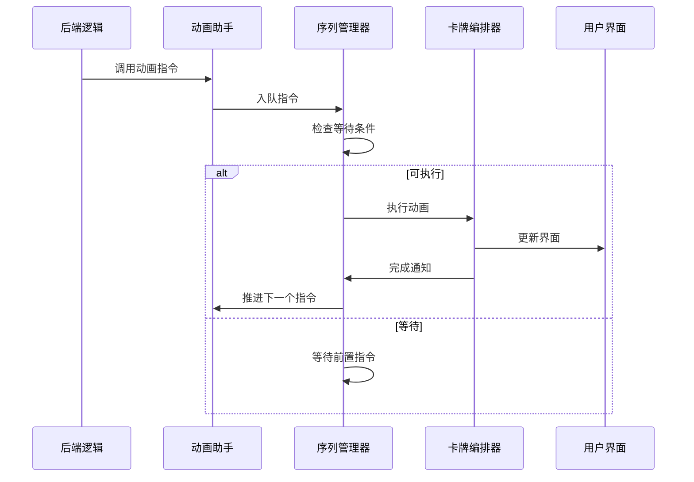
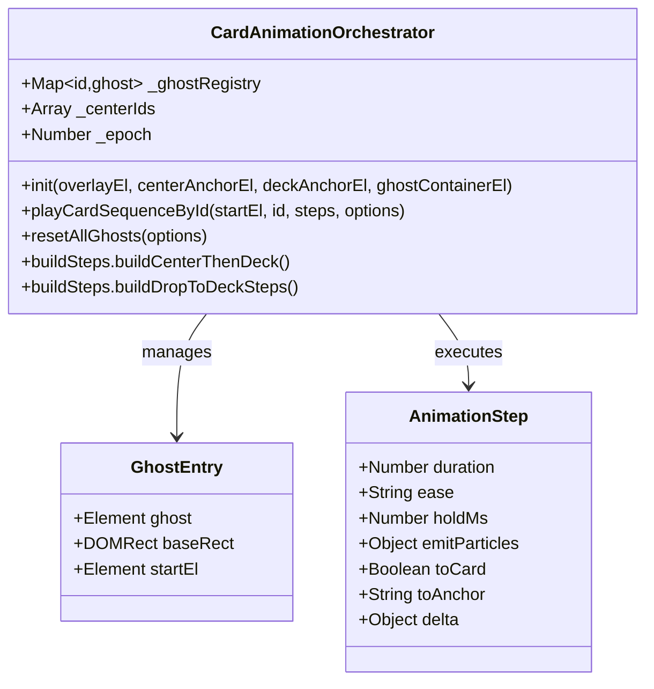
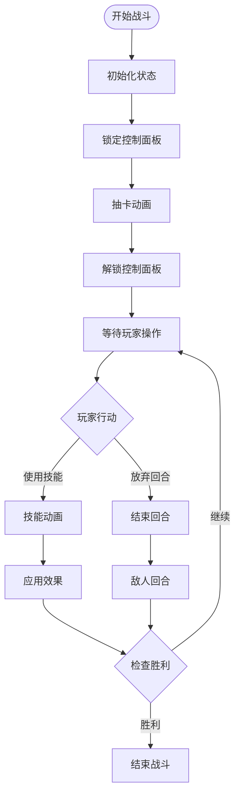

# 动画序列编排系统

<cite>
**本文档中引用的文件**
- [animationSequencer.js](file://src/data/animationSequencer.js)
- [animationInstructionHelpers.js](file://src/data/animationInstructionHelpers.js)
- [battleLogUtils.js](file://src/data/battleLogUtils.js)
- [battle.js](file://src/data/battle.js)
- [BattleLogPanel.vue](file://src/components/battle/BattleLogPanel.vue)
- [BattleScreen.vue](file://src/components/battle/BattleScreen.vue)
- [cardAnimationOrchestrator.js](file://src/utils/cardAnimationOrchestrator.js)
- [gameState.js](file://src/data/gameState.js)
</cite>

## 目录
1. [简介](#简介)
2. [项目结构概览](#项目结构概览)
3. [核心组件分析](#核心组件分析)
4. [架构概览](#架构概览)
5. [详细组件分析](#详细组件分析)
6. [动画序列管理机制](#动画序列管理机制)
7. [战斗日志动画流程](#战斗日志动画流程)
8. [性能监控与调试](#性能监控与调试)
9. [故障排除指南](#故障排除指南)
10. [总结](#总结)

## 简介

动画序列编排系统是一个基于Vue.js和GSAP的强大动画管理系统，专门设计用于处理复杂的战斗场景动画。该系统通过时间轴管理、动画同步与异步执行、嵌套序列处理等核心功能，实现了精确的动画调度和流畅的用户体验。

系统的核心设计理念是将动画指令抽象为可排队执行的任务，通过标签系统和等待机制确保动画按照正确的顺序执行。这种设计使得复杂的战斗场景能够被分解为多个独立的动画指令，每个指令都可以有自己的执行条件和持续时间。

## 项目结构概览

动画序列编排系统主要由以下几个核心模块组成：



**图表来源**
- [animationSequencer.js](file://src/data/animationSequencer.js#L1-L135)
- [animationInstructionHelpers.js](file://src/data/animationInstructionHelpers.js#L1-L525)
- [BattleScreen.vue](file://src/components/battle/BattleScreen.vue#L1-L110)

**章节来源**
- [animationSequencer.js](file://src/data/animationSequencer.js#L1-L135)
- [animationInstructionHelpers.js](file://src/data/animationInstructionHelpers.js#L1-L525)

## 核心组件分析

### AnimationSequencer 类

AnimationSequencer 是整个动画序列系统的核心，它是一个单例类，负责管理所有的动画指令队列。

```javascript
class AnimationSequencer {
  constructor() {
    this._instructions = [];   // 保序数组
    this._idToTimer = new Map();
    
    // 监听来自前端的"动画完成"通知
    frontendEventBus.on('animation-instruction-finished', (payload = {}) => {
      const id = payload?.id;
      if (id) this.finish(id, 'frontend');
    });
  }
}
```

该类提供了以下核心功能：

1. **指令入队**：`enqueueInstruction()` 方法将新的动画指令添加到队列中
2. **指令执行**：自动推进可执行的指令
3. **指令完成**：处理指令完成事件和超时情况
4. **状态管理**：维护指令的生命周期状态

### AnimationInstructionHelpers 模块

这个模块提供了丰富的动画指令助手函数，将各种动画操作封装为统一的接口：

```javascript
// 状态同步指令
export function enqueueState({ snapshot, durationMs, waitTags } = {}) {
  const snap = snapshot || captureSnapshot();
  const dur = typeof durationMs === 'number' ? durationMs : DEFAULT_STATE_CHANGE_DURATION;
  return animationSequencer.enqueueInstruction({
    tags: ['state'],
    waitTags: waitTags || ['all'],
    durationMs: dur,
    start: () => {
      try {
        applyProjectionToDisplay(snap, displayGameState);
      } catch (err) {
        console.error('[animationInstructionHelpers] state sync error:', err);
      }
    }
  });
}
```

**章节来源**
- [animationSequencer.js](file://src/data/animationSequencer.js#L28-L135)
- [animationInstructionHelpers.js](file://src/data/animationInstructionHelpers.js#L212-L250)

## 架构概览

动画序列编排系统采用分层架构设计，从底层的指令管理到顶层的用户界面，形成了完整的动画处理流水线：



**图表来源**
- [animationSequencer.js](file://src/data/animationSequencer.js#L75-L100)
- [cardAnimationOrchestrator.js](file://src/utils/cardAnimationOrchestrator.js#L500-L590)

## 详细组件分析

### 指令系统设计

动画序列系统的核心是其指令模型，每个指令都包含以下关键属性：

```javascript
const instruction = {
  id: string,                    // 唯一标识符
  status: 'pending' | 'running' | 'finished', // 状态
  tags: Set<string>,             // 标签集合
  waitTags: Set<string>,         // 等待标签
  durationMs: number,            // 持续时间
  start: (ctx) => void,         // 启动逻辑
  meta?: any                     // 附加数据
};
```

#### 可执行判定机制

系统使用智能的可执行判定机制来决定何时启动指令：

```javascript
_canExecute(index) {
  const current = this._instructions[index];
  if (!current) return false;
  
  for (let j = 0; j < index; j++) {
    const prev = this._instructions[j];
    if (!prev) continue;
    if (prev.status === 'finished') continue;
    if (hasIntersection(prev.tags, current.waitTags)) {
      return false;
    }
  }
  return true;
}
```

这个机制确保只有当所有依赖的前置指令都完成时，当前指令才会被执行。

### 卡牌动画编排器

CardAnimationOrchestrator 是专门处理卡牌相关动画的组件，它维护每个卡牌的异步动画播放队列：



**图表来源**
- [cardAnimationOrchestrator.js](file://src/utils/cardAnimationOrchestrator.js#L40-L120)

**章节来源**
- [cardAnimationOrchestrator.js](file://src/utils/cardAnimationOrchestrator.js#L1-L590)

## 动画序列管理机制

### 时间轴管理

动画序列系统通过时间轴管理来协调多个动画指令的执行顺序。每个指令都有自己的执行时间窗口，系统会根据指令的等待标签来确定执行时机。

```javascript
_startInstruction(instr) {
  instr.status = 'running';
  instr._startedAt = Date.now();
  
  try {
    instr.start({ 
      id: instr.id, 
      meta: instr.meta, 
      emit: (name, payload) => frontendEventBus.emit(name, payload) 
    });
  } catch (err) {
    console.error('[animationSequencer] start logic error:', err);
  }
  
  if (isFinite(instr.durationMs) && instr.durationMs >= 0) {
    const timerId = setTimeout(() => {
      this.finish(instr.id, 'timeout');
    }, Math.max(0, instr.durationMs));
    this._idToTimer.set(instr.id, timerId);
  }
}
```

### 动画同步与异步执行

系统支持同步和异步两种执行模式：

1. **同步执行**：指令完成后立即通知系统
2. **异步执行**：通过超时机制确保即使前端未正确通知也能完成

```javascript
finish(id, reason = 'manual') {
  const instr = this._instructions.find(i => i.id === id);
  if (!instr) return false;
  if (instr.status === 'finished') return true;

  // 结束本条
  instr.status = 'finished';
  
  // 清理超时器
  const t = this._idToTimer.get(id);
  if (t) {
    clearTimeout(t);
    this._idToTimer.delete(id);
  }

  // 释放已完成的指令节点
  this._instructions = this._instructions.filter(i => i.status !== 'finished');
  
  // 推进后续可能可运行的指令
  this._pump();
  return true;
}
```

### 嵌套序列处理

系统支持复杂的嵌套序列处理，允许在一个动画指令中启动另一个动画序列：



**图表来源**
- [battle.js](file://src/data/battle.js#L30-L100)

**章节来源**
- [animationSequencer.js](file://src/data/animationSequencer.js#L75-L135)
- [battle.js](file://src/data/battle.js#L30-L100)

## 战斗日志动画流程

### 日志显示机制

战斗日志面板通过渐进式显示机制来呈现战斗信息，确保玩家能够逐步理解战斗过程：

```javascript
processRevealQueue() {
  if (this._revealQueue.length === 0) {
    this._revealing = false;
    return;
  }
  
  this._revealing = true;
  const next = this._revealQueue.shift();
  
  // 最新的插入到顶部
  this.displayedLogs.unshift({ value: next, key: ++this._idCounter });
  
  if (!this.isHovered) this.$nextTick(this.scrollToTop);
  
  this._revealTimer = setTimeout(() => this.processRevealQueue(), this.revealIntervalMs);
}
```

### 动画指令集成

战斗日志系统与动画序列器紧密集成，确保日志显示与战斗动画同步：

```javascript
// 战斗日志类型枚举
export const BattleLogType = {
  PLAYER_ACTION: 'player_action',
  ENEMY_ACTION: 'enemy_action',
  SYSTEM: 'system',
  DAMAGE: 'damage',
  HEAL: 'heal',
  EFFECT: 'effect',
  DEATH: 'death',
  OTHER: 'other'
};

// 添加战斗日志
export function addBattleLog(log, type = BattleLogType.OTHER) {
  // 通过动画调度器入队，保证UI顺序展示
  enqueueBattleLog({ log, type });
}
```

### 状态同步机制

系统通过状态投影机制确保后端状态变化能够及时反映到前端界面：

```javascript
export function applyProjectionToDisplay(src, dst) {
  if (Array.isArray(src) && Array.isArray(dst)) {
    const done = reconcileArrayById(src, dst);
    if (done) return;
    
    const len = src.length;
    for (let i = 0; i < len; i++) {
      const sEl = src[i];
      const dEl = dst[i];
      
      if (sEl && typeof sEl === 'object') {
        if (dEl && typeof dEl === 'object') {
          applyProjectionToDisplay(sEl, dEl);
        } else {
          const inst = createInstanceFromSnapshotNode(sEl);
          applyProjectionToDisplay(sEl, inst);
          dst[i] = inst;
        }
      } else {
        dst[i] = sEl;
      }
    }
    
    if (dst.length > len) dst.splice(len);
    return;
  }
  
  // 删除 dst 中 S 字段但 src 不再包含的键
  for (const key of Object.keys(dst)) {
    if (!isSKey(key)) continue;
    const desc = Object.getOwnPropertyDescriptor(dst, key);
    if (desc && typeof desc.get === 'function' && typeof desc.set !== 'function') continue;
    if (typeof dst[key] === 'function') continue;
    if (!Object.prototype.hasOwnProperty.call(src, key)) {
      try { delete dst[key]; } catch (_) {}
    }
  }
  
  // 将 src 的键写入到 dst
  for (const key of Object.keys(src)) {
    if (!isWritableProperty(dst, key)) continue;
    const sVal = src[key];
    const dVal = dst[key];
    
    if (Array.isArray(sVal)) {
      if (Array.isArray(dVal)) {
        applyProjectionToDisplay(sVal, dVal);
      } else {
        const arr = new Array(0);
        dst[key] = arr;
        applyProjectionToDisplay(sVal, arr);
      }
      continue;
    }
    
    if (sVal && typeof sVal === 'object') {
      const sProto = Object.getPrototypeOf(toRaw(sVal));
      if (dVal && typeof dVal === 'object' && !Array.isArray(dVal)) {
        try {
          const dstProto = Object.getPrototypeOf(dVal);
          if (sProto && dstProto !== sProto) {
            Object.setPrototypeOf(dVal, sProto);
          }
        } catch (_) {}
        applyProjectionToDisplay(sVal, dVal);
      } else {
        let obj = Object.create(sProto || Object.prototype);
        applyProjectionToDisplay(sVal, obj);
        dst[key] = obj;
      }
      continue;
    }
    
    if (dst[key] !== sVal) dst[key] = sVal;
  }
}
```

**章节来源**
- [BattleLogPanel.vue](file://src/components/battle/BattleLogPanel.vue#L90-L130)
- [battleLogUtils.js](file://src/data/battleLogUtils.js#L1-L73)
- [animationInstructionHelpers.js](file://src/data/animationInstructionHelpers.js#L100-L200)

## 性能监控与调试

### 性能指标监控

系统提供了多种性能监控机制：

1. **指令执行时间跟踪**：记录每个指令的开始和结束时间
2. **内存使用监控**：跟踪动画资源的分配和释放
3. **帧率监控**：确保动画流畅性

```javascript
_startInstruction(instr) {
  instr.status = 'running';
  instr._startedAt = Date.now();
  
  try {
    instr.start({ 
      id: instr.id, 
      meta: instr.meta, 
      emit: (name, payload) => frontendEventBus.emit(name, payload) 
    });
  } catch (err) {
    console.error('[animationSequencer] start logic error:', err);
  }
  
  if (isFinite(instr.durationMs) && instr.durationMs >= 0) {
    const timerId = setTimeout(() => {
      this.finish(instr.id, 'timeout');
    }, Math.max(0, instr.durationMs));
    this._idToTimer.set(instr.id, timerId);
  }
}
```

### 调试工具

系统提供了丰富的调试工具来帮助开发者诊断问题：

1. **指令状态可视化**：显示当前所有指令的状态
2. **执行路径追踪**：记录指令的执行历史
3. **错误报告机制**：捕获和报告动画执行中的错误

### 优化策略

为了确保最佳性能，系统采用了多种优化策略：

1. **指令去重**：避免重复执行相同的指令
2. **资源池化**：重用动画资源减少GC压力
3. **批量处理**：将多个相关指令合并处理

## 故障排除指南

### 常见问题及解决方案

#### 动画卡顿问题

**症状**：动画播放不流畅，出现卡顿现象

**可能原因**：
1. 指令队列过长
2. 内存泄漏导致GC频繁
3. 过多的DOM操作

**解决方案**：
```javascript
// 重置所有动画资源
async resetAllGhosts({ restoreStart = true } = {}) {
  const drainEpoch = this._epoch;
  this._draining = true;
  this._drainEpoch = drainEpoch;
  this._bumpEpoch();
  
  // 等待当前动画完成
  const tails = Array.from(_idChains.values()).map(p => p.catch(() => {}));
  try { await Promise.all(tails); } catch (_) {}
  
  // 清理资源
  for (const id of Array.from(this._ghostRegistry.keys())) {
    this._cleanupGhostById(id, { restoreStart });
  }
  
  this._draining = false;
  this._drainEpoch = null;
}
```

#### 指令执行异常

**症状**：某些动画指令没有按预期执行

**排查步骤**：
1. 检查指令的等待标签配置
2. 验证指令的执行条件
3. 查看控制台错误信息

#### 状态同步失败

**症状**：前端界面与后端状态不一致

**解决方案**：
```javascript
// 强制重新同步状态
export function enqueueState({ snapshot, durationMs, waitTags } = {}) {
  const snap = snapshot || captureSnapshot();
  const dur = typeof durationMs === 'number' ? durationMs : DEFAULT_STATE_CHANGE_DURATION;
  
  return animationSequencer.enqueueInstruction({
    tags: ['state'],
    waitTags: waitTags || ['all'],
    durationMs: dur,
    start: () => {
      try {
        applyProjectionToDisplay(snap, displayGameState);
      } catch (err) {
        console.error('[animationInstructionHelpers] state sync error:', err);
      }
    }
  });
}
```

**章节来源**
- [cardAnimationOrchestrator.js](file://src/utils/cardAnimationOrchestrator.js#L450-L520)
- [animationInstructionHelpers.js](file://src/data/animationInstructionHelpers.js#L212-L250)

## 总结

动画序列编排系统是一个功能强大且设计精良的动画管理框架，它成功地解决了复杂战斗场景中动画协调的挑战。通过分层架构、智能指令管理和强大的调试工具，系统为开发者提供了灵活而可靠的动画解决方案。

### 主要优势

1. **高度可扩展**：模块化设计使得添加新的动画类型变得简单
2. **智能调度**：基于标签系统的等待机制确保动画按正确顺序执行
3. **性能优化**：多种优化策略确保流畅的用户体验
4. **易于调试**：丰富的调试工具帮助快速定位和解决问题

### 应用场景

该系统特别适用于：
- 复杂的战斗场景动画
- 渐进式的用户界面更新
- 多媒体内容的协调播放
- 实时状态同步的动画效果

通过深入理解这个动画序列编排系统的设计原理和实现细节，开发者可以更好地利用其功能来创建引人入胜的用户界面和交互体验。