# 动画指令系统

<cite>
**本文档引用的文件**
- [animationInstructionHelpers.js](file://src/data/animationInstructionHelpers.js)
- [animationSequencer.js](file://src/data/animationSequencer.js)
- [cardAnimationOrchestrator.js](file://src/utils/cardAnimationOrchestrator.js)
- [SkillCard.vue](file://src/components/SkillCard.vue)
- [SkillCardAnimationOverlay.vue](file://src/components/SkillCardAnimationOverlay.vue)
- [frontendEventBus.js](file://src/frontendEventBus.js)
- [skill.js](file://src/data/skill.js)
- [heavySmash.js](file://src/data/skills/martial_arts/heavySmash.js)
</cite>

## 目录
1. [简介](#简介)
2. [项目结构](#项目结构)
3. [核心组件](#核心组件)
4. [架构概览](#架构概览)
5. [详细组件分析](#详细组件分析)
6. [依赖关系分析](#依赖关系分析)
7. [性能考虑](#性能考虑)
8. [故障排除指南](#故障排除指南)
9. [结论](#结论)

## 简介

动画指令系统是一个复杂而强大的动画编排框架，专门设计用于处理游戏中的各种动画效果。该系统采用指令驱动的方式，通过统一的序列化机制管理和执行复杂的动画序列，确保动画效果的流畅性和一致性。

系统的核心设计理念是将动画效果分解为可组合、可重用的指令单元，每个指令都有明确的生命周期和执行条件。这种设计使得开发者能够轻松创建复杂的动画序列，同时保持代码的可维护性和扩展性。

## 项目结构

动画指令系统的文件组织遵循模块化原则，主要分为以下几个层次：


**图表来源**
- [animationInstructionHelpers.js](file://src/data/animationInstructionHelpers.js#L1-L525)
- [animationSequencer.js](file://src/data/animationSequencer.js#L1-L135)
- [cardAnimationOrchestrator.js](file://src/utils/cardAnimationOrchestrator.js#L1-L590)

**章节来源**
- [animationInstructionHelpers.js](file://src/data/animationInstructionHelpers.js#L1-L50)
- [animationSequencer.js](file://src/data/animationSequencer.js#L1-L30)

## 核心组件

### 动画指令助手（AnimationInstructionHelpers）

动画指令助手是整个系统的核心控制器，提供了丰富的动画指令创建和管理功能。它包含了状态同步、UI事件处理、粒子效果、音效播放等多种类型的动画指令。

主要功能包括：
- **状态同步指令**：将后端游戏状态投影到前端显示层
- **UI事件指令**：处理各种用户界面交互动画
- **粒子效果指令**：管理视觉特效和粒子系统
- **音效指令**：控制音频播放和音效反馈
- **卡片动画指令**：处理技能卡牌的复杂动画序列

### 动画序列器（AnimationSequencer）

动画序列器是一个单例类，负责管理所有动画指令的执行顺序和生命周期。它实现了基于标签的等待机制，确保动画按照正确的顺序执行。

关键特性：
- **指令生命周期管理**：pending → running → finished
- **基于标签的等待机制**：通过waitTags控制执行顺序
- **超时保护机制**：防止动画无限期等待
- **事件驱动完成**：支持前端事件通知完成

### 卡牌动画编排器（CardAnimationOrchestrator）

卡牌动画编排器专门处理技能卡牌相关的复杂动画，包括卡牌的移动、变形、消失等效果。它使用GSAP库实现高性能的动画效果。

**章节来源**
- [animationInstructionHelpers.js](file://src/data/animationInstructionHelpers.js#L1-L100)
- [animationSequencer.js](file://src/data/animationSequencer.js#L25-L80)
- [cardAnimationOrchestrator.js](file://src/utils/cardAnimationOrchestrator.js#L1-L100)

## 架构概览

动画指令系统采用分层架构设计，从底层的指令定义到顶层的组件集成，形成了完整的动画处理流水线。


**图表来源**
- [animationInstructionHelpers.js](file://src/data/animationInstructionHelpers.js#L120-L150)
- [animationSequencer.js](file://src/data/animationSequencer.js#L80-L120)
- [cardAnimationOrchestrator.js](file://src/utils/cardAnimationOrchestrator.js#L400-L450)

## 详细组件分析

### 动画指令数据结构

每个动画指令都遵循统一的数据结构规范：

```javascript
{
  id: string,                    // 唯一标识符
  status: 'pending' | 'running' | 'finished', // 生命周期状态
  tags: Set<string>,             // 标签集合
  waitTags: Set<string>,         // 等待标签集合
  durationMs: number,           // 预设时长（毫秒）
  start: (ctx) => void,         // 启动逻辑函数
  meta?: any                    // 附加元数据
}
```

### 指令工厂模式

系统采用工厂模式创建不同类型的动画指令，每种类型都有专门的创建函数：


**图表来源**
- [animationInstructionHelpers.js](file://src/data/animationInstructionHelpers.js#L450-L525)
- [animationSequencer.js](file://src/data/animationSequencer.js#L30-L80)
- [cardAnimationOrchestrator.js](file://src/utils/cardAnimationOrchestrator.js#L50-L150)

### 状态同步机制

状态同步是动画指令系统的重要功能，确保后端游戏状态与前端显示状态的一致性：


**图表来源**
- [animationInstructionHelpers.js](file://src/data/animationInstructionHelpers.js#L25-L120)

### 卡牌动画序列

卡牌动画编排器支持多种预定义的动画序列，这些序列可以通过组合不同的步骤来创建复杂的动画效果：

```javascript
// 飞向中心并停留
flyToCenter({ scale = 1.2, durationMs = 350, holdMs = 0 })

// 中心展示后飞回牌库
centerThenDeck({ centerHoldMs = 350, totalMs = 900 })

// 燃烧销毁效果
exhaustBurn({ durationMs = 500, scaleUp = 1.15 })
```

**章节来源**
- [animationInstructionHelpers.js](file://src/data/animationInstructionHelpers.js#L400-L450)
- [cardAnimationOrchestrator.js](file://src/utils/cardAnimationOrchestrator.js#L60-L120)

### 动画指令验证机制

系统内置了完善的验证机制，确保动画指令的正确性和安全性：

1. **类型验证**：检查指令参数的类型和格式
2. **边界检查**：验证数值参数的有效范围
3. **依赖检查**：确保所需资源的存在性
4. **状态验证**：检查前置条件和执行环境

### 错误处理策略

动画指令系统采用了多层次的错误处理策略：


**章节来源**
- [animationSequencer.js](file://src/data/animationSequencer.js#L100-L135)
- [cardAnimationOrchestrator.js](file://src/utils/cardAnimationOrchestrator.js#L400-L450)

## 依赖关系分析

动画指令系统的依赖关系呈现清晰的分层结构：

```mermaid
graph LR
subgraph "外部依赖"
GSAP[GSAP动画库]
Mitt[Mitt事件总线]
end
subgraph "核心模块"
AIH[animationInstructionHelpers]
AS[animationSequencer]
CAC[cardAnimationOrchestrator]
end
subgraph "组件模块"
SC[SkillCard]
SCO[SkillCardAnimationOverlay]
end
subgraph "工具模块"
FE[frontendEventBus]
CD[cardDomRegistry]
end
AIH --> AS
AS --> FE
CAC --> GSAP
CAC --> FE
CAC --> CD
SC --> AIH
SCO --> FE
```



**图表来源**
- [animationInstructionHelpers.js](file://src/data/animationInstructionHelpers.js#L1-L10)
- [cardAnimationOrchestrator.js](file://src/utils/cardAnimationOrchestrator.js#L1-L10)

**章节来源**
- [animationInstructionHelpers.js](file://src/data/animationInstructionHelpers.js#L1-L20)
- [animationSequencer.js](file://src/data/animationSequencer.js#L1-L10)

## 性能考虑

动画指令系统在设计时充分考虑了性能优化：

### 内存管理
- 使用WeakMap避免内存泄漏
- 及时清理完成的动画指令
- 复用幽灵元素减少DOM操作

### 执行效率
- 基于标签的等待机制减少不必要的检查
- 并发执行独立的动画序列
- 使用GSAP库优化动画性能

### 资源优化
- 预加载常用动画资源
- 智能缓存动画效果
- 批量处理相似动画

## 故障排除指南

### 常见问题及解决方案

1. **动画指令未执行**
   - 检查waitTags配置
   - 验证指令ID唯一性
   - 确认前端事件总线连接

2. **动画效果异常**
   - 检查GSAP库版本兼容性
   - 验证CSS样式冲突
   - 确认DOM元素存在性

3. **性能问题**
   - 减少并发动画数量
   - 优化动画持续时间
   - 使用硬件加速

**章节来源**
- [animationSequencer.js](file://src/data/animationSequencer.js#L100-L135)
- [cardAnimationOrchestrator.js](file://src/utils/cardAnimationOrchestrator.js#L450-L500)

## 结论

动画指令系统是一个设计精良、功能完备的动画编排框架。它通过指令驱动的方式，将复杂的动画效果分解为可管理的单元，提供了强大的扩展性和灵活性。

系统的主要优势包括：
- **模块化设计**：清晰的职责分离和接口定义
- **类型安全**：完善的参数验证和错误处理
- **高性能**：基于GSAP的优化动画引擎
- **易于扩展**：插件化的指令创建机制

未来的改进方向可以考虑：
- 增加更多预定义的动画效果
- 优化移动端性能表现
- 提供更直观的调试工具
- 增强动画效果的可视化编辑功能

这个系统为游戏开发提供了强大而灵活的动画解决方案，能够满足各种复杂的动画需求，同时保持代码的可维护性和扩展性。