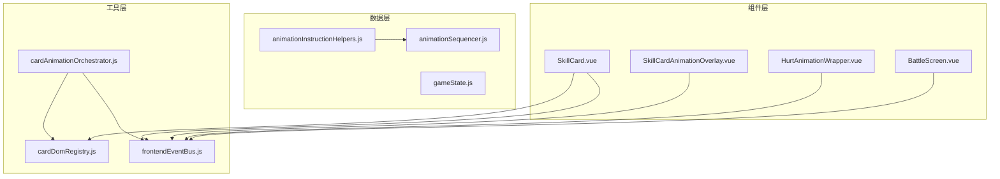
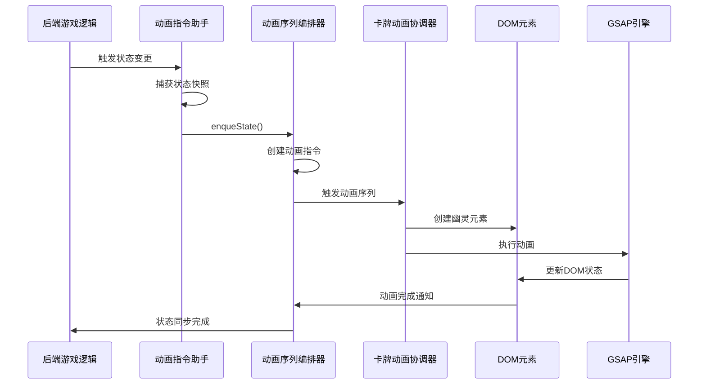
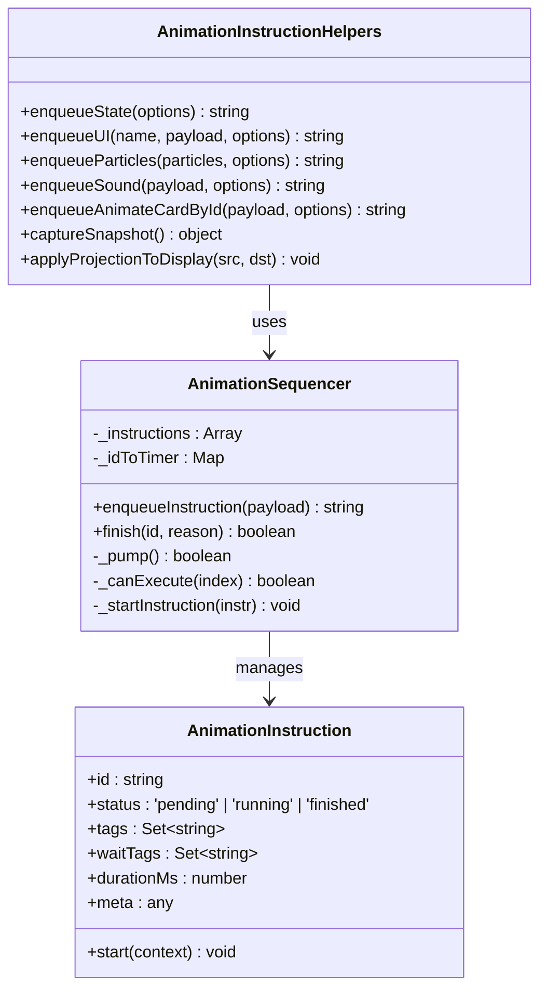
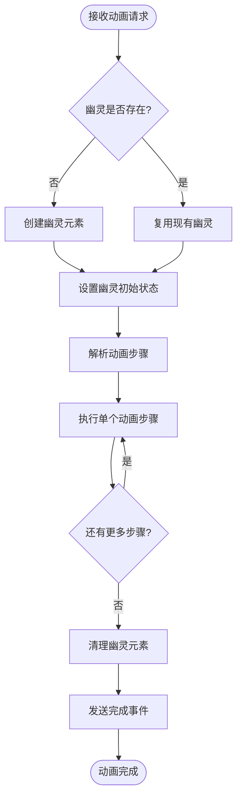
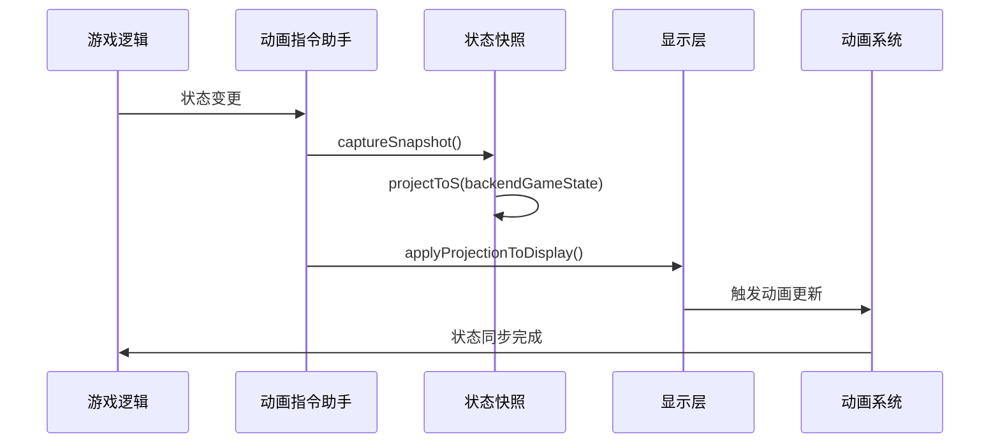
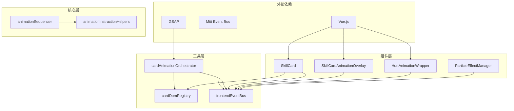

# 动画系统

<cite>
**本文档引用的文件**
- [animationInstructionHelpers.js](file://src/data/animationInstructionHelpers.js)
- [animationSequencer.js](file://src/data/animationSequencer.js)
- [cardAnimationOrchestrator.js](file://src/utils/cardAnimationOrchestrator.js)
- [cardDomRegistry.js](file://src/utils/cardDomRegistry.js)
- [SkillCardAnimationOverlay.vue](file://src/components/SkillCardAnimationOverlay.vue)
- [HurtAnimationWrapper.vue](file://src/components/HurtAnimationWrapper.vue)
- [frontendEventBus.js](file://src/frontendEventBus.js)
- [gameState.js](file://src/data/gameState.js)
- [SkillCard.vue](file://src/components/SkillCard.vue)
</cite>

## 目录
1. [简介](#简介)
2. [项目结构](#项目结构)
3. [核心组件](#核心组件)
4. [架构概览](#架构概览)
5. [详细组件分析](#详细组件分析)
6. [依赖关系分析](#依赖关系分析)
7. [性能考虑](#性能考虑)
8. [故障排除指南](#故障排除指南)
9. [结论](#结论)

## 简介

本动画系统是一个基于GSAP（GreenSock Animation Platform）的现代化动画架构，专为Vue.js应用程序设计。该系统采用分层架构设计，通过指令驱动的方式实现复杂的动画编排，支持动画叠加、同步和性能优化。系统的核心特点包括：

- **基于GSAP的高性能动画引擎**：利用GSAP的强大功能实现流畅的动画效果
- **指令驱动的动画编排**：通过统一的指令系统管理动画序列
- **异步动画队列**：支持同一张卡牌的动画按顺序执行，不同卡片并发播放
- **状态同步机制**：确保动画与游戏状态的一致性
- **事件驱动的解耦设计**：通过事件总线实现组件间的松耦合通信

## 项目结构

动画系统的核心文件分布在以下几个关键目录中：



**图表来源**
- [animationInstructionHelpers.js](file://src/data/animationInstructionHelpers.js#L1-L525)
- [animationSequencer.js](file://src/data/animationSequencer.js#L1-L135)
- [cardAnimationOrchestrator.js](file://src/utils/cardAnimationOrchestrator.js#L1-L590)

## 核心组件

### 动画指令助手（Animation Instruction Helpers）

`animationInstructionHelpers.js` 是整个动画系统的核心控制器，负责将游戏状态同步转换为动画指令。该模块提供了丰富的动画指令封装，包括：

- **状态同步指令**：自动捕获后端状态快照并应用到显示层
- **UI动画指令**：封装各种UI动画效果，如粒子效果、音效、消息弹窗等
- **卡牌动画指令**：专门处理卡牌相关的复杂动画序列
- **控制指令**：管理用户界面的锁定和解锁状态

### 动画序列编排器（Animation Sequencer）

`animationSequencer.js` 实现了一个高级的动画队列管理系统，其核心特性包括：

- **指令模型**：每个动画指令包含ID、状态、标签、等待标签、持续时间和启动逻辑
- **依赖解析**：通过标签系统实现复杂的动画依赖关系管理
- **超时机制**：支持基于时间的动画完成控制
- **事件驱动**：通过前端事件总线实现动画完成的通知机制

### 卡牌动画协调器（Card Animation Orchestrator）

`cardAnimationOrchestrator.js` 专门处理卡牌相关的复杂动画，具有以下特点：

- **异步队列管理**：为每张卡牌维护独立的动画播放队列
- **幽灵对象管理**：创建临时的幽灵元素进行动画渲染
- **锚点系统**：支持多种锚点（中心、牌库等）的动画定位
- **粒子效果集成**：与粒子系统无缝集成，增强视觉效果

**章节来源**
- [animationInstructionHelpers.js](file://src/data/animationInstructionHelpers.js#L1-L525)
- [animationSequencer.js](file://src/data/animationSequencer.js#L1-L135)
- [cardAnimationOrchestrator.js](file://src/utils/cardAnimationOrchestrator.js#L1-L590)

## 架构概览

动画系统采用分层架构设计，通过清晰的职责分离实现高度的模块化：



**图表来源**
- [animationInstructionHelpers.js](file://src/data/animationInstructionHelpers.js#L150-L180)
- [animationSequencer.js](file://src/data/animationSequencer.js#L40-L80)
- [cardAnimationOrchestrator.js](file://src/utils/cardAnimationOrchestrator.js#L500-L550)

## 详细组件分析

### 动画指令系统

动画指令系统是整个动画架构的核心，它将游戏逻辑与动画表现分离：



**图表来源**
- [animationSequencer.js](file://src/data/animationSequencer.js#L28-L65)
- [animationInstructionHelpers.js](file://src/data/animationInstructionHelpers.js#L150-L200)

#### 指令执行机制

动画序列编排器实现了智能的指令执行机制：

1. **依赖检查**：通过标签系统检查前置指令的完成状态
2. **并发控制**：支持多个不冲突的指令并发执行
3. **超时处理**：自动处理长时间未完成的动画
4. **错误恢复**：提供完善的错误处理和恢复机制

### 卡牌动画协调器

卡牌动画协调器是专门为卡牌交互设计的复杂系统：



**图表来源**
- [cardAnimationOrchestrator.js](file://src/utils/cardAnimationOrchestrator.js#L500-L580)

#### 幽灵对象管理系统

幽灵对象是卡牌动画协调器的核心概念：

- **生命周期管理**：从创建到销毁的完整生命周期
- **状态复用**：支持在同一张卡牌上连续执行动画
- **DOM隔离**：在独立的DOM容器中进行动画渲染
- **性能优化**：通过对象池减少DOM操作开销

### 状态同步机制

状态同步机制确保动画与游戏状态的一致性：



**图表来源**
- [animationInstructionHelpers.js](file://src/data/animationInstructionHelpers.js#L150-L200)
- [gameState.js](file://src/data/gameState.js#L40-L75)

**章节来源**
- [animationSequencer.js](file://src/data/animationSequencer.js#L1-L135)
- [cardAnimationOrchestrator.js](file://src/utils/cardAnimationOrchestrator.js#L1-L590)
- [animationInstructionHelpers.js](file://src/data/animationInstructionHelpers.js#L150-L250)

## 依赖关系分析

动画系统的依赖关系体现了清晰的分层架构：



**图表来源**
- [animationSequencer.js](file://src/data/animationSequencer.js#L1-L10)
- [cardAnimationOrchestrator.js](file://src/utils/cardAnimationOrchestrator.js#L1-L10)
- [frontendEventBus.js](file://src/frontendEventBus.js#L1-L9)

### 关键依赖说明

1. **Vue.js**：提供响应式数据绑定和组件系统
2. **GSAP**：提供高性能的动画渲染能力
3. **Mitt**：轻量级事件总线，支持松耦合通信
4. **cardDomRegistry**：管理DOM元素的注册和查找

**章节来源**
- [animationSequencer.js](file://src/data/animationSequencer.js#L1-L10)
- [cardAnimationOrchestrator.js](file://src/utils/cardAnimationOrchestrator.js#L1-L10)
- [frontendEventBus.js](file://src/frontendEventBus.js#L1-L9)

## 性能考虑

动画系统在设计时充分考虑了性能优化：

### 内存管理

- **幽灵对象池**：复用幽灵对象减少DOM创建开销
- **及时清理**：动画完成后立即清理DOM元素和事件监听器
- **弱引用映射**：使用WeakMap避免内存泄漏

### 渲染优化

- **GPU加速**：利用CSS3 transform和opacity实现硬件加速
- **批量更新**：合并多个DOM修改操作
- **节流机制**：限制高频动画事件的触发频率

### 动画调度

- **优先级队列**：重要动画优先执行
- **并发控制**：合理控制同时执行的动画数量
- **懒加载**：按需加载动画资源

## 故障排除指南

### 常见问题及解决方案

#### 动画卡顿或不流畅

**原因分析**：
- DOM操作过于频繁
- 大量动画同时执行
- 内存泄漏导致性能下降

**解决方案**：
```javascript
// 优化动画配置
const optimizedSteps = [
  { toAnchor: 'center', scale: 1.2, duration: 350, ease: 'power2.out' },
  { opacity: 1, duration: 200, ease: 'power1.out' }
];

// 使用帧率控制
gsap.ticker.lagSmoothing(33, 16);
```

#### 动画依赖冲突

**原因分析**：
- 指令标签配置错误
- 等待标签设置不当
- 动画时长计算错误

**解决方案**：
```javascript
// 正确设置等待标签
const instruction = {
  tags: ['ui', 'card-animation'],
  waitTags: ['all'], // 等待所有前序动画完成
  durationMs: 500,
  start: () => { /* 动画逻辑 */ }
};
```

#### 卡牌动画异常

**原因分析**：
- DOM元素未正确注册
- 幽灵对象创建失败
- 锚点定位错误

**解决方案**：
```javascript
// 确保DOM元素正确注册
import { registerCardEl } from '../utils/cardDomRegistry.js';

mounted() {
  registerCardEl(this.skill.uniqueID, this.$refs.root, 'skills-hand');
},
beforeUnmount() {
  unregisterCardEl(this.skill.uniqueID, 'skills-hand');
}
```

**章节来源**
- [cardAnimationOrchestrator.js](file://src/utils/cardAnimationOrchestrator.js#L150-L200)
- [cardDomRegistry.js](file://src/utils/cardDomRegistry.js#L1-L31)

## 结论

本动画系统通过精心设计的架构实现了高性能、可维护的动画解决方案。系统的主要优势包括：

1. **模块化设计**：清晰的职责分离使得系统易于理解和维护
2. **性能优化**：通过多种技术手段确保动画的流畅性和响应性
3. **扩展性强**：灵活的指令系统支持各种复杂的动画需求
4. **解耦设计**：通过事件总线实现组件间的松耦合通信

该系统为游戏应用提供了强大的动画支持，能够满足复杂的交互需求，同时保持良好的性能表现。通过合理的架构设计和优化策略，系统能够在保证功能完整性的同时提供出色的用户体验。