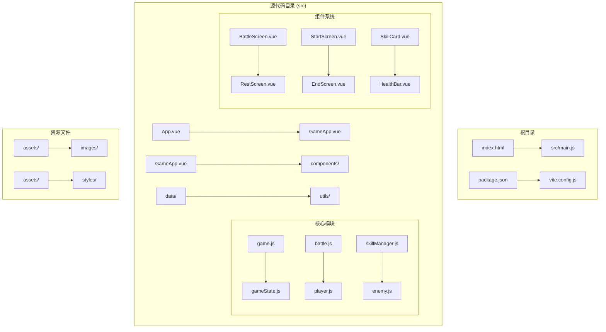
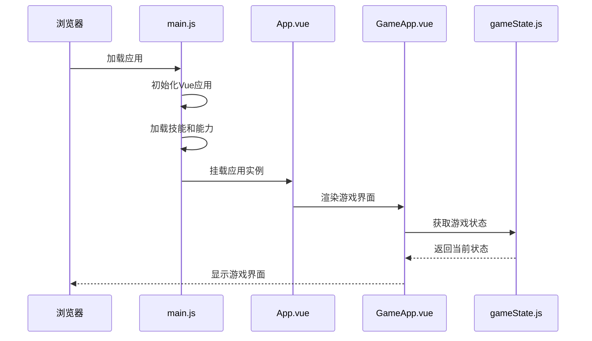

# 快速入门指南

<cite>
**本文档中引用的文件**
- [README.md](file://README.md)
- [package.json](file://package.json)
- [index.html](file://index.html)
- [src/main.js](file://src/main.js)
- [src/GameApp.vue](file://src/GameApp.vue)
- [src/data/gameState.js](file://src/data/gameState.js)
- [src/game.js](file://src/game.js)
- [src/components/StartScreen.vue](file://src/components/StartScreen.vue)
</cite>

## 目录
1. [项目简介](#项目简介)
2. [开发环境搭建](#开发环境搭建)
3. [项目结构概览](#项目结构概览)
4. [启动开发服务器](#启动开发服务器)
5. [项目核心组件](#项目核心组件)
6. [基本游戏操作](#基本游戏操作)
7. [调试模式使用](#调试模式使用)
8. [常见问题解决](#常见问题解决)
9. [总结](#总结)

## 项目简介

魏启尖塔是一个基于Vue 3框架开发的单人肉鸽文字冒险型网页小游戏。游戏采用回合制战斗系统，结合技能、能力、效果等丰富玩法，为玩家提供深度的策略体验。

### 主要特性
- **回合制战斗系统**：实时战斗，策略性十足
- **丰富的技能系统**：多种技能类型和效果
- **动态敌人生成**：根据战斗场次调整敌人强度
- **多样的游戏界面**：战斗、休整、商店等完整流程
- **前后端分离架构**：清晰的状态管理和事件驱动设计

## 开发环境搭建

### 系统要求
- **Node.js**：版本16或更高
- **npm**：包管理工具
- **现代浏览器**：支持ES6+语法

### 安装步骤

#### 1. 克隆项目
```bash
git clone https://github.com/your-repository-url.git
cd rtvl_test
```

#### 2. 安装依赖
```bash
npm install
```

此命令会安装以下核心依赖：
- **Vue 3**：前端框架
- **Vite**：快速构建工具
- **GSAP**：动画库
- **Mitt**：事件总线
- **Vue Router**：路由管理

#### 3. 验证安装
```bash
npm run dev
```

如果一切正常，您应该能看到类似以下输出：
```
  VITE v4.x.x  ready in 1000 ms

  ➜  Local:   http://localhost:3000/
  ➜  Network: use --host to expose
```

## 项目结构概览



**图表来源**
- [src/main.js](file://src/main.js#L1-L55)
- [src/GameApp.vue](file://src/GameApp.vue#L1-L139)

### 关键目录说明

- **`src/`**：主要源代码目录
  - **`components/`**：Vue组件集合
  - **`data/`**：游戏数据和业务逻辑
  - **`utils/`**：工具函数和辅助类
  - **`assets/`**：静态资源文件

- **`public/`**：公共资源目录
  - **`changelog.md`**：更新日志

**章节来源**
- [README.md](file://README.md#L1-L60)
- [package.json](file://package.json#L1-L22)

## 启动开发服务器

### 开发模式启动
```bash
npm run dev
```

这将启动Vite开发服务器：
- **端口**：默认3000
- **热重载**：自动刷新浏览器
- **源码映射**：便于调试

### 生产构建
```bash
npm run build
```

生成优化的生产版本到`dist/`目录。

### 预览生产版本
```bash
npm run preview
```

本地预览构建结果。

## 项目核心组件

### 应用入口点



**图表来源**
- [src/main.js](file://src/main.js#L1-L55)
- [src/GameApp.vue](file://src/GameApp.vue#L1-L139)

### 游戏状态管理

游戏采用前后端分离的状态管理模式：

```javascript
// 前端显示状态
export const displayGameState = reactive(createGameState());

// 后端逻辑状态  
export const backendGameState = reactive(createGameState());
```

这种设计确保了：
- **状态隔离**：UI和业务逻辑分离
- **响应式更新**：自动状态同步
- **调试便利**：前后端状态独立监控

**章节来源**
- [src/main.js](file://src/main.js#L1-L55)
- [src/GameApp.vue](file://src/GameApp.vue#L1-L139)
- [src/data/gameState.js](file://src/data/gameState.js#L1-L75)

## 基本游戏操作

### 启动游戏流程

#### 1. 进入开始界面
访问`http://localhost:3000/`，您将看到游戏主界面。

#### 2. 选择游戏模式
- **无限模式**：经典无尽挑战
- **故事模式**：完整剧情体验（目前未完全开发）

#### 3. 开始第一场战斗
点击"开始游戏"按钮，系统将自动：
1. 触发开场事件
2. 为玩家分配初始技能
3. 进入第一场战斗

### 战斗系统操作

#### 战斗界面元素
- **玩家状态**：生命值、法力值、行动点数
- **敌人状态**：生命值、状态效果
- **技能栏**：可使用的技能卡片
- **行动面板**：执行动作的选项

#### 基本战斗流程
1. **玩家回合**：选择技能攻击敌人
2. **敌人回合**：敌人反击或施放技能
3. **效果结算**：处理各种状态效果
4. **战斗结束**：判断胜负并进入休整

### 休整阶段操作

战斗胜利后进入休整阶段：
- **金钱奖励**：用于购买物品
- **技能选择**：学习新技能
- **突破奖励**：解锁特殊能力
- **商店购物**：购买装备和道具

**章节来源**
- [src/components/StartScreen.vue](file://src/components/StartScreen.vue#L1-L278)
- [src/game.js](file://src/game.js#L1-L119)

## 调试模式使用

### 启用调试功能

#### 方法一：修改源码
在`src/components/StartScreen.vue`中找到以下代码段：
```javascript
onStartGameButtonClicked() {
  const debugMode = false; // 修改为 true 启用调试模式
  // ...
}
```

#### 方法二：使用调试页面
访问`http://localhost:3000/debug`查看调试界面。

### 调试功能包括

#### 1. 状态监控
- 实时查看游戏状态变量
- 监控技能和能力状态
- 观察事件流和状态变化

#### 2. 性能监控
- 组件渲染时间统计
- 内存使用情况
- 事件触发频率

#### 3. 错误追踪
- 控制台错误日志
- 异步操作跟踪
- 状态变更历史

### 调试技巧

#### 1. 使用Vue DevTools
安装Chrome扩展Vue DevTools，可以：
- 检查组件树结构
- 查看响应式数据状态
- 跟踪事件触发过程

#### 2. 状态断点
在关键状态变更处设置断点：
```javascript
// 在gameState.js中添加调试代码
console.log('State changed:', newState);
```

#### 3. 事件监听
监听关键事件了解游戏流程：
```javascript
backendEventBus.on('*', (eventName, payload) => {
  console.log(`Event: ${eventName}`, payload);
});
```

## 常见问题解决

### 安装问题

#### 问题1：依赖安装失败
**症状**：`npm install`报错
**解决方案**：
```bash
# 清除缓存
npm cache clean --force

# 删除node_modules重新安装
rm -rf node_modules package-lock.json
npm install
```

#### 问题2：端口被占用
**症状**：无法启动开发服务器
**解决方案**：
```bash
# 查找占用端口的进程
lsof -i :3000

# 或者指定其他端口
npm run dev -- --port 3001
```

### 运行问题

#### 问题3：游戏无法启动
**症状**：页面空白或报错
**解决方案**：
1. 检查浏览器控制台错误
2. 确认所有依赖已正确安装
3. 清除浏览器缓存

#### 问题4：技能加载失败
**症状**：技能列表为空
**解决方案**：
```javascript
// 检查技能加载状态
console.log('Skill Manager:', window.$skillManager);
console.log('Available skills:', window.$skillManager.getAllSkills());
```

### 开发问题

#### 问题5：热重载失效
**症状**：修改代码后页面不更新
**解决方案**：
```bash
# 重启开发服务器
npm run dev

# 或者强制刷新
touch src/main.js
```

#### 问题6：样式不生效
**症状**：CSS样式没有应用
**解决方案**：
1. 检查CSS文件路径
2. 确认scoped样式作用域
3. 使用浏览器开发者工具检查样式优先级

### 性能问题

#### 问题7：游戏卡顿
**症状**：战斗过程中出现延迟
**解决方案**：
1. 减少粒子效果数量
2. 优化复杂动画
3. 启用性能监控

#### 问题8：内存泄漏
**症状**：长时间游戏后内存占用过高
**解决方案**：
```javascript
// 定期清理事件监听器
window.addEventListener('beforeunload', () => {
  backendEventBus.all.clear();
});
```

## 总结

本快速入门指南涵盖了魏启尖塔项目的各个方面，从环境搭建到基本操作，再到调试技巧和问题解决。通过遵循这些步骤，即使是完全没有项目背景的新开发者也能快速上手。

### 关键要点回顾

1. **环境准备**：确保Node.js和npm版本符合要求
2. **项目理解**：掌握前后端分离架构和状态管理模式
3. **操作流程**：熟悉游戏启动、战斗和休整的基本操作
4. **调试技巧**：学会使用调试工具和技巧
5. **问题解决**：具备常见问题的诊断和解决能力

### 下一步建议

- **深入学习**：阅读各个模块的详细文档
- **实践操作**：尝试修改代码，理解工作原理
- **贡献代码**：发现bug或有改进建议时提交PR
- **社区参与**：加入开发者社区，交流经验

通过持续的学习和实践，您将能够更好地理解和贡献这个精彩的项目。