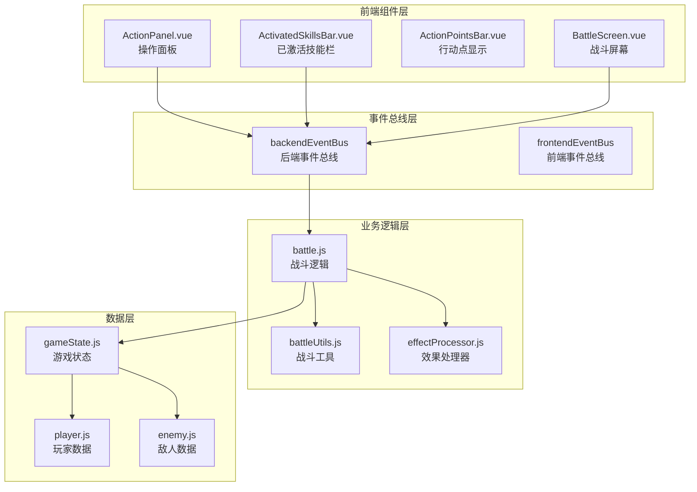
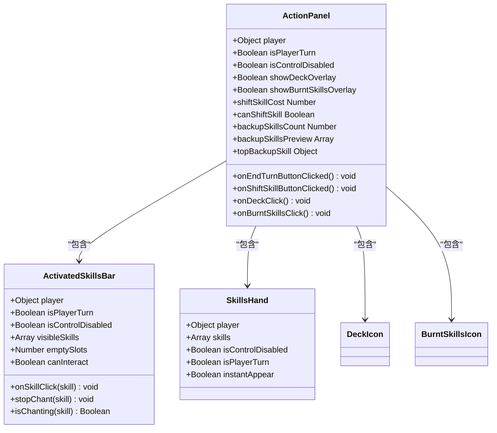
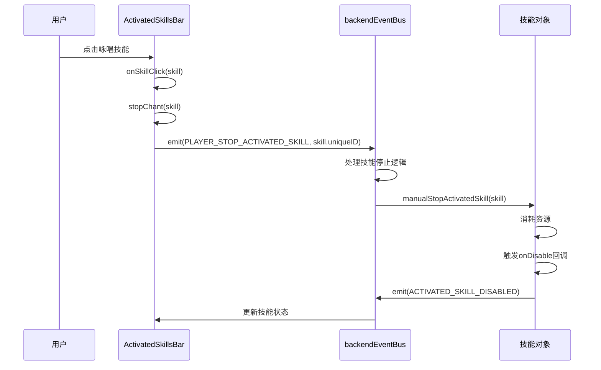
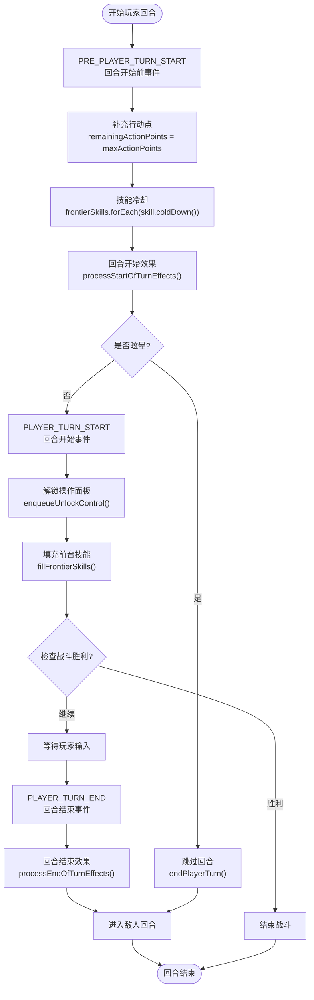
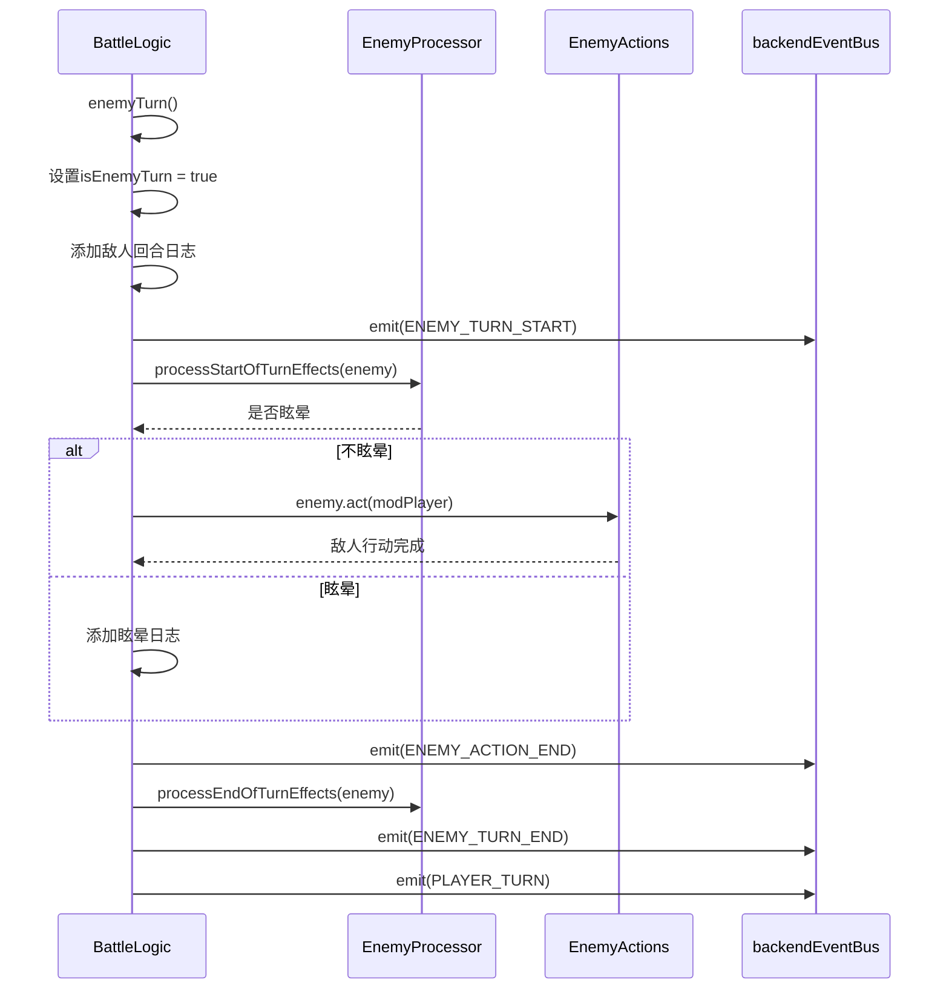
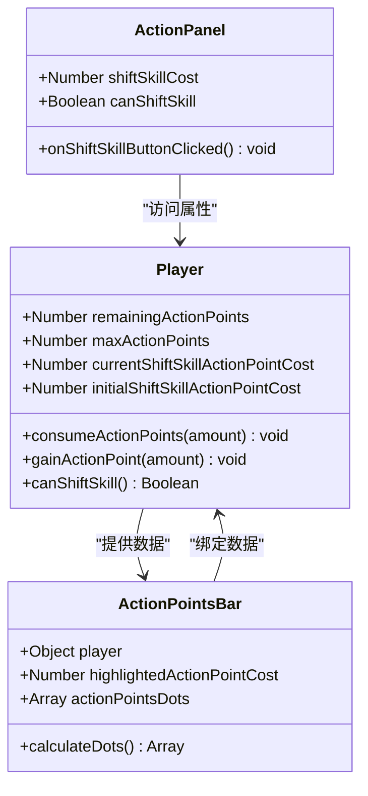
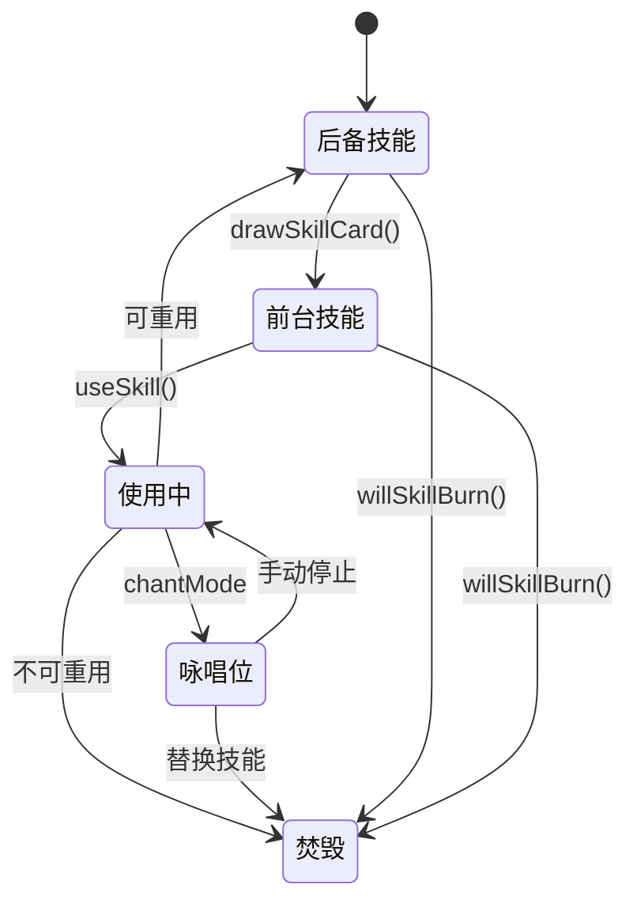
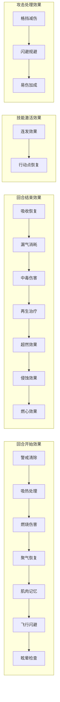

# 回合机制详细文档

<cite>
**本文档中引用的文件**
- [src/data/battle.js](file://src/data/battle.js)
- [src/components/battle/ActionPanel.vue](file://src/components/battle/ActionPanel.vue)
- [src/components/battle/ActivatedSkillsBar.vue](file://src/components/battle/ActivatedSkillsBar.vue)
- [src/data/battleUtils.js](file://src/data/battleUtils.js)
- [src/data/effectProcessor.js](file://src/data/effectProcessor.js)
- [src/backendEventBus.js](file://src/backendEventBus.js)
- [src/frontendEventBus.js](file://src/frontendEventBus.js)
- [src/data/player.js](file://src/data/player.js)
- [src/components/global/ActionPointsBar.vue](file://src/components/global/ActionPointsBar.vue)
</cite>

## 目录
1. [简介](#简介)
2. [系统架构概览](#系统架构概览)
3. [核心组件分析](#核心组件分析)
4. [回合执行流程](#回合执行流程)
5. [行动点机制](#行动点机制)
6. [技能管理系统](#技能管理系统)
7. [效果处理系统](#效果处理系统)
8. [性能优化策略](#性能优化策略)
9. [故障排除指南](#故障排除指南)
10. [总结](#总结)

## 简介

本回合机制文档详细介绍了游戏战斗系统中玩家与敌人回合的执行逻辑。该系统采用基于事件驱动的架构，通过前后端分离的方式实现复杂的战斗回合管理。系统的核心包括回合状态管理、行动点消耗与恢复、技能执行顺序控制以及效果处理等关键功能。

## 系统架构概览



**图表来源**
- [src/data/battle.js](file://src/data/battle.js#L1-L50)
- [src/components/battle/ActionPanel.vue](file://src/components/battle/ActionPanel.vue#L1-L30)
- [src/backendEventBus.js](file://src/backendEventBus.js#L1-L20)

## 核心组件分析

### ActionPanel.vue - 操作面板组件

ActionPanel是玩家回合操作的主要界面组件，负责处理用户输入并触发相应的技能执行。



**图表来源**
- [src/components/battle/ActionPanel.vue](file://src/components/battle/ActionPanel.vue#L40-L80)
- [src/components/battle/ActivatedSkillsBar.vue](file://src/components/battle/ActivatedSkillsBar.vue#L15-L45)

**章节来源**
- [src/components/battle/ActionPanel.vue](file://src/components/battle/ActionPanel.vue#L1-L178)

### ActivatedSkillsBar.vue - 已激活技能管理

ActivatedSkillsBar专门负责管理咏唱状态的技能，提供技能停止、视觉反馈和交互功能。



**图表来源**
- [src/components/battle/ActivatedSkillsBar.vue](file://src/components/battle/ActivatedSkillsBar.vue#L130-L150)
- [src/data/battle.js](file://src/data/battle.js#L280-L290)

**章节来源**
- [src/components/battle/ActivatedSkillsBar.vue](file://src/components/battle/ActivatedSkillsBar.vue#L1-L179)

## 回合执行流程

### 玩家回合流程



**图表来源**
- [src/data/battle.js](file://src/data/battle.js#L85-L150)

### 敌人回合流程



**图表来源**
- [src/data/battle.js](file://src/data/battle.js#L311-L353)

**章节来源**
- [src/data/battle.js](file://src/data/battle.js#L85-L353)

## 行动点机制

### 行动点消耗与恢复

行动点系统是回合机制的核心，控制玩家能够执行的操作数量。



**图表来源**
- [src/data/player.js](file://src/data/player.js#L200-L225)
- [src/components/global/ActionPointsBar.vue](file://src/components/global/ActionPointsBar.vue#L15-L40)

### 行动点计算逻辑

```javascript
// 行动点消耗示例
function useSkill(skill) {
  // 技能使用时消耗行动点
  skill.consumeResources(gameState.player);
  
  // 换卡操作消耗额外行动点
  const shiftSkillCost = player.currentShiftSkillActionPointCost;
  player.consumeActionPoints(shiftSkillCost);
  player.currentShiftSkillActionPointCost++; // 下次增加开销
}
```

**章节来源**
- [src/data/player.js](file://src/data/player.js#L200-L225)
- [src/components/global/ActionPointsBar.vue](file://src/components/global/ActionPointsBar.vue#L1-L52)

## 技能管理系统

### 技能执行顺序与优先级

技能系统支持多种执行模式，包括即时施放、咏唱和连锁触发。

```mermaid
flowchart TD
SkillSelect[选择技能] --> CheckCanUse{"技能可用?"}
CheckCanUse --> |否| Reject[拒绝执行]
CheckCanUse --> |是| ConsumeResources[消耗资源]
ConsumeResources --> ActivateSkill[激活技能<br/>activateSkill()]
ActivateSkill --> ProcessEffects[处理技能效果]
ProcessEffects --> CheckVictory{"检查胜利?"}
CheckVictory --> |胜利| EndBattle[结束战斗]
CheckVictory --> |继续| CheckChant{"咏唱技能?"}
CheckChant --> |是| ChantSkill[咏唱技能处理]
CheckChant --> |否| NormalSkill[普通技能处理]
ChantSkill --> HandleAfterUse[处理使用后逻辑]
NormalSkill --> HandleAfterUse
HandleAfterUse --> CheckBurn{"需要焚毁?"}
CheckBurn --> |是| BurnSkill[焚毁技能]
CheckBurn --> |否| DropSkill[丢弃技能到后备]
BurnSkill --> UpdateSkills[更新技能列表]
DropSkill --> UpdateSkills
UpdateSkills --> End([执行完成])
Reject --> End
EndBattle --> End
```

**图表来源**
- [src/data/battle.js](file://src/data/battle.js#L155-L200)

### 技能生命周期管理



**章节来源**
- [src/data/battle.js](file://src/data/battle.js#L155-L300)
- [src/data/battleUtils.js](file://src/data/battleUtils.js#L150-L250)

## 效果处理系统

### 效果处理优先级规则

效果系统采用分阶段处理机制，确保技能效果按照正确的顺序执行。



**图表来源**
- [src/data/effectProcessor.js](file://src/data/effectProcessor.js#L10-L100)

### 效果处理函数详解

```javascript
// 回合开始效果处理
export function processStartOfTurnEffects(target) {
  // 1. 清除警戒效果
  if(target.effects['警戒'] > 0) {
    target.addEffect('警戒', -1);
  } else {
    target.shield = 0;
  }
  
  // 2. 处理燃烧效果
  if (target.effects['燃烧'] > 0) {
    let damage = target.effects['燃烧'];
    damage -= target.effects['火焰抗性'] || 0;
    target.addEffect('燃烧', -1);
    if(damage > 0) {
      dealDamage(null, target, damage);
    }
  }
  
  // 3. 处理眩晕效果
  if (target.effects['眩晕'] > 0) {
    target.addEffect('眩晕', -1);
    return true; // 返回true表示跳过回合
  }
  
  return false;
}
```

**章节来源**
- [src/data/effectProcessor.js](file://src/data/effectProcessor.js#L10-L356)

## 性能优化策略

### 避免高频状态更新导致的UI卡顿

系统采用多种策略来优化性能：

1. **事件批处理**：将多个状态变更合并为单个事件发送
2. **动画队列管理**：使用enqueueDelay()控制动画播放节奏
3. **条件渲染优化**：根据游戏状态动态显示/隐藏组件
4. **内存管理**：及时清理不再使用的技能和效果

```javascript
// 性能优化示例：动画延迟控制
function useSkill(skill) {
  // 技能使用动画
  enqueueAnimateCardById({
    id: skill.uniqueID, 
    kind: 'flyToAnchor', 
    options: { anchor: 'center', scale: 1.2 }
  }, { tags: ['ui'], waitTags: [] });
  
  // 动画屏障，防止重叠播放
  enqueueDelay(0);
  
  // 资源结算
  skill.consumeResources(gameState.player);
  
  // 技能效果处理
  if(activateSkill(skill)) return ;
  
  // 动画完成后的状态更新
  enqueueDelay(0);
}
```

### 内存泄漏防护

```javascript
// 组件卸载时的清理工作
beforeUnmount() {
  frontendEventBus.off('disable-controls');
  frontendEventBus.off('enable-controls');
  
  // 清理卡片DOM注册
  Object.keys(this.cardRefs).forEach(id => 
    unregisterCardEl(id, 'activated-skills-bar')
  );
}
```

**章节来源**
- [src/data/battle.js](file://src/data/battle.js#L155-L200)
- [src/components/battle/ActivatedSkillsBar.vue](file://src/components/battle/ActivatedSkillsBar.vue#L80-L100)

## 故障排除指南

### 常见问题诊断

1. **回合无法正常切换**
   - 检查`gameState.isEnemyTurn`状态设置
   - 验证事件监听器是否正确注册
   - 确认`enqueueLockControl()`和`enqueueUnlockControl()`配对使用

2. **行动点显示异常**
   - 检查`remainingActionPoints`和`maxActionPoints`同步
   - 验证`ActionPointsBar`组件数据绑定
   - 确认`gainActionPoint()`和`consumeActionPoints()`调用

3. **技能无法使用**
   - 检查`skill.canUse(player)`返回值
   - 验证行动点是否充足
   - 确认技能冷却时间是否结束

### 调试技巧

```javascript
// 调试事件流
backendEventBus.on('*', (eventName, payload) => {
  console.log(`Event: ${eventName}`, payload);
});

// 调试技能状态
console.log('Player skills:', gameState.player.skills);
console.log('Frontier skills:', gameState.player.frontierSkills);
console.log('Activated skills:', gameState.player.activatedSkills);
```

**章节来源**
- [src/data/battle.js](file://src/data/battle.js#L400-L500)

## 总结

本回合机制系统通过精心设计的架构实现了复杂的游戏逻辑，包括：

1. **清晰的职责分离**：前端组件负责用户交互，后端逻辑处理游戏状态
2. **事件驱动架构**：通过事件总线实现松耦合的组件通信
3. **灵活的效果处理**：支持多种效果类型的分阶段处理
4. **性能优化考虑**：通过动画队列和状态批处理提升用户体验
5. **完善的错误处理**：提供详细的调试信息和故障排除指南

该系统为游戏提供了稳定可靠的回合机制基础，支持复杂的战斗逻辑和丰富的技能系统。通过持续的优化和维护，能够满足不断增长的游戏需求。