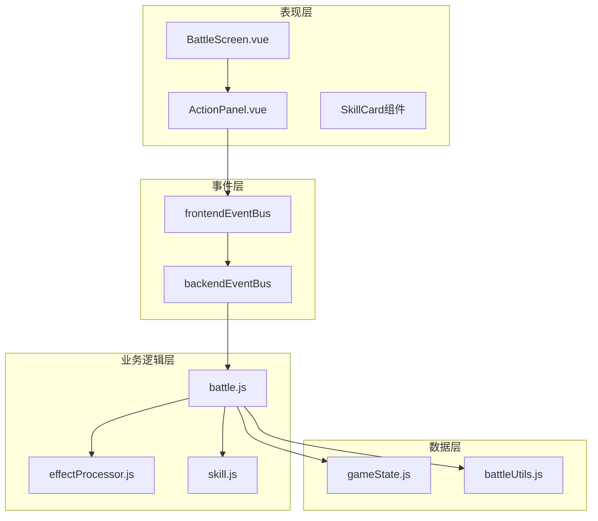
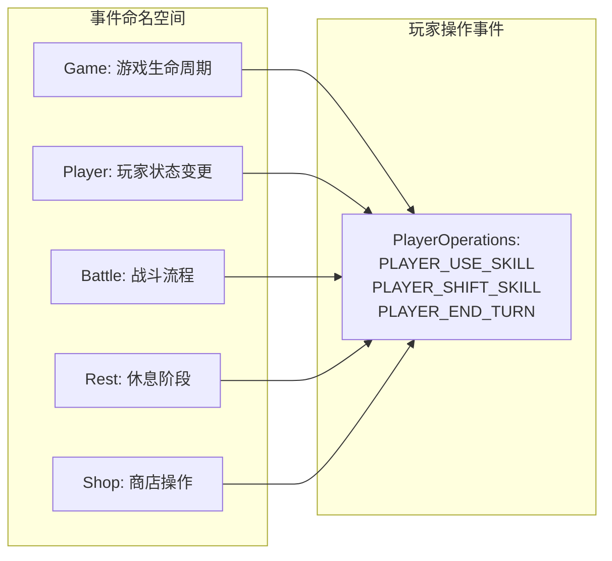
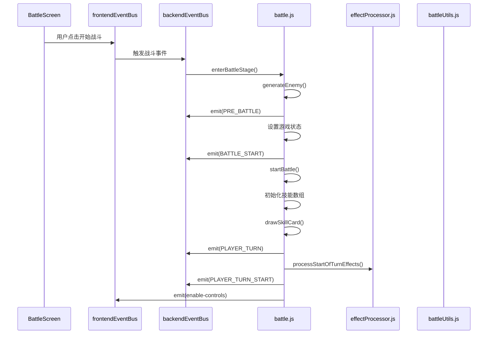
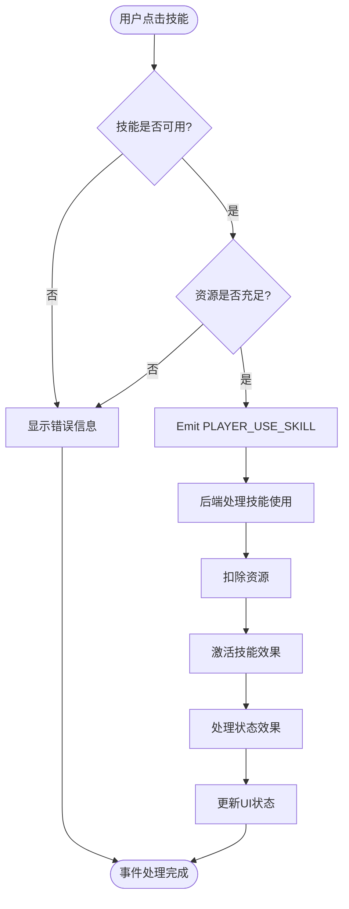
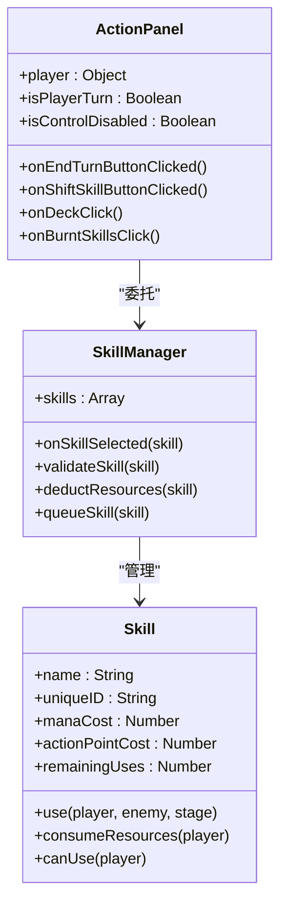
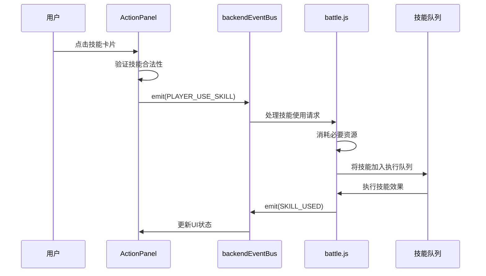
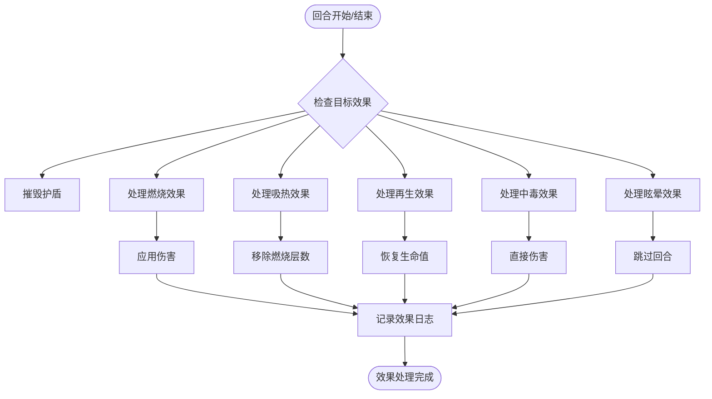
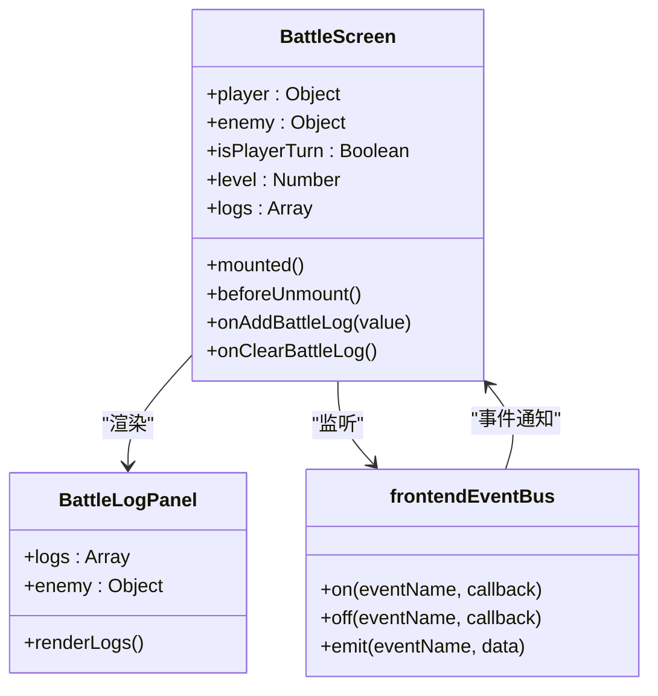
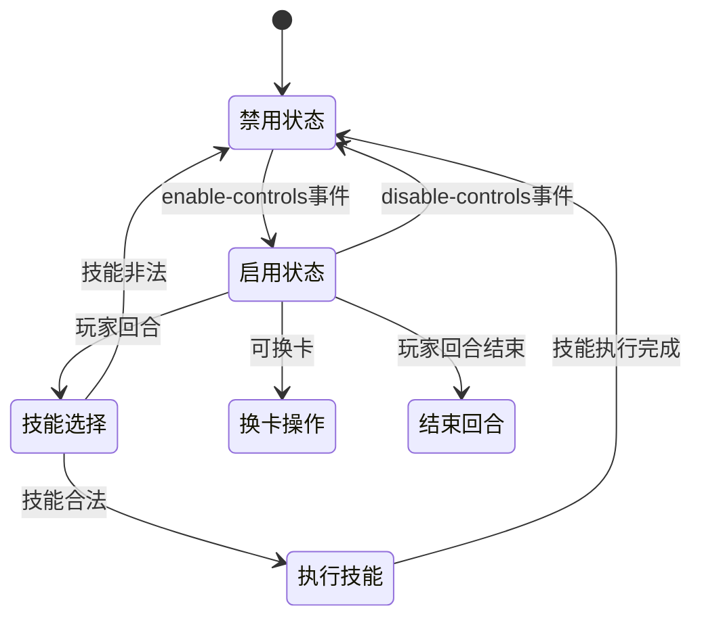
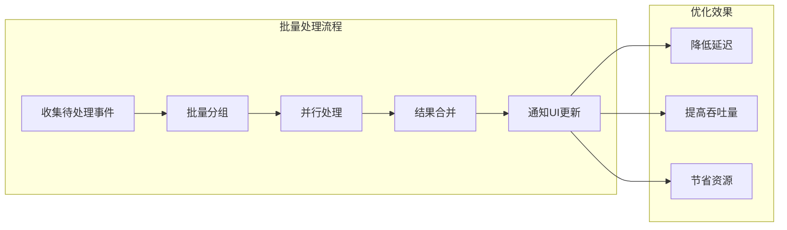

# 战斗事件流文档

<cite>
**本文档引用的文件**
- [frontendEventBus.js](file://src/frontendEventBus.js)
- [backendEventBus.js](file://src/backendEventBus.js)
- [battle.js](file://src/data/battle.js)
- [effectProcessor.js](file://src/data/effectProcessor.js)
- [BattleScreen.vue](file://src/components/battle/BattleScreen.vue)
- [ActionPanel.vue](file://src/components/battle/ActionPanel.vue)
- [skill.js](file://src/data/skill.js)
- [battleUtils.js](file://src/data/battleUtils.js)
</cite>

## 目录
1. [简介](#简介)
2. [项目架构概览](#项目架构概览)
3. [事件总线系统](#事件总线系统)
4. [战斗事件流分析](#战斗事件流分析)
5. [技能选择与处理](#技能选择与处理)
6. [状态效果处理](#状态效果处理)
7. [UI反馈机制](#ui反馈机制)
8. [性能优化策略](#性能优化策略)
9. [故障排除指南](#故障排除指南)
10. [总结](#总结)

## 简介

战斗事件流是RuneTales虚拟实验室(RTVL)游戏的核心机制，负责管理从用户操作到效果结算的完整事件传递链。该系统采用事件驱动架构，通过前端事件总线(frontendEventBus)和后端事件总线(backendEventBus)实现UI层与战斗系统的解耦通信。

本文档深入分析了战斗事件流的各个组件，包括事件捕获、合法性校验、资源扣除、技能入队、状态效果触发与叠加等关键环节，为开发者提供全面的技术参考。

## 项目架构概览

RTVL的战斗系统采用分层架构设计，主要包含以下核心层次：



**图表来源**
- [BattleScreen.vue](file://src/components/battle/BattleScreen.vue#L1-L112)
- [ActionPanel.vue](file://src/components/battle/ActionPanel.vue#L1-L178)
- [frontendEventBus.js](file://src/frontendEventBus.js#L1-L9)
- [backendEventBus.js](file://src/backendEventBus.js#L1-L80)

## 事件总线系统

### 前端事件总线

前端事件总线专门负责在前端组件之间传递事件和数据，主要用于控制和播放动画，不涉及具体结算逻辑：

```javascript
// 前端事件总线
// 前端事件总线负责在前端组件之间传递事件和数据，一般用于控制和播放动画，不涉及具体结算逻辑
import mitt from 'mitt';

const frontendEventBus = mitt();

export default frontendEventBus;
```

### 后端事件总线

后端事件总线定义了完整的事件命名空间，涵盖游戏、玩家、战斗、休息等多个阶段：



**图表来源**
- [backendEventBus.js](file://src/backendEventBus.js#L5-L75)

**章节来源**
- [frontendEventBus.js](file://src/frontendEventBus.js#L1-L9)
- [backendEventBus.js](file://src/backendEventBus.js#L1-L80)

## 战斗事件流分析

### 战斗启动流程

战斗启动是一个复杂的多阶段事件序列：



**图表来源**
- [battle.js](file://src/data/battle.js#L15-L50)
- [BattleScreen.vue](file://src/components/battle/BattleScreen.vue#L1-L112)

### 技能使用事件处理

当玩家选择技能时，事件流如下：



**图表来源**
- [ActionPanel.vue](file://src/components/battle/ActionPanel.vue#L100-L120)
- [battle.js](file://src/data/battle.js#L150-L200)

**章节来源**
- [battle.js](file://src/data/battle.js#L15-L200)

## 技能选择与处理

### onSkillSelected事件响应逻辑

技能选择事件通过ActionPanel组件捕获并处理：



**图表来源**
- [ActionPanel.vue](file://src/components/battle/ActionPanel.vue#L50-L100)
- [skill.js](file://src/data/skill.js#L1-L100)

### 合法性校验与资源扣除

技能使用前的完整性验证包括：

1. **技能可用性检查**：验证技能是否在冷却中
2. **资源充足性检查**：确认魏启和行动点是否足够
3. **使用次数检查**：确保技能还有剩余使用次数
4. **冷却状态检查**：验证技能是否已经准备好使用

```javascript
// 技能合法性校验示例
canUse(player) {
  // 默认实现：检查魏启和行动点是否足够
  return player.mana >= this.manaCost && 
         player.remainingActionPoints >= this.actionPointCost && 
         this.remainingUses > 0;
}

// 资源扣除逻辑
consumeResources(player) {
  player.consumeActionPoints(this.actionPointCost);
  player.consumeMana(this.manaCost);
  this.consumeUses();
}
```

### 技能入队机制

技能选择后会进入战斗队列系统：



**图表来源**
- [ActionPanel.vue](file://src/components/battle/ActionPanel.vue#L100-L130)
- [battle.js](file://src/data/battle.js#L150-L200)

**章节来源**
- [ActionPanel.vue](file://src/components/battle/ActionPanel.vue#L1-L178)
- [skill.js](file://src/data/skill.js#L1-L205)
- [battle.js](file://src/data/battle.js#L150-L200)

## 状态效果处理

### effectProcessor.js协同机制

effectProcessor.js与战斗系统紧密协作，处理各种状态效果的触发与叠加：



**图表来源**
- [effectProcessor.js](file://src/data/effectProcessor.js#L10-L100)

### 效果触发链路

状态效果的触发遵循严格的优先级顺序：

1. **回合开始效果**：处理护盾、燃烧、聚气等效果
2. **回合结束效果**：处理再生、中毒、吸收等效果  
3. **技能激活效果**：处理技能发动时的即时效果
4. **攻击结算效果**：处理攻击命中后的附加效果

```javascript
// 回合开始效果处理示例
export function processStartOfTurnEffects(target) {
  // 摧毁护盾
  if(target.effects['警戒'] > 0) {
    target.addEffect('警戒', -1);
  } else {
    target.shield = 0;
  }
  
  // 处理燃烧效果
  if (target.effects['燃烧'] > 0) {
    let damage = target.effects['燃烧'];
    damage -= target.effects['火焰抗性'] || 0;
    target.addEffect('燃烧', -1);
    if(damage > 0) {
      dealDamage(null, target, damage);
    }
  }
  
  // 最后再处理眩晕效果
  if (target.effects['眩晕'] > 0) {
    target.addEffect('眩晕', -1);
    return true; // 返回true表示需要跳过回合
  }
  
  return false;
}
```

**章节来源**
- [effectProcessor.js](file://src/data/effectProcessor.js#L1-L200)

## UI反馈机制

### BattleScreen.vue事件监听器

BattleScreen组件负责接收战斗日志事件并更新UI：



**图表来源**
- [BattleScreen.vue](file://src/components/battle/BattleScreen.vue#L30-L80)

### UI反馈生成过程

UI反馈的生成遵循以下流程：

1. **事件捕获**：frontendEventBus监听战斗相关事件
2. **数据处理**：BattleScreen组件处理事件数据
3. **状态更新**：更新组件内部状态
4. **视图渲染**：重新渲染UI组件
5. **动画触发**：通过动画序列器播放视觉效果

```javascript
// BattleScreen事件监听示例
mounted() {
  frontendEventBus.on('add-battle-log', this.onAddBattleLog);
  frontendEventBus.on('clear-battle-log', this.onClearBattleLog);
},
methods: {
  onAddBattleLog(value) {
    // 兼容字符串与对象格式
    this.logs.push(value);
  },
  onClearBattleLog() {
    this.logs = [];
  },
}
```

### 控制面板状态管理

ActionPanel组件管理玩家操作权限：



**图表来源**
- [ActionPanel.vue](file://src/components/battle/ActionPanel.vue#L80-L120)

**章节来源**
- [BattleScreen.vue](file://src/components/battle/BattleScreen.vue#L1-L112)
- [ActionPanel.vue](file://src/components/battle/ActionPanel.vue#L80-L120)

## 性能优化策略

### 事件节流机制

为了防止高频事件导致性能问题，系统实现了多种节流策略：

1. **动画指令节流**：限制同时播放的动画数量
2. **事件频率控制**：对频繁触发的事件进行去重
3. **批量处理**：将多个相关事件合并处理

```javascript
// 动画指令节流示例
export function enqueueAnimateCardById(instruction, options = {}) {
  // 检查是否有相同类型的动画正在执行
  const existing = animationQueue.find(
    q => q.tags.includes(`skill-${instruction.id}`)
  );
  
  if (existing) {
    // 合并相似动画，避免重复执行
    return;
  }
  
  // 添加新的动画指令
  animationQueue.push({
    ...instruction,
    tags: options.tags || [],
    waitTags: options.waitTags || []
  });
}
```

### 批量处理优化

对于大量技能或效果的处理，采用批量处理策略：



### 错误传播机制

系统实现了完善的错误传播机制：

1. **事件级错误处理**：单个事件失败不影响整体流程
2. **状态回滚**：错误发生时恢复到安全状态
3. **错误日志记录**：详细记录错误信息用于调试

```javascript
// 错误处理示例
try {
  // 执行技能使用逻辑
  const result = skill.use(player, enemy, stage);
  if (checkBattleVictory()) return true;
  
  if(result === true) break;
  stage++;
} catch(error) {
  // 记录错误并继续处理下一个事件
  console.error('技能使用失败:', error);
  backendEventBus.emit(EventNames.Battle.PLAYER_TURN_END);
}
```

## 故障排除指南

### 常见事件流问题

1. **技能无法使用**
   - 检查技能冷却状态
   - 验证资源是否充足
   - 确认玩家回合状态

2. **效果不生效**
   - 检查效果堆叠计数
   - 验证效果优先级
   - 确认目标有效性

3. **UI状态不同步**
   - 检查事件监听器注册
   - 验证状态更新时机
   - 确认动画队列状态

### 调试工具和技巧

```javascript
// 调试事件流的辅助函数
function debugEventFlow(eventName, eventData) {
  console.group(`[Event Debug] ${eventName}`);
  console.log('Event Data:', eventData);
  console.log('Current State:', backendGameState);
  console.trace('Call Stack');
  console.groupEnd();
}

// 在关键事件上添加调试信息
backendEventBus.on('*', (eventName, eventData) => {
  debugEventFlow(eventName, eventData);
});
```

**章节来源**
- [battle.js](file://src/data/battle.js#L150-L200)
- [effectProcessor.js](file://src/data/effectProcessor.js#L1-L100)

## 总结

RTVL的战斗事件流系统展现了现代游戏开发中事件驱动架构的最佳实践。通过清晰的职责分离、完善的错误处理和高效的性能优化，该系统能够支持复杂的战斗逻辑和丰富的用户体验。

### 关键特性总结

1. **模块化设计**：各组件职责明确，便于维护和扩展
2. **事件驱动**：松耦合架构，支持灵活的功能组合
3. **性能优化**：多层次的优化策略确保流畅的游戏体验
4. **错误处理**：完善的异常处理机制保证系统稳定性

### 未来改进方向

1. **异步处理优化**：进一步优化异步事件处理性能
2. **内存管理**：改进事件监听器的内存泄漏防护
3. **测试覆盖**：增加自动化测试确保事件流的正确性
4. **监控系统**：建立事件流监控体系及时发现问题

该文档为开发者提供了全面的技术参考，有助于深入理解和优化RTVL的战斗事件流系统。