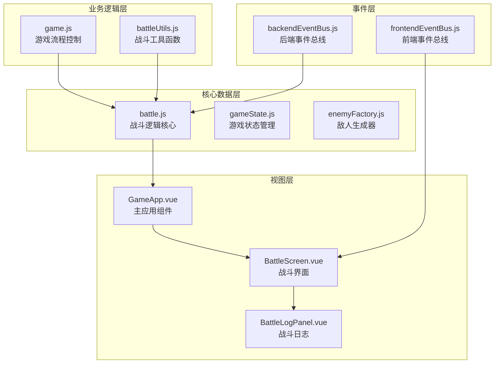
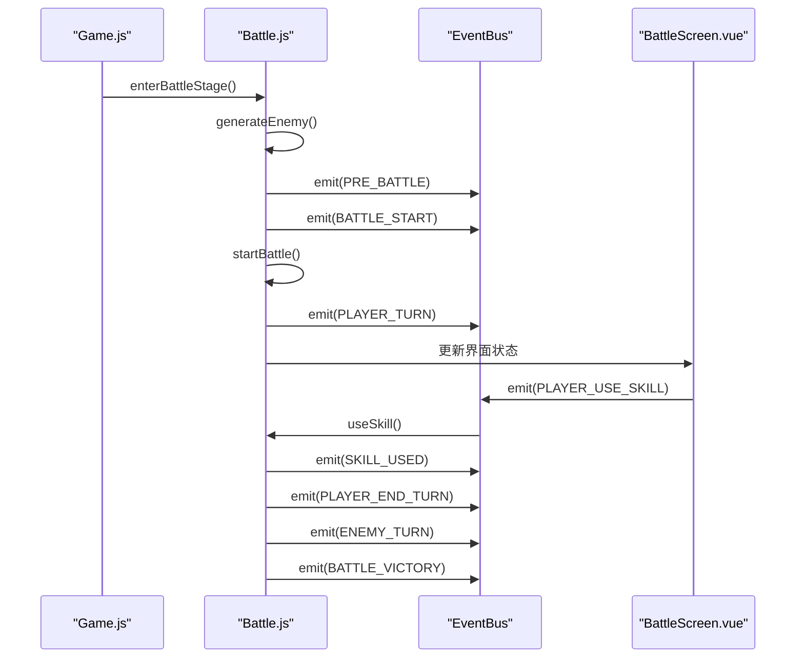
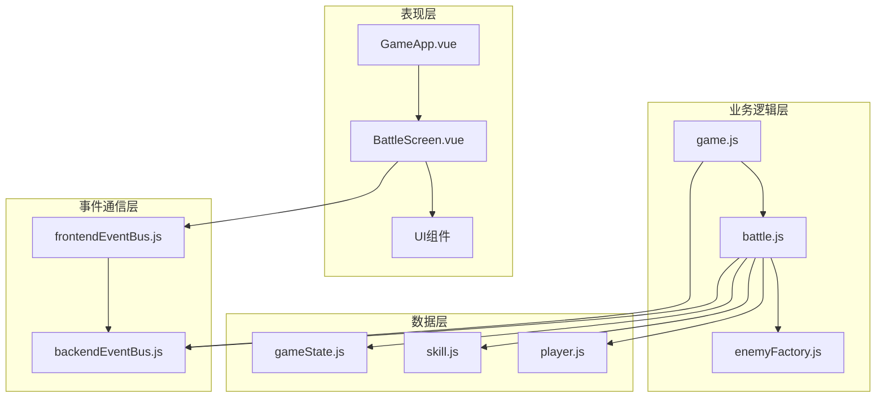
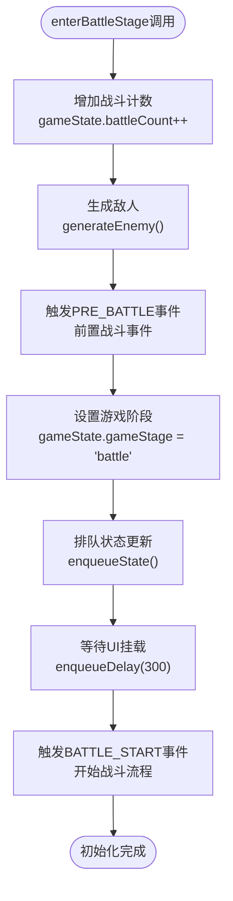
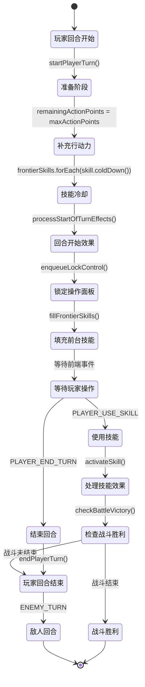
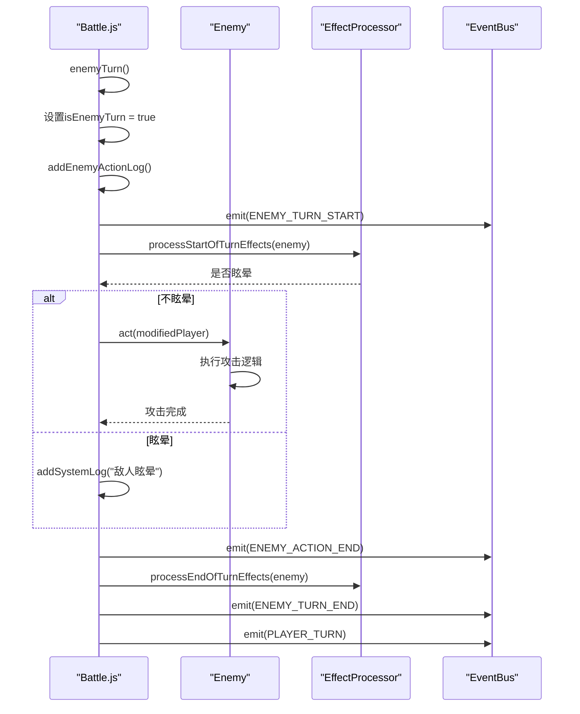
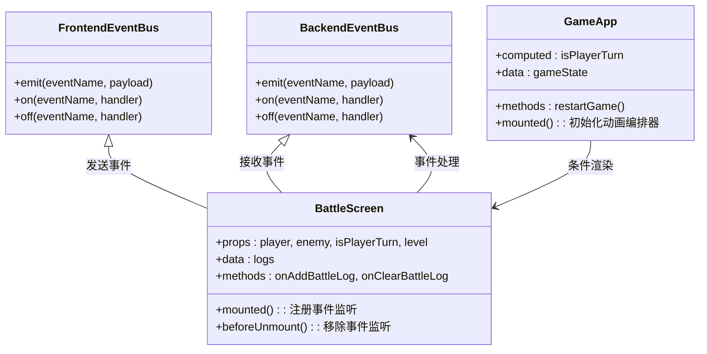
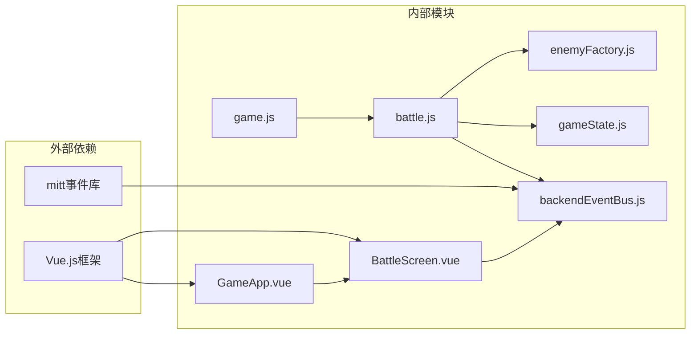

# 战斗流程

<cite>
**本文档中引用的文件**
- [battle.js](file://src/data/battle.js)
- [GameApp.vue](file://src/GameApp.vue)
- [game.js](file://src/game.js)
- [BattleScreen.vue](file://src/components/BattleScreen.vue)
- [backendEventBus.js](file://src/backendEventBus.js)
- [frontendEventBus.js](file://src/frontendEventBus.js)
- [gameState.js](file://src/data/gameState.js)
- [enemyFactory.js](file://src/data/enemyFactory.js)
</cite>

## 目录
1. [简介](#简介)
2. [项目结构概览](#项目结构概览)
3. [核心组件分析](#核心组件分析)
4. [架构概览](#架构概览)
5. [详细组件分析](#详细组件分析)
6. [依赖关系分析](#依赖关系分析)
7. [性能考虑](#性能考虑)
8. [故障排除指南](#故障排除指南)
9. [结论](#结论)

## 简介

本文档深入分析了RTVL游戏中的战斗流程系统，详细解析了从进入战斗到战斗结束的完整生命周期。战斗系统采用事件驱动架构，通过状态机模式管理各个战斗阶段，并实现了前后端状态同步机制。

战斗流程涵盖了战斗初始化、阶段切换、战斗终止条件等多个关键环节，确保了游戏体验的流畅性和一致性。系统支持多种战斗阶段，包括战斗准备、玩家回合、敌人回合和结算阶段，每个阶段都有明确的转换条件和处理逻辑。

## 项目结构概览

战斗系统的文件组织遵循清晰的分层架构：



**图表来源**
- [battle.js](file://src/data/battle.js#L1-L553)
- [GameApp.vue](file://src/GameApp.vue#L1-L139)
- [game.js](file://src/game.js#L1-L119)

**章节来源**
- [battle.js](file://src/data/battle.js#L1-L50)
- [GameApp.vue](file://src/GameApp.vue#L1-L50)

## 核心组件分析

### 战斗状态管理器

战斗系统的核心是`battle.js`模块，它负责管理整个战斗生命周期：

```javascript
// 战斗初始化
export function enterBattleStage() {
  gameState.battleCount++;
  
  // 生成敌人
  generateEnemy(gameState);
  
  // 战前事件
  backendEventBus.emit(EventNames.Game.PRE_BATTLE, {
    battleCount: gameState.battleCount,
    player: gameState.player,
    enemy: gameState.enemy
  });
  
  // 切换游戏状态到战斗状态
  gameState.gameStage = 'battle';
  enqueueState(captureSnapshot(), 0);
  enqueueDelay(300, {tags: ['ui', 'mount']});
  
  // 进入游戏控制流
  backendEventBus.emit(EventNames.Battle.BATTLE_START);
}
```

### 事件驱动架构

战斗系统采用事件驱动架构，通过事件总线实现前后端通信：



**图表来源**
- [battle.js](file://src/data/battle.js#L15-L50)
- [game.js](file://src/game.js#L25-L45)
- [backendEventBus.js](file://src/backendEventBus.js#L33-L78)

**章节来源**
- [battle.js](file://src/data/battle.js#L15-L50)
- [game.js](file://src/game.js#L25-L45)

## 架构概览

战斗系统采用分层架构设计，确保了代码的可维护性和扩展性：



**图表来源**
- [GameApp.vue](file://src/GameApp.vue#L1-L30)
- [battle.js](file://src/data/battle.js#L1-L20)
- [game.js](file://src/game.js#L1-L20)

## 详细组件分析

### 战斗初始化流程

战斗初始化是一个多步骤的过程，涉及状态设置、敌人生成和事件触发：



**图表来源**
- [battle.js](file://src/data/battle.js#L15-L35)

### 玩家回合管理

玩家回合管理包含回合开始、技能使用和回合结束三个主要阶段：



**图表来源**
- [battle.js](file://src/data/battle.js#L50-L150)

### 敌人回合处理

敌人回合处理模拟敌人的智能行为，包括行动决策和效果结算：



**图表来源**
- [battle.js](file://src/data/battle.js#L300-L350)

### 战斗胜利处理

战斗胜利处理负责清理战场状态并触发相应的结算流程：

```javascript
function battleVictory(isVictory) {
  // 清理咏唱技能
  if (Array.isArray(gameState.player.activatedSkills) && gameState.player.activatedSkills.length) {
    for (const s of [...gameState.player.activatedSkills]) {
      try { s.onDisable(gameState.player, 'battleEnd'); } catch (_) {}
      backendEventBus.emit(EventNames.Player.ACTIVATED_SKILL_DISABLED, { skill: s, reason: 'battleEnd' });
    }
    gameState.player.activatedSkills = [];
  }
  
  // 卡牌离场
  gameState.player.skills.forEach(skill => {
    try { skill.onLeaveBattle(gameState.player); } catch (_) {}
  });
  
  // 清理技能列表
  gameState.player.frontierSkills = [];
  gameState.player.backupSkills = [];
  gameState.player.burntSkills = [];
  
  // 战斗结束事件
  backendEventBus.emit(EventNames.Game.POST_BATTLE, {
    battleCount: gameState.battleCount,
    player: gameState.player,
    enemy: gameState.enemy,
    isVictory: isVictory
  });
}
```

**章节来源**
- [battle.js](file://src/data/battle.js#L350-L400)

### 前后端状态同步

战斗系统通过事件总线实现前后端状态同步：



**图表来源**
- [BattleScreen.vue](file://src/components/BattleScreen.vue#L1-L50)
- [GameApp.vue](file://src/GameApp.vue#L1-L50)
- [backendEventBus.js](file://src/backendEventBus.js#L1-L20)

**章节来源**
- [BattleScreen.vue](file://src/components/BattleScreen.vue#L1-L112)
- [GameApp.vue](file://src/GameApp.vue#L1-L139)

## 依赖关系分析

战斗系统的依赖关系展现了清晰的分层架构：



**图表来源**
- [battle.js](file://src/data/battle.js#L1-L10)
- [game.js](file://src/game.js#L1-L10)
- [backendEventBus.js](file://src/backendEventBus.js#L1-L5)

**章节来源**
- [battle.js](file://src/data/battle.js#L1-L15)
- [game.js](file://src/game.js#L1-L15)

## 性能考虑

战斗系统在设计时充分考虑了性能优化：

1. **事件队列机制**：使用动画指令助手实现异步动画处理
2. **状态快照**：通过captureSnapshot()减少不必要的状态计算
3. **延迟处理**：合理使用enqueueDelay()避免过度渲染
4. **内存管理**：及时清理战斗结束后的技能状态

## 故障排除指南

### 常见问题及解决方案

1. **战斗状态不一致**
   - 检查gameState.gameStage是否正确设置
   - 验证事件监听器是否正常注册
   - 确认enqueueState()调用时机

2. **技能使用失败**
   - 验证技能canUse()方法返回值
   - 检查玩家行动力是否充足
   - 确认技能是否存在于前台技能列表

3. **UI状态不同步**
   - 检查frontendEventBus事件发送
   - 验证BattleScreen组件事件监听
   - 确认props数据传递正确

**章节来源**
- [battle.js](file://src/data/battle.js#L450-L500)

## 结论

RTVL游戏的战斗流程系统展现了优秀的软件架构设计，通过事件驱动模式实现了前后端的松耦合集成。系统具有以下特点：

1. **模块化设计**：清晰的职责分离，便于维护和扩展
2. **状态机管理**：明确的战斗阶段转换，确保流程可控
3. **事件驱动**：高效的前后端通信机制
4. **错误处理**：完善的异常处理和状态恢复机制

这套战斗系统为游戏提供了稳定可靠的战斗体验，同时具备良好的可扩展性，能够支持未来的新功能开发。