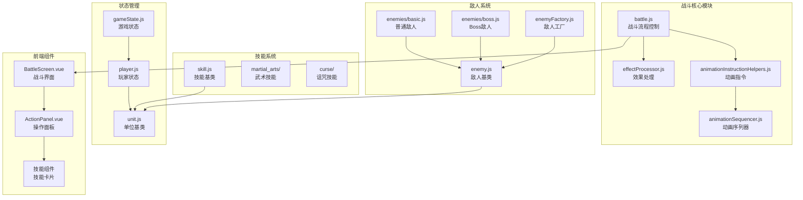
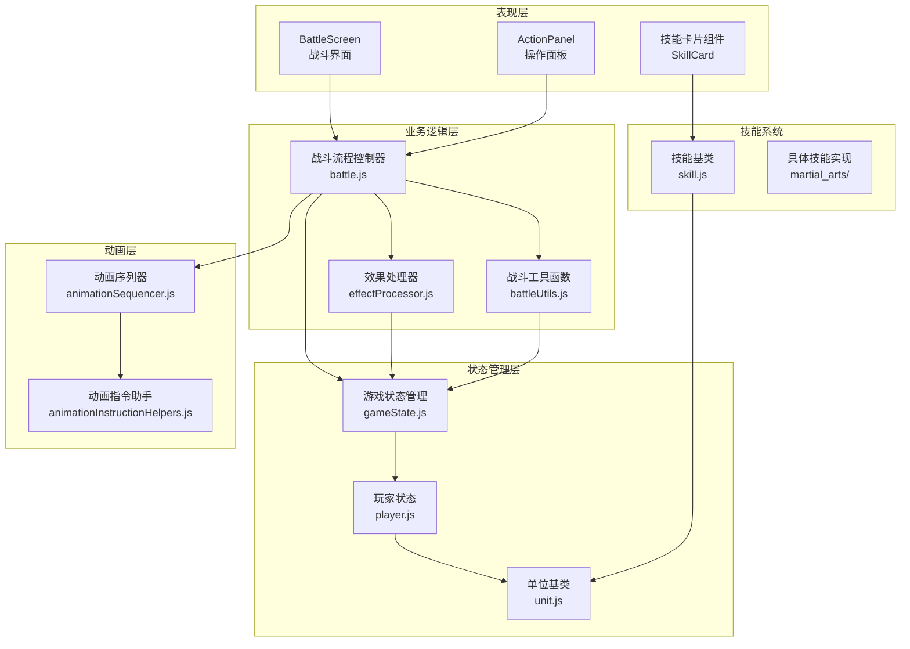
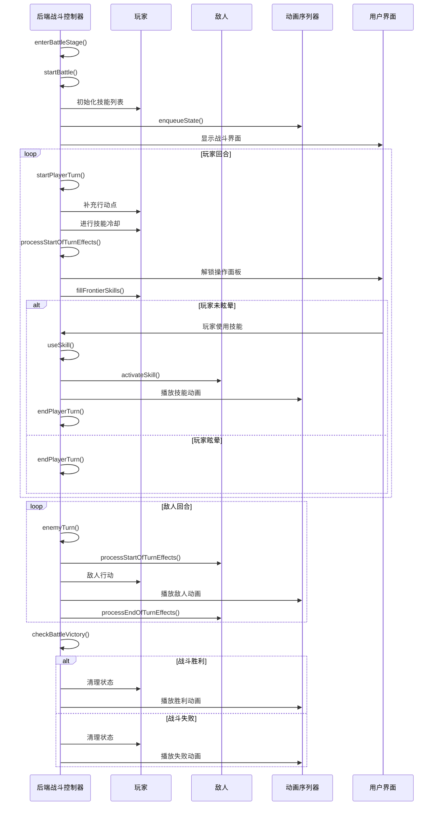
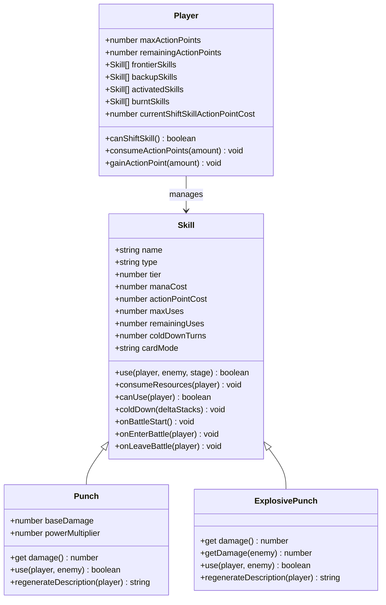
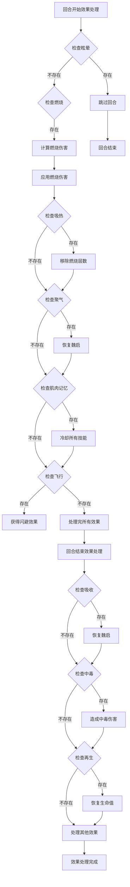
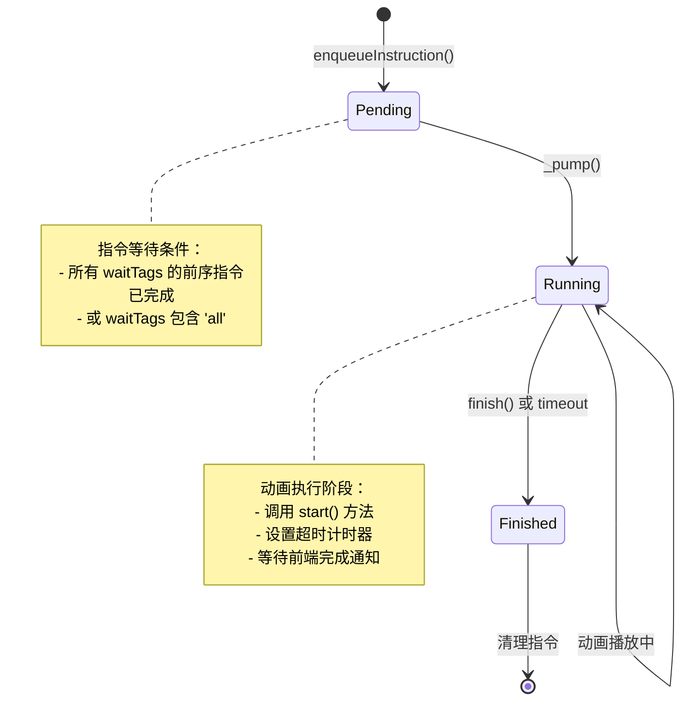
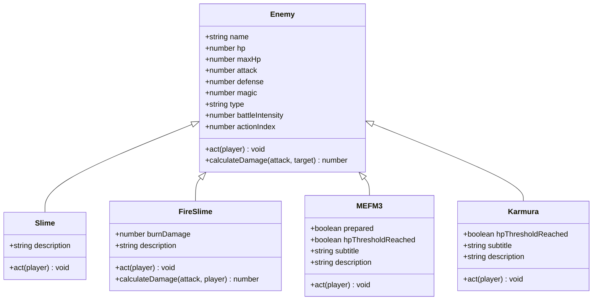
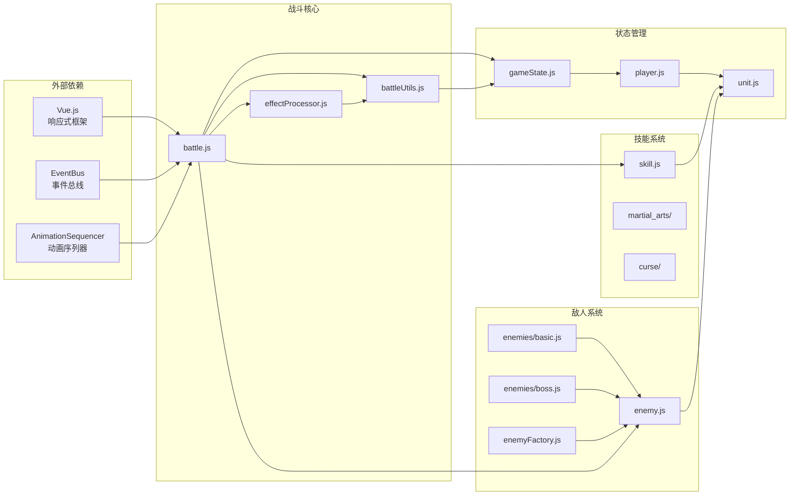

# 战斗系统

<cite>
**本文档中引用的文件**
- [battle.js](file://src/data/battle.js)
- [effectProcessor.js](file://src/data/effectProcessor.js)
- [animationInstructionHelpers.js](file://src/data/animationInstructionHelpers.js)
- [gameState.js](file://src/data/gameState.js)
- [player.js](file://src/data/player.js)
- [unit.js](file://src/data/unit.js)
- [skill.js](file://src/data/skill.js)
- [animationSequencer.js](file://src/data/animationSequencer.js)
- [battleUtils.js](file://src/data/battleUtils.js)
- [BattleScreen.vue](file://src/components/BattleScreen.vue)
- [ActionPanel.vue](file://src/components/ActionPanel.vue)
- [punch.js](file://src/data/skills/martial_arts/punch.js)
- [basic.js](file://src/data/enemies/basic.js)
- [boss.js](file://src/data/enemies/boss.js)
- [slimes.js](file://src/data/enemies/slimes.js)
- [enemyFactory.js](file://src/data/enemyFactory.js)
</cite>

## 目录
1. [简介](#简介)
2. [项目结构](#项目结构)
3. [核心组件](#核心组件)
4. [架构概览](#架构概览)
5. [详细组件分析](#详细组件分析)
6. [依赖关系分析](#依赖关系分析)
7. [性能考虑](#性能考虑)
8. [故障排除指南](#故障排除指南)
9. [结论](#结论)

## 简介

本战斗系统是一个复杂的回合制战斗引擎，采用前后端分离架构，实现了完整的战斗流程控制、技能系统、状态效果管理和动画调度。系统支持多种战斗阶段，包括战斗准备、玩家回合、敌人回合和战斗结束，并提供了丰富的状态效果叠加规则和优先级处理机制。

## 项目结构

战斗系统的核心文件组织如下：



**图表来源**
- [battle.js](file://src/data/battle.js#L1-L50)
- [gameState.js](file://src/data/gameState.js#L1-L30)
- [player.js](file://src/data/player.js#L1-L50)

## 核心组件

### 战斗流程控制器 (battle.js)

战斗流程控制器是整个战斗系统的核心，负责管理战斗的各个阶段和回合转换。

```javascript
// 战斗开始流程
export function enterBattleStage() {
  gameState.battleCount++;
  generateEnemy(gameState);
  backendEventBus.emit(EventNames.Game.PRE_BATTLE, {
    battleCount: gameState.battleCount,
    player: gameState.player,
    enemy: gameState.enemy
  });
  gameState.gameStage = 'battle';
  enqueueState(captureSnapshot(), 0);
  enqueueDelay(300, {tags: ['ui', 'mount']});
  backendEventBus.emit(EventNames.Battle.BATTLE_START);
}
```

### 状态效果处理器 (effectProcessor.js)

效果处理器实现了复杂的状态效果叠加规则和优先级处理机制。

```javascript
export function processStartOfTurnEffects(target) {
  // 处理燃烧效果
  if (target.effects['燃烧'] > 0) {
    let damage = target.effects['燃烧'];
    damage -= target.effects['火焰抗性'] || 0;
    target.addEffect('燃烧', -1);
    if(damage > 0) {
      dealDamage(null, target, damage);
      enqueueDelay(400);
    }
  }
  
  // 处理眩晕效果
  if (target.effects['眩晕'] > 0) {
    target.addEffect('眩晕', -1);
    addEffectLog(`${target.name}处于眩晕状态，跳过回合！`);
    return true;
  }
  
  return false;
}
```

**章节来源**
- [battle.js](file://src/data/battle.js#L15-L50)
- [effectProcessor.js](file://src/data/effectProcessor.js#L15-L80)

## 架构概览

战斗系统采用分层架构设计，实现了清晰的职责分离：



**图表来源**
- [BattleScreen.vue](file://src/components/BattleScreen.vue#L1-L30)
- [ActionPanel.vue](file://src/components/ActionPanel.vue#L1-L30)
- [battle.js](file://src/data/battle.js#L1-L30)

## 详细组件分析

### 战斗主循环

战斗主循环实现了完整的回合制战斗流程，包括回合切换、行动点管理和技能执行顺序控制。



**图表来源**
- [battle.js](file://src/data/battle.js#L50-L150)
- [battle.js](file://src/data/battle.js#L300-L400)

### 技能系统架构

技能系统采用面向对象设计，支持多种技能类型和复杂的技能效果。



**图表来源**
- [skill.js](file://src/data/skill.js#L1-L100)
- [punch.js](file://src/data/skills/martial_arts/punch.js#L1-L50)
- [player.js](file://src/data/player.js#L50-L100)

### 状态效果管理系统

状态效果管理系统实现了复杂的效果叠加规则和优先级处理。



**图表来源**
- [effectProcessor.js](file://src/data/effectProcessor.js#L15-L100)
- [effectProcessor.js](file://src/data/effectProcessor.js#L120-L200)

### 动画调度系统

动画调度系统实现了复杂的动画序列控制和状态同步机制。



**图表来源**
- [animationSequencer.js](file://src/data/animationSequencer.js#L50-L100)

**章节来源**
- [battle.js](file://src/data/battle.js#L200-L300)
- [effectProcessor.js](file://src/data/effectProcessor.js#L1-L100)
- [animationSequencer.js](file://src/data/animationSequencer.js#L1-L50)

### 敌人系统架构

敌人系统支持多种敌人类型和复杂的战斗行为。



**图表来源**
- [basic.js](file://src/data/enemies/basic.js#L1-L50)
- [slimes.js](file://src/data/enemies/slimes.js#L1-L40)
- [boss.js](file://src/data/enemies/boss.js#L1-L50)

## 依赖关系分析

战斗系统的依赖关系体现了清晰的分层架构：



**图表来源**
- [battle.js](file://src/data/battle.js#L1-L10)
- [gameState.js](file://src/data/gameState.js#L1-L10)

**章节来源**
- [battle.js](file://src/data/battle.js#L1-L20)
- [gameState.js](file://src/data/gameState.js#L1-L30)

## 性能考虑

### 技能效果批量处理

系统采用了多种性能优化策略：

1. **状态快照机制**：通过`captureSnapshot()`和`applyProjectionToDisplay()`实现高效的前后端状态同步
2. **动画批处理**：使用动画序列器统一管理动画指令，避免频繁的DOM操作
3. **效果链式处理**：通过`processPostAttackEffects`和`processAttackTakenEffects`实现效果的链式处理

### 动画调度优化

```javascript
// 动画指令优化示例
export function enqueueAnimateCardById(payload = {}, { tags = ['ui'], waitTags, durationMs = Infinity, ...rest } = {}) {
  return enqueueInstruction({
    tags,
    waitTags: waitTags ?? computeWaitTags(rest),
    durationMs,
    start: ({ id, emit }) => {
      const token = id;
      const onFinished = (msg = {}) => {
        const t = msg?.token;
        if (t === token) {
          frontendEventBus.off('animation-card-by-id-finished', onFinished);
          frontendEventBus.emit('animation-instruction-finished', { id });
        }
      };
      frontendEventBus.on('animation-card-by-id-finished', onFinished);
      try { emit('animate-card-by-id', Object.assign({}, payload || {}, { completionToken: token })); }
      catch (_) { frontendEventBus.off('animation-card-by-id-finished', onFinished); }
    },
  });
}
```

### 内存管理

系统通过以下方式优化内存使用：

- 使用对象池模式管理技能实例
- 及时清理战斗结束后的状态数据
- 采用WeakMap避免内存泄漏

## 故障排除指南

### 常见问题诊断

1. **技能无法使用**
   - 检查行动点是否充足
   - 验证魏启消耗是否满足
   - 确认技能冷却状态

2. **动画播放异常**
   - 检查动画指令的waitTags配置
   - 验证前端事件总线连接
   - 确认动画序列器状态

3. **效果处理错误**
   - 检查效果名称拼写
   - 验证效果堆叠逻辑
   - 确认效果优先级处理

### 调试工具

系统提供了丰富的调试功能：

```javascript
// 启用调试模式
console.log('Starting battle with cultivated skills:', gameState.player.cultivatedSkills);
console.log(gameState.player.skills);

// 状态监控
backendEventBus.on('animation-instruction-finished', (payload = {}) => {
  const id = payload?.id;
  if (id) this.finish(id, 'frontend');
});
```

**章节来源**
- [animationInstructionHelpers.js](file://src/data/animationInstructionHelpers.js#L200-L250)
- [battle.js](file://src/data/battle.js#L40-L60)

## 结论

本战斗系统展现了现代游戏开发中的最佳实践，通过清晰的架构设计、完善的错误处理和优秀的性能优化，为玩家提供了流畅而富有深度的战斗体验。系统的主要优势包括：

1. **模块化设计**：各组件职责明确，易于维护和扩展
2. **前后端分离**：清晰的职责分工，提高开发效率
3. **状态管理**：完善的前后端状态同步机制
4. **动画系统**：灵活的动画调度和状态管理
5. **扩展性强**：支持新的技能类型和敌人行为

未来的改进方向包括：
- 增强AI敌人的智能程度
- 优化大规模战斗的性能
- 扩展更多的战斗效果类型
- 改进动画系统的实时渲染能力