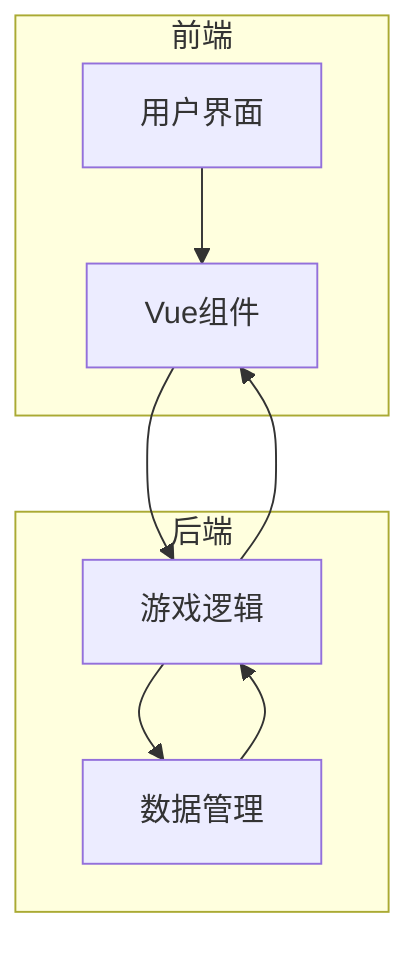
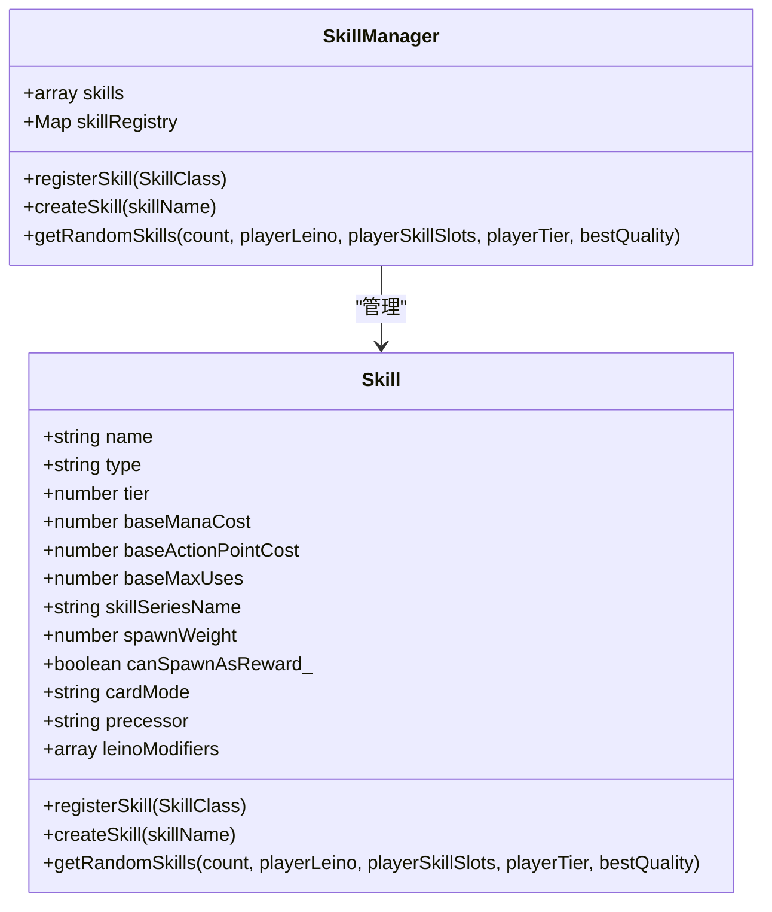
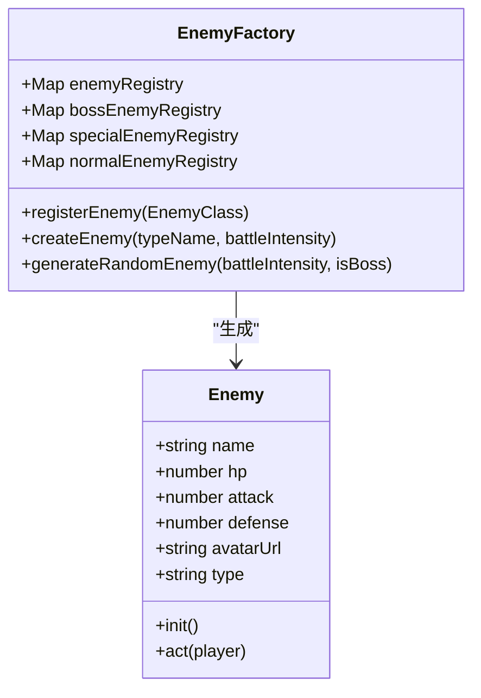
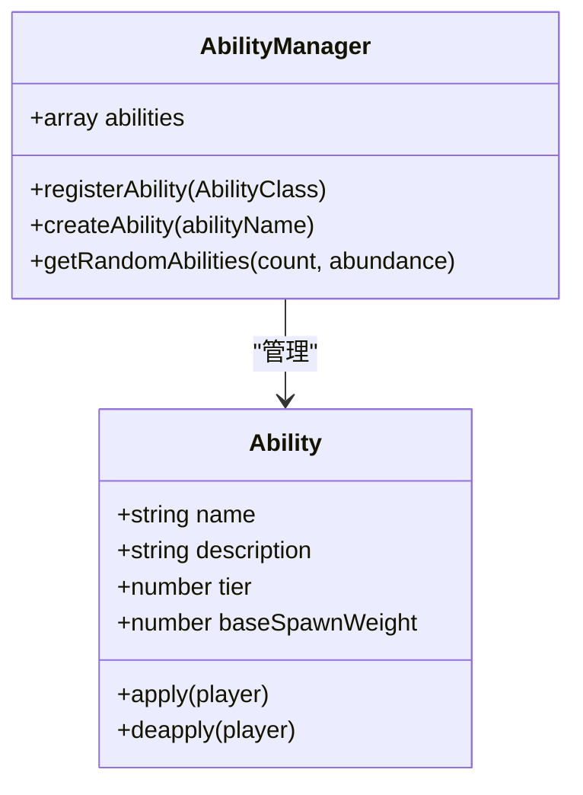
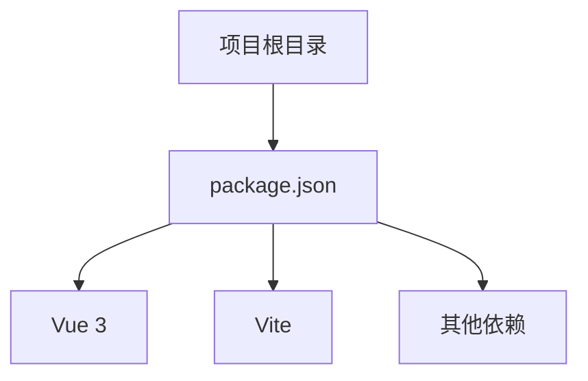

# 扩展开发指南

<cite>
**本文档中引用的文件**   
- [SKILL_DESIGN_PRINCIPLES.md](file://src/data/skills/SKILL_DESIGN_PRINCIPLES.md)
- [skillManager.js](file://src/data/skillManager.js)
- [skill.js](file://src/data/skill.js)
- [enemyFactory.js](file://src/data/enemyFactory.js)
- [enemy.js](file://src/data/enemy.js)
- [abilityManager.js](file://src/data/abilityManager.js)
- [ability.js](file://src/data/ability.js)
- [README.md](file://src/data/README.md)
- [enemies/README.md](file://src/data/enemies/README.md)
</cite>

## 目录
1. [引言](#引言)
2. [项目结构](#项目结构)
3. [核心组件](#核心组件)
4. [架构概述](#架构概述)
5. [详细组件分析](#详细组件分析)
6. [依赖分析](#依赖分析)
7. [性能考虑](#性能考虑)
8. [故障排除指南](#故障排除指南)
9. [结论](#结论)

## 引言
本文档旨在为开发者提供一个详细的扩展开发指南，重点说明如何遵循SKILL_DESIGN_PRINCIPLES.md中的原则开发新技能。文档详细描述了技能注册的完整步骤和注意事项，解释了能力系统的扩展机制和敌人类型的添加方法。同时提供了代码模板和最佳实践示例，列出了常见错误和调试技巧，并说明了扩展功能的测试验证流程。最后讨论了向后兼容性和版本控制策略。

## 项目结构
本项目采用模块化设计，主要分为以下几个部分：
- `public`：存放公共文件，如变更日志。
- `src`：源代码目录，包含所有前端和后端逻辑。
  - `assets`：静态资源文件，如CSS样式表。
  - `components`：Vue组件，实现各种UI元素。
  - `data`：数据管理模块，包括技能、敌人、能力等。
  - `utils`：工具函数库。
- 根目录下包含项目配置文件，如`package.json`、`vite.config.js`等。

**Section sources**
- [README.md](file://README.md#L0-L59)

## 核心组件
核心组件主要包括技能管理器、敌人工厂和能力管理器。这些组件负责游戏中的主要逻辑处理，如技能的创建与管理、敌人的生成以及能力的应用。

**Section sources**
- [skillManager.js](file://src/data/skillManager.js#L0-L252)
- [enemyFactory.js](file://src/data/enemyFactory.js#L0-L87)
- [abilityManager.js](file://src/data/abilityManager.js#L0-L117)

## 架构概述
系统架构采用分层设计，前端使用Vue 3框架构建用户界面，后端通过JavaScript实现游戏逻辑。数据层通过`skillManager.js`、`enemyFactory.js`和`abilityManager.js`等文件管理技能、敌人和能力。各层之间通过事件总线进行通信，确保前后端数据同步。

**Diagram sources **
- [main.js](file://src/main.js#L1-L20)
- [game.js](file://src/game.js#L10-L30)

## 详细组件分析

### 技能系统分析
技能系统由`skillManager.js`管理，技能定义在`skills/`目录下。开发者需要遵循SKILL_DESIGN_PRINCIPLES.md中的原则来设计新技能。

#### 技能设计原则
根据`SKILL_DESIGN_PRINCIPLES.md`文件，技能设计应遵循以下原则：
- 优先设计系列技能，系列技能和单卡技能的比例建议为（1系列:1单卡）。
- 技能分9类，每类技能有其独特的元素侧重，同类技能内还分体系，体系内交互最为紧密。
- 获得体系内**精英能力**后，体系内卡牌会有更高概率出现在卡池中。
- 体系内有**深入**卡，此类卡牌效果强力，仅在玩家于体系内有较深造诣且获得**精英能力**后才会出现在卡池中。

**Diagram sources **
- [skill.js](file://src/data/skill.js#L0-L204)
- [skillManager.js](file://src/data/skillManager.js#L0-L252)

**Section sources**
- [SKILL_DESIGN_PRINCIPLES.md](file://src/data/skills/SKILL_DESIGN_PRINCIPLES.md#L0-L97)

### 敌人系统分析
敌人系统由`enemyFactory.js`生成，根据战斗场次数决定强度和类型。开发者可以通过继承`Enemy`类并实现具体逻辑来添加新敌人。

#### 添加新敌人
1. 在`src/data/enemies/`目录下创建新的敌人文件。
2. 定义敌人类，继承自`Enemy`基类。
3. 实现构造函数和`act`方法。
4. 在`enemyFactory.js`中导入新敌人。
5. 在EnemyFactory构造函数中调用`this.registerEnemy()`注册新敌人。

**Diagram sources **
- [enemy.js](file://src/data/enemy.js#L0-L43)
- [enemyFactory.js](file://src/data/enemyFactory.js#L0-L87)

**Section sources**
- [enemies/README.md](file://src/data/enemies/README.md#L0-L45)

### 能力系统分析
能力系统由`abilityManager.js`管理，能力定义在`abilities/`目录下。开发者可以通过继承`Ability`类并实现具体逻辑来扩展能力系统。

#### 扩展能力系统
1. 创建新能力：继承`Ability`类并实现具体逻辑。
2. 使用能力管理器，在能力管理器中注册能力，则此能力会在游戏中出现。

**Diagram sources **
- [ability.js](file://src/data/ability.js#L0-L25)
- [abilityManager.js](file://src/data/abilityManager.js#L0-L117)

**Section sources**
- [abilityManager.js](file://src/data/abilityManager.js#L0-L117)

## 依赖分析
项目依赖主要通过`package.json`文件管理，包括Vue 3框架、Vite构建工具等。开发者在添加新功能时，应注意保持向后兼容性，避免破坏现有功能。

**Diagram sources **
- [package.json](file://package.json#L1-L10)

**Section sources**
- [package.json](file://package.json#L1-L10)

## 性能考虑
在开发新功能时，应考虑性能影响。例如，技能和敌人的生成应尽量减少不必要的计算，避免频繁的DOM操作。同时，合理利用缓存机制，提高游戏运行效率。

## 故障排除指南
在开发过程中，可能会遇到一些常见问题，如技能无法正常注册、敌人生成失败等。开发者应检查相关文件的导入和注册是否正确，确保类的继承关系无误。

**Section sources**
- [README.md](file://src/data/README.md#L0-L52)

## 结论
本文档详细介绍了如何在项目中扩展新功能，包括技能、敌人和能力的添加方法。通过遵循文档中的指导，开发者可以高效地实现新功能，同时保持代码的可维护性和扩展性。