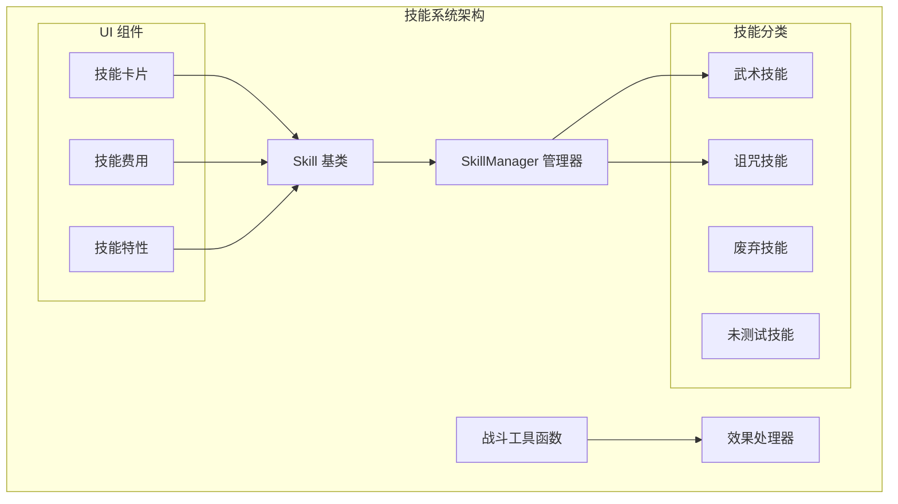
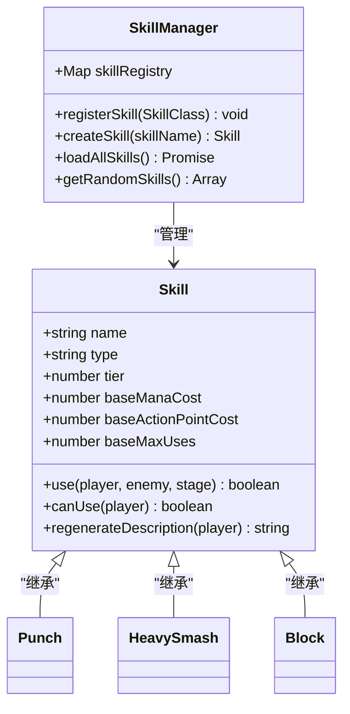
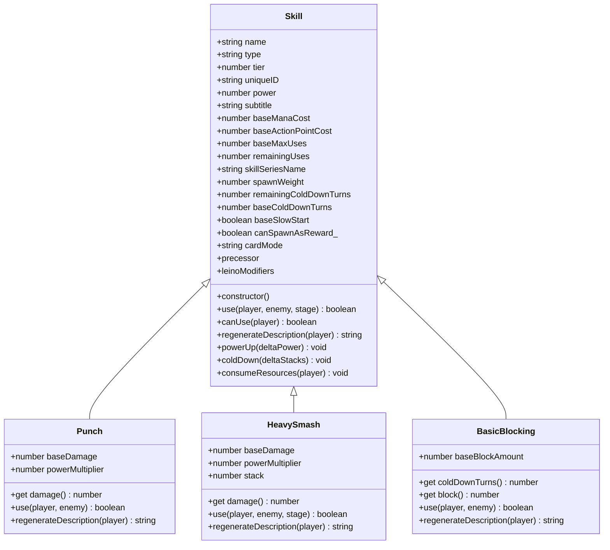
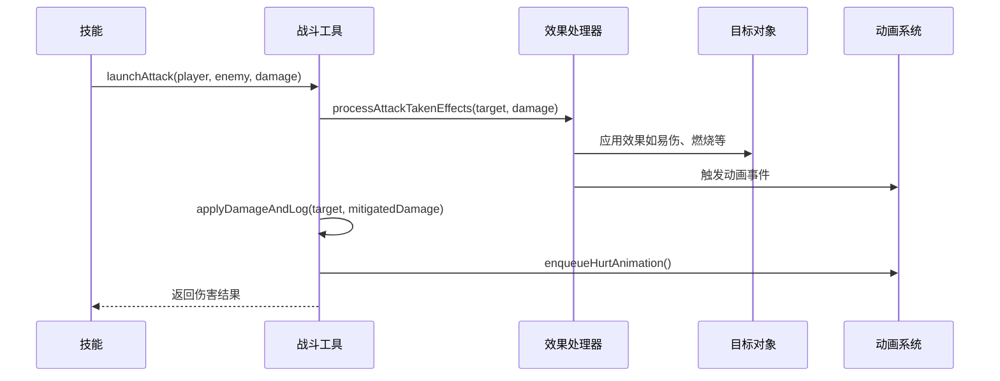
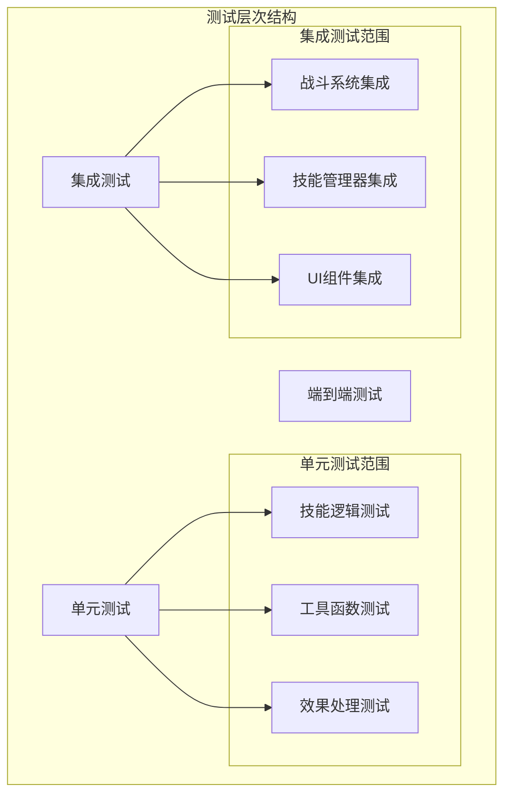

# 新技能开发指南

<cite>
**本文档引用的文件**
- [SKILL_DESIGN_PRINCIPLES.md](file://src/data/skills/SKILL_DESIGN_PRINCIPLES.md)
- [skill.js](file://src/data/skill.js)
- [skillManager.js](file://src/data/skillManager.js)
- [punch.js](file://src/data/skills/martial_arts/punch.js)
- [heavySmash.js](file://src/data/skills/martial_arts/heavySmash.js)
- [block.js](file://src/data/skills/martial_arts/block.js)
- [onePunch.js](file://src/data/skills/martial_arts/onePunch.js)
- [battleUtils.js](file://src/data/battleUtils.js)
- [effectProcessor.js](file://src/data/effectProcessor.js)
- [SkillCard.vue](file://src/components/SkillCard.vue)
- [gameState.js](file://src/data/gameState.js)
- [testSkill.js](file://src/data/testSkill.js)
</cite>

## 目录
1. [简介](#简介)
2. [项目架构概览](#项目架构概览)
3. [技能设计原则](#技能设计原则)
4. [技能注册流程](#技能注册流程)
5. [技能数据结构定义](#技能数据结构定义)
6. [效果处理器集成](#效果处理器集成)
7. [代码模板示例](#代码模板示例)
8. [核心属性配置](#核心属性配置)
9. [技能平衡性设计](#技能平衡性设计)
10. [战斗系统集成测试](#战斗系统集成测试)
11. [调试技巧](#调试技巧)
12. [单元测试和集成测试](#单元测试和集成测试)
13. [最佳实践](#最佳实践)
14. [总结](#总结)

## 简介

本指南详细说明了如何遵循 `SKILL_DESIGN_PRINCIPLES.md` 中的设计原则创建新技能。该项目是一个基于 Vue.js 的卡牌战斗游戏，具有完整的技能系统、战斗逻辑和用户界面。通过本指南，开发者可以掌握技能开发的完整流程，从设计概念到最终部署。

## 项目架构概览



**图表来源**
- [skill.js](file://src/data/skill.js#L1-L50)
- [skillManager.js](file://src/data/skillManager.js#L1-L50)

**章节来源**
- [skill.js](file://src/data/skill.js#L1-L205)
- [skillManager.js](file://src/data/skillManager.js#L1-L253)

## 技能设计原则

根据 `SKILL_DESIGN_PRINCIPLES.md`，技能设计应遵循以下核心原则：

### 系列技能设计
- **比例建议**：系列技能和单卡技能比例为 1:1
- **体系划分**：同类技能内分为 2 个体系，体系内交互紧密
- **精英能力**：获得体系内精英能力后，体系内卡牌有更高概率出现在卡池中

### 灵脉类技能分类
- **火灵脉**：注重爆发和伤害，高蓝耗，高副作用
- **木灵脉**：高贵的罕见恢复能力，叠毒，效果单一
- **空灵脉**：生存和辅助能力极强，攻击手段有限
- **雷灵脉**：伤害和强冷能力强，缺蓝、增益、持续作战能力
- **水灵脉**：依靠特殊状态进行压制、规避和伤害
- **土灵脉**：高伤高防，依靠护盾、反伤进行防御

### 体修体系
- **三个子体系**：过牌、卡序、格挡
- **高卡组构建要求**：若要展现优势强度，对卡组构建要求很高

**章节来源**
- [SKILL_DESIGN_PRINCIPLES.md](file://src/data/skills/SKILL_DESIGN_PRINCIPLES.md#L1-L98)

## 技能注册流程

### 技能管理器架构



**图表来源**
- [skillManager.js](file://src/data/skillManager.js#L1-L50)
- [skill.js](file://src/data/skill.js#L1-L50)

### 注册流程详解

1. **技能类定义**：创建继承自 `Skill` 基类的技能类
2. **动态导入**：通过 `SkillManager.loadAllSkills()` 方法动态加载技能模块
3. **注册到管理器**：使用 `registerSkill()` 方法将技能类注册到技能注册表
4. **实例化**：通过 `createSkill()` 方法创建技能实例

### 技能加载机制

```javascript
// 动态导入所有技能文件
const skillModules = [
  await import('./skills/martial_arts/agilePunch.js'),
  await import('./skills/martial_arts/block.js'),
  // ... 更多技能模块
];

// 遍历模块并注册技能
for (const module of skillModules) {
  for (const [key, SkillClass] of Object.entries(module)) {
    if (typeof SkillClass === 'function' && 
        SkillClass !== Skill && 
        SkillClass.prototype instanceof Skill) {
      skillManager.registerSkill(SkillClass);
    }
  }
}
```

**章节来源**
- [skillManager.js](file://src/data/skillManager.js#L25-L80)

## 技能数据结构定义

### 基础技能类结构



**图表来源**
- [skill.js](file://src/data/skill.js#L1-L100)
- [punch.js](file://src/data/skills/martial_arts/punch.js#L1-L50)
- [heavySmash.js](file://src/data/skills/martial_arts/heavySmash.js#L1-L30)
- [block.js](file://src/data/skills/martial_arts/block.js#L1-L20)

### 核心属性说明

#### 基础属性
- **name**：技能名称，用于识别和显示
- **type**：技能所属灵脉类型，如 'normal'、'fire'、'water' 等
- **tier**：技能等阶，决定技能强度和稀有度
- **uniqueID**：唯一标识符，确保每个技能实例的唯一性

#### 消耗属性
- **baseManaCost**：基础魏启消耗
- **baseActionPointCost**：基础行动点消耗，默认为 1
- **baseMaxUses**：基础最大充能次数，Infinity 表示无需充能

#### 冷却属性
- **baseColdDownTurns**：基础冷却回合数
- **remainingColdDownTurns**：剩余冷却回合数
- **remainingUses**：剩余充能次数

#### 前置条件
- **precessor**：前置技能要求，可以是字符串或数组
- **leinoModifiers**：灵脉修饰符，影响技能生成概率

**章节来源**
- [skill.js](file://src/data/skill.js#L1-L205)

## 效果处理器集成

### 效果处理流程



**图表来源**
- [battleUtils.js](file://src/data/battleUtils.js#L50-L100)
- [effectProcessor.js](file://src/data/effectProcessor.js#L1-L50)

### 效果添加和移除

```javascript
// 统一的效果添加入口
export function addEffect(target, effectName, stacks = 1) {
  if (stacks === 0) return;
  if (target.effects[effectName]) {
    target.effects[effectName] += stacks;
  } else {
    target.effects[effectName] = stacks;
  }
  if(target.type === 'player') {
    backendEventBus.emit(EventNames.Player.EFFECT_CHANGED, { 
      effectName, deltaStacks: stacks 
    });
  }
}

// 统一的效果移除入口
export function removeEffect(target, effectName, stacks = 1) {
  addEffect(target, effectName, -stacks);
}
```

### 战斗结算逻辑

```javascript
// 任意攻击的结算逻辑
export function launchAttack(attacker, target, damage) {
  // 攻击者对攻击的后处理
  let finalDamage = damage + attacker.attack;
  if (attacker) {
    finalDamage = processPostAttackEffects(attacker, target, damage);
  }
  // 处理受到攻击时的效果
  finalDamage = processAttackTakenEffects(target, finalDamage);
  // 固定防御减免
  finalDamage = Math.max(finalDamage - target.defense, 0);

  const result = applyDamageAndLog(target, finalDamage, { 
    mode: 'attack', attacker 
  });

  if (!result.dead) {
    // 发射攻击完成事件
    processAttackFinishEffects(attacker, target, result.hpDamage, result.passThoughDamage);
  }

  return result;
}
```

**章节来源**
- [battleUtils.js](file://src/data/battleUtils.js#L1-L200)
- [effectProcessor.js](file://src/data/effectProcessor.js#L1-L200)

## 代码模板示例

### 基础技能模板

```javascript
// 基础技能模板
import Skill from '../../skill.js';
import { SkillTier } from '../../../utils/tierUtils';

export class BaseSkill extends Skill {
  constructor(name = '基础技能', tier = SkillTier.D, 
              baseDamage = 5, powerMultiplier = 2, 
              apCost = 1, coldDownTurns = 0) {
    super(name, 'normal', tier, 0, apCost, 1, '技能系列');
    this.baseDamage = baseDamage;
    this.powerMultiplier = powerMultiplier;
    this.baseColdDownTurns = coldDownTurns;
  }

  get damage() {
    return Math.max(this.baseDamage + this.powerMultiplier * this.power, 3);
  }

  use(player, enemy, stage) {
    // 实现技能逻辑
    return true;
  }

  regenerateDescription(player) {
    return `造成${this.damage + (player?.attack ?? 0)}点伤害`;
  }
}
```

### 多阶段技能模板

```javascript
// 多阶段技能模板（如重击）
export class MultiStageSkill extends Skill {
  constructor(name = '多阶段技能', tier = SkillTier.C, 
              damage = 8, powerMultiplier = 3, 
              apConsumption = 2, coldDownTurns = 2) {
    super(name, 'normal', tier, 0, apConsumption, 1, '技能系列');
    this.baseColdDownTurns = coldDownTurns;
    this.baseDamage = damage;
    this.powerMultiplier = powerMultiplier;
  }

  get damage() {
    return this.baseDamage + this.powerMultiplier * this.power;
  }

  use(player, enemy, stage) {
    if (stage === 0) {
      // 第一阶段：造成伤害
      const atkPassThroughDamage = launchAttack(player, enemy, this.damage).passThoughDamage;
      return atkPassThroughDamage <= 0;
    } else {
      // 第二阶段：施加效果
      enemy.addEffect('易伤', 2);
      return true;
    }
  }

  regenerateDescription(player) {
    return `造成${this.damage + (player?.attack ?? 0)}点伤害，命中则赋予/effect{易伤}2层`;
  }
}
```

### 慢启动技能模板

```javascript
// 慢启动技能模板（如狠狠一击）
export class SlowStartSkill extends Skill {
  constructor(name = '慢启动技能', tier = SkillTier.B, 
              damage = 18, powerMultiplier = 7, 
              cardActivationColdDown = 0) {
    super(name, 'normal', tier, 0, 2, 1, '技能系列');
    this.baseColdDownTurns = 10; // 基础冷却时间
    this.baseSlowStart = true; // 慢启动
    this.baseDamage = damage;
    this.powerMultiplier = powerMultiplier;
    this.cardActivationColdDown = cardActivationColdDown;
    this.listener_ = null;
  }

  onEnterBattle() {
    super.onEnterBattle();
    if (!this.listener_) {
      this.listener_ = () => {
        for (let i = 0; i < this.cardActivationColdDown; i++) {
          if (this.canColdDown()) {
            this.coldDown();
          }
        }
      };
    }
    backendEventBus.on(EventNames.Player.SKILL_USED, this.listener_);
  }

  onLeaveBattle() {
    super.onLeaveBattle();
    if (this.listener_) {
      backendEventBus.off(EventNames.Player.SKILL_USED, this.listener_);
    }
  }

  use(player, enemy, stage) {
    launchAttack(player, enemy, this.damage);
    return true;
  }

  regenerateDescription(player) {
    return `造成${this.damage + (player?.attack ?? 0)}点伤害`;
  }
}
```

**章节来源**
- [punch.js](file://src/data/skills/martial_arts/punch.js#L1-L89)
- [heavySmash.js](file://src/data/skills/martial_arts/heavySmash.js#L1-L47)
- [onePunch.js](file://src/data/skills/martial_arts/onePunch.js#L1-L89)

## 核心属性配置

### 技能消耗配置

#### 魏启消耗（Mana Cost）
```javascript
// 无魏启消耗
this.baseManaCost = 0;

// 中等魏启消耗
this.baseManaCost = 3;

// 高魏启消耗
this.baseManaCost = 6;
```

#### 行动点消耗（Action Point Cost）
```javascript
// 1点行动点（默认）
this.baseActionPointCost = 1;

// 2点行动点
this.baseActionPointCost = 2;

// 0点行动点（免费技能）
this.baseActionPointCost = 0;
```

### 冷却系统配置

#### 基础冷却设置
```javascript
// 无冷却
this.baseColdDownTurns = 0;

// 1回合冷却
this.baseColdDownTurns = 1;

// 2回合冷却
this.baseColdDownTurns = 2;

// 3回合冷却
this.baseColdDownTurns = 3;
```

#### 慢启动配置
```javascript
// 启用慢启动
this.baseSlowStart = true;

// 禁用慢启动
this.baseSlowStart = false;
```

### 效果链配置

#### 前置技能要求
```javascript
// 自由出现
this.precessor = null;

// 由特定技能升级而来
this.precessor = '基础技能';

// 由技能系列中的任意技能升级而来
this.precessor = ['技能A', '技能B', '技能C'];
```

#### 灵脉修饰符
```javascript
// 单一灵脉修饰
this.leinoModifiers = 'fire';

// 多灵脉修饰
this.leinoModifiers = ['fire', 'lightning'];

// 数组形式
this.leinoModifiers = [
  { threshold: 5, weight: 1.5 }, // 灵脉等级阈值和权重
  { threshold: 3, weight: 1.2 }
];
```

### 充能系统配置

```javascript
// 无限充能
this.baseMaxUses = Infinity;

// 固定充能次数
this.baseMaxUses = 3;

// 1次充能（单次使用）
this.baseMaxUses = 1;
```

**章节来源**
- [punch.js](file://src/data/skills/martial_arts/punch.js#L10-L30)
- [heavySmash.js](file://src/data/skills/martial_arts/heavySmash.js#L5-L20)
- [block.js](file://src/data/skills/martial_arts/block.js#L5-L15)

## 技能平衡性设计

### 平衡性评估维度

#### 1. 输出强度平衡
```javascript
// D级技能（基础输出）
this.baseDamage = 6;
this.powerMultiplier = 2;

// C级技能（中等输出）
this.baseDamage = 10;
this.powerMultiplier = 3;

// B级技能（高输出）
this.baseDamage = 15;
this.powerMultiplier = 4;

// A级技能（顶级输出）
this.baseDamage = 20;
this.powerMultiplier = 5;
```

#### 2. 成本收益平衡
```javascript
// 低消耗高收益
this.baseActionPointCost = 1;
this.baseManaCost = 0;
this.baseColdDownTurns = 1;

// 中等消耗中等收益
this.baseActionPointCost = 2;
this.baseManaCost = 2;
this.baseColdDownTurns = 2;

// 高消耗高收益
this.baseActionPointCost = 3;
this.baseManaCost = 4;
this.baseColdDownTurns = 3;
```

#### 3. 冷却时间平衡
```javascript
// 快速技能（无冷却）
this.baseColdDownTurns = 0;

// 中速技能（1-2回合冷却）
this.baseColdDownTurns = 1;

// 慢速技能（3回合以上冷却）
this.baseColdDownTurns = 3;
```

### 系统性平衡设计

#### 灵脉相性设计
```javascript
// 火灵脉技能
this.type = 'fire';
this.leinoModifiers = 'fire';

// 通用技能
this.type = 'normal';
this.leinoModifiers = null;

// 特殊灵脉技能
this.type = 'water';
this.leinoModifiers = 'water';
```

#### 系列技能平衡
```javascript
// 基础技能
export class BasicSkill extends Skill {
  constructor() {
    super('基础技能', 'normal', SkillTier.D, 0, 1, 1, '技能系列');
  }
}

// 升级技能
export class AdvancedSkill extends BasicSkill {
  constructor() {
    super('高级技能', 'normal', SkillTier.C, 0, 1, 1, '技能系列');
    this.precessor = '基础技能';
  }
}

// 精英技能
export class EliteSkill extends AdvancedSkill {
  constructor() {
    super('精英技能', 'normal', SkillTier.B, 0, 1, 1, '技能系列');
    this.precessor = '高级技能';
  }
}
```

**章节来源**
- [SKILL_DESIGN_PRINCIPLES.md](file://src/data/skills/SKILL_DESIGN_PRINCIPLES.md#L1-L50)

## 战斗系统集成测试

### 测试环境搭建

#### 游戏状态初始化
```javascript
// 创建测试游戏状态
import { createGameState } from './gameState.js';

const testGameState = createGameState();
testGameState.gameStage = 'battle';
testGameState.isEnemyTurn = false;

// 设置玩家和敌人
testGameState.player.hp = 100;
testGameState.enemy.hp = 100;
```

#### 技能实例化测试
```javascript
// 测试技能创建
import SkillManager from './skillManager.js';

async function testSkillCreation() {
  await SkillManager.loadAllSkills();
  const skillManager = SkillManager.getInstance();
  
  // 创建测试技能
  const punch = skillManager.createSkill('拳');
  console.log('技能创建成功:', punch.name);
  console.log('技能描述:', punch.regenerateDescription());
  
  return punch;
}
```

### 战斗流程测试

#### 基础攻击测试
```javascript
// 测试基础攻击
async function testBasicAttack() {
  const punch = await testSkillCreation();
  const result = punch.use(testGameState.player, testGameState.enemy);
  
  console.log('攻击结果:', result);
  console.log('敌人生命值:', testGameState.enemy.hp);
}
```

#### 多阶段技能测试
```javascript
// 测试多阶段技能
async function testMultiStageSkill() {
  const heavySmash = await testSkillCreation();
  // 第一阶段
  const stage1Result = heavySmash.use(testGameState.player, testGameState.enemy, 0);
  console.log('第一阶段结果:', stage1Result);
  
  // 第二阶段
  const stage2Result = heavySmash.use(testGameState.player, testGameState.enemy, 1);
  console.log('第二阶段结果:', stage2Result);
  
  console.log('敌人易伤层数:', testGameState.enemy.effects['易伤']);
}
```

### 效果处理测试

#### 效果添加测试
```javascript
// 测试效果添加
function testEffectApplication() {
  const target = testGameState.enemy;
  
  // 添加易伤效果
  target.addEffect('易伤', 2);
  console.log('添加易伤后:', target.effects['易伤']);
  
  // 添加燃烧效果
  target.addEffect('燃烧', 3);
  console.log('添加燃烧后:', target.effects['燃烧']);
  
  // 移除效果
  target.removeEffect('易伤', 1);
  console.log('移除易伤后:', target.effects['易伤']);
}
```

#### 效果处理流程测试
```javascript
// 测试回合开始效果处理
function testStartOfTurnEffects() {
  const target = testGameState.player;
  
  // 设置初始效果
  target.addEffect('聚气', 2);
  target.addEffect('肌肉记忆', 1);
  
  // 处理回合开始效果
  processStartOfTurnEffects(target);
  
  console.log('回合开始后聚气:', target.effects['聚气']);
  console.log('回合开始后肌肉记忆:', target.effects['肌肉记忆']);
}
```

**章节来源**
- [gameState.js](file://src/data/gameState.js#L1-L75)
- [battleUtils.js](file://src/data/battleUtils.js#L50-L150)
- [effectProcessor.js](file://src/data/effectProcessor.js#L10-L100)

## 调试技巧

### 常见错误诊断

#### 1. 事件绑定失败
```javascript
// 错误示例：忘记正确绑定事件监听器
export class BadSkill extends Skill {
  constructor() {
    super('错误技能', 'normal', SkillTier.D, 0, 1, 1, '技能系列');
    // 缺少正确的事件绑定
    // this.listener_ = null;
  }
  
  onEnterBattle() {
    super.onEnterBattle();
    // 错误：没有检查 listener_ 是否存在
    backendEventBus.on(EventNames.Player.SKILL_USED, this.listener_);
  }
}

// 正确示例
export class GoodSkill extends Skill {
  constructor() {
    super('正确技能', 'normal', SkillTier.D, 0, 1, 1, '技能系列');
    this.listener_ = null;
  }
  
  onEnterBattle() {
    super.onEnterBattle();
    if (!this.listener_) {
      this.listener_ = () => {
        // 事件处理逻辑
      };
    }
    backendEventBus.on(EventNames.Player.SKILL_USED, this.listener_);
  }
  
  onLeaveBattle() {
    super.onLeaveBattle();
    if (this.listener_) {
      backendEventBus.off(EventNames.Player.SKILL_USED, this.listener_);
    }
  }
}
```

#### 2. 状态更新异常
```javascript
// 错误示例：直接修改状态而不触发更新
function badStateUpdate() {
  const skill = testGameState.player.frontierSkills[0];
  skill.power += 1; // 直接修改，可能导致UI不同步
}

// 正确示例：使用提供的方法更新
function goodStateUpdate() {
  const skill = testGameState.player.frontierSkills[0];
  skill.powerUp(1); // 使用方法触发更新
}
```

#### 3. 冷却系统异常
```javascript
// 调试冷却系统的实用函数
function debugCooldownSystem(skill) {
  console.log('技能信息:');
  console.log('- 剩余充能:', skill.remainingUses);
  console.log('- 最大充能:', skill.maxUses);
  console.log('- 剩余冷却回合:', skill.remainingColdDownTurns);
  console.log('- 基础冷却回合:', skill.coldDownTurns);
  console.log('- 是否可冷却:', skill.canColdDown());
  
  // 手动推进冷却
  skill.coldDown();
  console.log('推进冷却后:');
  console.log('- 剩余充能:', skill.remainingUses);
  console.log('- 剩余冷却回合:', skill.remainingColdDownTurns);
}
```

### 调试工具和技巧

#### 1. 技能状态监控
```javascript
// 技能状态监控装饰器
function withSkillMonitoring(target, propertyKey, descriptor) {
  const originalMethod = descriptor.value;
  
  descriptor.value = function(...args) {
    console.log(`[${propertyKey}] 调用前 - 技能状态:`, {
      remainingUses: this.remainingUses,
      remainingColdDownTurns: this.remainingColdDownTurns,
      power: this.power
    });
    
    const result = originalMethod.apply(this, args);
    
    console.log(`[${propertyKey}] 调用后 - 技能状态:`, {
      remainingUses: this.remainingUses,
      remainingColdDownTurns: this.remainingColdDownTurns,
      power: this.power
    });
    
    return result;
  };
  
  return descriptor;
}

// 使用示例
export class MonitoredSkill extends Skill {
  @withSkillMonitoring
  use(player, enemy, stage) {
    // 技能逻辑
    return true;
  }
}
```

#### 2. 战斗日志记录
```javascript
// 战斗日志记录工具
function logBattleEvent(message, data = {}) {
  const timestamp = new Date().toISOString();
  console.log(`[${timestamp}] ${message}`, data);
}

// 在技能中使用
export class LoggingSkill extends Skill {
  use(player, enemy, stage) {
    logBattleEvent('技能使用开始', {
      skillName: this.name,
      playerHP: player.hp,
      enemyHP: enemy.hp
    });
    
    const result = this.performSkillLogic(player, enemy, stage);
    
    logBattleEvent('技能使用结束', {
      skillName: this.name,
      result: result,
      playerHP: player.hp,
      enemyHP: enemy.hp
    });
    
    return result;
  }
}
```

**章节来源**
- [onePunch.js](file://src/data/skills/martial_arts/onePunch.js#L20-L50)
- [skill.js](file://src/data/skill.js#L80-L120)

## 单元测试和集成测试

### 测试框架结构



### 单元测试最佳实践

#### 1. 技能逻辑测试
```javascript
// 技能逻辑测试模板
describe('技能逻辑测试', () => {
  let skill;
  let player;
  let enemy;
  
  beforeEach(() => {
    // 初始化测试环境
    skill = new TestSkill();
    player = createTestPlayer();
    enemy = createTestEnemy();
  });
  
  describe('基础属性测试', () => {
    it('应该正确设置基础属性', () => {
      expect(skill.name).toBe('测试技能');
      expect(skill.tier).toBe(SkillTier.D);
      expect(skill.baseManaCost).toBe(0);
      expect(skill.baseActionPointCost).toBe(1);
    });
  });
  
  describe('使用逻辑测试', () => {
    it('应该返回布尔值表示使用完成', () => {
      const result = skill.use(player, enemy, 0);
      expect(typeof result).toBe('boolean');
    });
    
    it('应该正确消耗资源', () => {
      const initialMana = player.mana;
      const initialAP = player.remainingActionPoints;
      
      skill.use(player, enemy, 0);
      
      expect(player.mana).toBe(initialMana - skill.manaCost);
      expect(player.remainingActionPoints).toBe(initialAP - skill.actionPointCost);
    });
  });
  
  describe('描述生成测试', () => {
    it('应该生成正确的技能描述', () => {
      const description = skill.regenerateDescription(player);
      expect(description).toContain('造成');
    });
  });
});
```

#### 2. 冷却系统测试
```javascript
describe('冷却系统测试', () => {
  let skill;
  
  beforeEach(() => {
    skill = new TestSkill();
  });
  
  describe('冷却推进测试', () => {
    it('应该正确推进冷却进度', () => {
      expect(skill.remainingColdDownTurns).toBe(skill.coldDownTurns);
      expect(skill.remainingUses).toBe(skill.maxUses);
      
      skill.coldDown();
      
      expect(skill.remainingColdDownTurns).toBe(skill.coldDownTurns - 1);
      expect(skill.remainingUses).toBe(skill.maxUses);
    });
    
    it('应该在冷却完成后增加充能', () => {
      // 推进到只剩1回合冷却
      for (let i = 0; i < skill.coldDownTurns - 1; i++) {
        skill.coldDown();
      }
      
      expect(skill.remainingColdDownTurns).toBe(1);
      expect(skill.remainingUses).toBe(skill.maxUses);
      
      // 完成冷却
      skill.coldDown();
      
      expect(skill.remainingColdDownTurns).toBe(skill.coldDownTurns);
      expect(skill.remainingUses).toBe(skill.maxUses - 1);
    });
  });
  
  describe('慢启动技能测试', () => {
    it('应该在启用慢启动时初始充能为0', () => {
      const slowStartSkill = new SlowStartSkill();
      expect(slowStartSkill.remainingUses).toBe(0);
    });
  });
});
```

### 集成测试最佳实践

#### 1. 技能管理器集成测试
```javascript
describe('技能管理器集成测试', () => {
  let skillManager;
  
  beforeEach(async () => {
    skillManager = SkillManager.getInstance();
    await SkillManager.loadAllSkills();
  });
  
  describe('技能注册测试', () => {
    it('应该正确注册所有技能', () => {
      const skillCount = skillManager.skillRegistry.size;
      expect(skillCount).toBeGreaterThan(0);
    });
    
    it('应该能够创建已注册的技能实例', () => {
      const skill = skillManager.createSkill('拳');
      expect(skill).toBeDefined();
      expect(skill.constructor.name).toBe('Punch');
    });
    
    it('应该抛出错误给未知技能', () => {
      expect(() => skillManager.createSkill('不存在的技能')).toThrow();
    });
  });
  
  describe('技能随机生成测试', () => {
    it('应该生成符合玩家等级的技能', () => {
      const player = createTestPlayer();
      player.tier = 3;
      
      const randomSkills = skillManager.getRandomSkills(5, {}, [], player.tier);
      
      randomSkills.forEach(skill => {
        expect(skill.tier).toBeLessThanOrEqual(player.tier);
        expect(skill.tier).toBeGreaterThanOrEqual(0);
      });
    });
  });
});
```

#### 2. 战斗系统集成测试
```javascript
describe('战斗系统集成测试', () => {
  let gameState;
  
  beforeEach(() => {
    gameState = createGameState();
    gameState.gameStage = 'battle';
    gameState.isEnemyTurn = false;
  });
  
  describe('完整战斗流程测试', () => {
    it('应该正确执行完整的战斗回合', async () => {
      const punch = new Punch();
      const enemy = new Enemy('测试敌人', 100, 10, 5);
      
      gameState.player.hp = 100;
      gameState.enemy = enemy;
      
      // 玩家回合
      const useResult = punch.use(gameState.player, gameState.enemy, 0);
      expect(useResult).toBe(true);
      
      // 检查伤害计算
      expect(gameState.enemy.hp).toBeLessThan(100);
      
      // 切换到敌人回合
      gameState.isEnemyTurn = true;
      
      // 敌人攻击
      const enemyAttack = launchAttack(gameState.enemy, gameState.player, 10);
      expect(enemyAttack.dead).toBe(false);
      expect(gameState.player.hp).toBeLessThan(100);
    });
  });
  
  describe('效果处理集成测试', () => {
    it('应该正确处理多个回合的效果', () => {
      const burningSkill = new BurningSkill();
      const enemy = new Enemy('燃烧敌人', 100, 10, 5);
      
      gameState.enemy = enemy;
      
      // 施加燃烧效果
      burningSkill.use(gameState.player, gameState.enemy, 0);
      
      // 模拟多个回合
      for (let i = 0; i < 3; i++) {
        processStartOfTurnEffects(gameState.enemy);
        expect(gameState.enemy.hp).toBeLessThan(100);
      }
    });
  });
});
```

### 测试工具和辅助函数

#### 1. 测试数据工厂
```javascript
// 测试数据工厂函数
function createTestPlayer() {
  return {
    mana: 10,
    remainingActionPoints: 3,
    maxHandSize: 5,
    frontierSkills: [],
    backupSkills: [],
    consumeMana(amount) { this.mana -= amount; },
    consumeActionPoints(amount) { this.remainingActionPoints -= amount; },
    addEffect(effectName, stacks) { /* 实现 */ },
    removeEffect(effectName, stacks) { /* 实现 */ }
  };
}

function createTestEnemy() {
  return {
    hp: 100,
    maxHp: 100,
    shield: 0,
    effects: {},
    addEffect(effectName, stacks) { /* 实现 */ },
    removeEffect(effectName, stacks) { /* 实现 */ }
  };
}
```

#### 2. 测试断言工具
```javascript
// 自定义测试断言
function expectSkillToBeUsable(skill, player) {
  expect(skill.canUse(player)).toBe(true);
  expect(skill.manaCost).toBeLessThanOrEqual(player.mana);
  expect(skill.actionPointCost).toBeLessThanOrEqual(player.remainingActionPoints);
}

function expectSkillToHaveCorrectDescription(skill, player) {
  const description = skill.regenerateDescription(player);
  expect(typeof description).toBe('string');
  expect(description.length).toBeGreaterThan(0);
  expect(description).toContain('造成');
}
```

**章节来源**
- [testSkill.js](file://src/data/testSkill.js#L1-L23)
- [skillManager.js](file://src/data/skillManager.js#L100-L200)

## 最佳实践

### 1. 设计原则遵循

#### 系列技能设计
```javascript
// 符合系列技能设计原则的示例
export class MartialArtSeries {
  // 基础技能
  static BasicPunch = class BasicPunch extends Skill {
    constructor() {
      super('基础拳', 'normal', SkillTier.D, 0, 1, Infinity, '武术系列');
    }
  };
  
  // 升级技能
  static AdvancedPunch = class AdvancedPunch extends MartialArtSeries.BasicPunch {
    constructor() {
      super('高级拳', 'normal', SkillTier.C, 0, 1, Infinity, '武术系列');
      this.precessor = '基础拳';
    }
  };
  
  // 精英技能
  static ElitePunch = class ElitePunch extends MartialArtSeries.AdvancedPunch {
    constructor() {
      super('精英拳', 'normal', SkillTier.B, 0, 1, Infinity, '武术系列');
      this.precessor = '高级拳';
    }
  };
}
```

#### 灵脉相性优化
```javascript
// 优化灵脉相性的技能设计
export class FireMartialArt extends Skill {
  constructor() {
    super('火焰拳', 'fire', SkillTier.C_PLUS, 2, 1, 1, '火焰系列');
    this.leinoModifiers = 'fire'; // 强化火灵脉效果
  }
  
  use(player, enemy, stage) {
    const result = launchAttack(player, enemy, this.damage);
    
    // 添加火灵脉特有的效果
    if (result.passThoughDamage > 0) {
      enemy.addEffect('燃烧', 1);
    }
    
    return true;
  }
}
```

### 2. 性能优化

#### 技能实例化优化
```javascript
// 使用单例模式优化频繁创建的技能
class OptimizedSkillManager extends SkillManager {
  constructor() {
    super();
    this.skillCache = new Map();
  }
  
  createSkill(skillName) {
    if (this.skillCache.has(skillName)) {
      return this.skillCache.get(skillName);
    }
    
    const skill = super.createSkill(skillName);
    this.skillCache.set(skillName, skill);
    return skill;
  }
}
```

#### 冷却系统优化
```javascript
// 批量处理冷却的优化
class BatchCoolDownManager {
  constructor() {
    this.batchQueue = [];
    this.processing = false;
  }
  
  addToBatch(skill) {
    this.batchQueue.push(skill);
    
    if (!this.processing) {
      this.processBatch();
    }
  }
  
  async processBatch() {
    this.processing = true;
    
    while (this.batchQueue.length > 0) {
      const batch = this.batchQueue.splice(0, 10); // 每批处理10个技能
      batch.forEach(skill => skill.coldDown());
      
      // 等待帧间隔
      await new Promise(resolve => requestAnimationFrame(resolve));
    }
    
    this.processing = false;
  }
}
```

### 3. 可维护性设计

#### 插件化技能系统
```javascript
// 插件化技能系统架构
class PluginSkillSystem {
  constructor() {
    this.plugins = [];
    this.skillRegistry = new Map();
  }
  
  registerPlugin(plugin) {
    this.plugins.push(plugin);
    plugin.init(this);
  }
  
  registerSkill(skillClass) {
    const skillName = (new skillClass()).name;
    this.skillRegistry.set(skillName, skillClass);
    
    // 触发插件通知
    this.plugins.forEach(plugin => {
      if (plugin.onSkillRegistered) {
        plugin.onSkillRegistered(skillClass);
      }
    });
  }
}
```

#### 配置驱动的技能设计
```javascript
// 配置驱动的技能设计
const skillConfigurations = {
  punch: {
    name: '拳',
    type: 'normal',
    tier: SkillTier.D,
    baseDamage: 6,
    powerMultiplier: 2,
    apCost: 1,
    coldDownTurns: 0
  },
  
  heavySmash: {
    name: '重击',
    type: 'normal',
    tier: SkillTier.D,
    baseDamage: 4,
    powerMultiplier: 2,
    apCost: 2,
    coldDownTurns: 2,
    stack: 2
  }
};

function createSkillFromConfig(config) {
  return new class extends Skill {
    constructor() {
      super(
        config.name,
        config.type,
        config.tier,
        0,
        config.apCost,
        Infinity,
        config.series || config.name
      );
      
      Object.assign(this, config);
    }
    
    get damage() {
      return Math.max(this.baseDamage + this.powerMultiplier * this.power, 3);
    }
    
    use(player, enemy, stage) {
      // 根据配置实现不同的使用逻辑
      if (this.name === '重击') {
        return this.multiStageUse(player, enemy, stage);
      }
      
      return launchAttack(player, enemy, this.damage);
    }
  }();
}
```

### 4. 用户体验优化

#### 技能预览系统
```javascript
// 技能预览系统
class SkillPreviewSystem {
  constructor() {
    this.previewCache = new Map();
  }
  
  getSkillPreview(skillName, player) {
    if (this.previewCache.has(skillName)) {
      return this.previewCache.get(skillName);
    }
    
    const skill = SkillManager.getInstance().createSkill(skillName);
    const preview = {
      name: skill.name,
      description: skill.regenerateDescription(player),
      tier: skill.tier,
      manaCost: skill.manaCost,
      apCost: skill.actionPointCost,
      cooldown: skill.coldDownTurns,
      usable: skill.canUse(player)
    };
    
    this.previewCache.set(skillName, preview);
    return preview;
  }
  
  clearCache() {
    this.previewCache.clear();
  }
}
```

#### 技能推荐系统
```javascript
// 基于玩家状态的技能推荐
class SkillRecommendationSystem {
  constructor() {
    this.recommendationRules = [];
  }
  
  addRule(rule) {
    this.recommendationRules.push(rule);
  }
  
  recommendSkills(player, availableSkills) {
    return availableSkills.filter(skill => {
      return this.recommendationRules.every(rule => 
        rule.shouldRecommend(skill, player)
      );
    });
  }
}

// 示例规则：根据玩家状态推荐合适的技能
const healthCriticalRule = {
  shouldRecommend(skill, player) {
    if (player.hp / player.maxHp < 0.3) {
      // 生命值低时推荐治疗技能
      return skill.name.includes('治疗') || skill.name.includes('恢复');
    }
    return true;
  }
};
```

## 总结

本指南全面介绍了新技能开发的完整流程，从基础概念到高级应用。通过遵循这些原则和最佳实践，开发者可以创建出平衡、有趣且易于维护的技能系统。

### 关键要点回顾

1. **设计原则**：严格遵循系列技能设计、灵脉相性和平衡性原则
2. **技术实现**：正确使用技能基类、冷却系统和效果处理器
3. **测试策略**：实施多层次的测试策略，包括单元测试和集成测试
4. **性能优化**：采用缓存、批量处理等技术优化性能
5. **用户体验**：提供技能预览和推荐功能提升用户体验

### 开发建议

- **循序渐进**：从简单的基础技能开始，逐步增加复杂性
- **测试先行**：编写测试用例来验证技能行为
- **持续重构**：随着项目发展不断优化技能系统架构
- **社区参与**：积极参与技能设计讨论，分享经验和最佳实践

通过遵循本指南的建议，开发者可以创建出高质量、平衡且有趣的技能系统，为玩家提供丰富的游戏体验。