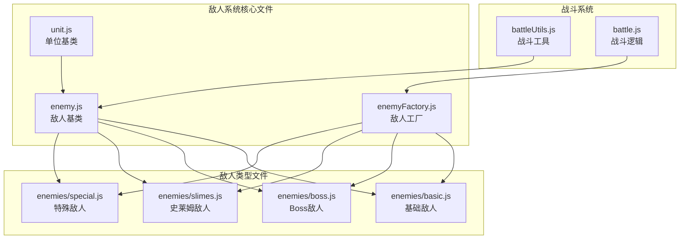
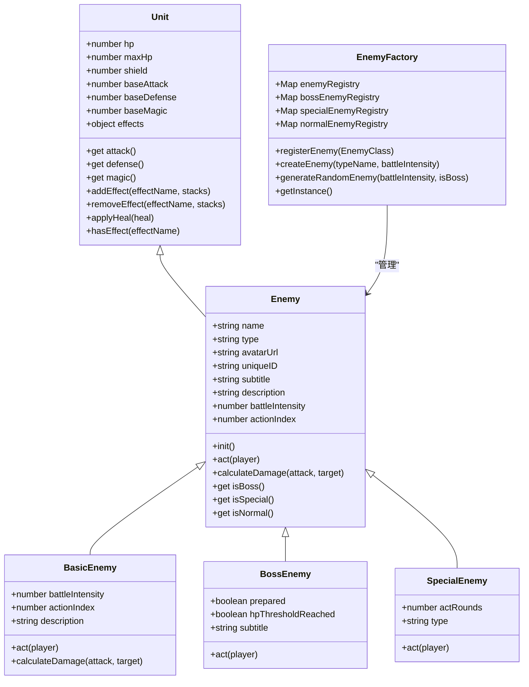
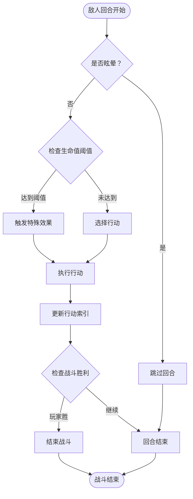

# 新敌人开发指南

<cite>
**本文档中引用的文件**
- [enemyFactory.js](file://src/data/enemyFactory.js)
- [enemy.js](file://src/data/enemy.js)
- [unit.js](file://src/data/unit.js)
- [basic.js](file://src/data/enemies/basic.js)
- [boss.js](file://src/data/enemies/boss.js)
- [slimes.js](file://src/data/enemies/slimes.js)
- [special.js](file://src/data/enemies/special.js)
- [battleUtils.js](file://src/data/battleUtils.js)
- [battle.js](file://src/data/battle.js)
</cite>

## 目录
1. [简介](#简介)
2. [项目结构概览](#项目结构概览)
3. [敌人系统架构](#敌人系统架构)
4. [敌人数据模型](#敌人数据模型)
5. [敌人类型分类](#敌人类型分类)
6. [基础敌人开发](#基础敌人开发)
7. [Boss敌人开发](#boss敌人开发)
8. [特殊敌人开发](#特殊敌人开发)
9. [敌人注册机制](#敌人注册机制)
10. [AI行为模式](#ai行为模式)
11. [战斗系统集成](#战斗系统集成)
12. [状态效果系统](#状态效果系统)
13. [性能优化建议](#性能优化建议)
14. [最佳实践](#最佳实践)
15. [故障排除](#故障排除)

## 简介

本指南详细介绍了如何在Wekyspire游戏中开发新的敌人类型。敌人系统采用工厂模式设计，支持三种主要敌人类型：普通敌人、Boss敌人和特殊敌人。每种类型都有其独特的属性配置、AI行为模式和战斗交互机制。

## 项目结构概览



**图表来源**
- [enemyFactory.js](file://src/data/enemyFactory.js#L1-L88)
- [enemy.js](file://src/data/enemy.js#L1-L44)
- [unit.js](file://src/data/unit.js#L1-L143)

## 敌人系统架构

敌人系统采用分层架构设计，确保代码的可维护性和扩展性：



**图表来源**
- [unit.js](file://src/data/unit.js#L1-L143)
- [enemy.js](file://src/data/enemy.js#L1-L44)
- [enemyFactory.js](file://src/data/enemyFactory.js#L1-L88)

**章节来源**
- [enemyFactory.js](file://src/data/enemyFactory.js#L1-L88)
- [enemy.js](file://src/data/enemy.js#L1-L44)
- [unit.js](file://src/data/unit.js#L1-L143)

## 敌人数据模型

### 基础属性配置

每个敌人实例都继承自`Unit`类，具有以下核心属性：

```javascript
// 基础属性
this.name = name;           // 敌人名称
this.hp = hp;              // 当前生命值
this.maxHp = hp;           // 最大生命值
this.shield = 0;           // 当前护盾
this.baseAttack = attack;  // 基础攻击力
this.baseDefense = defense; // 基础防御力
this.baseMagic = 0;        // 基础灵能强度

// 敌人特有属性
this.type = 'normal';      // normal / special / boss
this.avatarUrl = avatarUrl; // 敌人头像URL
this.uniqueID = Math.random().toString(36).substring(2, 10);
```

### 属性计算机制

敌人系统实现了动态属性计算机制，允许根据状态效果实时调整属性值：

```javascript
// 动态属性getter
get attack() {
  return this.baseAttack + (this.effects['力量'] || 0);
}

get defense() {
  return this.baseDefense + (this.effects['坚固'] || 0);
}

get magic() {
  return this.baseMagic + (this.effects['集中'] || 0);
}
```

**章节来源**
- [enemy.js](file://src/data/enemy.js#L1-L44)
- [unit.js](file://src/data/unit.js#L1-L143)

## 敌人类型分类

### 普通敌人（Normal）

普通敌人是最基础的敌人类型，具有简单的AI行为和固定的属性配置。

**特点：**
- 类型标识：`type = 'normal'`
- 生成权重较高
- AI行为简单直接
- 适合早期关卡

### Boss敌人（Boss）

Boss敌人具有复杂的AI行为、生命值阈值机制和特殊的战斗阶段。

**特点：**
- 类型标识：`type = 'boss'`
- 包含生命值阈值检测
- 分阶段战斗行为
- 强大的初始能力

### 特殊敌人（Special）

特殊敌人具有精英特性，通常拥有额外的防御或特殊能力。

**特点：**
- 类型标识：`type = 'special'`
- 默认带有5层格挡效果
- 生成概率较低（30%）
- 适合中期挑战

**章节来源**
- [enemy.js](file://src/data/enemy.js#L20-L35)
- [basic.js](file://src/data/enemies/basic.js#L1-L50)
- [boss.js](file://src/data/enemies/boss.js#L1-L50)
- [special.js](file://src/data/enemies/special.js#L1-L50)

## 基础敌人开发

### 开发步骤

1. **创建敌人类**：继承自`Enemy`基类
2. **实现构造函数**：设置基础属性和战斗强度
3. **定义AI行为**：实现`act()`方法
4. **配置属性计算**：实现`calculateDamage()`方法
5. **注册敌人**：在`enemyFactory.js`中注册

### 实例分析：史莱姆敌人

```javascript
export class Slime extends Enemy {
  constructor(battleIntensity) {
    const hp = 27 + Math.floor(6 * battleIntensity);
    const attack = 3 + Math.floor(battleIntensity * 0.6);
    super('史莱姆', hp, attack, 1, 
      new URL('../../assets/enemies/slime.png', import.meta.url).href
    );
    this.battleIntensity = battleIntensity;
    this.actionIndex = 0;
    this.description = "一只史莱姆，很可爱捏。";
  }

  calculateDamage(attack, target) {
    return Math.max(1, attack);
  }

  act(player) {
    const actions = [
      () => {
        addEnemyActionLog(`${this.name} 冲撞！`);
        const damage = this.calculateDamage(this.attack, player);
        launchAttack(this, player, damage);
      },
      () => {
        addEnemyActionLog(`${this.name} 强力冲撞！`);
        const damage = this.calculateDamage(2 * this.attack, player);
        launchAttack(this, player, damage);
      },
      () => {
        const shieldAmount = 2 + this.magic;
        gainShield(this, this, shieldAmount);
        addEnemyActionLog(`${this.name} 进入防御状态，获得了 ${shieldAmount} 点护盾！`);
      }
    ];
    
    const action = actions[this.actionIndex % actions.length];
    this.actionIndex++;
    action();
  }
}
```

### 关键开发要点

1. **属性计算公式**：
   ```javascript
   const hp = baseHP + Math.floor(scaleFactor * battleIntensity);
   const attack = baseAttack + Math.floor(battleIntensity * multiplier);
   ```

2. **AI行为序列**：
   - 使用数组存储多个行动选项
   - 通过`actionIndex`控制循环
   - 每回合执行不同的行动

3. **战斗日志记录**：
   - 使用`addEnemyActionLog()`记录行动
   - 提供清晰的视觉反馈

**章节来源**
- [basic.js](file://src/data/enemies/basic.js#L1-L199)

## Boss敌人开发

### Boss特性配置

Boss敌人需要额外的配置来支持复杂的战斗机制：

```javascript
export class MEFM3 extends Enemy {
  constructor(battleIntensity) {
    const hp = 25 + 11 * battleIntensity;
    const attack = Math.round((3 + battleIntensity) * 0.4);
    super(
      'MEFM-3', hp, attack, 1 + Math.floor(battleIntensity / 5), 0,
      new URL('../assets/enemies/slime.png', import.meta.url).href
    );
    this.type = 'boss';
    this.battleIntensity = battleIntensity;
    this.actionIndex = 0;
    this.prepared = false;
    this.hpThresholdReached = false;
    this.subtitle = "嗡鸣的古代机械";
    this.description = "冷冰冰的钢铁包不住炙热的心，现在——它要燃起来了！\n 第一次生命值低于50%时，眩晕1回合。";
  }
}
```

### 生命值阈值机制

Boss敌人可以实现生命值阈值检测，在特定生命值时触发特殊效果：

```javascript
// 检查是否达到生命值阈值
if (!this.hpThresholdReached && this.hp < this.maxHp * 0.5) {
  this.hpThresholdReached = true;
  addEnemyActionLog(`${this.name} 承受了太多伤害，陷入了故障状态！`);
  this.addEffect('眩晕', 1);
  return;
}
```

### 分阶段战斗行为

Boss敌人可以实现多阶段战斗，每个阶段有不同的行为模式：

```javascript
// 准备阶段
if (!this.prepared) {
  this.prepared = true;
  this.addEffect('高燃弹药', 1);
  addEnemyActionLog(`${this.name} 完成了弹药装载，要来了！`);
  return;
}

// 正常行动序列
const actions = [
  () => {
    addEnemyActionLog(`${this.name} 使用射流机枪扫射！`);
    const times = 2 + (this.effects['机枪升温'] || 0);
    const damage = 1 + this.attack;
    for(let i = 0; i < times; i++) {
      launchAttack(this, player, damage);
      enqueueDelay(800);
    }
  },
  // ...其他行动
];
```

**章节来源**
- [boss.js](file://src/data/enemies/boss.js#L1-L154)

## 特殊敌人开发

### 精英特性配置

特殊敌人具有精英特性，通常带有额外的防御能力：

```javascript
export class BigWolf extends Enemy {
  constructor(battleIntensity) {
    const hp = 40 + 7 * battleIntensity;
    const attack = Math.round(2 + 0.6 * battleIntensity);
    super('雪狼', hp, attack, Math.floor(battleIntensity / 5), 0);
    this.actionIndex = 0;
    this.actRounds = 0;
    this.description = "一只狼，没有什么特别的能力，但似乎过于巨大。";
    this.type = 'special';
    this.addEffect('格挡', 5);
  }
}
```

### 回合计数机制

特殊敌人可以使用回合计数来实现特定的战斗策略：

```javascript
act(player) {
  this.actRounds += 1;
  
  // 在第二回合为玩家增加虚弱效果
  if (this.actRounds === 2) {
    addEnemyActionLog(`${this.name} 发出一声怒吼，你双腿战战几欲跌倒！`);
    player.addEffect('虚弱', 2);
    return ;
  }
  
  // 正常行动序列
  const actions = [
    // ...行动逻辑
  ];
  
  const action = actions[this.actionIndex % actions.length];
  action();
  this.actionIndex++;
}
```

**章节来源**
- [special.js](file://src/data/enemies/special.js#L1-L52)

## 敌人注册机制

### 工厂模式实现

`EnemyFactory`类负责管理所有敌人类型的注册和创建：

```javascript
class EnemyFactory {
  constructor() {
    this.enemyRegistry = new Map();
    this.bossEnemyRegistry = new Map();
    this.specialEnemyRegistry = new Map();
    this.normalEnemyRegistry = new Map();
    
    // 初始化时注册预定义敌人
    this.registerEnemy(Slime);
    this.registerEnemy(Remi);
    this.registerEnemy(FireSlime);
    this.registerEnemy(BigWolf);
    this.registerEnemy(MEFM3);
    this.registerEnemy(Karmura);
  }
  
  registerEnemy(EnemyClass) {
    const enemySample = new EnemyClass(1);
    this.enemyRegistry.set(enemySample.name, EnemyClass);
    if(enemySample.isBoss) this.bossEnemyRegistry.set(enemySample.name, EnemyClass);
    if(enemySample.isSpecial) this.specialEnemyRegistry.set(enemySample.name, EnemyClass);
    if(enemySample.isNormal) this.normalEnemyRegistry.set(enemySample.name, EnemyClass);
  }
}
```

### 随机生成机制

工厂类提供了智能的随机敌人生成机制：

```javascript
static generateRandomEnemy(battleIntensity, isBoss = false) {
  if (isBoss) {
    const instance = this.getInstance();
    const bossEnemies = Array.from(instance.bossEnemyRegistry.keys());
    const randomType = bossEnemies[Math.floor(Math.random() * bossEnemies.length)];
    const enemy = this.createEnemy(randomType, battleIntensity);
    enemy.init();
    return enemy;
  }
  
  // 随机选择普通敌人 / 特殊敌人
  const instance = this.getInstance();
  const roll = Math.random();
  if(roll < 0.3 && battleIntensity > 4) {
    const specialEnemies = Array.from(instance.specialEnemyRegistry.keys());
    const randomType = specialEnemies[Math.floor(Math.random() * specialEnemies.length)];
    const enemy = this.createEnemy(randomType, battleIntensity);
    enemy.init();
    return enemy;
  } else {
    const normalEnemies = Array.from(instance.normalEnemyRegistry.keys());
    const randomType = normalEnemies[Math.floor(Math.random() * normalEnemies.length)];
    const enemy = this.createEnemy(randomType, battleIntensity);
    enemy.init();
    return enemy;
  }
}
```

**章节来源**
- [enemyFactory.js](file://src/data/enemyFactory.js#L1-L88)

## AI行为模式

### 行动序列设计

敌人AI的核心是设计合理的行动序列，确保战斗的平衡性和趣味性：



**图表来源**
- [basic.js](file://src/data/enemies/basic.js#L40-L80)
- [boss.js](file://src/data/enemies/boss.js#L20-L60)

### 行动优先级

设计合理的行动优先级可以提升战斗策略性：

1. **攻击行动**：造成直接伤害
2. **防御行动**：获得护盾或增益效果
3. **控制行动**：施加负面效果
4. **恢复行动**：自我治疗或回复

### 延迟和动画控制

使用`enqueueDelay()`控制行动之间的间隔：

```javascript
act(player) {
  addEnemyActionLog(`${this.name} 连续撕咬。`);
  const times = 2 + ((Math.random() > 0.5) ? 1 : 0);
  const damage = 1 + Math.floor(this.attack / 2);
  
  for(var i = 0; i < times; i++) {
    launchAttack(this, player, damage);
    enqueueDelay(1200); // 添加延时
  }
}
```

**章节来源**
- [special.js](file://src/data/enemies/special.js#L30-L50)

## 战斗系统集成

### 战斗工具集成

敌人系统与战斗工具紧密集成，使用统一的战斗接口：

```javascript
// 攻击结算
const damage = this.calculateDamage(this.attack, player);
launchAttack(this, player, damage);

// 治疗结算
const shieldAmount = 2 + this.magic;
gainShield(this, this, shieldAmount);

// 效果添加
this.addEffect('闪避', 1);
```

### 战斗日志系统

敌人行动会自动记录到战斗日志中：

```javascript
// 自动添加战斗日志
addEnemyActionLog(`${this.name} 冲撞！`);
addEnemyActionLog(`${this.name} 进入防御状态，获得了 ${shieldAmount} 点护盾！`);
```

### 动画系统集成

敌人行动与动画系统无缝集成：

```javascript
// 添加延时动画
enqueueDelay(800);

// 添加战斗动画
try { enqueueUnitDeath({ unitId: target.uniqueID }); } catch (_) {}
```

**章节来源**
- [battleUtils.js](file://src/data/battleUtils.js#L1-L365)
- [battle.js](file://src/data/battle.js#L1-L552)

## 状态效果系统

### 效果管理系统

敌人可以添加、移除和查询各种状态效果：

```javascript
// 添加效果
this.addEffect('力量', 3);
this.addEffect('闪避', 1);
this.addEffect('燃烧', 4);

// 移除效果
this.removeEffect('力量', 1);
this.removeEffect('闪避');

// 查询效果
if (this.hasEffect('眩晕')) {
  addEnemyActionLog(`${this.name} 被眩晕，跳过回合！`);
  return;
}

// 清理效果
this.clearEffects('debuff');
this.removeNegativeEffects(2);
```

### 效果类型分类

系统支持多种效果类型：

1. **增益效果（Buff）**：力量、坚固、集中
2. **减益效果（Debuff）**：虚弱、燃烧、眩晕
3. **中立效果（Neutral）**：闪避、格挡

### 效果移除策略

提供多种效果移除策略：

```javascript
// 随机移除
this.removeEffects(1, 'random');

// 优先移除层数最多的
this.removeEffects(1, 'highest-stack');

// 以种类为单位移除
this.removeEffects(1, 'highest-stack-kind', 'debuff');
```

**章节来源**
- [unit.js](file://src/data/unit.js#L40-L143)
- [battleUtils.js](file://src/data/battleUtils.js#L100-L150)

## 性能优化建议

### 对象池使用

对于频繁创建的敌人实例，考虑使用对象池模式：

```javascript
class EnemyPool {
  constructor(EnemyClass, initialSize = 10) {
    this.pool = [];
    this.EnemyClass = EnemyClass;
    
    // 预创建对象
    for (let i = 0; i < initialSize; i++) {
      this.pool.push(new this.EnemyClass(1));
    }
  }
  
  acquire(battleIntensity) {
    let enemy = this.pool.pop();
    if (!enemy) {
      enemy = new this.EnemyClass(battleIntensity);
    } else {
      // 重置状态
      enemy.reset(battleIntensity);
    }
    return enemy;
  }
  
  release(enemy) {
    // 清理状态
    enemy.clearEffects();
    this.pool.push(enemy);
  }
}
```

### AI计算开销控制

1. **减少不必要的计算**：
   ```javascript
   // 避免重复计算
   const calculatedDamage = this.calculateDamage(this.attack, player);
   launchAttack(this, player, calculatedDamage);
   ```

2. **使用缓存机制**：
   ```javascript
   // 缓存计算结果
   if (!this.cachedAttack) {
     this.cachedAttack = this.calculateDamage(this.attack, player);
   }
   launchAttack(this, player, this.cachedAttack);
   ```

3. **限制复杂计算**：
   ```javascript
   // 使用简化版本
   calculateDamage(attack, target) {
     return Math.max(1, attack);
   }
   ```

### 内存管理

1. **及时清理效果**：
   ```javascript
   // 战斗结束后清理
   battleVictory(isVictory) {
     this.effects = {};
     this.shield = 0;
   }
   ```

2. **避免内存泄漏**：
   ```javascript
   // 清理事件监听器
   cleanup() {
     this.effects = null;
     this.actions = null;
   }
   ```

## 最佳实践

### 文件组织规范

1. **目录结构**：
   ```
   src/data/enemies/
   ├── README.md          # 敌人开发指南
   ├── basic.js           # 基础敌人
   ├── boss.js            # Boss敌人
   ├── slimes.js          # 史莱姆敌人
   └── special.js         # 特殊敌人
   ```

2. **命名规范**：
   - 文件名：小写字母，使用下划线分隔
   - 类名：大驼峰命名法
   - 方法名：小驼峰命名法

3. **导出规范**：
   ```javascript
   // 导出多个敌人
   export { FireSlime, IceSlime, EarthSlime };
   
   // 或者单独导出
   export class FireSlime extends Enemy { ... }
   ```

### 代码质量

1. **注释规范**：
   ```javascript
   /**
    * 火史莱姆敌人
    * @param {number} battleIntensity - 战斗强度
    */
   class FireSlime extends Enemy {
     constructor(battleIntensity) {
       // 构造函数实现
     }
   }
   ```

2. **错误处理**：
   ```javascript
   act(player) {
     try {
       // 主要逻辑
     } catch (error) {
       console.error(`敌人行动失败: ${error.message}`);
       // 提供默认行为
     }
   }
   ```

3. **测试覆盖**：
   ```javascript
   // 测试基本属性
   test('FireSlime should have correct base stats', () => {
     const slime = new FireSlime(5);
     expect(slime.hp).toBeGreaterThan(0);
     expect(slime.attack).toBeGreaterThan(0);
   });
   ```

### 设计原则

1. **单一职责**：每个敌人类只负责一种敌人类型
2. **开放封闭**：通过继承扩展功能，不修改现有代码
3. **依赖倒置**：依赖抽象而非具体实现

## 故障排除

### 常见问题

1. **敌人无法生成**
   - 检查是否正确注册到工厂
   - 验证构造函数参数
   - 确认战斗强度计算

2. **AI行为异常**
   - 检查行动序列逻辑
   - 验证索引计算
   - 确认条件判断

3. **战斗系统集成问题**
   - 检查战斗工具调用
   - 验证动画指令
   - 确认事件触发

### 调试技巧

1. **日志记录**：
   ```javascript
   act(player) {
     console.log(`[${this.name}] 行动开始，索引: ${this.actionIndex}`);
     // 行动逻辑
     console.log(`[${this.name}] 行动结束`);
   }
   ```

2. **状态检查**：
   ```javascript
   act(player) {
     console.log(`状态检查: HP=${this.hp}, Shield=${this.shield}, Effects=${JSON.stringify(this.effects)}`);
     // 行动逻辑
   }
   ```

3. **性能监控**：
   ```javascript
   act(player) {
     const startTime = performance.now();
     // 行动逻辑
     const endTime = performance.now();
     console.log(`行动耗时: ${endTime - startTime}ms`);
   }
   ```

### 性能分析

1. **内存使用**：
   - 监控敌人实例数量
   - 检查效果对象大小
   - 分析垃圾回收频率

2. **CPU使用**：
   - 分析AI计算时间
   - 监控动画帧率
   - 评估渲染性能

3. **网络请求**：
   - 检查资源加载时间
   - 监控图片缓存命中率
   - 优化资源压缩

通过遵循本指南的最佳实践和注意事项，开发者可以高效地创建高质量的敌人类型，为玩家提供丰富多样的战斗体验。记住始终进行充分的测试和性能优化，确保新敌人能够无缝融入游戏系统。