# 新能力开发指南

<cite>
**本文档引用文件**  
- [abilityManager.js](file://src/data/abilityManager.js)
- [ability.js](file://src/data/ability.js)
- [player.js](file://src/data/player.js)
- [skill.js](file://src/data/skill.js)
- [effectProcessor.js](file://src/data/effectProcessor.js)
- [backendEventBus.js](file://src/backendEventBus.js)
- [basic.js](file://src/data/abilities/basic.js)
- [block.js](file://src/data/skills/martial_arts/block.js)
- [AbilityRewardPanel.vue](file://src/components/rest/AbilityRewardPanel.vue)
- [gameState.js](file://src/data/gameState.js)
</cite>

## 目录
1. [简介](#简介)
2. [项目结构](#项目结构)
3. [核心组件](#核心组件)
4. [架构概述](#架构概述)
5. [详细组件分析](#详细组件分析)
6. [依赖分析](#依赖分析)
7. [性能考虑](#性能考虑)
8. [故障排除指南](#故障排除指南)
9. [结论](#结论)

## 简介
本文档详细说明了如何在游戏系统中开发和注册新能力（Ability），并解释了能力与玩家属性、技能系统的联动机制。文档涵盖了能力效果的实现方式、升级路径、平衡性设计、事件系统集成、数据持久化以及调试技巧，为开发者提供完整的开发指导。

## 项目结构
能力系统主要分布在`src/data/abilities`目录下，通过`abilityManager.js`进行统一管理。能力数据与玩家系统、技能系统、事件系统紧密耦合，形成完整的游戏机制。

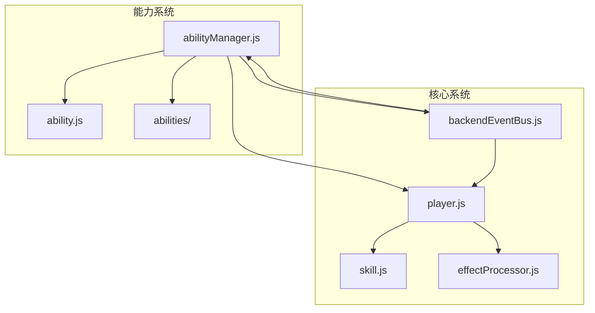

**图示来源**  
- [abilityManager.js](file://src/data/abilityManager.js#L1-L117)
- [player.js](file://src/data/player.js#L1-L225)
- [backendEventBus.js](file://src/backendEventBus.js#L1-L79)

**本节来源**  
- [abilityManager.js](file://src/data/abilityManager.js#L1-L117)
- [project_structure](file://project_structure)

## 核心组件
能力系统的核心组件包括能力管理器、能力基类、玩家对象和事件总线。这些组件协同工作，实现了能力的注册、应用、效果触发和状态管理。

**本节来源**  
- [abilityManager.js](file://src/data/abilityManager.js#L1-L117)
- [ability.js](file://src/data/ability.js#L1-L26)
- [player.js](file://src/data/player.js#L1-L225)

## 架构概述
能力系统采用单例模式的管理器架构，通过动态导入机制加载所有能力定义。能力实例化后与玩家对象关联，通过事件驱动机制响应游戏状态变化。

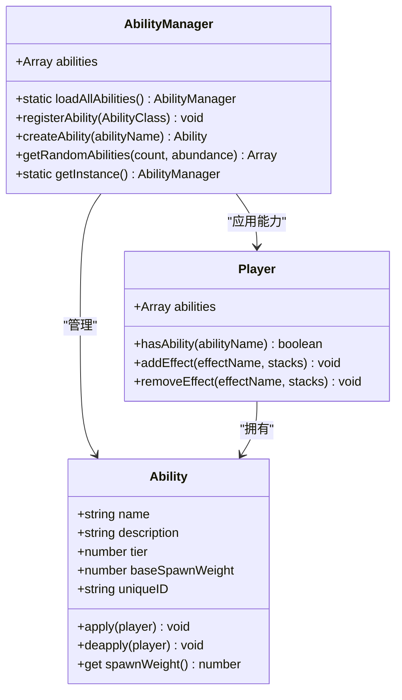

**图示来源**  
- [abilityManager.js](file://src/data/abilityManager.js#L1-L117)
- [ability.js](file://src/data/ability.js#L1-L26)
- [player.js](file://src/data/player.js#L1-L225)

## 详细组件分析

### 能力注册与管理
能力管理器负责加载、注册和实例化所有能力。系统通过动态导入机制自动发现并注册`abilities`目录下的所有能力类。

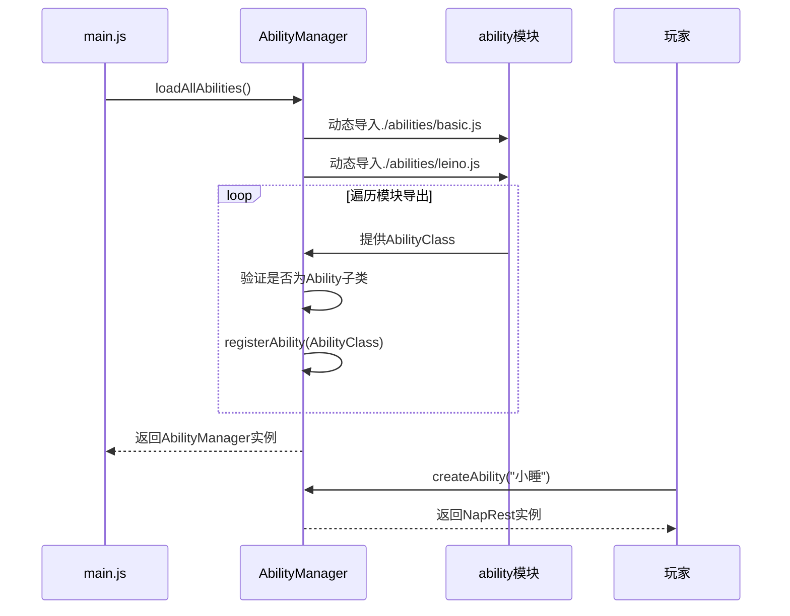

**图示来源**  
- [abilityManager.js](file://src/data/abilityManager.js#L1-L117)
- [main.js](file://src/main.js#L40-L54)

**本节来源**  
- [abilityManager.js](file://src/data/abilityManager.js#L1-L117)
- [main.js](file://src/main.js#L40-L54)

### 能力与玩家属性联动
能力通过修改玩家对象的属性来实现效果，包括生命值、防御力、灵能等基础属性的永久性增益。

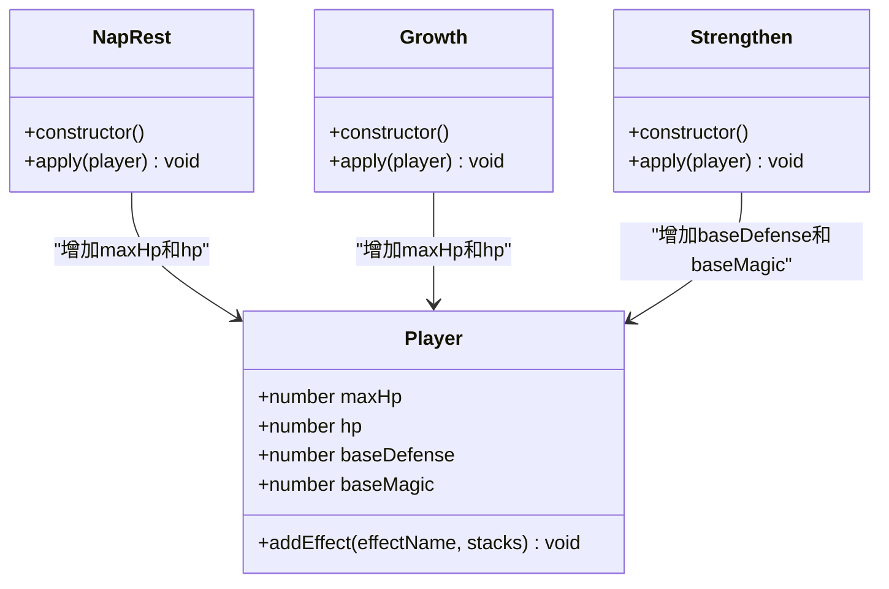

**图示来源**  
- [basic.js](file://src/data/abilities/basic.js#L1-L170)
- [player.js](file://src/data/player.js#L1-L225)

**本节来源**  
- [basic.js](file://src/data/abilities/basic.js#L1-L170)
- [player.js](file://src/data/player.js#L1-L225)

### 能力效果实现机制
能力效果分为被动加成、触发式效果和状态修正三种主要类型，通过不同的机制实现。

#### 被动加成效果
被动加成直接修改玩家的基础属性值，实现永久性增益。

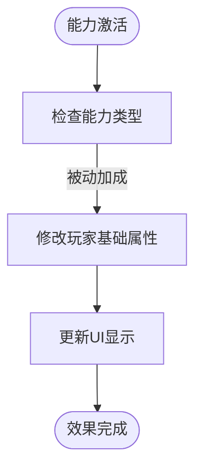

**图示来源**  
- [basic.js](file://src/data/abilities/basic.js#L1-L170)

#### 触发式效果
触发式效果通过事件监听机制实现，当特定条件满足时自动触发。

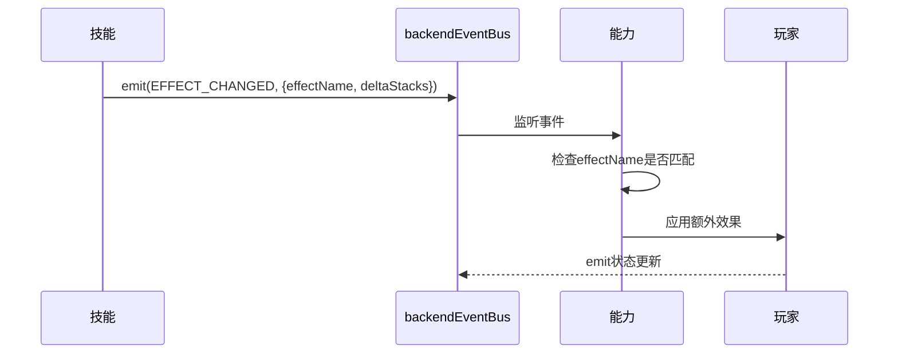

**图示来源**  
- [martialArtPose.js](file://src/data/skills/martial_arts/martialArtPose.js#L78-L121)
- [backendEventBus.js](file://src/backendEventBus.js#L1-L79)

#### 状态修正机制
状态修正通过代理模式实现，动态修改玩家属性的计算方式。

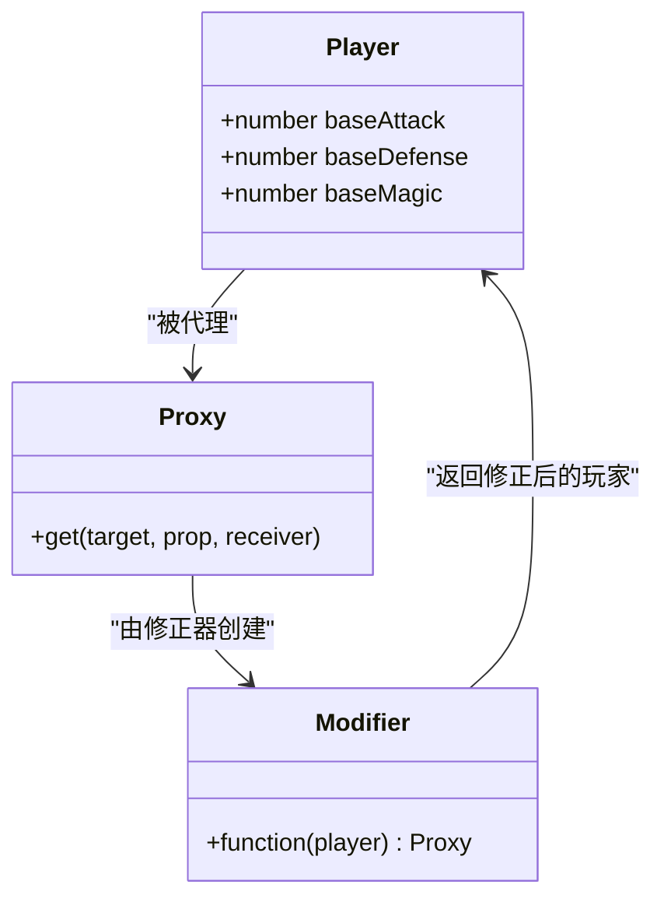

**图示来源**  
- [player.js](file://src/data/player.js#L1-L225)
- [martialArtPose.js](file://src/data/skills/martial_arts/martialArtPose.js#L78-L121)

**本节来源**  
- [effectProcessor.js](file://src/data/effectProcessor.js#L1-L357)
- [player.js](file://src/data/player.js#L1-L225)
- [martialArtPose.js](file://src/data/skills/martial_arts/martialArtPose.js#L78-L121)

### 能力升级路径与平衡性设计
能力系统通过等级（tier）和生成权重（spawnWeight）两个维度实现平衡性控制，确保游戏体验的合理性。

```mermaid
erDiagram
ABILITY {
string name PK
string description
number tier
number baseSpawnWeight
number spawnWeight
}
PLAYER {
number tier
number maxHp
number baseDefense
number baseMagic
}
ABILITY ||--o{ PLAYER : "授予"
ABILITY {
tier: 1-5
spawnWeight: 基础权重 × 稀有度因子 × 等级因子
}
```

**图示来源**  
- [abilityManager.js](file://src/data/abilityManager.js#L40-L87)
- [ability.js](file://src/data/ability.js#L1-L26)

**本节来源**  
- [abilityManager.js](file://src/data/abilityManager.js#L40-L87)
- [ability.js](file://src/data/ability.js#L1-L26)

### 能力与游戏事件系统集成
能力系统深度集成到游戏事件总线中，通过订阅和发布模式实现跨系统通信。

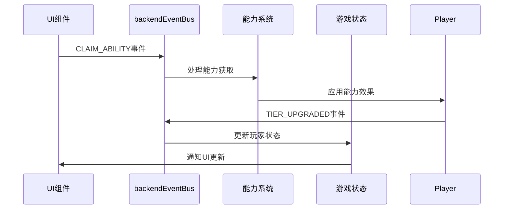

**图示来源**  
- [backendEventBus.js](file://src/backendEventBus.js#L1-L79)
- [gameState.js](file://src/data/gameState.js#L1-L74)

**本节来源**  
- [backendEventBus.js](file://src/backendEventBus.js#L1-L79)
- [gameState.js](file://src/data/gameState.js#L1-L74)

### 能力数据持久化与跨局继承
能力系统通过玩家对象的序列化实现数据持久化，确保能力状态在游戏会话间保持一致。

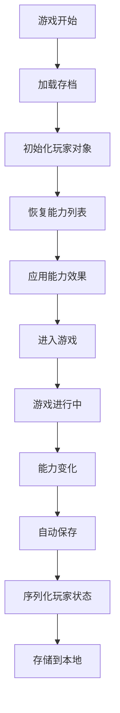

**图示来源**  
- [player.js](file://src/data/player.js#L1-L225)
- [gameState.js](file://src/data/gameState.js#L1-L74)

**本节来源**  
- [player.js](file://src/data/player.js#L1-L225)
- [gameState.js](file://src/data/gameState.js#L1-L74)

### 能力激活逻辑调试技巧
调试能力激活逻辑时，应重点关注事件监听、能力注册和效果应用三个关键环节。

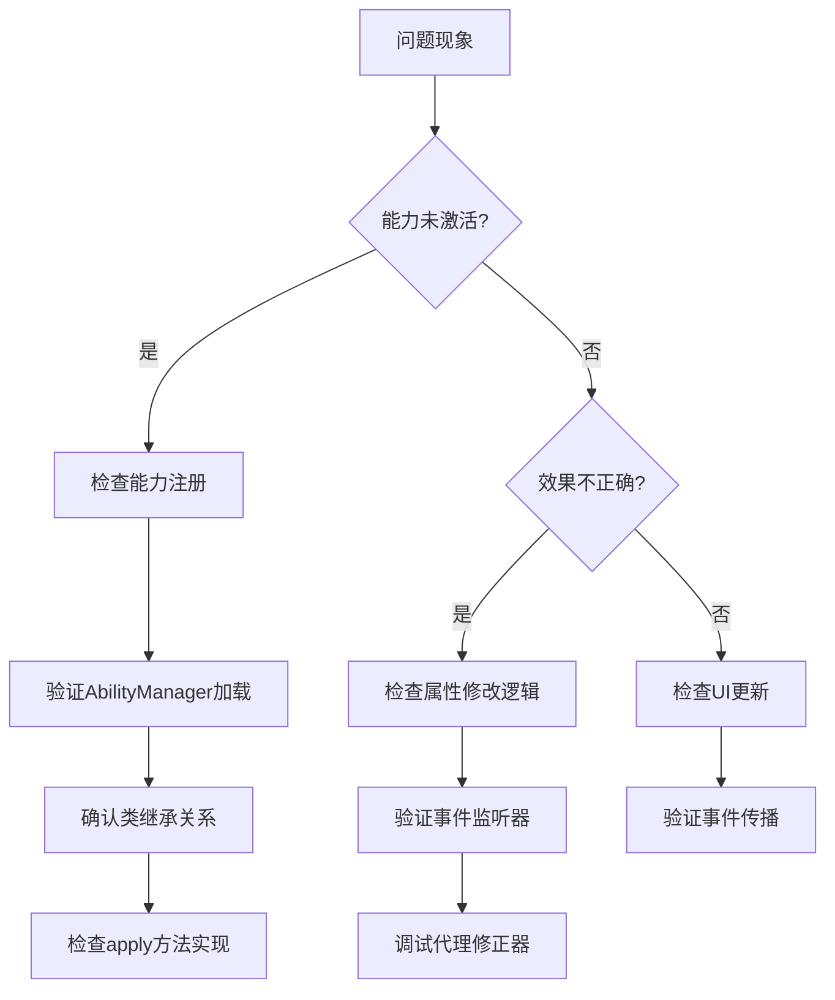

**图示来源**  
- [abilityManager.js](file://src/data/abilityManager.js#L1-L117)
- [player.js](file://src/data/player.js#L1-L225)
- [backendEventBus.js](file://src/backendEventBus.js#L1-L79)

**本节来源**  
- [abilityManager.js](file://src/data/abilityManager.js#L1-L117)
- [player.js](file://src/data/player.js#L1-L225)
- [backendEventBus.js](file://src/backendEventBus.js#L1-L79)

## 依赖分析
能力系统依赖于多个核心模块，形成了复杂的依赖网络。

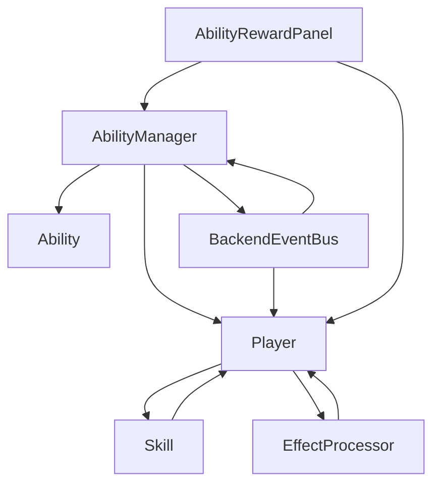

**图示来源**  
- [abilityManager.js](file://src/data/abilityManager.js#L1-L117)
- [player.js](file://src/data/player.js#L1-L225)
- [backendEventBus.js](file://src/backendEventBus.js#L1-L79)
- [AbilityRewardPanel.vue](file://src/components/rest/AbilityRewardPanel.vue#L1-L228)

**本节来源**  
- [abilityManager.js](file://src/data/abilityManager.js#L1-L117)
- [player.js](file://src/data/player.js#L1-L225)
- [backendEventBus.js](file://src/backendEventBus.js#L1-L79)

## 性能考虑
能力系统的性能主要受动态导入、事件监听和代理创建的影响，需要特别注意内存使用和事件处理效率。

- **动态导入**：能力管理器在启动时一次性加载所有能力模块，避免运行时性能开销
- **事件监听**：合理管理事件监听器的生命周期，防止内存泄漏
- **代理创建**：谨慎使用属性修正器，避免过度代理导致性能下降
- **能力实例化**：仅在需要时创建能力实例，减少内存占用

**本节来源**  
- [abilityManager.js](file://src/data/abilityManager.js#L1-L117)
- [player.js](file://src/data/player.js#L1-L225)

## 故障排除指南
当能力系统出现问题时，可按照以下步骤进行排查：

1. **能力未显示**：检查`abilityManager.js`中的动态导入路径是否正确
2. **效果未应用**：验证`apply`方法是否正确修改了玩家属性
3. **事件未触发**：确认事件监听器已正确注册和注销
4. **UI未更新**：检查玩家状态是否已正确通知UI组件
5. **内存泄漏**：确保事件监听器在能力停用时被正确移除

**本节来源**  
- [abilityManager.js](file://src/data/abilityManager.js#L1-L117)
- [player.js](file://src/data/player.js#L1-L225)
- [backendEventBus.js](file://src/backendEventBus.js#L1-L79)

## 结论
本文档全面介绍了新能力开发的各个方面，从注册管理到效果实现，从事件集成到数据持久化。开发者应遵循文档中的指导原则，确保新能力与现有系统良好集成，同时注意性能和稳定性。通过合理设计能力效果和平衡性参数，可以为玩家提供丰富多样的游戏体验。