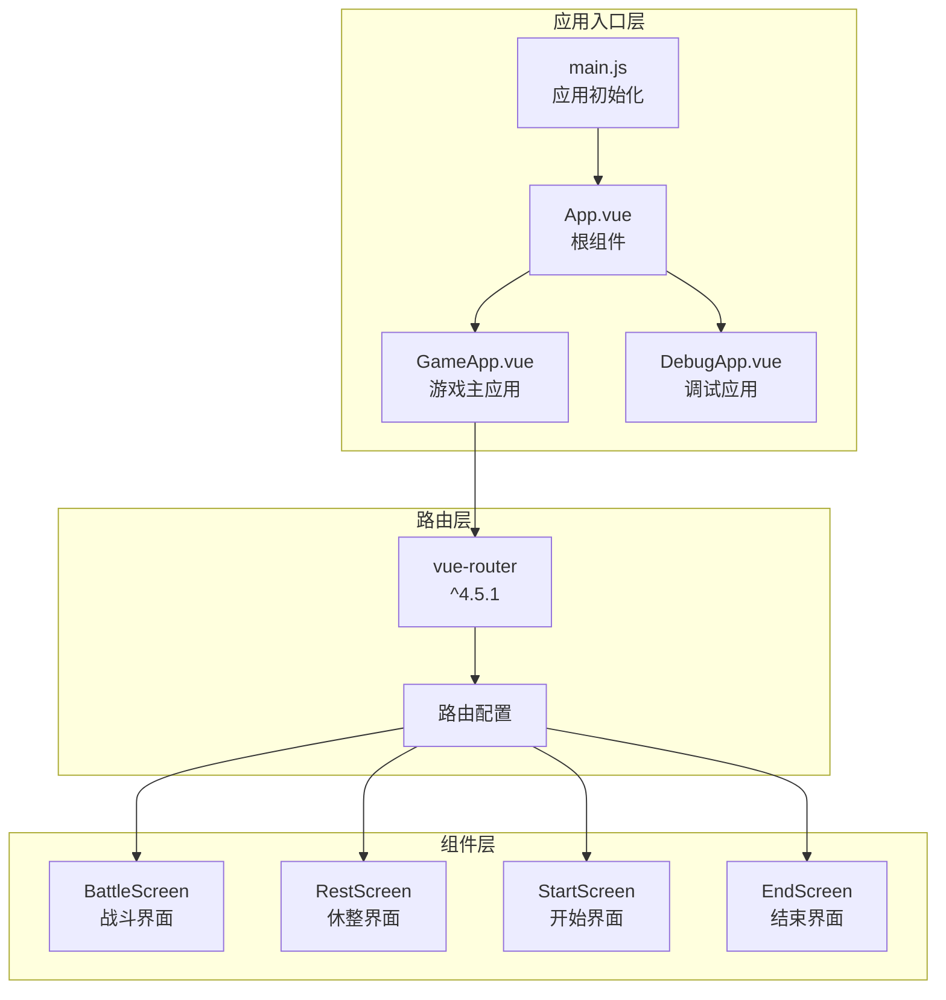
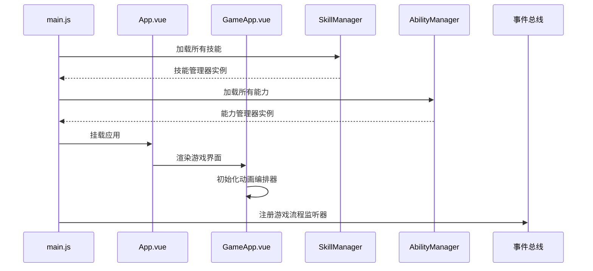
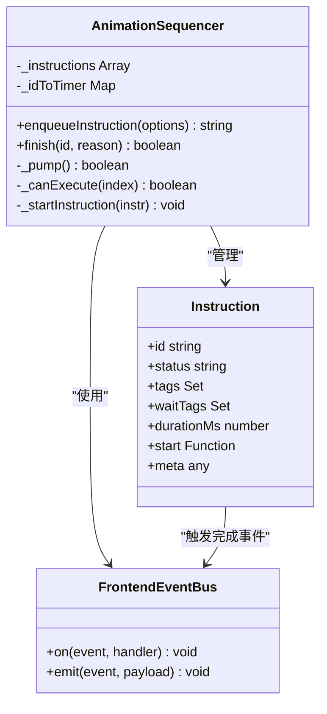
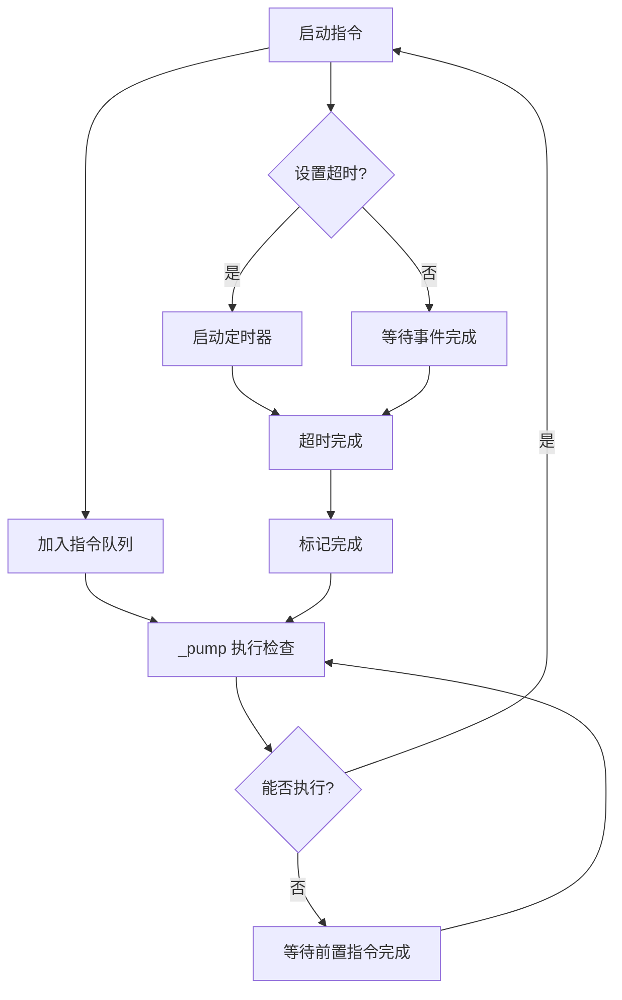
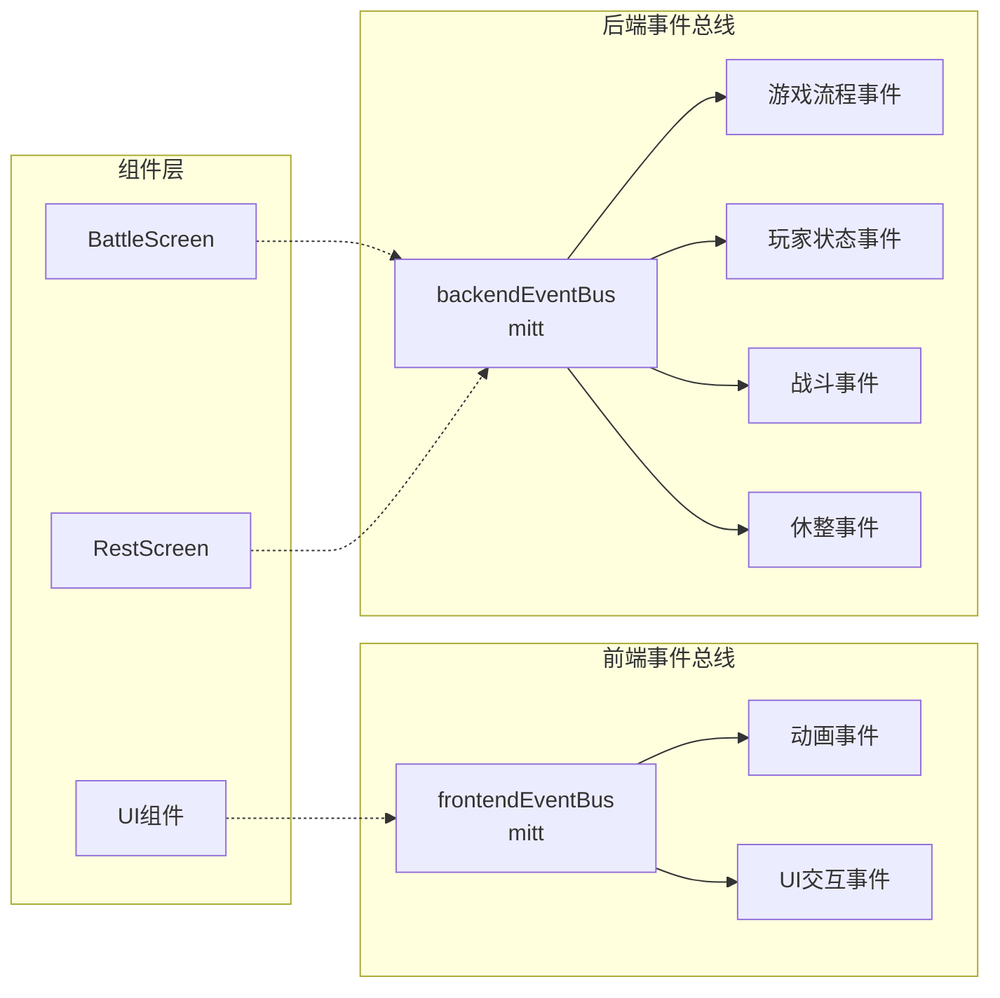
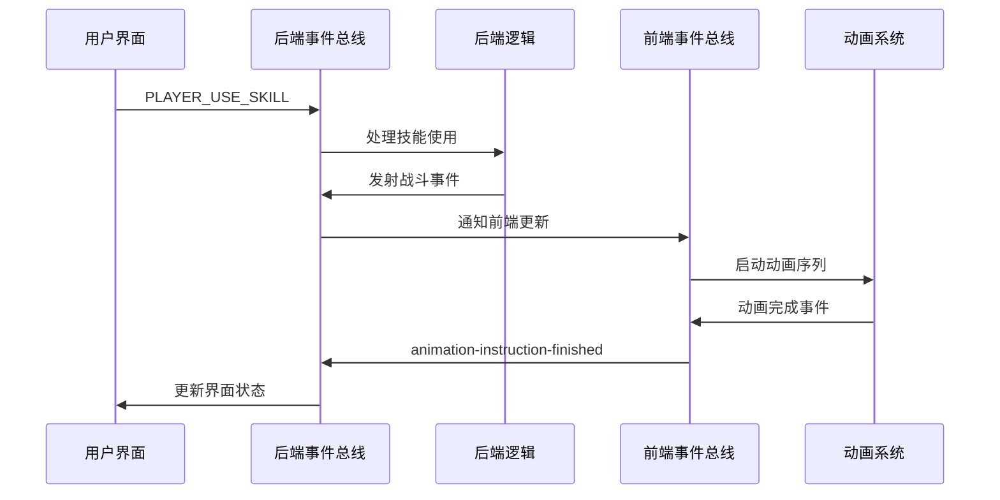
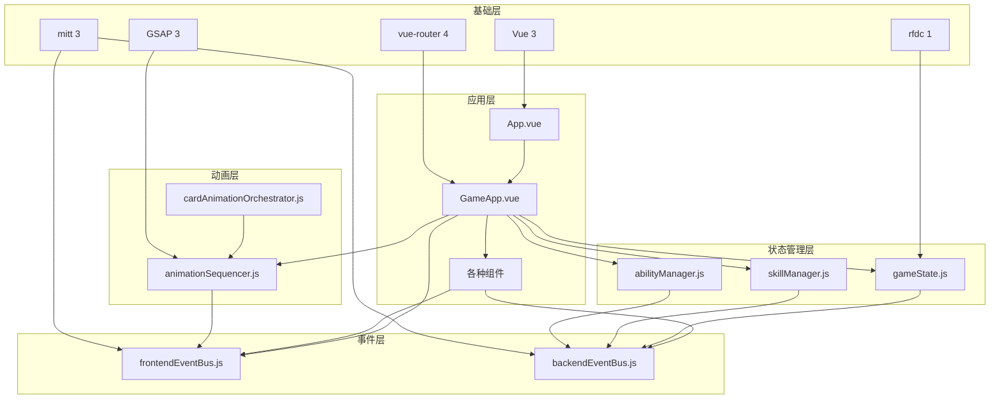

# 技术栈与依赖

<cite>
**本文档中引用的文件**
- [package.json](file://package.json)
- [vite.config.js](file://vite.config.js)
- [src/main.js](file://src/main.js)
- [src/frontendEventBus.js](file://src/frontendEventBus.js)
- [src/backendEventBus.js](file://src/backendEventBus.js)
- [src/game.js](file://src/game.js)
- [src/data/animationSequencer.js](file://src/data/animationSequencer.js)
- [src/App.vue](file://src/App.vue)
- [src/GameApp.vue](file://src/GameApp.vue)
</cite>

## 目录
1. [项目概述](#项目概述)
2. [核心技术栈](#核心技术栈)
3. [Vue 3 组合式 API 架构](#vue-3-组合式-api-架构)
4. [Vite 构建工具配置](#vite-构建工具配置)
5. [动画系统架构](#动画系统架构)
6. [事件总线设计](#事件总线设计)
7. [依赖关系分析](#依赖关系分析)
8. [技术选型权衡](#技术选型权衡)
9. [性能优化策略](#性能优化策略)
10. [总结](#总结)

## 项目概述

本项目是一个基于 Vue 3 的游戏应用程序，采用现代化前端技术栈构建。项目展现了清晰的架构分层，从前端界面到后端逻辑，再到动画系统，形成了完整的游戏开发框架。

**章节来源**
- [package.json](file://package.json#L1-L22)
- [src/main.js](file://src/main.js#L1-L55)

## 核心技术栈

### 前端框架 - Vue 3

Vue 3 作为核心框架，提供了响应式数据绑定和组件化开发能力：

```javascript
// Vue 3 版本：^3.2.0
import { createApp } from 'vue'
import { createRouter, createWebHashHistory } from 'vue-router'
```

Vue 3 的 Composition API 提供了更好的逻辑复用和代码组织方式，特别适合复杂的游戏状态管理。

### 构建工具 - Vite

Vite 作为现代构建工具，提供了快速的开发服务器和高效的生产构建：

```javascript
// Vite 版本：^4.0.0
// @vitejs/plugin-vue 版本：^4.0.0
```

Vite 的 ES 模块原生支持和热更新功能显著提升了开发体验。

### 动画库 - GSAP

GSAP (GreenSock Animation Platform) 提供了高性能的动画解决方案：

```javascript
// GSAP 版本：^3.13.0
import gsap from 'gsap'
```

GSAP 在游戏动画中表现出色，特别是在复杂的战斗动画和UI过渡效果中。

### 事件通信 - mitt

轻量级事件总线 mitt 实现了前后端逻辑解耦：

```javascript
// mitt 版本：^3.0.1
import mitt from 'mitt'
```

### 数据处理 - rfdc

rfdc 提供了深度克隆功能，确保数据安全：

```javascript
// rfdc 版本：^1.3.0
import rfdc from 'rfdc'
```

**章节来源**
- [package.json](file://package.json#L7-L16)

## Vue 3 组合式 API 架构

### 应用入口架构

项目采用了清晰的应用入口架构，分离了不同场景的应用实例：



**图表来源**
- [src/main.js](file://src/main.js#L1-L55)
- [src/App.vue](file://src/App.vue#L1-L14)
- [src/GameApp.vue](file://src/GameApp.vue#L1-L139)

### 组件状态管理

GameApp.vue 展示了 Vue 3 的响应式状态管理模式：

```javascript
// 响应式状态管理
data() {
  return {
    gameState: gameState
  }
}

// 计算属性
computed: {
  isPlayerTurn() {
    return !gameState.isEnemyTurn;
  }
}
```

这种设计模式确保了：
- **状态集中管理**：所有游戏状态通过单一数据源管理
- **响应式更新**：状态变化自动触发界面更新
- **组件解耦**：各组件通过 props 和事件通信

### 生命周期管理

应用初始化过程展现了清晰的依赖注入和状态同步机制：



**图表来源**
- [src/main.js](file://src/main.js#L25-L55)
- [src/GameApp.vue](file://src/GameApp.vue#L70-L85)

**章节来源**
- [src/main.js](file://src/main.js#L1-L55)
- [src/GameApp.vue](file://src/GameApp.vue#L1-L139)

## Vite 构建工具配置

### 开发环境配置

Vite 配置展现了现代化的开发体验：

```javascript
// Vite 配置详情
export default defineConfig(({mode}) => {
  const viteEnv = loadEnv(mode, process.cwd());
  
  return {
    base: viteEnv.VITE_BASE || './',
    plugins: [
      vue({
        template: {
          compilerOptions: {
            isCustomElement: (tag) => tag.startsWith('colored-')
          }
        }
      })
    ],
    resolve: {
      extensions: ['.mjs', '.js', '.ts', '.jsx', '.tsx', '.json', '.vue'],
      alias: {
        '@assets': path.join(__dirname, './src/assets'),
      }
    },
    server: {
      host: 'localhost',
      port: 5177
    }
  }
})
```

### 性能优势

Vite 的配置带来了以下性能优势：

1. **快速冷启动**：ES 模块原生支持，无需打包即可运行
2. **热更新优化**：仅更新变更的模块，提升开发效率
3. **Tree Shaking**：自动移除未使用的代码
4. **预构建依赖**：对第三方库进行预构建优化

### 自定义元素支持

配置中特别支持了自定义元素：

```javascript
isCustomElement: (tag) => tag.startsWith('colored-')
```

这允许项目使用自定义 HTML 元素，扩展了组件的灵活性。

**章节来源**
- [vite.config.js](file://vite.config.js#L1-L31)

## 动画系统架构

### AnimationSequencer 设计

项目实现了新一代动画队列执行器，展现了创新的动画管理系统：



**图表来源**
- [src/data/animationSequencer.js](file://src/data/animationSequencer.js#L1-L135)

### 动画指令系统

动画系统的核心是指令驱动的执行模型：

```javascript
// 指令结构
{
  id: string,
  status: 'pending' | 'running' | 'finished',
  tags: Set<string>,
  waitTags: Set<string>,
  durationMs: number,
  start: (ctx) => void,
  meta?: any
}
```

### 执行引擎

AnimationSequencer 实现了智能的执行引擎：



**图表来源**
- [src/data/animationSequencer.js](file://src/data/animationSequencer.js#L40-L135)

### 前后端解耦

动画系统通过事件总线实现了前后端完全解耦：

```javascript
// 前端监听动画完成
frontendEventBus.on('animation-instruction-finished', (payload = {}) => {
  const id = payload?.id;
  if (id) this.finish(id, 'frontend');
});
```

这种设计确保了：
- **逻辑分离**：前端负责动画展示，后端负责业务逻辑
- **可测试性**：前后端可以独立测试
- **可维护性**：修改不影响另一方

**章节来源**
- [src/data/animationSequencer.js](file://src/data/animationSequencer.js#L1-L135)

## 事件总线设计

### 前后端事件分离

项目采用了清晰的事件总线分离策略：



**图表来源**
- [src/frontendEventBus.js](file://src/frontendEventBus.js#L1-L9)
- [src/backendEventBus.js](file://src/backendEventBus.js#L1-L80)

### 后端事件总线架构

后端事件总线包含了完整的游戏事件分类：

```javascript
export const EventNames = {
  Game: {
    PRE_GAME_START: 'pre-game-start',
    GAME_START: 'game-start',
    ENTER_BATTLE_STAGE: 'enter-battle-stage',
    ENTER_REST_STAGE: 'enter-rest-stage',
    PRE_BATTLE: 'pre-battle',
    POST_BATTLE: 'post-battle',
    GAME_OVER: 'game-over',
  },
  Player: {
    TIER_UPGRADED: 'player-tier-upgraded',
    ABILITY_CLAIMED: 'player-ability-claimed',
    MONEY_CLAIMED: 'player-money-claimed',
    SKILL_REWARD_CLAIMED: 'player-skill-claimed',
    // ... 更多事件
  },
  PlayerOperations: {
    PLAYER_USE_SKILL: 'battle-player-use-skill',
    PLAYER_SHIFT_SKILL: 'battle-player-shift-skill',
    PLAYER_END_TURN: 'player-end-turn',
    // ... 更多操作事件
  }
};
```

### 事件驱动架构

游戏流程通过事件驱动的方式组织：



**图表来源**
- [src/backendEventBus.js](file://src/backendEventBus.js#L1-L80)
- [src/game.js](file://src/game.js#L1-L119)

**章节来源**
- [src/frontendEventBus.js](file://src/frontendEventBus.js#L1-L9)
- [src/backendEventBus.js](file://src/backendEventBus.js#L1-L80)
- [src/game.js](file://src/game.js#L1-L119)

## 依赖关系分析

### 核心依赖层次

项目依赖关系展现了清晰的分层架构：



**图表来源**
- [src/main.js](file://src/main.js#L1-L55)
- [src/GameApp.vue](file://src/GameApp.vue#L1-L139)

### 加载顺序分析

项目的加载顺序确保了正确的依赖注入：

1. **基础依赖加载**：Vue、Vue Router、GSAP、Mitt
2. **状态管理器初始化**：GameState、SkillManager、AbilityManager
3. **事件总线建立**：前后端事件总线连接
4. **路由系统就绪**：应用路由配置完成
5. **组件挂载**：最终渲染到 DOM

### 循环依赖避免

项目通过以下策略避免循环依赖：

- **单向依赖**：每个模块只依赖于更低层级的模块
- **接口抽象**：通过事件总线解耦组件间的直接调用
- **延迟初始化**：某些组件在需要时才初始化

**章节来源**
- [src/main.js](file://src/main.js#L1-L55)

## 技术选型权衡

### 轻量级事件总线 vs 状态管理库

项目选择了 mitt 作为事件总线，而非 Vuex 或 Pinia：

**选择 mitt 的优势**：
- **轻量级**：仅 3KB，相比 Vuex/Pinia 更小
- **简单易用**：API 简洁，学习成本低
- **解耦彻底**：前后端逻辑完全分离
- **性能优异**：事件触发开销极小

**替代方案对比**：
- **Vuex/Pinia**：功能强大但过于复杂，不适合简单的事件通信
- **Redux**：需要大量样板代码，不适合快速原型开发
- **RxJS**：功能强大但学习曲线陡峭

### Vue 3 vs Vue 2

选择 Vue 3 的主要考虑：

- **Composition API**：更适合复杂游戏逻辑的状态管理
- **性能提升**：更快的渲染速度和更小的包体积
- **更好的 TypeScript 支持**：类型推断和 IDE 支持更好
- **更好的 Tree Shaking**：减少最终包大小

### GSAP vs CSS 动画

选择 GSAP 的原因：

- **精确控制**：时间轴和补间动画控制更精细
- **性能优化**：GPU 加速和优化的动画引擎
- **跨浏览器兼容**：统一的动画行为
- **复杂动画支持**：适合游戏中的复杂动画序列

## 性能优化策略

### 代码分割

项目通过动态导入实现了代码分割：

```javascript
// 路由级别的代码分割
const routes = [
  { path: '/', component: GameApp },
  { path: '/debug', component: DebugApp },
  { path: '/test', component: TestEffectDisplay },
  { path: '/named-test', component: NamedEntityTest }
]
```

### 组件懒加载

大型组件采用懒加载策略：

```javascript
// 组件懒加载
import StartScreen from './components/StartScreen.vue'
import BattleScreen from './components/BattleScreen.vue'
import RestScreen from './components/RestScreen.vue'
```

### 动画性能优化

AnimationSequencer 通过以下方式优化性能：

- **智能调度**：只执行可执行的指令
- **超时机制**：防止动画无限等待
- **内存管理**：及时清理已完成的指令
- **事件驱动**：减少轮询开销

### 缓存策略

项目实现了多层缓存：

- **技能缓存**：SkillManager 缓存已加载的技能
- **状态缓存**：GameState 缓存计算结果
- **DOM 缓存**：CardDomRegistry 缓存 DOM 元素引用

## 总结

本项目展现了现代前端游戏开发的最佳实践，通过精心选择的技术栈和架构设计，实现了：

### 技术栈优势

1. **Vue 3 + Composition API**：提供了强大的状态管理和组件化能力
2. **Vite 构建工具**：带来了极速的开发体验和高效的生产构建
3. **GSAP 动画库**：确保了高质量的游戏动画效果
4. **mitt 事件总线**：实现了前后端逻辑的完全解耦

### 架构设计亮点

- **清晰的分层架构**：从应用层到基础层的明确分层
- **事件驱动设计**：通过事件总线实现松耦合的组件通信
- **动画系统创新**：基于指令的动画队列执行器
- **性能优化策略**：多层次的性能优化措施

### 可扩展性

项目架构具有良好的可扩展性：

- **模块化设计**：易于添加新的游戏功能
- **插件化架构**：支持第三方插件集成
- **配置化管理**：通过配置文件管理游戏参数
- **测试友好**：清晰的依赖关系便于单元测试

这种技术栈和架构设计为游戏开发提供了坚实的基础，既保证了开发效率，又确保了最终产品的性能和质量。