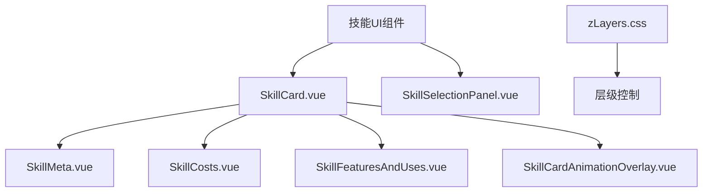
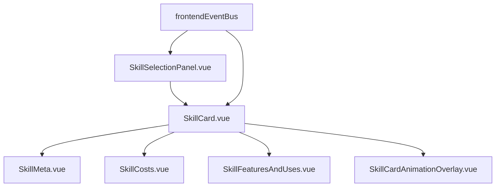
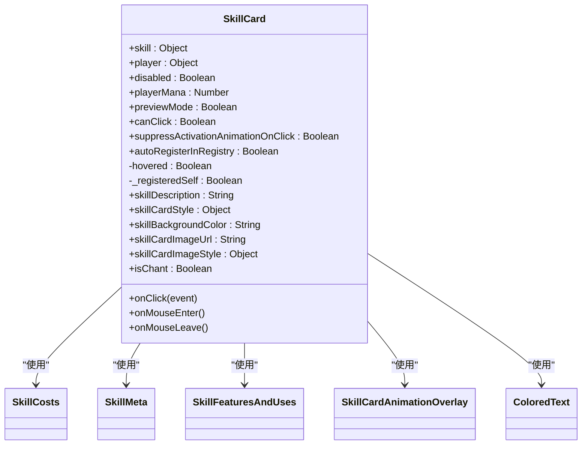
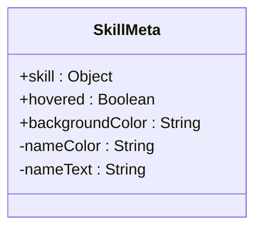
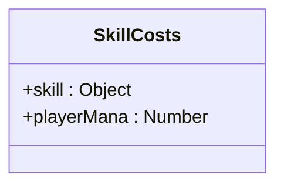
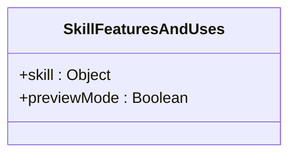
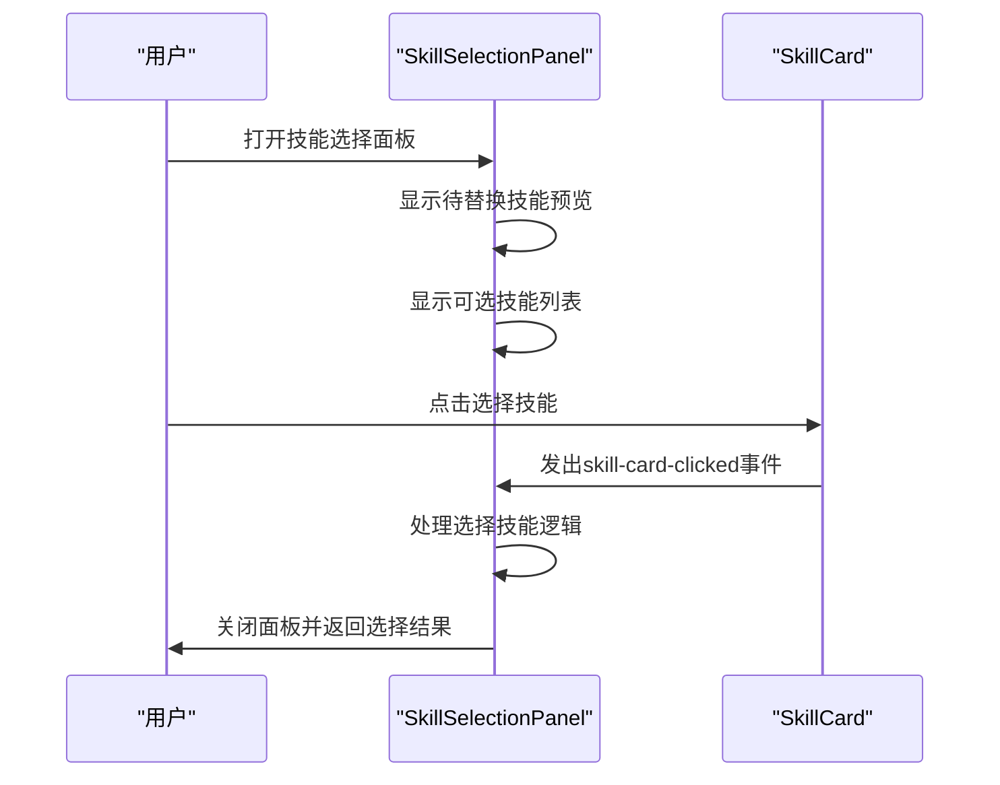
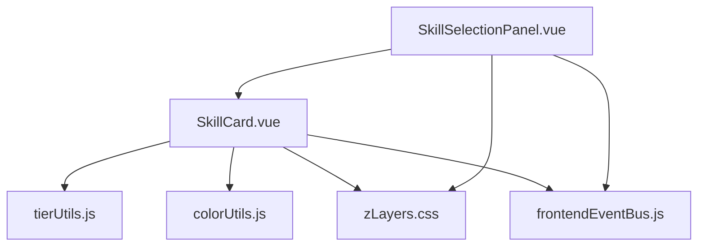

# 技能UI组件

<cite>
**本文档引用的文件**
- [SkillCard.vue](file://src/components/global/SkillCard.vue)
- [SkillMeta.vue](file://src/components/global/skillCard/SkillMeta.vue)
- [SkillCosts.vue](file://src/components/global/skillCard/SkillCosts.vue)
- [SkillFeaturesAndUses.vue](file://src/components/global/skillCard/SkillFeaturesAndUses.vue)
- [SkillSelectionPanel.vue](file://src/components/rest/SkillSelectionPanel.vue)
- [zLayers.css](file://src/assets/zLayers.css)
- [tierUtils.js](file://src/utils/tierUtils.js)
- [colorUtils.js](file://src/utils/colorUtils.js)
- [FloatingTooltip.vue](file://src/components/global/FloatingTooltip.vue)
</cite>

## 目录
1. [简介](#简介)
2. [项目结构](#项目结构)
3. [核心组件](#核心组件)
4. [架构概览](#架构概览)
5. [详细组件分析](#详细组件分析)
6. [依赖分析](#依赖分析)
7. [性能考虑](#性能考虑)
8. [故障排除指南](#故障排除指南)
9. [结论](#结论)

## 简介
本文档详细介绍了技能UI组件的设计与实现，重点分析`SkillCard.vue`的结构与渲染逻辑，包括技能名称、消耗、描述、图标的布局方式及响应式设计。文档还说明了`SkillMeta`、`SkillCosts`、`SkillFeaturesAndUses`等子组件的职责划分与数据传递机制，以及`SkillSelectionPanel.vue`在技能选择界面中的使用场景、事件绑定与动画交互。此外，文档解释了CSS类名命名规范（如zLayers）在层级控制中的应用，并提供了组件使用示例、插槽定制方法、样式覆盖技巧，以及如何实现技能悬停提示与动态高亮效果。

## 项目结构
技能UI组件位于`src/components`目录下，主要分为全局组件和特定功能组件。核心技能卡片组件`SkillCard.vue`位于`src/components/global`目录，其子组件`SkillMeta.vue`、`SkillCosts.vue`和`SkillFeaturesAndUses.vue`位于`src/components/global/skillCard`子目录中。技能选择面板`SkillSelectionPanel.vue`位于`src/components/rest`目录，用于休息界面中的技能替换功能。样式文件`zLayers.css`位于`src/assets`目录，用于管理UI层级。

**Diagram sources**
- [SkillCard.vue](file://src/components/global/SkillCard.vue#L1-L236)
- [SkillSelectionPanel.vue](file://src/components/rest/SkillSelectionPanel.vue#L1-L144)
- [zLayers.css](file://src/assets/zLayers.css#L1-L30)

**Section sources**
- [SkillCard.vue](file://src/components/global/SkillCard.vue#L1-L236)
- [SkillSelectionPanel.vue](file://src/components/rest/SkillSelectionPanel.vue#L1-L144)

## 核心组件
技能UI的核心是`SkillCard.vue`组件，它负责渲染技能卡片的整体结构，包括技能名称、消耗、描述、图标等元素。该组件通过props接收技能数据和玩家状态，并通过computed属性动态计算样式和描述文本。`SkillCard.vue`还处理点击、悬停等用户交互事件，并通过event bus与其他组件通信。

**Section sources**
- [SkillCard.vue](file://src/components/global/SkillCard.vue#L1-L236)

## 架构概览
技能UI组件采用分层架构设计，`SkillCard.vue`作为容器组件，负责整体布局和事件处理，而`SkillMeta`、`SkillCosts`、`SkillFeaturesAndUses`等子组件则负责特定功能的渲染。这种设计提高了组件的可维护性和可复用性。`SkillSelectionPanel.vue`作为独立的UI组件，用于技能选择场景，通过transition组件实现动画效果。

**Diagram sources**
- [SkillCard.vue](file://src/components/global/SkillCard.vue#L1-L236)
- [SkillSelectionPanel.vue](file://src/components/rest/SkillSelectionPanel.vue#L1-L144)
- [frontendEventBus.js](file://src/frontendEventBus.js#L1-L10)

## 详细组件分析

### SkillCard.vue 分析
`SkillCard.vue`是技能UI的核心组件，采用Vue单文件组件格式，包含template、script和style三个部分。组件通过props接收技能数据、玩家状态、禁用状态等参数，并通过computed属性动态计算样式和描述文本。组件还实现了点击、悬停等事件处理逻辑，并通过event bus与其他组件通信。

#### 组件结构

**Diagram sources**
- [SkillCard.vue](file://src/components/global/SkillCard.vue#L1-L236)

**Section sources**
- [SkillCard.vue](file://src/components/global/SkillCard.vue#L1-L236)

### SkillMeta.vue 分析
`SkillMeta.vue`组件负责渲染技能名称和副标题，根据技能的power值动态调整名称颜色（正数为绿色，负数为红色）。组件还根据悬停状态调整副标题的样式，提供视觉反馈。

**Diagram sources**
- [SkillMeta.vue](file://src/components/global/skillCard/SkillMeta.vue#L1-L58)

**Section sources**
- [SkillMeta.vue](file://src/components/global/skillCard/SkillMeta.vue#L1-L58)

### SkillCosts.vue 分析
`SkillCosts.vue`组件负责渲染技能的消耗信息，包括法力值和行动点。组件根据玩家当前法力值判断是否足够施放技能，并通过CSS类名`insufficient-mana`高亮显示不足的消耗。

**Diagram sources**
- [SkillCosts.vue](file://src/components/global/skillCard/SkillCosts.vue#L1-L53)

**Section sources**
- [SkillCosts.vue](file://src/components/global/skillCard/SkillCosts.vue#L1-L53)

### SkillFeaturesAndUses.vue 分析
`SkillFeaturesAndUses.vue`组件负责渲染技能特性（如慢热、咏唱）和使用状态（如重整、装填）。组件根据技能的冷却回合数和剩余使用次数动态显示相关信息。

**Diagram sources**
- [SkillFeaturesAndUses.vue](file://src/components/global/skillCard/SkillFeaturesAndUses.vue#L1-L48)

**Section sources**
- [SkillFeaturesAndUses.vue](file://src/components/global/skillCard/SkillFeaturesAndUses.vue#L1-L48)

### SkillSelectionPanel.vue 分析
`SkillSelectionPanel.vue`组件用于技能选择界面，通过transition组件实现淡入淡出和缩放动画效果。组件显示待替换技能的预览和可选技能列表，并处理技能选择和关闭事件。

**Diagram sources**
- [SkillSelectionPanel.vue](file://src/components/rest/SkillSelectionPanel.vue#L1-L144)

**Section sources**
- [SkillSelectionPanel.vue](file://src/components/rest/SkillSelectionPanel.vue#L1-L144)

## 依赖分析
技能UI组件依赖多个工具函数和样式文件。`tierUtils.js`提供技能等阶标签和颜色的映射函数，`colorUtils.js`提供颜色亮度调整功能。`zLayers.css`定义了UI层级的CSS变量，确保组件在正确层级显示。`frontendEventBus.js`用于组件间通信，实现技能悬停提示等功能。

**Diagram sources**
- [SkillCard.vue](file://src/components/global/SkillCard.vue#L1-L236)
- [SkillSelectionPanel.vue](file://src/components/rest/SkillSelectionPanel.vue#L1-L144)
- [tierUtils.js](file://src/utils/tierUtils.js#L1-L218)
- [colorUtils.js](file://src/utils/colorUtils.js#L1-L16)
- [zLayers.css](file://src/assets/zLayers.css#L1-L30)
- [frontendEventBus.js](file://src/frontendEventBus.js#L1-L10)

**Section sources**
- [tierUtils.js](file://src/utils/tierUtils.js#L1-L218)
- [colorUtils.js](file://src/utils/colorUtils.js#L1-L16)
- [zLayers.css](file://src/assets/zLayers.css#L1-L30)

## 性能考虑
技能UI组件在性能方面做了多项优化。`SkillCard.vue`通过computed属性缓存计算结果，避免重复计算。组件在mounted和beforeUnmount生命周期钩子中注册和注销DOM元素，避免内存泄漏。`SkillSelectionPanel.vue`使用transition组件实现动画效果，利用CSS过渡而非JavaScript动画，提高性能。

## 故障排除指南
常见问题包括技能卡片不显示、悬停效果不生效、技能选择面板无法关闭等。解决方案包括检查props传递是否正确、确保event bus事件监听器已注册、验证CSS类名是否正确应用等。对于层级问题，可检查`zLayers.css`中的CSS变量是否正确引用。

**Section sources**
- [SkillCard.vue](file://src/components/global/SkillCard.vue#L1-L236)
- [SkillSelectionPanel.vue](file://src/components/rest/SkillSelectionPanel.vue#L1-L144)
- [zLayers.css](file://src/assets/zLayers.css#L1-L30)

## 结论
技能UI组件通过模块化设计和分层架构，实现了高度可维护和可复用的代码结构。组件间的职责划分清晰，数据传递机制明确，动画效果流畅。通过合理使用computed属性、event bus和CSS过渡，组件在保证功能完整性的同时，也兼顾了性能优化。未来可进一步优化响应式设计，提升移动端用户体验。