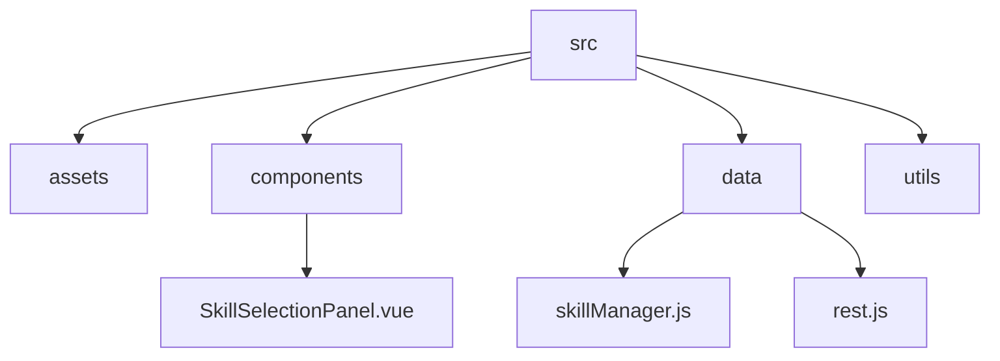
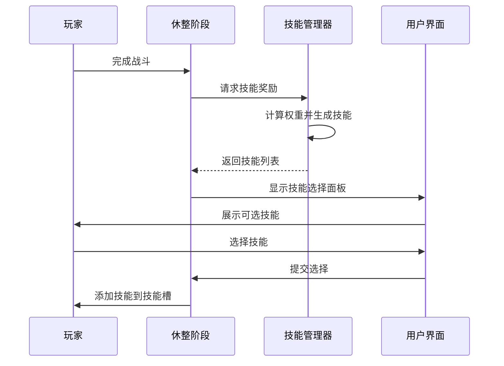
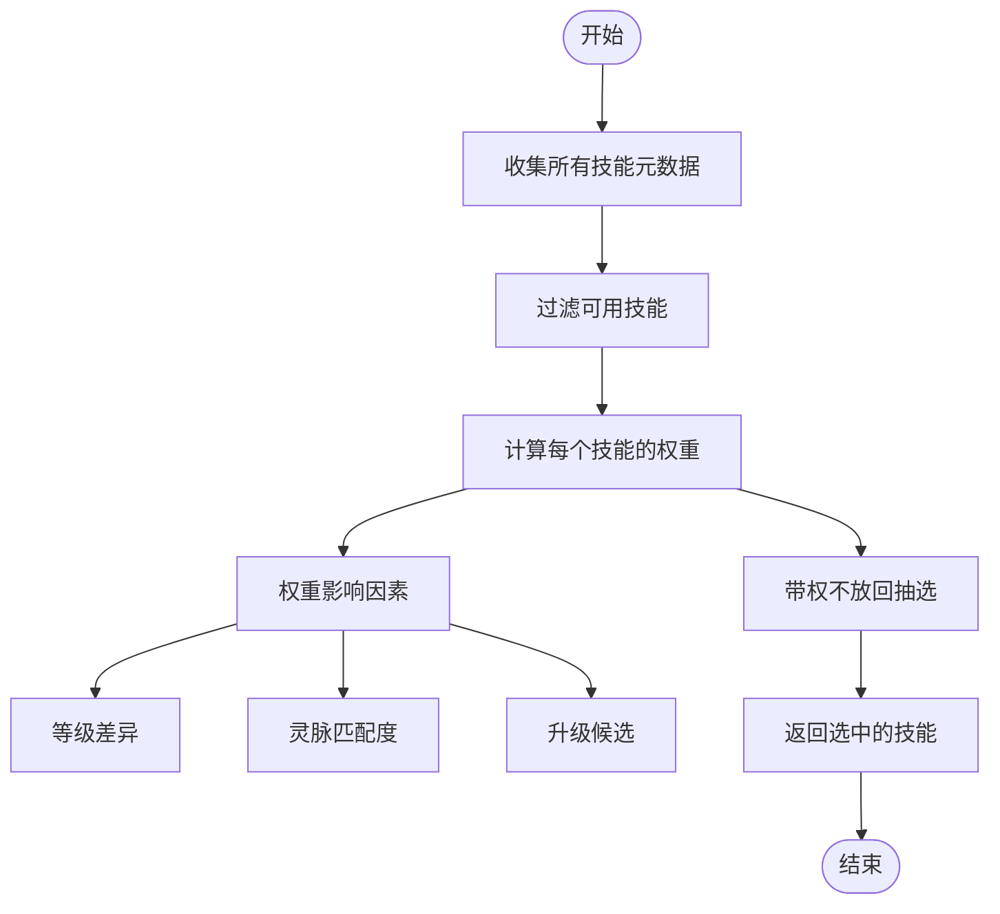
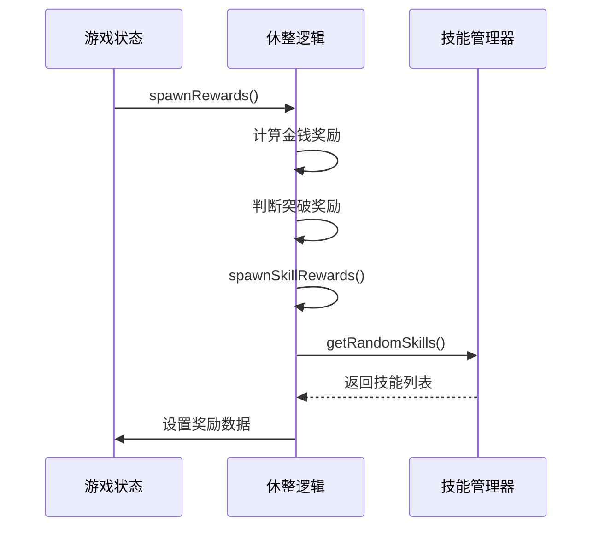
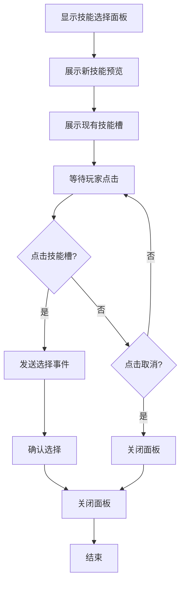
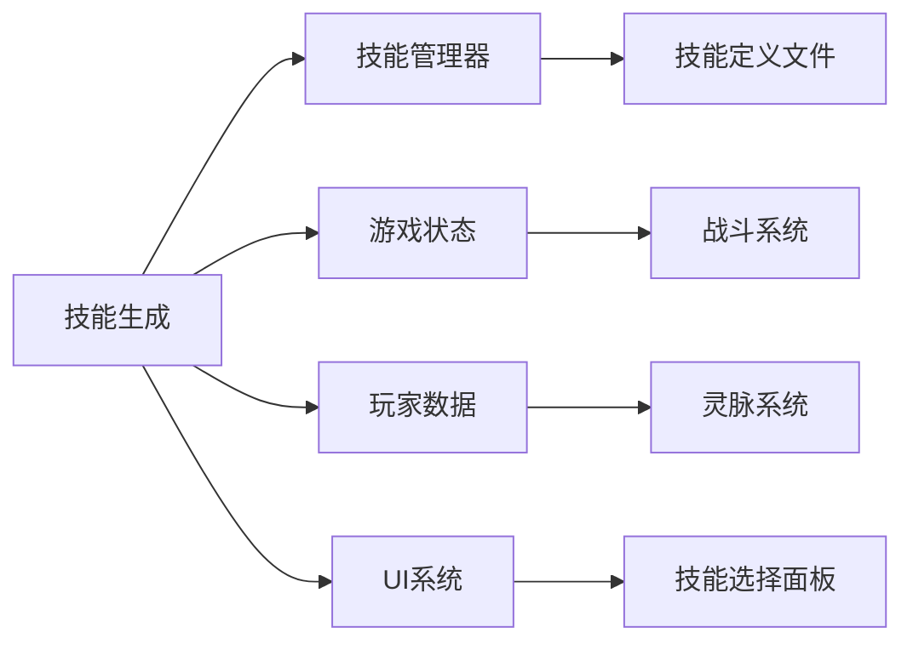

# 技能生成算法

<cite>
**本文档引用的文件**  
- [skillManager.js](file://src/data/skillManager.js)
- [rest.js](file://src/data/rest.js)
- [SkillSelectionPanel.vue](file://src/components/rest/SkillSelectionPanel.vue)
- [testSkill.js](file://src/data/testSkill.js)
- [skill.js](file://src/data/skill.js)
- [SKILL_DESIGN_PRINCIPLES.md](file://src/data/skills/SKILL_DESIGN_PRINCIPLES.md)
- [punch.js](file://src/data/skills/martial_arts/punch.js)
- [agilePunch.js](file://src/data/skills/martial_arts/agilePunch.js)
- [tierUtils.js](file://src/utils/tierUtils.js)
</cite>

## 目录
1. [引言](#引言)
2. [项目结构](#项目结构)
3. [核心组件](#核心组件)
4. [架构概述](#架构概述)
5. [详细组件分析](#详细组件分析)
6. [依赖分析](#依赖分析)
7. [性能考虑](#性能考虑)
8. [故障排除指南](#故障排除指南)
9. [结论](#结论)

## 引言
本文档全面阐述了游戏中的技能生成算法，涵盖战斗后奖励、商店购买、突破奖励等不同场景下的技能随机化策略。详细说明了权重分配机制、稀有度概率分布模型、技能池动态调整逻辑以及避免重复技能的去重策略。结合`rest.js`中的奖励生成流程，分析了技能生成与游戏进度的关联性。解释了`testSkill.js`在技能原型测试中的作用，并说明如何利用`SkillSelectionPanel.vue`实现用户对生成技能的可视化选择。同时包含性能优化建议和边界情况处理（如技能库耗尽）。

## 项目结构
本项目采用模块化设计，主要分为以下几个部分：
- `public`：公共资源文件
- `src`：源代码目录
  - `assets`：静态资源
  - `components`：Vue组件
  - `data`：数据和逻辑处理
  - `utils`：工具函数
- 根目录：配置文件和入口文件

**图示来源**
- [skillManager.js](file://src/data/skillManager.js)
- [rest.js](file://src/data/rest.js)
- [SkillSelectionPanel.vue](file://src/components/rest/SkillSelectionPanel.vue)

**本节来源**
- [skillManager.js](file://src/data/skillManager.js)
- [rest.js](file://src/data/rest.js)
- [SkillSelectionPanel.vue](file://src/components/rest/SkillSelectionPanel.vue)

## 核心组件
技能生成算法的核心组件包括技能管理器（SkillManager）、奖励生成逻辑（rest.js）和技能选择面板（SkillSelectionPanel.vue）。这些组件协同工作，确保技能生成既符合游戏平衡又提供丰富的玩家体验。

**本节来源**
- [skillManager.js](file://src/data/skillManager.js)
- [rest.js](file://src/data/rest.js)
- [SkillSelectionPanel.vue](file://src/components/rest/SkillSelectionPanel.vue)

## 架构概述
技能生成算法的整体架构如下图所示，展示了各个组件之间的交互关系。

**图示来源**
- [rest.js](file://src/data/rest.js)
- [skillManager.js](file://src/data/skillManager.js)
- [SkillSelectionPanel.vue](file://src/components/rest/SkillSelectionPanel.vue)

## 详细组件分析

### 技能管理器分析
技能管理器负责技能的注册、实例化和随机生成。它通过复杂的权重计算机制来决定哪些技能可以出现在奖励池中。

#### 权重分配机制
技能的出现权重由多个因素共同决定：
- 技能基础权重（spawnWeight）
- 玩家灵脉属性匹配度
- 技能等级与玩家等级的差异
- 是否为升级候选技能

**图示来源**
- [skillManager.js](file://src/data/skillManager.js)

**本节来源**
- [skillManager.js](file://src/data/skillManager.js)

### 奖励生成流程分析
奖励生成流程在战斗结束后触发，根据游戏状态生成相应的奖励。

#### 战斗后奖励生成

**图示来源**
- [rest.js](file://src/data/rest.js)

**本节来源**
- [rest.js](file://src/data/rest.js)

### 技能选择面板分析
技能选择面板为玩家提供了直观的技能选择界面。

#### 用户交互流程

**图示来源**
- [SkillSelectionPanel.vue](file://src/components/rest/SkillSelectionPanel.vue)

**本节来源**
- [SkillSelectionPanel.vue](file://src/components/rest/SkillSelectionPanel.vue)

## 依赖分析
技能生成算法依赖于多个系统和组件的协同工作。

**图示来源**
- [skillManager.js](file://src/data/skillManager.js)
- [rest.js](file://src/data/rest.js)
- [SkillSelectionPanel.vue](file://src/components/rest/SkillSelectionPanel.vue)

**本节来源**
- [skillManager.js](file://src/data/skillManager.js)
- [rest.js](file://src/data/rest.js)
- [SkillSelectionPanel.vue](file://src/components/rest/SkillSelectionPanel.vue)

## 性能考虑
技能生成算法在设计时考虑了性能优化，主要体现在以下几个方面：
- 使用Map数据结构进行技能注册和查找，保证O(1)时间复杂度
- 在生成技能时预先计算权重，避免重复计算
- 采用带权不放回抽选算法，确保效率和公平性
- 通过事件总线解耦前后端通信，提高响应速度

虽然目前没有明显的性能瓶颈，但在技能数量大幅增加时，可能需要考虑对技能池进行分页或缓存优化。

## 故障排除指南
### 技能无法生成
检查以下几点：
1. 确认技能的`canSpawnAsReward_`属性是否为true
2. 检查技能等级是否超过玩家当前等级
3. 确认技能是否有前置技能且玩家已拥有
4. 查看控制台是否有错误日志

### 技能权重异常
如果发现某些技能出现频率异常：
1. 检查技能的`spawnWeight`基础权重
2. 确认玩家灵脉属性是否影响该技能
3. 检查技能等级与玩家等级的匹配度
4. 验证是否为升级候选技能

### UI显示问题
若技能选择面板无法正常显示：
1. 确认`isVisible`属性是否正确设置
2. 检查技能数据是否完整
3. 验证事件绑定是否正确

**本节来源**
- [skillManager.js](file://src/data/skillManager.js)
- [rest.js](file://src/data/rest.js)
- [SkillSelectionPanel.vue](file://src/components/rest/SkillSelectionPanel.vue)

## 结论
技能生成算法是一个复杂而精巧的系统，它通过多层次的权重计算和动态调整机制，为玩家提供了丰富多样的技能获取体验。算法充分考虑了游戏平衡性、玩家成长曲线和用户体验，实现了技能生成的智能化和个性化。未来可以进一步优化技能池的动态调整策略，增加更多基于玩家行为的个性化推荐机制。