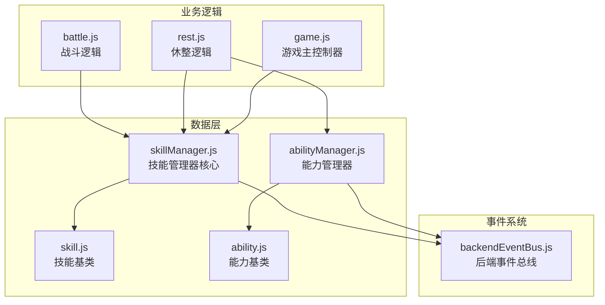
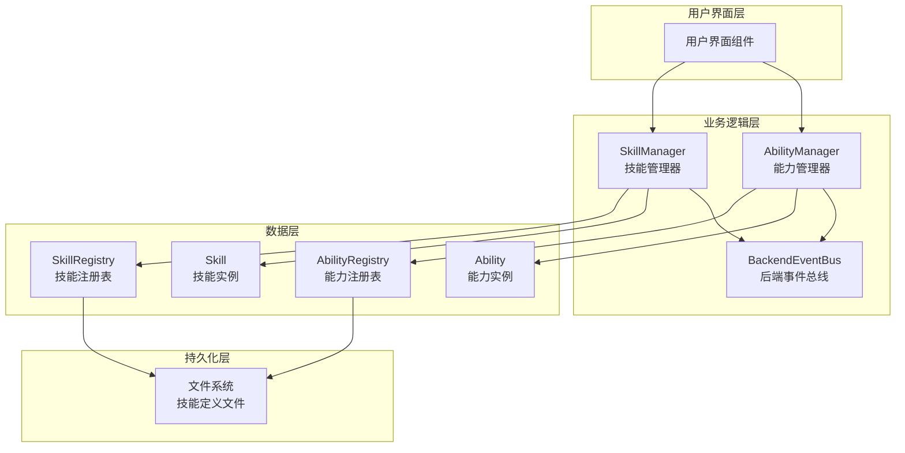
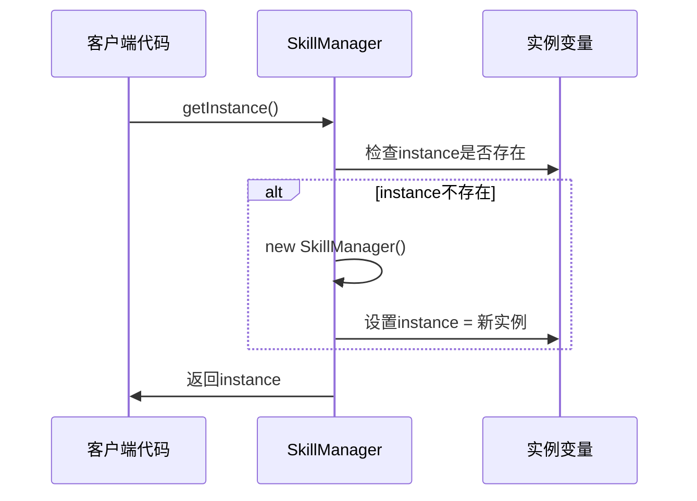
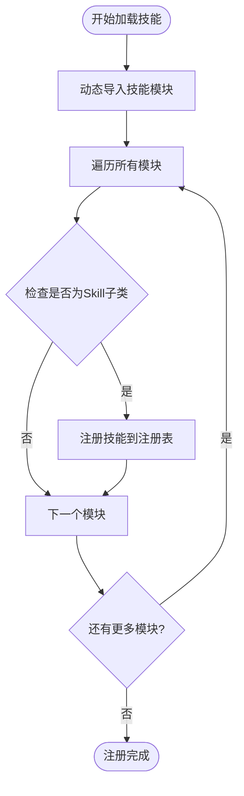
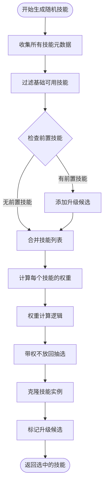
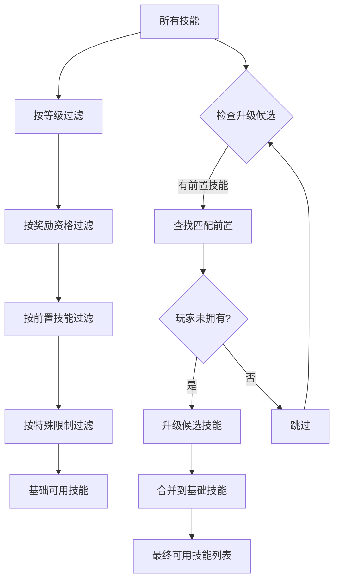
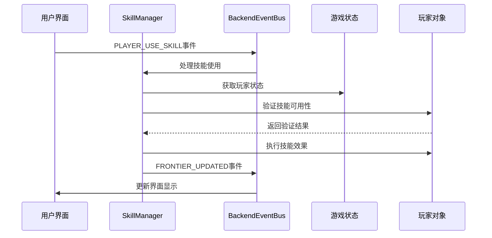
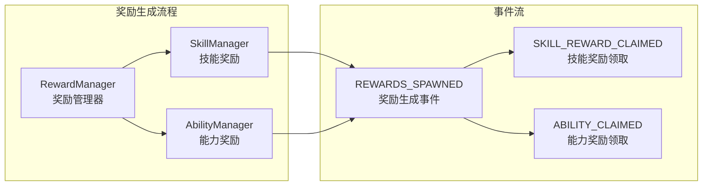
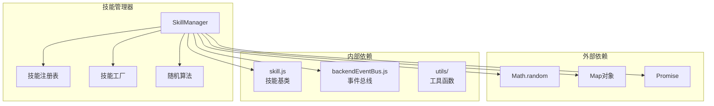

# 技能管理器实现

<cite>
**本文档中引用的文件**
- [skillManager.js](file://src/data/skillManager.js)
- [skill.js](file://src/data/skill.js)
- [abilityManager.js](file://src/data/abilityManager.js)
- [ability.js](file://src/data/ability.js)
- [backendEventBus.js](file://src/backendEventBus.js)
- [battle.js](file://src/data/battle.js)
- [rest.js](file://src/data/rest.js)
- [game.js](file://src/game.js)
- [main.js](file://src/main.js)
</cite>

## 目录
1. [简介](#简介)
2. [项目结构](#项目结构)
3. [核心组件](#核心组件)
4. [架构概览](#架构概览)
5. [详细组件分析](#详细组件分析)
6. [依赖关系分析](#依赖关系分析)
7. [性能考虑](#性能考虑)
8. [故障排除指南](#故障排除指南)
9. [结论](#结论)

## 简介

技能管理器（SkillManager）是RTVL游戏的核心组件之一，负责管理所有技能的生命周期、注册、实例化和随机生成。作为一个单例对象，它提供了全局访问点来管理游戏中的技能系统，包括技能注册表的构建、技能工厂方法的实现，以及复杂的随机技能生成算法。

该系统支持多种技能类型，包括武术技能、诅咒技能和其他特殊技能，并实现了智能的技能筛选机制，确保生成的技能符合玩家当前的游戏状态和等级。技能管理器与后端事件总线紧密集成，协同能力管理器共同实现奖励系统的完整功能。

## 项目结构

技能管理器相关的文件组织结构如下：



**图表来源**
- [skillManager.js](file://src/data/skillManager.js#L1-L253)
- [skill.js](file://src/data/skill.js#L1-L205)
- [abilityManager.js](file://src/data/abilityManager.js#L1-L118)

**章节来源**
- [skillManager.js](file://src/data/skillManager.js#L1-L253)
- [skill.js](file://src/data/skill.js#L1-L205)

## 核心组件

### SkillManager 类

SkillManager 是整个技能系统的核心类，采用单例模式设计，确保在整个游戏进程中只有一个技能管理器实例存在。

```javascript
class SkillManager {
  constructor() {
    this.skills = [];
    this.skillRegistry = new Map(); // 技能注册表
  }
  
  // 单例实例
  static getInstance() {
    if (!this.instance) {
      this.instance = new SkillManager();
    }
    return this.instance;
  }
}
```

### 技能注册表机制

技能注册表是一个 Map 数据结构，用于存储所有已注册的技能类：

```javascript
// 注册技能
registerSkill(SkillClass) {
  const skillName = (new SkillClass()).name;
  this.skillRegistry.set(skillName, SkillClass);
}
```

### 技能工厂方法

createSkill 方法提供了标准化的技能实例创建机制：

```javascript
createSkill(skillName) {
  const SkillClass = this.skillRegistry.get(skillName);
  if (SkillClass) {
    const obj = new SkillClass();
    obj.description = obj.regenerateDescription();
    return obj;
  }
  throw new Error(`Unknown skill: ${skillName}`);
}
```

**章节来源**
- [skillManager.js](file://src/data/skillManager.js#L1-L100)

## 架构概览

技能管理器的整体架构采用了分层设计模式，将技能的生命周期管理分为多个层次：



**图表来源**
- [skillManager.js](file://src/data/skillManager.js#L1-L253)
- [abilityManager.js](file://src/data/abilityManager.js#L1-L118)
- [backendEventBus.js](file://src/backendEventBus.js#L1-L80)

## 详细组件分析

### 单例初始化流程

技能管理器的单例初始化遵循标准的单例模式：



**图表来源**
- [skillManager.js](file://src/data/skillManager.js#L85-L92)

### 技能注册表构建过程

技能注册表的构建是一个动态加载和注册的过程：



**图表来源**
- [skillManager.js](file://src/data/skillManager.js#L25-L75)

### 随机技能生成算法

随机技能生成是最复杂的功能之一，涉及多维度的权重计算和筛选：



**图表来源**
- [skillManager.js](file://src/data/skillManager.js#L94-L253)

### 权重计算机制

权重计算是随机技能生成的核心算法：

```javascript
// 权重计算示例
const weightedSkills = availableSkills.map(skill => {
  const tierDifference = playerTier - skill.tier;
  let modifyFactor = 1;

  // 等级差异调整
  if (tierDifference > 7) {
    modifyFactor = 0.15;
  } else if (tierDifference > 6) {
    modifyFactor = 0.40;
  } else if (tierDifference > 5) {
    modifyFactor = 0.70;
  }

  // 灵脉耦合权重
  let leinoFactor = Math.max(playerLeino[skill.type] || 0.2, 0);
  if (skill.type === 'normal') {
    leinoFactor = Math.max(leinoFactor, 1);
  }
  modifyFactor *= leinoFactor;

  // leinoModifiers进一步影响
  if (skill.leinoModifiers) {
    const list = Array.isArray(skill.leinoModifiers) ? skill.leinoModifiers : [skill.leinoModifiers];
    const factors = list.map(key => {
      const v = playerLeino[key];
      return (typeof v === 'number' && v > 0) ? v : 1;
    });
    if (factors.length > 0) {
      const avg = factors.reduce((a,b)=>a+b,0) / factors.length;
      modifyFactor *= avg;
    }
  }

  return {
    ...skill,
    weight: skill.spawnWeight * modifyFactor
  };
});
```

### 技能筛选规则

系统实现了多层次的技能筛选机制：

1. **等级限制**：技能等阶 ≤ 玩家等阶
2. **奖励资格**：canSpawnAsReward_ = true
3. **前置条件**：precessor = null（自由出现）
4. **特殊限制**：tier ≥ 0（排除特殊卡）



**图表来源**
- [skillManager.js](file://src/data/skillManager.js#L115-L145)

**章节来源**
- [skillManager.js](file://src/data/skillManager.js#L94-L253)

### 与后端事件总线的交互

技能管理器与后端事件总线紧密集成，实现实时的状态同步：



**图表来源**
- [battle.js](file://src/data/battle.js#L440-L470)
- [backendEventBus.js](file://src/backendEventBus.js#L1-L80)

### 与能力管理器的协作

技能管理器与能力管理器协同工作，共同实现奖励系统的完整功能：



**图表来源**
- [rest.js](file://src/data/rest.js#L15-L50)
- [abilityManager.js](file://src/data/abilityManager.js#L1-L118)

**章节来源**
- [skillManager.js](file://src/data/skillManager.js#L94-L253)
- [battle.js](file://src/data/battle.js#L420-L490)
- [rest.js](file://src/data/rest.js#L1-L100)

## 依赖关系分析

技能管理器的依赖关系体现了清晰的分层架构：



**图表来源**
- [skillManager.js](file://src/data/skillManager.js#L1-L10)
- [skill.js](file://src/data/skill.js#L1-L10)

**章节来源**
- [skillManager.js](file://src/data/skillManager.js#L1-L253)

## 性能考虑

### 内存优化策略

1. **延迟加载**：技能模块采用动态导入，减少初始加载时间
2. **单例模式**：避免重复创建技能管理器实例
3. **对象复用**：技能实例通过工厂方法创建，避免重复构造

### 算法优化

1. **权重缓存**：计算后的权重值缓存，避免重复计算
2. **早期退出**：在权重为零时提前终止计算
3. **批量处理**：一次性处理多个技能的权重计算

### 并发处理

技能管理器支持异步操作，特别是在技能加载过程中：

```javascript
static async loadAllSkills() {
  const skillManager = SkillManager.getInstance();
  
  // 并行加载多个技能模块
  const skillModules = [
    await import('./skills/martial_arts/agilePunch.js'),
    await import('./skills/martial_arts/block.js'),
    // ... 更多技能模块
  ];
  
  // 并行处理所有模块
  for (const module of skillModules) {
    // 并行处理模块中的技能
  }
}
```

## 故障排除指南

### 常见错误及解决方案

#### 1. 技能注册失败

**错误现象**：控制台输出 `Failed to register skill: ${key}` 错误信息

**可能原因**：
- 技能类不是 Skill 的子类
- 技能类构造函数抛出异常
- 技能名称重复

**解决方案**：
```javascript
// 检查技能类继承关系
console.log(SkillClass.prototype instanceof Skill);

// 检查技能名称唯一性
const names = Array.from(skillManager.skillRegistry.keys());
console.log('重复技能名称：', names.filter((name, index) => names.indexOf(name) !== index));
```

#### 2. 随机技能生成失败

**错误现象**：`getRandomSkills` 方法返回空数组

**可能原因**：
- 玩家等级过高，没有合适的技能
- 所有技能都被过滤掉
- 权重计算结果为零

**解决方案**：
```javascript
// 检查可用技能数量
const allSkills = Array.from(skillManager.skillRegistry.entries());
const available = allSkills.filter(([name, SkillClass]) => {
  const skill = new SkillClass();
  return skill.tier <= playerTier && 
         skill.canSpawnAsReward_ && 
         skill.precessor === null;
});
console.log('可用技能数量：', available.length);
```

#### 3. 技能实例化失败

**错误现象**：`createSkill` 方法抛出 `Unknown skill` 错误

**可能原因**：
- 技能名称拼写错误
- 技能未正确注册
- 技能类文件加载失败

**解决方案**：
```javascript
// 检查技能注册状态
console.log('已注册技能：', Array.from(skillManager.skillRegistry.keys()));
console.log('技能是否存在：', skillManager.skillRegistry.has(skillName));
```

### 调试技巧

1. **启用详细日志**：在开发环境中开启详细的技能加载和生成日志
2. **技能状态检查**：定期检查技能注册表的状态
3. **权重可视化**：在调试模式下显示技能的权重分布

**章节来源**
- [skillManager.js](file://src/data/skillManager.js#L61-L75)

## 结论

技能管理器（SkillManager）作为RTVL游戏的核心组件，展现了优秀的软件设计原则和实现质量。通过单例模式确保了全局状态的一致性，通过注册表机制实现了灵活的技能管理，通过复杂的随机算法确保了游戏体验的多样性和平衡性。

### 主要优势

1. **模块化设计**：清晰的职责分离和接口定义
2. **性能优化**：合理的内存管理和算法优化
3. **可扩展性**：易于添加新的技能类型和功能
4. **稳定性**：完善的错误处理和边界条件检查

### 最佳实践建议

1. **技能开发**：遵循既定的技能基类规范
2. **性能监控**：定期检查技能加载和生成的性能指标
3. **测试覆盖**：为关键功能编写充分的单元测试
4. **文档维护**：及时更新技能相关的技术文档

技能管理器的设计不仅满足了当前游戏的需求，也为未来的功能扩展奠定了坚实的基础。通过持续的优化和改进，它将继续为玩家提供丰富而有趣的游戏体验。