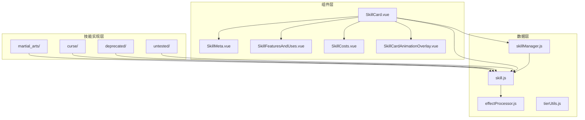
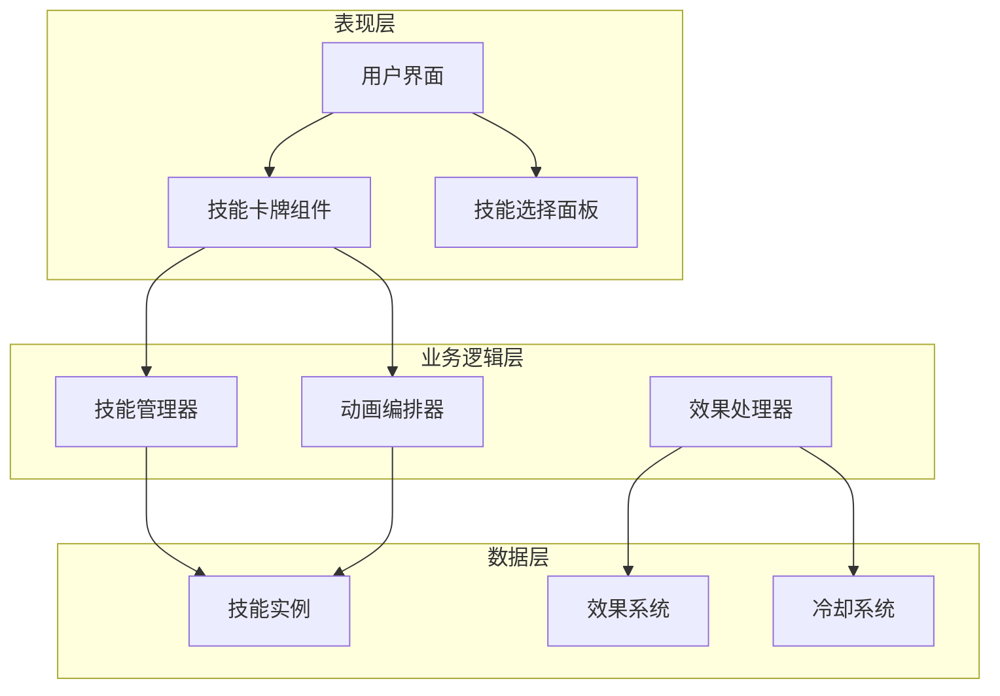
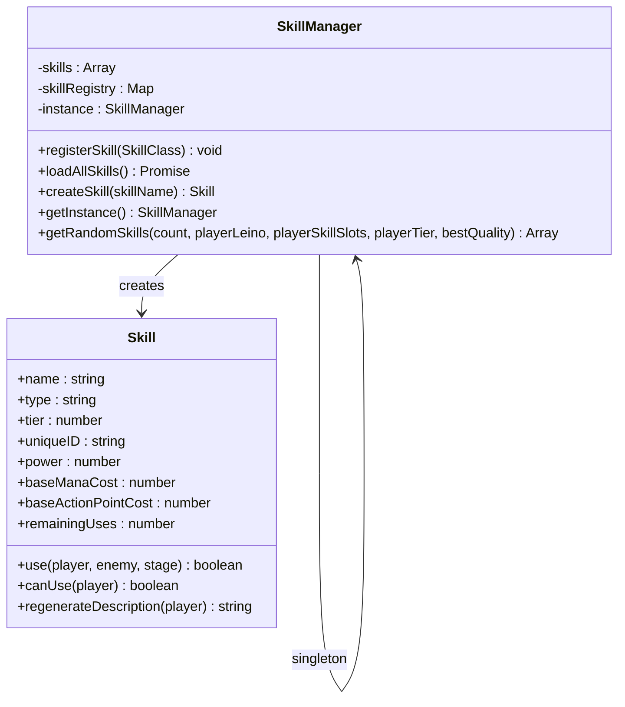
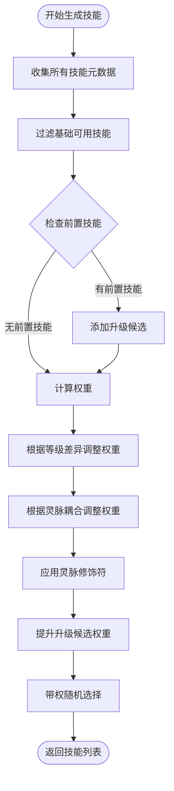
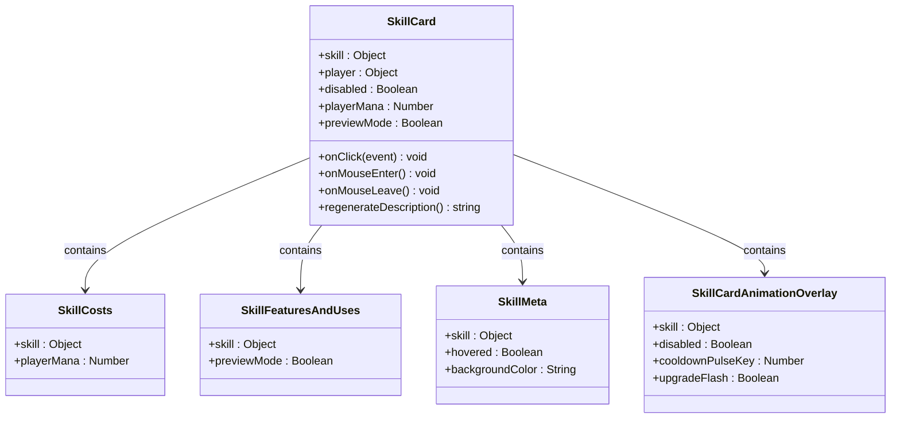
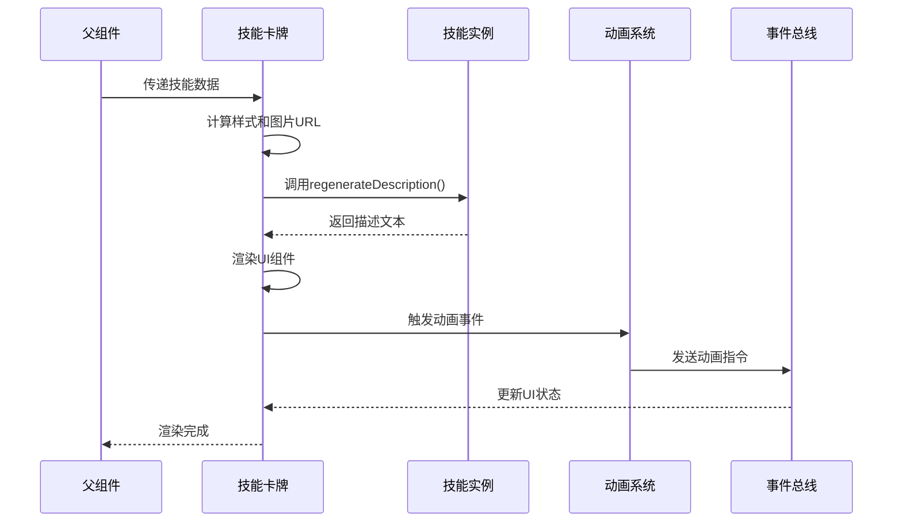
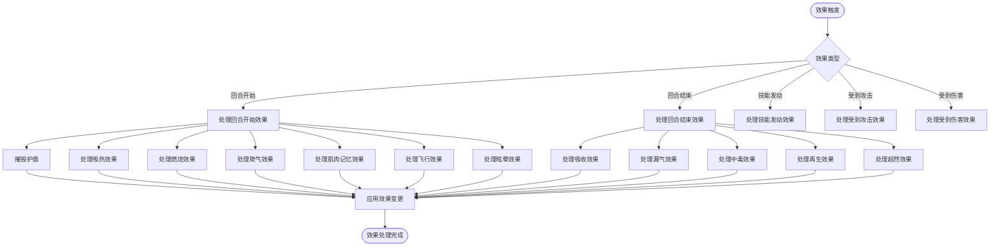
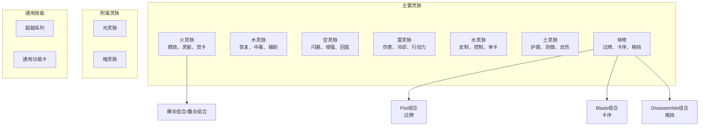
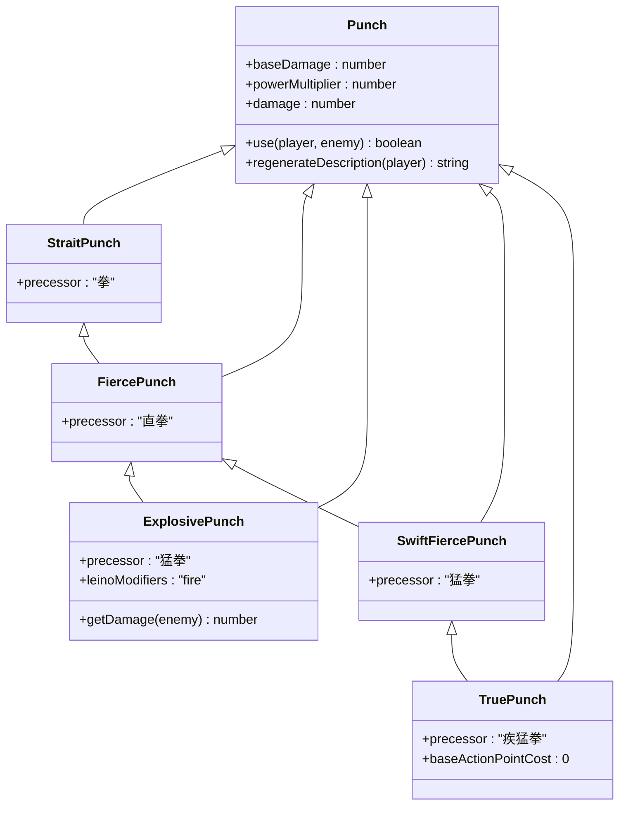
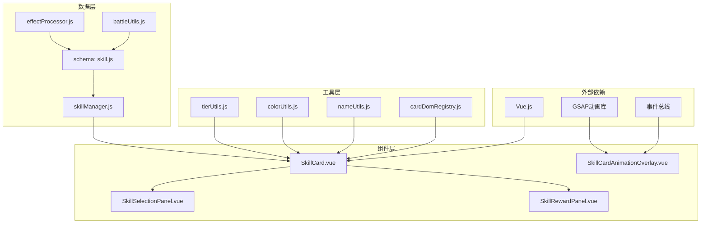

# 技能系统

<cite>
**本文档引用的文件**
- [skillManager.js](file://src/data/skillManager.js)
- [skill.js](file://src/data/skill.js)
- [SkillCard.vue](file://src/components/SkillCard.vue)
- [SkillCardAnimationOverlay.vue](file://src/components/SkillCardAnimationOverlay.vue)
- [SkillCosts.vue](file://src/components/skillCard/SkillCosts.vue)
- [SkillFeaturesAndUses.vue](file://src/components/skillCard/SkillFeaturesAndUses.vue)
- [SkillMeta.vue](file://src/components/skillCard/SkillMeta.vue)
- [effectProcessor.js](file://src/data/effectProcessor.js)
- [cardAnimationOrchestrator.js](file://src/utils/cardAnimationOrchestrator.js)
- [SkillSelectionPanel.vue](file://src/components/SkillSelectionPanel.vue)
- [SkillRewardPanel.vue](file://src/components/SkillRewardPanel.vue)
- [punch.js](file://src/data/skills/martial_arts/punch.js)
- [heavySmash.js](file://src/data/skills/martial_arts/heavySmash.js)
- [SKILL_DESIGN_PRINCIPLES.md](file://src/data/skills/SKILL_DESIGN_PRINCIPLES.md)
</cite>

## 目录
1. [简介](#简介)
2. [项目结构](#项目结构)
3. [核心组件](#核心组件)
4. [架构概览](#架构概览)
5. [详细组件分析](#详细组件分析)
6. [依赖关系分析](#依赖关系分析)
7. [性能考虑](#性能考虑)
8. [故障排除指南](#故障排除指南)
9. [结论](#结论)

## 简介

技能系统是RTVL游戏的核心机制之一，负责管理技能的注册、生成、使用和渲染。该系统采用了单例模式的技能管理器（SkillManager），结合Vue.js组件化架构，实现了完整的技能生命周期管理。系统支持多种类型的技能（武术类、咒术类等），具有复杂的随机化策略和动画效果。

## 项目结构

技能系统的文件组织遵循清晰的层次结构：



**图表来源**
- [skillManager.js](file://src/data/skillManager.js#L1-L253)
- [skill.js](file://src/data/skill.js#L1-L205)
- [SkillCard.vue](file://src/components/SkillCard.vue#L1-L236)

**章节来源**
- [skillManager.js](file://src/data/skillManager.js#L1-L253)
- [skill.js](file://src/data/skill.js#L1-L205)

## 核心组件

### 技能管理器（SkillManager）

技能管理器是整个技能系统的核心，采用单例模式确保全局唯一性：

```javascript
class SkillManager {
  constructor() {
    this.skills = [];
    this.skillRegistry = new Map();
  }
  
  static getInstance() {
    if (!this.instance) {
      this.instance = new SkillManager();
    }
    return this.instance;
  }
}
```

### 技能基类（Skill）

技能基类定义了所有技能的通用属性和行为：

```javascript
class Skill {
  constructor(name, type, tier, baseManaCost, baseActionPointCost, baseMaxUses, skillSeriesName = undefined, spawnWeight = undefined) {
    this.name = name;
    this.type = type;
    this.tier = tier;
    this.uniqueID = Math.random().toString(36).substring(2, 10);
    this.power = 0;
    this.baseManaCost = baseManaCost || 0;
    this.baseActionPointCost = (baseActionPointCost !== undefined) ? baseActionPointCost : 1;
    this.baseMaxUses = baseMaxUses || 1;
    this.remainingUses = this.maxUses;
    this.skillSeriesName = skillSeriesName || name;
    this.spawnWeight = spawnWeight || 1;
  }
}
```

**章节来源**
- [skillManager.js](file://src/data/skillManager.js#L1-L253)
- [skill.js](file://src/data/skill.js#L1-L205)

## 架构概览

技能系统采用分层架构设计，从底层的数据模型到顶层的用户界面：



**图表来源**
- [SkillCard.vue](file://src/components/SkillCard.vue#L1-L236)
- [skillManager.js](file://src/data/skillManager.js#L1-L253)
- [effectProcessor.js](file://src/data/effectProcessor.js#L1-L357)

## 详细组件分析

### 技能管理器详细分析

#### 单例模式实现

技能管理器使用经典的单例模式，确保在整个应用程序中只有一个实例：



**图表来源**
- [skillManager.js](file://src/data/skillManager.js#L1-L253)
- [skill.js](file://src/data/skill.js#L1-L205)

#### 技能注册机制

技能管理器通过动态导入机制自动注册所有技能：

```javascript
static async loadAllSkills() {
  const skillManager = SkillManager.getInstance();
  
  const skillModules = [
    await import('./skills/martial_arts/agilePunch.js'),
    await import('./skills/martial_arts/block.js'),
    // ... 更多技能模块
  ];
  
  for (const module of skillModules) {
    for (const [key, SkillClass] of Object.entries(module)) {
      if (typeof SkillClass === 'function' && 
          SkillClass !== Skill && 
          SkillClass.prototype instanceof Skill) {
        skillManager.registerSkill(SkillClass);
      }
    }
  }
}
```

#### 随机技能生成算法

技能管理器实现了复杂的随机化策略，考虑多个因素：



**图表来源**
- [skillManager.js](file://src/data/skillManager.js#L85-L253)

### 技能卡牌组件分析

#### 组件结构

技能卡牌是一个复杂的Vue组件，包含多个子组件：



**图表来源**
- [SkillCard.vue](file://src/components/SkillCard.vue#L1-L236)
- [SkillCosts.vue](file://src/components/skillCard/SkillCosts.vue#L1-L53)

#### 技能卡牌渲染机制

技能卡牌的渲染过程包括多个阶段：



**图表来源**
- [SkillCard.vue](file://src/components/SkillCard.vue#L1-L236)
- [cardAnimationOrchestrator.js](file://src/utils/cardAnimationOrchestrator.js#L1-L590)

### 技能效果处理流程

#### 效果处理系统

效果处理器负责管理游戏中的各种状态效果：



**图表来源**
- [effectProcessor.js](file://src/data/effectProcessor.js#L1-L357)

**章节来源**
- [SkillCard.vue](file://src/components/SkillCard.vue#L1-L236)
- [effectProcessor.js](file://src/data/effectProcessor.js#L1-L357)
- [cardAnimationOrchestrator.js](file://src/utils/cardAnimationOrchestrator.js#L1-L590)

### 技能树结构和分类体系

#### 技能分类体系

根据设计原则文档，技能分为多个类别：



**图表来源**
- [SKILL_DESIGN_PRINCIPLES.md](file://src/data/skills/SKILL_DESIGN_PRINCIPLES.md#L1-L98)

#### 技能继承关系

技能之间存在复杂的继承关系：



**图表来源**
- [punch.js](file://src/data/skills/martial_arts/punch.js#L1-L89)
- [heavySmash.js](file://src/data/skills/martial_arts/heavySmash.js#L1-L47)

**章节来源**
- [punch.js](file://src/data/skills/martial_arts/punch.js#L1-L89)
- [heavySmash.js](file://src/data/skills/martial_arts/heavySmash.js#L1-L47)
- [SKILL_DESIGN_PRINCIPLES.md](file://src/data/skills/SKILL_DESIGN_PRINCIPLES.md#L1-L98)

## 依赖关系分析

技能系统的依赖关系呈现清晰的层次结构：



**图表来源**
- [skillManager.js](file://src/data/skillManager.js#L1-L10)
- [SkillCard.vue](file://src/components/SkillCard.vue#L1-L30)
- [cardAnimationOrchestrator.js](file://src/utils/cardAnimationOrchestrator.js#L1-L20)

**章节来源**
- [skillManager.js](file://src/data/skillManager.js#L1-L253)
- [SkillCard.vue](file://src/components/SkillCard.vue#L1-L30)

## 性能考虑

### 技能加载优化

技能管理系统采用了异步动态导入技术，避免一次性加载所有技能：

```javascript
// 异步加载所有技能模块
const skillModules = [
  await import('./skills/martial_arts/agilePunch.js'),
  await import('./skills/martial_arts/block.js'),
  // ... 按需加载
];
```

### 内存管理

技能管理器使用Map结构存储技能注册表，提供O(1)的查找性能：

```javascript
this.skillRegistry = new Map(); // O(1)查找性能
```

### 动画性能优化

动画编排器使用GSAP库，提供了高性能的CSS变换动画：

- 使用GPU加速的3D变换
- 队列化动画任务，避免冲突
- 支持动画中断和清理

## 故障排除指南

### 常见问题及解决方案

#### 技能无法加载

**问题症状**：技能管理器无法找到或注册技能

**排查步骤**：
1. 检查技能文件是否正确导出
2. 验证技能类是否继承自Skill基类
3. 确认技能文件路径正确

**解决方案**：
```javascript
// 确保技能文件正确导出
export class MySkill extends Skill {
  // 技能实现
}

// 在skillManager.js中确认导入路径
await import('./skills/mySkill.js');
```

#### 技能动画异常

**问题症状**：技能卡牌动画不正常或卡顿

**排查步骤**：
1. 检查GSAP库是否正确加载
2. 验证CSS样式是否冲突
3. 确认DOM元素是否存在

**解决方案**：
```javascript
// 确保动画元素正确注册
mounted() {
  if (this.autoRegisterInRegistry) {
    registerCardEl(this.skill?.uniqueID, this.$refs.root, this.skill.uniqueID);
  }
}
```

#### 技能效果处理错误

**问题症状**：技能效果不生效或计算错误

**排查步骤**：
1. 检查效果处理器的调用时机
2. 验证效果状态的正确设置
3. 确认效果计算逻辑

**解决方案**：
```javascript
// 确保效果正确应用
processStartOfTurnEffects(target) {
  if (target.effects['燃烧'] > 0) {
    let damage = target.effects['燃烧'];
    damage -= target.effects['火焰抗性'] || 0;
    target.addEffect('燃烧', -1);
    dealDamage(null, target, damage);
  }
}
```

**章节来源**
- [skillManager.js](file://src/data/skillManager.js#L25-L80)
- [cardAnimationOrchestrator.js](file://src/utils/cardAnimationOrchestrator.js#L1-L100)
- [effectProcessor.js](file://src/data/effectProcessor.js#L1-L100)

## 结论

RTVL游戏的技能系统展现了优秀的软件架构设计，通过单例模式的技能管理器、组件化的Vue.js界面、以及完善的动画系统，实现了功能丰富且性能优异的技能管理机制。

### 主要特点总结

1. **模块化设计**：清晰的职责分离，便于维护和扩展
2. **性能优化**：异步加载、内存管理和动画优化
3. **灵活性**：支持多种技能类型和复杂的继承关系
4. **用户体验**：丰富的动画效果和交互反馈
5. **可扩展性**：易于添加新的技能类型和效果

### 技术亮点

- **单例模式的应用**：确保技能管理器的全局唯一性
- **动态技能注册**：自动发现和注册新技能
- **智能随机化**：基于玩家状态和技能特性的权重计算
- **完整的生命周期管理**：从创建到销毁的全过程控制
- **丰富的动画系统**：多层次的视觉反馈机制

这个技能系统为RTVL游戏提供了坚实的技术基础，支持了复杂的游戏玩法和丰富的技能体验。通过持续的优化和扩展，它将继续支撑游戏的发展和创新。