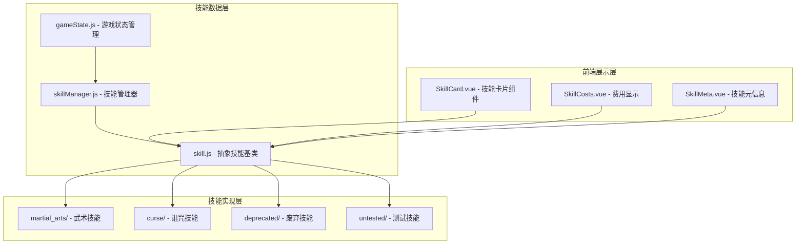
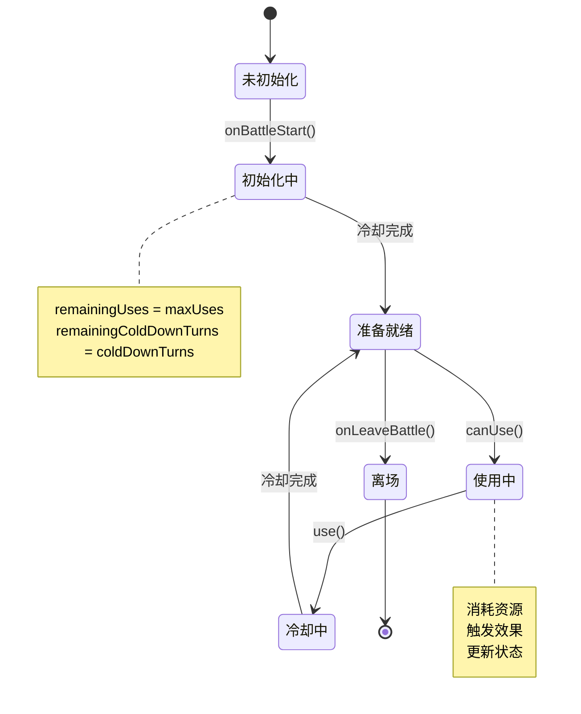
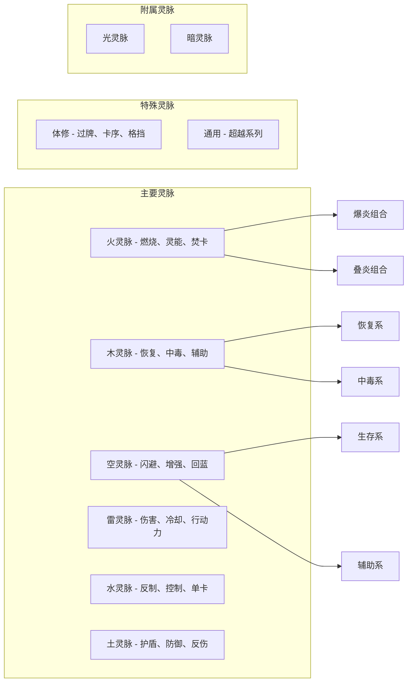
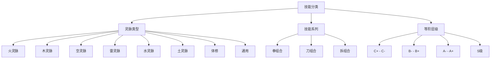
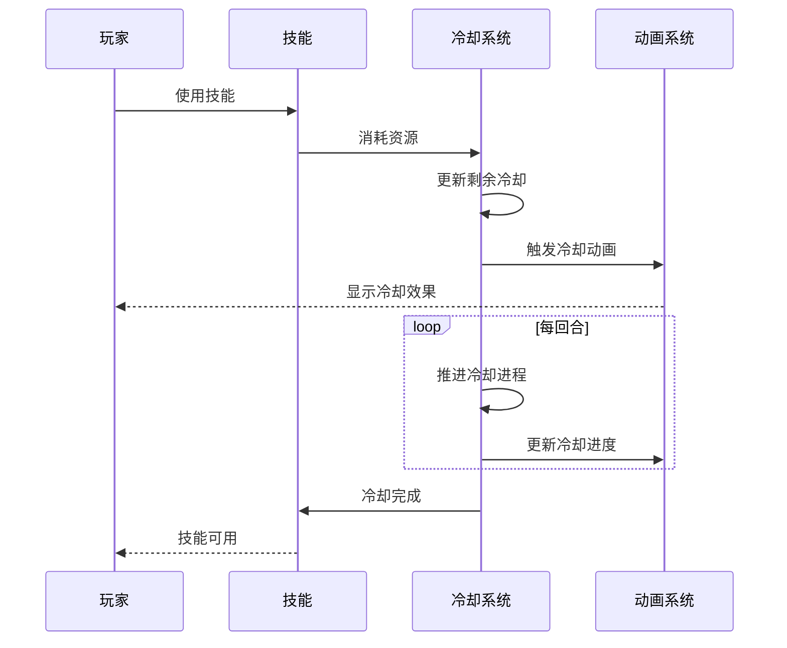
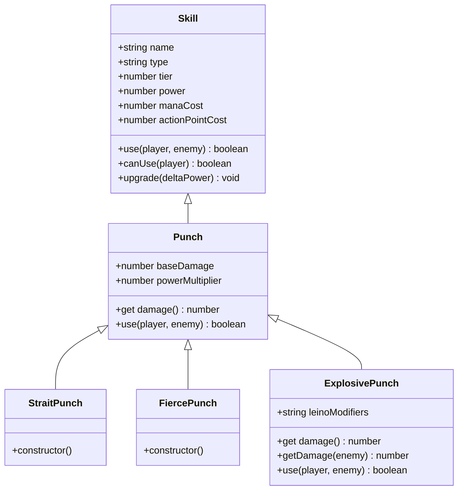
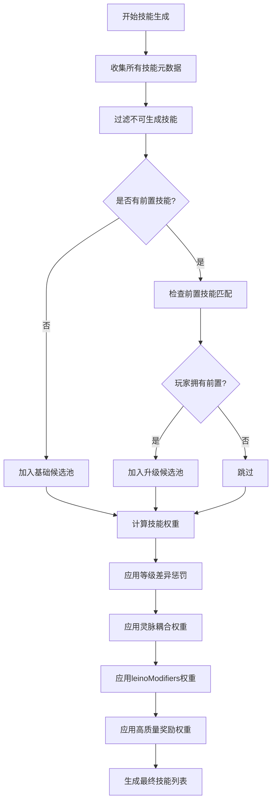
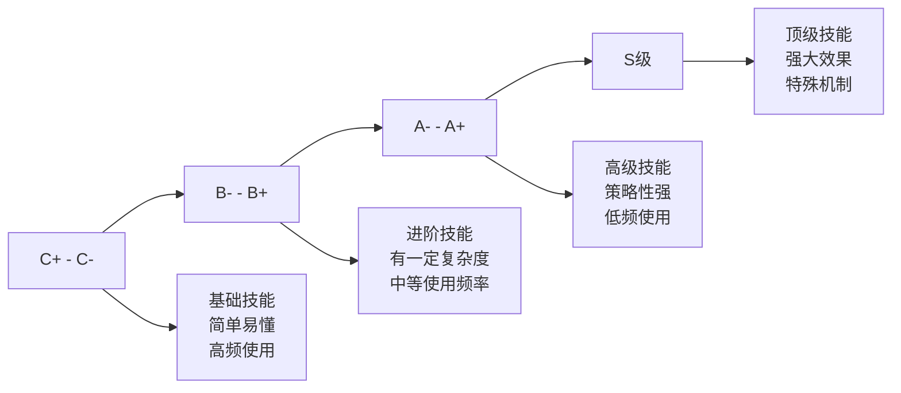
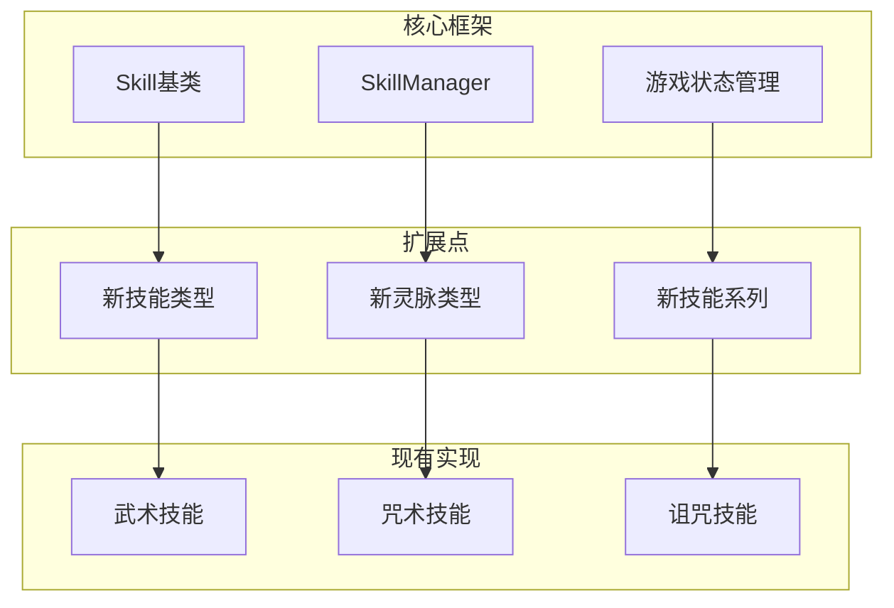

# 技能设计原则

<cite>
**本文档中引用的文件**
- [SKILL_DESIGN_PRINCIPLES.md](file://src/data/skills/SKILL_DESIGN_PRINCIPLES.md)
- [skill.js](file://src/data/skill.js)
- [gameState.js](file://src/data/gameState.js)
- [skillManager.js](file://src/data/skillManager.js)
- [player.js](file://src/data/player.js)
- [peakMartialArt.js](file://src/data/skills/martial_arts/peakMartialArt.js)
- [punch.js](file://src/data/skills/martial_arts/punch.js)
- [slash.js](file://src/data/skills/martial_arts/slash.js)
- [block.js](file://src/data/skills/martial_arts/block.js)
- [heavySmash.js](file://src/data/skills/martial_arts/heavySmash.js)
- [SkillCard.vue](file://src/components/SkillCard.vue)
</cite>

## 目录
1. [引言](#引言)
2. [项目结构概览](#项目结构概览)
3. [技能系统核心架构](#技能系统核心架构)
4. [技能设计哲学](#技能设计哲学)
5. [技能分类体系](#技能分类体系)
6. [技能核心属性设计](#技能核心属性设计)
7. [技能继承与复用机制](#技能继承与复用机制)
8. [技能管理器架构](#技能管理器架构)
9. [平衡性设计原则](#平衡性设计原则)
10. [可扩展性策略](#可扩展性策略)
11. [具体实现示例](#具体实现示例)
12. [总结](#总结)

## 引言

本技能设计原则文档基于RTVL游戏项目的技能系统架构，深入分析了技能设计的整体哲学、架构规范以及实现细节。该系统采用了高度模块化的设计理念，支持灵活的技能扩展和平衡性调整，为游戏提供了丰富多样的技能体验。

技能系统的核心目标是：
- 提供清晰的技能分类体系
- 实现高效的技能管理和动态加载
- 支持复杂的技能继承和升级机制
- 确保良好的性能表现和可维护性

## 项目结构概览

技能系统在项目中的组织结构体现了清晰的分层设计：



**图表来源**
- [skill.js](file://src/data/skill.js#L1-L205)
- [skillManager.js](file://src/data/skillManager.js#L1-L253)
- [gameState.js](file://src/data/gameState.js#L1-L75)

## 技能系统核心架构

### 抽象技能基类设计

技能系统的核心是`Skill`抽象类，它定义了所有技能的基本属性和行为：

```javascript
class Skill {
  constructor(name, type, tier, baseManaCost, baseActionPointCost, baseMaxUses, skillSeriesName = undefined, spawnWeight = undefined) {
    this.name = name;
    this.type = type;
    this.tier = tier;
    this.uniqueID = Math.random().toString(36).substring(2, 10);
    this.power = 0;
    this.subtitle = '';
    this.baseManaCost = baseManaCost || 0;
    this.baseActionPointCost = (baseActionPointCost !== undefined) ? baseActionPointCost : 1;
    this.baseMaxUses = baseMaxUses || 1;
    this.remainingUses = this.maxUses;
    this.skillSeriesName = skillSeriesName || name;
    this.spawnWeight = spawnWeight || 1;
    this.remainingColdDownTurns = 0;
    this.baseColdDownTurns = 0;
    this.baseSlowStart = false;
    this.canSpawnAsReward_ = true;
    this.cardMode = 'normal';
    this.precessor = null;
    this.leinoModifiers = [];
  }
}
```

### 技能生命周期管理



**节点来源**
- [skill.js](file://src/data/skill.js#L120-L150)

**节点来源**
- [skill.js](file://src/data/skill.js#L1-L205)

## 技能设计哲学

### 系列化设计理念

技能系统遵循"优先设计系列技能"的原则，确保技能之间存在合理的关联性和递进关系：

1. **系列技能比例**：建议（1系列:1单卡）的比例
2. **体系内交互**：同类技能内部形成紧密的交互网络
3. **体系间差异**：不同体系间保持适度的差异化

### 灵脉系统设计

系统包含九种主要灵脉类型，每种都有其独特的元素侧重和交互机制：



**图表来源**
- [SKILL_DESIGN_PRINCIPLES.md](file://src/data/skills/SKILL_DESIGN_PRINCIPLES.md#L1-L98)

## 技能分类体系

### 灵脉分类逻辑

技能按照所属灵脉进行分类，这种设计提供了以下优势：

1. **元素相性**：相同或相性好的灵脉技能更容易协同
2. **主题统一**：同一灵脉内的技能具有相似的主题和机制
3. **平衡控制**：通过灵脉权重调节技能出现概率

### 体系内分层

每个灵脉内部还分为两个主要体系，体系内交互最为紧密：



**图表来源**
- [SKILL_DESIGN_PRINCIPLES.md](file://src/data/skills/SKILL_DESIGN_PRINCIPLES.md#L1-L98)

## 技能核心属性设计

### 基础属性定义

技能的核心属性通过构造函数统一管理：

```javascript
// 技能基础属性
this.name = name;                    // 技能名称
this.type = type;                    // 灵脉类型
this.tier = tier;                    // 等阶
this.uniqueID = Math.random().toString(36).substring(2, 10);
this.power = 0;                      // 强化/弱化系数
this.subtitle = '';                  // 副标题
this.baseManaCost = baseManaCost || 0;           // 魏启消耗
this.baseActionPointCost = baseActionPointCost !== undefined ? baseActionPointCost : 1; // 行动点消耗
this.baseMaxUses = baseMaxUses || 1;             // 基础最大充能次数
this.skillSeriesName = skillSeriesName || name;  // 技能系列名称
this.spawnWeight = spawnWeight || 1;             // 出现权重
```

### 动态属性计算

技能系统实现了动态属性计算机制，允许根据玩家状态实时调整技能效果：

```javascript
// 动态属性getter
get manaCost() {
  return Math.max(this.baseManaCost, 0);
}

get maxUses() {
  return this.baseMaxUses;
}

get actionPointCost() {
  return Math.max(this.baseActionPointCost, 0);
}

get coldDownTurns() {
  return Math.max(this.baseColdDownTurns, 0);
}
```

### 冷却系统设计

冷却系统支持多种冷却模式和动态调整：



**图表来源**
- [skill.js](file://src/data/skill.js#L80-L120)

**节点来源**
- [skill.js](file://src/data/skill.js#L1-L205)

## 技能继承与复用机制

### 基础技能模板

系统采用继承模式设计技能，通过基础类提供通用功能：

```javascript
// 基础拳技能
export class Punch extends Skill {
  constructor(name='拳', tier = SkillTier.D, baseDamage = 6, powerMultiplier = 2, apCost = 1) {
    super(name, 'normal', tier, 0, apCost, Infinity, '拳');
    this.baseDamage = baseDamage;
    this.powerMultiplier = powerMultiplier;
  }

  get damage() {
    return Math.max(this.baseDamage + this.powerMultiplier * this.power, 3);
  }

  use(player, enemy) {
    launchAttack(player, enemy, this.damage);
    return true;
  }
}
```

### 升级链设计

技能支持完整的升级链，每个技能都可以从基础版本进化到高级版本：



**图表来源**
- [punch.js](file://src/data/skills/martial_arts/punch.js#L1-L89)

### 前置技能机制

系统支持复杂的前置技能要求，确保技能解锁的合理性：

```javascript
// 技能前置关系
this.precessor = '入门';     // 习武需要入门
this.precessor = '习武';     // 精通需要习武
this.precessor = '精通';     // 卓绝需要精通
this.precessor = '猛拳';     // 爆拳需要猛拳
```

**节点来源**
- [punch.js](file://src/data/skills/martial_arts/punch.js#L1-L89)
- [peakMartialArt.js](file://src/data/skills/martial_arts/peakMartialArt.js#L1-L108)

## 技能管理器架构

### 动态技能加载

技能管理器采用动态加载机制，支持运行时技能注册和管理：

```javascript
class SkillManager {
  constructor() {
    this.skills = [];
    this.skillRegistry = new Map();
  }

  registerSkill(SkillClass) {
    const skillName = (new SkillClass()).name;
    this.skillRegistry.set(skillName, SkillClass);
  }

  static async loadAllSkills() {
    const skillManager = SkillManager.getInstance();
    
    // 动态导入所有技能文件
    const skillModules = [
      await import('./skills/martial_arts/agilePunch.js'),
      await import('./skills/martial_arts/block.js'),
      // ... 更多技能模块
    ];
    
    // 遍历所有模块并注册其中的技能
    for (const module of skillModules) {
      for (const [key, SkillClass] of Object.entries(module)) {
        if (typeof SkillClass === 'function' && 
            SkillClass !== Skill && 
            SkillClass.prototype instanceof Skill) {
          skillManager.registerSkill(SkillClass);
        }
      }
    }
  }
}
```

### 技能生成算法

技能管理器实现了智能的技能生成算法，考虑多个因素：



**图表来源**
- [skillManager.js](file://src/data/skillManager.js#L150-L200)

**节点来源**
- [skillManager.js](file://src/data/skillManager.js#L1-L253)

## 平衡性设计原则

### 等阶系统

技能系统采用五级等阶体系，每个等级都有明确的定位和作用：



### 成本与收益平衡

系统通过多种成本机制确保技能使用的平衡性：

1. **行动点消耗**：每个技能都有相应的行动点成本
2. **魏启消耗**：魔法技能需要消耗魏启
3. **冷却时间**：技能使用后需要冷却才能再次使用
4. **充能限制**：部分技能有最大充能次数限制

### 灵脉耦合设计

不同灵脉之间的技能相互影响，鼓励玩家进行策略性搭配：

```javascript
// 灵脉权重计算
let leinoFactor = Math.max(playerLeino[skill.type] || 0.2, 0);
if (skill.type === 'normal') leinoFactor = Math.max(leinoFactor, 1);

// 多元素影响
if (skill.leinoModifiers) {
  const list = Array.isArray(skill.leinoModifiers) ? skill.leinoModifiers : [skill.leinoModifiers];
  const factors = list.map(key => {
    const v = playerLeino[key];
    return (typeof v === 'number' && v > 0) ? v : 1;
  });
  if (factors.length > 0) {
    const avg = factors.reduce((a,b)=>a+b,0) / factors.length;
    modifyFactor *= avg;
  }
}
```

## 可扩展性策略

### 插件化架构

技能系统采用插件化架构，支持轻松添加新的技能类型：



### 统一接口规范

所有技能都必须实现统一的接口，确保系统的一致性：

```javascript
// 必须实现的方法
use(player, enemy, stage) {
  // 技能核心逻辑
  return true;
}

canUse(player) {
  // 判断技能是否可用
  return player.mana >= this.manaCost && 
         player.remainingActionPoints >= this.actionPointCost && 
         this.remainingUses > 0;
}

regenerateDescription(player) {
  // 重新生成技能描述
  return '';
}
```

### 前端组件化

技能卡片组件采用Vue.js组件化设计，支持灵活的UI定制：

```javascript
// 技能卡片组件结构
export default {
  name: 'SkillCard',
  components: { 
    ColoredText, 
    SkillCosts, 
    SkillFeaturesAndUses: SkillFeaturesAndUses, 
    SkillMeta, 
    SkillCardAnimationOverlay 
  },
  props: {
    skill: { type: Object, required: true },
    player: { type: Object, default: null },
    disabled: { type: Boolean, default: false },
    playerMana: { type: Number, default: Infinity },
    previewMode: { type: Boolean, default: false }
  }
};
```

**节点来源**
- [SkillCard.vue](file://src/components/SkillCard.vue#L1-L236)

## 具体实现示例

### 咏唱型技能实现

系统支持特殊的咏唱型技能，这类技能进入咏唱位后持续生效：

```javascript
// 咏唱型技能基类
class BasicPeakMartialArt extends Skill {
  constructor(name = '入门', tier = SkillTier.C_PLUS, baseDamagePerDraw = 1, apCost = 2, coldDownTurns = 0) {
    super(name, 'normal', tier, 0, apCost, 1, '武学');
    this.cardMode = 'chant';  // 咏唱模式
    this.baseDamagePerDraw = baseDamagePerDraw;
    this.baseColdDownTurns = coldDownTurns;
  }

  onEnable(player) {
    super.onEnable(player);
    this.listener_ = (_) => {
      const gs = backendGameState;
      const enemy = gs?.enemy;
      if (!enemy || !gs || gs.gameStage !== 'battle') return;
      
      const modPlayer = gs.player.getModifiedPlayer ? gs.player.getModifiedPlayer() : gs.player;
      launchAttack(modPlayer, enemy, this.damagePerDraw);
    };
    backendEventBus.on(EventNames.Player.SKILL_DRAWN, this.listener_);
  }
}
```

### 复杂技能实现

系统支持复杂的技能逻辑，如带有阶段的技能：

```javascript
// 带阶段的技能实现
use(player, enemy, stage) {
  if(stage === 0) {
    const atkPassThroughDamage = launchAttack(player, enemy, this.damage).passThoughDamage;
    return atkPassThroughDamage <= 0;
  } else {
    enemy.addEffect('易伤', this.stack);
    return true;
  }
}
```

### 冷启动技能

系统支持冷启动技能，这类技能需要先冷却才能使用：

```javascript
// 冷启动技能初始化
onBattleStart() {
  if(!this.slowStart) {
    this.remainingUses = this.maxUses;
    this.remainingColdDownTurns = this.coldDownTurns;
  } else {
    // 冷启动卡牌必须等待冷却后才能发动！
    this.remainingUses = 0;
    this.remainingColdDownTurns = this.coldDownTurns;
  }
}
```

**节点来源**
- [peakMartialArt.js](file://src/data/skills/martial_arts/peakMartialArt.js#L1-L108)
- [heavySmash.js](file://src/data/skills/martial_arts/heavySmash.js#L1-L47)
- [skill.js](file://src/data/skill.js#L120-L150)

## 总结

RTVL游戏的技能设计原则体现了现代游戏开发的最佳实践，通过以下关键特性实现了优秀的技能系统：

### 设计优势

1. **模块化架构**：清晰的分层设计，便于维护和扩展
2. **灵活的继承机制**：支持复杂的技能升级链和前置关系
3. **智能的平衡系统**：多层次的成本控制和权重计算
4. **优秀的可扩展性**：插件化架构支持快速添加新内容
5. **完善的生命周期管理**：从创建到销毁的完整状态跟踪

### 技术特色

- **动态技能加载**：运行时动态注册和管理技能
- **响应式状态管理**：基于Vue.js的状态更新机制
- **事件驱动架构**：通过事件总线实现松耦合通信
- **组件化UI设计**：可复用的技能卡片组件

### 应用价值

这套技能设计原则不仅适用于RTVL游戏，也为其他类似项目提供了宝贵的参考经验。通过遵循这些设计原则，开发者可以构建出既有趣又平衡的技能系统，为玩家提供丰富的游戏体验。

技能系统的设计充分体现了"简单易懂、复杂有趣"的理念，既让新手玩家能够快速上手，又为高手玩家提供了深度的策略空间。这种平衡性的把握是优秀游戏设计的关键所在。