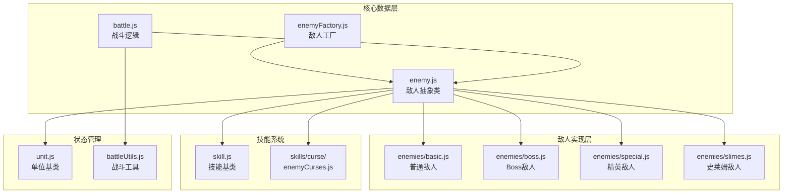
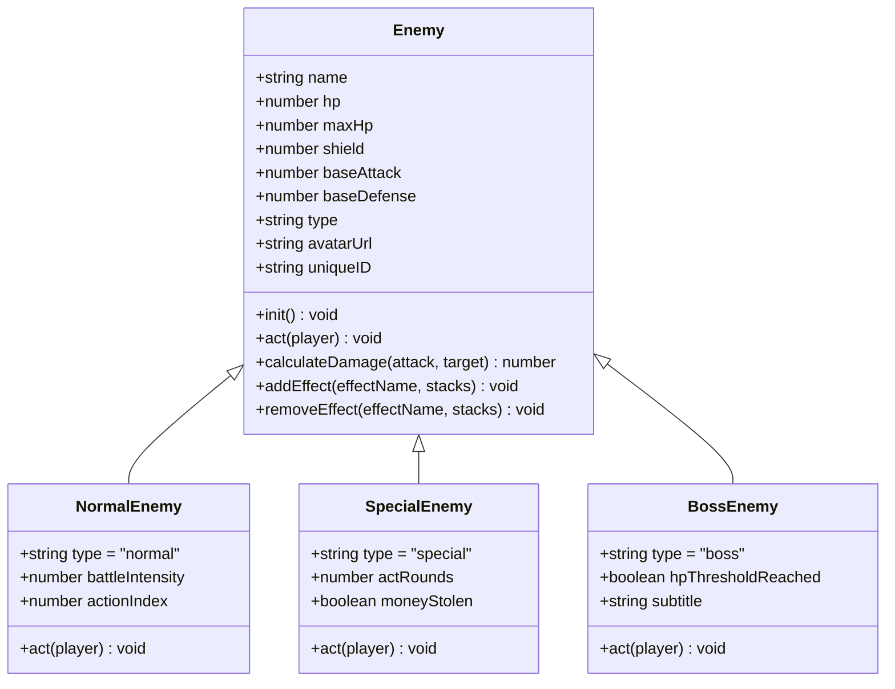
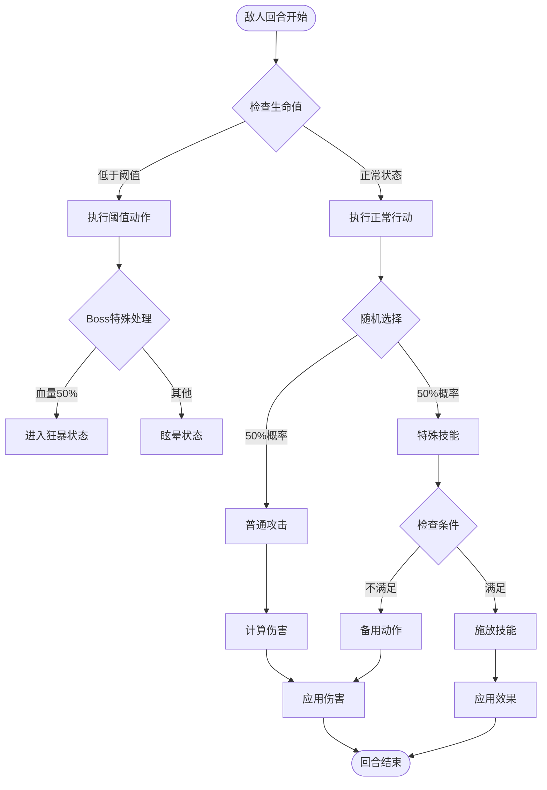
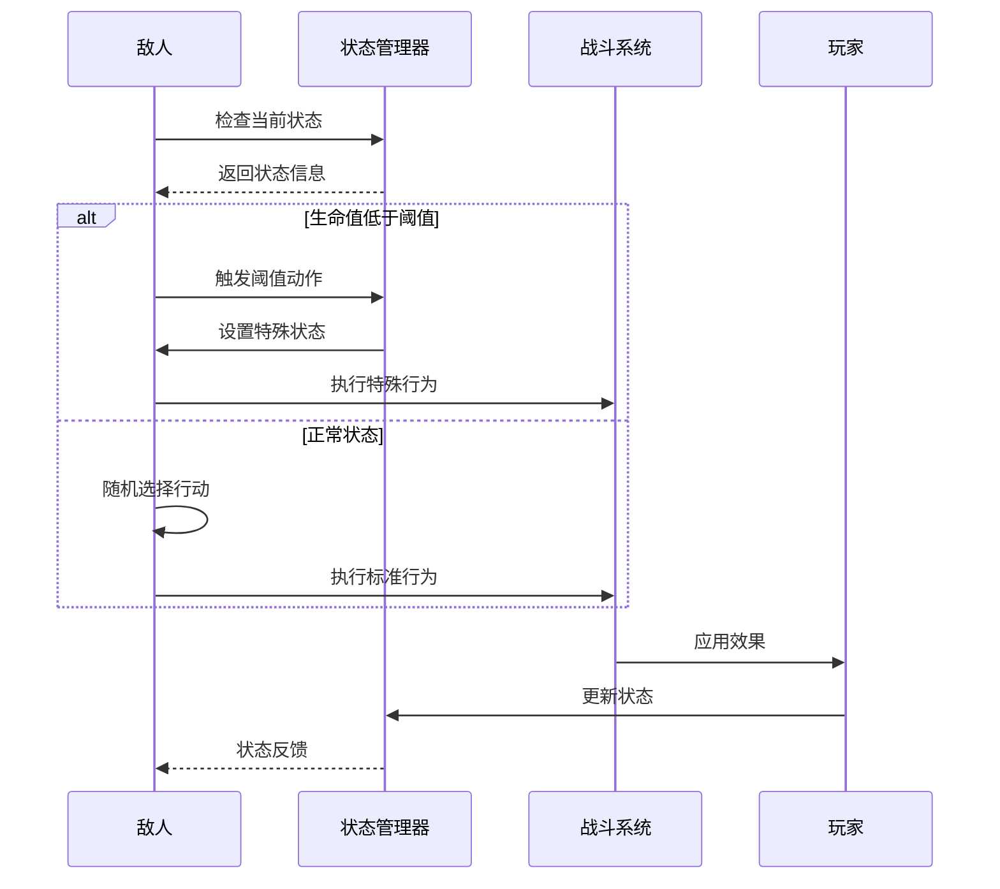
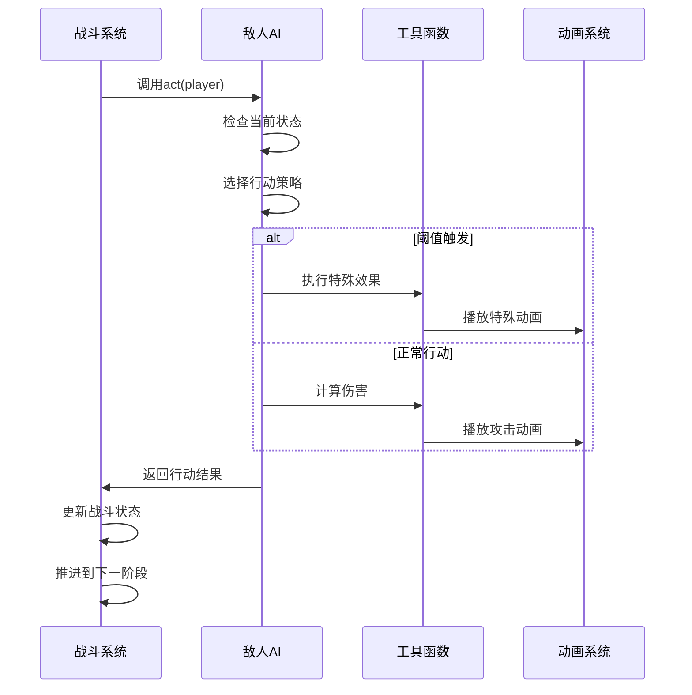
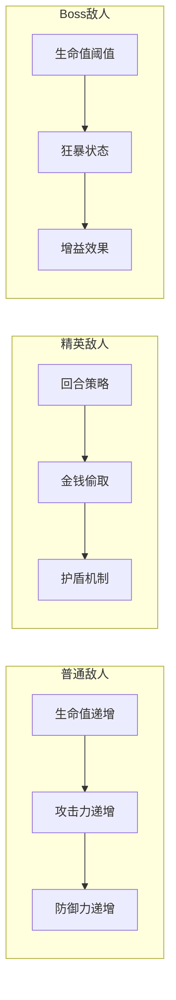

# 敌人AI行为系统

<cite>
**本文档引用的文件**
- [enemy.js](file://src/data/enemy.js)
- [battle.js](file://src/data/battle.js)
- [enemyFactory.js](file://src/data/enemyFactory.js)
- [skill.js](file://src/data/skill.js)
- [unit.js](file://src/data/unit.js)
- [enemyCurses.js](file://src/data/skills/curse/enemyCurses.js)
- [slimes.js](file://src/data/enemies/slimes.js)
- [special.js](file://src/data/enemies/special.js)
- [basic.js](file://src/data/enemies/basic.js)
- [boss.js](file://src/data/enemies/boss.js)
</cite>

## 目录
1. [简介](#简介)
2. [项目结构概览](#项目结构概览)
3. [核心组件分析](#核心组件分析)
4. [AI决策机制](#ai决策机制)
5. [行为模式详解](#行为模式详解)
6. [战斗系统集成](#战斗系统集成)
7. [难度平衡机制](#难度平衡机制)
8. [调试与优化建议](#调试与优化建议)
9. [总结](#总结)

## 简介

本文档深入分析了游戏中的敌人AI行为系统，重点关注enemy.js中定义的敌人抽象类以及其衍生的具体敌人实现。该系统采用基于回合制的决策机制，结合状态管理、技能选择策略和动态行为调整，为玩家提供具有挑战性的战斗体验。

敌人AI系统的核心特点包括：
- 分层的敌人类型体系（普通、精英、Boss）
- 基于状态的决策树行为模式
- 动态技能权重调整机制
- 复杂的战斗交互逻辑
- 可扩展的行为框架

## 项目结构概览

敌人AI系统主要分布在以下关键文件中：



**图表来源**
- [enemy.js](file://src/data/enemy.js#L1-L44)
- [battle.js](file://src/data/battle.js#L1-L50)
- [enemyFactory.js](file://src/data/enemyFactory.js#L1-L88)

## 核心组件分析

### 敌人抽象类 (Enemy)

Enemy类是整个敌人AI系统的基础抽象类，继承自Unit类，提供了所有敌人共有的属性和方法：

```javascript
// 敌人基础属性
this.name = name;           // 敌人名称
this.hp = hp;              // 当前生命值
this.maxHp = hp;           // 最大生命值
this.shield = 0;           // 当前护盾
this.baseAttack = attack;  // 基础攻击力
this.baseDefense = defense;// 基础防御力
this.type = 'normal';      // 敌人类型
this.avatarUrl = avatarUrl; // 敌人头像
```

### 敌人类型分类

系统支持三种主要的敌人类型：



**图表来源**
- [enemy.js](file://src/data/enemy.js#L3-L44)
- [basic.js](file://src/data/enemies/basic.js#L1-L50)
- [special.js](file://src/data/enemies/special.js#L1-L53)

**章节来源**
- [enemy.js](file://src/data/enemy.js#L1-L44)
- [unit.js](file://src/data/unit.js#L1-L143)

## AI决策机制

### 决策树架构

敌人AI采用基于决策树的行为模式，每种敌人类型都有其独特的决策逻辑：



**图表来源**
- [slimes.js](file://src/data/enemies/slimes.js#L25-L42)
- [boss.js](file://src/data/enemies/boss.js#L34-L153)

### 随机选择机制

大多数敌人采用基于概率的随机选择策略：

```javascript
// 火史莱姆的随机行为选择
if (Math.random() < 0.5) {
  // 普通攻击
  const damage = this.calculateDamage(this.attack, player);
  addEnemyActionLog(`${this.name}冲击！`);
  launchAttack(this, player, damage);
} else {
  // 燃烧攻击：造成伤害并附加燃烧效果
  const damage = this.calculateDamage(this.magic, player);
  addEnemyActionLog(`${this.name} 使用了燃烧攻击！`);
  const result = launchAttack(this, player, damage);
  if(result.passThoughDamage > 0) player.addEffect('燃烧', 4);
}
```

### 优先级判断系统

Boss敌人实现了更复杂的优先级判断机制：

```javascript
// Boss敌人行动序列
const actions = [
  () => {
    addEnemyActionLog(`${this.name} 对你虎视眈眈。`);
    this.addEffect('暴怒', 1);
  },
  () => {
    addEnemyActionLog(`${this.name} 扑击！`);
    const result = launchAttack(this, player, this.attack);
    if (result.hpDamage > 0) {
      enqueueDelay(400);
      addEnemyActionLog(`你的鲜血让 ${this.name} 更加兴奋了！`);
      enqueueDelay(800);
      this.applyHeal(1 + this.effects['暴怒']);
      enqueueDelay(800);
      this.addEffect('力量', 1);
    }
  }
];

const action = actions[this.actionIndex % actions.length];
action();
this.actionIndex++;
```

**章节来源**
- [slimes.js](file://src/data/enemies/slimes.js#L25-L42)
- [boss.js](file://src/data/enemies/boss.js#L105-L153)

## 行为模式详解

### 状态依赖决策

敌人AI系统支持基于状态的复杂决策逻辑：



**图表来源**
- [boss.js](file://src/data/enemies/boss.js#L34-L68)
- [special.js](file://src/data/enemies/special.js#L25-L52)

### 特殊效果触发条件

敌人AI系统支持多种特殊效果的触发条件：

```javascript
// Boss敌人特殊效果触发
if (!this.hpThresholdReached && this.hp < this.maxHp * 0.5) {
  this.hpThresholdReached = true;
  addEnemyActionLog(`${this.name} 狂嚎！它彻底暴怒了！`);
  enqueueDelay(400);
  this.addEffect('暴怒', 3);
  enqueueDelay(400);
  this.addEffect('力量', 3);
  enqueueDelay(400);
  this.addEffect('格挡', 1);
  return;
}
```

### 技能选择策略

不同类型的敌人采用不同的技能选择策略：

1. **普通敌人**：简单的随机选择
2. **精英敌人**：基于回合数的策略调整
3. **Boss敌人**：复杂的阈值触发机制

**章节来源**
- [boss.js](file://src/data/enemies/boss.js#L34-L68)
- [special.js](file://src/data/enemies/special.js#L25-L52)

## 战斗系统集成

### AI执行顺序

敌人AI的执行遵循严格的顺序流程：



**图表来源**
- [battle.js](file://src/data/battle.js#L200-L250)
- [enemy.js](file://src/data/enemy.js#L25-L44)

### 敌人回合处理流程

战斗系统中的敌人回合处理包含多个阶段：

```javascript
// 敌人回合开始
function startEnemyTurn() {
  // 确保这是敌人回合
  gameState.isEnemyTurn = true;
  
  // 新增：敌人回合开始前事件
  backendEventBus.emit(EventNames.Battle.PRE_ENEMY_TURN_START, {});
  
  // 回合开始时结算效果
  const isStunned = processStartOfTurnEffects(gameState.enemy);
  
  // 新增：敌人回合开始事件
  backendEventBus.emit(EventNames.Battle.ENEMY_TURN_START, {});
  
  // 锁定操作面板
  enqueueLockControl();
  
  // 执行敌人行动
  gameState.enemy.act(gameState.player);
  
  // 检查战斗胜利
  if(checkBattleVictory()) return ;
  
  // 结束敌人回合
  endEnemyTurn();
}
```

**章节来源**
- [battle.js](file://src/data/battle.js#L200-L300)

## 难度平衡机制

### 动态技能权重调整

系统通过战斗强度参数动态调整敌人行为：

```javascript
// 敌人生成逻辑
export function generateEnemy() {
  const battleIntensity = gameState.battleCount;
  
  // 简单实现：在第2 + 5*n场战斗时生成Boss
  if (gameState.battleCount !== 2 && (gameState.battleCount - 2) % 5 === 0) {
    gameState.enemy = EnemyFactory.generateRandomEnemy(battleIntensity, true);
  } else {
    // 普通敌人
    gameState.enemy = EnemyFactory.generateRandomEnemy(battleIntensity, false);
  }
}
```

### 难度递增策略

不同类型的敌人采用不同的难度递增策略：



**图表来源**
- [enemyFactory.js](file://src/data/enemyFactory.js#L50-L87)
- [basic.js](file://src/data/enemies/basic.js#L192-L271)

### 战斗强度计算

```javascript
// 敌人属性计算
constructor(battleIntensity) {
  const hp = 23 + 5 * battleIntensity;
  const attack = 6 + Math.floor(battleIntensity * 0.8);
  super('魔化瑞米', hp, attack, 1, 
    new URL('../../assets/enemies/slime.png', import.meta.url).href
  );
}
```

**章节来源**
- [battle.js](file://src/data/battle.js#L150-L170)
- [basic.js](file://src/data/enemies/basic.js#L35-L80)

## 调试与优化建议

### AI行为调试方法

1. **日志记录系统**
   ```javascript
   // 添加详细的行动日志
   addEnemyActionLog(`${this.name} 使用了 ${skill.name} 技能！`);
   ```

2. **状态监控**
   ```javascript
   // 监控敌人状态变化
   console.log(`Enemy ${this.name} state:`, this.effects);
   ```

3. **性能分析**
   ```javascript
   // 性能计时
   const startTime = performance.now();
   this.act(player);
   const endTime = performance.now();
   console.log(`Enemy action took ${endTime - startTime} milliseconds`);
   ```

### 优化建议

1. **决策缓存**
   - 缓存频繁计算的决策结果
   - 实现智能预测机制

2. **异步处理**
   - 使用Web Workers处理复杂AI计算
   - 实现非阻塞的动画系统

3. **内存优化**
   - 及时清理不再使用的技能实例
   - 优化状态存储结构

### 测试策略

1. **单元测试**
   - 测试单个敌人的行为逻辑
   - 验证状态转换正确性

2. **集成测试**
   - 测试敌人与战斗系统的交互
   - 验证动画和音效配合

3. **压力测试**
   - 测试大量敌人同时行动
   - 验证系统稳定性

## 总结

敌人AI行为系统是一个复杂而精密的决策框架，通过分层的设计和灵活的扩展机制，为游戏提供了丰富多样的战斗体验。系统的主要优势包括：

1. **模块化设计**：清晰的职责分离和接口定义
2. **可扩展性**：易于添加新的敌人类型和行为模式
3. **灵活性**：支持复杂的决策逻辑和状态管理
4. **性能优化**：合理的资源管理和执行效率

未来的改进方向包括：
- 实现更智能的对手学习机制
- 增强动态难度调整功能
- 优化大规模战斗场景的性能
- 扩展更多的敌人类型和行为变体

通过持续的优化和扩展，敌人AI系统将继续为玩家提供更具挑战性和趣味性的战斗体验。