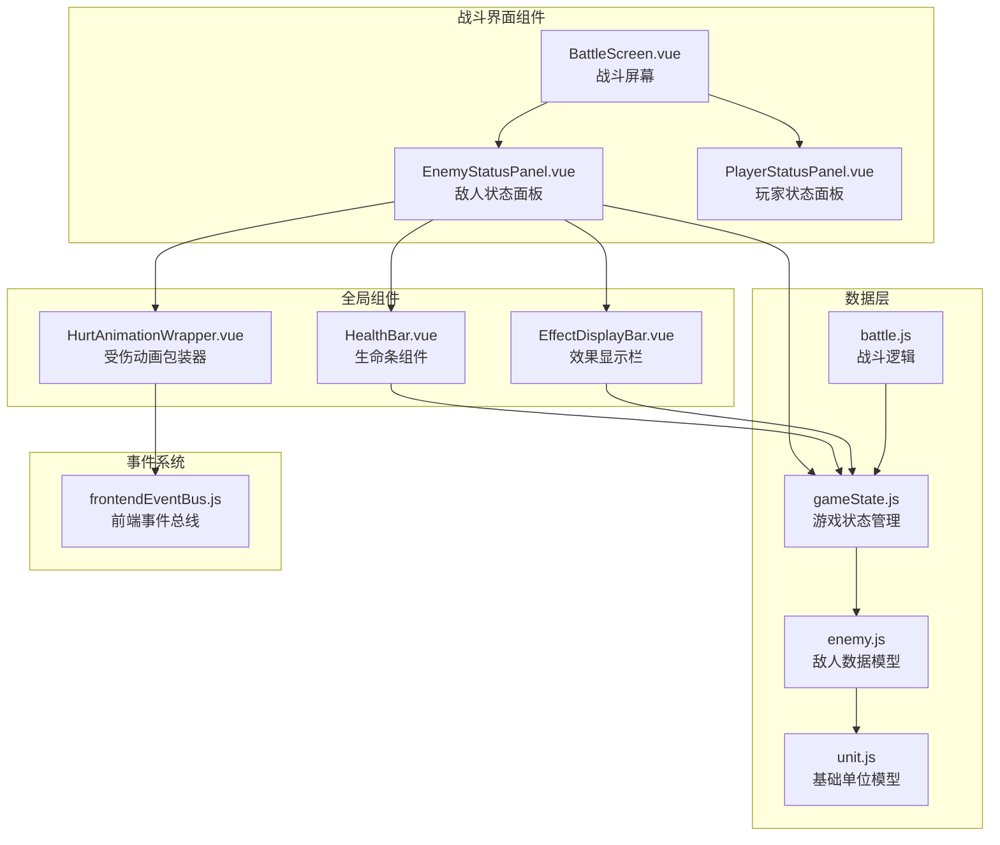
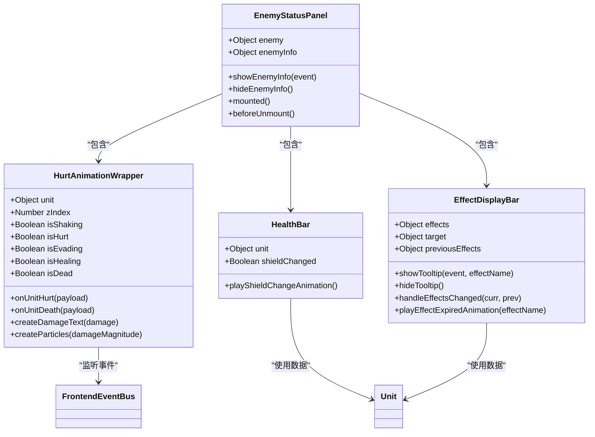
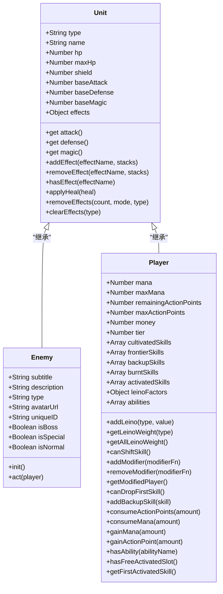
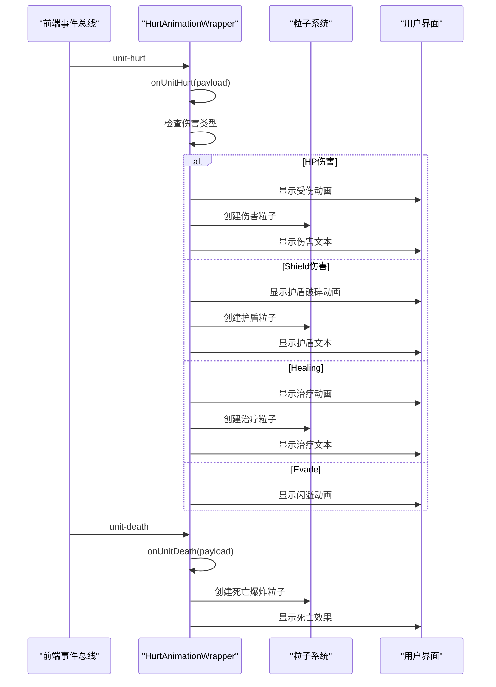
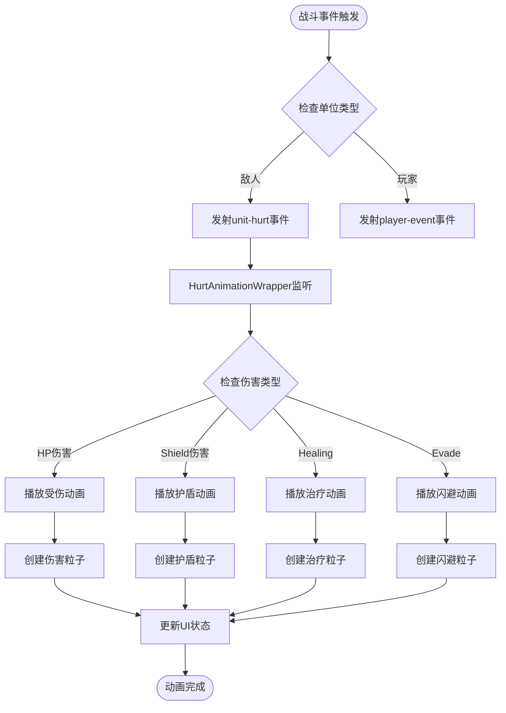

# 敌人状态显示组件详细分析

<cite>
**本文档中引用的文件**
- [EnemyStatusPanel.vue](file://src/components/battle/EnemyStatusPanel.vue)
- [HealthBar.vue](file://src/components/global/HealthBar.vue)
- [EffectDisplayBar.vue](file://src/components/global/EffectDisplayBar.vue)
- [HurtAnimationWrapper.vue](file://src/components/global/HurtAnimationWrapper.vue)
- [enemy.js](file://src/data/enemy.js)
- [unit.js](file://src/data/unit.js)
- [player.js](file://src/data/player.js)
- [gameState.js](file://src/data/gameState.js)
- [battle.js](file://src/data/battle.js)
- [effectDescription.js](file://src/data/effectDescription.js)
- [frontendEventBus.js](file://src/frontendEventBus.js)
</cite>

## 目录
1. [简介](#简介)
2. [项目结构概览](#项目结构概览)
3. [核心组件架构](#核心组件架构)
4. [EnemyStatusPanel组件详细分析](#enemystatuspanel组件详细分析)
5. [数据模型与状态管理](#数据模型与状态管理)
6. [动画与视觉反馈系统](#动画与视觉反馈系统)
7. [状态效果显示机制](#状态效果显示机制)
8. [组件间通信与事件处理](#组件间通信与事件处理)
9. [性能优化与最佳实践](#性能优化与最佳实践)
10. [故障排除指南](#故障排除指南)
11. [总结](#总结)

## 简介

EnemyStatusPanel.vue是战斗界面中负责展示敌人状态信息的核心组件，它提供了完整的敌人生命值、护盾、状态效果等信息的可视化展示。该组件通过响应式数据绑定与gameState中的敌人数据保持实时同步，同时集成了丰富的动画效果和用户交互功能。

## 项目结构概览



**图表来源**
- [EnemyStatusPanel.vue](file://src/components/battle/EnemyStatusPanel.vue#L1-L326)
- [BattleScreen.vue](file://src/components/battle/BattleScreen.vue#L1-L110)
- [gameState.js](file://src/data/gameState.js#L1-L75)

## 核心组件架构

EnemyStatusPanel组件采用了模块化的设计架构，将不同的功能职责分配给专门的子组件：



**图表来源**
- [EnemyStatusPanel.vue](file://src/components/battle/EnemyStatusPanel.vue#L45-L122)
- [HurtAnimationWrapper.vue](file://src/components/global/HurtAnimationWrapper.vue#L1-L362)
- [HealthBar.vue](file://src/components/global/HealthBar.vue#L1-L101)
- [EffectDisplayBar.vue](file://src/components/global/EffectDisplayBar.vue#L1-L154)

## EnemyStatusPanel组件详细分析

### 组件结构与模板

EnemyStatusPanel组件采用分层布局设计，主要包含以下几个部分：

1. **头像区域**：显示敌人的头像或占位符
2. **基本信息区域**：显示敌人名称、类型和统计信息
3. **状态效果区域**：展示当前生效的状态效果
4. **生命条区域**：显示生命值和护盾状态
5. **信息悬浮框**：提供详细的敌人信息

```javascript
// 组件核心属性定义
props: {
  enemy: {
    type: Object,
    required: true
  }
}
```

### 头像与基本信息展示

组件支持两种头像显示方式：
- **图片头像**：当`enemy.avatarUrl`存在时显示
- **占位符**：当没有头像URL时显示黑色背景

```javascript
// 头像渲染逻辑
<div class="enemy-avatar">
  
  <div v-else class="avatar-placeholder"></div>
</div>
```

### 统计信息显示

组件动态显示敌人的攻击和防御属性：

```javascript
<div class="enemy-stats">
  <div class="stat">
    <span class="stat-label">⚔️ 攻击:</span>
    <span class="stat-value">{{ enemy.attack }}</span>
  </div>
  <div class="stat">
    <span class="stat-label">🛡️ 防御:</span>
    <span class="stat-value">{{ enemy.defense }}</span>
  </div>
</div>
```

### 信息悬浮框功能

组件实现了鼠标悬停时显示详细信息的功能：

```javascript
methods: {
  showEnemyInfo(event) {
    const wrapper = this.$el.closest('.hurt-animation-wrapper');
    if (wrapper) {
      const wrapperRect = wrapper.getBoundingClientRect();
      const buttonRect = event.target.getBoundingClientRect();
      
      const relativeX = buttonRect.left - wrapperRect.left + 30;
      const relativeY = buttonRect.top - wrapperRect.top - 10;
      
      this.enemyInfo = {
        show: true,
        x: relativeX,
        y: relativeY
      };
    }
  }
}
```

**章节来源**
- [EnemyStatusPanel.vue](file://src/components/battle/EnemyStatusPanel.vue#L1-L326)

## 数据模型与状态管理

### Unit基类设计

EnemyStatusPanel组件基于Unit基类的数据模型，该类提供了统一的属性计算和效果管理系统：



**图表来源**
- [unit.js](file://src/data/unit.js#L1-L143)
- [enemy.js](file://src/data/enemy.js#L1-L44)
- [player.js](file://src/data/player.js#L1-L226)

### 效果系统集成

EnemyStatusPanel组件通过EffectDisplayBar组件展示敌人的状态效果：

```javascript
// 效果显示栏配置
<EffectDisplayBar 
  :effects="enemy.effects"
  :target="enemy"
  @show-tooltip="$emit('show-tooltip', $event)"
  @hide-tooltip="$emit('hide-tooltip')"
/>
```

效果系统支持多种类型的效果：
- **增益效果**（Buff）：力量、坚固、集中等
- **减益效果**（Debuff）：易伤、虚弱、中毒等
- **中性效果**：再生、聚气、燃烧等

### 生命值与护盾显示

通过HealthBar组件实现生命值和护盾的可视化：

```javascript
// 生命条配置
<HealthBar :unit="enemy" class="enemy" />
```

HealthBar组件提供了以下特性：
- **生命值进度条**：显示当前生命值与最大生命值的比例
- **护盾显示**：当存在护盾时显示护盾数值
- **缩放动画**：护盾变化时播放缩放动画效果

**章节来源**
- [unit.js](file://src/data/unit.js#L1-L143)
- [enemy.js](file://src/data/enemy.js#L1-L44)
- [HealthBar.vue](file://src/components/global/HealthBar.vue#L1-L101)
- [EffectDisplayBar.vue](file://src/components/global/EffectDisplayBar.vue#L1-L154)

## 动画与视觉反馈系统

### HurtAnimationWrapper动画系统

HurtAnimationWrapper是EnemyStatusPanel的核心动画组件，提供了完整的受伤反馈系统：



**图表来源**
- [HurtAnimationWrapper.vue](file://src/components/global/HurtAnimationWrapper.vue#L80-L180)
- [frontendEventBus.js](file://src/frontendEventBus.js#L1-L9)

### 动画效果类型

HurtAnimationWrapper支持多种动画效果：

1. **受伤动画（Hurt Animation）**
   - 边框闪烁效果
   - 伤害数值浮动动画
   - 粒子爆炸效果

2. **闪避动画（Evade Animation）**
   - 旋转摆动效果
   - 快速淡出

3. **治疗动画（Heal Animation）**
   - 绿色覆盖层
   - 治疗数值浮动

4. **死亡动画（Death Animation）**
   - 白色闪光效果
   - 爆炸粒子系统
   - 逐渐消失效果

### 粒子系统集成

组件通过frontendEventBus与粒子系统通信：

```javascript
// 创建伤害文本粒子
createDamageText(damage, isShieldDamage = false) {
  const text = damage < 0 ? `+${Math.abs(damage)}` : `-${damage}`;
  const color = damage < 0 ? '#00ff00' : (isShieldDamage ? '#666666' : '#ff0000');
  
  const particle = {
    x: startX,
    y: startY,
    vx: velocityX,
    vy: velocityY,
    gravity: gravity,
    life: duration,
    size: fontSize,
    text: text,
    extraStyles: {
      color: color,
      fontSize: `${fontSize}px`,
      fontWeight: 'bold'
    }
  };
  
  frontendEventBus.emit('spawn-particles', [particle]);
}
```

**章节来源**
- [HurtAnimationWrapper.vue](file://src/components/global/HurtAnimationWrapper.vue#L1-L362)

## 状态效果显示机制

### EffectDisplayBar组件架构

EffectDisplayBar组件负责展示敌人的状态效果，采用图标加堆叠层数的方式显示：

```javascript
// 效果图标渲染
<div v-for="(value, key) in effects" :key="key">
  <EffectIcon
    v-if="value !== 0" 
    :effect-name="key"
    :stack="value"
    :preview-mode="false"
    @mouseenter="showTooltip($event, key)"
    @mouseleave="hideTooltip()"
  />
</div>
```

### 效果描述系统

系统维护了一个完整的效果描述数据库，包含每个效果的详细信息：

```javascript
// 效果描述示例
const effectDescriptions = {
  '力量': {
    name: '力量',
    description: '造成伤害时，提升层数点伤害',
    type: 'buff',
    icon: '⚔️',
    color: '#FF4500'
  },
  '易伤': {
    name: '易伤',
    description: '受到150%伤害，回合结束时，层数减1',
    type: 'debuff',
    icon: '💥',
    color: '#FF4500'
  }
};
```

### 效果过期动画

当效果层数归零时，系统会触发特殊的过期动画：

```javascript
// 效果过期动画处理
handleEffectsChanged(curr, prev) {
  const prevKeys = Object.keys(prev || {});
  for (const effectName of prevKeys) {
    const previousStacks = prev[effectName] || 0;
    const currStacks = (curr && curr[effectName]) || 0;
    if (previousStacks > 0 && currStacks === 0) {
      this.playEffectExpiredAnimation(effectName);
    }
  }
}
```

### 交互反馈

组件提供了完整的鼠标交互反馈：
- **鼠标悬停**：显示效果详细描述
- **鼠标离开**：隐藏提示信息
- **动画效果**：效果图标放大动画

**章节来源**
- [EffectDisplayBar.vue](file://src/components/global/EffectDisplayBar.vue#L1-L154)
- [effectDescription.js](file://src/data/effectDescription.js#L1-L301)

## 组件间通信与事件处理

### 前端事件总线

系统使用mitt库实现轻量级的事件总线通信：

```javascript
// 事件总线初始化
import mitt from 'mitt';
const frontendEventBus = mitt();
export default frontendEventBus;
```

### 主要事件类型

EnemyStatusPanel组件监听以下事件：

1. **unit-hurt事件**
   - 参数：`{ unitId, hpDamage, passThroughDamage }`
   - 触发时机：敌人受到伤害时
   - 处理内容：触发受伤动画和视觉反馈

2. **unit-death事件**
   - 参数：`{ unitId }`
   - 触发时机：敌人生命值降至0时
   - 处理内容：触发死亡动画和爆炸效果

### 事件传播流程



**图表来源**
- [HurtAnimationWrapper.vue](file://src/components/global/HurtAnimationWrapper.vue#L80-L180)
- [frontendEventBus.js](file://src/frontendEventBus.js#L1-L9)

### 事件处理最佳实践

1. **事件命名规范**
   - 使用清晰的命名空间：`unit-hurt`, `unit-death`
   - 避免事件名称冲突
   - 保持事件参数结构一致性

2. **内存管理**
   - 在组件卸载时清理事件监听器
   - 避免内存泄漏

3. **错误处理**
   - 对事件处理函数进行错误捕获
   - 提供降级处理机制

**章节来源**
- [frontendEventBus.js](file://src/frontendEventBus.js#L1-L9)
- [HurtAnimationWrapper.vue](file://src/components/global/HurtAnimationWrapper.vue#L80-L180)

## 性能优化与最佳实践

### 响应式数据优化

EnemyStatusPanel组件采用了高效的响应式数据绑定策略：

1. **精确的watch监听**
   ```javascript
   watch: {
     // 只监听必要的数据变化
     'unit.shield'(newShield, oldShield) {
       if (newShield !== oldShield) {
         this.playShieldChangeAnimation();
       }
     }
   }
   ```

2. **计算属性缓存**
   ```javascript
   computed: {
     isShielded() {
       return (this.unit?.shield || 0) > 0;
     }
   }
   ```

### DOM优化策略

1. **条件渲染**
   - 使用v-if/v-show优化DOM元素的创建和销毁
   - 避免不必要的DOM节点

2. **事件委托**
   - 在EffectDisplayBar中使用事件委托减少事件监听器数量
   - 优化大量效果图标的事件处理

3. **CSS动画优化**
   - 使用transform和opacity属性触发硬件加速
   - 避免频繁的重排和重绘

### 内存管理

1. **定时器清理**
   ```javascript
   _clearTimers() {
     if (this._timers && this._timers.length) {
       for (const id of this._timers) clearTimeout(id);
       this._timers = [];
     }
   }
   ```

2. **事件监听器清理**
   ```javascript
   mounted() {
     frontendEventBus.on('unit-hurt', this.onUnitHurt);
     frontendEventBus.on('unit-death', this.onUnitDeath);
   },
   beforeUnmount() {
     this._clearTimers();
     frontendEventBus.off('unit-hurt', this.onUnitHurt);
     frontendEventBus.off('unit-death', this.onUnitDeath);
   }
   ```

### 性能监控建议

1. **Vue DevTools使用**
   - 监控组件渲染性能
   - 分析响应式数据变化
   - 检查内存泄漏

2. **浏览器开发者工具**
   - 使用Performance面板分析动画性能
   - 检查GPU使用情况
   - 监控JavaScript执行时间

## 故障排除指南

### 常见问题与解决方案

1. **动画不显示**
   - **症状**：受伤、死亡等动画效果不出现
   - **原因**：frontendEventBus未正确初始化或事件未正确触发
   - **解决方案**：
     ```javascript
     // 检查事件总线是否正常工作
     console.log(frontendEventBus);
     
     // 检查事件监听器是否注册
     console.log('Event listeners:', frontendEventBus.all);
     ```

2. **效果图标显示异常**
   - **症状**：状态效果图标不显示或显示错误
   - **原因**：effectDescriptions配置错误或组件未正确更新
   - **解决方案**：
     ```javascript
     // 检查效果描述配置
     console.log(effectDescriptions);
     
     // 强制刷新效果显示
     this.$forceUpdate();
     ```

3. **生命值显示错误**
   - **症状**：生命值进度条显示不正确
   - **原因**：unit数据模型中的hp/maxHp属性异常
   - **解决方案**：
     ```javascript
     // 检查单位数据完整性
     console.log('Unit data:', this.enemy);
     console.log('HP:', this.enemy.hp, 'Max HP:', this.enemy.maxHp);
     ```

4. **性能问题**
   - **症状**：动画卡顿或界面响应缓慢
   - **原因**：过多的DOM操作或事件监听器
   - **解决方案**：
     ```javascript
     // 减少不必要的DOM操作
     // 使用requestAnimationFrame优化动画
     // 清理不再需要的事件监听器
     ```

### 调试技巧

1. **使用Vue DevTools**
   - 检查组件状态和props
   - 监控事件触发
   - 分析性能瓶颈

2. **控制台调试**
   ```javascript
   // 在组件方法中添加调试输出
   console.log('Enemy status update:', this.enemy);
   ```

3. **网络请求监控**
   - 检查avatarUrl加载状态
   - 监控外部资源加载时间

**章节来源**
- [HurtAnimationWrapper.vue](file://src/components/global/HurtAnimationWrapper.vue#L80-L180)
- [EnemyStatusPanel.vue](file://src/components/battle/EnemyStatusPanel.vue#L45-L122)

## 总结

EnemyStatusPanel.vue组件是一个功能完整、设计精良的战斗界面组件，它成功地实现了以下核心功能：

### 核心优势

1. **完整的状态展示**
   - 生命值和护盾的可视化显示
   - 实时的状态效果展示
   - 详细的敌人信息面板

2. **丰富的动画反馈**
   - 受伤、死亡、闪避等多种动画效果
   - 粒子系统集成的视觉反馈
   - 平滑的过渡动画

3. **响应式数据绑定**
   - 与gameState的深度集成
   - 自动化的状态更新
   - 实时的视觉反馈

4. **良好的用户体验**
   - 直观的信息展示
   - 交互式的详细信息查看
   - 适配不同类型的敌人（普通、特殊、BOSS）

### 设计亮点

- **模块化架构**：将不同功能分离到专门的子组件中
- **事件驱动设计**：通过frontendEventBus实现松耦合的组件通信
- **性能优化**：合理的DOM操作和动画策略
- **扩展性**：易于添加新的效果类型和动画效果

### 改进建议

1. **性能优化**：考虑使用虚拟滚动技术处理大量效果图标
2. **可访问性**：增强屏幕阅读器支持和键盘导航
3. **国际化**：支持多语言效果描述和文本
4. **主题定制**：提供更灵活的样式定制选项

EnemyStatusPanel组件展现了现代前端开发的最佳实践，通过精心设计的架构和丰富的交互效果，为玩家提供了直观、生动的战斗体验。它的设计理念和实现方式值得在类似项目中借鉴和应用。