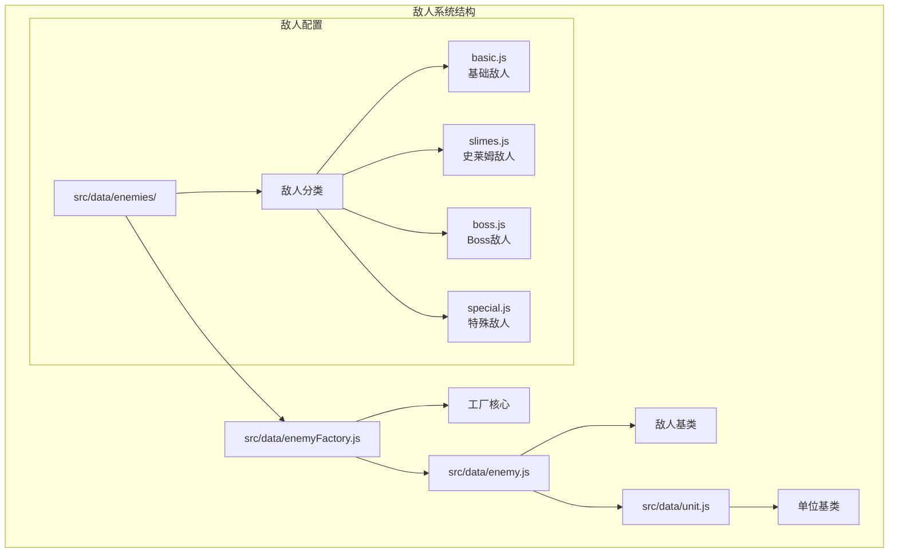
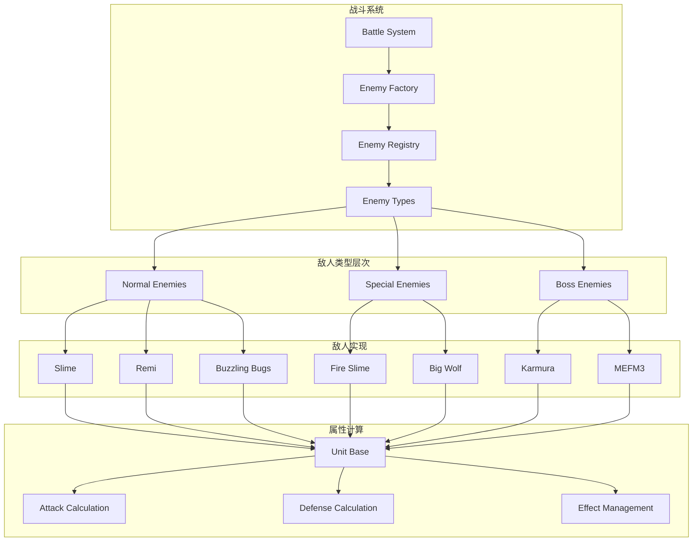
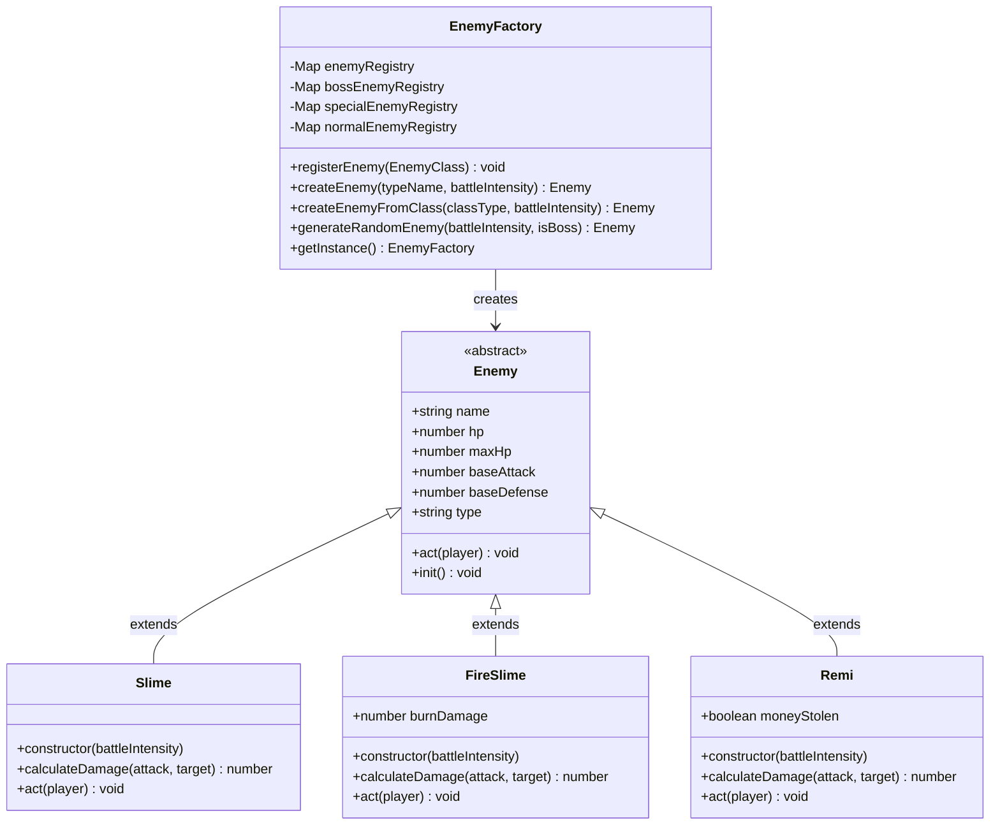
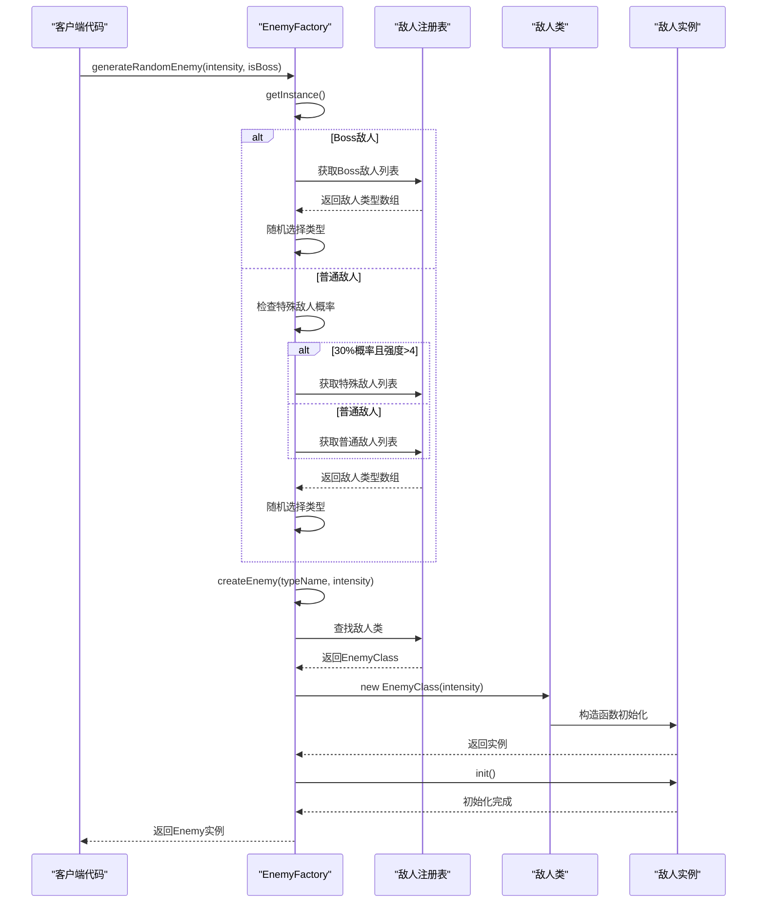
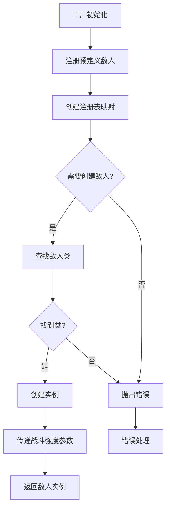
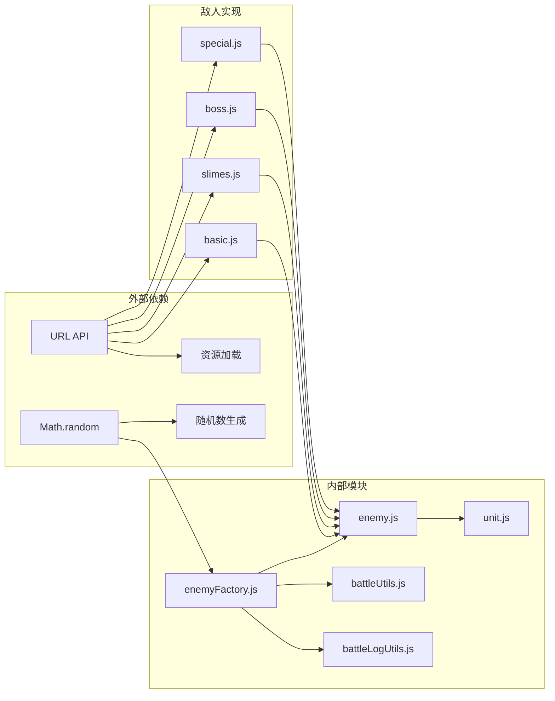

# 敌人生成机制

<cite>
**本文档中引用的文件**
- [enemyFactory.js](file://src/data/enemyFactory.js)
- [enemy.js](file://src/data/enemy.js)
- [unit.js](file://src/data/unit.js)
- [basic.js](file://src/data/enemies/basic.js)
- [slimes.js](file://src/data/enemies/slimes.js)
- [battle.js](file://src/data/battle.js)
- [README.md](file://src/data/enemies/README.md)
</cite>

## 目录
1. [简介](#简介)
2. [项目结构](#项目结构)
3. [核心组件](#核心组件)
4. [架构概览](#架构概览)
5. [详细组件分析](#详细组件分析)
6. [依赖关系分析](#依赖关系分析)
7. [性能考虑](#性能考虑)
8. [故障排除指南](#故障排除指南)
9. [结论](#结论)

## 简介

敌人生成机制是游戏战斗系统的核心组成部分，采用工厂模式设计，提供了灵活且可扩展的敌人生成框架。该系统通过EnemyFactory类统一管理敌人实例化过程，支持多种类型的敌人（普通敌人、特殊敌人、Boss敌人），并能够根据战斗强度动态调整敌人属性。

系统采用了注册式架构，允许开发者轻松添加新的敌人类型而无需修改核心工厂代码。这种设计模式不仅提高了代码的可维护性，还增强了系统的扩展能力。

## 项目结构

敌人生成机制的文件组织结构清晰明确，主要分布在以下目录中：



**图表来源**
- [enemyFactory.js](file://src/data/enemyFactory.js#L1-L88)
- [enemy.js](file://src/data/enemy.js#L1-L44)
- [unit.js](file://src/data/unit.js#L1-L143)

**章节来源**
- [enemyFactory.js](file://src/data/enemyFactory.js#L1-L88)
- [README.md](file://src/data/enemies/README.md#L1-L46)

## 核心组件

### EnemyFactory 工厂类

EnemyFactory是整个敌人生成系统的核心，采用单例模式设计，负责管理所有敌人类型的注册和实例化。

```javascript
// 工厂类结构
class EnemyFactory {
  constructor() {
    this.enemyRegistry = new Map(); // 所有敌人注册表
    this.bossEnemyRegistry = new Map(); // Boss敌人注册表
    this.specialEnemyRegistry = new Map(); // 特殊敌人注册表
    this.normalEnemyRegistry = new Map(); // 普通敌人注册表
  }
  
  // 注册敌人类型
  registerEnemy(EnemyClass) {
    const enemySample = new EnemyClass(1);
    this.enemyRegistry.set(enemySample.name, EnemyClass);
    if(enemySample.isBoss) this.bossEnemyRegistry.set(enemySample.name, EnemyClass);
    if(enemySample.isSpecial) this.specialEnemyRegistry.set(enemySample.name, EnemyClass);
    if(enemySample.isNormal) this.normalEnemyRegistry.set(enemySample.name, EnemyClass);
  }
}
```

### Enemy 基类

Enemy类继承自Unit基类，定义了所有敌人共有的属性和行为接口：

```javascript
class Enemy extends Unit {
  constructor(name, hp, attack, defense, avatarUrl = '') {
    super();
    this.name = name; // 敌人名称
    this.hp = hp; // 当前生命值
    this.maxHp = hp; // 最大生命值
    this.shield = 0; // 当前护盾
    this.baseAttack = attack; // 基础攻击力
    this.baseDefense = defense; // 基础防御力
    this.type = 'normal'; // 敌人类型
    this.avatarUrl = avatarUrl; // 头像URL
    this.uniqueID = Math.random().toString(36).substring(2, 10);
  }
  
  // 类型判断方法
  get isBoss() { return this.type === 'boss'; }
  get isSpecial() { return this.type === 'special'; }
  get isNormal() { return this.type === 'normal'; }
  
  // 抽象方法，子类必须实现
  act(player) { /* 子类实现 */ }
}
```

**章节来源**
- [enemyFactory.js](file://src/data/enemyFactory.js#L8-L32)
- [enemy.js](file://src/data/enemy.js#L3-L43)

## 架构概览

敌人生成系统采用分层架构设计，从底层的数据模型到顶层的工厂模式，形成了清晰的职责分离：



**图表来源**
- [enemyFactory.js](file://src/data/enemyFactory.js#L15-L32)
- [basic.js](file://src/data/enemies/basic.js#L5-L285)
- [slimes.js](file://src/data/enemies/slimes.js#L7-L42)

## 详细组件分析

### 工厂模式实现

EnemyFactory实现了标准的工厂模式，提供了静态方法来创建敌人实例：



**图表来源**
- [enemyFactory.js](file://src/data/enemyFactory.js#L8-L87)
- [enemy.js](file://src/data/enemy.js#L3-L43)
- [basic.js](file://src/data/enemies/basic.js#L5-L194)
- [slimes.js](file://src/data/enemies/slimes.js#L7-L42)

### 敌人实例化流程

敌人生成遵循严格的流程控制，确保每个敌人实例都能正确初始化：



**图表来源**
- [enemyFactory.js](file://src/data/enemyFactory.js#L44-L87)

### 参数结构分析

createEnemy方法的参数结构设计精巧，支持灵活的敌人生成：

```javascript
// createEnemy方法签名
static createEnemy(typeName, battleIntensity) {
  const instance = this.getInstance();
  const EnemyClass = instance.enemyRegistry.get(typeName);
  if (EnemyClass) {
    return new EnemyClass(battleIntensity);
  }
  throw new Error(`Unknown enemy typeName: ${typeName}`);
}
```

参数说明：
- `typeName`: 字符串类型，表示要创建的敌人类型名称
- `battleIntensity`: 数字类型，影响敌人属性的强度系数

### 配置加载机制

系统支持动态配置加载，通过Map数据结构存储敌人配置：



**图表来源**
- [enemyFactory.js](file://src/data/enemyFactory.js#L34-L42)

**章节来源**
- [enemyFactory.js](file://src/data/enemyFactory.js#L34-L87)

### 敌人行为实现

每个敌人类型都实现了独特的战斗行为，通过act方法定义：

```javascript
// 火史莱姆的战斗行为示例
act(player) {
  // 火史莱姆有50%概率使用普通攻击，50%概率使用燃烧攻击
  if (Math.random() < 0.5) {
    // 普通攻击
    const damage = this.calculateDamage(this.attack, player);
    addEnemyActionLog(`${this.name}冲击！`);
    launchAttack(this, player, damage);
  } else {
    // 燃烧攻击：造成伤害并附加燃烧效果
    const damage = this.calculateDamage(this.magic, player);
    addEnemyActionLog(`${this.name} 使用了燃烧攻击！`);
    const result = launchAttack(this, player, damage);
    if(result.passThoughDamage > 0) player.addEffect('燃烧', 4);
  }
}
```

### 战斗初始化示例

战斗初始化时的敌人生成示例如下：

```javascript
// 战斗初始化流程
export function generateEnemy() {
  const battleIntensity = gameState.battleCount;
  
  // 简单实现：在第2 + 5*n场战斗时生成Boss
  if (gameState.battleCount !== 2 && (gameState.battleCount - 2) % 5 === 0) {
    gameState.enemy = EnemyFactory.generateRandomEnemy(battleIntensity, true);
  } else {
    // 普通敌人
    gameState.enemy = EnemyFactory.generateRandomEnemy(battleIntensity, false);
  }
}
```

**章节来源**
- [slimes.js](file://src/data/enemies/slimes.js#L25-L42)
- [battle.js](file://src/data/battle.js#L150-L162)

## 依赖关系分析

敌人生成系统的依赖关系清晰明确，形成了良好的分层架构：



**图表来源**
- [enemyFactory.js](file://src/data/enemyFactory.js#L1-L7)
- [enemy.js](file://src/data/enemy.js#L1-L2)
- [unit.js](file://src/data/unit.js#L1-L3)

**章节来源**
- [enemyFactory.js](file://src/data/enemyFactory.js#L1-L88)
- [basic.js](file://src/data/enemies/basic.js#L1-L3)

## 性能考虑

### 内存管理

系统采用了高效的内存管理策略：

1. **单例模式**：EnemyFactory使用单例模式，避免重复创建工厂实例
2. **Map数据结构**：使用Map而非Object存储敌人注册表，提高查找效率
3. **延迟初始化**：敌人实例只在需要时才创建

### 计算优化

1. **战斗强度计算**：敌人属性基于battleIntensity线性计算，减少复杂运算
2. **随机数缓存**：在生成随机敌人时，预先计算所有可能选项
3. **类型判断优化**：通过getter方法快速判断敌人类型

### 扩展性设计

系统设计充分考虑了未来的扩展需求：

1. **插件式架构**：新敌人类型只需继承Enemy类并注册即可
2. **配置驱动**：敌人属性可以通过配置文件动态调整
3. **类型隔离**：不同类型的敌人拥有独立的注册表，便于管理和扩展

## 故障排除指南

### 常见问题及解决方案

#### 1. 敌人类型未找到错误

**问题症状**：`Unknown enemy typeName` 错误

**原因分析**：
- 敌人未正确注册到工厂
- 注册时类型名称拼写错误
- 导入路径错误

**解决方案**：
```javascript
// 确保在工厂构造函数中注册敌人
this.registerEnemy(MyNewEnemy);

// 检查导入路径
import { MyNewEnemy } from './enemies/myNewEnemy.js';
```

#### 2. 敌人实例化失败

**问题症状**：创建敌人时抛出异常

**原因分析**：
- 构造函数参数不匹配
- 必须实现act方法
- 继承关系错误

**解决方案**：
```javascript
// 确保正确继承并实现必需方法
class MyEnemy extends Enemy {
  constructor(battleIntensity) {
    super('我的敌人', 100, 10, 1, battleIntensity);
  }
  
  act(player) {
    // 实现战斗行为
  }
}
```

#### 3. 战斗强度计算异常

**问题症状**：敌人属性不符合预期

**原因分析**：
- battleIntensity参数传递错误
- 属性计算公式错误
- 数据类型转换问题

**解决方案**：
```javascript
// 确保battleIntensity为数字类型
const intensity = parseInt(battleIntensity) || 1;
const hp = 100 + Math.floor(10 * intensity);
```

**章节来源**
- [enemyFactory.js](file://src/data/enemyFactory.js#L37-L42)
- [README.md](file://src/data/enemies/README.md#L1-L46)

## 结论

敌人生成机制通过精心设计的工厂模式和注册式架构，成功构建了一个灵活、可扩展且易于维护的敌人系统。该系统的主要优势包括：

### 设计优势

1. **松耦合设计**：工厂类与具体敌人实现完全解耦
2. **单一职责**：每个组件都有明确的职责边界
3. **开闭原则**：对扩展开放，对修改关闭
4. **类型安全**：通过类型检查确保运行时稳定性

### 技术特点

1. **工厂模式**：提供统一的敌人创建接口
2. **注册式架构**：支持动态添加新敌人类型
3. **单例模式**：确保工厂实例的唯一性
4. **继承体系**：基于Unit类的完整属性计算体系

### 扩展潜力

系统设计充分考虑了未来扩展需求，开发者可以轻松添加新的敌人类型，只需：
1. 继承Enemy基类
2. 实现act方法
3. 在工厂中注册

这种设计不仅简化了开发流程，还大大提高了系统的可维护性和可扩展性。通过合理的架构设计和清晰的职责划分，敌人生成机制为游戏战斗系统提供了坚实的基础支撑。