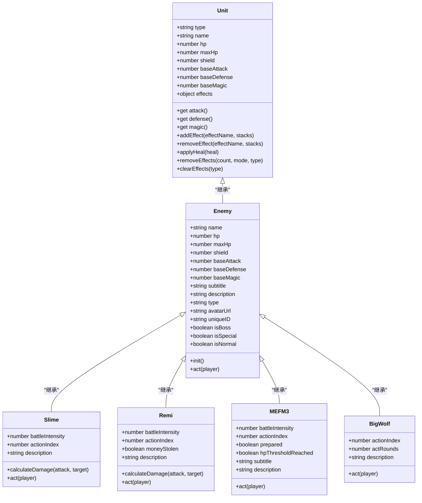
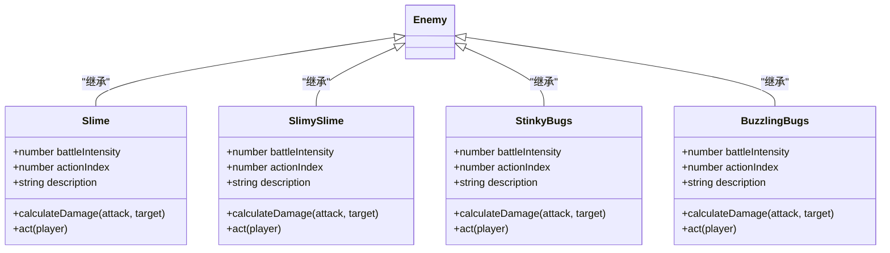
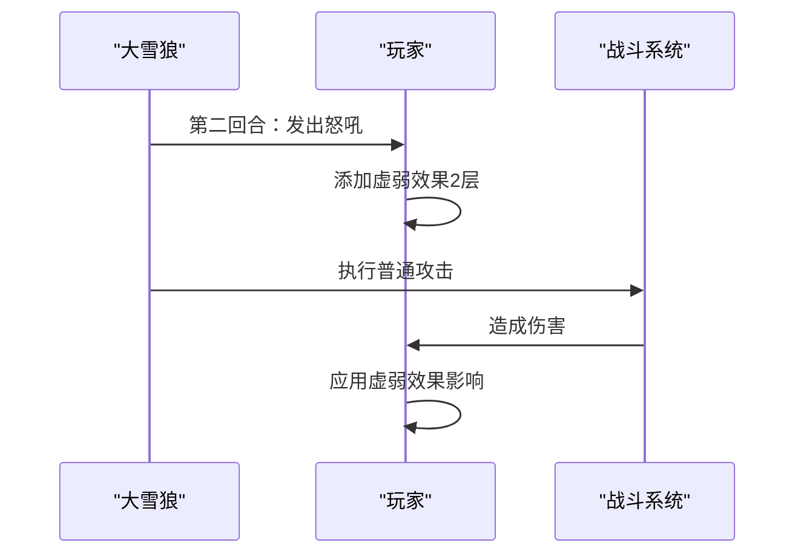
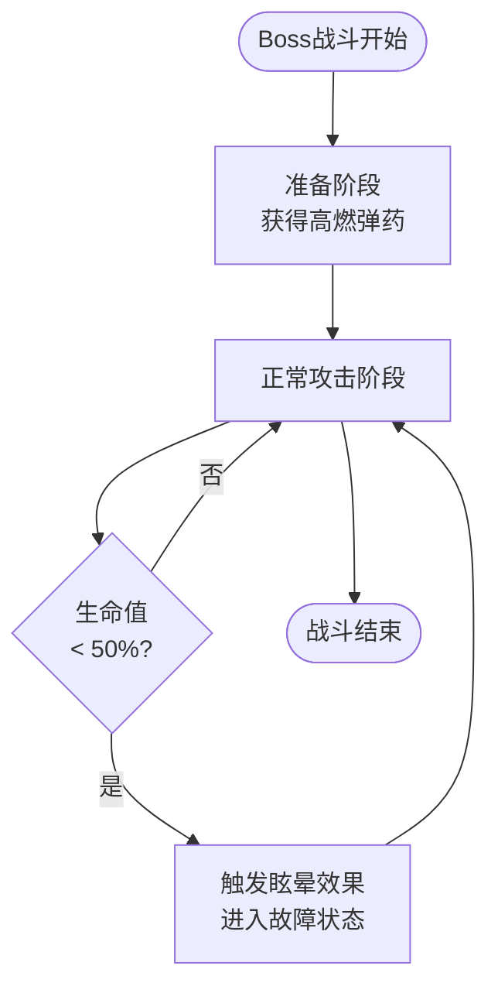
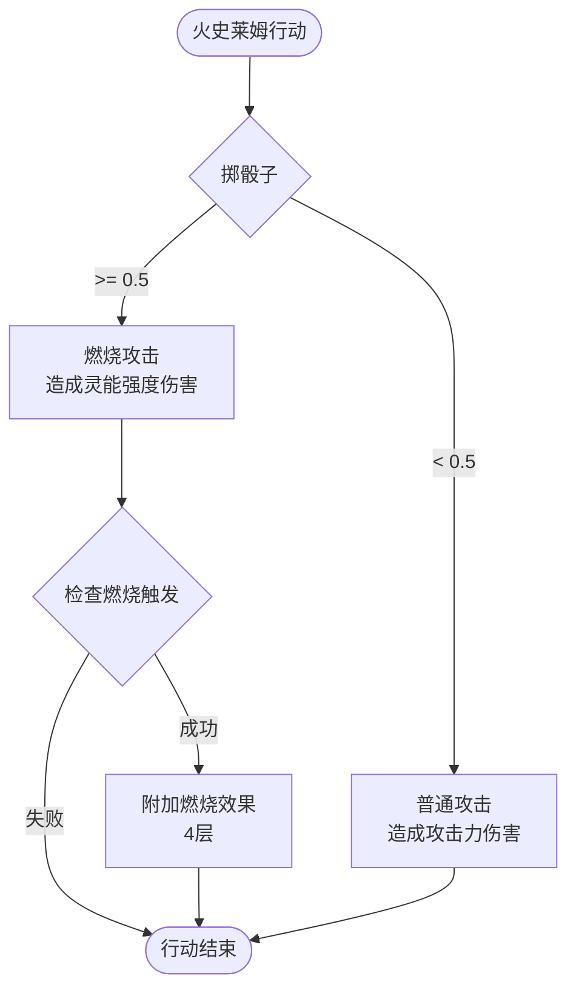
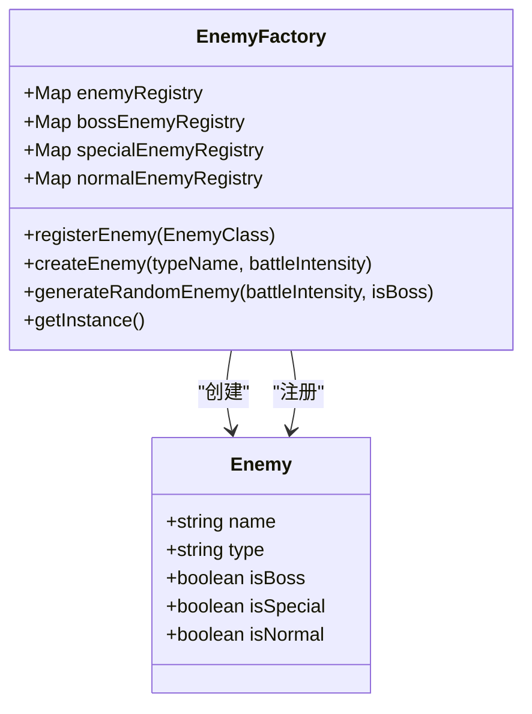

# 敌人类型系统

<cite>
**本文档引用的文件**
- [src/data/enemy.js](file://src/data/enemy.js)
- [src/data/unit.js](file://src/data/unit.js)
- [src/data/enemyFactory.js](file://src/data/enemyFactory.js)
- [src/data/enemies/basic.js](file://src/data/enemies/basic.js)
- [src/data/enemies/boss.js](file://src/data/enemies/boss.js)
- [src/data/enemies/slimes.js](file://src/data/enemies/slimes.js)
- [src/data/enemies/special.js](file://src/data/enemies/special.js)
- [src/data/enemies/README.md](file://src/data/enemies/README.md)
</cite>

## 目录
1. [简介](#简介)
2. [敌人系统架构](#敌人系统架构)
3. [敌人类型分类](#敌人类型分类)
4. [基础敌人分析](#基础敌人分析)
5. [精英敌人分析](#精英敌人分析)
6. [Boss敌人分析](#boss敌人分析)
7. [特殊敌人分析](#特殊敌人分析)
8. [敌人变体设计模式](#敌人变体设计模式)
9. [敌人工厂系统](#敌人工厂系统)
10. [扩展新敌人类型](#扩展新敌人类型)
11. [性能考虑](#性能考虑)
12. [总结](#总结)

## 简介

本项目采用模块化的敌人类型系统，通过继承和配置的方式实现不同类型敌人的差异化设计。系统支持四种主要敌人类型：基础敌人、精英敌人、Boss敌人和特殊敌人，每种类型都有其独特的属性配置、行为模式和战斗策略。

## 敌人系统架构



**图表来源**
- [src/data/unit.js](file://src/data/unit.js#L1-L143)
- [src/data/enemy.js](file://src/data/enemy.js#L1-L44)

**章节来源**
- [src/data/unit.js](file://src/data/unit.js#L1-L143)
- [src/data/enemy.js](file://src/data/enemy.js#L1-L44)

## 敌人类型分类

系统根据敌人在游戏流程中的作用和设计目的，将敌人分为四个主要类别：

### 1. 基础敌人（Normal Enemies）
- **设计目的**：提供常规战斗体验，作为玩家初期的主要对手
- **特点**：简单直接的攻击模式，较低的生命值和攻击力
- **作用**：训练玩家战斗技巧，积累资源

### 2. 精英敌人（Special Enemies）
- **设计目的**：提供更具挑战性的战斗，引入新的战斗机制
- **特点**：特殊的战斗行为，可能包含异常状态效果
- **作用**：测试玩家的战术适应能力

### 3. Boss敌人（Boss Enemies）
- **设计目的**：作为关卡高潮，提供史诗级战斗体验
- **特点**：高生命值，复杂的战斗阶段，独特的技能组合
- **作用**：决定战斗胜负，解锁重要奖励

### 4. 特殊敌人（Special Enemies）
- **设计目的**：提供多样化战斗体验，打破常规
- **特点**：独特的外观和行为模式，可能具有环境互动能力
- **作用**：丰富游戏内容，增加探索乐趣

## 基础敌人分析

基础敌人是最常见的敌人类型，设计简单但富有变化。主要包括以下几种：

### 史莱姆系列敌人



**图表来源**
- [src/data/enemies/basic.js](file://src/data/enemies/basic.js#L7-L285)

#### 史莱姆（Slime）
- **生命值**：27 + 6 × battleIntensity
- **攻击力**：3 + 0.6 × battleIntensity
- **行为模式**：
  1. 冲撞攻击（攻击力伤害）
  2. 强力冲撞（2×攻击力伤害）
  3. 防御姿态（获得2+灵能强度护盾）

#### 瑞米（Remi）
- **生命值**：23 + 5 × battleIntensity
- **攻击力**：6 + 0.8 × battleIntensity
- **特殊机制**：
  - 钱包盗窃：造成3点伤害并扣除10金钱
  - 闪避效果：两次行动都获得闪避

#### 腐食甲虫（StinkyBugs）
- **生命值**：18 + 4 × battleIntensity
- **攻击力**：1 + 0.2 × battleIntensity
- **特殊效果**：攻击时附加中毒效果（3层）

**章节来源**
- [src/data/enemies/basic.js](file://src/data/enemies/basic.js#L7-L285)

## 精英敌人分析

精英敌人具有独特的战斗行为和更强的威胁性。以BigWolf为例：

### 大雪狼（BigWolf）
- **生命值**：40 + 7 × battleIntensity
- **攻击力**：2 + 0.6 × battleIntensity
- **特殊机制**：
  - 格挡效果：初始获得5层格挡
  - 回合延迟：第二回合才发动攻击
  - 弱化效果：攻击后为玩家添加2层虚弱



**图表来源**
- [src/data/enemies/special.js](file://src/data/enemies/special.js#L7-L52)

**章节来源**
- [src/data/enemies/special.js](file://src/data/enemies/special.js#L1-L53)

## Boss敌人分析

Boss敌人是游戏中最具挑战性的存在，具有复杂的战斗机制和多个战斗阶段。

### MEFM-3（MEFM-3）
- **生命值**：25 + 11 × battleIntensity
- **攻击力**：round((3 + battleIntensity) × 0.4)
- **特殊机制**：
  - 准备阶段：首次行动获得高燃弹药效果
  - 生命值阈值：低于50%时触发眩晕效果
  - 多样化攻击：射流机枪、钩爪抓取、装甲强化

### 卡姆拉（Karmura）
- **生命值**：20 + 8 × battleIntensity
- **攻击力**：round((6 + battleIntensity) × 0.6)
- **特殊机制**：
  - 暴怒效果：初始获得1层暴怒
  - 生命值阈值：低于50%时进入狂暴状态
  - 血之回馈：攻击造成伤害时恢复生命值



**图表来源**
- [src/data/enemies/boss.js](file://src/data/enemies/boss.js#L7-L154)

**章节来源**
- [src/data/enemies/boss.js](file://src/data/enemies/boss.js#L1-L155)

## 特殊敌人分析

特殊敌人提供独特的战斗体验，通常具有不寻常的行为模式或视觉效果。

### 火史莱姆（FireSlime）
- **生命值**：13 + 5 × battleIntensity
- **攻击力**：6 + 0.6 × battleIntensity
- **特殊机制**：
  - 双重攻击模式：50%概率普通攻击，50%概率燃烧攻击
  - 燃烧效果：造成伤害时有概率附加燃烧效果（4层）



**图表来源**
- [src/data/enemies/slimes.js](file://src/data/enemies/slimes.js#L9-L42)

**章节来源**
- [src/data/enemies/slimes.js](file://src/data/enemies/slimes.js#L1-L43)

## 敌人变体设计模式

系统采用了多种设计模式来实现敌人变体：

### 1. 属性增强模式
```javascript
// 基础属性 + 增强系数 × 战斗强度
const hp = baseHp + enhancementFactor * battleIntensity;
const attack = baseAttack + enhancementFactor * battleIntensity;
```

### 2. 行为序列模式
```javascript
const actions = [
  () => { /* 行动1 */ },
  () => { /* 行动2 */ },
  () => { /* 行动3 */ }
];
const action = actions[this.actionIndex % actions.length];
action();
this.actionIndex++;
```

### 3. 条件触发模式
```javascript
if (!this.hpThresholdReached && this.hp < this.maxHp * 0.5) {
  this.hpThresholdReached = true;
  // 触发特殊效果
}
```

### 4. 效果叠加模式
```javascript
this.addEffect('某种效果', 1 + additionalStacks);
```

## 敌人工厂系统



**图表来源**
- [src/data/enemyFactory.js](file://src/data/enemyFactory.js#L7-L87)

### 工厂注册机制

工厂使用Map数据结构分别维护不同类型敌人的注册表：

- `enemyRegistry`：所有敌人的通用注册表
- `bossEnemyRegistry`：Boss敌人的专用注册表
- `specialEnemyRegistry`：特殊敌人的专用注册表
- `normalEnemyRegistry`：基础敌人的专用注册表

### 随机生成算法

```javascript
static generateRandomEnemy(battleIntensity, isBoss = false) {
  if (isBoss) {
    // Boss敌人生成逻辑
    const bossEnemies = Array.from(instance.bossEnemyRegistry.keys());
    const randomType = bossEnemies[Math.floor(Math.random() * bossEnemies.length)];
    return this.createEnemy(randomType, battleIntensity);
  }
  
  // 普通敌人生成逻辑
  const roll = Math.random();
  if(roll < 0.3 && battleIntensity > 4) {
    // 30%概率生成特殊敌人
    const specialEnemies = Array.from(instance.specialEnemyRegistry.keys());
    const randomType = specialEnemies[Math.floor(Math.random() * specialEnemies.length)];
    return this.createEnemy(randomType, battleIntensity);
  } else {
    // 主流概率生成基础敌人
    const normalEnemies = Array.from(instance.normalEnemyRegistry.keys());
    const randomType = normalEnemies[Math.floor(Math.random() * normalEnemies.length)];
    return this.createEnemy(randomType, battleIntensity);
  }
}
```

**章节来源**
- [src/data/enemyFactory.js](file://src/data/enemyFactory.js#L1-L88)

## 扩展新敌人类型

### 添加新敌人类型的方法

1. **创建敌人文件**：在`src/data/enemies/`目录下创建新文件
2. **继承Enemy类**：定义敌人类并继承Enemy基类
3. **实现必需方法**：完成构造函数和act方法
4. **注册敌人**：在enemyFactory.js中导入并注册

### 示例：创建新敌人

```javascript
// 新敌人：冰霜巨人
import Enemy from '../enemy.js';
import { launchAttack } from '../battleUtils.js';
import { addEnemyActionLog } from '../battleLogUtils.js';

class FrostGiant extends Enemy {
  constructor(battleIntensity) {
    const hp = 50 + 15 * battleIntensity;
    const attack = 8 + Math.floor(battleIntensity * 0.8);
    super('冰霜巨人', hp, attack, 2, 
      new URL('../../assets/enemies/frost_giant.png', import.meta.url).href
    );
    this.battleIntensity = battleIntensity;
    this.actionIndex = 0;
    this.type = 'normal'; // 或 'special', 'boss'
    this.description = "来自极地的恐怖生物";
  }

  calculateDamage(attack, target) {
    return Math.max(1, attack);
  }

  act(player) {
    const actions = [
      () => {
        addEnemyActionLog(`${this.name} 投掷冰块！`);
        const damage = this.calculateDamage(this.attack, player);
        launchAttack(this, player, damage);
      },
      () => {
        addEnemyActionLog(`${this.name} 召唤寒风！`);
        player.addEffect('冻结', 2);
      }
    ];
    
    const action = actions[this.actionIndex % actions.length];
    action();
    this.actionIndex++;
  }
}

export { FrostGiant };
```

### 注册新敌人

```javascript
// 在enemyFactory.js中添加
import { FrostGiant } from './enemies/frost_giant.js';

// 在构造函数中注册
this.registerEnemy(FrostGiant);
```

**章节来源**
- [src/data/enemies/README.md](file://src/data/enemies/README.md#L1-L46)

## 性能考虑

### 1. 内存管理
- 使用单例模式确保EnemyFactory实例唯一
- 通过Map结构快速查找敌人类型
- 及时清理不再使用的敌人对象

### 2. 计算优化
- 战斗强度计算采用预计算方式
- 行动序列使用模运算避免数组越界
- 效果叠加采用增量更新

### 3. 渲染优化
- 为每个敌人生成唯一ID便于动画同步
- 使用延迟队列控制战斗动画节奏
- 分批处理大量敌人攻击效果

## 总结

本敌人类型系统通过模块化设计实现了高度可扩展的游戏敌人架构。系统的核心优势包括：

1. **清晰的类型分离**：四种敌人类型各司其职，满足不同游戏阶段的需求
2. **灵活的配置系统**：通过参数化设计支持敌人属性的动态调整
3. **强大的扩展能力**：注册式架构使得添加新敌人变得简单直观
4. **统一的行为接口**：所有敌人都遵循相同的act方法规范
5. **丰富的交互机制**：支持效果叠加、条件触发等多种复杂行为

这种设计不仅保证了游戏的可玩性和平衡性，也为未来的功能扩展提供了坚实的基础。开发者可以通过简单的继承和配置就能创建出具有独特战斗风格的新敌人，大大降低了开发成本和维护难度。