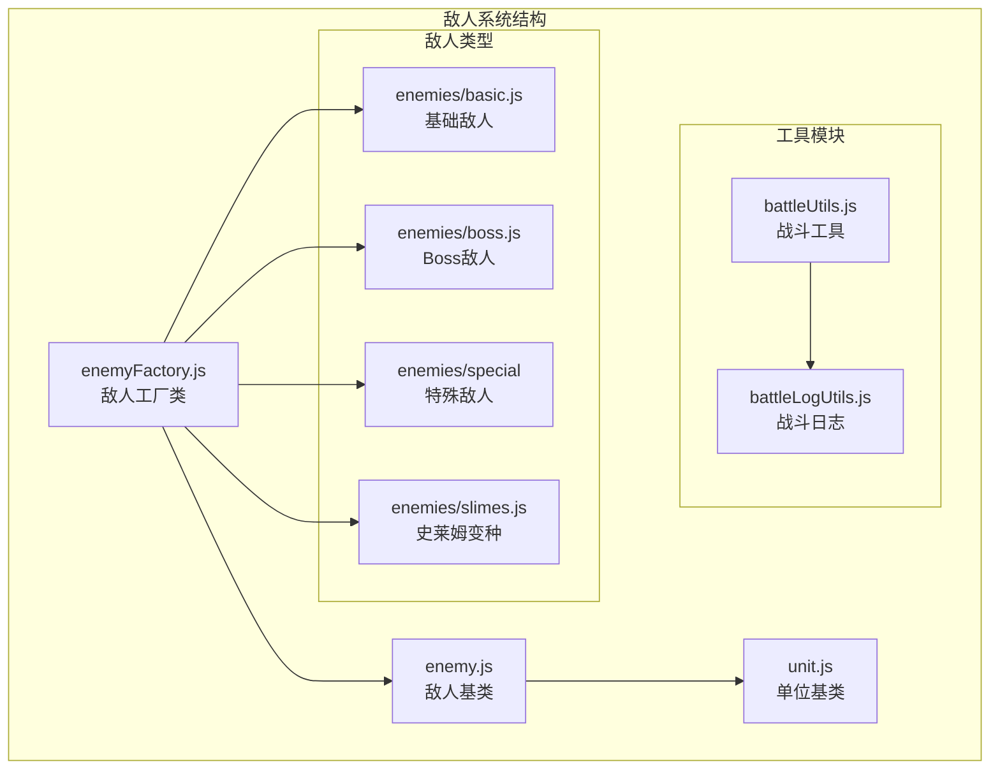
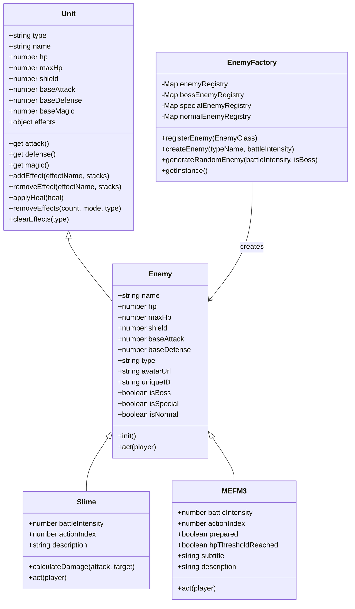
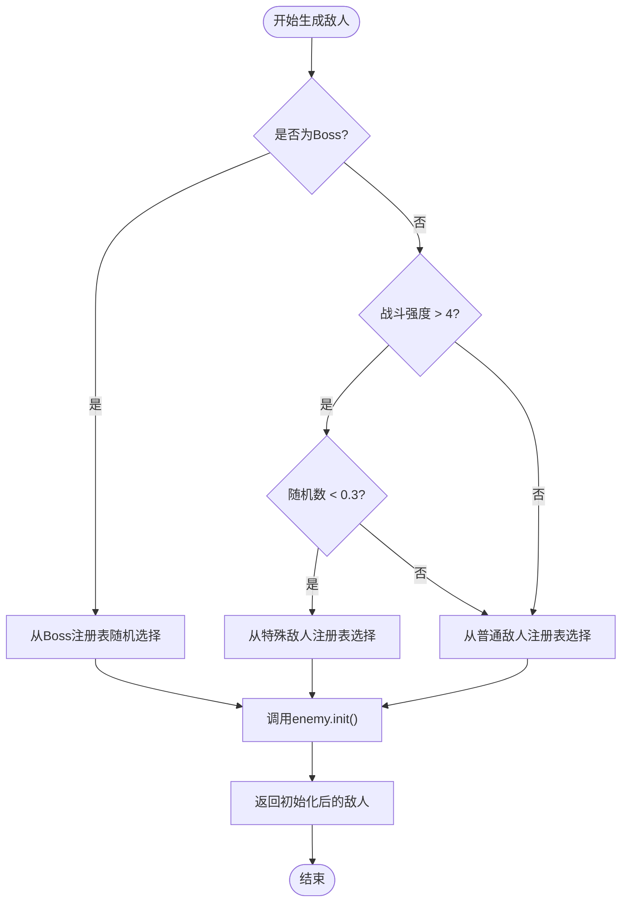
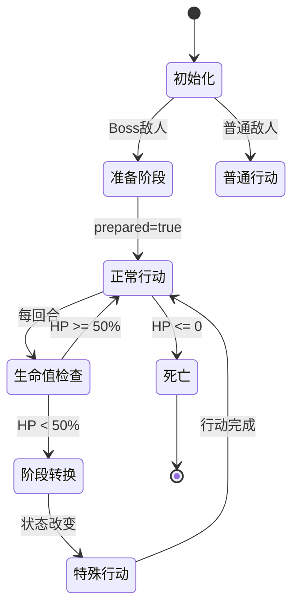
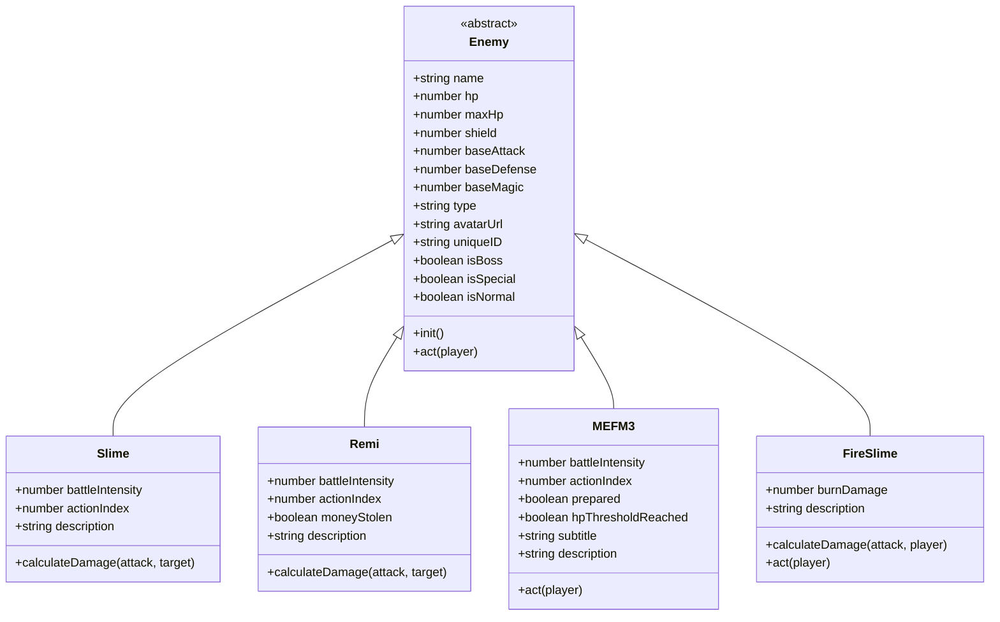
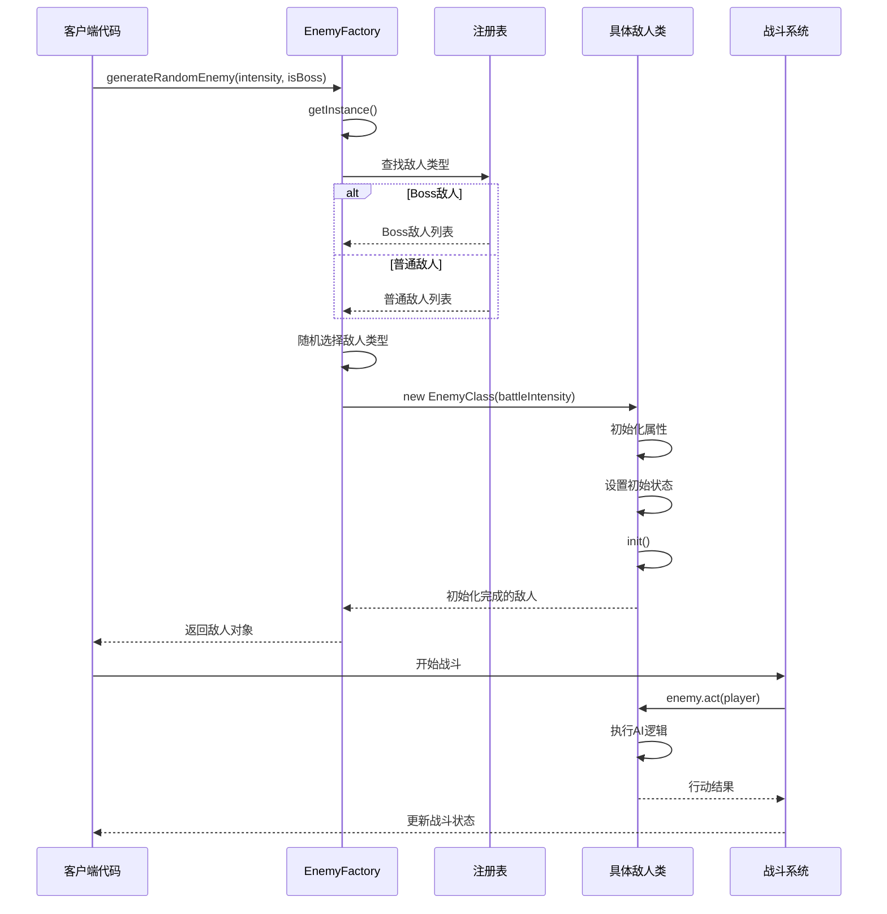
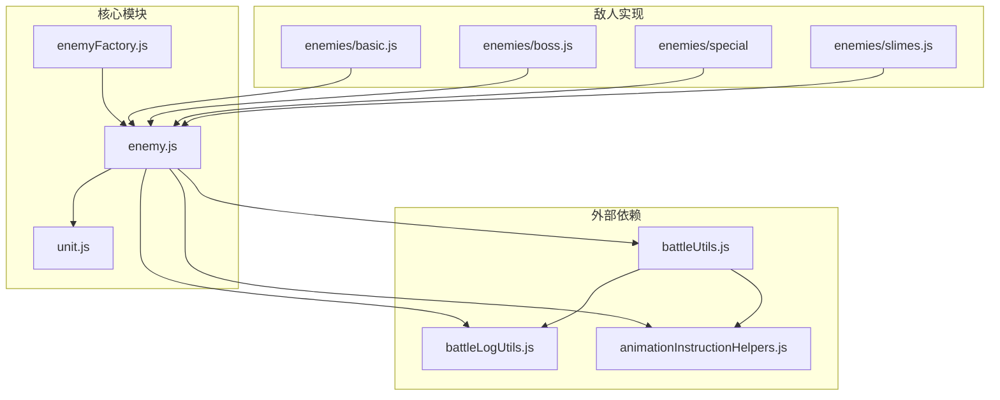

# 敌人系统

<cite>
**本文档引用的文件**
- [enemyFactory.js](file://src/data/enemyFactory.js)
- [enemy.js](file://src/data/enemy.js)
- [unit.js](file://src/data/unit.js)
- [basic.js](file://src/data/enemies/basic.js)
- [boss.js](file://src/data/enemies/boss.js)
- [slimes.js](file://src/data/enemies/slimes.js)
- [battleUtils.js](file://src/data/battleUtils.js)
- [battleLogUtils.js](file://src/data/battleLogUtils.js)
- [README.md](file://src/data/README.md)
</cite>

## 目录
1. [简介](#简介)
2. [项目结构](#项目结构)
3. [核心组件](#核心组件)
4. [架构概览](#架构概览)
5. [详细组件分析](#详细组件分析)
6. [依赖关系分析](#依赖关系分析)
7. [性能考虑](#性能考虑)
8. [故障排除指南](#故障排除指南)
9. [结论](#结论)

## 简介

敌人系统是游戏战斗机制的核心组成部分，负责管理敌人的生成、行为控制和状态管理。该系统采用工厂模式设计，支持多种敌人类型（基础、精英、Boss），并通过状态机实现复杂的AI行为逻辑。系统具有高度的可扩展性，允许开发者轻松添加新的敌人类型和行为模式。

## 项目结构

敌人系统主要分布在以下目录结构中：



**图表来源**
- [enemyFactory.js](file://src/data/enemyFactory.js#L1-L88)
- [enemy.js](file://src/data/enemy.js#L1-L44)
- [unit.js](file://src/data/unit.js#L1-L143)

**章节来源**
- [README.md](file://src/data/README.md#L43-L52)

## 核心组件

### 敌人工厂模式

敌人工厂采用单例模式和注册表模式，提供了统一的敌人生成接口：

```javascript
// 工厂初始化
constructor() {
  this.enemyRegistry = new Map();
  this.bossEnemyRegistry = new Map();
  this.specialEnemyRegistry = new Map();
  this.normalEnemyRegistry = new Map();
  
  // 注册预定义敌人
  this.registerEnemy(Slime);
  this.registerEnemy(Remi);
  this.registerEnemy(FireSlime);
  // ... 更多敌人
}
```

### 敌人基类设计

所有敌人都继承自Unit基类，具备统一的属性和方法：

```javascript
class Enemy extends Unit {
  constructor(name, hp, attack, defense, avatarUrl = '') {
    super();
    this.name = name;
    this.hp = hp;
    this.maxHp = hp;
    this.shield = 0;
    this.baseAttack = attack;
    this.baseDefense = defense;
    this.type = 'normal';
    this.avatarUrl = avatarUrl;
  }
}
```

**章节来源**
- [enemyFactory.js](file://src/data/enemyFactory.js#L8-L32)
- [enemy.js](file://src/data/enemy.js#L3-L25)

## 架构概览

敌人系统采用分层架构设计，从底层的基础单位到高层的工厂模式：



**图表来源**
- [unit.js](file://src/data/unit.js#L5-L143)
- [enemy.js](file://src/data/enemy.js#L3-L44)
- [enemyFactory.js](file://src/data/enemyFactory.js#L8-L88)
- [basic.js](file://src/data/enemies/basic.js#L5-L286)
- [boss.js](file://src/data/enemies/boss.js#L6-L155)

## 详细组件分析

### 敌人工厂模式实现

#### 工厂类设计

敌人工厂采用单例模式确保全局唯一性，使用Map数据结构维护敌人注册表：

```javascript
class EnemyFactory {
  constructor() {
    this.enemyRegistry = new Map();
    this.bossEnemyRegistry = new Map();
    this.specialEnemyRegistry = new Map();
    this.normalEnemyRegistry = new Map();
  }
  
  registerEnemy(EnemyClass) {
    const enemySample = new EnemyClass(1);
    this.enemyRegistry.set(enemySample.name, EnemyClass);
    if(enemySample.isBoss) this.bossEnemyRegistry.set(enemySample.name, EnemyClass);
    if(enemySample.isSpecial) this.specialEnemyRegistry.set(enemySample.name, EnemyClass);
    if(enemySample.isNormal) this.normalEnemyRegistry.set(enemySample.name, EnemyClass);
  }
}
```

#### 随机敌人生成算法

工厂实现了智能的随机敌人生成算法，根据战斗强度和类型权重进行选择：



**图表来源**
- [enemyFactory.js](file://src/data/enemyFactory.js#L45-L87)

#### 敌人类型分类系统

系统支持三种敌人类型，每种类型都有特定的行为特征：

1. **普通敌人（Normal）**：基础攻击和简单AI
2. **特殊敌人（Special）**：独特的技能和行为模式
3. **Boss敌人（Boss）**：复杂的战斗阶段和生命值阈值机制

**章节来源**
- [enemyFactory.js](file://src/data/enemyFactory.js#L8-L88)

### 敌人AI行为设计

#### 基础敌人行为模式

每个敌人必须实现`act(player)`方法来定义其AI行为：

```javascript
// 史莱姆的行动序列示例
act(player) {
  const actions = [
    () => {
      addEnemyActionLog(`${this.name} 冲撞！`);
      const damage = this.calculateDamage(this.attack, player);
      launchAttack(this, player, damage);
    },
    () => {
      addEnemyActionLog(`${this.name} 强力冲撞！`);
      const damage = this.calculateDamage(2 * this.attack, player);
      launchAttack(this, player, damage);
    },
    () => {
      const shieldAmount = 2 + this.magic;
      gainShield(this, this, shieldAmount);
      addEnemyActionLog(`${this.name} 进入防御状态，获得了 ${shieldAmount} 点护盾！`);
    }
  ];
  
  const action = actions[this.actionIndex % actions.length];
  this.actionIndex++;
  action();
}
```

#### Boss敌人特殊机制

Boss敌人具有特殊的战斗阶段和生命值阈值机制：

```javascript
// MEFM-3 Boss的特殊行为
act(player) {
  // 准备阶段
  if (!this.prepared) {
    this.prepared = true;
    this.addEffect('高燃弹药', 1);
    addEnemyActionLog(`${this.name} 完成了弹药装载，要来了！`);
    return;
  }
  
  // 生命值阈值检查
  if (!this.hpThresholdReached && this.hp < this.maxHp * 0.5) {
    this.hpThresholdReached = true;
    addEnemyActionLog(`${this.name} 承受了太多伤害，陷入了故障状态！`);
    this.addEffect('眩晕', 1);
    return;
  }
  
  // 正常行动序列...
}
```

#### 敌人状态机设计

敌人系统实现了基于状态的状态机，支持以下状态转换：



**图表来源**
- [boss.js](file://src/data/enemies/boss.js#L25-L155)

**章节来源**
- [basic.js](file://src/data/enemies/basic.js#L5-L286)
- [boss.js](file://src/data/enemies/boss.js#L6-L155)

### 敌人属性配置系统

#### 动态属性计算

敌人属性根据战斗强度动态计算，确保游戏平衡：

```javascript
// 史莱姆的动态属性计算
constructor(battleIntensity) {
  const hp = 27 + Math.floor(6 * battleIntensity);
  const attack = 3 + Math.floor(battleIntensity * 0.6);
  super('史莱姆', hp, attack, 1, 
    new URL('../../assets/enemies/slime.png', import.meta.url).href
  );
  this.battleIntensity = battleIntensity;
}
```

#### 敌人属性继承体系



**图表来源**
- [basic.js](file://src/data/enemies/basic.js#L5-L286)
- [boss.js](file://src/data/enemies/boss.js#L6-L155)
- [slimes.js](file://src/data/enemies/slimes.js#L8-L43)

**章节来源**
- [basic.js](file://src/data/enemies/basic.js#L5-L286)
- [boss.js](file://src/data/enemies/boss.js#L6-L155)
- [slimes.js](file://src/data/enemies/slimes.js#L8-L43)

### 敌人生成流程

#### 完整的敌人生成流程



**图表来源**
- [enemyFactory.js](file://src/data/enemyFactory.js#L45-L87)
- [basic.js](file://src/data/enemies/basic.js#L5-L286)

**章节来源**
- [enemyFactory.js](file://src/data/enemyFactory.js#L45-L87)

## 依赖关系分析

### 模块依赖图



**图表来源**
- [enemyFactory.js](file://src/data/enemyFactory.js#L1-L6)
- [enemy.js](file://src/data/enemy.js#L1-L2)
- [unit.js](file://src/data/unit.js#L1-L3)

**章节来源**
- [enemyFactory.js](file://src/data/enemyFactory.js#L1-L88)
- [enemy.js](file://src/data/enemy.js#L1-L44)
- [unit.js](file://src/data/unit.js#L1-L143)

### 敌人注册机制

系统通过自动检测敌人类型来维护多个注册表：

```javascript
registerEnemy(EnemyClass) {
  const enemySample = new EnemyClass(1);
  this.enemyRegistry.set(enemySample.name, EnemyClass);
  if(enemySample.isBoss) this.bossEnemyRegistry.set(enemySample.name, EnemyClass);
  if(enemySample.isSpecial) this.specialEnemyRegistry.set(enemySample.name, EnemyClass);
  if(enemySample.isNormal) this.normalEnemyRegistry.set(enemySample.name, EnemyClass);
}
```

这种设计允许敌人在不修改工厂代码的情况下自动注册到相应的分类中。

## 性能考虑

### 内存优化策略

1. **单例模式**：敌人工厂使用单例模式减少内存占用
2. **延迟初始化**：敌人对象只在需要时才创建
3. **对象池**：对于频繁创建的敌人类型，可以考虑对象池技术

### 计算复杂度分析

- **敌人注册**：O(1) - 使用Map数据结构
- **随机敌人选择**：O(1) - 数组索引访问
- **敌人行为计算**：O(1) - 基本数学运算和数组访问

### 扩展性设计

系统设计支持线性扩展，添加新敌人类型不会影响现有功能：

```javascript
// 添加新敌人类型非常简单
import {NewEnemy} from './enemies/newEnemy.js';

// 在工厂中注册
this.registerEnemy(NewEnemy);
```

## 故障排除指南

### 常见问题及解决方案

#### 1. 敌人生成失败

**问题症状**：调用`generateRandomEnemy()`时抛出错误

**可能原因**：
- 敌人类型未正确注册
- 战斗强度参数无效
- 敌人类定义错误

**解决方案**：
```javascript
// 检查敌人是否已注册
const instance = EnemyFactory.getInstance();
console.log(instance.enemyRegistry.has('敌人名称'));

// 验证战斗强度参数
if (battleIntensity <= 0) {
  throw new Error('战斗强度必须大于0');
}
```

#### 2. 敌人AI行为异常

**问题症状**：敌人执行意外的行动或重复相同动作

**可能原因**：
- `actionIndex`未正确重置
- 条件判断逻辑错误
- 敌人状态不一致

**解决方案**：
```javascript
// 确保actionIndex正确管理
act(player) {
  // 每回合重置或递增
  this.actionIndex = (this.actionIndex + 1) % this.actions.length;
  const action = this.actions[this.actionIndex];
  action();
}
```

#### 3. 敌人属性计算错误

**问题症状**：敌人属性不符合预期

**可能原因**：
- 战斗强度计算公式错误
- 属性继承链问题
- 数据类型转换错误

**解决方案**：
```javascript
// 验证属性计算
constructor(battleIntensity) {
  const hp = Math.floor(27 + 6 * battleIntensity);
  const attack = Math.floor(3 + battleIntensity * 0.6);
  console.log(`HP: ${hp}, Attack: ${attack}`);
  super('史莱姆', hp, attack, 1, imageUrl);
}
```

**章节来源**
- [enemyFactory.js](file://src/data/enemyFactory.js#L34-L43)
- [basic.js](file://src/data/enemies/basic.js#L5-L286)

## 结论

敌人系统采用了优秀的工厂模式设计，具有以下优势：

1. **高度模块化**：每个敌人类型独立实现，便于维护和扩展
2. **类型安全**：通过类型标记确保敌人分类正确
3. **智能生成**：基于战斗强度和类型权重的随机生成算法
4. **状态机设计**：支持复杂的AI行为和战斗阶段转换
5. **性能优化**：单例模式和Map数据结构确保高效运行

该系统为游戏提供了强大的敌人管理能力，支持从简单的史莱姆到复杂的Boss敌人的多样化需求。通过合理的架构设计和扩展机制，开发者可以轻松添加新的敌人类型和行为模式，满足游戏不断发展的需求。

未来的改进方向包括：
- 实现敌人对象池以提高性能
- 添加更复杂的AI决策树
- 支持敌人行为的动态调整
- 增强敌人生成的多样性
- 优化战斗动画和视觉效果