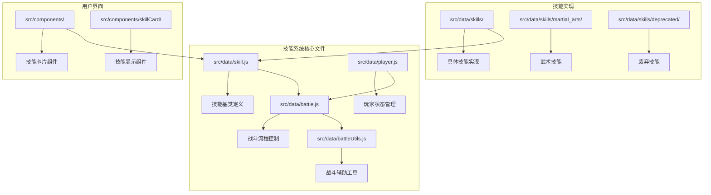
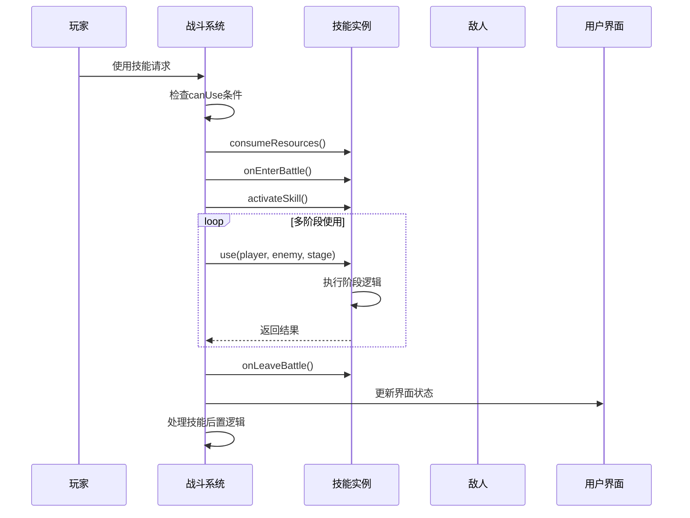
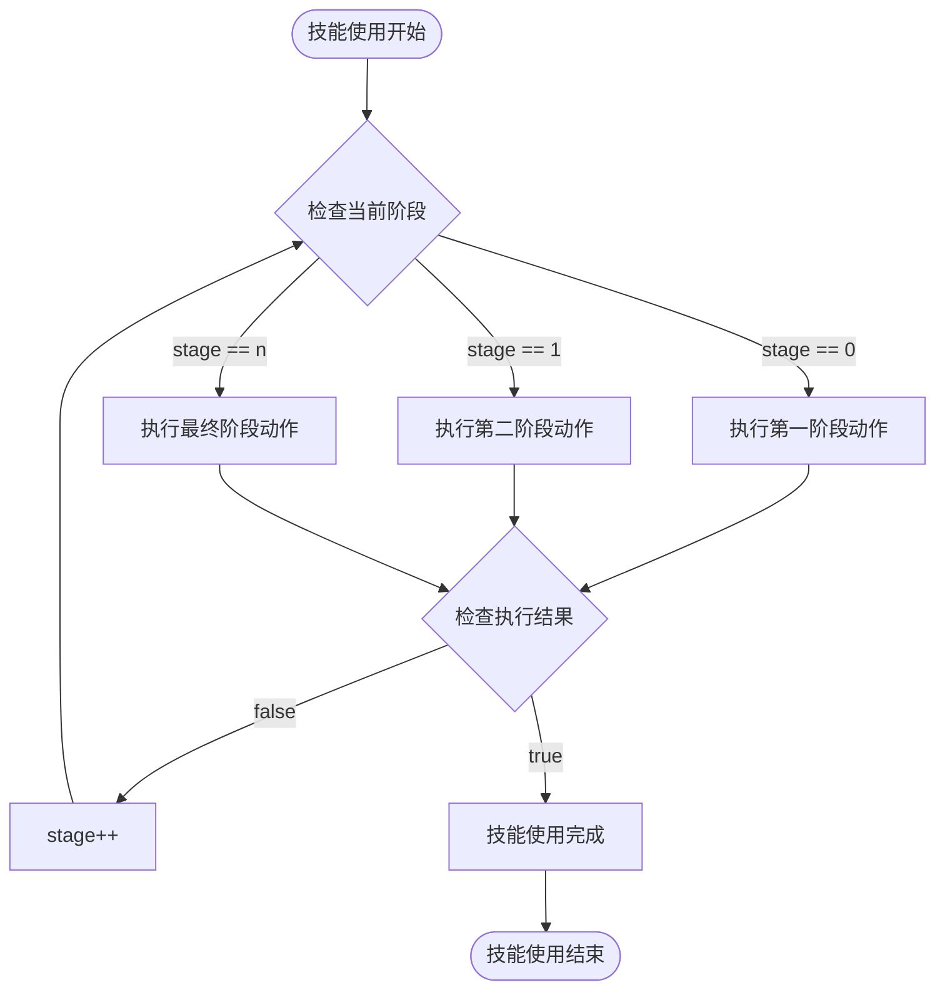
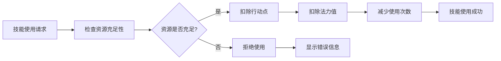
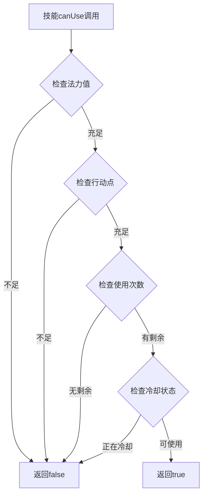
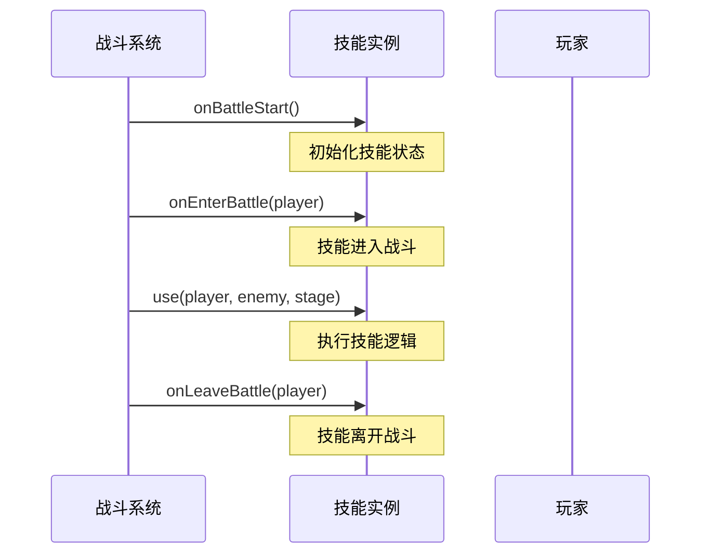
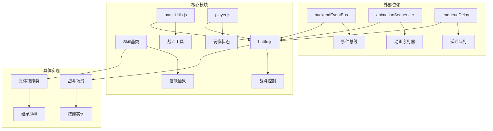

# 技能使用生命周期

<cite>
**本文档中引用的文件**
- [src/data/skill.js](file://src/data/skill.js)
- [src/data/battle.js](file://src/data/battle.js)
- [src/data/battleUtils.js](file://src/data/battleUtils.js)
- [src/data/player.js](file://src/data/player.js)
- [src/data/testSkill.js](file://src/data/testSkill.js)
- [src/data/skills/martial_arts/heavySmash.js](file://src/data/skills/martial_arts/heavySmash.js)
- [src/data/skills/deprecated/fireAssist.js](file://src/data/skills/deprecated/fireAssist.js)
- [src/data/skills/deprecated/speedThinking.js](file://src/data/skills/deprecated/speedThinking.js)
- [src/data/skills/deprecated/cMinus.js](file://src/data/skills/deprecated/cMinus.js)
- [src/components/global/skillCard/SkillCosts.vue](file://src/components/global/skillCard/SkillCosts.vue)
</cite>

## 目录
1. [简介](#简介)
2. [项目结构概览](#项目结构概览)
3. [核心组件分析](#核心组件分析)
4. [架构概览](#架构概览)
5. [详细组件分析](#详细组件分析)
6. [依赖关系分析](#依赖关系分析)
7. [性能考虑](#性能考虑)
8. [故障排除指南](#故障排除指南)
9. [结论](#结论)

## 简介

本文档详细描述了RPG游戏中技能从准备使用到执行完毕的完整生命周期流程。通过对核心技能系统的深入分析，我们将探讨`use`方法的多阶段调用机制、`consumeResources`方法的资源协调机制、`canUse`判断条件的组成要素，以及各种生命周期钩子的触发时机和应用场景。

技能系统是RPG游戏的核心机制之一，它不仅决定了角色的能力表现，还直接影响战斗策略和游戏体验。本文档将通过具体的代码分析和战斗场景示例，展示技能使用过程中的各个关键步骤和状态变迁。

## 项目结构概览

技能系统采用模块化设计，主要文件分布在以下目录结构中：



**图表来源**
- [src/data/skill.js](file://src/data/skill.js#L1-L205)
- [src/data/battle.js](file://src/data/battle.js#L1-L553)
- [src/data/battleUtils.js](file://src/data/battleUtils.js#L1-L365)

**章节来源**
- [src/data/skill.js](file://src/data/skill.js#L1-L205)
- [src/data/battle.js](file://src/data/battle.js#L1-L553)

## 核心组件分析

### 技能基类 (Skill)

技能基类是整个技能系统的核心，定义了所有技能的基本属性和行为：

```javascript
class Skill {
  constructor(name, type, tier, baseManaCost, baseActionPointCost, baseMaxUses, skillSeriesName = undefined, spawnWeight = undefined) {
    this.name = name;
    this.type = type;
    this.tier = tier;
    this.uniqueID = Math.random().toString(36).substring(2, 10);
    this.power = 0;
    this.baseManaCost = baseManaCost || 0;
    this.baseActionPointCost = (baseActionPointCost !== undefined) ? baseActionPointCost : 1;
    this.baseMaxUses = baseMaxUses || 1;
    this.remainingUses = this.maxUses;
    this.remainingColdDownTurns = 0;
    this.baseColdDownTurns = 0;
    this.baseSlowStart = false;
  }
}
```

### 战斗系统 (Battle)

战斗系统负责协调技能使用过程中的所有事件和状态转换：

```javascript
export function activateSkill(skill) {
  const modPlayer = gameState.player.getModifiedPlayer ? gameState.player.getModifiedPlayer() : gameState.player;
  processSkillActivationEffects(modPlayer);
  
  var stage = 0;
  while(true) {
    const result = skill.use(modPlayer, gameState.enemy, stage);
    if(result === true) break;
    stage++;
  }
  return false;
}
```

**章节来源**
- [src/data/skill.js](file://src/data/skill.js#L1-L205)
- [src/data/battle.js](file://src/data/battle.js#L130-L150)

## 架构概览

技能使用生命周期采用事件驱动的架构模式，通过多个阶段的状态转换来实现复杂的技能行为：



**图表来源**
- [src/data/battle.js](file://src/data/battle.js#L130-L200)
- [src/data/skill.js](file://src/data/skill.js#L130-L180)

## 详细组件分析

### use方法的多阶段调用机制

`use`方法是技能系统的核心，支持多阶段调用以实现复杂的技能行为：

#### 基础单阶段技能

简单的技能通常只需要一个阶段就能完成：

```javascript
// 重击技能示例
use(player, enemy, stage) {
  if(stage === 0) {
    const atkPassThroughDamage = launchAttack(player, enemy, this.damage).passThoughDamage;
    return atkPassThroughDamage <= 0;
  } else {
    enemy.addEffect('易伤', this.stack);
    return true;
  }
}
```

#### 复杂多阶段技能

复杂的技能可能需要多个阶段来完成不同的动作：

```javascript
// 炽热诅咒技能示例
use(player, enemy, stage) {
  if (stage === 0) {
    const closestSkillID = this.getClosestSkill(player)?.uniqueID;
    burnSkillCard(player, closestSkillID, true);
    return false;
  } else {
    enemy.addEffect('燃烧', this.getStacks(player));
    return true;
  }
}
```

#### 多次重复技能

某些技能需要重复多次才能完成：

```javascript
// 火焰连击技能示例
use(player, enemy, stage) {
  if (stage === 0) {
    launchAttack(player, enemy, this.getDamage(player));
    return false;
  } else if(stage === 1) {
    enqueueDelay(500);
    launchAttack(player, enemy, this.getDamage(player));
    return false;
  } else {
    enqueueDelay(500);
    launchAttack(player, enemy, this.getDamage(player));
    return true;
  }
}
```



**图表来源**
- [src/data/skills/martial_arts/heavySmash.js](file://src/data/skills/martial_arts/heavySmash.js#L25-L40)
- [src/data/skills/deprecated/fireAssist.js](file://src/data/skills/deprecated/fireAssist.js#L505-L525)

**章节来源**
- [src/data/skills/martial_arts/heavySmash.js](file://src/data/skills/martial_arts/heavySmash.js#L25-L40)
- [src/data/skills/deprecated/fireAssist.js](file://src/data/skills/deprecated/fireAssist.js#L505-L525)

### consumeResources方法的资源协调机制

`consumeResources`方法负责协调行动点、法力值和技能使用次数的综合消耗：

```javascript
consumeResources (player) {
  player.consumeActionPoints(this.actionPointCost);
  player.consumeMana(this.manaCost);
  this.consumeUses()
}
```

#### 资源消耗流程



**图表来源**
- [src/data/skill.js](file://src/data/skill.js#L170-L175)

**章节来源**
- [src/data/skill.js](file://src/data/skill.js#L170-L175)

### canUse判断条件的组成要素

`canUse`方法定义了技能是否可以使用的判断条件：

```javascript
canUse(player) {
  return player.mana >= this.manaCost && 
         player.remainingActionPoints >= this.actionPointCost && 
         this.remainingUses > 0;
}
```

#### 判断条件详解

1. **法力值检查**：确保玩家有足够的法力值
2. **行动点检查**：确保玩家有足够的行动点
3. **使用次数检查**：确保技能还有可用次数
4. **冷却状态检查**：确保技能不在冷却中



**图表来源**
- [src/data/skill.js](file://src/data/skill.js#L180-L185)

**章节来源**
- [src/data/skill.js](file://src/data/skill.js#L180-L185)

### 生命周期钩子的触发时机和应用场景

技能系统提供了多个生命周期钩子，允许技能在特定时刻执行自定义逻辑：

#### onBattleStart钩子

在战斗开始时调用，用于初始化技能状态：

```javascript
onBattleStart() {
  if(!this.slowStart) {
    this.remainingUses = this.maxUses;
    this.remainingColdDownTurns = this.coldDownTurns;
  } else {
    this.remainingUses = 0;
    this.remainingColdDownTurns = this.coldDownTurns;
  }
}
```

#### onEnterBattle钩子

当技能进入战斗时调用：

```javascript
onEnterBattle(player) {
  // 默认实现，子类可以重写
}
```

#### onLeaveBattle钩子

当技能离开战斗时调用：

```javascript
onLeaveBattle(player) {
  // 默认实现，子类可以重写
}
```

#### 生命周期钩子序列



**图表来源**
- [src/data/skill.js](file://src/data/skill.js#L110-L130)
- [src/data/battle.js](file://src/data/battle.js#L50-L70)

**章节来源**
- [src/data/skill.js](file://src/data/skill.js#L110-L130)
- [src/data/battle.js](file://src/data/battle.js#L50-L70)

### regenerateDescription方法的动态生成机制

`regenerateDescription`方法负责根据玩家状态动态生成技能描述：

```javascript
regenerateDescription(player) {
  if(player) {
    return `造成${this.damage + (player?.attack ?? 0)}伤害，命中则赋予/effect{易伤}${countString(this.stack, '层')}`;
  }
  return `造成${this.damage + (player?.attack ?? 0)}伤害，每点现有行动力重复一次`;
}
```

#### 描述生成时机

1. **技能选择界面**：显示技能预览信息
2. **技能使用前**：确认技能效果
3. **技能升级后**：更新技能描述
4. **玩家状态变化**：实时更新描述内容

**章节来源**
- [src/data/skills/martial_arts/heavySmash.js](file://src/data/skills/martial_arts/heavySmash.js#L35-L40)

## 依赖关系分析

技能系统的依赖关系体现了清晰的分层架构：



**图表来源**
- [src/data/skill.js](file://src/data/skill.js#L1-L5)
- [src/data/battle.js](file://src/data/battle.js#L1-L20)

**章节来源**
- [src/data/skill.js](file://src/data/skill.js#L1-L205)
- [src/data/battle.js](file://src/data/battle.js#L1-L553)

## 性能考虑

技能系统在设计时充分考虑了性能优化：

### 资源消耗优化

1. **延迟计算**：技能描述采用延迟计算，只在需要时生成
2. **缓存机制**：频繁访问的数据进行缓存
3. **批量处理**：多个技能同时冷却时批量处理

### 动画性能优化

1. **异步处理**：动画与逻辑分离，避免阻塞
2. **队列管理**：使用动画序列器管理动画队列
3. **DOM优化**：最小化DOM操作频率

### 内存管理

1. **对象池**：重用技能对象减少GC压力
2. **及时清理**：战斗结束后及时清理技能引用
3. **弱引用**：使用弱引用避免内存泄漏

## 故障排除指南

### 常见问题及解决方案

#### 技能无法使用

**症状**：技能按钮灰色不可点击
**原因**：
1. 法力值不足
2. 行动点不足
3. 技能冷却中
4. 使用次数已用完

**解决方法**：
```javascript
// 检查canUse条件
console.log('法力值:', player.mana, '需求:', skill.manaCost);
console.log('行动点:', player.remainingActionPoints, '需求:', skill.actionPointCost);
console.log('剩余使用次数:', skill.remainingUses);
console.log('冷却回合:', skill.remainingColdDownTurns);
```

#### 多阶段技能异常

**症状**：技能执行到一半中断
**原因**：
1. 阶段计数错误
2. 返回值不符合预期
3. 中断条件设置不当

**解决方法**：
```javascript
// 确保use方法正确返回布尔值
use(player, enemy, stage) {
  // 第一阶段必须返回false
  if(stage === 0) {
    return false;
  }
  // 最后一阶段必须返回true
  return true;
}
```

#### 生命周期钩子失效

**症状**：技能状态初始化失败
**原因**：
1. 钩子函数未正确调用
2. 参数传递错误
3. 异常处理不当

**解决方法**：
```javascript
// 确保生命周期钩子正确实现
onBattleStart() {
  try {
    super.onBattleStart();
    // 自定义初始化逻辑
  } catch(error) {
    console.error('onBattleStart失败:', error);
  }
}
```

**章节来源**
- [src/data/skill.js](file://src/data/skill.js#L180-L185)
- [src/data/battle.js](file://src/data/battle.js#L130-L150)

## 结论

技能使用生命周期是一个复杂而精密的系统，它通过精心设计的架构和多个组件的协作，实现了丰富多样的技能行为。本文档详细分析了以下几个关键方面：

1. **多阶段调用机制**：`use`方法支持灵活的多阶段执行，满足不同类型技能的需求
2. **资源协调机制**：`consumeResources`方法统一管理各种资源的消耗
3. **判断条件系统**：`canUse`方法提供全面的技能可用性检查
4. **生命周期钩子**：提供丰富的时机点来执行自定义逻辑
5. **动态描述生成**：`regenerateDescription`方法根据状态实时更新描述

这些设计使得技能系统既具有高度的灵活性，又保持了良好的可维护性和扩展性。开发者可以通过继承Skill基类来创建新的技能，利用现有的生命周期钩子和工具函数来实现复杂的技能行为。

通过深入理解这些机制，开发者可以更好地设计和实现游戏中的技能系统，为玩家提供丰富而有趣的战斗体验。