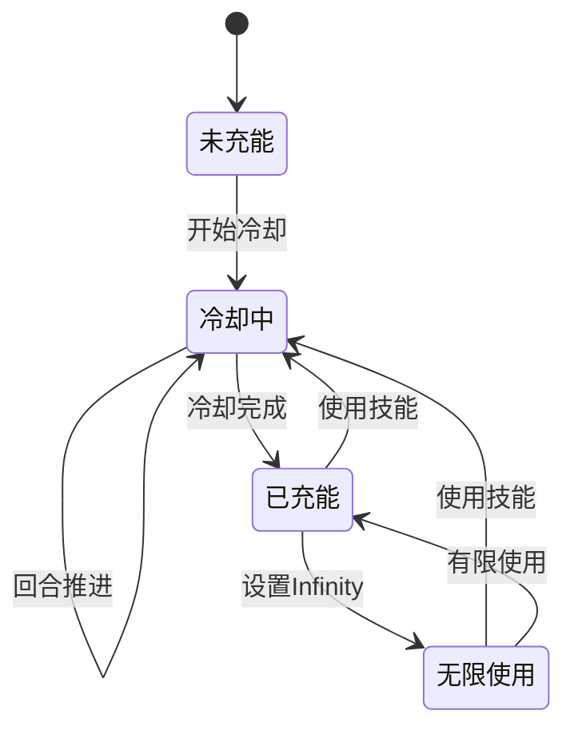
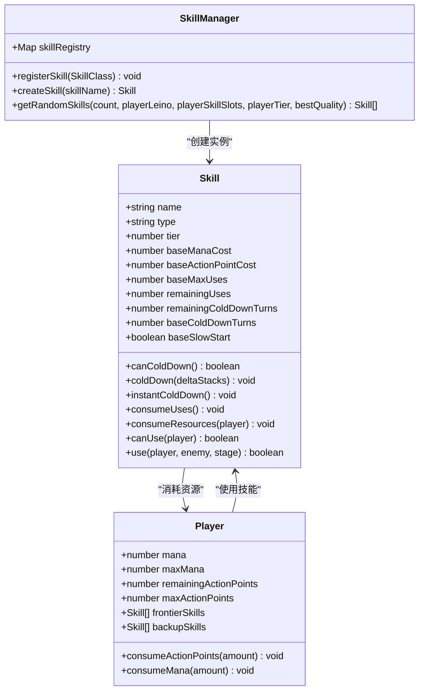
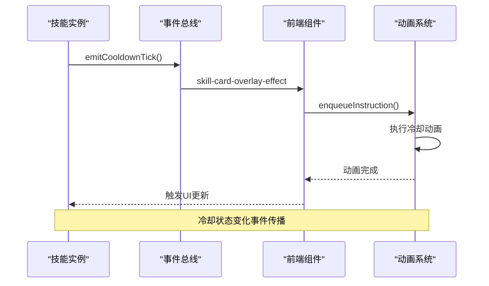

# 技能充能机制

<cite>
**本文档中引用的文件**
- [src/data/skill.js](file://src/data/skill.js)
- [src/data/player.js](file://src/data/player.js)
- [src/data/skillManager.js](file://src/data/skillManager.js)
- [src/data/battleUtils.js](file://src/data/battleUtils.js)
- [src/data/battle.js](file://src/data/battle.js)
- [src/data/skills/martial_arts/agilePunch.js](file://src/data/skills/martial_arts/agilePunch.js)
- [src/data/skills/deprecated/shielding.js](file://src/data/skills/deprecated/shielding.js)
- [src/data/skills/deprecated/speedThinking.js](file://src/data/skills/deprecated/speedThinking.js)
- [src/data/skills/martial_arts/preparedHit.js](file://src/data/skills/martial_arts/preparedHit.js)
</cite>

## 目录
1. [简介](#简介)
2. [核心概念](#核心概念)
3. [技能充能架构](#技能充能架构)
4. [关键属性详解](#关键属性详解)
5. [充能机制深度分析](#充能机制深度分析)
6. [资源消耗系统](#资源消耗系统)
7. [特殊充能机制](#特殊充能机制)
8. [事件触发机制](#事件触发机制)
9. [性能优化考虑](#性能优化考虑)
10. [故障排除指南](#故障排除指南)
11. [总结](#总结)

## 简介

技能充能系统是游戏战斗机制的核心组成部分，负责管理技能的可用性、冷却时间和使用次数。该系统通过复杂的属性管理和状态转换机制，实现了灵活且富有策略性的技能使用体验。

本文档将深入分析技能充能系统的实现原理，涵盖核心属性设计、资源消耗逻辑、特殊机制以及事件触发机制等关键方面。

## 核心概念

### 技能充能的基本要素

技能充能系统围绕以下几个核心概念构建：

- **充能次数（Uses）**：技能当前可用的使用次数
- **冷却回合（ColdDown Turns）**：技能从满充能到完全冷却所需的回合数
- **剩余冷却时间（Remaining ColdDown Turns）**：当前技能距离完全充能还剩多少回合
- **最大充能次数（Max Uses）**：技能的最大充能次数，Infinity表示无限使用

### 充能状态转换



## 技能充能架构

### 类层次结构



**图表来源**
- [src/data/skill.js](file://src/data/skill.js#L1-L205)
- [src/data/player.js](file://src/data/player.js#L1-L226)
- [src/data/skillManager.js](file://src/data/skillManager.js#L1-L253)

## 关键属性详解

### baseMaxUses - 基础最大充能次数

`baseMaxUses` 是技能的基础最大充能次数，决定了技能的初始可用性：

```javascript
// 在构造函数中初始化
this.baseMaxUses = baseMaxUses || 1; // 基础最大充能次数，inf代表无需充能，可以随便用
this.remainingUses = this.maxUses; // 剩余充能次数
```

**设计意图**：
- `1`：标准技能，需要冷却才能再次使用
- `Infinity`：无限使用技能，无需冷却
- `0`：特殊技能，可能需要前置条件才能使用

### remainingUses - 剩余充能次数

`remainingUses` 表示当前技能还能使用的次数：

```javascript
get maxUses () {
  return this.baseMaxUses;
}

// 使用技能时减少剩余充能次数
consumeUses () {
  const prevUses = this.remainingUses;
  this.remainingUses--;
  // 使用技能本身不改变 remainingColdDownTurns，故不发送 tick
  try { if (prevUses === this.maxUses && this.canColdDown()) { /* 进入冷却但不发送事件 */ } } catch (_) {}
}
```

### remainingColdDownTurns - 剩余冷却回合

`remainingColdDownTurns` 记录技能距离完全充能还需要多少回合：

```javascript
get coldDownTurns() {
  return Math.max(this.baseColdDownTurns, 0);
}
```

**节来源**
- [src/data/skill.js](file://src/data/skill.js#L15-L35)
- [src/data/skill.js](file://src/data/skill.js#L82-L121)

## 充能机制深度分析

### canColdDown() - 冷却判断逻辑

`canColdDown()` 方法确定技能是否可以进入冷却状态：

```javascript
canColdDown() {
  if(this.coldDownTurns === 0) return false;
  if(this.remainingUses === this.maxUses) return false;
  if(this.maxUses === Infinity) return false;
  return true;
}
```

**边界条件处理**：
- 冷却回合为0的技能无法冷却
- 已满充能的技能无法再次充能
- 无限使用技能（Infinity）无法冷却

### coldDown() - 冷却推进机制

`coldDown()` 方法推进技能的冷却进程：

```javascript
coldDown(deltaStacks = 1) {
  if (this.coldDownTurns !== 0) {
    if (this.remainingUses !== this.maxUses) {
      this.remainingColdDownTurns = Math.max(this.remainingColdDownTurns - deltaStacks, 0);
      this.remainingColdDownTurns = Math.min(this.remainingColdDownTurns, this.coldDownTurns);
      let charged = false;
      if (this.remainingColdDownTurns <= 0) {
        this.remainingColdDownTurns = this.coldDownTurns;
        this.remainingUses = Math.min(this.remainingUses + 1, this.maxUses);
        charged = true;
      }
      // 无论是否完成一段充能，只要 remainingColdDownTurns 发生了变化就发一次 tick
      this._emitCooldownTick(deltaStacks);
    } else {
      this.resetColdDownProcess();
    }
  }
}
```

**算法复杂度分析**：
- 时间复杂度：O(1)
- 空间复杂度：O(1)

### instantColdDown() - 立即冷却机制

`instantColdDown()` 实现立即充能的特殊机制：

```javascript
instantColdDown() {
  if (this.canColdDown()) {
    this.remainingUses = Math.min(this.remainingUses + 1, this.maxUses);
    this.resetColdDownProcess();
    // 重置后也算一次冷却状态变化
    this._emitCooldownTick();
  }
}
```

**特殊机制特点**：
- 立即完成冷却进程
- 触发冷却事件通知
- 适用于技能重置、升级等场景

**节来源**
- [src/data/skill.js](file://src/data/skill.js#L82-L121)
- [src/data/skill.js](file://src/data/skill.js#L123-L135)

## 资源消耗系统

### consumeResources() - 综合资源消耗

技能使用时的综合资源消耗逻辑：

```javascript
consumeResources (player) {
  player.consumeActionPoints(this.actionPointCost);
  player.consumeMana(this.manaCost);
  this.consumeUses()
}
```

### player.consumeActionPoints() - 行动力消耗

```javascript
consumeActionPoints (amount) {
  this.remainingActionPoints -= amount;
  this.remainingActionPoints = Math.max(this.remainingActionPoints, 0);
}
```

### player.consumeMana() - 魏启消耗

```javascript
consumeMana (amount) {
  this.mana -= amount;
  this.mana = Math.max(this.mana, 0);
  this.mana = Math.min(this.mana, this.maxMana);
}
```

**资源约束机制**：
- 行动力不足时无法使用技能
- 魏启不足时无法使用技能
- 技能使用次数耗尽时无法使用

### canUse() - 技能可用性判断

```javascript
canUse(player) {
  // 默认实现：检查魏启和行动点是否足够
  return player.mana >= this.manaCost && player.remainingActionPoints >= this.actionPointCost && this.remainingUses > 0;
}
```

**节来源**
- [src/data/skill.js](file://src/data/skill.js#L137-L145)
- [src/data/player.js](file://src/data/player.js#L185-L195)
- [src/data/player.js](file://src/data/player.js#L197-L207)
- [src/data/skill.js](file://src/data/skill.js#L157-L160)

## 特殊充能机制

### 无限使用技能（Infinity）

当 `maxUses` 为 Infinity 时，技能具有无限使用特性：

```javascript
// 在 canColdDown 中的特殊处理
if(this.maxUses === Infinity) return false;

// 在 coldDown 中的特殊处理
this.remainingUses = Math.min(this.remainingUses + 1, this.maxUses);
```

**无限使用技能的特点**：
- 永远不需要冷却
- 可以无限次使用
- 不参与常规冷却流程
- 适用于核心技能、天赋技能等

### 慢热型技能（Slow Start）

慢热型技能在战斗开始时需要等待冷却：

```javascript
onBattleStart() {
  if(!this.slowStart) {
    this.remainingUses = this.maxUses;
    this.remainingColdDownTurns = this.coldDownTurns;
  } else {
    // 冷启动卡牌必须等待冷却后才能发动！
    this.remainingUses = 0;
    this.remainingColdDownTurns = this.coldDownTurns;
  }
}
```

**慢热型技能的应用**：
- 需要准备时间的技能
- 需要特定条件才能激活的技能
- 增加策略深度的技能设计

### 技能升级与充能

```javascript
powerUp(deltaPower = 1) {
  this.power += deltaPower;
  this._emitUpgradeFlash(deltaPower);
}
```

**升级对充能的影响**：
- 影响技能基础属性
- 可能改变冷却时间
- 可能改变最大充能次数

**节来源**
- [src/data/skill.js](file://src/data/skill.js#L82-L88)
- [src/data/skill.js](file://src/data/skill.js#L137-L145)
- [src/data/skill.js](file://src/data/skill.js#L147-L155)

## 事件触发机制

### 冷却事件通知

```javascript
_emitCooldownTick (deltaCooldown = 1) {
  try {
    const id = this.uniqueID;
    animationSequencer.enqueueInstruction({
      tags: ['skill-cd', `skill-${id}`],
      durationMs: 100,
      start: ({ emit }) => emit('skill-card-overlay-effect', { id, type: 'cooldown-tick', deltaCooldown: deltaCooldown }),
      meta: { skillId: id, overlay: true, phase: 'cooldown-tick' }
    });
    if(deltaCooldown !== 0) {
      enqueueDelay(0);
    }
  } catch (_) {}
}
```

### 升级事件通知

```javascript
_emitUpgradeFlash(deltaPower = 1) {
  try {
    const id = this.uniqueID;
    animationSequencer.enqueueInstruction({
      tags: ['skill-upgrade', `skill-${id}`],
      durationMs: 100,
      start: ({ emit }) => emit('skill-card-overlay-effect', { id, type: 'upgrade-flash', 'deltaPower': deltaPower }),
      meta: { skillId: id, overlay: true, phase: 'upgrade-flash' }
    });
  } catch (_) {}
}
```

### 事件传播流程



**图表来源**
- [src/data/skill.js](file://src/data/skill.js#L40-L58)
- [src/data/skill.js](file://src/data/skill.js#L60-L72)

### 边界条件处理

**技能从满充能进入冷却状态**：

```javascript
consumeUses () {
  const prevUses = this.remainingUses;
  this.remainingUses--;
  // 使用技能本身不改变 remainingColdDownTurns，故不发送 tick；
  // 进入冷却的首个 tick 等待下一次 coldDown() 推进后发送
  try { if (prevUses === this.maxUses && this.canColdDown()) { /* 进入冷却但不发送事件 */ } } catch (_) {}
}
```

**节来源**
- [src/data/skill.js](file://src/data/skill.js#L40-L58)
- [src/data/skill.js](file://src/data/skill.js#L60-L72)
- [src/data/skill.js](file://src/data/skill.js#L157-L160)

## 性能优化考虑

### 冷却推进优化

```javascript
// 避免不必要的状态更新
if (this.remainingColdDownTurns <= 0) {
  this.remainingColdDownTurns = this.coldDownTurns;
  this.remainingUses = Math.min(this.remainingUses + 1, this.maxUses);
  charged = true;
}
// 无论是否完成一段充能，只要 remainingColdDownTurns 发生了变化就发一次 tick
this._emitCooldownTick(deltaStacks);
```

### 内存管理

```javascript
// 克隆技能对象时的深拷贝优化
function cloneSkill(skill) {
  const skillPrototype = Object.getPrototypeOf(skill);
  const clonedSkill = Object.create(skillPrototype);
  
  // 递归克隆属性，避免深层嵌套
  for (const key in skill) {
    if (skill.hasOwnProperty(key)) {
      const value = skill[key];
      if (typeof value === 'object' && value !== null) {
        clonedSkill[key] = cloneSkill(value);
      } else {
        clonedSkill[key] = value;
      }
    }
  }
  
  return clonedSkill;
}
```

### 批量冷却处理

```javascript
// 战斗开始时批量处理所有技能冷却
gameState.player.frontierSkills.forEach(skill => {
  skill.coldDown();
});
gameState.player.backupSkills.forEach(skill => {
  skill.coldDown();
});
```

## 故障排除指南

### 常见问题诊断

**问题1：技能无法冷却**
- 检查 `baseColdDownTurns` 是否为0
- 确认 `remainingUses` 是否等于 `maxUses`
- 验证 `maxUses` 是否为 Infinity

**问题2：无限使用技能失效**
- 检查 `maxUses` 属性设置
- 确认 `canColdDown()` 返回值
- 验证冷却逻辑执行路径

**问题3：资源消耗异常**
- 检查 `consumeResources()` 调用时机
- 确认 `canUse()` 返回值
- 验证资源状态更新逻辑

### 调试技巧

```javascript
// 添加调试日志
console.log(`Skill ${this.name}: maxUses=${this.maxUses}, remainingUses=${this.remainingUses}, coldDownTurns=${this.coldDownTurns}`);

// 监控事件触发
backendEventBus.on('skill-card-overlay-effect', (data) => {
  console.log('Skill cooldown event:', data);
});
```

### 性能监控

```javascript
// 监控冷却推进频率
const cooldownTimer = setInterval(() => {
  const totalSkills = gameState.player.frontierSkills.length + gameState.player.backupSkills.length;
  console.log(`Cooldown cycle: ${totalSkills} skills processed`);
}, 1000);
```

## 总结

技能充能系统是一个精心设计的复杂机制，通过以下关键特性提供了丰富的游戏体验：

### 核心优势

1. **灵活性**：支持有限充能、无限使用、慢热型等多种技能类型
2. **可扩展性**：清晰的类继承结构便于添加新的技能类型
3. **性能优化**：高效的冷却推进算法和内存管理
4. **事件驱动**：完整的事件系统支持实时状态更新

### 设计亮点

- **边界条件处理**：完善的特殊场景处理逻辑
- **资源联动**：技能消耗与角色状态的紧密集成
- **动画同步**：事件驱动的动画系统确保视觉反馈及时准确
- **调试友好**：详细的日志记录和监控机制

### 应用建议

- 合理设置 `baseMaxUses` 和 `baseColdDownTurns` 参数
- 充分利用 `canColdDown()` 的特殊处理逻辑
- 重视事件系统的正确使用
- 注意性能优化和内存管理

技能充能系统为游戏战斗提供了深度的策略性和可玩性，通过合理的配置和优化，能够创造出丰富多样的技能使用体验。