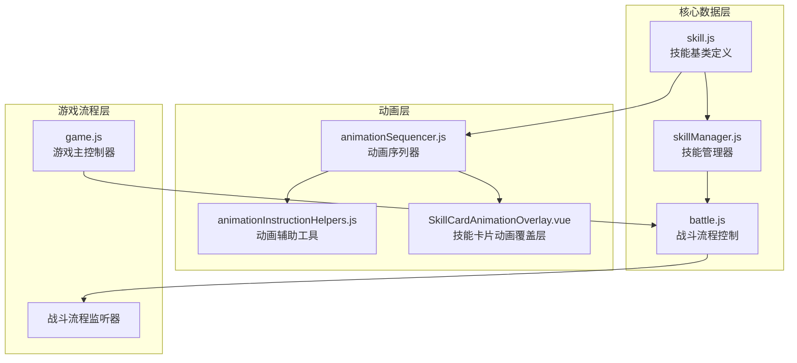
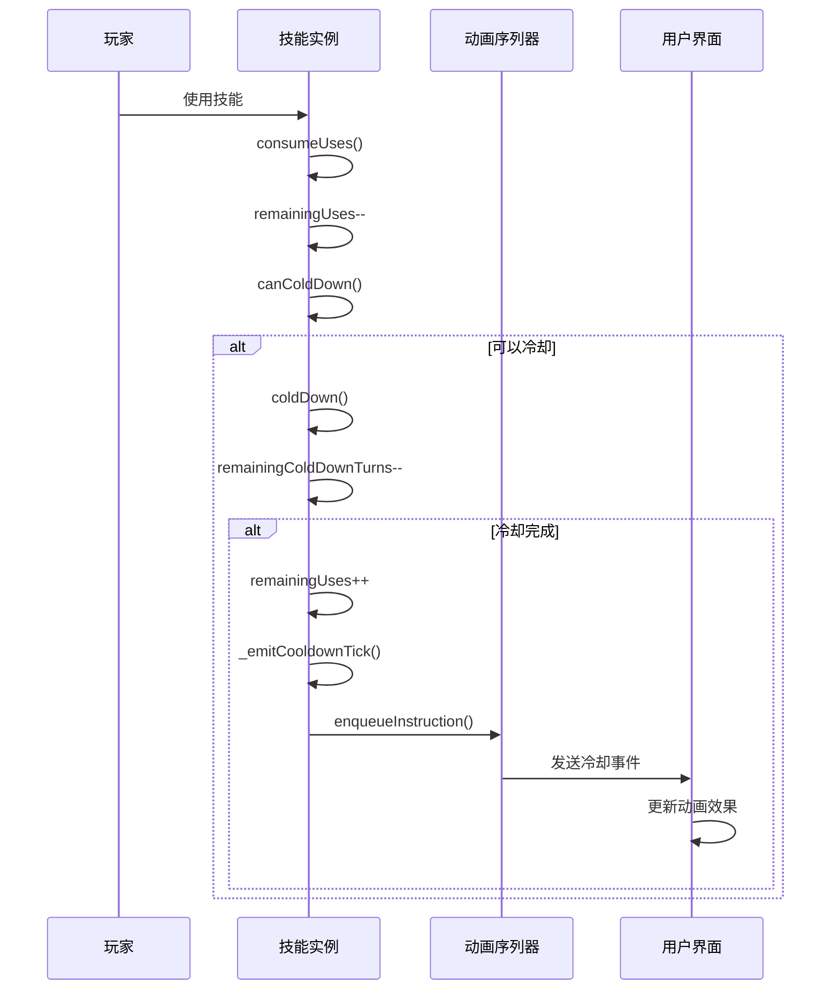
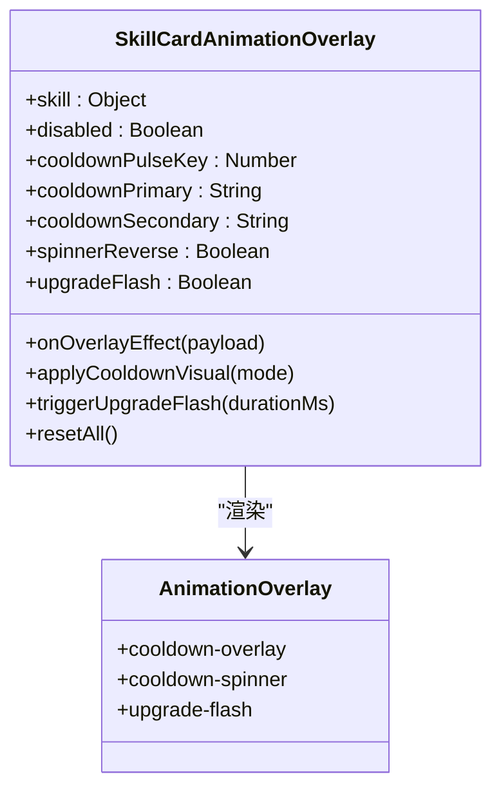
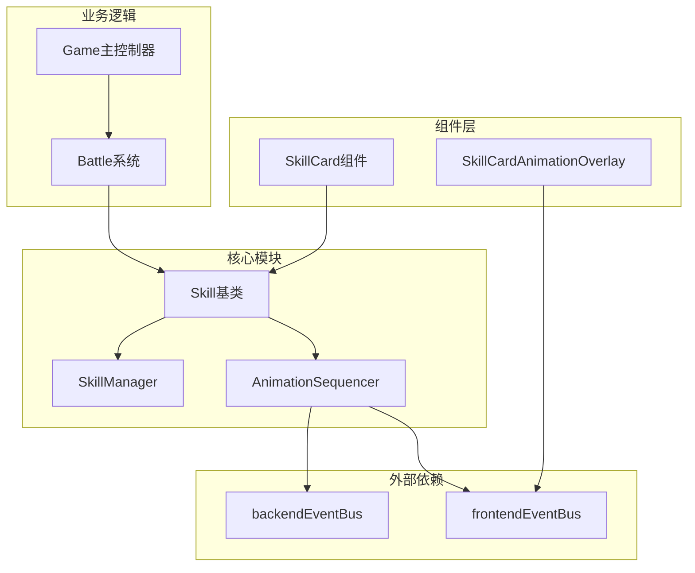

# 技能冷却系统

<cite>
**本文档引用的文件**
- [skill.js](file://src/data/skill.js)
- [animationSequencer.js](file://src/data/animationSequencer.js)
- [animationInstructionHelpers.js](file://src/data/animationInstructionHelpers.js)
- [SkillCardAnimationOverlay.vue](file://src/components/global/SkillCardAnimationOverlay.vue)
- [skillManager.js](file://src/data/skillManager.js)
- [battle.js](file://src/data/battle.js)
- [game.js](file://src/game.js)
- [concentration.js](file://src/data/skills/deprecated/concentration.js)
- [basic.js](file://src/data/skills/deprecated/basic.js)
- [speedThinking.js](file://src/data/skills/deprecated/speedThinking.js)
- [shielding.js](file://src/data/skills/deprecated/shielding.js)
</cite>

## 目录
1. [简介](#简介)
2. [项目结构](#项目结构)
3. [核心组件](#核心组件)
4. [架构概览](#架构概览)
5. [详细组件分析](#详细组件分析)
6. [依赖关系分析](#依赖关系分析)
7. [性能考虑](#性能考虑)
8. [故障排除指南](#故障排除指南)
9. [结论](#结论)

## 简介

技能冷却系统是游戏战斗机制的核心组成部分，负责管理技能的充能状态、冷却计时器和使用限制。该系统通过`baseColdDownTurns`和`remainingColdDownTurns`两个关键属性的协同工作，实现了精确的冷却计时功能，并通过`animationSequencer`事件队列机制确保UI动画与游戏逻辑的同步更新。

系统支持两种主要的技能类型：普通技能和慢热型技能（slowStart）。慢热型技能在战斗开始时处于未充能状态，需要经过完整的冷却周期后才能使用，而普通技能则可以在战斗开始时立即使用。

## 项目结构

技能冷却系统的核心文件组织如下：



**图表来源**
- [skill.js](file://src/data/skill.js#L1-L205)
- [skillManager.js](file://src/data/skillManager.js#L1-L253)
- [animationSequencer.js](file://src/data/animationSequencer.js#L1-L135)

## 核心组件

### 技能基类（Skill）

技能基类是整个冷却系统的核心，定义了技能的基本属性和行为：

```javascript
// 关键属性定义
this.remainingColdDownTurns = 0; // 回合剩余冷却时间
this.baseColdDownTurns = 0;      // 基础冷却回合数
this.baseSlowStart = false;      // 是否为慢热型技能
this.remainingUses = this.maxUses; // 剩余充能次数
```

### 冷却计时器机制

冷却系统通过以下两个核心属性实现精确的计时功能：

- **baseColdDownTurns**: 技能的基础冷却回合数，定义了技能完全充能所需的时间
- **remainingColdDownTurns**: 当前剩余的冷却回合数，随着回合推进递减

### 动画序列器（AnimationSequencer）

动画序列器是一个强大的事件队列系统，负责协调游戏逻辑与UI动画的同步：

```javascript
// 指令结构
{
  id: string,                    // 唯一标识符
  status: 'pending' | 'running' | 'finished',
  tags: Set<string>,             // 标签集合
  waitTags: Set<string>,         // 等待标签
  durationMs: number,            // 持续时间（毫秒）
  start: (ctx) => void,         // 启动回调
  meta?: any                     // 元数据
}
```

**章节来源**
- [skill.js](file://src/data/skill.js#L18-L41)
- [animationSequencer.js](file://src/data/animationSequencer.js#L1-L135)

## 架构概览

技能冷却系统采用分层架构设计，确保了良好的模块化和可维护性：



**图表来源**
- [skill.js](file://src/data/skill.js#L82-L121)
- [animationSequencer.js](file://src/data/animationSequencer.js#L45-L65)

## 详细组件分析

### 冷却系统核心算法

#### canColdDown() 方法

`canColdDown()`方法实现了冷却判断的业务逻辑：

```javascript
canColdDown() {
  if(this.coldDownTurns === 0) return false;           // 无冷却时间的技能不能冷却
  if(this.remainingUses === this.maxUses) return false; // 已满充能的技能不能冷却
  if(this.maxUses === Infinity) return false;         // 无限使用技能不能冷却
  return true;                                        // 符合所有条件，可以冷却
}
```

#### coldDown() 方法

`coldDown()`方法是冷却系统的核心逻辑，负责推进冷却计时器：

```javascript
coldDown(deltaStacks = 1) {
  if (this.coldDownTurns !== 0) {
    if (this.remainingUses !== this.maxUses) {
      // 减少剩余冷却回合数
      this.remainingColdDownTurns = Math.max(this.remainingColdDownTurns - deltaStacks, 0);
      this.remainingColdDownTurns = Math.min(this.remainingColdDownTurns, this.coldDownTurns);
      
      let charged = false;
      // 检查是否完成一轮充能
      if (this.remainingColdDownTurns <= 0) {
        this.remainingColdDownTurns = this.coldDownTurns;
        this.remainingUses = Math.min(this.remainingUses + 1, this.maxUses);
        charged = true;
      }
      // 发送冷却事件
      this._emitCooldownTick(deltaStacks);
    } else {
      this.resetColdDownProcess();
    }
  }
}
```

#### 慢热型技能初始化

慢热型技能（slowStart=true）在战斗开始时的特殊初始化流程：

```javascript
onBattleStart() {
  if(!this.slowStart) {
    // 普通技能：战斗开始时即满充能
    this.remainingUses = this.maxUses;
    this.remainingColdDownTurns = this.coldDownTurns;
  } else {
    // 慢热型技能：战斗开始时未充能
    this.remainingUses = 0;
    this.remainingColdDownTurns = this.coldDownTurns;
  }
}
```

### 动画系统集成

#### _emitCooldownTick() 方法

该方法负责触发冷却动画事件：

```javascript
_emitCooldownTick (deltaCooldown = 1) {
  try {
    const id = this.uniqueID;
    animationSequencer.enqueueInstruction({
      tags: ['skill-cd', `skill-${id}`],
      durationMs: 100,
      start: ({ emit }) => emit('skill-card-overlay-effect', { 
        id, 
        type: 'cooldown-tick', 
        deltaCooldown: deltaCooldown 
      }),
      meta: { skillId: id, overlay: true, phase: 'cooldown-tick' }
    });
    if(deltaCooldown !== 0) {
      enqueueDelay(0);
    }
  } catch (_) {}
}
```

#### 动画覆盖层组件

`SkillCardAnimationOverlay.vue`组件负责渲染冷却动画效果：



**图表来源**
- [SkillCardAnimationOverlay.vue](file://src/components/global/SkillCardAnimationOverlay.vue#L1-L163)

### 技能管理器

技能管理器负责技能的注册、创建和管理：

```javascript
// 技能注册
registerSkill(SkillClass) {
  const skillName = (new SkillClass()).name;
  this.skillRegistry.set(skillName, SkillClass);
}

// 技能创建
createSkill(skillName) {
  const SkillClass = this.skillRegistry.get(skillName);
  if (SkillClass) {
    const obj = new SkillClass();
    obj.description = obj.regenerateDescription();
    return obj;
  }
  throw new Error(`Unknown skill: ${skillName}`);
}
```

**章节来源**
- [skill.js](file://src/data/skill.js#L82-L121)
- [skill.js](file://src/data/skill.js#L140-L162)
- [animationSequencer.js](file://src/data/animationSequencer.js#L45-L65)
- [SkillCardAnimationOverlay.vue](file://src/components/global/SkillCardAnimationOverlay.vue#L33-L70)
- [skillManager.js](file://src/data/skillManager.js#L61-L102)

## 依赖关系分析

技能冷却系统的依赖关系展现了清晰的分层架构：



**图表来源**
- [skill.js](file://src/data/skill.js#L1-L2)
- [animationSequencer.js](file://src/data/animationSequencer.js#L1-L2)
- [skillManager.js](file://src/data/skillManager.js#L1-L2)

**章节来源**
- [skill.js](file://src/data/skill.js#L1-L205)
- [animationSequencer.js](file://src/data/animationSequencer.js#L1-L135)
- [skillManager.js](file://src/data/skillManager.js#L1-L253)

## 性能考虑

### 冷却计时器优化

冷却系统采用了高效的计时器实现：

1. **增量更新**: 冷却计时器采用增量递减的方式，避免复杂的定时器管理
2. **边界检查**: 使用`Math.max`和`Math.min`确保计时器值在有效范围内
3. **事件去重**: `_emitCooldownTick()`方法只在计时器值发生变化时发送事件

### 动画性能优化

1. **CSS动画**: 使用CSS变换和过渡实现流畅的动画效果
2. **事件节流**: 通过事件总线机制避免频繁的DOM更新
3. **内存管理**: 动画完成后及时清理定时器和事件监听器

### 内存使用优化

1. **单例模式**: `AnimationSequencer`使用单例模式减少内存占用
2. **对象池**: 通过对象复用减少垃圾回收压力
3. **延迟加载**: 技能模块采用动态导入，按需加载

## 故障排除指南

### 常见问题及解决方案

#### 冷却计时器异常

**症状**: 技能冷却计时器显示错误或不更新
**原因**: 
- `remainingColdDownTurns`超出范围
- `coldDownTurns`设置为负数
- 动画事件未正确发送

**解决方案**:
```javascript
// 确保冷却计时器值的有效性
this.remainingColdDownTurns = Math.max(
  Math.min(this.remainingColdDownTurns, this.coldDownTurns), 
  0
);
```

#### 动画同步问题

**症状**: UI动画与游戏逻辑不同步
**原因**:
- 动画序列器阻塞
- 事件总线连接中断
- 前端组件未正确响应事件

**解决方案**:
```javascript
// 检查动画序列器状态
console.log(animationSequencer._instructions);

// 确保事件总线正常工作
frontendEventBus.on('skill-card-overlay-effect', handler);
```

#### 慢热型技能初始化错误

**症状**: 慢热型技能在战斗开始时无法正常使用
**原因**:
- `slowStart`属性设置错误
- `onBattleStart()`方法未正确调用
- 冷却计时器初始化值错误

**解决方案**:
```javascript
// 确保慢热型技能正确初始化
onBattleStart() {
  if(this.slowStart) {
    this.remainingUses = 0;           // 未充能
    this.remainingColdDownTurns = this.coldDownTurns; // 完整冷却时间
  }
}
```

**章节来源**
- [skill.js](file://src/data/skill.js#L82-L121)
- [animationSequencer.js](file://src/data/animationSequencer.js#L65-L135)

## 结论

技能冷却系统是一个设计精良、功能完善的组件，它成功地实现了以下目标：

1. **精确的冷却计时**: 通过`baseColdDownTurns`和`remainingColdDownTurns`的协同工作，提供了准确的冷却计时功能
2. **灵活的技能类型支持**: 支持普通技能和慢热型技能两种不同的技能类型
3. **流畅的用户体验**: 通过动画序列器确保UI动画与游戏逻辑的完美同步
4. **良好的可维护性**: 分层架构设计使得系统易于理解和维护
5. **高性能表现**: 优化的算法和事件机制确保了系统的高效运行

该系统为游戏战斗机制提供了坚实的基础，能够支持复杂的游戏玩法和丰富的技能交互。通过持续的优化和改进，它将继续为玩家提供优秀的游戏体验。