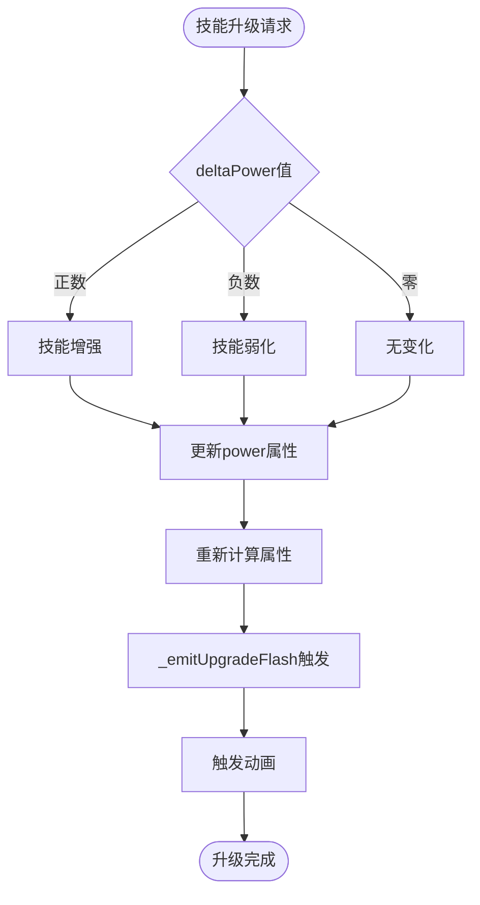

# 技能升级系统

<cite>
**本文档引用的文件**
- [src/data/skill.js](file://src/data/skill.js)
- [src/data/skillManager.js](file://src/data/skillManager.js)
- [src/data/animationSequencer.js](file://src/data/animationSequencer.js)
- [src/data/animationInstructionHelpers.js](file://src/data/animationInstructionHelpers.js)
- [src/components/global/SkillCard.vue](file://src/components/global/SkillCard.vue)
- [src/components/global/SkillCardAnimationOverlay.vue](file://src/components/global/SkillCardAnimationOverlay.vue)
- [src/frontendEventBus.js](file://src/frontendEventBus.js)
- [src/data/battleUtils.js](file://src/data/battleUtils.js)
- [src/data/gameState.js](file://src/data/gameState.js)
- [src/data/skills/martial_arts/agilePunch.js](file://src/data/skills/martial_arts/agilePunch.js)
- [src/data/skills/martial_arts/block.js](file://src/data/skills/martial_arts/block.js)
- [src/data/skills/SKILL_DESIGN_PRINCIPLES.md](file://src/data/skills/SKILL_DESIGN_PRINCIPLES.md)
</cite>

## 目录
1. [简介](#简介)
2. [项目结构概览](#项目结构概览)
3. [核心组件分析](#核心组件分析)
4. [架构概览](#架构概览)
5. [详细组件分析](#详细组件分析)
6. [依赖关系分析](#依赖关系分析)
7. [性能考虑](#性能考虑)
8. [故障排除指南](#故障排除指南)
9. [结论](#结论)

## 简介

技能升级系统是RTVL游戏的核心机制之一，负责管理技能的强化、弱化、升级和视觉反馈。该系统通过power属性实现技能效果的动态调整，并通过复杂的动画序列器确保前后端状态的一致性。

系统的主要特点包括：
- **动态power属性**：支持技能效果的实时增强或弱化
- **双层动画系统**：通过animationSequencer和animationInstructionHelpers协调前后端动画
- **状态同步机制**：确保后端状态变更与前端UI同步
- **多层次升级路径**：支持从基础技能到高级技能的渐进式升级

## 项目结构概览

技能升级系统的文件组织遵循模块化设计原则，主要分为以下几个层次：


**图表来源**
- [src/data/skill.js](file://src/data/skill.js#L1-L205)
- [src/data/skillManager.js](file://src/data/skillManager.js#L1-L253)
- [src/data/animationSequencer.js](file://src/data/animationSequencer.js#L1-L135)

## 核心组件分析

### Skill基类 - 技能核心

Skill基类是整个技能系统的核心，定义了所有技能的通用属性和行为：

```javascript
class Skill {
  constructor(name, type, tier, baseManaCost, baseActionPointCost, baseMaxUses, skillSeriesName = undefined, spawnWeight = undefined) {
    this.name = name;
    this.type = type;
    this.tier = tier;
    this.uniqueID = Math.random().toString(36).substring(2, 10);
    this.power = 0; // 关键的power属性
    this.baseManaCost = baseManaCost || 0;
    this.baseActionPointCost = (baseActionPointCost !== undefined) ? baseActionPointCost : 1;
    this.baseMaxUses = baseMaxUses || 1;
    this.remainingUses = this.maxUses;
    this.skillSeriesName = skillSeriesName || name;
    this.spawnWeight = spawnWeight || 1;
  }
}
```

**关键特性：**
- **power属性**：核心的技能强化/弱化机制
- **冷却系统**：基于回合的冷却机制
- **充能系统**：支持无限充能和有限充能
- **前置技能系统**：支持技能升级链

**章节来源**
- [src/data/skill.js](file://src/data/skill.js#L1-L50)

### SkillManager - 技能管理器

SkillManager负责技能的注册、创建和随机生成：

```javascript
class SkillManager {
  constructor() {
    this.skills = [];
    this.skillRegistry = new Map();
  }
  
  registerSkill(SkillClass) {
    const skillName = (new SkillClass()).name;
    this.skillRegistry.set(skillName, SkillClass);
  }
  
  createSkill(skillName) {
    const SkillClass = this.skillRegistry.get(skillName);
    if (SkillClass) {
      const obj = new SkillClass();
      obj.description = obj.regenerateDescription();
      return obj;
    }
    throw new Error(`Unknown skill: ${skillName}`);
  }
}
```

**章节来源**
- [src/data/skillManager.js](file://src/data/skillManager.js#L1-L100)

## 架构概览

技能升级系统采用分层架构设计，确保职责分离和高度解耦：


**图表来源**
- [src/data/skill.js](file://src/data/skill.js#L120-L130)
- [src/data/animationSequencer.js](file://src/data/animationSequencer.js#L40-L60)
- [src/data/animationInstructionHelpers.js](file://src/data/animationInstructionHelpers.js#L200-L220)

## 详细组件分析

### Power属性机制

Power属性是技能升级系统的核心，它直接影响技能的各种计算属性：



**图表来源**
- [src/data/skill.js](file://src/data/skill.js#L120-L130)

#### Power属性的具体影响

Power属性通过getter方法影响多个技能属性：

```javascript
// 敏捷打击技能的power影响示例
get coldDownTurns() {
  return Math.max(super.coldDownTurns - this.power, 1);
}

get damage() {
  return Math.max(this.baseDamage + this.powerMultiplier * this.power, 4);
}
```

**章节来源**
- [src/data/skills/martial_arts/agilePunch.js](file://src/data/skills/martial_arts/agilePunch.js#L20-L30)

### _emitUpgradeFlash动画事件系统

_upgradeFlash方法负责触发技能升级的视觉反馈：

```javascript
_emitUpgradeFlash(deltaPower = 1) {
  try {
    const id = this.uniqueID;
    animationSequencer.enqueueInstruction({
      tags: ['skill-upgrade', `skill-${id}`],
      durationMs: 100,
      start: ({ emit }) => emit('skill-card-overlay-effect', { 
        id, 
        type: 'upgrade-flash', 
        'deltaPower': deltaPower 
      }),
      meta: { skillId: id, overlay: true, phase: 'upgrade-flash' }
    });
  } catch (_) {}
}
```

#### 动画指令调度机制


**图表来源**
- [src/data/animationSequencer.js](file://src/data/animationSequencer.js#L25-L50)
- [src/components/global/SkillCardAnimationOverlay.vue](file://src/components/global/SkillCardAnimationOverlay.vue#L15-L40)

**章节来源**
- [src/data/skill.js](file://src/data/skill.js#L120-L130)
- [src/data/animationSequencer.js](file://src/data/animationSequencer.js#L40-L60)

### powerUp vs upgrade方法对比

两种方法虽然都用于技能升级，但在使用场景和行为上有显著差异：

| 特性 | powerUp | upgrade |
|------|---------|---------|
| **调用时机** | 主动技能使用后 | 系统自动触发 |
| **参数处理** | 自动处理deltaPower | 默认使用1 |
| **动画触发** | 总是触发_upgradeFlash | 可能不触发 |
| **适用场景** | 技能主动升级 | 系统级升级 |

```javascript
// powerUp方法 - 主动升级
powerUp(deltaPower = 1) {
  this.power += deltaPower;
  this._emitUpgradeFlash(deltaPower);
}

// upgrade方法 - 系统升级
upgrade(deltaPower) {
  this.power += deltaPower;
  this._emitUpgradeFlash();
}
```

**章节来源**
- [src/data/skill.js](file://src/data/skill.js#L120-L135)

### deltaPower参数的含义

deltaPower参数决定了技能升级的方向和强度：


**图表来源**
- [src/data/skill.js](file://src/data/skill.js#L120-L130)

### 状态同步与视觉反馈时序

系统通过复杂的时序机制确保状态变更与视觉反馈的同步：


**图表来源**
- [src/data/animationInstructionHelpers.js](file://src/data/animationInstructionHelpers.js#L200-L220)
- [src/data/gameState.js](file://src/data/gameState.js#L50-L75)

**章节来源**
- [src/data/animationInstructionHelpers.js](file://src/data/animationInstructionHelpers.js#L200-L250)

### 技能随机生成机制

SkillManager实现了复杂的技能随机生成算法：

```javascript
// 权重计算逻辑
const weightedSkills = availableSkills.map(skill => {
  const tierDifference = playerTier - skill.tier;
  let modifyFactor = 1;

  // 等级差惩罚
  if (tierDifference > 7) {
    modifyFactor = 0.15;
  } else if (tierDifference > 6) {
    modifyFactor = 0.40;
  } else if (tierDifference > 5) {
    modifyFactor = 0.70;
  }

  // 灵脉耦合权重
  {
    let leinoFactor = Math.max(playerLeino[skill.type] || 0.2, 0);
    if (skill.type === 'normal') leinoFactor = Math.max(leinoFactor, 1);
    modifyFactor *= leinoFactor;
  }

  return {
    ...skill,
    weight: skill.spawnWeight * modifyFactor
  };
});
```

**章节来源**
- [src/data/skillManager.js](file://src/data/skillManager.js#L150-L200)

## 依赖关系分析

技能升级系统的依赖关系体现了良好的架构设计：


**图表来源**
- [src/data/skill.js](file://src/data/skill.js#L1-L5)
- [src/data/animationSequencer.js](file://src/data/animationSequencer.js#L1-L10)

**章节来源**
- [src/data/skill.js](file://src/data/skill.js#L1-L10)
- [src/data/animationSequencer.js](file://src/data/animationSequencer.js#L1-L15)

## 性能考虑

### 动画序列优化

系统通过以下机制优化性能：

1. **指令去重**：避免重复的动画指令
2. **延迟执行**：使用setTimeout优化动画调度
3. **状态缓存**：减少不必要的状态同步
4. **弱引用管理**：及时清理过期的定时器

### 内存管理

```javascript
// 定时器清理机制
finish(id, reason = 'manual') {
  const instr = this._instructions.find(i => i.id === id);
  if (!instr) return false;
  
  // 清理超时器
  const t = this._idToTimer.get(id);
  if (t) {
    clearTimeout(t);
    this._idToTimer.delete(id);
  }
  
  // 释放已完成的指令节点
  this._instructions = this._instructions.filter(i => i.status !== 'finished');
}
```

### 并发处理

系统支持并发的动画指令处理，提高用户体验：

```javascript
_pump() {
  let startedAny = false;
  for (let i = 0; i < this._instructions.length; i++) {
    const ins = this._instructions[i];
    if (!ins || ins.status !== 'pending') continue;
    if (!this._canExecute(i)) continue;
    this._startInstruction(ins);
    startedAny = true;
  }
  return startedAny;
}
```

## 故障排除指南

### 常见问题及解决方案

#### 1. 动画不显示

**症状**：技能升级后没有视觉反馈
**原因**：动画指令未正确触发或事件总线异常
**解决方案**：
- 检查_frontendEventBus是否正常工作
- 验证animationSequencer的enqueueInstruction调用
- 确认SkillCardAnimationOverlay组件的disabled状态

#### 2. 状态不同步

**症状**：UI显示与实际状态不一致
**原因**：状态同步机制失效
**解决方案**：
- 检查enqueueState调用
- 验证applyProjectionToDisplay函数
- 确认backendGameState和displayGameState的同步

#### 3. 性能问题

**症状**：动画卡顿或延迟
**原因**：过多的动画指令堆积
**解决方案**：
- 优化动画指令的waitTags设置
- 减少不必要的状态同步
- 实现动画指令的优先级机制

**章节来源**
- [src/data/animationSequencer.js](file://src/data/animationSequencer.js#L70-L90)
- [src/data/animationInstructionHelpers.js](file://src/data/animationInstructionHelpers.js#L200-L220)

## 结论

技能升级系统展现了现代游戏开发中复杂状态管理和动画协调的最佳实践。通过power属性的灵活设计、双层动画系统的精密协调以及状态同步机制的严格保障，系统实现了既强大又稳定的技能升级功能。

### 主要优势

1. **灵活性**：power属性支持动态技能调整
2. **一致性**：前后端状态同步确保体验连贯
3. **可扩展性**：模块化设计便于功能扩展
4. **性能**：优化的动画调度机制保证流畅体验

### 技术亮点

- **分层架构**：清晰的职责分离
- **事件驱动**：松耦合的组件通信
- **状态管理**：响应式的前后端同步
- **动画系统**：复杂的时序控制

这个系统不仅满足了当前的游戏需求，也为未来的功能扩展奠定了坚实的基础。通过深入理解这些机制，开发者可以更好地维护和扩展技能升级系统。