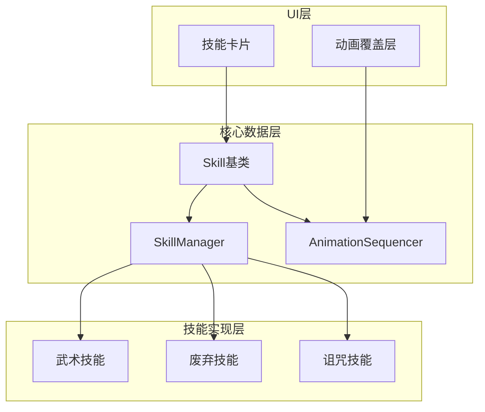
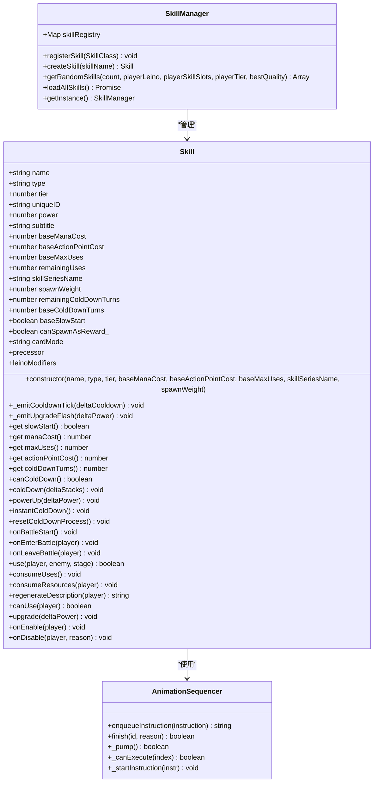
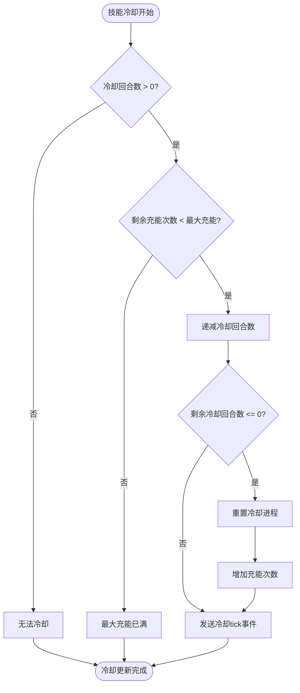
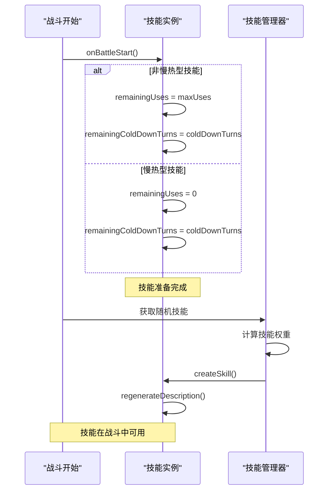
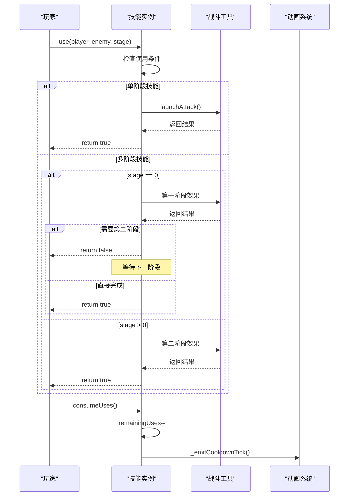
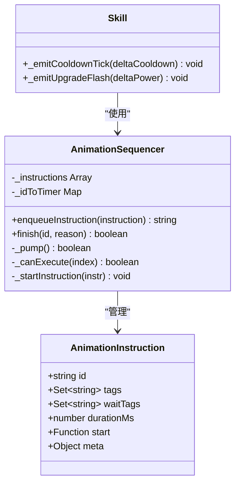
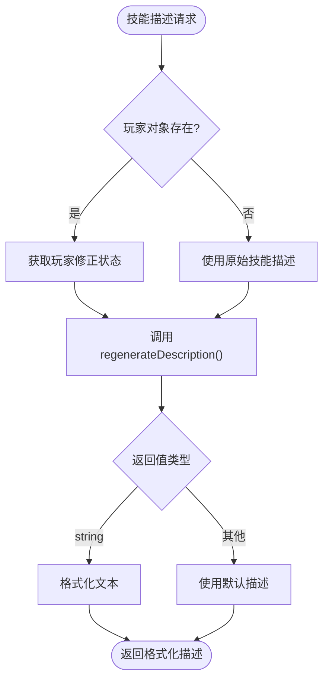
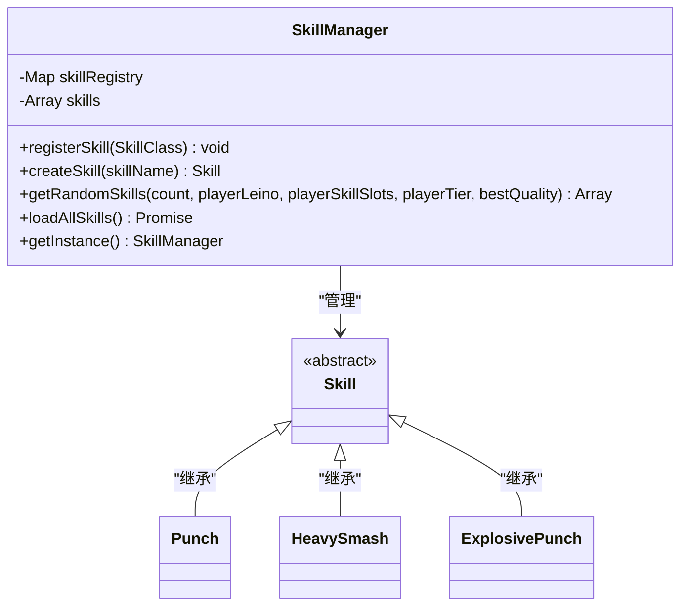

# 技能数据模型

<cite>
**本文档引用的文件**
- [src/data/skill.js](file://src/data/skill.js)
- [src/data/skillManager.js](file://src/data/skillManager.js)
- [src/data/animationSequencer.js](file://src/data/animationSequencer.js)
- [src/data/battleUtils.js](file://src/data/battleUtils.js)
- [src/components/global/SkillCard.vue](file://src/components/global/SkillCard.vue)
- [src/data/skills/martial_arts/punch.js](file://src/data/skills/martial_arts/punch.js)
- [src/data/skills/martial_arts/heavySmash.js](file://src/data/skills/martial_arts/heavySmash.js)
- [src/data/skills/deprecated/punchKicks.js](file://src/data/skills/deprecated/punchKicks.js)
- [src/data/skills/SKILL_DESIGN_PRINCIPLES.md](file://src/data/skills/SKILL_DESIGN_PRINCIPLES.md)
</cite>

## 目录
1. [简介](#简介)
2. [项目结构概览](#项目结构概览)
3. [核心技能类设计](#核心技能类设计)
4. [技能构造函数参数详解](#技能构造函数参数详解)
5. [技能冷却系统](#技能冷却系统)
6. [技能充能机制](#技能充能机制)
7. [技能使用流程](#技能使用流程)
8. [动画同步机制](#动画同步机制)
9. [技能描述系统](#技能描述系统)
10. [技能管理器](#技能管理器)
11. [实际技能案例分析](#实际技能案例分析)
12. [性能考虑](#性能考虑)
13. [故障排除指南](#故障排除指南)
14. [结论](#结论)

## 简介

技能数据模型是RTVL游戏的核心组件，负责管理所有技能的行为、状态和视觉表现。该系统采用面向对象的设计模式，提供了完整的技能生命周期管理，包括技能创建、使用、冷却、充能和视觉反馈等功能。

本文档将深入解析Skill类的完整设计，涵盖构造函数参数、冷却系统、充能机制、使用流程以及动画同步等关键特性，为开发者提供全面的技术参考。

## 项目结构概览

技能系统的核心文件组织如下：



**图表来源**
- [src/data/skill.js](file://src/data/skill.js#L1-L205)
- [src/data/skillManager.js](file://src/data/skillManager.js#L1-L253)
- [src/data/animationSequencer.js](file://src/data/animationSequencer.js#L1-L135)

## 核心技能类设计

Skill类是整个技能系统的核心抽象类，定义了所有技能的基本行为和属性：



**图表来源**
- [src/data/skill.js](file://src/data/skill.js#L5-L205)
- [src/data/skillManager.js](file://src/data/skillManager.js#L4-L253)
- [src/data/animationSequencer.js](file://src/data/animationSequencer.js#L25-L135)

**章节来源**
- [src/data/skill.js](file://src/data/skill.js#L5-L205)
- [src/data/skillManager.js](file://src/data/skillManager.js#L4-L253)

## 技能构造函数参数详解

Skill类的构造函数接受多个参数来定义技能的基本属性：

### 基础参数

1. **name** (string): 技能名称，用于识别和显示
2. **type** (string): 技能类型，决定技能的灵脉归属
3. **tier** (number): 技能等阶，影响技能强度和稀有度
4. **baseManaCost** (number): 基础魏启消耗
5. **baseActionPointCost** (number): 基础行动点消耗，默认为1
6. **baseMaxUses** (number): 基础最大充能次数，Infinity表示无需充能
7. **skillSeriesName** (string): 技能系列名称，默认与技能名相同
8. **spawnWeight** (number): 技能出现权重，默认为1

### 特殊属性

- **uniqueID**: 自动生成的唯一标识符，确保前后台技能ID的一致性
- **power**: 技能强化或弱化的程度，正数为强化，负数为弱化
- **subtitle**: 副标题，通常用于S级或特殊技能
- **baseSlowStart**: 是否为慢热型技能，慢热型技能初始充能为0

**章节来源**
- [src/data/skill.js](file://src/data/skill.js#L5-L35)

## 技能冷却系统

技能冷却系统是RTVL游戏的核心机制之一，负责管理技能的可用性和冷却进度：



**图表来源**
- [src/data/skill.js](file://src/data/skill.js#L100-L120)

### 冷却系统的关键方法

#### canColdDown() 方法
判断技能是否可以进入冷却状态：
```javascript
canColdDown() {
  if(this.coldDownTurns === 0) return false;
  if(this.remainingUses === this.maxUses) return false;
  if(this.maxUses === Infinity) return false;
  return true;
}
```

#### coldDown() 方法
推进冷却流程的核心方法：
```javascript
coldDown(deltaStacks = 1) {
  if (this.coldDownTurns !== 0) {
    if (this.remainingUses !== this.maxUses) {
      this.remainingColdDownTurns = Math.max(
        this.remainingColdDownTurns - deltaStacks, 0
      );
      this.remainingColdDownTurns = Math.min(
        this.remainingColdDownTurns, this.coldDownTurns
      );
      
      let charged = false;
      if (this.remainingColdDownTurns <= 0) {
        this.remainingColdDownTurns = this.coldDownTurns;
        this.remainingUses = Math.min(
          this.remainingUses + 1, this.maxUses
        );
        charged = true;
      }
      
      this._emitCooldownTick(deltaStacks);
    }
  }
}
```

**章节来源**
- [src/data/skill.js](file://src/data/skill.js#L95-L120)

## 技能充能机制

技能充能机制决定了技能在战斗中的可用性：



**图表来源**
- [src/data/skill.js](file://src/data/skill.js#L122-L135)
- [src/data/skillManager.js](file://src/data/skillManager.js#L80-L120)

### 充能机制特点

1. **慢热型技能**: `baseSlowStart = true` 的技能初始充能为0，需要先冷却才能使用
2. **普通技能**: 初始充能等于最大充能，随时可用
3. **无限充能**: `baseMaxUses = Infinity` 的技能无需充能机制
4. **手动重置**: `resetColdDownProcess()` 方法可以重置冷却进程

**章节来源**
- [src/data/skill.js](file://src/data/skill.js#L122-L135)

## 技能使用流程

技能使用采用多阶段调用机制，支持复杂的技能效果：



**图表来源**
- [src/data/skill.js](file://src/data/skill.js#L137-L145)
- [src/data/battleUtils.js](file://src/data/battleUtils.js)

### 使用流程的关键方法

#### use() 方法
```javascript
use(player, enemy, stage) {
  return true; // 默认实现，子类应重写
}
```

#### consumeUses() 方法
```javascript
consumeUses() {
  const prevUses = this.remainingUses;
  this.remainingUses--;
  // 使用技能本身不改变 remainingColdDownTurns，故不发送 tick
  try { 
    if (prevUses === this.maxUses && this.canColdDown()) { 
      /* 进入冷却但不发送事件 */ 
    } 
  } catch (_) {}
}
```

#### consumeResources() 方法
```javascript
consumeResources (player) {
  player.consumeActionPoints(this.actionPointCost);
  player.consumeMana(this.manaCost);
  this.consumeUses()
}
```

**章节来源**
- [src/data/skill.js](file://src/data/skill.js#L137-L155)

## 动画同步机制

技能系统与动画系统紧密集成，提供流畅的视觉反馈：



**图表来源**
- [src/data/animationSequencer.js](file://src/data/animationSequencer.js#L25-L135)
- [src/data/skill.js](file://src/data/skill.js#L40-L60)

### 冷却动画机制

#### _emitCooldownTick() 方法
```javascript
_emitCooldownTick (deltaCooldown = 1) {
  try {
    const id = this.uniqueID;
    animationSequencer.enqueueInstruction({
      tags: ['skill-cd', `skill-${id}`],
      durationMs: 100,
      start: ({ emit }) => emit('skill-card-overlay-effect', { 
        id, 
        type: 'cooldown-tick', 
        deltaCooldown: deltaCooldown 
      }),
      meta: { skillId: id, overlay: true, phase: 'cooldown-tick' }
    });
    if(deltaCooldown !== 0) {
      enqueueDelay(0);
    }
  } catch (_) {}
}
```

#### 升级动画机制

#### _emitUpgradeFlash() 方法
```javascript
_emitUpgradeFlash(deltaPower = 1) {
  try {
    const id = this.uniqueID;
    animationSequencer.enqueueInstruction({
      tags: ['skill-upgrade', `skill-${id}`],
      durationMs: 100,
      start: ({ emit }) => emit('skill-card-overlay-effect', { 
        id, 
        type: 'upgrade-flash', 
        'deltaPower': deltaPower 
      }),
      meta: { skillId: id, overlay: true, phase: 'upgrade-flash' }
    });
  } catch (_) {}
}
```

**章节来源**
- [src/data/skill.js](file://src/data/skill.js#L40-L60)
- [src/data/animationSequencer.js](file://src/data/animationSequencer.js#L25-L135)

## 技能描述系统

技能描述系统提供动态生成技能描述的能力：

### 描述生成流程



**图表来源**
- [src/components/global/SkillCard.vue](file://src/components/global/SkillCard.vue#L70-L80)

### 核心方法

#### regenerateDescription() 方法
```javascript
regenerateDescription(player) {
  // 默认实现，子类可以重写
  return '';
}
```

#### canUse() 方法
```javascript
canUse(player) {
  // 默认实现：检查魏启和行动点是否足够
  return player.mana >= this.manaCost && 
         player.remainingActionPoints >= this.actionPointCost && 
         this.remainingUses > 0;
}
```

**章节来源**
- [src/data/skill.js](file://src/data/skill.js#L157-L165)
- [src/components/global/SkillCard.vue](file://src/components/global/SkillCard.vue#L70-L80)

## 技能管理器

SkillManager类负责技能的注册、创建和随机生成：



**图表来源**
- [src/data/skillManager.js](file://src/data/skillManager.js#L4-L253)

### 关键功能

#### 动态加载技能
```javascript
static async loadAllSkills() {
  const skillManager = SkillManager.getInstance();
  
  const skillModules = [
    await import('./skills/martial_arts/agilePunch.js'),
    await import('./skills/martial_arts/block.js'),
    // ... 更多技能模块
  ];
  
  for (const module of skillModules) {
    for (const [key, SkillClass] of Object.entries(module)) {
      if (typeof SkillClass === 'function' && 
          SkillClass !== Skill && 
          SkillClass.prototype instanceof Skill) {
        skillManager.registerSkill(SkillClass);
      }
    }
  }
}
```

#### 随机技能生成
```javascript
getRandomSkills(count, playerLeino= {}, playerSkillSlots = [], playerTier = 0, bestQuality = false) {
  // 收集所有技能元数据
  const allSkills = Array.from(this.skillRegistry.entries()).map(([name, SkillClass]) => {
    const tempSkill = new SkillClass();
    return {
      name: name,
      type: tempSkill.type,
      series: tempSkill.skillSeriesName,
      tier: tempSkill.tier,
      canSpawnAsReward_: tempSkill.canSpawnAsReward_,
      spawnWeight: tempSkill.spawnWeight,
      precessor: tempSkill.precessor,
      leinoModifiers: tempSkill.leinoModifiers
    };
  });
  
  // 计算权重并随机选择
  // ... 权重计算和选择逻辑
}
```

**章节来源**
- [src/data/skillManager.js](file://src/data/skillManager.js#L25-L120)

## 实际技能案例分析

### 简单技能案例：拳（Punch）

```javascript
export class Punch extends Skill {
  constructor(name='拳', tier = SkillTier.D, baseDamage = 6, powerMultiplier = 2, apCost = 1) {
    super(name, 'normal', tier, 0, apCost, Infinity, '拳');
    this.baseDamage = baseDamage;
    this.powerMultiplier = powerMultiplier;
  }

  get damage () {
    return Math.max(this.baseDamage + this.powerMultiplier * this.power, 3);
  }

  use(player, enemy) {
    launchAttack(player, enemy, this.damage);
    return true;
  }

  regenerateDescription(player) {
    return `造成${this.damage + (player?.attack ?? 0)}点伤害`;
  }
}
```

### 复杂技能案例：重击（HeavySmash）

```javascript
export class BasicHeavySmash extends Skill {
  constructor(name='重击', tier = SkillTier.D, damage = 4,
              powerMultiplier = 2, apConsumption = 2, coldDownTurns = 2,
              stack = 2) {
    super(name, 'normal', tier, 0, apConsumption, 1, '重击');
    this.baseColdDownTurns = coldDownTurns;
    this.baseDamage = damage;
    this.powerMultiplier = powerMultiplier;
    this.stack = stack;
  }

  get damage () {
    return this.baseDamage + this.powerMultiplier * this.power;
  }

  use(player, enemy, stage) {
    if(stage === 0) {
      const atkPassThroughDamage = launchAttack(player, enemy, this.damage).passThoughDamage;
      return atkPassThroughDamage <= 0;
    } else {
      enemy.addEffect('易伤', this.stack);
      return true;
    }
  }

  regenerateDescription(player) {
    return `造成${this.damage + (player?.attack ?? 0)}点伤害，命中则赋予/effect{易伤}${countString(this.stack, '层')}`;
  }
}
```

### 慢热型技能案例

慢热型技能的特点是在战斗开始时充能为0，需要先冷却才能使用：

```javascript
// 慢热型技能示例
export class SlowStartSkill extends Skill {
  constructor() {
    super('慢热技能', 'normal', 3, 0, 1, 1, '慢热系列');
    this.baseSlowStart = true; // 设置为慢热型
    this.baseColdDownTurns = 2; // 需要2回合冷却
  }
  
  // 使用逻辑...
}
```

**章节来源**
- [src/data/skills/martial_arts/punch.js](file://src/data/skills/martial_arts/punch.js#L8-L89)
- [src/data/skills/martial_arts/heavySmash.js](file://src/data/skills/martial_arts/heavySmash.js#L6-L47)

## 性能考虑

### 内存优化

1. **技能实例缓存**: SkillManager使用Map存储技能类，避免重复创建
2. **延迟加载**: 技能模块采用动态导入，按需加载
3. **唯一ID生成**: 使用高效的随机ID生成算法

### 计算优化

1. **权重计算缓存**: 随机技能生成时缓存权重计算结果
2. **动画指令优化**: 使用标签系统减少不必要的动画处理
3. **描述生成优化**: 只在需要时重新生成技能描述

### 并发处理

1. **异步加载**: 技能模块加载采用Promise链
2. **动画序列**: 使用动画序列器管理并发动画
3. **事件驱动**: 基于事件总线的解耦设计

## 故障排除指南

### 常见问题及解决方案

#### 技能无法使用
**症状**: 技能显示为灰色，无法点击使用
**原因**: 
- 魏启不足
- 行动点不足
- 充能不足
- 冷却中

**解决方法**:
```javascript
// 检查技能可用性
const canUse = skill.canUse(player);
console.log('技能可用:', canUse);
console.log('魏启:', player.mana, '需求:', skill.manaCost);
console.log('行动点:', player.remainingActionPoints, '需求:', skill.actionPointCost);
console.log('充能:', skill.remainingUses, '最大:', skill.maxUses);
```

#### 冷却动画异常
**症状**: 冷却进度条不正常
**原因**: 
- 动画指令冲突
- 标签系统错误
- 时间戳不一致

**解决方法**:
```javascript
// 检查动画状态
const animations = animationSequencer._instructions;
console.log('当前动画:', animations.filter(a => a.status === 'running'));
```

#### 技能描述不正确
**症状**: 技能描述显示错误数值
**原因**: 
- 描述生成函数未正确调用
- 玩家状态未正确传递
- 动态计算错误

**解决方法**:
```javascript
// 手动重新生成描述
if (typeof skill.regenerateDescription === 'function') {
  skill.description = skill.regenerateDescription(player);
}
```

**章节来源**
- [src/data/skill.js](file://src/data/skill.js#L157-L165)
- [src/data/animationSequencer.js](file://src/data/animationSequencer.js#L25-L135)

## 结论

RTVL游戏的技能数据模型是一个设计精良、功能完备的系统，它成功地将技能的行为、状态管理和视觉反馈整合在一起。通过面向对象的设计模式，系统实现了良好的可扩展性和维护性。

### 主要优势

1. **模块化设计**: 技能类继承自基类，便于扩展和维护
2. **动画集成**: 与动画系统深度集成，提供流畅的视觉体验
3. **动态描述**: 支持基于玩家状态的动态技能描述生成
4. **灵活配置**: 丰富的参数配置满足各种技能设计需求
5. **性能优化**: 多种优化策略确保系统高效运行

### 设计亮点

- **多阶段使用机制**: 支持复杂的技能效果实现
- **慢热型技能**: 提供独特的技能设计可能性
- **智能权重系统**: 基于玩家状态的技能生成算法
- **事件驱动架构**: 基于事件总线的松耦合设计

这个技能数据模型为RTVL游戏提供了坚实的技术基础，支持了丰富多样的技能系统，为玩家带来了深度的策略体验。通过持续的优化和扩展，该系统将继续支撑游戏的发展和创新。