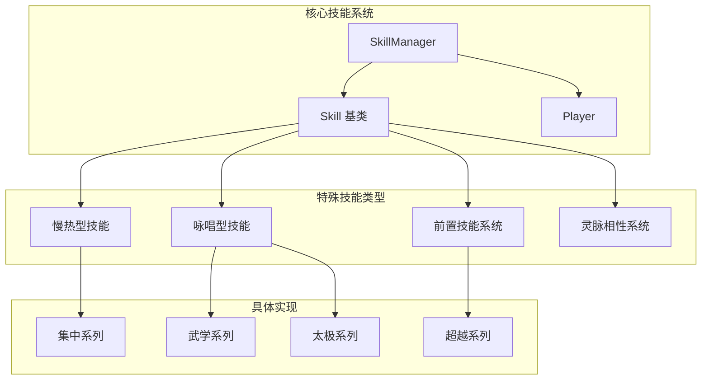
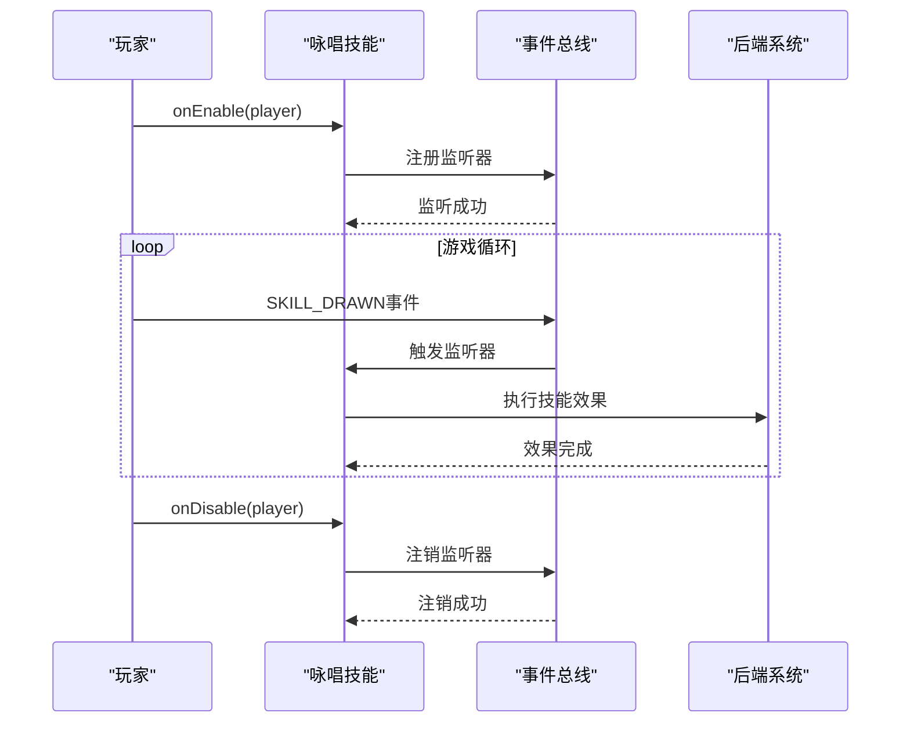
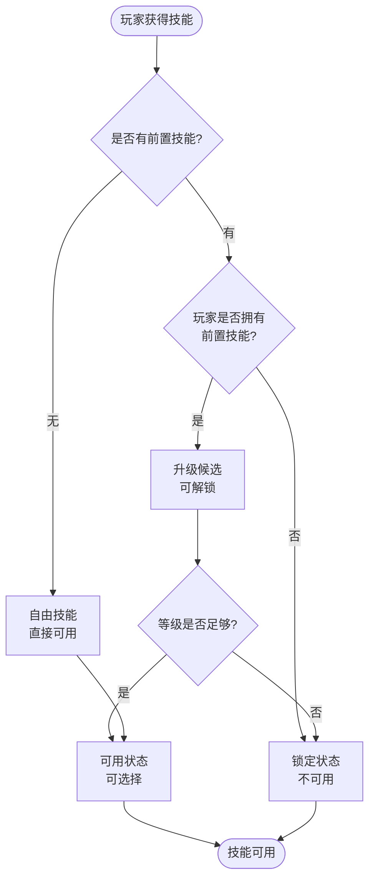
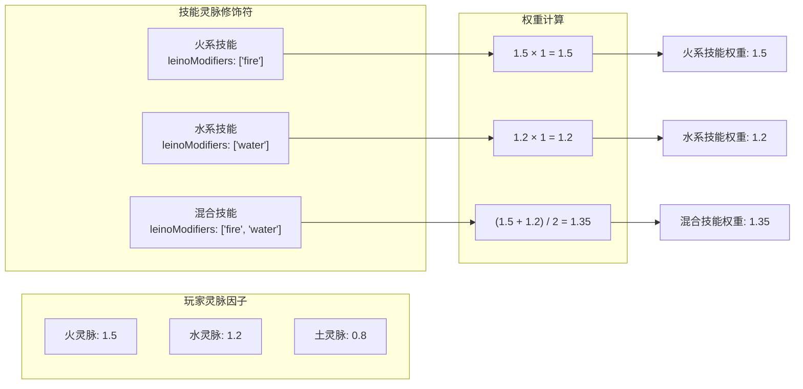
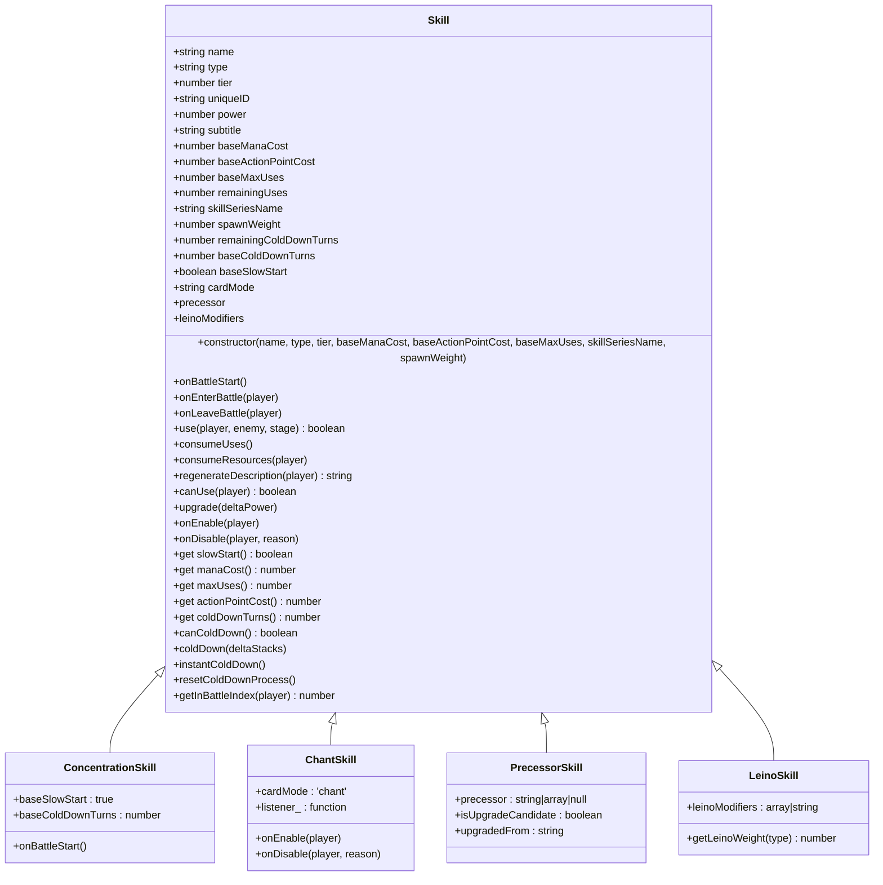
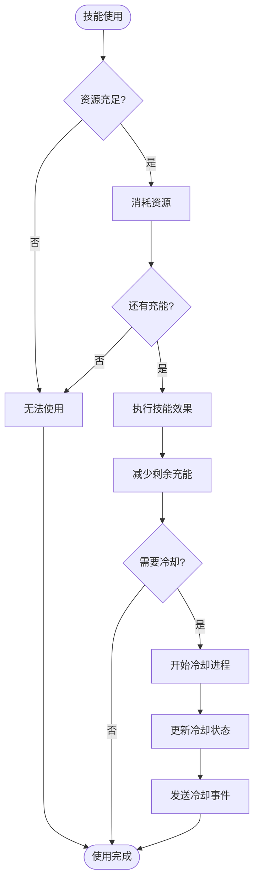
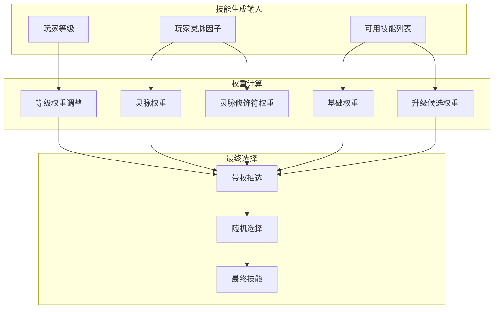
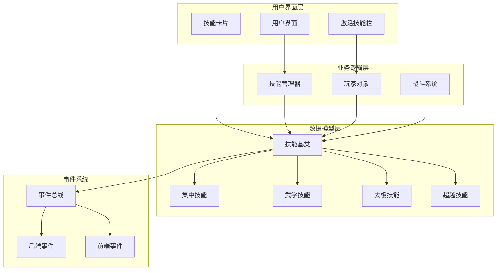
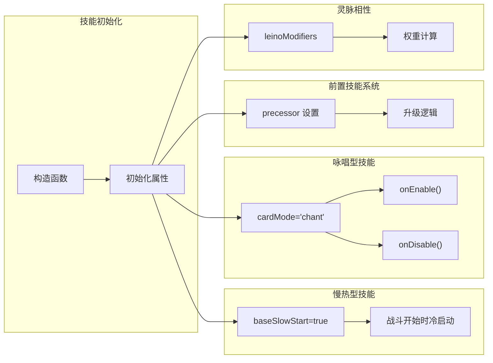

# 特殊技能类型设计与实现

<cite>
**本文档引用的文件**
- [src/data/skill.js](file://src/data/skill.js)
- [src/data/skills/SKILL_DESIGN_PRINCIPLES.md](file://src/data/skills/SKILL_DESIGN_PRINCIPLES.md)
- [src/data/skillManager.js](file://src/data/skillManager.js)
- [src/data/player.js](file://src/data/player.js)
- [src/data/skills/deprecated/concentration.js](file://src/data/skills/deprecated/concentration.js)
- [src/data/skills/martial_arts/peakMartialArt.js](file://src/data/skills/martial_arts/peakMartialArt.js)
- [src/data/skills/martial_arts/taiji.js](file://src/data/skills/martial_arts/taiji.js)
- [src/data/skills/martial_arts/transcendence.js](file://src/data/skills/martial_arts/transcendence.js)
- [src/data/skills/deprecated/matialArts.js](file://src/data/skills/deprecated/matialArts.js)
- [src/data/abilities/leino.js](file://src/data/abilities/leino.js)
</cite>

## 目录
1. [引言](#引言)
2. [项目结构概览](#项目结构概览)
3. [慢热型技能系统](#慢热型技能系统)
4. [咏唱型技能系统](#咏唱型技能系统)
5. [前置技能系统](#前置技能系统)
6. [灵脉相性系统](#灵脉相性系统)
7. [详细组件分析](#详细组件分析)
8. [架构图](#架构图)
9. [性能考虑](#性能考虑)
10. [故障排除指南](#故障排除指南)
11. [结论](#结论)

## 引言

本文档系统性地分析了游戏《Wekyspire》中特殊技能类型的设计与实现，重点关注四种核心特殊技能机制：慢热型技能（slowStart）、咏唱型技能（cardMode='chant'）、前置技能系统（precessor）和灵脉相性系统（leinoModifiers）。这些特殊属性为游戏技能系统提供了深度的策略性和复杂性，使得技能不仅仅是简单的攻击或防御工具，而是具有独特行为模式和进化路径的复杂系统。

## 项目结构概览

游戏的技能系统采用模块化设计，核心技能类位于`src/data/skill.js`，特殊技能类型的具体实现分布在不同的技能文件中。整个系统遵循面向对象的设计原则，通过继承和多态实现各种特殊技能的行为。



**图表来源**
- [src/data/skill.js](file://src/data/skill.js#L1-L205)
- [src/data/skillManager.js](file://src/data/skillManager.js#L1-L253)

## 慢热型技能系统

慢热型技能（slowStart）是游戏技能系统中最独特的机制之一，它通过特殊的初始状态管理实现了"冷启动"的概念。

### 基本概念

慢热型技能的核心特征是在战斗开始时处于"未充能"状态，需要经过冷却周期后才能正常使用。这种设计模拟了技能在实际战斗中需要"预热"的过程。

### 实现机制

```javascript
// 在 Skill 构造函数中的初始化
this.baseSlowStart = false; // 是否为慢热型技能

// 战斗开始时的初始化逻辑
onBattleStart() {
  if(!this.slowStart) {
    this.remainingUses = this.maxUses;
    this.remainingColdDownTurns = this.coldDownTurns;
  } else {
    // 冷启动卡牌必须等待冷却后才能发动！
    this.remainingUses = 0;
    this.remainingColdDownTurns = this.coldDownTurns;
  }
}
```

### 具体实现示例

以下是一些典型的慢热型技能实现：

```javascript
// 集中系列 - 不同等级的思考技能
export class SmallThinking extends Skill {
  constructor() {
    super('思索', 'normal', 1, 0, 3);
    this.baseColdDownTurns = 4;
    this.baseSlowStart = true; // 明确标记为慢热型
  }
}

export class CarefulThinking extends Skill {
  constructor() {
    super('推敲', 'normal', 5, 0, 5);
    this.baseColdDownTurns = 6;
    this.baseSlowStart = true; // 明确标记为慢热型
  }
}
```

### 运行时行为

慢热型技能的运行时行为遵循以下规则：
1. **初始状态**：remainingUses = 0，remainingColdDownTurns = baseColdDownTurns
2. **冷却过程**：每次冷却推进时，remainingUses 逐渐增加
3. **可用性判断**：只有当 remainingUses > 0 时才可使用
4. **冷却完成**：当 remainingUses 达到 maxUses 时，技能完全可用

**章节来源**
- [src/data/skill.js](file://src/data/skill.js#L10-L20)
- [src/data/skills/deprecated/concentration.js](file://src/data/skills/deprecated/concentration.js#L1-L100)

## 咏唱型技能系统

咏唱型技能（cardMode='chant'）是游戏中的高级技能类型，具有独特的生命周期管理和事件驱动的行为模式。

### 生命周期钩子

咏唱型技能通过两个关键的生命周期钩子实现其特殊行为：

```javascript
// 启用钩子 - 当技能进入咏唱位时调用
onEnable(player) { 
  /* 默认无行为；子类可覆盖 */ 
}

// 禁用钩子 - 当技能退出咏唱位时调用
onDisable(player, reason) { 
  /* 默认无行为；子类可覆盖 */ 
}
```

### 实现模式

咏唱型技能的典型实现模式包括事件监听器的注册和注销：

```javascript
// 抽牌触发伤害的咏唱技能
onEnable(player) {
  super.onEnable(player);
  this.listener_ = (_) => {
    try {
      const gs = backendGameState;
      const enemy = gs?.enemy;
      if (!enemy || !gs || gs.gameStage !== 'battle') return;
      const modPlayer = gs.player.getModifiedPlayer ? gs.player.getModifiedPlayer() : gs.player;
      launchAttack(modPlayer, enemy, this.damagePerDraw);
    } catch (_) { /* 忽略事件期间的动画/时序问题 */ }
  };
  backendEventBus.on(EventNames.Player.SKILL_DRAWN, this.listener_);
}

onDisable(player, reason) {
  super.onDisable(player, reason);
  if (this.listener_) {
    backendEventBus.off(EventNames.Player.SKILL_DRAWN, this.listener_);
    this.listener_ = null;
  }
}
```

### 具体实现示例

#### 盖世武学系列

```javascript
// 基础咏唱技能 - 抽牌时造成固定伤害
class BasicPeakMartialArt extends Skill {
  constructor(name = '入门', tier = SkillTier.C_PLUS, baseDamagePerDraw = 1, apCost = 2, coldDownTurns = 0) {
    super(name, 'normal', tier, 0, apCost, 1, '武学');
    this.cardMode = 'chant'; // 标记为咏唱型
    this.baseDamagePerDraw = baseDamagePerDraw;
    this.baseColdDownTurns = coldDownTurns;
    this.listener_ = null;
  }
}
```

#### 太极系列

```javascript
// 基础太极技能 - 每打一定数量牌抽牌
class BasicTaiji extends Skill {
  constructor(name = '借力', tier = SkillTier.C_PLUS, apCost = 2, coldDownTurns = 0, playsPerDraw = 6, drawCount = 1) {
    super(name, 'normal', tier, 0, apCost, 1, '太极');
    this.cardMode = 'chant'; // 标记为咏唱型
    this.playsPerDraw = playsPerDraw;
    this.drawCount = drawCount;
    this.playCounter = 0;
    this.listener_ = null;
    this.isActive = false;
  }
}
```

### 事件驱动机制

咏唱型技能通过事件总线实现与游戏系统的交互：



**图表来源**
- [src/data/skills/martial_arts/peakMartialArt.js](file://src/data/skills/martial_arts/peakMartialArt.js#L25-L50)
- [src/data/skills/martial_arts/taiji.js](file://src/data/skills/martial_arts/taiji.js#L30-L60)

**章节来源**
- [src/data/skill.js](file://src/data/skill.js#L195-L205)
- [src/data/skills/martial_arts/peakMartialArt.js](file://src/data/skills/martial_arts/peakMartialArt.js#L1-L108)
- [src/data/skills/martial_arts/taiji.js](file://src/data/skills/martial_arts/taiji.js#L1-L106)

## 前置技能系统

前置技能系统（precessor）是游戏技能树进化的重要机制，它定义了技能之间的依赖关系和升级路径。

### 设计理念

前置技能系统的核心思想是建立技能间的层次关系，确保玩家在获得高级技能之前必须掌握基础技能。这种设计鼓励玩家按照既定的技能发展路径进行游戏。

### 数据结构

前置技能可以是以下三种形式之一：

1. **null**：自由出现的技能
2. **字符串**：由特定技能升级而来
3. **数组**：由某一技能系列的任意技能升级而来

### 实现逻辑

```javascript
// 在 SkillManager 中的升级候选逻辑
const upgradeCandidates = [];
for (const meta of allSkills) {
  if (playerSkillNames.includes(meta.name)) continue; // 已拥有不加入
  if (meta.tier > playerTier) continue; // 等阶限制
  if (!meta.precessor) continue; // 没有前置技能

  let matchedSource = null;
  if (Array.isArray(meta.precessor)) {
    matchedSource = meta.precessor.find(p => playerSkillNames.includes(p)) || null;
  } else if (typeof meta.precessor === 'string') {
    matchedSource = playerSkillNames.includes(meta.precessor) ? meta.precessor : null;
  }
  if (!matchedSource) continue; // 玩家没有其任意前置技能

  upgradeCandidates.push({ 
    ...meta, 
    isUpgradeCandidate: true, 
    upgradedFrom: matchedSource 
  });
}
```

### 具体实现示例

#### 超越系列

```javascript
// 基础超越技能
class BasicTranscendence extends Skill {
  constructor(name = '肾上腺素激增', tier = SkillTier.C_PLUS, baseDamage = 1, apCost = 0, coldDownTurns = 2, maxUses = 1) {
    super(name, 'normal', tier, 0, apCost, maxUses, '超越');
    this.baseColdDownTurns = coldDownTurns;
    this.baseDamage = baseDamage;
    this.powerMultiplier = powerMultiplier;
  }
}

// 爆发 - 基础升级
export class AdvancedTranscendence extends BasicTranscendence {
  constructor() {
    super('爆发', SkillTier.C_PLUS, 1, 0, 2, 1);
    this.precessor = '肾上腺素激增'; // 指定前置技能
  }
}

// 激发 - 进一步升级
export class SuperiorTranscendence extends BasicTranscendence {
  constructor() {
    super('激发', SkillTier.B, 2, 0, 2, 1);
    this.precessor = '爆发'; // 指定前置技能
  }
}
```

### 技能树进化流程



**图表来源**
- [src/data/skillManager.js](file://src/data/skillManager.js#L127-L157)

**章节来源**
- [src/data/skillManager.js](file://src/data/skillManager.js#L127-L157)
- [src/data/skills/martial_arts/transcendence.js](file://src/data/skills/martial_arts/transcendence.js#L1-L78)

## 灵脉相性系统

灵脉相性系统（leinoModifiers）是游戏技能生成和概率计算的重要组成部分，它通过多维的灵脉因子影响技能的出现概率。

### 系统架构

灵脉相性系统基于玩家的灵脉因子（leinoFactors）和技能的灵脉修饰符（leinoModifiers）进行权重计算：

```javascript
// 在 SkillManager 中的灵脉相性计算
if (skill.leinoModifiers) {
  const list = Array.isArray(skill.leinoModifiers) ? skill.leinoModifiers : [skill.leinoModifiers];
  // 采用 "平均值" 模型，避免多元素乘积导致爆炸或极端衰减
  const factors = list.map(key => {
    const v = playerLeino[key];
    // 若玩家该灵脉因子缺失，则视为 1（中性，不放大不缩小）
    return (typeof v === 'number' && v > 0) ? v : 1;
  });
  if (factors.length > 0) {
    const avg = factors.reduce((a,b)=>a+b,0) / factors.length;
    modifyFactor *= avg;
  }
}
```

### 权重计算模型

灵脉相性系统采用平均值模型而非传统的乘积模型，这种设计避免了极端权重计算导致的概率失衡：



**图表来源**
- [src/data/skillManager.js](file://src/data/skillManager.js#L175-L190)

### 具体实现示例

#### 爆炸拳 - 火系技能

```javascript
class ExplosivePunch extends Punch {
  constructor() {
    super("爆拳", s.B_MINUS, 12, 4);
    this.precessor = "猛拳";
    this.leinoModifiers = "fire"; // 火系技能，提高火灵脉出现概率
  }
  
  getDamage(e) {
    return this.damage + (e.effects.燃烧 || 0);
  }
  
  use(e, t) {
    return launchAttack(e, t, this.getDamage(t));
  }
  
  regenerateDescription(e) {
    return `造成${this.damage + ((e == null ? void 0 : e.attack) ?? 0)}伤害，提升敌人/效果{燃烧}层数层伤害`;
  }
}
```

#### 太极系列 - 多灵脉技能

```javascript
// 太极技能可能受益于多种灵脉
class BasicTaiji extends Skill {
  constructor(name = '借力', tier = SkillTier.C_PLUS, apCost = 2, coldDownTurns = 0, playsPerDraw = 6, drawCount = 1) {
    super(name, 'normal', tier, 0, apCost, 1, '太极');
    this.cardMode = 'chant';
    this.leinoModifiers = ['wood', 'earth']; // 可能受益于木灵脉和土灵脉
    // ...
  }
}
```

### 灵脉因子管理

玩家的灵脉因子通过 Player 类进行管理：

```javascript
class Player {
  addLeino(type, value) {
    if (this.leinoFactors[type]) {
      this.leinoFactors[type] += value;
    } else {
      this.leinoFactors[type] = value;
    }
  }
  
  getLeinoWeight(type) {
    return Math.max(this.leinoFactors[type] || 0, 0);
  }
  
  getAllLeinoWeight() {
    return Object.values(this.leinoFactors).reduce((sum, val) => sum + val, 0);
  }
}
```

**章节来源**
- [src/data/skillManager.js](file://src/data/skillManager.js#L175-L190)
- [src/data/player.js](file://src/data/player.js#L117-L163)

## 详细组件分析

### Skill 基类分析

Skill 基类是整个技能系统的核心，包含了所有技能共享的基本属性和方法：



**图表来源**
- [src/data/skill.js](file://src/data/skill.js#L1-L205)

### 冷却系统分析

冷却系统是技能机制的核心部分，支持复杂的冷却逻辑和状态管理：



**图表来源**
- [src/data/skill.js](file://src/data/skill.js#L130-L180)

### 技能生成系统分析

技能生成系统结合了多种因素来决定技能的出现概率：



**图表来源**
- [src/data/skillManager.js](file://src/data/skillManager.js#L154-L252)

**章节来源**
- [src/data/skill.js](file://src/data/skill.js#L1-L205)
- [src/data/skillManager.js](file://src/data/skillManager.js#L154-L252)

## 架构图

### 整体系统架构



**图表来源**
- [src/data/skill.js](file://src/data/skill.js#L1-L205)
- [src/data/skillManager.js](file://src/data/skillManager.js#L1-L253)

### 特殊技能类型交互图



**图表来源**
- [src/data/skill.js](file://src/data/skill.js#L10-L20)
- [src/data/skillManager.js](file://src/data/skillManager.js#L154-L190)

## 性能考虑

### 冷却系统优化

冷却系统采用了高效的增量更新机制，避免了频繁的状态检查：

1. **延迟更新**：冷却状态只在必要时更新，减少了不必要的计算
2. **批量处理**：多个技能的冷却可以批量处理，提高效率
3. **事件驱动**：通过事件系统触发状态更新，避免轮询

### 事件监听器管理

咏唱型技能的事件监听器采用严格的注册和注销机制：

```javascript
// 正确的监听器管理模式
onEnable(player) {
  super.onEnable(player);
  this.listener_ = () => { /* 事件处理逻辑 */ };
  backendEventBus.on(EventNames.Player.SKILL_DRAWN, this.listener_);
}

onDisable(player, reason) {
  super.onDisable(player, reason);
  if (this.listener_) {
    backendEventBus.off(EventNames.Player.SKILL_DRAWN, this.listener_);
    this.listener_ = null; // 防止内存泄漏
  }
}
```

### 灵脉相性计算优化

灵脉相性系统采用平均值模型而非乘积模型，有效避免了权重计算的极端情况：

- **稳定性**：平均值模型避免了权重的指数级增长或衰减
- **可预测性**：结果更加符合玩家预期
- **性能**：计算复杂度更低，更适合实时计算

## 故障排除指南

### 常见问题诊断

#### 慢热型技能问题

**症状**：技能在战斗开始时立即可用
**原因**：baseSlowStart 属性未正确设置
**解决方案**：
```javascript
// 确保正确设置 baseSlowStart
constructor() {
  super('技能名', 'normal', tier, manaCost, apCost, maxUses);
  this.baseSlowStart = true; // 明确标记为慢热型
}
```

#### 咏唱型技能问题

**症状**：技能效果不响应事件
**原因**：事件监听器未正确注册或注销
**解决方案**：
```javascript
// 确保正确的监听器管理
onEnable(player) {
  super.onEnable(player);
  this.listener_ = (event) => {
    // 事件处理逻辑
  };
  backendEventBus.on(EventNames.Player.SKILL_DRAWN, this.listener_);
}

onDisable(player, reason) {
  super.onDisable(player, reason);
  if (this.listener_) {
    backendEventBus.off(EventNames.Player.SKILL_DRAWN, this.listener_);
    this.listener_ = null;
  }
}
```

#### 前置技能问题

**症状**：技能无法升级
**原因**：前置技能配置错误或玩家缺少前置技能
**解决方案**：
```javascript
// 正确的前置技能配置
export class AdvancedSkill extends BaseSkill {
  constructor() {
    super('高级技能', tier, cost);
    this.precessor = '基础技能'; // 或 ['技能1', '技能2'] 数组形式
  }
}
```

### 调试技巧

1. **日志记录**：在关键方法中添加调试日志
2. **状态检查**：定期检查技能状态的一致性
3. **单元测试**：为特殊技能编写专门的单元测试
4. **性能监控**：监控冷却系统和事件处理的性能

**章节来源**
- [src/data/skill.js](file://src/data/skill.js#L10-L205)
- [src/data/skillManager.js](file://src/data/skillManager.js#L154-L252)

## 结论

本文档全面分析了《Wekyspire》游戏中特殊技能类型的设计与实现，重点探讨了四种核心特殊机制：

1. **慢热型技能**通过特殊的初始状态管理实现了"冷启动"概念，为技能系统增添了策略深度
2. **咏唱型技能**通过生命周期钩子和事件驱动机制，创造了独特的持续效果系统
3. **前置技能系统**建立了技能间的层次关系，引导玩家按照既定路径发展
4. **灵脉相性系统**通过多维权重计算，实现了灵活的技能生成和平衡机制

这些特殊技能类型不仅丰富了游戏的玩法，也为玩家提供了深度的策略选择空间。通过合理的架构设计和优化的实现方案，这些复杂的系统能够在保持性能的同时提供丰富的游戏体验。

未来的改进方向包括：
- 增强特殊技能类型的可视化表现
- 优化冷却系统的用户体验
- 扩展灵脉相性系统的影响力范围
- 改进前置技能系统的灵活性

这些特殊技能类型的设计体现了游戏开发中复杂系统建模的最佳实践，为类似的游戏系统设计提供了宝贵的参考。