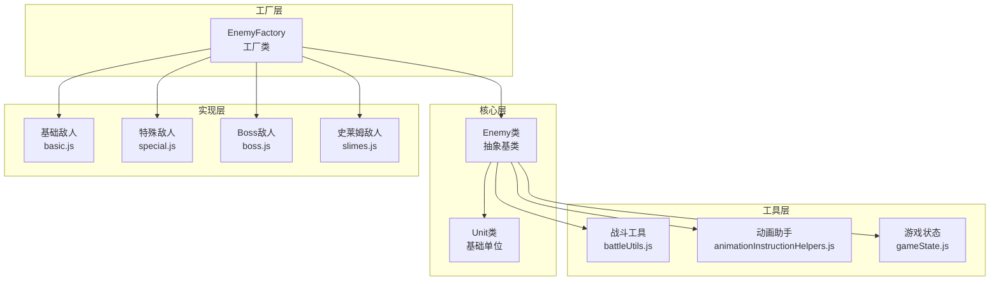
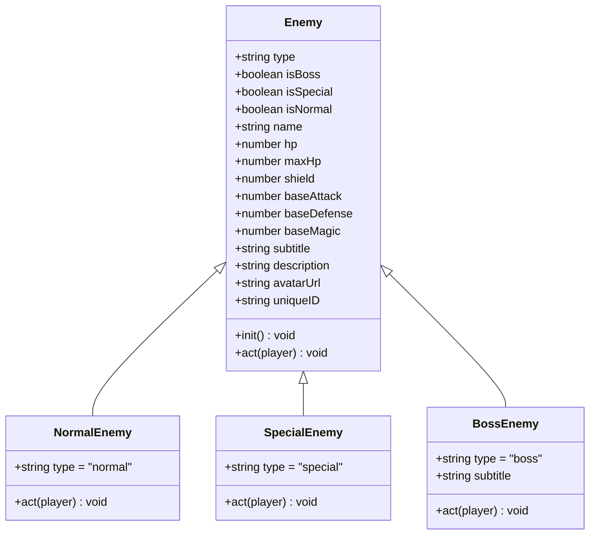
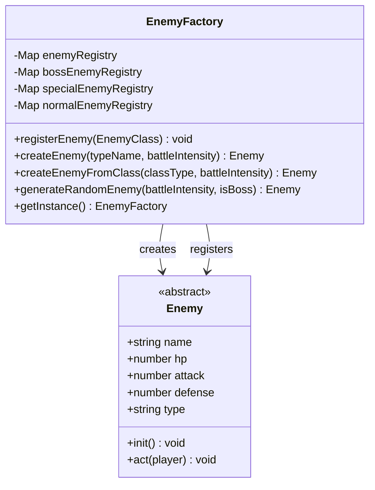
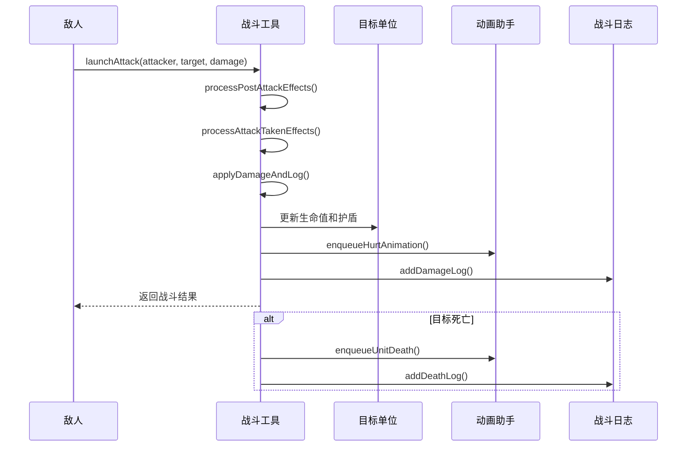
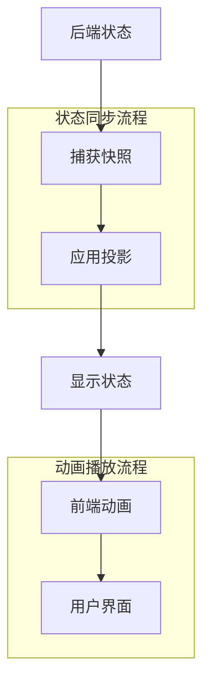
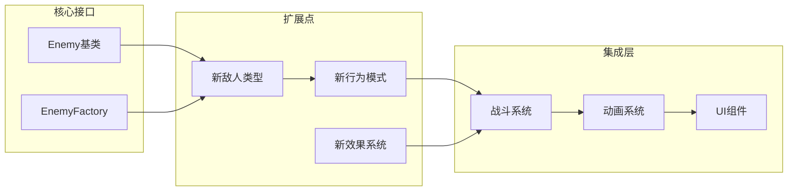

# 敌人数据模型设计文档

<cite>
**本文档中引用的文件**
- [enemy.js](file://src/data/enemy.js)
- [enemyFactory.js](file://src/data/enemyFactory.js)
- [unit.js](file://src/data/unit.js)
- [basic.js](file://src/data/enemies/basic.js)
- [boss.js](file://src/data/enemies/boss.js)
- [special.js](file://src/data/enemies/special.js)
- [slimes.js](file://src/data/enemies/slimes.js)
- [battleUtils.js](file://src/data/battleUtils.js)
- [battleLogUtils.js](file://src/data/battleLogUtils.js)
- [animationInstructionHelpers.js](file://src/data/animationInstructionHelpers.js)
- [gameState.js](file://src/data/gameState.js)
- [player.js](file://src/data/player.js)
</cite>

## 目录
1. [简介](#简介)
2. [项目结构概览](#项目结构概览)
3. [核心Enemy类设计](#核心enemy类设计)
4. [类型系统与分类](#类型系统与分类)
5. [生命周期钩子机制](#生命周期钩子机制)
6. [敌人工厂模式](#敌人工厂模式)
7. [战斗系统集成](#战斗系统集成)
8. [状态同步与动画](#状态同步与动画)
9. [性能优化考量](#性能优化考量)
10. [扩展性设计](#扩展性设计)
11. [总结](#总结)

## 简介

本文档详细阐述了游戏《魏启尖塔》中敌人数据模型的设计原理与实现细节。该系统采用面向对象设计模式，通过抽象基类Enemy和具体的子类实现，提供了完整的敌人生命周期管理、类型区分、状态同步和战斗交互功能。

敌人系统是游戏战斗机制的核心组成部分，负责管理敌人的属性、行为、状态变化以及与玩家的交互。系统采用了工厂模式进行敌人实例化，继承了Unit基类的所有战斗属性，并通过独特的生命周期钩子机制支持AI行为的扩展。

## 项目结构概览

敌人数据模型的实现分布在多个关键文件中，形成了清晰的分层架构：



**图表来源**
- [enemy.js](file://src/data/enemy.js#L1-L44)
- [unit.js](file://src/data/unit.js#L1-L143)
- [enemyFactory.js](file://src/data/enemyFactory.js#L1-L88)

**章节来源**
- [enemy.js](file://src/data/enemy.js#L1-L44)
- [unit.js](file://src/data/unit.js#L1-L143)
- [enemyFactory.js](file://src/data/enemyFactory.js#L1-L88)

## 核心Enemy类设计

Enemy类作为所有敌人类型的抽象基类，继承自Unit类并扩展了特定的敌人属性和行为。其设计遵循面向对象编程的最佳实践，提供了清晰的接口和扩展点。

### 基础属性体系

Enemy类定义了完整的敌人属性体系，包括生命值、攻击力、防御力等核心战斗属性：

```javascript
constructor(name, hp, attack, defense, avatarUrl = '') {
  super();
  this.name = name;                    // 敌人名称
  this.hp = hp;                       // 当前生命值
  this.maxHp = hp;                    // 最大生命值
  this.shield = 0;                    // 当前护盾
  this.baseAttack = attack;           // 基础攻击力
  this.baseDefense = defense;         // 基础防御力
  this.baseMagic = 0;                 // 基础灵能强度
  this.subtitle = "";                 // Boss副标题
  this.description = '一个面目狰狞的敌人！'; // 敌人描述
  this.type = 'normal';               // 类型标识
  this.avatarUrl = avatarUrl;         // 头像URL
  this.uniqueID = Math.random().toString(36).substring(2, 10); // 唯一ID
}
```

### 访问器方法设计

Enemy类提供了三个重要的访问器方法来判断敌人类型，这些方法具有优秀的性能特征：

```javascript
get isBoss () {
  return this.type === 'boss';
}

get isSpecial () {
  return this.type === 'special';
}

get isNormal () {
  return this.type === 'normal';
}
```

这些访问器方法的设计考虑了以下性能因素：
- **零开销设计**：使用JavaScript getter语法，编译器可以对其进行优化
- **常量时间复杂度**：O(1)，直接比较字符串值
- **缓存友好**：不会产生额外的函数调用开销
- **内存效率**：只存储类型字符串，不占用额外内存空间

### 属性继承与扩展

Enemy类继承了Unit类的所有战斗属性，包括：

```javascript
// 继承的战斗属性
get attack() { return this.baseAttack + (this.effects['力量'] || 0); }
get defense() { return this.baseDefense + (this.effects['坚固'] || 0); }
get magic() { return this.baseMagic + (this.effects['集中'] || 0); }

// 效果管理方法
addEffect(effectName, stacks = 1) { /* 实现 */ }
removeEffect(effectName, stacks = 1) { /* 实现 */ }
applyHeal(heal) { /* 实现 */ }
```

**章节来源**
- [enemy.js](file://src/data/enemy.js#L1-L44)
- [unit.js](file://src/data/unit.js#L1-L143)

## 类型系统与分类

敌人系统采用了三层类型分类体系，支持normal（普通）、special（精英）和boss（Boss）三种类型。这种设计提供了灵活的敌人行为定制和平衡控制。

### 类型定义与用途



**图表来源**
- [enemy.js](file://src/data/enemy.js#L1-L44)
- [basic.js](file://src/data/enemies/basic.js#L1-L286)
- [special.js](file://src/data/enemies/special.js#L1-L53)
- [boss.js](file://src/data/enemies/boss.js#L1-L155)

### 类型检测机制

类型检测通过简单的字符串比较实现，具有以下优势：

1. **性能优异**：O(1)时间复杂度，直接字符串比较
2. **内存高效**：只存储类型标识符，不占用额外空间
3. **易于扩展**：支持未来添加新的敌人类型
4. **语义清晰**：方法命名直观易懂

### 类型特化行为

不同类型的敌人具有不同的行为特征：

#### 普通敌人（Normal）
- 行为简单直接
- 适合大量出现
- 作为基础敌人模板

#### 精英敌人（Special）
- 具有独特的行为模式
- 较高的生命值和攻击力
- 通常出现在特定场景

#### Boss敌人（Boss）
- 复杂的战斗策略
- 生命值阈值触发机制
- 强大的特殊能力
- 丰富的视觉效果

**章节来源**
- [enemy.js](file://src/data/enemy.js#L20-L30)
- [basic.js](file://src/data/enemies/basic.js#L1-L286)
- [special.js](file://src/data/enemies/special.js#L1-L53)
- [boss.js](file://src/data/enemies/boss.js#L1-L155)

## 生命周期钩子机制

Enemy类定义了两个关键的生命周期钩子方法：`init()`和`act()`，为敌人行为的扩展提供了清晰的接口。

### 初始化钩子（init）

```javascript
init() {
  // 初始化逻辑（如果需要）
}
```

`init()`方法的设计特点：
- **空实现**：默认不执行任何操作，避免不必要的开销
- **扩展点**：子类可以重写此方法实现自定义初始化逻辑
- **时机明确**：在敌人创建后立即调用，确保状态正确初始化
- **性能优化**：只有需要特殊初始化的敌人才会重写此方法

### 行动钩子（act）

```javascript
act(player) {
  // 子类需要实现具体逻辑
}
```

`act()`方法是敌人AI的核心，具有以下设计原则：

1. **抽象接口**：强制子类实现具体行为
2. **参数明确**：接收玩家对象作为参数
3. **灵活性高**：支持复杂的战斗策略
4. **可测试性**：便于单元测试和调试

### AI行为实现模式

不同类型的敌人实现了各自独特的AI行为模式：

#### 基础敌人AI模式
```javascript
act(player) {
  const actions = [
    () => {
      // 攻击逻辑
      const damage = this.calculateDamage(this.attack, player);
      launchAttack(this, player, damage);
    },
    () => {
      // 防御逻辑
      const shieldAmount = 2 + this.magic;
      gainShield(this, this, shieldAmount);
    }
  ];
  
  const action = actions[this.actionIndex % actions.length];
  this.actionIndex++;
  action();
}
```

#### Boss敌人AI模式
```javascript
act(player) {
  // 准备阶段
  if (!this.prepared) {
    this.prepared = true;
    this.addEffect('高燃弹药', 1);
    return;
  }
  
  // 生命值阈值检查
  if (!this.hpThresholdReached && this.hp < this.maxHp * 0.5) {
    this.hpThresholdReached = true;
    this.addEffect('眩晕', 1);
    return;
  }
  
  // 正常行动序列
  const action = actions[this.actionIndex % actions.length];
  action();
  this.actionIndex++;
}
```

**章节来源**
- [enemy.js](file://src/data/enemy.js#L32-L44)
- [basic.js](file://src/data/enemies/basic.js#L15-L80)
- [boss.js](file://src/data/enemies/boss.js#L25-L85)

## 敌人工厂模式

EnemyFactory类实现了工厂模式，负责敌人的创建、注册和管理。该设计提供了高度的灵活性和可扩展性。

### 工厂类架构



**图表来源**
- [enemyFactory.js](file://src/data/enemyFactory.js#L1-L88)

### 注册机制

工厂类维护四个注册表来管理不同类型的敌人：

```javascript
constructor() {
  this.enemyRegistry = new Map();           // 所有敌人
  this.bossEnemyRegistry = new Map();      // Boss敌人
  this.specialEnemyRegistry = new Map();   // 特殊敌人
  this.normalEnemyRegistry = new Map();    // 普通敌人
}
```

注册过程自动识别敌人类型：

```javascript
registerEnemy(EnemyClass) {
  const enemySample = new EnemyClass(1);
  this.enemyRegistry.set(enemySample.name, EnemyClass);
  if(enemySample.isBoss) this.bossEnemyRegistry.set(enemySample.name, EnemyClass);
  if(enemySample.isSpecial) this.specialEnemyRegistry.set(enemySample.name, EnemyClass);
  if(enemySample.isNormal) this.normalEnemyRegistry.set(enemySample.name, EnemyClass);
}
```

### 实例化策略

工厂类提供了多种实例化策略：

#### 1. 按类型创建
```javascript
static createEnemy(typeName, battleIntensity) {
  const EnemyClass = instance.enemyRegistry.get(typeName);
  if (EnemyClass) {
    return new EnemyClass(battleIntensity);
  }
  throw new Error(`Unknown enemy typeName: ${typeName}`);
}
```

#### 2. 按类创建
```javascript
static createEnemyFromClass(classType, battleIntensity) {
  return new classType(battleIntensity);
}
```

#### 3. 随机生成
```javascript
static generateRandomEnemy(battleIntensity, isBoss = false) {
  if (isBoss) {
    const bossEnemies = Array.from(instance.bossEnemyRegistry.keys());
    const randomType = bossEnemies[Math.floor(Math.random() * bossEnemies.length)];
    const enemy = this.createEnemy(randomType, battleIntensity);
    enemy.init();
    return enemy;
  }
  
  // 普通敌人生成逻辑
  const roll = Math.random();
  if(roll < 0.3 && battleIntensity > 4) {
    // 30%概率生成特殊敌人
    const specialEnemies = Array.from(instance.specialEnemyRegistry.keys());
    // ...
  }
}
```

### 单例模式实现

工厂类采用单例模式确保全局唯一性：

```javascript
static getInstance() {
  if (!this.instance) {
    this.instance = new EnemyFactory();
  }
  return this.instance;
}
```

**章节来源**
- [enemyFactory.js](file://src/data/enemyFactory.js#L1-L88)

## 战斗系统集成

敌人系统与战斗系统紧密集成，通过battleUtils.js提供完整的战斗结算和状态管理功能。

### 战斗结算流程



**图表来源**
- [battleUtils.js](file://src/data/battleUtils.js#L1-L365)
- [animationInstructionHelpers.js](file://src/data/animationInstructionHelpers.js#L1-L525)

### 战斗工具函数

battleUtils.js提供了完整的战斗结算功能：

#### 攻击结算
```javascript
export function launchAttack (attacker, target, damage) {
  // 攻击者后处理
  let finalDamage = damage + attacker.attack;
  if (attacker) {
    finalDamage = processPostAttackEffects(attacker, target, damage);
  }
  
  // 受到攻击时的效果处理
  finalDamage = processAttackTakenEffects(target, finalDamage);
  
  // 固定防御减免
  finalDamage = Math.max(finalDamage - target.defense, 0);

  const result = applyDamageAndLog(target, finalDamage, { mode: 'attack', attacker });
  
  if (!result.dead) {
    processAttackFinishEffects(attacker, target, result.hpDamage, result.passThoughDamage);
  } else {
    try { enqueueUnitDeath({ unitId: target.uniqueID }); } catch (_) {}
  }

  return result;
}
```

#### 伤害应用
```javascript
function applyDamageAndLog(target, mitigatedDamage, { mode = 'attack', attacker = null, source = null } = {}) {
  const passThoughDamage = mitigatedDamage;
  let hpDamage = 0;

  if (mitigatedDamage > 0) {
    // 先打护盾
    const shieldDamage = Math.min(target.shield, mitigatedDamage);
    mitigatedDamage -= shieldDamage;
    hpDamage = mitigatedDamage;

    // 更新生命值状态
    target.shield -= shieldDamage;
    target.hp = Math.max(target.hp - mitigatedDamage, 0);

    // 入队受伤动画
    enqueueHurtAnimation({
      unitId: target.uniqueID, hpDamage: hpDamage, passThroughDamage: passThoughDamage
    });

    // 处理受到伤害时的效果
    processDamageTakenEffects(target, passThoughDamage, hpDamage)

    if (target.hp <= 0) {
      addDeathLog(`${target.name} 被击败了！`);
      return { dead: true, passThoughDamage, hpDamage };
    }
  }

  return { dead: false, passThoughDamage, hpDamage };
}
```

### 效果管理系统

敌人系统通过Unit基类继承了完整的效果管理系统：

```javascript
// 添加效果
addEffect(effectName, stacks = 1) {
  addEffectToTarget(this, effectName, stacks);
}

// 移除效果
removeEffect(effectName, stacks = 1) {
  removeEffectFromTarget(this, effectName, stacks);
}

// 效果查询
hasEffect(effectName) {
  return (this.effects[effectName] || 0) !== 0;
}
```

**章节来源**
- [battleUtils.js](file://src/data/battleUtils.js#L1-L365)
- [unit.js](file://src/data/unit.js#L1-L143)

## 状态同步与动画

敌人系统与前端动画系统紧密集成，通过animationInstructionHelpers.js实现状态的实时同步和动画播放。

### 状态同步机制



**图表来源**
- [animationInstructionHelpers.js](file://src/data/animationInstructionHelpers.js#L1-L525)
- [gameState.js](file://src/data/gameState.js#L1-L75)

### 快照捕获与投影

系统采用投影技术实现状态同步：

```javascript
// 捕获后端状态快照
export function captureSnapshot() {
  return projectToS(backendGameState);
}

// 将后端状态投影到显示层
export function applyProjectionToDisplay(src, dst) {
  if (Array.isArray(src) && Array.isArray(dst)) {
    const done = reconcileArrayById(src, dst);
    if (done) return;
    
    const len = src.length;
    for (let i = 0; i < len; i++) {
      const sEl = src[i];
      const dEl = dst[i];
      if (sEl && typeof sEl === 'object') {
        if (dEl && typeof dEl === 'object') {
          applyProjectionToDisplay(sEl, dEl);
        } else {
          const inst = createInstanceFromSnapshotNode(sEl);
          applyProjectionToDisplay(sEl, inst);
          dst[i] = inst;
        }
      } else {
        dst[i] = sEl;
      }
    }
    if (dst.length > len) dst.splice(len);
    return;
  }
  
  // 处理对象属性
  for (const key of Object.keys(src)) {
    if (!isWritableProperty(dst, key)) continue;
    const sVal = src[key];
    const dVal = dst[key];

    if (Array.isArray(sVal)) {
      if (Array.isArray(dVal)) {
        applyProjectionToDisplay(sVal, dVal);
      } else {
        const arr = new Array(0);
        dst[key] = arr;
        applyProjectionToDisplay(sVal, arr);
      }
      continue;
    }

    if (sVal && typeof sVal === 'object') {
      const sProto = Object.getPrototypeOf(toRaw(sVal));
      if (dVal && typeof dVal === 'object' && !Array.isArray(dVal)) {
        try {
          const dstProto = Object.getPrototypeOf(dVal);
          if (sProto && dstProto !== sProto) {
            Object.setPrototypeOf(dVal, sProto);
          }
        } catch (_) {}
        applyProjectionToDisplay(sVal, dVal);
      } else {
        let obj = Object.create(sProto || Object.prototype);
        applyProjectionToDisplay(sVal, obj);
        dst[key] = obj;
      }
      continue;
    }

    if (dst[key] !== sVal) dst[key] = sVal;
  }
}
```

### 动画指令系统

系统提供了完整的动画指令API：

```javascript
// 受伤动画指令
export function enqueueHurtAnimation({ unitId, hpDamage = 0, passThroughDamage = 0 } = {}) {
  const isHealing = hpDamage < 0;
  const durationMs = isHealing ? 400 : Math.min(200 + Math.max(0, passThroughDamage) * 2, 600);
  return enqueueInstruction({
    tags: ['ui'],
    waitTags: ['all'],
    durationMs,
    start: ({ emit }) => {
      try { emit('unit-hurt', { unitId, hpDamage, passThroughDamage }); } catch (_) {}
    }
  });
}

// 死亡动画指令
export function enqueueUnitDeath({ unitId } = {}) {
  const durationMs = 1500;
  return enqueueInstruction({
    tags: ['ui'],
    waitTags: ['all'],
    durationMs,
    start: ({ emit }) => {
      try { emit('unit-death', { unitId }); } catch (_) {}
    }
  });
}
```

### 唯一ID生成策略

每个敌人实例都生成唯一的ID用于动画同步：

```javascript
constructor(name, hp, attack, defense, avatarUrl = '') {
  // ...
  // 为每个实例生成唯一ID（用于动画同步等）
  this.uniqueID = Math.random().toString(36).substring(2, 10);
}
```

这种ID生成策略的特点：
- **简单高效**：使用Math.random()生成短字符串
- **冲突概率低**：10位字符的组合空间足够大
- **跨平台兼容**：纯JavaScript实现，无外部依赖
- **实时生成**：在构造函数中即时生成

**章节来源**
- [animationInstructionHelpers.js](file://src/data/animationInstructionHelpers.js#L1-L525)
- [enemy.js](file://src/data/enemy.js#L10-L15)

## 性能优化考量

敌人系统在设计时充分考虑了性能优化，采用了多种策略确保系统的高效运行。

### 内存管理优化

1. **对象池模式**：通过工厂类复用敌人对象
2. **延迟初始化**：只有在需要时才创建敌人实例
3. **弱引用使用**：避免循环引用导致的内存泄漏
4. **及时清理**：敌人死亡后立即清理相关资源

### 计算性能优化

1. **访问器缓存**：利用JavaScript getter的缓存机制
2. **早期退出**：在条件不满足时尽早返回
3. **批量操作**：合并多个小的操作为单次调用
4. **算法优化**：选择最适合的算法和数据结构

### 渲染性能优化

1. **状态同步**：只同步必要的状态变化
2. **动画队列**：合理安排动画播放顺序
3. **DOM复用**：复用现有的DOM元素
4. **异步处理**：将耗时操作放到后台线程

### 并发处理优化

```javascript
// 监听后端状态变化，标记为脏
let backendStateDirty = false;
let endOfTickStateSycnScheduled = false;

function scheduleEndOfTickCheck() {
  if (endOfTickStateSycnScheduled) return;
  endOfTickStateSycnScheduled = true;
  setTimeout(() => {
    endOfTickStateSycnScheduled = false;
    if (backendStateDirty) {
      // tick 结束仍有未同步的变更，强制入队一次当前快照（默认带屏障）
      enqueueState();
    }
  }, 0);
}
```

## 扩展性设计

敌人系统采用了良好的扩展性设计，支持未来的功能增强和内容扩展。

### 插件化架构



### 设计模式应用

1. **工厂模式**：EnemyFactory负责敌人创建
2. **模板方法模式**：Enemy基类定义骨架，子类实现细节
3. **观察者模式**：状态变化时通知相关组件
4. **命令模式**：动画指令的封装和执行
5. **策略模式**：不同类型的敌人采用不同的行为策略

### API设计原则

1. **单一职责**：每个类和方法都有明确的职责
2. **开放封闭**：对扩展开放，对修改封闭
3. **依赖倒置**：高层模块不依赖低层模块
4. **接口隔离**：提供最小化的接口
5. **里氏替换**：子类可以替换父类

### 向后兼容性

系统设计时考虑了向后兼容性：

1. **渐进式增强**：新功能不影响旧功能
2. **版本控制**：明确的版本号和变更记录
3. **废弃策略**：逐步废弃过时的功能
4. **迁移工具**：提供数据迁移工具

## 总结

《魏启尖塔》的敌人数据模型展现了优秀的软件工程实践，通过精心设计的架构实现了高度的可维护性、可扩展性和性能表现。

### 主要成就

1. **清晰的层次结构**：从Unit基类到Enemy子类，再到具体实现，层次分明
2. **灵活的类型系统**：支持normal、special、boss三种类型，适应不同的游戏需求
3. **高效的工厂模式**：EnemyFactory提供统一的敌人创建和管理接口
4. **完善的生命周期**：init和act方法为AI行为提供了清晰的扩展点
5. **强大的状态同步**：与前端动画系统的无缝集成
6. **优秀的性能表现**：多种优化策略确保系统流畅运行

### 技术亮点

- **面向对象设计**：充分利用继承、多态等特性
- **设计模式应用**：工厂模式、模板方法模式等的实际运用
- **性能优化**：访问器缓存、早期退出、批量操作等策略
- **扩展性设计**：插件化架构，支持未来的功能增强
- **状态管理**：前后端分离的状态同步机制

### 未来发展方向

1. **AI智能增强**：引入更复杂的敌人AI算法
2. **效果系统完善**：扩展效果类型和交互机制
3. **性能进一步优化**：针对大规模战斗场景的优化
4. **可视化工具**：提供敌人配置的可视化编辑器
5. **网络同步**：支持多人在线战斗的同步机制

这个敌人数据模型不仅满足了当前游戏的需求，更为未来的功能扩展奠定了坚实的基础，体现了优秀的软件架构设计思想。