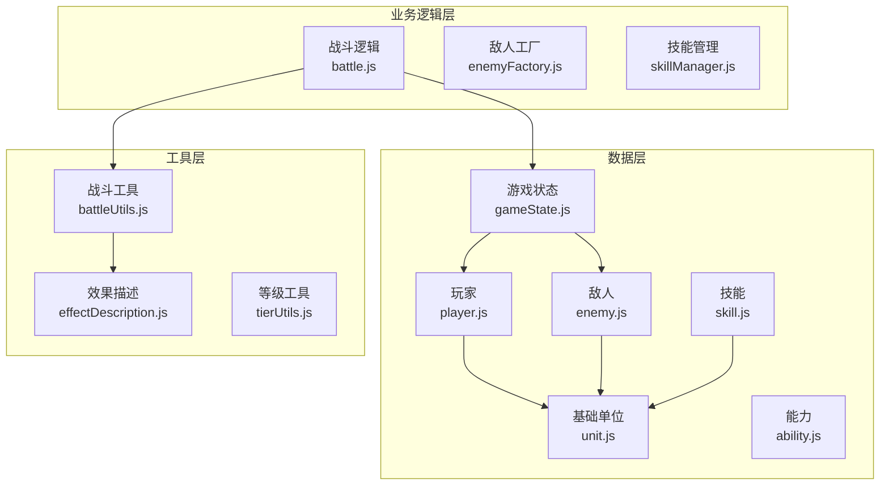
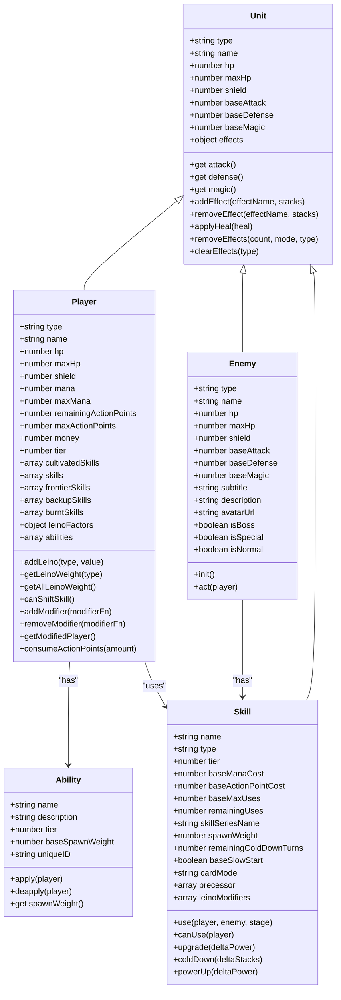
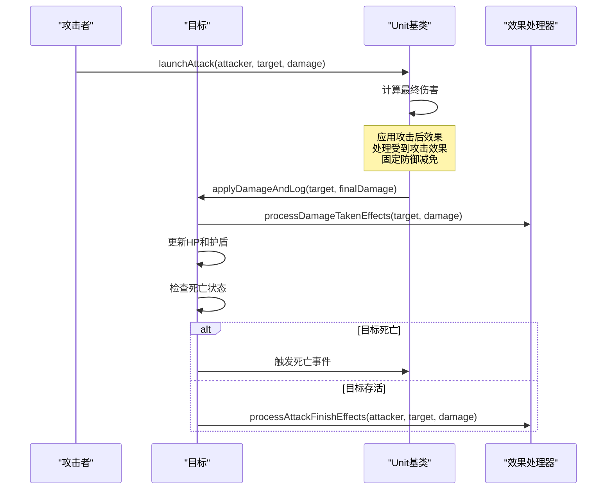
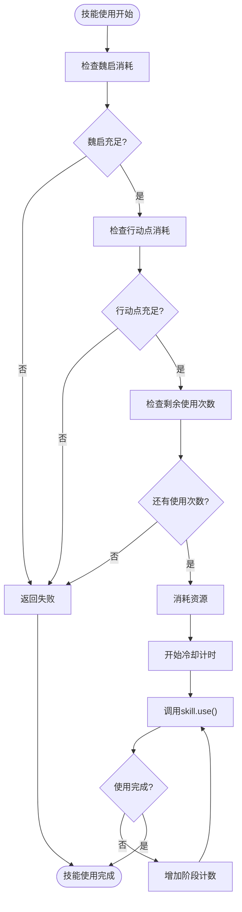
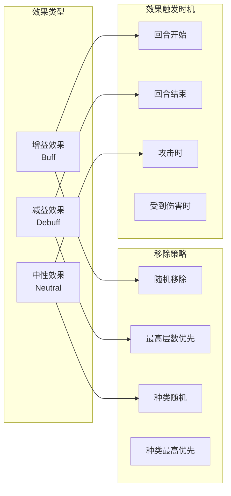
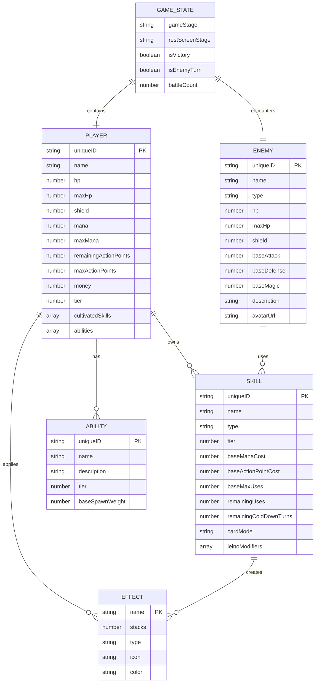
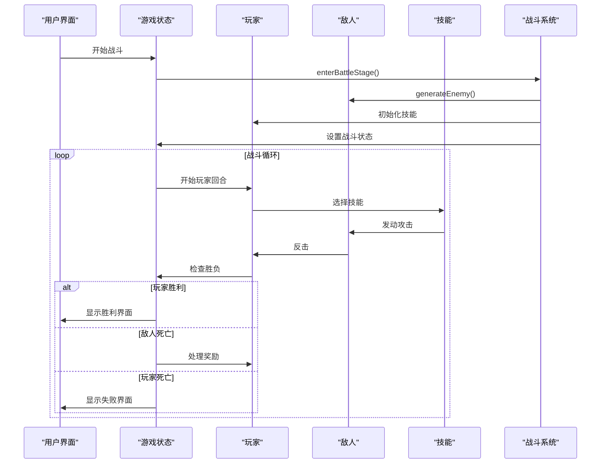
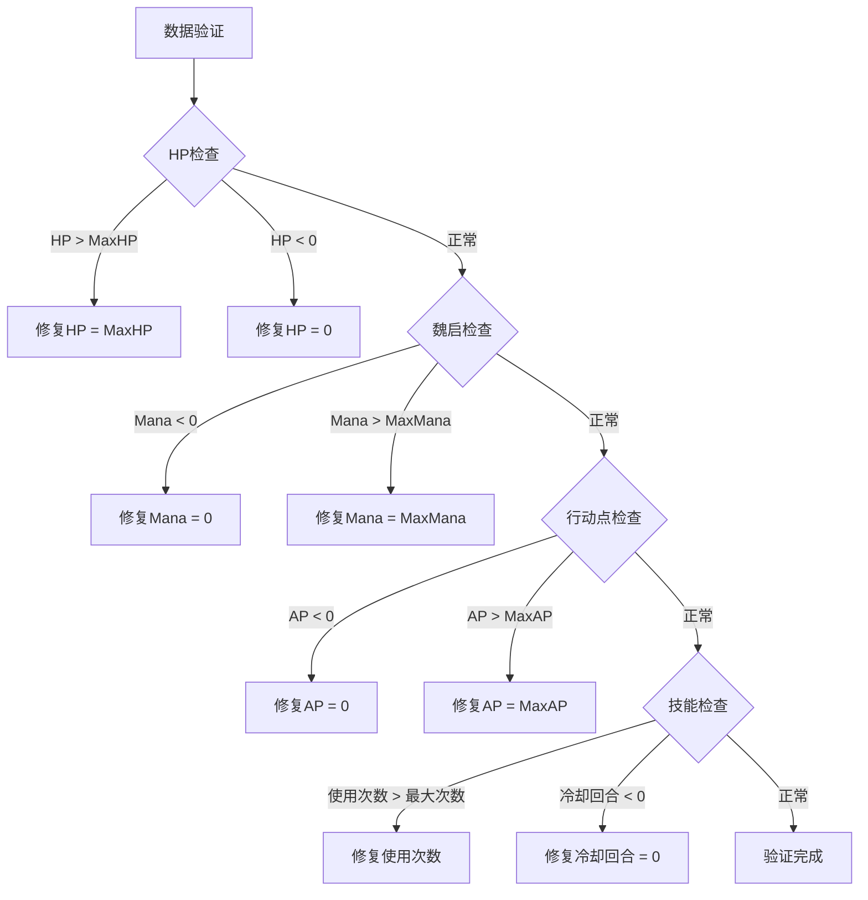

# 数据模型

<cite>
**本文档中引用的文件**
- [gameState.js](file://src/data/gameState.js)
- [player.js](file://src/data/player.js)
- [enemy.js](file://src/data/enemy.js)
- [unit.js](file://src/data/unit.js)
- [skill.js](file://src/data/skill.js)
- [ability.js](file://src/data/ability.js)
- [battle.js](file://src/data/battle.js)
- [battleUtils.js](file://src/data/battleUtils.js)
- [effectDescription.js](file://src/data/effectDescription.js)
- [tierUtils.js](file://src/utils/tierUtils.js)
- [punch.js](file://src/data/skills/martial_arts/punch.js)
- [basic.js](file://src/data/enemies/basic.js)
</cite>

## 目录
1. [简介](#简介)
2. [项目结构概览](#项目结构概览)
3. [核心实体设计](#核心实体设计)
4. [架构概览](#架构概览)
5. [详细组件分析](#详细组件分析)
6. [实体关系分析](#实体关系分析)
7. [数据验证与完整性](#数据验证与完整性)
8. [性能考虑](#性能考虑)
9. [故障排除指南](#故障排除指南)
10. [结论](#结论)

## 简介

本项目是一个基于Vue.js的游戏数据模型系统，专注于构建一个完整的RPG战斗系统。该系统采用前后端分离的设计模式，通过精心设计的数据结构来管理游戏状态、玩家角色、敌人、技能和能力等核心实体。

数据模型系统的核心特点包括：
- **响应式状态管理**：使用Vue.js的reactive系统实现状态的实时更新
- **面向对象设计**：通过继承和多态实现灵活的角色行为
- **类型安全**：通过严格的类型定义确保数据完整性
- **扩展性**：模块化的架构支持轻松添加新的技能、敌人和能力

## 项目结构概览



**图表来源**
- [gameState.js](file://src/data/gameState.js#L1-L75)
- [player.js](file://src/data/player.js#L1-L50)
- [enemy.js](file://src/data/enemy.js#L1-L44)
- [unit.js](file://src/data/unit.js#L1-L50)

## 核心实体设计

### 游戏状态实体 (GameState)

游戏状态是整个系统的核心控制器，负责协调所有游戏组件的状态管理。

```javascript
// 游戏状态结构
{
  // 游戏阶段: 'start', 'battle', 'rest', 'end'
  gameStage: 'start',
  
  // 休整界面阶段
  restScreenStage: '',
  
  // 游戏结果状态
  isVictory: false,
  
  // 回合控制
  isEnemyTurn: false,
  
  // 玩家数据
  player: reactive(new Player()),
  
  // 敌人数据
  enemy: {},
  
  // 奖励数据
  rewards: {
    breakthrough: false,
    money: 0,
    skills: [],
    abilities: []
  },
  
  // 商店物品
  shopItems: [],
  
  // 战斗场次数
  battleCount: 0
}
```

### 玩家实体 (Player)

玩家实体继承自Unit基类，包含了丰富的属性和行为方法。

```javascript
// 玩家属性结构
class Player extends Unit {
  constructor() {
    super();
    this.type = 'player';
    this.name = "你";
    this.hp = 65;
    this.shield = 0;
    this.maxHp = 65;
    this.mana = 0;
    this.maxMana = 0;
    this.baseAttack = 0;
    this.baseMagic = 1;
    this.baseDefense = 0;
    this.remainingActionPoints = 3;
    this.maxActionPoints = 3;
    this.money = 0;
    this.tier = 1;
    
    // 技能系统
    this.maxSkills = 20;
    this.cultivatedSkills = [];
    this.skills = [];
    this.frontierSkills = [];
    this.backupSkills = [];
    this.burntSkills = [];
    
    // 灵脉系统
    this.leinoFactors = {};
    
    // 能力系统
    this.abilities = [];
  }
}
```

### 敌人实体 (Enemy)

敌人实体提供了灵活的战斗行为框架，支持不同类型敌人的特殊行为。

```javascript
// 敌人属性结构
class Enemy extends Unit {
  constructor(name, hp, attack, defense, avatarUrl = '') {
    super();
    this.name = name;
    this.hp = hp;
    this.maxHp = hp;
    this.shield = 0;
    this.baseAttack = attack;
    this.baseDefense = defense;
    this.baseMagic = 0;
    this.subtitle = "";
    this.description = '';
    this.type = 'normal';
    this.avatarUrl = avatarUrl;
    this.uniqueID = Math.random().toString(36).substring(2, 10);
  }
  
  get isBoss() { return this.type === 'boss'; }
  get isSpecial() { return this.type === 'special'; }
  get isNormal() { return this.type === 'normal'; }
}
```

**章节来源**
- [gameState.js](file://src/data/gameState.js#L8-L35)
- [player.js](file://src/data/player.js#L60-L120)
- [enemy.js](file://src/data/enemy.js#L3-L25)

## 架构概览



**图表来源**
- [unit.js](file://src/data/unit.js#L5-L25)
- [player.js](file://src/data/player.js#L60-L120)
- [enemy.js](file://src/data/enemy.js#L3-L25)
- [skill.js](file://src/data/skill.js#L5-L35)
- [ability.js](file://src/data/ability.js#L3-L15)

## 详细组件分析

### 基础单位 (Unit) 类

Unit类是所有战斗实体的基础抽象，提供了统一的属性和行为接口。



**图表来源**
- [battleUtils.js](file://src/data/battleUtils.js#L40-L80)
- [unit.js](file://src/data/unit.js#L15-L35)

### 技能系统 (Skill)

技能系统采用了复杂的冷却机制和多重使用限制。



**图表来源**
- [skill.js](file://src/data/skill.js#L180-L205)
- [battleUtils.js](file://src/data/battleUtils.js#L150-L180)

### 灵脉系统 (Leino Factors)

灵脉系统为玩家提供了独特的属性增强机制，影响卡牌出现概率和战斗表现。

```javascript
// 灵脉因子结构
{
  fire: 0,     // 火系灵脉强度
  wind: 0,     // 风系灵脉强度
  wood: 0,     // 木系灵脉强度
  earth: 0,    // 土系灵脉强度
  water: 0,    // 水系灵脉强度
  thunder: 0,  // 雷系灵脉强度
  light: 0,    // 光系灵脉强度
  dark: 0      // 暗系灵脉强度
}

// 灵脉加权计算
getLeinoWeight(type) {
  return Math.max(this.leinoFactors[type] || 0, 0);
}

getAllLeinoWeight() {
  return Object.values(this.leinoFactors).reduce((sum, val) => sum + val, 0);
}
```

### 效果系统 (Effects)

效果系统提供了复杂的状态管理机制，支持多种类型的效果和不同的移除策略。



**图表来源**
- [effectDescription.js](file://src/data/effectDescription.js#L1-L50)
- [unit.js](file://src/data/unit.js#L50-L100)

**章节来源**
- [unit.js](file://src/data/unit.js#L1-L143)
- [skill.js](file://src/data/skill.js#L1-L205)
- [player.js](file://src/data/player.js#L120-L180)

## 实体关系分析

### 核心实体关系图



**图表来源**
- [gameState.js](file://src/data/gameState.js#L8-L35)
- [player.js](file://src/data/player.js#L60-L120)
- [enemy.js](file://src/data/enemy.js#L3-L25)
- [skill.js](file://src/data/skill.js#L5-L35)
- [ability.js](file://src/data/ability.js#L3-L15)

### 数据流分析



**图表来源**
- [battle.js](file://src/data/battle.js#L15-L50)
- [gameState.js](file://src/data/gameState.js#L15-L35)

**章节来源**
- [gameState.js](file://src/data/gameState.js#L1-L75)
- [battle.js](file://src/data/battle.js#L1-L100)

## 数据验证与完整性

### 类型约束系统

系统通过严格的数据类型定义确保数据完整性：

```javascript
// 玩家属性类型约束
class Player {
  // 数值类型验证
  hp: number >= 0
  maxHp: number >= 0
  mana: number >= 0
  maxMana: number >= 0
  remainingActionPoints: number >= 0
  
  // 数组类型验证
  cultivatedSkills: Array<Skill>
  frontierSkills: Array<Skill>
  backupSkills: Array<Skill>
  burntSkills: Array<Skill>
  abilities: Array<Ability>
  
  // 对象类型验证
  leinoFactors: Object<string, number>
  effects: Object<string, number>
}
```

### 数据验证规则

1. **HP验证**：生命值不能超过最大生命值，也不能小于0
2. **资源验证**：魏启和行动点不能为负数
3. **技能验证**：技能使用次数不能超过最大使用次数
4. **冷却验证**：冷却回合数不能为负数

### 完整性约束



**章节来源**
- [player.js](file://src/data/player.js#L60-L120)
- [skill.js](file://src/data/skill.js#L80-L120)

## 性能考虑

### 响应式系统优化

系统使用Vue.js的reactive系统实现高效的响应式更新：

1. **状态分离**：将显示层状态和后端状态分离，避免不必要的渲染
2. **增量更新**：只更新发生变化的状态，减少DOM操作
3. **批量处理**：将多个状态变更合并为单次更新

### 内存管理

```javascript
// 内存优化策略
class Player {
  // 使用Proxy实现属性修正，避免创建大量副本
  getModifiedPlayer() {
    if(this.modified) return this;
    
    let current = this;
    for (const mod of this.modifiers) {
      const next = mod(current);
      if (next) current = next;
    }
    
    // 创建Proxy标记为已修正
    return new Proxy(current, {
      get(target, prop, receiver) {
        if (prop === 'modified') return true;
        return Reflect.get(target, prop, receiver);
      }
    });
  }
}
```

### 动画性能优化

系统通过动画指令队列实现流畅的视觉效果：

```javascript
// 动画性能优化
enqueueAnimateCardById({
  id: skill.uniqueID,
  kind: 'flyToAnchor',
  options: {
    anchor: 'center',
    scale: 1.2,
    durationMs: 300
  }
}, {
  tags: ['ui'],
  waitTags: []
});
```

## 故障排除指南

### 常见问题诊断

1. **技能无法使用**
   - 检查魏启消耗是否足够
   - 检查行动点是否足够
   - 检查技能剩余使用次数
   - 检查技能是否处于冷却状态

2. **战斗状态异常**
   - 检查游戏阶段设置
   - 检查玩家和敌人状态
   - 检查战斗循环逻辑

3. **效果系统问题**
   - 检查效果类型定义
   - 检查效果移除策略
   - 检查效果触发时机

### 调试工具

```javascript
// 调试辅助函数
function debugGameState(state) {
  console.log('游戏状态:', {
    gameStage: state.gameStage,
    isEnemyTurn: state.isEnemyTurn,
    playerHP: state.player.hp,
    enemyHP: state.enemy.hp,
    playerMana: state.player.mana,
    playerAP: state.player.remainingActionPoints
  });
}

// 状态快照功能
function captureSnapshot() {
  return {
    timestamp: Date.now(),
    player: JSON.parse(JSON.stringify(state.player)),
    enemy: JSON.parse(JSON.stringify(state.enemy))
  };
}
```

**章节来源**
- [battle.js](file://src/data/battle.js#L1-L100)
- [gameState.js](file://src/data/gameState.js#L40-L75)

## 结论

本数据模型系统通过精心设计的架构和严格的数据验证，为游戏提供了稳定可靠的核心数据支撑。系统的主要优势包括：

1. **模块化设计**：清晰的职责分离使得系统易于维护和扩展
2. **类型安全**：严格的类型定义确保了数据的一致性和可靠性
3. **性能优化**：响应式系统和动画队列提供了流畅的用户体验
4. **扩展性强**：灵活的架构支持轻松添加新的游戏元素

未来的发展方向包括：
- 增强数据序列化和持久化机制
- 优化大型战斗场景的性能
- 扩展更多的游戏元素和系统
- 改进调试和监控工具