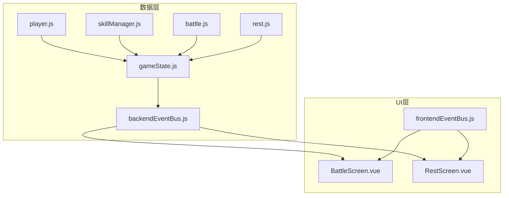
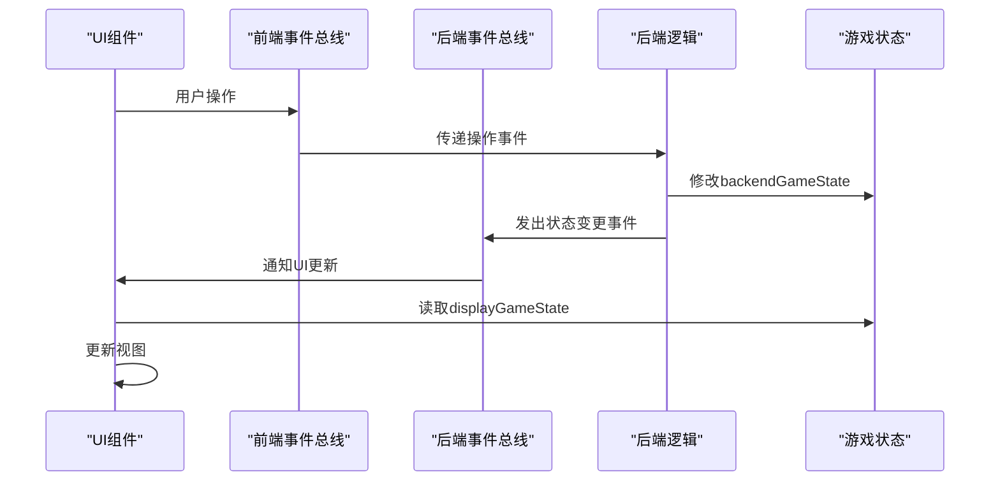
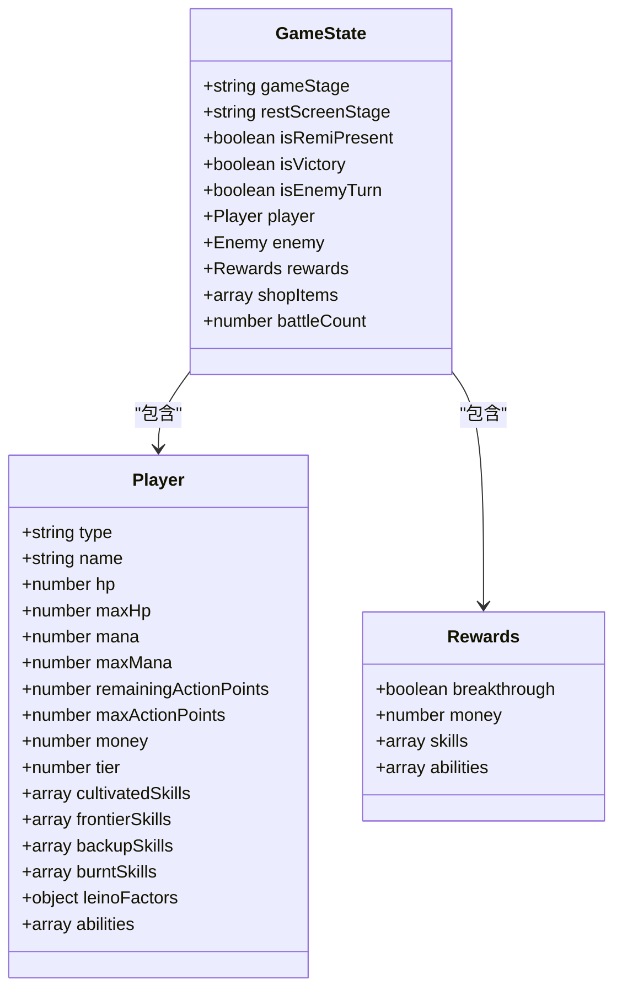
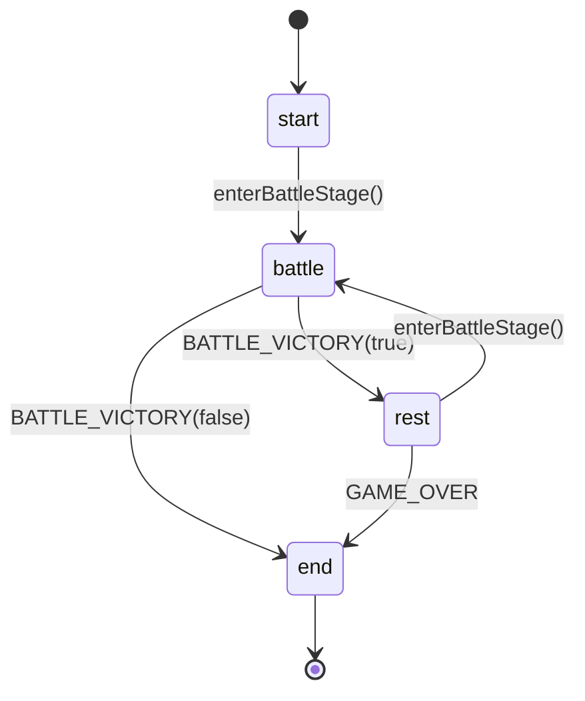
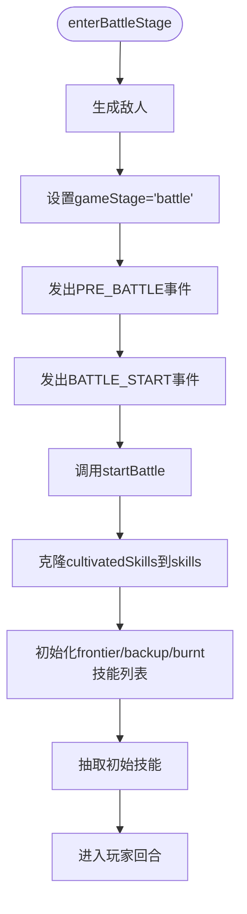
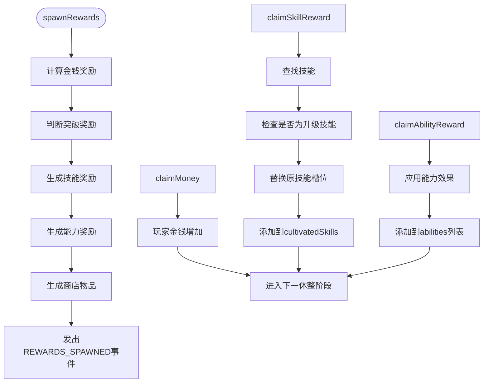
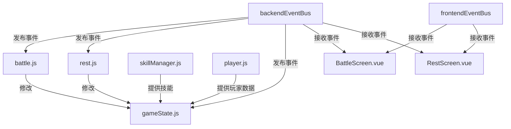

# 游戏状态模型

<cite>
**本文档引用的文件**  
- [gameState.js](file://src/data/gameState.js#L1-L75)
- [player.js](file://src/data/player.js#L1-L226)
- [skillManager.js](file://src/data/skillManager.js#L1-L253)
- [battle.js](file://src/data/battle.js#L1-L553)
- [rest.js](file://src/data/rest.js#L1-L215)
- [backendEventBus.js](file://src/backendEventBus.js#L1-L80)
- [frontendEventBus.js](file://src/frontendEventBus.js#L1-L9)
- [BattleScreen.vue](file://src/components/battle/BattleScreen.vue#L1-L112)
- [RestScreen.vue](file://src/components/rest/RestScreen.vue#L1-L150)
</cite>

## 目录
1. [引言](#引言)
2. [项目结构](#项目结构)
3. [核心组件](#核心组件)
4. [架构概述](#架构概述)
5. [详细组件分析](#详细组件分析)
6. [依赖分析](#依赖分析)
7. [性能考虑](#性能考虑)
8. [故障排除指南](#故障排除指南)
9. [结论](#结论)

## 引言
本文档旨在全面解析游戏状态模型的设计与实现，重点分析 `gameState.js` 中的全局状态管理机制。该系统采用前后端分离架构，通过响应式对象与事件总线实现状态同步与UI更新。文档将深入探讨游戏阶段流转、核心状态字段、状态变更触发机制及前后端状态同步策略，并结合代码逻辑说明关键方法对游戏流程的影响。

## 项目结构
项目采用模块化设计，核心逻辑集中在 `src/data` 目录下，UI组件位于 `src/components` 目录。状态管理由 `gameState.js` 统一维护，通过事件总线与各组件通信。

**Diagram sources**
- [gameState.js](file://src/data/gameState.js#L1-L75)
- [battle.js](file://src/data/battle.js#L1-L553)
- [rest.js](file://src/data/rest.js#L1-L215)
- [BattleScreen.vue](file://src/components/battle/BattleScreen.vue#L1-L112)
- [RestScreen.vue](file://src/components/rest/RestScreen.vue#L1-L150)

**Section sources**
- [gameState.js](file://src/data/gameState.js#L1-L75)
- [project_structure](file://project_structure#L1-L100)

## 核心组件
`gameState.js` 是整个游戏的核心状态容器，定义了游戏阶段、玩家、敌人、奖励等关键字段。系统通过 `createGameState` 工厂函数创建初始状态，并维护两份独立的响应式状态：`backendGameState`（后端逻辑状态）和 `displayGameState`（前端显示状态）。

**Section sources**
- [gameState.js](file://src/data/gameState.js#L1-L75)

## 架构概述
系统采用前后端分离状态架构，后端负责游戏逻辑结算，前端负责UI展示。两者通过事件总线进行通信，确保状态变更的响应式更新。

**Diagram sources**
- [backendEventBus.js](file://src/backendEventBus.js#L1-L80)
- [frontendEventBus.js](file://src/frontendEventBus.js#L1-L9)
- [gameState.js](file://src/data/gameState.js#L1-L75)

## 详细组件分析

### 游戏状态模型分析
`gameState.js` 定义了游戏的核心状态结构，包括游戏阶段、玩家实例、当前敌人等。

#### 状态字段定义

**Diagram sources**
- [gameState.js](file://src/data/gameState.js#L1-L75)
- [player.js](file://src/data/player.js#L1-L226)

#### 状态流转分析
游戏状态在不同阶段间流转，形成完整的生命周期。

**Diagram sources**
- [battle.js](file://src/data/battle.js#L1-L553)
- [rest.js](file://src/data/rest.js#L1-L215)

### 战斗流程分析
战斗流程由 `battle.js` 模块管理，通过事件驱动的方式推进游戏进程。

#### 战斗开始流程

**Diagram sources**
- [battle.js](file://src/data/battle.js#L1-L553)

**Section sources**
- [battle.js](file://src/data/battle.js#L1-L553)

### 休整阶段分析
休整阶段由 `rest.js` 模块管理，处理奖励生成与领取逻辑。

#### 奖励生成与领取

**Diagram sources**
- [rest.js](file://src/data/rest.js#L1-L215)

**Section sources**
- [rest.js](file://src/data/rest.js#L1-L215)

## 依赖分析
系统各模块通过明确的依赖关系协同工作，形成稳定的游戏逻辑流。

**Diagram sources**
- [backendEventBus.js](file://src/backendEventBus.js#L1-L80)
- [frontendEventBus.js](file://src/frontendEventBus.js#L1-L9)
- [battle.js](file://src/data/battle.js#L1-L553)
- [rest.js](file://src/data/rest.js#L1-L215)

**Section sources**
- [backendEventBus.js](file://src/backendEventBus.js#L1-L80)
- [frontendEventBus.js](file://src/frontendEventBus.js#L1-L9)

## 性能考虑
- **状态同步开销**：前后端双状态设计增加了内存占用，但避免了频繁的深拷贝操作
- **事件总线效率**：使用轻量级 `mitt` 库，事件发布/订阅性能优异
- **技能生成优化**：`SkillManager` 采用注册表模式，避免重复导入和实例化
- **响应式更新**：Vue的响应式系统确保UI只在必要时重新渲染

## 故障排除指南
- **状态不同步**：检查 `resetDisplayGameState` 是否正确同步后端状态到显示层
- **事件未触发**：确认事件名称拼写正确，且监听器在组件销毁时正确移除
- **技能未显示**：验证 `cultivatedSkills` 到 `skills` 的克隆逻辑是否执行
- **奖励领取失败**：检查 `claimSkillReward` 中的技能ID匹配逻辑和槽位边界条件

**Section sources**
- [gameState.js](file://src/data/gameState.js#L1-L75)
- [battle.js](file://src/data/battle.js#L1-L553)
- [rest.js](file://src/data/rest.js#L1-L215)

## 结论
该游戏状态模型采用前后端分离架构，通过清晰的职责划分和事件驱动机制，实现了复杂游戏逻辑的可维护性与扩展性。双状态设计确保了逻辑与展示的解耦，事件总线提供了灵活的通信机制。建议在后续开发中增加状态快照功能以支持悔棋，并优化技能生成算法以提升奖励多样性。