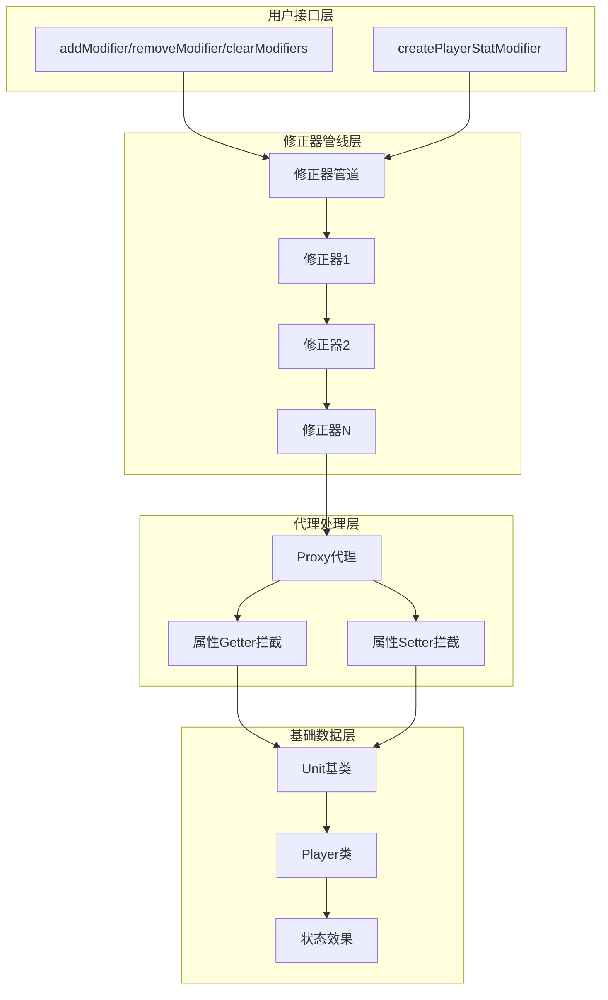
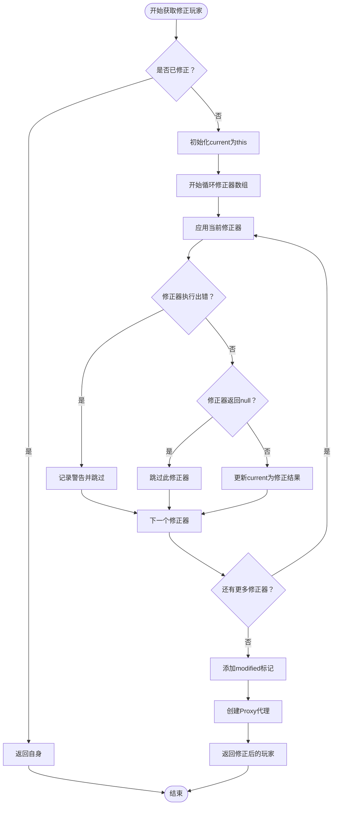
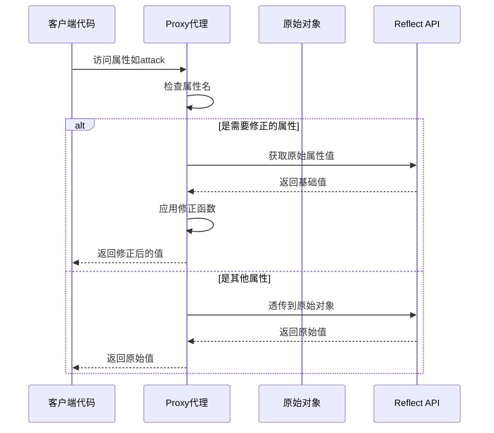
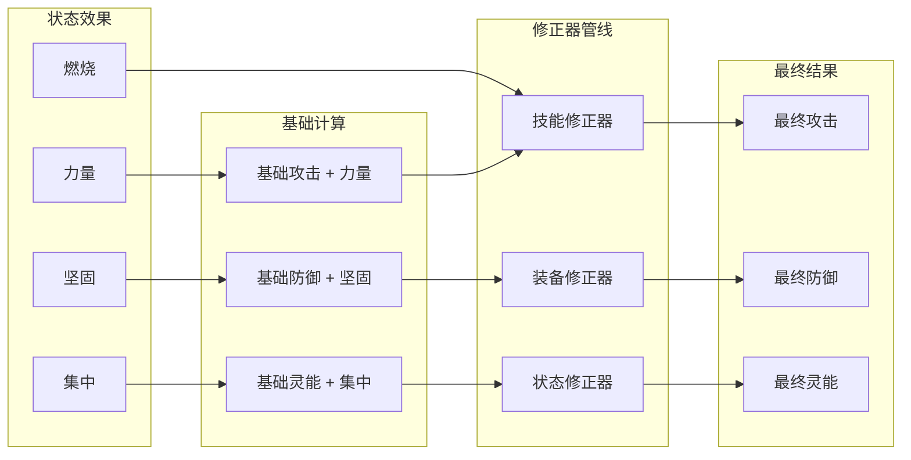

# 属性修正器管线系统

<cite>
**本文档引用的文件**
- [player.js](file://src/data/player.js)
- [unit.js](file://src/data/unit.js)
- [effectProcessor.js](file://src/data/effectProcessor.js)
- [matialArts.js](file://src/data/skills/deprecated/matialArts.js)
- [martialArtPose.js](file://src/data/skills/martial_arts/martialArtPose.js)
- [testSkill.js](file://src/data/testSkill.js)
</cite>

## 目录
1. [简介](#简介)
2. [系统架构概览](#系统架构概览)
3. [核心组件分析](#核心组件分析)
4. [属性修正器管线详解](#属性修正器管线详解)
5. [工厂函数与API设计](#工厂函数与api设计)
6. [Proxy代理机制](#proxy代理机制)
7. [状态效果集成](#状态效果集成)
8. [实际应用案例](#实际应用案例)
9. [性能优化与最佳实践](#性能优化与最佳实践)
10. [故障排除指南](#故障排除指南)
11. [总结](#总结)

## 简介

属性修正器管线系统是游戏引擎中的核心组件，负责管理玩家属性的动态修正机制。该系统采用函数式管道设计模式，通过一系列可组合的修正器函数来实现属性的动态计算和覆盖。系统支持实时的状态效果注入、属性修正链的执行以及Proxy代理机制的巧妙运用，为游戏提供了灵活且高性能的属性管理系统。

## 系统架构概览

属性修正器管线系统采用了分层架构设计，主要包含以下几个层次：



**图表来源**
- [player.js](file://src/data/player.js#L117-L163)
- [unit.js](file://src/data/unit.js#L1-L50)

## 核心组件分析

### Player类与Unit基类

Player类继承自Unit基类，实现了完整的属性修正器系统：

```javascript
// 玩家数据类
export class Player extends Unit {
  constructor() {
    super();
    // 属性修正器管线（按顺序应用）
    this.modifiers = [];
    this.modified = false;
  }
  
  // 属性修正系统 API
  addModifier(modifierFn) {
    if (typeof modifierFn === 'function') this.modifiers.push(modifierFn);
    else console.warn('尝试添加非法的属性修正器：', modifierFn, '应为 function(player)=>player');
  }
  removeModifier(modifierFn) {
    this.modifiers = this.modifiers.filter(m => m !== modifierFn);
  }
  clearModifiers() {
    this.modifiers = [];
  }
}
```

### Unit基类的属性计算

Unit基类定义了标准的属性计算逻辑：

```javascript
// 计算属性（默认规则）
get attack() {
  return this.baseAttack + (this.effects['力量'] || 0);
}

get defense() {
  return this.baseDefense + (this.effects['坚固'] || 0);
}

get magic() {
  return this.baseMagic + (this.effects['集中'] || 0);
}
```

**章节来源**
- [player.js](file://src/data/player.js#L75-L117)
- [unit.js](file://src/data/unit.js#L25-L35)

## 属性修正器管线详解

### 管线执行流程

属性修正器管线的核心执行逻辑位于`getModifiedPlayer`方法中：



**图表来源**
- [player.js](file://src/data/player.js#L163-L190)

### 管线特性分析

1. **顺序执行**：修正器按照添加顺序依次执行
2. **错误容错**：单个修正器的错误不会影响整个管线
3. **空值处理**：修正器可以返回null以跳过特定属性的修正
4. **重复优化**：已修正的玩家对象会缓存modified标志，避免重复计算

**章节来源**
- [player.js](file://src/data/player.js#L163-L190)

## 工厂函数与API设计

### createPlayerStatModifier工厂函数

工厂函数提供了便捷的方式来创建叠加型属性修正器：

```javascript
// 为属性修正系统提供一个便捷的工厂：创建一个“叠加型”的玩家属性修正器
// - 接受一个包含 attack/defense/magic 修正函数的对象
// - 每个函数形如 (baseValue, currentPlayer) => number
// - 返回一个 (player) => wrappedPlayer 的修正器
export function createPlayerStatModifier({ attack, defense, magic } = {}) {
  return function(player) {
    // 仅覆盖需要的 getter；不改变 hp/effects 等引用
    return new Proxy(player, {
      // 仅覆盖需要修改的只读属性，其他全部透传
      get(target, prop, receiver) {
        if (prop === 'attack') {
          const base = Reflect.get(target, 'attack', receiver);
          return typeof attack === 'function' ? attack(base, receiver) : base;
        }
        if (prop === 'defense') {
          const base = Reflect.get(target, 'defense', receiver);
          return typeof defense === 'function' ? defense(base, receiver) : base;
        }
        if (prop === 'magic') {
          const base = Reflect.get(target, 'magic', receiver);
          return typeof magic === 'function' ? magic(base, receiver) : base;
        }
        return Reflect.get(target, prop, receiver);
      }
      // 不提供 set 拦截，保持写入直达底层对象（hp/effects 数据链接不变）
    });
  }
}
```

### API使用场景

1. **简单叠加修正**：
```javascript
const modifier = createPlayerStatModifier({
  attack: (base, player) => base + 5,
  defense: (base, player) => base + 3
});
player.addModifier(modifier);
```

2. **条件修正**：
```javascript
const modifier = createPlayerStatModifier({
  attack: (base, player) => {
    return player.effects['力量'] > 0 ? base + player.effects['力量'] : base;
  }
});
```

3. **复合修正**：
```javascript
const modifier = createPlayerStatModifier({
  attack: (base, player) => {
    let result = base;
    if (player.effects['力量'] > 0) result += player.effects['力量'];
    if (player.effects['暴怒'] > 0) result += 10;
    return result;
  }
});
```

**章节来源**
- [player.js](file://src/data/player.js#L36-L63)

## Proxy代理机制

### Proxy的工作原理

属性修正器系统巧妙地利用了JavaScript的Proxy机制来实现属性的动态覆盖：



**图表来源**
- [player.js](file://src/data/player.js#L36-L63)

### 动态覆盖策略

系统只对特定的只读计算属性进行动态覆盖，包括：

- **attack**：攻击力修正
- **defense**：防御力修正  
- **magic**：灵能强度修正

其他属性如hp、effects、shield等保持原始引用不变，确保数据一致性。

### 性能考量

1. **延迟计算**：只有在访问属性时才进行修正计算
2. **缓存机制**：已修正的玩家对象缓存modified标志
3. **最小化代理**：只拦截必要的getter，避免不必要的性能开销

**章节来源**
- [player.js](file://src/data/player.js#L36-L63)
- [player.js](file://src/data/player.js#L163-L190)

## 状态效果集成

### effectProcessor的作用

effectProcessor模块负责处理各种状态效果的生效和判定逻辑，这些效果会自动注入到属性修正器管线中：

```javascript
// 处理回合开始时触发的效果
export function processStartOfTurnEffects(target) {
  // 处理吸热效果
  if (target.effects['吸热'] > 0) {
    const stacks = Math.min(target.effects['吸热'], target.effects['燃烧']);
    if (stacks > 0) {
      target.removeEffect('燃烧', stacks);
    }
  }
  
  // 处理燃烧效果
  if (target.effects['燃烧'] > 0) {
    let damage = target.effects['燃烧'];
    damage -= target.effects['火焰抗性'] || 0;
    target.addEffect('燃烧', -1);
    if(damage > 0) {
      dealDamage(null, target, damage);
    }
  }
  
  // 聚气效果
  if (target.effects['聚气'] > 0) {
    if (typeof target.gainMana === 'function') {
      target.gainMana(target.effects['聚气']);
    }
    target.addEffect('聚气', -target.effects['聚气']);
  }
}
```

### 效果与修正器的交互

状态效果通过effectProcessor自动修改玩家的基础属性，这些变化会通过修正器管线进行进一步处理：



**图表来源**
- [effectProcessor.js](file://src/data/effectProcessor.js#L10-L50)

**章节来源**
- [effectProcessor.js](file://src/data/effectProcessor.js#L1-L100)

## 实际应用案例

### 案例1：练家子技能修正器

```javascript
// 练家子（C-）
// 咏唱：1防御
export class PracticedBody extends Skill {
  constructor() {
    super('练家子', 'normal', 1, 0, 1, 1);
    this.baseColdDownTurns = 1;
    this.cardMode = 'chant';
    this.modifier_ = (player) => {
      const self = this;
      return new Proxy(player, {
        get(target, prop) {
          if (prop === 'defense') {
            return target.defense + 1; // 每次获取 defense 属性时，增加 1
          }
          return target[prop];
        }
      });
    };
  }
  
  onEnable(player) {
    super.onEnable(player);
    player.addModifier(this.modifier_);
  }
  
  onDisable(player, reason) {
    super.onDisable(player, reason);
    player.removeModifier(this.modifier_);
  }
}
```

### 案例2：武术姿态修正器

```javascript
// 武术准备（C+）（姿态）
// 攻击提升格挡+1
onEnable(player) {
  super.onEnable(player);
  if(this.multiplier > 0) {
    this.modifier_ = (player) => {
      const self = this;
      return new Proxy(player, {
        get(target, prop, receiver) {
          if (prop === 'attack') {
            return target.attack + (target.effects['格挡'] || 0) * self.multiplier;
          }
          return target[prop];
        }
      });
    };
    player.addModifier(this.modifier_);
  }
}
```

### 案例3：多重效果修正器

```javascript
// 小蛮牛功（C+）
// 咏唱：获得3力量，行动力上限-1
this.modifier_ = (player) => {
  const self = this;
  return new Proxy(player, {
    get(target, prop) {
      if (prop === 'attack') {
        return target.attack + 3; // 每次获取 attack 属性时，增加 3
      }
      if (prop === 'maxActionPoints') {
        return Math.max(target.maxActionPoints - 1, 0); // 每次获取 maxActionPoints 属性时，减少 1
      }
      return target[prop];
    }
  });
};
```

**章节来源**
- [matialArts.js](file://src/data/skills/deprecated/matialArts.js#L50-L80)
- [martialArtPose.js](file://src/data/skills/martial_arts/martialArtPose.js#L80-L120)
- [matialArts.js](file://src/data/skills/deprecated/matialArts.js#L265-L289)

## 性能优化与最佳实践

### 性能优化策略

1. **修正器缓存**：已修正的玩家对象缓存modified标志，避免重复计算
2. **条件检查**：在修正器内部进行条件检查，避免不必要的计算
3. **最小化代理范围**：只对必要的属性进行代理拦截
4. **错误隔离**：单个修正器的错误不影响整个管线的执行

### 最佳实践建议

1. **修正器设计原则**：
   ```javascript
   // 推荐：简单的条件判断
   const modifier = createPlayerStatModifier({
     attack: (base, player) => {
       if (player.effects['力量'] > 0) {
         return base + player.effects['力量'];
       }
       return base;
     }
   });
   
   // 避免：复杂的业务逻辑
   const badModifier = createPlayerStatModifier({
     attack: (base, player) => {
       // 这里不应该包含复杂的业务逻辑
       return base + calculateComplexBonus(player);
     }
   });
   ```

2. **修正器生命周期管理**：
   ```javascript
   // 正确的生命周期管理
   onEnable(player) {
     super.onEnable(player);
     this.modifier_ = createPlayerStatModifier({
       attack: (base, player) => base + 5
     });
     player.addModifier(this.modifier_);
   }
   
   onDisable(player, reason) {
     super.onDisable(player, reason);
     if (this.modifier_) {
       player.removeModifier(this.modifier_);
       this.modifier_ = null; // 清理引用
     }
   }
   ```

3. **错误处理**：
   ```javascript
   // 在修正器内部进行错误处理
   const safeModifier = createPlayerStatModifier({
     attack: (base, player) => {
       try {
         // 可能出错的计算
         return base + (player.effects['力量'] || 0);
       } catch (e) {
         console.error('修正器计算失败:', e);
         return base; // 返回基础值作为后备
       }
     }
   });
   ```

## 故障排除指南

### 常见问题与解决方案

1. **修正器未生效**
   - 检查修正器是否正确添加到modifiers数组
   - 确认修正器函数签名是否正确：`(player) => wrappedPlayer`
   - 验证getModifiedPlayer方法是否被调用

2. **性能问题**
   - 检查修正器是否包含复杂计算
   - 确保修正器返回null时不会导致无限循环
   - 使用浏览器开发者工具监控Proxy代理的性能

3. **内存泄漏**
   - 确保在onDisable中正确移除修正器
   - 检查是否有循环引用导致无法垃圾回收
   - 使用WeakMap等数据结构避免强引用

### 调试技巧

1. **修正器日志**：
```javascript
const debugModifier = createPlayerStatModifier({
  attack: (base, player) => {
    console.log('修正器计算:', { base, effects: player.effects });
    return base + (player.effects['力量'] || 0);
  }
});
```

2. **管线状态检查**：
```javascript
// 检查修正器管线状态
console.log('当前修正器数量:', player.modifiers.length);
console.log('修正器列表:', player.modifiers);
```

3. **Proxy代理验证**：
```javascript
// 验证代理是否正确创建
const modifiedPlayer = player.getModifiedPlayer();
console.log('是否为代理对象:', modifiedPlayer instanceof Proxy);
console.log('修正后的攻击:', modifiedPlayer.attack);
```

## 总结

属性修正器管线系统是一个精心设计的函数式管道架构，它成功地解决了游戏开发中属性动态修正的需求。通过以下关键特性，该系统实现了高效、灵活且可维护的属性管理：

### 核心优势

1. **函数式管道设计**：支持修正器的组合和复用
2. **Proxy代理机制**：实现透明的属性覆盖而不影响原始数据
3. **错误容错机制**：单个修正器的错误不会影响整个系统
4. **性能优化**：通过缓存和延迟计算提升性能
5. **生命周期管理**：完善的启用/禁用机制

### 设计模式应用

- **装饰器模式**：通过修正器装饰基础属性计算
- **责任链模式**：多个修正器按顺序执行
- **代理模式**：透明地覆盖特定属性
- **工厂模式**：createPlayerStatModifier简化修正器创建

### 扩展性考虑

该系统具有良好的扩展性，可以通过以下方式进一步增强：

1. **修正器优先级**：支持设置修正器的执行优先级
2. **条件修正器**：根据特定条件决定是否应用修正
3. **批量修正器**：同时修正多个属性的复合修正器
4. **异步修正器**：支持异步计算的修正器

属性修正器管线系统为游戏引擎提供了强大而灵活的属性管理能力，是现代游戏开发中值得借鉴的设计模式实例。