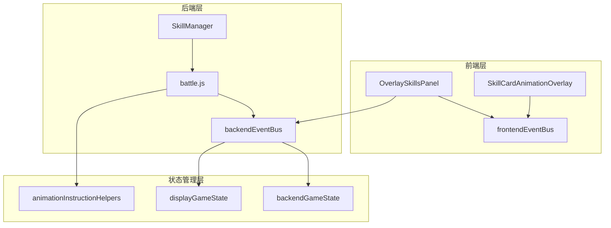
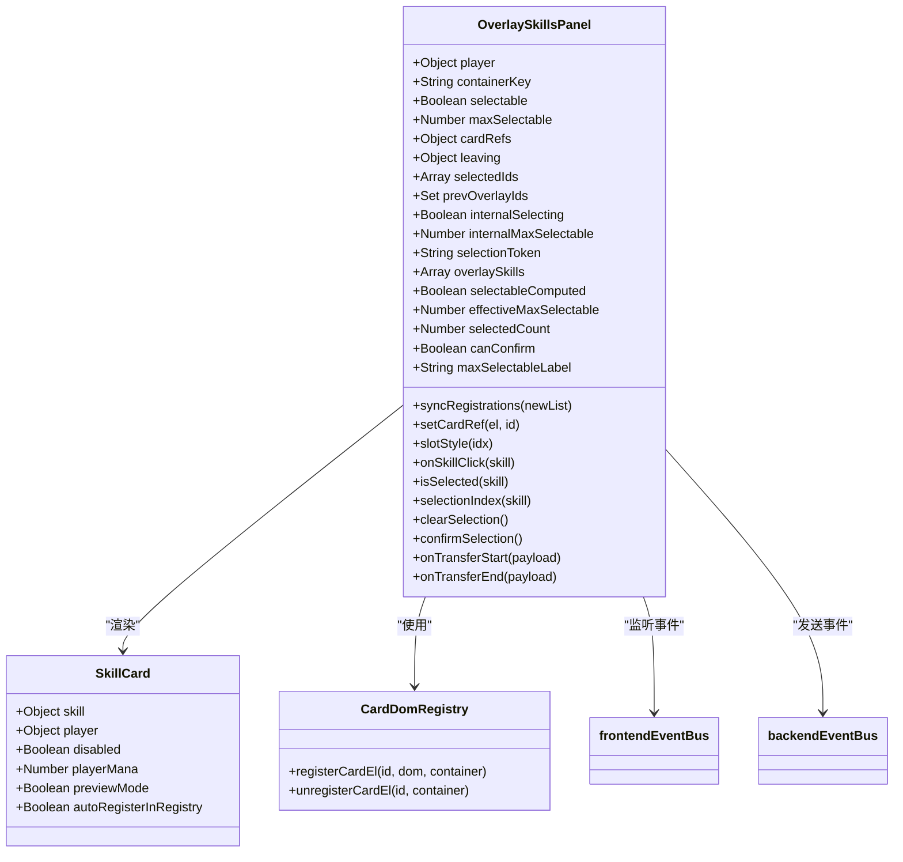
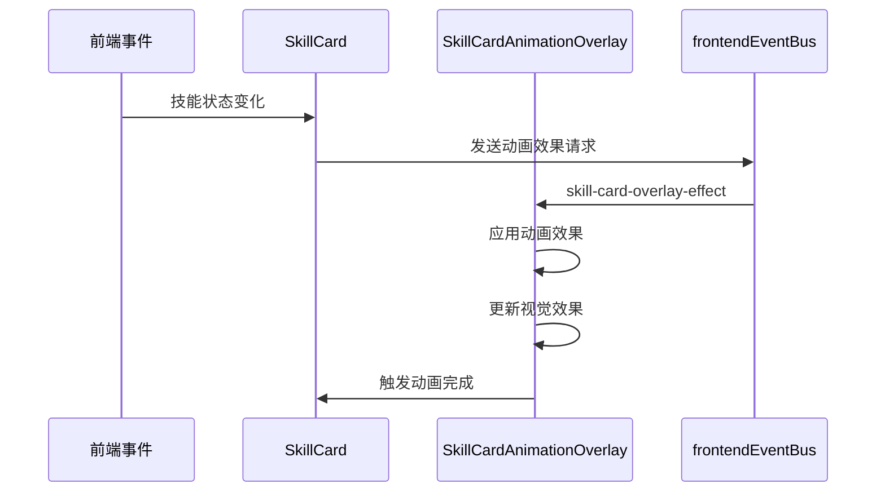
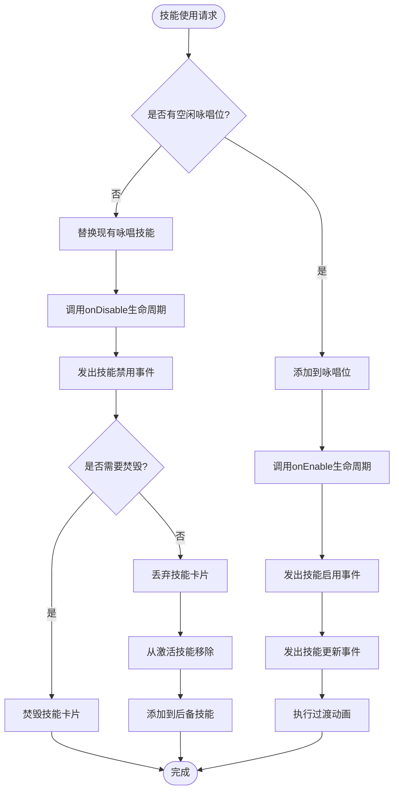
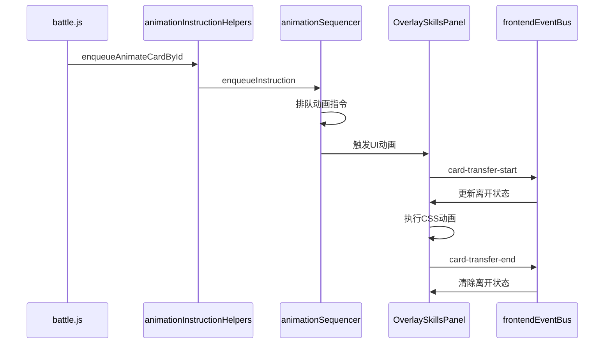
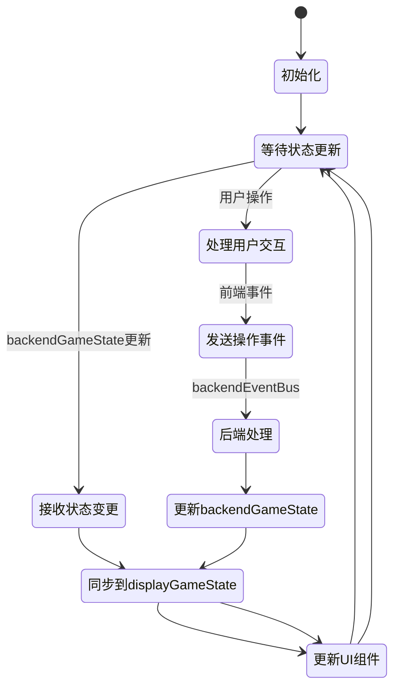

# 咏唱位系统

<cite>
**本文档引用的文件**
- [OverlaySkillsPanel.vue](file://src/components/battle/OverlaySkillsPanel.vue)
- [SkillCardAnimationOverlay.vue](file://src/components/global/SkillCardAnimationOverlay.vue)
- [skillManager.js](file://src/data/skillManager.js)
- [battle.js](file://src/data/battle.js)
- [gameState.js](file://src/data/gameState.js)
- [backendEventBus.js](file://src/backendEventBus.js)
- [frontendEventBus.js](file://src/frontendEventBus.js)
- [animationInstructionHelpers.js](file://src/data/animationInstructionHelpers.js)
</cite>

## 目录
1. [简介](#简介)
2. [系统架构概览](#系统架构概览)
3. [核心组件分析](#核心组件分析)
4. [技能激活与移除机制](#技能激活与移除机制)
5. [动画系统集成](#动画系统集成)
6. [事件总线同步机制](#事件总线同步机制)
7. [状态管理与同步](#状态管理与同步)
8. [性能考虑](#性能考虑)
9. [故障排除指南](#故障排除指南)
10. [总结](#总结)

## 简介

咏唱位系统（OverlaySkills）是Rune Tale Virtual Library游戏中的一个关键UI组件，专门设计用于展示临时技能状态和提供视觉反馈。该系统作为技能升级、能力触发或状态变化时的重要视觉展示区域，在UI动画中发挥着特殊作用。

咏唱位系统的核心功能包括：
- **临时技能展示**：为正在咏唱的技能提供专用展示区域
- **视觉反馈**：通过动画效果展示技能状态变化
- **用户交互**：支持技能选择和确认操作
- **状态同步**：确保UI与游戏状态的一致性

## 系统架构概览

咏唱位系统采用分层架构设计，通过事件总线实现前后端分离，确保状态同步和动画流畅性。



**图表来源**
- [OverlaySkillsPanel.vue](file://src/components/battle/OverlaySkillsPanel.vue#L1-L273)
- [SkillCardAnimationOverlay.vue](file://src/components/global/SkillCardAnimationOverlay.vue#L1-L163)
- [backendEventBus.js](file://src/backendEventBus.js#L1-L78)

## 核心组件分析

### OverlaySkillsPanel 组件

OverlaySkillsPanel是咏唱位系统的核心组件，负责管理和渲染咏唱位中的技能卡片。



**图表来源**
- [OverlaySkillsPanel.vue](file://src/components/battle/OverlaySkillsPanel.vue#L25-L100)

组件的主要特性：

1. **动态布局计算**：根据技能数量自动调整卡片位置
2. **选择模式支持**：支持单选和多选模式
3. **状态同步**：实时同步玩家的咏唱位状态
4. **动画集成**：与动画系统无缝集成

**章节来源**
- [OverlaySkillsPanel.vue](file://src/components/battle/OverlaySkillsPanel.vue#L1-L273)

### SkillCardAnimationOverlay 组件

SkillCardAnimationOverlay负责为技能卡片提供各种动画效果，包括冷却动画和升级闪光。



**图表来源**
- [SkillCardAnimationOverlay.vue](file://src/components/global/SkillCardAnimationOverlay.vue#L1-L163)

组件支持的动画效果：

1. **冷却动画**：根据冷却时间显示不同颜色的脉冲效果
2. **升级闪光**：技能升级时的高亮效果
3. **状态指示**：通过视觉效果传达技能状态

**章节来源**
- [SkillCardAnimationOverlay.vue](file://src/components/global/SkillCardAnimationOverlay.vue#L1-L163)

## 技能激活与移除机制

咏唱位系统与SkillManager紧密协作，实现技能的激活、移除和状态更新。



**图表来源**
- [battle.js](file://src/data/battle.js#L227-L255)

技能激活流程的关键步骤：

1. **状态检查**：验证是否有空闲的咏唱位
2. **替换逻辑**：如果有现有技能，执行替换逻辑
3. **生命周期回调**：调用技能的生命周期方法
4. **事件广播**：向事件总线广播状态变化
5. **动画执行**：播放技能转移的动画效果

**章节来源**
- [battle.js](file://src/data/battle.js#L227-L255)

## 动画系统集成

咏唱位系统深度集成到游戏的动画系统中，通过动画指令序列器实现复杂的动画编排。



**图表来源**
- [animationInstructionHelpers.js](file://src/data/animationInstructionHelpers.js#L218-L261)

动画系统的核心特性：

1. **指令队列**：通过动画序列器管理复杂的动画序列
2. **状态同步**：确保动画与游戏状态同步
3. **事件驱动**：基于事件触发动画执行
4. **性能优化**：智能的动画调度和资源管理

**章节来源**
- [animationInstructionHelpers.js](file://src/data/animationInstructionHelpers.js#L1-L402)

## 事件总线同步机制

咏唱位系统依赖于前后端分离的事件总线架构，确保UI与游戏状态的一致性。

```mermaid
graph LR
subgraph "前端事件流"
FEB[frontendEventBus] --> OSP[OverlaySkillsPanel]
FEB --> SCAO[SkillCardAnimationOverlay]
FEB --> CardTrans[卡片传输事件]
end
subgraph "后端事件流"
BEB[backendEventBus] --> BGS[backendGameState]
BEB --> DGS[displayGameState]
BEB --> AIH[animationInstructionHelpers]
end
subgraph "状态同步"
BGS < --> DGS
DGS < --> OSP
AIH < --> OSP
end
```

**图表来源**
- [backendEventBus.js](file://src/backendEventBus.js#L1-L78)
- [frontendEventBus.js](file://src/frontendEventBus.js#L1-L9)

事件总线的职责分工：

1. **frontendEventBus**：负责前端组件间的通信和动画控制
2. **backendEventBus**：负责游戏状态变更和业务逻辑处理
3. **状态同步**：通过displayGameState和backendGameState实现双层状态管理

**章节来源**
- [backendEventBus.js](file://src/backendEventBus.js#L1-L78)
- [frontendEventBus.js](file://src/frontendEventBus.js#L1-L9)

## 状态管理与同步

咏唱位系统采用双层状态管理模式，确保UI与游戏状态的精确同步。



状态同步的关键机制：

1. **响应式状态**：使用Vue的reactive系统实现状态响应
2. **深度监听**：watch函数监控状态变化
3. **批量更新**：通过enqueueState批量处理状态同步
4. **错误恢复**：完善的异常处理和状态恢复机制

**章节来源**
- [gameState.js](file://src/data/gameState.js#L1-L75)
- [animationInstructionHelpers.js](file://src/data/animationInstructionHelpers.js#L182-L222)

## 性能考虑

咏唱位系统在设计时充分考虑了性能优化，采用了多种策略确保流畅的游戏体验。

### 优化策略

1. **懒加载**：技能卡片按需渲染，减少初始加载时间
2. **DOM复用**：通过cardDomRegistry管理DOM元素的注册和注销
3. **动画优化**：使用CSS transforms和opacity实现硬件加速
4. **内存管理**：及时清理不再使用的DOM引用和事件监听器

### 性能监控

系统提供了多种性能监控机制：
- **渲染计时**：监控组件渲染时间
- **内存使用**：跟踪DOM元素和事件监听器数量
- **动画帧率**：确保动画达到60fps标准

## 故障排除指南

### 常见问题及解决方案

1. **咏唱位不显示**
   - 检查player.overlaySkills是否正确设置
   - 验证frontendEventBus的事件监听器是否正常工作
   - 确认CSS样式是否正确应用

2. **动画不流畅**
   - 检查是否有过多的DOM操作
   - 验证CSS transforms是否正确使用
   - 确认动画指令队列是否阻塞

3. **状态不同步**
   - 检查backendGameState和displayGameState的同步机制
   - 验证事件总线的事件传播路径
   - 确认状态更新的时机和顺序

### 调试工具

系统提供了丰富的调试工具：
- **状态检查器**：查看当前游戏状态
- **事件日志**：记录所有事件的传播过程
- **性能分析器**：监控组件性能指标

**章节来源**
- [OverlaySkillsPanel.vue](file://src/components/battle/OverlaySkillsPanel.vue#L121-L162)

## 总结

咏唱位系统是Rune Tale Virtual Library游戏中一个精心设计的UI组件，它成功地实现了以下目标：

### 系统优势

1. **用户体验**：提供直观的技能状态展示和流畅的动画效果
2. **技术架构**：采用前后端分离的事件总线架构，确保系统的可维护性和扩展性
3. **性能表现**：通过多种优化策略确保良好的性能表现
4. **状态一致性**：通过双层状态管理和动画指令系统确保UI与游戏状态的一致性

### 设计亮点

- **模块化设计**：清晰的组件边界和职责划分
- **事件驱动**：基于事件的松耦合架构
- **动画集成**：深度集成的动画系统
- **状态管理**：完善的双层状态管理机制

### 未来改进方向

1. **性能优化**：进一步优化大型技能列表的渲染性能
2. **动画扩展**：增加更多类型的动画效果
3. **交互增强**：改进用户交互体验
4. **可访问性**：提高系统的可访问性支持

咏唱位系统展现了现代Web游戏开发中UI组件设计的最佳实践，为玩家提供了优秀的视觉体验和流畅的操作感受。