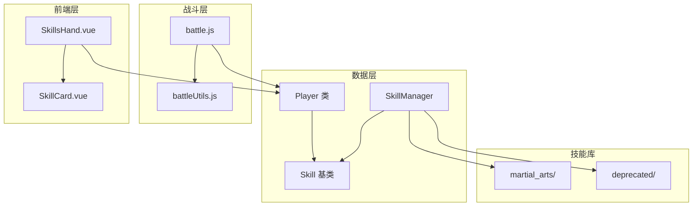
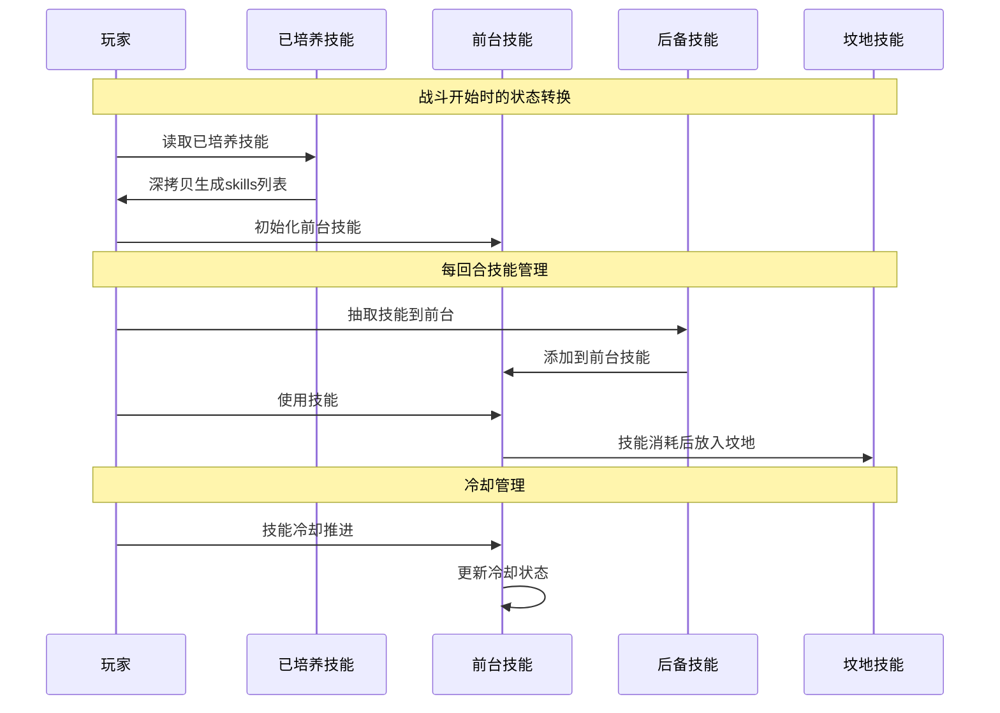
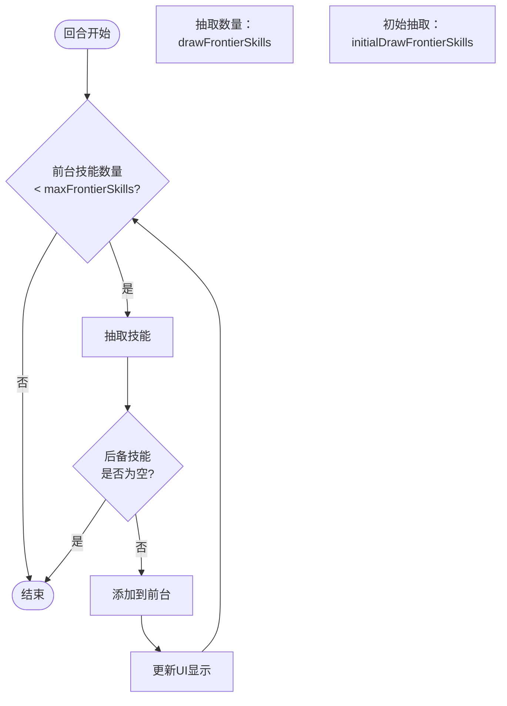
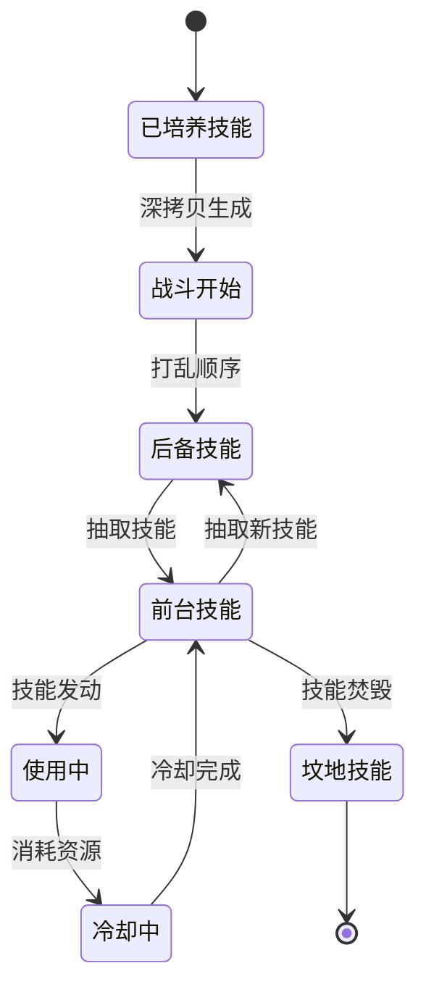
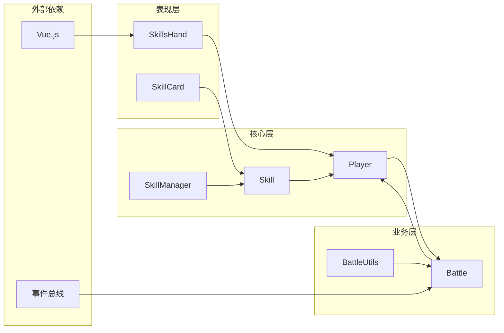

# 技能槽位管理

<cite>
**本文档中引用的文件**
- [player.js](file://src/data/player.js)
- [skillManager.js](file://src/data/skillManager.js)
- [skill.js](file://src/data/skill.js)
- [battle.js](file://src/data/battle.js)
- [battleUtils.js](file://src/data/battleUtils.js)
- [agilePunch.js](file://src/data/skills/martial_arts/agilePunch.js)
- [SkillsHand.vue](file://src/components/battle/SkillsHand.vue)
- [speedThinking.js](file://src/data/skills/deprecated/speedThinking.js)
- [cMinus.js](file://src/data/skills/deprecated/cMinus.js)
</cite>

## 目录
1. [简介](#简介)
2. [项目结构概览](#项目结构概览)
3. [核心组件分析](#核心组件分析)
4. [架构概览](#架构概览)
5. [详细组件分析](#详细组件分析)
6. [依赖关系分析](#依赖关系分析)
7. [性能考虑](#性能考虑)
8. [故障排除指南](#故障排除指南)
9. [结论](#结论)

## 简介

本文档详细阐述了游戏中的技能槽位管理系统，该系统采用三层架构设计：已培养技能（cultivatedSkills）、前台技能（frontierSkills）与后备技能（backupSkills）。这种设计实现了技能状态的隔离、动态管理和高效的战斗资源分配。

技能槽位管理系统的核心目标是在战斗开始时确保状态隔离，通过深拷贝机制从已培养技能生成战斗技能列表，并在每回合智能抽取前台技能以维持游戏平衡性和策略深度。

## 项目结构概览

技能槽位管理系统分布在多个关键文件中，形成了完整的技能生命周期管理体系：



**图表来源**
- [player.js](file://src/data/player.js#L1-L226)
- [skillManager.js](file://src/data/skillManager.js#L1-L253)
- [battle.js](file://src/data/battle.js#L1-L553)

## 核心组件分析

### 玩家类（Player）

玩家类是技能槽位管理的核心实体，定义了三个主要的技能槽位：

```javascript
// 已培养技能：玩家拥有的总技能上限与顺序
this.maxSkills = 20; // 玩家拥有的总技能上限
this.cultivatedSkills = []; // 已培养技能（顺序即为战斗中的默认顺序）

// 场上技能与战斗列表
this.skills = []; // 初始场上技能。在战斗开始前由 cultivatedSkills 深拷贝生成，在战斗结束后清空。
this.frontierSkills = []; // 前台技能列表，玩家在当前回合可以使用的技能
this.backupSkills = []; // 后备技能列表，用于存储暂时不可用的技能
this.burntSkills = []; // 坟地技能列表，存放被焚毁的技能（战斗中完全消耗掉的技能）

// 技能抽卡配置
this.maxFrontierSkills = 10; // 最大前台技能数量
this.initialDrawFrontierSkills = 2; // 战斗开始时，额外抽取前台技能数量
this.drawFrontierSkills = 3; // 每回合抽取前台技能数量
```

**章节来源**
- [player.js](file://src/data/player.js#L60-L85)

### 技能管理器（SkillManager）

技能管理器负责技能的注册、创建和随机生成：

```javascript
// 注册技能
registerSkill(SkillClass) {
  const skillName = (new SkillClass()).name;
  this.skillRegistry.set(skillName, SkillClass);
}

// 创建技能实例
createSkill(skillName) {
  const SkillClass = this.skillRegistry.get(skillName);
  if (SkillClass) {
    const obj = new SkillClass();
    obj.description = obj.regenerateDescription();
    return obj;
  }
  throw new Error(`Unknown skill: ${skillName}`);
}
```

**章节来源**
- [skillManager.js](file://src/data/skillManager.js#L8-L102)

## 架构概览

技能槽位管理系统采用三层架构，实现了清晰的数据分离和状态管理：



**图表来源**
- [battle.js](file://src/data/battle.js#L50-L80)
- [battleUtils.js](file://src/data/battleUtils.js#L130-L180)

## 详细组件分析

### 战斗开始时的技能初始化

战斗开始时，系统执行以下关键步骤来确保状态隔离：

```javascript
// 从已培养技能深拷贝生成战斗技能列表
gameState.player.skills = gameState.player.cultivatedSkills
  .filter(skill => skill !== null)
  .map(skill => cloneSkill(skill));

// 初始化后台技能和前台技能
gameState.player.backupSkills = [...gameState.player.skills];
gameState.player.frontierSkills = [];
gameState.player.burntSkills = [];

// 打乱后备技能顺序
gameState.player.backupSkills.sort(() => Math.random() - 0.5);
```

这种深拷贝机制确保了战斗中的技能状态不会影响玩家的已培养技能，实现了真正的状态隔离。

**章节来源**
- [battle.js](file://src/data/battle.js#L50-L80)

### 前台技能抽取机制

系统实现了智能的前台技能抽取机制，支持不同的抽取策略：



**图表来源**
- [battle.js](file://src/data/battle.js#L120-L150)
- [battleUtils.js](file://src/data/battleUtils.js#L130-L180)

### 技能冷却系统

技能冷却系统实现了复杂的冷却状态管理：

```javascript
// 技能冷却推进
coldDown(deltaStacks = 1) {
  if (this.coldDownTurns !== 0) {
    if (this.remainingUses !== this.maxUses) {
      this.remainingColdDownTurns = Math.max(
        this.remainingColdDownTurns - deltaStacks, 0
      );
      
      let charged = false;
      if (this.remainingColdDownTurns <= 0) {
        this.remainingColdDownTurns = this.coldDownTurns;
        this.remainingUses = Math.min(
          this.remainingUses + 1, this.maxUses
        );
        charged = true;
      }
      
      // 发送冷却状态变化事件
      this._emitCooldownTick(deltaStacks);
    }
  }
}
```

**章节来源**
- [skill.js](file://src/data/skill.js#L100-L130)

### 技能在槽位间的转移

技能在不同槽位间的转移遵循严格的规则和时机：



**图表来源**
- [battle.js](file://src/data/battle.js#L50-L80)
- [battleUtils.js](file://src/data/battleUtils.js#L130-L180)

### 前端技能显示组件

前端组件负责实时显示技能状态和交互：

```javascript
// SkillsHand.vue 中的技能布局计算
layout() {
  const n = this.visibleSkills.length;
  const containerWidth = Math.max(0, this.containerWidth || 0);
  const cardWidth = Math.max(1, this.cardWidth || 198);
  
  // 计算基础间距，使总宽度适配容器
  let baseGap;
  if (n === 1) {
    baseGap = 0;
  } else {
    baseGap = (containerWidth - n * cardWidth - extraSum) / (n - 1);
    baseGap = clamp(baseGap, MIN_GAP, DEFAULT_GAP);
  }
  
  return out;
}
```

**章节来源**
- [SkillsHand.vue](file://src/components/battle/SkillsHand.vue#L80-L150)

## 依赖关系分析

技能槽位管理系统的依赖关系体现了清晰的分层架构：



**图表来源**
- [player.js](file://src/data/player.js#L1-L10)
- [skillManager.js](file://src/data/skillManager.js#L1-L10)
- [battle.js](file://src/data/battle.js#L1-L20)

**章节来源**
- [player.js](file://src/data/player.js#L1-L226)
- [skillManager.js](file://src/data/skillManager.js#L1-L253)
- [battle.js](file://src/data/battle.js#L1-L553)

## 性能考虑

技能槽位管理系统在设计时充分考虑了性能优化：

### 内存管理
- 使用深拷贝确保状态隔离，避免意外的状态污染
- 合理的技能数量限制（maxSkills = 20）防止内存溢出
- 坟地技能管理减少不必要的对象保留

### 渲染优化
- 前端组件使用虚拟滚动和懒加载技术
- 技能卡片动画采用CSS变换而非重排
- 实时更新UI时使用防抖机制

### 算法效率
- 技能查找使用Map数据结构，O(1)复杂度
- 技能排序使用原生sort方法，性能最优
- 冷却计算采用增量更新，避免全量扫描

## 故障排除指南

### 常见状态同步问题

**问题：技能状态不一致**
- **原因**：深拷贝过程中对象引用丢失
- **解决方案**：检查cloneSkill函数的实现，确保完整复制所有属性

**问题：技能冷却异常**
- **原因**：冷却计数器更新时机错误
- **解决方案**：验证coldDown方法的调用时机，确保在正确的游戏阶段执行

**问题：技能抽卡动画错乱**
- **原因**：前端事件处理顺序错误
- **解决方案**：检查动画序列的排队机制，确保按正确顺序执行

### 调试技巧

1. **状态追踪**：在关键节点添加console.log输出技能状态
2. **事件监控**：使用浏览器开发者工具监控事件总线消息
3. **性能分析**：使用Chrome DevTools Profile功能分析性能瓶颈

**章节来源**
- [battle.js](file://src/data/battle.js#L50-L80)
- [battleUtils.js](file://src/data/battleUtils.js#L130-L180)

## 结论

技能槽位管理系统通过三层架构设计实现了高效、稳定的游戏技能管理。该系统的核心优势包括：

1. **状态隔离**：深拷贝机制确保战斗状态不影响玩家数据
2. **灵活管理**：支持动态技能抽取和冷却管理
3. **性能优化**：合理的数据结构和算法确保流畅的游戏体验
4. **扩展性强**：模块化设计便于添加新的技能类型和功能

通过深入理解这套系统的设计原理和实现细节，开发者可以更好地维护和扩展游戏功能，同时为玩家提供更加丰富和有趣的技能体验。