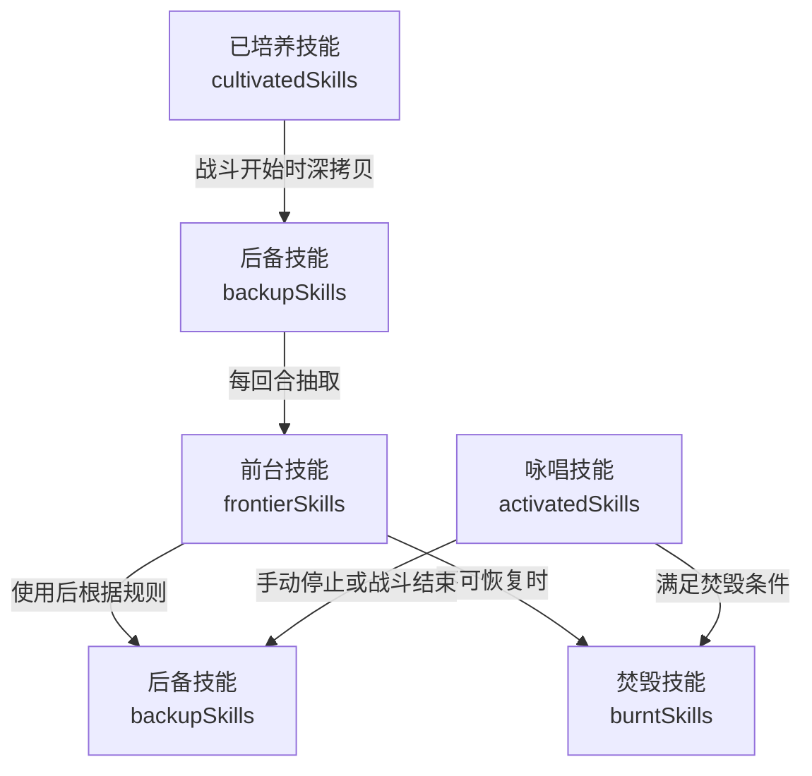
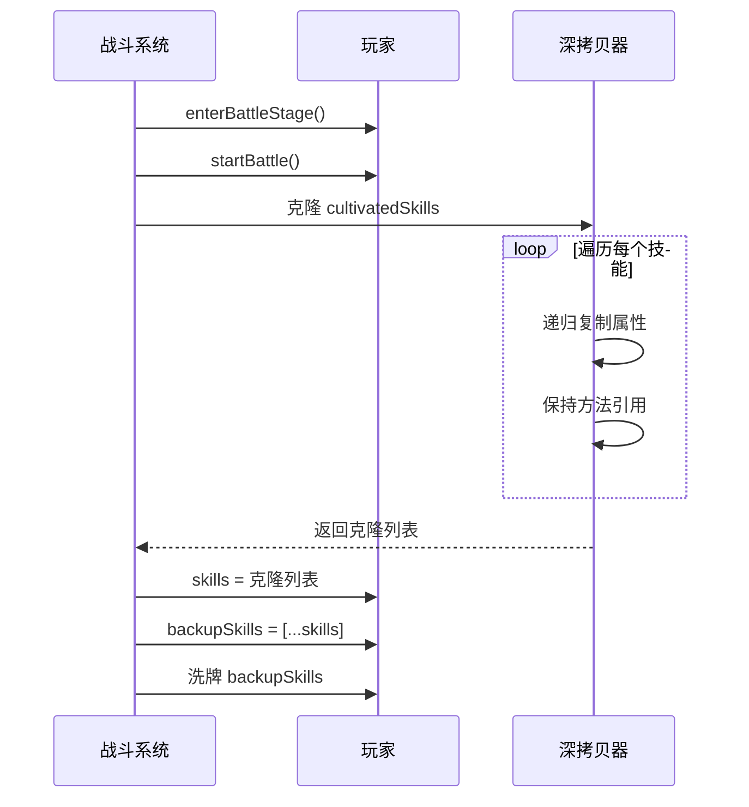
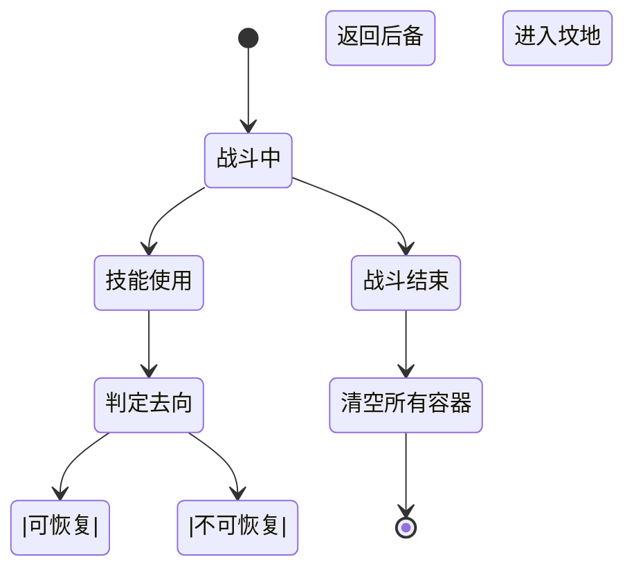

# 技能管理系统

<cite>
**本文档引用的文件**
- [player.js](file://src/data/player.js)
- [battle.js](file://src/data/battle.js)
- [battleUtils.js](file://src/data/battleUtils.js)
- [skillManager.js](file://src/data/skillManager.js)
- [skill.js](file://src/data/skill.js)
- [SkillCard.vue](file://src/components/SkillCard.vue)
- [OverlaySkillsPanel.vue](file://src/components/OverlaySkillsPanel.vue)
- [ActivatedSkillsBar.vue](file://src/components/ActivatedSkillsBar.vue)
- [BurntSkillsIcon.vue](file://src/components/BurntSkillsIcon.vue)
</cite>

## 目录
1. [引言](#引言)
2. [三层技能结构与数据流转](#三层技能结构与数据流转)
3. [战斗初始化与技能深拷贝机制](#战斗初始化与技能深拷贝机制)
4. [每回合技能抽取机制](#每回合技能抽取机制)
5. [burntSkills：技能“坟地”系统](#burntskills技能坟地系统)
6. [SkillManager：技能获取与管理流程](#skillmanager技能获取与管理流程)
7. [overlaySkills：UI动画中的特殊作用](#overlayskillsui动画中的特殊作用)
8. [技能容器状态同步问题与解决方案](#技能容器状态同步问题与解决方案)
9. [结论](#结论)

## 引言
本系统设计了一套复杂的技能管理架构，用于支持回合制战斗中的技能调度、状态管理和UI交互。核心机制围绕玩家的三层技能容器：已培养技能（cultivatedSkills）、前台技能（frontierSkills）与后备技能（backupSkills）展开，结合焚毁（burntSkills）、咏唱（activatedSkills）和覆盖（overlaySkills）等辅助容器，实现丰富的战斗策略与动态反馈。本文将深入剖析其数据流转、生命周期管理及潜在同步问题。

## 三层技能结构与数据流转
玩家技能系统采用分层容器架构，实现技能从长期持有到战斗使用的动态流转。



**图示来源**
- [player.js](file://src/data/player.js#L50-L75)
- [battle.js](file://src/data/battle.js#L100-L120)

**本节来源**
- [player.js](file://src/data/player.js#L50-L75)
- [battle.js](file://src/data/battle.js#L100-L120)

### 已培养技能（cultivatedSkills）
`cultivatedSkills` 是玩家在非战斗状态下通过升级、商店购买等方式长期持有的技能列表。它代表了玩家的“技能库”，其顺序在战斗中不直接使用，仅作为战斗初始化的源数据。

### 前台技能（frontierSkills）
`frontierSkills` 是当前回合玩家可以直接使用的技能列表，通常显示在UI的“手牌”区域。玩家在此区域选择并使用技能，是战斗交互的核心容器。

### 后备技能（backupSkills）
`backupSkills` 是一个类似“牌库”的容器，存储了当前未在前台的技能。它在战斗开始时由 `cultivatedSkills` 深拷贝生成，并经过洗牌处理。每回合通过 `drawSkillCard` 机制从 `backupSkills` 头部抽取技能填充 `frontierSkills`。

## 战斗初始化与技能深拷贝机制
战斗开始时，系统会从 `cultivatedSkills` 生成 `skills` 列表，这是一个深拷贝过程，确保战斗状态与全局状态隔离。



**图示来源**
- [battle.js](file://src/data/battle.js#L100-L115)
- [battle.js](file://src/data/battle.js#L500-L550)

**本节来源**
- [battle.js](file://src/data/battle.js#L100-L115)
- [battle.js](file://src/data/battle.js#L500-L550)

该深拷贝机制通过 `cloneSkill` 函数实现，它不仅复制基本属性，还递归处理对象和数组，同时保持方法的引用。这确保了战斗中技能的状态变化（如充能、剩余使用次数）不会影响到 `cultivatedSkills` 中的原始技能，实现了战斗状态的隔离。

## 每回合技能抽取机制
每回合的技能抽取由 `fillFrontierSkills` 函数控制，其数量由 `drawFrontierSkills` 属性决定。

```mermaid
flowchart TD
Start([回合开始]) --> Check["检查条件"]
Check --> |frontierSkills.length < maxFrontierSkills| Draw["抽取技能"]
Check --> |否则| End([结束])
Draw --> Calc["计算抽取数量"]
Calc --> |num = min(maxFrontierSkills - frontierSkills.length, drawFrontierSkills)| Select["从 backupSkills 头部取卡"]
Select --> Move["移动技能到 frontierSkills"]
Move --> Update["触发 FRONTIER_UPDATED 事件"]
Update --> End
```

**图示来源**
- [battle.js](file://src/data/battle.js#L450-L460)
- [battleUtils.js](file://src/data/battleUtils.js#L20-L50)

**本节来源**
- [battle.js](file://src/data/battle.js#L450-L460)
- [player.js](file://src/data/player.js#L70-L71)

抽取逻辑确保了 `frontierSkills` 的数量不会超过 `maxFrontierSkills`（默认10），并且每回合抽取的数量为 `drawFrontierSkills`（默认3）和剩余空间的较小值。这一机制保证了玩家每回合都有稳定的新技能可用，同时避免了手牌溢出。

## burntSkills：技能“坟地”系统
`burntSkills` 作为一个“坟地”容器，存放那些在战斗中被完全消耗、不可再返回后备牌库的技能。

### 用途
当一个技能被使用后，系统会根据 `willSkillBurn` 函数判断其去向：
- **返回后备**：如果技能有充能 (`coldDownTurns !== 0`)、无限使用 (`maxUses === Infinity`) 或剩余使用次数 (`remainingUses > 0`)，则将其“丢弃”回 `backupSkills` 尾部。
- **焚毁**：否则，该技能将被移入 `burntSkills`，意味着它在本场战斗中彻底消失。

### 清空时机
`burntSkills` 列表在战斗结束时被清空。`battleVictory` 函数在处理完胜利或失败逻辑后，会将 `frontierSkills`、`backupSkills` 和 `burntSkills` 全部重置为空数组。这确保了每场新战斗都是一个全新的开始。



**图示来源**
- [battleUtils.js](file://src/data/battleUtils.js#L305-L331)
- [battle.js](file://src/data/battle.js#L350-L370)

**本节来源**
- [battleUtils.js](file://src/data/battleUtils.js#L305-L331)
- [battle.js](file://src/data/battle.js#L350-L370)

## SkillManager：技能获取与管理流程
`SkillManager` 是技能系统的中枢，负责技能的注册、实例化和奖励生成。

### 技能获取
`getRandomSkills` 方法根据玩家的等级 (`playerTier`)、灵脉 (`leinoFactors`) 和已拥有技能，从所有可生成的技能中进行带权随机抽取。权重受技能等级、玩家灵脉匹配度和是否为升级技能 (`precessor`) 等因素影响。

### 技能移除
技能的移除主要通过 `dropSkillCard` 和 `burnSkillCard` 函数实现。`dropSkillCard` 用于将技能从一个容器移动到 `backupSkills`，而 `burnSkillCard` 则将其移入 `burntSkills`。

### 技能激活
技能的激活流程在 `useSkill` 函数中定义。它首先进行资源消耗，然后调用 `activateSkill` 执行技能效果。对于咏唱型技能 (`cardMode === 'chant'`)，会调用 `activateChantSkill` 将其移入 `activatedSkills` 容器。

**本节来源**
- [skillManager.js](file://src/data/skillManager.js#L1-L250)
- [battle.js](file://src/data/battle.js#L200-L250)
- [battleUtils.js](file://src/data/battleUtils.js#L1-L20)

## overlaySkills：UI动画中的特殊作用
`overlaySkills` 是一个特殊的临时容器，用于UI动画的显示。

### 用途
该容器不参与战斗逻辑，其主要作用是为新发现的技能或战斗中选择的奖励技能提供一个“来源”位置。在UI动画中，技能卡片会从 `overlaySkills` 的位置“飞出”到目标容器（如 `frontierSkills` 或 `cultivatedSkills`），从而实现平滑的视觉过渡。

### 实现
`OverlaySkillsPanel.vue` 组件会监听相关事件，将临时技能放入此容器。动画完成后，该技能会被移除，而真正的技能实例则被添加到逻辑容器中。这种设计将UI表现与游戏逻辑解耦，提高了系统的可维护性。

**本节来源**
- [player.js](file://src/data/player.js#L90-L92)
- [OverlaySkillsPanel.vue](file://src/components/OverlaySkillsPanel.vue)

## 技能容器状态同步问题与解决方案
由于系统存在多个技能容器和UI组件，状态同步是一个潜在问题。

### 潜在问题
1. **事件驱动延迟**：容器状态的变更通过 `backendEventBus.emit` 触发事件，UI组件通过监听事件来更新。如果事件处理不及时，可能导致UI显示与实际状态不符。
2. **深拷贝副作用**：虽然深拷贝隔离了状态，但如果克隆过程不彻底（如未正确处理嵌套对象），可能导致逻辑错误。
3. **并发操作**：在复杂的动画序列中，多个异步操作可能同时修改技能容器，导致竞态条件。

### 解决方案
1. **事件总线**：系统广泛使用 `backendEventBus` 来解耦状态变更与UI更新。例如，`FRONTIER_UPDATED` 事件确保所有监听组件（如 `SkillsHand.vue`）能同步更新。
2. **快照机制**：`captureSnapshot` 和 `enqueueState` 用于在关键状态变更时记录游戏状态，确保动画和逻辑的时序正确。
3. **唯一ID**：每个技能实例都有 `uniqueID`，确保在查找和操作时能精确定位，避免因引用丢失导致的错误。

**本节来源**
- [battle.js](file://src/data/battle.js#L20-L50)
- [backendEventBus.js](file://src/backendEventBus.js)
- [animationInstructionHelpers.js](file://src/data/animationInstructionHelpers.js)

## 结论
该技能管理系统通过精心设计的三层容器结构和事件驱动架构，实现了复杂而稳定的战斗逻辑。`cultivatedSkills` 作为源数据，`frontierSkills` 和 `backupSkills` 构成战斗循环，`burntSkills` 管理永久消耗的技能，而 `overlaySkills` 则服务于UI表现。`SkillManager` 提供了技能的全局管理，确保了游戏的可扩展性。尽管存在状态同步的挑战，但通过事件总线和快照机制，系统有效地维护了数据的一致性和用户体验的流畅性。