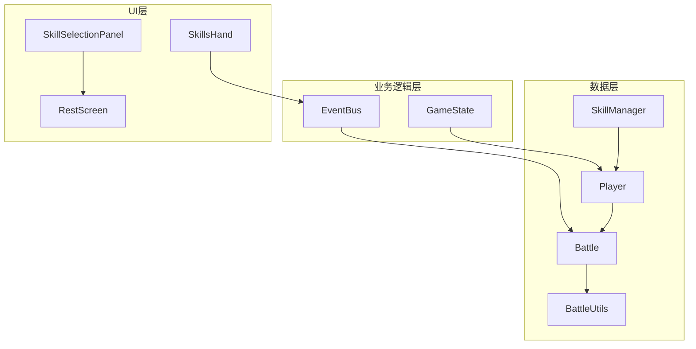
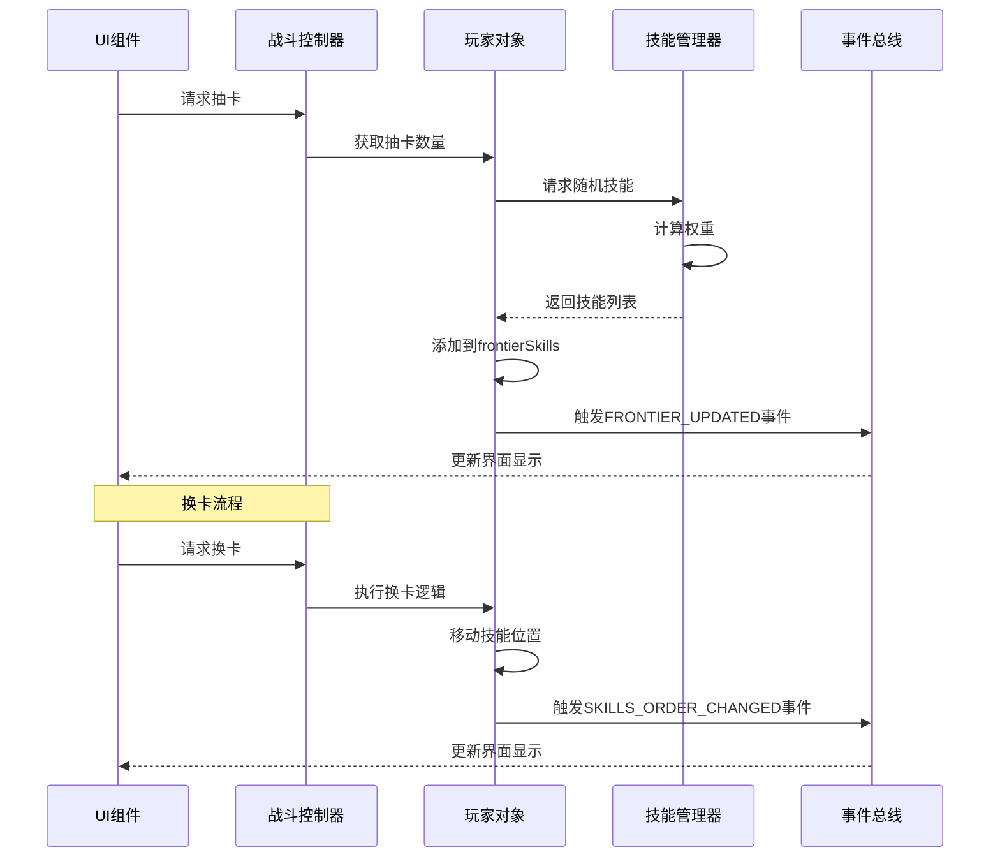
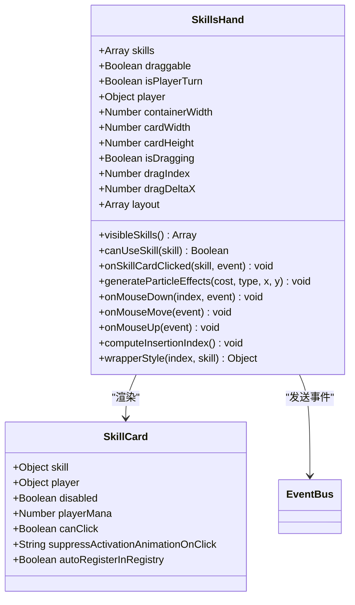
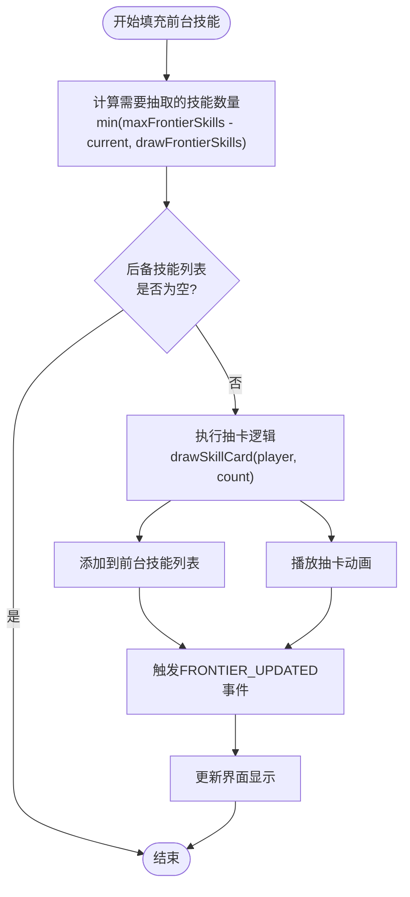
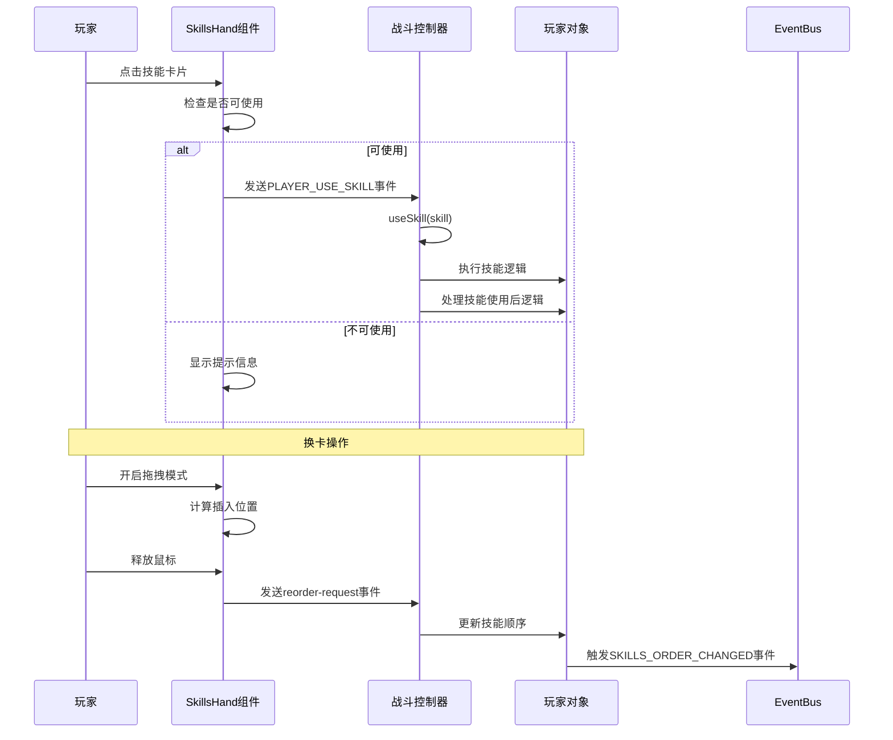
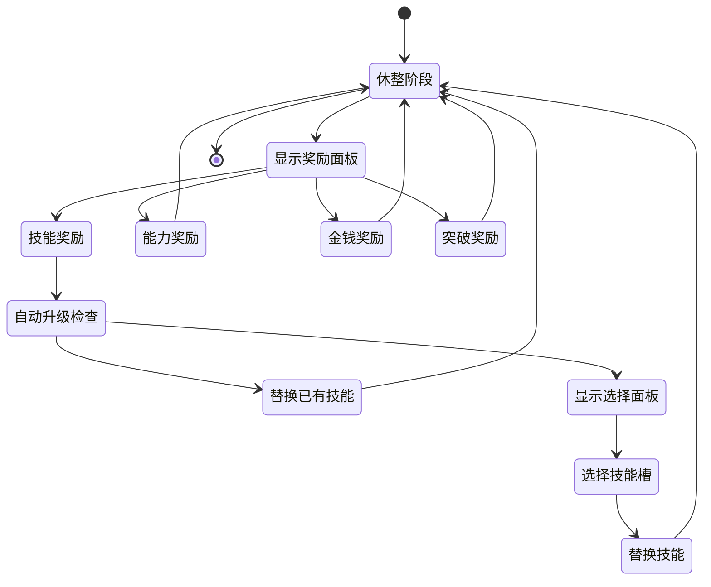
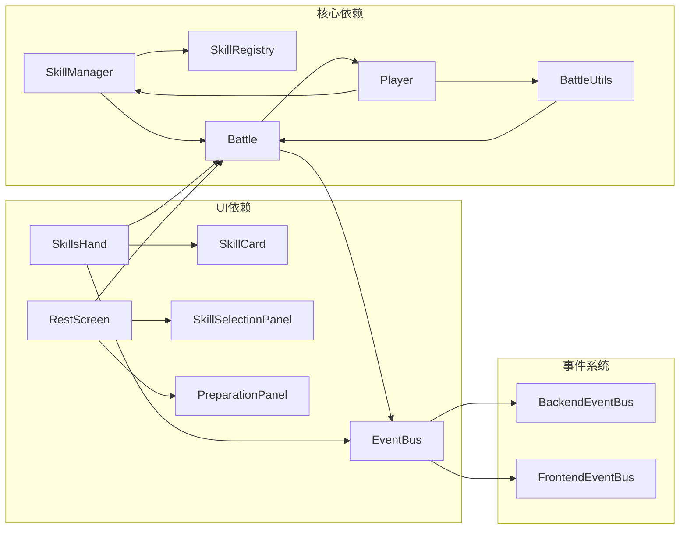

# 抽卡与换卡机制详细分析

<cite>
**本文档引用的文件**
- [src/data/skillManager.js](file://src/data/skillManager.js)
- [src/components/battle/SkillsHand.vue](file://src/components/battle/SkillsHand.vue)
- [src/components/rest/SkillSelectionPanel.vue](file://src/components/rest/SkillSelectionPanel.vue)
- [src/data/battle.js](file://src/data/battle.js)
- [src/data/battleUtils.js](file://src/data/battleUtils.js)
- [src/data/player.js](file://src/data/player.js)
- [src/components/rest/RestScreen.vue](file://src/components/rest/RestScreen.vue)
</cite>

## 目录
1. [简介](#简介)
2. [项目结构概览](#项目结构概览)
3. [核心组件分析](#核心组件分析)
4. [架构概览](#架构概览)
5. [详细组件分析](#详细组件分析)
6. [依赖关系分析](#依赖关系分析)
7. [性能考虑](#性能考虑)
8. [故障排除指南](#故障排除指南)
9. [结论](#结论)

## 简介

本文档深入分析了游戏中的抽卡机制（drawFrontierSkills）与换卡逻辑，重点探讨了frontierSkills作为可操作技能池的作用，以及每回合自动补充机制的触发条件和实现方式。同时分析了玩家在战斗中通过UI组件SkillsHand进行技能选择与使用的过程，并结合SkillSelectionPanel分析休整阶段技能替换的交互流程。此外还探讨了burntSkills作为'已用技能坟地'的清空时机（如战斗结束或特定能力触发），并讨论其对资源管理和策略深度的影响。

## 项目结构概览

游戏采用了分层架构设计，将技能管理、战斗逻辑和UI组件分离：



**图表来源**
- [src/data/skillManager.js](file://src/data/skillManager.js#L1-L253)
- [src/data/player.js](file://src/data/player.js#L1-L226)
- [src/data/battle.js](file://src/data/battle.js#L1-L553)

**章节来源**
- [src/data/skillManager.js](file://src/data/skillManager.js#L1-L253)
- [src/data/player.js](file://src/data/player.js#L1-L226)

## 核心组件分析

### SkillManager - 技能管理中心

SkillManager是整个技能系统的中枢，负责技能的注册、加载和随机抽取：

```javascript
// 技能注册机制
registerSkill(SkillClass) {
  const skillName = (new SkillClass()).name;
  this.skillRegistry.set(skillName, SkillClass);
}

// 随机技能抽取算法
getRandomSkills(count, playerLeino= {}, playerSkillSlots = [], playerTier = 0, bestQuality = false) {
  // 收集所有技能元数据
  const allSkills = Array.from(this.skillRegistry.entries()).map(([name, SkillClass]) => {
    const tempSkill = new SkillClass();
    return {
      name: name,
      type: tempSkill.type,
      series: tempSkill.skillSeriesName,
      tier: tempSkill.tier,
      spawnWeight: tempSkill.spawnWeight,
      precessor: tempSkill.precessor,
      leinoModifiers: tempSkill.leinoModifiers
    };
  });
  
  // 实现复杂的权重计算和抽选逻辑
  // 包括等级差异惩罚、灵脉耦合权重、前置技能检测等
}
```

### Player - 玩家数据模型

Player类定义了完整的技能管理结构：

```javascript
class Player extends Unit {
  constructor() {
    // 前台技能列表，玩家在当前回合可以使用的技能
    this.frontierSkills = [];
    
    // 后备技能列表，用于存储暂时不可用的技能
    this.backupSkills = [];
    
    // 坟地技能列表，存放被焚毁的技能（战斗中完全消耗掉的技能）
    this.burntSkills = [];
    
    // 最大前台技能数量
    this.maxFrontierSkills = 10;
    
    // 战斗开始时额外抽取前台技能数量
    this.initialDrawFrontierSkills = 2;
    
    // 每回合抽取前台技能数量
    this.drawFrontierSkills = 3;
  }
}
```

**章节来源**
- [src/data/skillManager.js](file://src/data/skillManager.js#L10-L253)
- [src/data/player.js](file://src/data/player.js#L50-L80)

## 架构概览

游戏的抽卡与换卡机制遵循事件驱动架构，通过多个层次协调工作：



**图表来源**
- [src/data/battle.js](file://src/data/battle.js#L400-L420)
- [src/data/battleUtils.js](file://src/data/battleUtils.js#L100-L150)

## 详细组件分析

### SkillsHand - 技能手牌组件

SkillsHand是玩家在战斗中直接操作的核心UI组件，实现了复杂的拖拽排序和视觉效果：



**图表来源**
- [src/components/battle/SkillsHand.vue](file://src/components/battle/SkillsHand.vue#L1-L100)

#### 拖拽排序机制

SkillsHand实现了精确的拖拽排序功能：

```javascript
// 拖拽开始
onMouseDown(idx, evt) {
  if (!this.draggable) return;
  if (evt.button !== 0) return; // 仅左键
  
  this.isDragging = true;
  this.dragIndex = idx;
  this.hoveredIndex = -1;
  this.dragStartX = evt.clientX;
  this.dragDeltaX = 0;
  this.draggedOriginalX = (this.layout[idx]?.x) || 0;
  this.computeInsertionIndex();
  this.attachDragListeners();
}

// 插槽位置计算
computeInsertionIndex() {
  const n = this.visibleSkills.length;
  const cw = Math.max(1, this.cardWidth || 198);
  if (n <= 1) { this.insertionIndex = 0; return; }

  // 使用"移除被拖拽卡后"的其他卡中心，基于拖拽中心决定插槽位置
  const centers = [];
  for (let i = 0; i < n; i++) {
    if (i === this.dragIndex) continue;
    const c = (this.layout[i]?.x || 0) + cw / 2;
    centers.push(c);
  }
  const draggedCenter = this.draggedOriginalX + this.dragDeltaX + cw / 2;
  let idx = 0;
  while (idx < centers.length && draggedCenter > centers[idx]) idx++;
  this.insertionIndex = idx; // 0..n-1 或 n（末尾）
}
```

### 抽卡机制实现

抽卡机制通过fillFrontierSkills函数实现每回合自动补充：



**图表来源**
- [src/data/battle.js](file://src/data/battle.js#L400-L420)
- [src/data/battleUtils.js](file://src/data/battleUtils.js#L100-L150)

#### 抽卡算法详解

```javascript
function fillFrontierSkills(player) {
  // 从后备技能列表头部取技能，直到前台技能数量达到最大值或抽取数达标
  const numCardsToDraw = Math.min(
    player.maxFrontierSkills - player.frontierSkills.length,
    player.drawFrontierSkills
  );
  drawSkillCard(player, numCardsToDraw);
  
  // 触发技能列表更新事件
  backendEventBus.emit(EventNames.Player.FRONTIER_UPDATED, {
    frontierSkills: player.frontierSkills,
    backupSkills: player.backupSkills
  });
}

export function drawSkillCard(player, number = 1) {
  number = Math.min(number, player.maxDrawSkillCardCount);
  let returnSkill = null;
  let ids = [];
  
  for (let i = 0; i < number; i++) {
    if (player.frontierSkills.length >= player.maxHandSize) {
      break; // 手牌已满
    }
    if (player.backupSkills.length === 0) {
      break; // 后备技能已空
    }
    
    // 抽取第一张技能
    const firstSkill = player.backupSkills.shift();
    player.frontierSkills.push(firstSkill);
    ids.push(firstSkill.uniqueID);
    
    if(i === 0) {
      returnSkill = firstSkill;
    }
    
    // 触发抽卡事件
    backendEventBus.emit(EventNames.Player.SKILL_DRAWN, { skillID: firstSkill.uniqueID });
  }
  
  // 播放动画
  enqueueState({snapshot: captureSnapshot(), durationMs: 0});
  ids.forEach((id) => {
    enqueueAnimateCardById({
      id: id, 
      kind: 'appearFromAnchor', 
      options: {anchor: 'deck', durationMs: 500, startScale: 0.6, fade: true}
    }, {waitTags: ['state', 'ui'], durationMs: 200});
  });
  
  return returnSkill;
}
```

### 换卡机制分析

换卡机制允许玩家在战斗中调整技能顺序：



**图表来源**
- [src/components/battle/SkillsHand.vue](file://src/components/battle/SkillsHand.vue#L250-L300)
- [src/data/battle.js](file://src/data/battle.js#L200-L250)

### burntSkills - 技能坟地管理

burntSkills作为已用技能的永久存储区域，具有重要的策略意义：

```javascript
// 焚毁技能的完整流程
export function burnSkillCard(player, skillID) {
  if(!skillID) {
    console.warn('未指定技能ID，无法焚烧技能。');
    return;
  }
  
  // 查找技能所在容器
  const frontierIndex = player.frontierSkills.findIndex(skill => skill.uniqueID === skillID);
  const backupIndex = player.backupSkills.findIndex(skill => skill.uniqueID === skillID);
  const activatedIndex = Array.isArray(player.activatedSkills) ? 
    player.activatedSkills.findIndex(skill => skill.uniqueID === skillID) : -1;
  
  if(frontierIndex === -1 && backupIndex === -1 && activatedIndex === -1) {
    console.warn(`技能ID为 ${skillID} 的技能不在前台/后备/咏唱位列表中，无法焚烧。`);
    return;
  }

  let exhaustedSkill = null;
  if(activatedIndex !== -1) exhaustedSkill = player.activatedSkills[activatedIndex];
  else if(frontierIndex !== -1) exhaustedSkill = player.frontierSkills[frontierIndex];
  else exhaustedSkill = player.backupSkills[backupIndex];
  
  // 卡牌离场处理
  exhaustedSkill.onLeaveBattle(player);

  // 动画播放
  enqueueAnimateCardById({id: skillID, kind: 'burn', 
    transfer: { type: 'burn', from: fromContainer, to: 'graveyard'}});

  // 从对应容器移除并添加到坟地
  if (activatedIndex !== -1) {
    exhaustedSkill = player.activatedSkills.splice(activatedIndex, 1)[0];
    player.burntSkills.push(exhaustedSkill);
  } else if (frontierIndex !== -1) {
    exhaustedSkill = player.frontierSkills.splice(frontierIndex, 1)[0];
    player.burntSkills.push(exhaustedSkill[0]);
  } else if (backupIndex !== -1) {
    exhaustedSkill = player.backupSkills.splice(backupIndex, 1)[0];
    player.burntSkills.push(exhaustedSkill);
  }
  
  // 从总技能数组移除
  const skillListIndex = player.skills.findIndex(skill => skill === exhaustedSkill);
  if (skillListIndex !== -1) player.skills.splice(skillListIndex, 1);
  
  // 触发焚毁事件
  backendEventBus.emit(EventNames.Player.SKILL_BURNT, { skill: exhaustedSkill });
  enqueueState({ snapshot: captureSnapshot(), durationMs: 0 });
}
```

### 休整阶段技能替换

在休整阶段，玩家可以通过SkillSelectionPanel选择替换已有的技能：



**图表来源**
- [src/components/rest/RestScreen.vue](file://src/components/rest/RestScreen.vue#L100-L150)
- [src/components/rest/SkillSelectionPanel.vue](file://src/components/rest/SkillSelectionPanel.vue#L1-L144)

**章节来源**
- [src/components/battle/SkillsHand.vue](file://src/components/battle/SkillsHand.vue#L1-L395)
- [src/data/battle.js](file://src/data/battle.js#L400-L450)
- [src/data/battleUtils.js](file://src/data/battleUtils.js#L200-L300)
- [src/components/rest/SkillSelectionPanel.vue](file://src/components/rest/SkillSelectionPanel.vue#L1-L144)

## 依赖关系分析

游戏的抽卡与换卡机制涉及多个模块间的复杂依赖关系：



**图表来源**
- [src/data/skillManager.js](file://src/data/skillManager.js#L1-L50)
- [src/data/player.js](file://src/data/player.js#L1-L100)

**章节来源**
- [src/data/skillManager.js](file://src/data/skillManager.js#L1-L253)
- [src/data/player.js](file://src/data/player.js#L1-L226)

## 性能考虑

### 技能权重计算优化

SkillManager使用带权不放回抽选算法，确保公平性和多样性：

```javascript
// 权重计算优化
const weightedSkills = availableSkills.map(skill => {
  const tierDifference = playerTier - skill.tier;
  let modifyFactor = 1;

  // 高等级技能出现权重降低
  if (skill.tier >= 8) modifyFactor *= 0.7;
  if (skill.tier >= 5) modifyFactor *= 0.8;

  // 等级太低的技能出现权重大幅降低
  if (tierDifference > 7) {
    modifyFactor = 0.15;
  } else if (tierDifference > 6) {
    modifyFactor = 0.40;
  } else if (tierDifference > 5) {
    modifyFactor = 0.70;
  }

  // 高质量奖励中，贴近玩家等级上限技能概率大幅提升
  if(bestQuality && tierDifference < 1) modifyFactor *= 5;
  if(bestQuality && tierDifference < 2) modifyFactor *= 3;

  // 基础：技能主类型与玩家灵脉的耦合权重
  let leinoFactor = Math.max(playerLeino[skill.type] || 0.2, 0);
  if (skill.type === 'normal') leinoFactor = Math.max(leinoFactor, 1);
  modifyFactor *= leinoFactor;

  // leinoModifiers进一步影响
  if (skill.leinoModifiers) {
    const list = Array.isArray(skill.leinoModifiers) ? skill.leinoModifiers : [skill.leinoModifiers];
    const factors = list.map(key => {
      const v = playerLeino[key];
      return (typeof v === 'number' && v > 0) ? v : 1;
    });
    if (factors.length > 0) {
      const avg = factors.reduce((a,b)=>a+b,0) / factors.length;
      modifyFactor *= avg;
    }
  }

  // 升级候选技能稍微再提升一点
  if(skill.isUpgradeCandidate) modifyFactor *= 2;

  return {
    ...skill,
    weight: skill.spawnWeight * modifyFactor
  };
});
```

### 动画性能优化

SkillsHand组件实现了高效的布局计算和动画性能优化：

```javascript
// 布局计算优化
computed: {
  layout() {
    const n = this.visibleSkills.length;
    const containerWidth = Math.max(0, this.containerWidth || 0);
    const cardWidth = Math.max(1, this.cardWidth || 198);
    if (n === 0) return [];

    // 基本参数
    const DEFAULT_GAP = 15;
    const MIN_STEP = 30; // 每张至少露出 30px
    const MIN_GAP = -cardWidth + MIN_STEP; // 允许的最小间距（强叠压）

    // 悬浮扩缝计算
    const pairExtra = new Array(Math.max(0, n - 1)).fill(0);
    if (!this.isDragging && this.hoveredIndex >= 0 && n > 1) {
      const i0 = this.hoveredIndex;
      const baseExtra = 120;
      const decay = 0.6;
      for (let d = 0; i0 - 1 - d >= 0 || i0 + d < n - 1; d++) {
        const inc = baseExtra * Math.pow(decay, d) / 2;
        const leftPair = i0 - 1 - d;
        const rightPair = i0 + d;
        if (leftPair >= 0) pairExtra[leftPair] += inc;
        if (rightPair < pairExtra.length) pairExtra[rightPair] += inc;
      }
    }

    // 计算基础间距
    let baseGap;
    if (n === 1) {
      baseGap = 0;
    } else {
      baseGap = (containerWidth - n * cardWidth - extraSum) / (n - 1);
      baseGap = clamp(baseGap, MIN_GAP, DEFAULT_GAP);
    }

    // 位置计算
    const pairGap = pairExtra.map(ex => baseGap + ex);
    const totalWidth = n * cardWidth + pairGap.reduce((a, b) => a + b, 0) + leadingExtra + trailingExtra;
    const leftPad = Math.max(0, (containerWidth - totalWidth) / 2) + leadingExtra;

    const out = new Array(n);
    let x = leftPad;
    for (let i = 0; i < n; i++) {
      out[i] = {
        x: Math.round(x),
        z: 10 + i + (i === this.hoveredIndex ? 1000 : 0),
        scale: (!this.isDragging && i === this.hoveredIndex) ? 1.08 : 1.0,
      };
      x += cardWidth;
      if (i < pairGap.length) x += pairGap[i];
    }
    return out;
  }
}
```

## 故障排除指南

### 常见问题及解决方案

#### 1. 技能抽卡失败

**症状**: 抽卡动画播放但技能未出现在前台

**原因分析**:
- 后备技能列表为空
- 前台技能数量已达上限
- 抽卡数量配置错误

**解决方案**:
```javascript
// 检查抽卡条件
function debugDrawCard(player) {
  console.log('调试抽卡状态:');
  console.log('前台技能数量:', player.frontierSkills.length);
  console.log('最大前台技能:', player.maxFrontierSkills);
  console.log('后备技能数量:', player.backupSkills.length);
  console.log('抽卡数量:', player.drawFrontierSkills);
  console.log('最大抽卡数量:', player.maxDrawSkillCardCount);
}
```

#### 2. 拖拽排序异常

**症状**: 技能拖拽后位置错乱

**原因分析**:
- 布局计算缓存问题
- DOM元素未正确更新
- 事件监听器泄漏

**解决方案**:
```javascript
// 修复拖拽问题
beforeUnmount() {
  try { 
    frontendEventBus.off('card-transfer-end', this.onCardTransferEnd); 
  } catch (_) {}
  if (this._ro) {
    try { this._ro.disconnect(); } catch (_) {}
    this._ro = null;
  }
  this.detachDragListeners();
}
```

#### 3. burntSkills清空时机问题

**症状**: 战斗结束后技能未正确清空

**原因分析**:
- 事件触发顺序错误
- 状态同步问题
- 动画延迟导致的状态不一致

**解决方案**:
```javascript
// 确保正确的清空顺序
function battleVictory(isVictory) {
  // 清理所有咏唱技能
  if (Array.isArray(gameState.player.activatedSkills) && gameState.player.activatedSkills.length) {
    for (const s of [...gameState.player.activatedSkills]) {
      try { s.onDisable(gameState.player, 'battleEnd'); } catch (_) {}
      backendEventBus.emit(EventNames.Player.ACTIVATED_SKILL_DISABLED, { skill: s, reason: 'battleEnd' });
    }
    gameState.player.activatedSkills = [];
    backendEventBus.emit(EventNames.Player.ACTIVATED_SKILLS_UPDATED, { activatedSkills: [] });
  }
  
  // 清理卡牌离场
  gameState.player.skills.forEach(skill => {
    try { skill.onLeaveBattle(gameState.player); } catch (_) {}
  });

  // 清空所有技能列表
  gameState.player.frontierSkills = [];
  gameState.player.backupSkills = [];
  gameState.player.burntSkills = [];
  
  // 清理动画
  enqueueClearCardAnimations();
}
```

**章节来源**
- [src/data/battle.js](file://src/data/battle.js#L500-L553)
- [src/components/battle/SkillsHand.vue](file://src/components/battle/SkillsHand.vue#L300-L395)

## 结论

游戏的抽卡与换卡机制展现了精心设计的系统架构，通过SkillManager的智能权重计算、Player的多层级技能管理、SkillsHand的交互式UI设计，以及完善的事件驱动架构，构建了一个既富有策略深度又具有良好用户体验的游戏系统。

### 关键特性总结

1. **智能抽卡系统**: 基于玩家等级、灵脉属性和前置技能的复杂权重计算，确保抽卡的公平性和策略性

2. **灵活的换卡机制**: 支持实时拖拽排序，提供直观的技能编队体验

3. **完善的生命周期管理**: 从抽卡、使用到焚毁的完整技能生命周期，支持多种使用模式

4. **强大的事件系统**: 基于EventBus的松耦合设计，支持复杂的交互和状态同步

5. **优秀的性能优化**: 从算法层面到UI渲染的全方位性能优化，确保流畅的游戏体验

### 对游戏平衡性的影响

- **资源管理**: burntSkills作为永久存储区域，迫使玩家做出技能选择的权衡
- **策略深度**: 多层级的技能管理提供了丰富的策略空间
- **节奏控制**: 自动抽卡机制平衡了游戏节奏，避免单调
- **适应性**: 灵活的换卡机制允许玩家根据战况调整策略

这套机制不仅为玩家提供了丰富的操作空间，也为游戏的长期可玩性奠定了坚实基础。通过持续的优化和调整，它能够适应不同类型的游戏玩法和玩家偏好，成为一款成功游戏的核心竞争力之一。